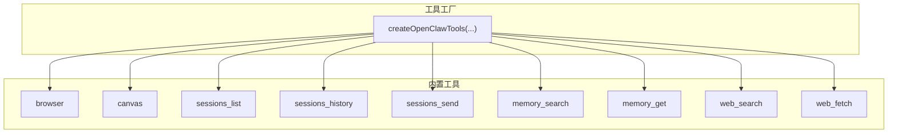
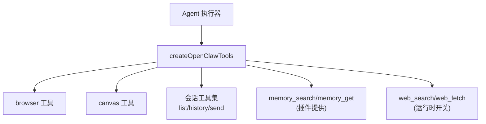
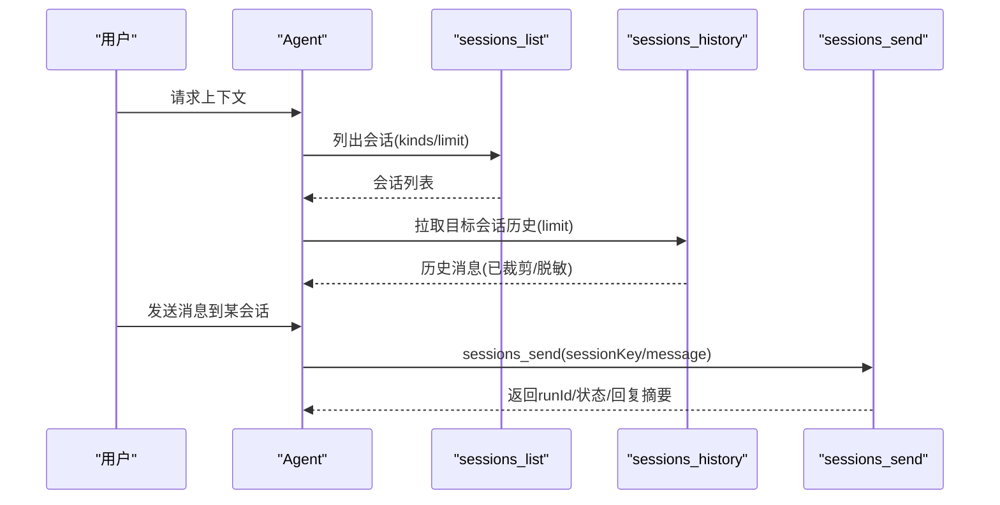
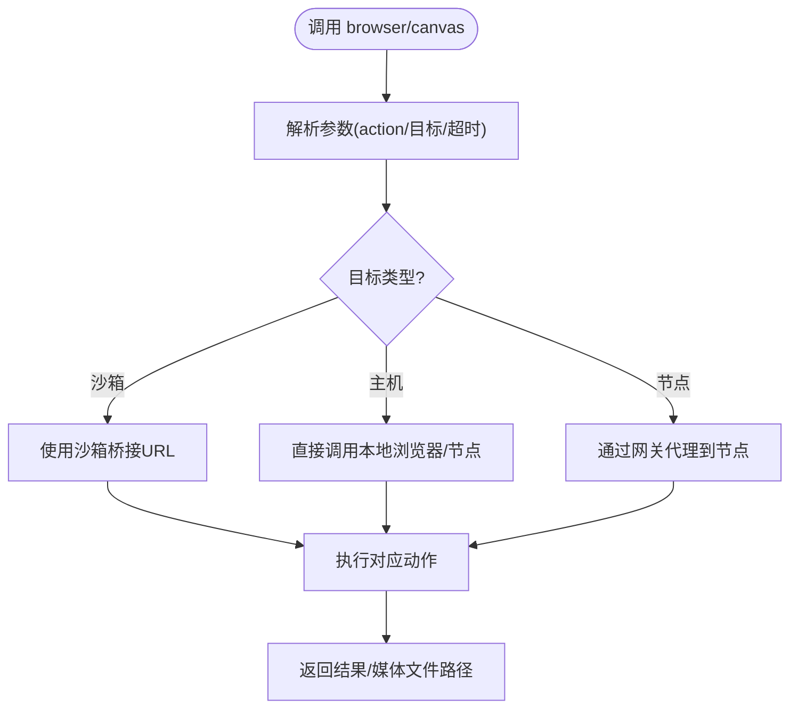
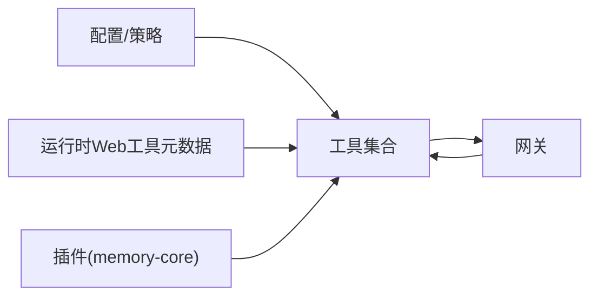

# 内置工具详解

<cite>
**本文档引用的文件**
- [src/agents/openclaw-tools.ts](file://src/agents/openclaw-tools.ts)
- [src/agents/tools/browser-tool.ts](file://src/agents/tools/browser-tool.ts)
- [src/agents/tools/canvas-tool.ts](file://src/agents/tools/canvas-tool.ts)
- [src/agents/tools/memory-tool.ts](file://src/agents/tools/memory-tool.ts)
- [src/agents/tools/sessions-list-tool.ts](file://src/agents/tools/sessions-list-tool.ts)
- [src/agents/tools/sessions-history-tool.ts](file://src/agents/tools/sessions-history-tool.ts)
- [src/agents/tools/sessions-send-tool.ts](file://src/agents/tools/sessions-send-tool.ts)
- [src/agents/tools/web-tools.ts](file://src/agents/tools/web-tools.ts)
- [extensions/memory-core/index.ts](file://extensions/memory-core/index.ts)
- [src/agents/pi-embedded-subscribe.tools.ts](file://src/agents/pi-embedded-subscribe.tools.ts)
- [src/agents/pi-tools.workspace-only-false.test.ts](file://src/agents/pi-tools.workspace-only-false.test.ts)
- [src/agents/pi-tools.workspace-paths.test.ts](file://src/agents/pi-tools.workspace-paths.test.ts)
</cite>

## 目录
1. [简介](#简介)
2. [项目结构](#项目结构)
3. [核心组件](#核心组件)
4. [架构总览](#架构总览)
5. [详细组件分析](#详细组件分析)
6. [依赖关系分析](#依赖关系分析)
7. [性能考量](#性能考量)
8. [故障排查指南](#故障排查指南)
9. [结论](#结论)
10. [附录](#附录)

## 简介
本文件面向OpenClaw内置工具系统的使用者与维护者，系统性梳理并说明以下工具类别与能力：
- 文件系统工具：read、write、edit
- 运行时工具：exec、process
- 网络工具：web_search、web_fetch
- 内存工具：memory_search、memory_get
- 会话工具：sessions_list、sessions_history、sessions_send
- UI工具：browser、canvas

内容涵盖各工具的职责边界、输入输出格式、错误处理与安全限制，并提供组合使用策略与最佳实践。

## 项目结构
OpenClaw将“工具”抽象为统一的Agent工具接口，通过集中工厂函数统一创建与注册。浏览器、画布、会话、消息、网关等工具均在此处汇聚；内存工具由插件扩展提供。

**图表来源**
- [src/agents/openclaw-tools.ts](file://src/agents/openclaw-tools.ts#L29-L222)

**章节来源**
- [src/agents/openclaw-tools.ts](file://src/agents/openclaw-tools.ts#L1-L223)

## 核心组件
- 工具工厂：集中创建并返回工具列表，支持沙箱、工作区根目录、文件系统策略、运行时Web工具元数据注入等上下文。
- 浏览器工具：封装浏览器状态、启动/停止、标签页管理、截图、PDF保存、文件上传、对话框钩子、动作执行等。
- 画布工具：节点画布呈现/隐藏、导航、脚本求值、快照、A2UI推送与重置。
- 内存工具：基于插件扩展的语义检索与片段读取，用于召回历史知识。
- 会话工具：列出会话、拉取历史、向目标会话发送消息。
- 网络工具：搜索与抓取，结合运行时配置启用或禁用。

**章节来源**
- [src/agents/openclaw-tools.ts](file://src/agents/openclaw-tools.ts#L29-L222)
- [src/agents/tools/browser-tool.ts](file://src/agents/tools/browser-tool.ts#L281-L660)
- [src/agents/tools/canvas-tool.ts](file://src/agents/tools/canvas-tool.ts#L80-L216)
- [src/agents/tools/memory-tool.ts](file://src/agents/tools/memory-tool.ts#L40-L140)
- [src/agents/tools/sessions-list-tool.ts](file://src/agents/tools/sessions-list-tool.ts#L33-L259)
- [src/agents/tools/sessions-history-tool.ts](file://src/agents/tools/sessions-history-tool.ts#L169-L271)
- [src/agents/tools/sessions-send-tool.ts](file://src/agents/tools/sessions-send-tool.ts#L35-L362)
- [src/agents/tools/web-tools.ts](file://src/agents/tools/web-tools.ts#L1-L3)
- [extensions/memory-core/index.ts](file://extensions/memory-core/index.ts#L1-L38)

## 架构总览
OpenClaw工具体系以“统一接口 + 工厂聚合 + 插件扩展”的方式组织。浏览器与画布工具可直接调用本地或代理服务；会话工具通过网关访问会话存储；内存工具由插件注册；网络工具根据运行时开关启用。

**图表来源**
- [src/agents/openclaw-tools.ts](file://src/agents/openclaw-tools.ts#L29-L222)
- [extensions/memory-core/index.ts](file://extensions/memory-core/index.ts#L10-L35)

## 详细组件分析

### 文件系统工具
- 工具名称：read、write、edit
- 职责：在工作区根目录下进行安全的文件读写与文本替换。
- 安全与策略：
  - 支持 workspaceOnly 严格模式，禁止访问工作区外路径。
  - 支持 @ 前缀绝对路径解析，严格校验是否逃逸沙箱根。
  - 默认工作目录为工作区根，exec 的工作目录可覆盖默认值。
- 输入输出要点（示例性描述）：
  - read：path 必填，返回文件内容或空字符串及禁用标志。
  - write：path、content 必填，返回写入结果。
  - edit：path、oldText、newText 必填，原子替换文本。
- 错误处理：
  - 路径逃逸、权限不足、IO异常等均抛出明确错误信息。
- 最佳实践：
  - 在沙箱环境中优先使用相对路径。
  - 使用 edit 进行小范围精确替换，避免大范围文本改写。

**章节来源**
- [src/agents/pi-tools.workspace-only-false.test.ts](file://src/agents/pi-tools.workspace-only-false.test.ts#L132-L180)
- [src/agents/pi-tools.workspace-paths.test.ts](file://src/agents/pi-tools.workspace-paths.test.ts#L104-L150)

### 运行时工具
- 工具名称：exec、process
- 职责：执行命令与进程管理（如需 Elevated 权限，遵循审批流程）。
- 关键点：
  - exec 默认工作目录为工作区根，可通过 workdir 覆盖。
  - 提供 Elevated 与普通两种执行路径，后者无需审批。
- 输入输出要点（示例性描述）：
  - exec：command 必填，可选 workdir、timeout、env 等；返回退出码、标准输出/错误等。
  - process：用于查询/控制进程生命周期（如列表、终止等）。
- 错误处理：
  - 超时、权限不足、命令不存在、环境变量非法等均抛错。
- 最佳实践：
  - 尽量限定工作目录，避免污染全局环境。
  - 对高风险命令使用 Elevated 并走审批流程。

**章节来源**
- [src/agents/bash-tools.ts](file://src/agents/bash-tools.ts#L1-L10)

### 网络工具
- 工具名称：web_search、web_fetch
- 职责：在线搜索与网页抓取，结合运行时开关启用。
- 关键点：
  - web_search：语义化检索，返回相关条目。
  - web_fetch：抓取页面正文与资源，可选 Firecrawl。
  - 工具是否可用由运行时Web工具元数据决定。
- 输入输出要点（示例性描述）：
  - web_search：query 必填，可选 maxResults、filters 等；返回条目列表。
  - web_fetch：url 必填，可选 timeout、headers 等；返回标题、正文、链接等。
- 错误处理：
  - 网络超时、反爬/风控、内容不可读等均抛错。
- 最佳实践：
  - 搜索后先抓取关键链接，再进行深度阅读。
  - 控制并发与频率，避免触发风控。

**章节来源**
- [src/agents/openclaw-tools.ts](file://src/agents/openclaw-tools.ts#L102-L111)
- [src/agents/tools/web-tools.ts](file://src/agents/tools/web-tools.ts#L1-L3)

### 内存工具
- 工具名称：memory_search、memory_get
- 职责：对 MEMORY.md 与 memory/*.md 进行语义检索与片段读取。
- 关键点：
  - 由 memory-core 插件注册，作为内置工具的一部分。
  - 检索前必须初始化内存搜索管理器；若不可用则返回禁用标志。
- 输入输出要点（示例性描述）：
  - memory_search：query 必填，可选 maxResults、minScore；返回匹配片段（含路径与行号）。
  - memory_get：path 必填，可选 from、lines；返回指定片段文本。
- 错误处理：
  - 初始化失败、IO异常、路径无效等均返回禁用标志或错误信息。
- 最佳实践：
  - 先检索再精读，减少上下文膨胀。
  - 使用 from/lines 精准定位，避免返回整段内容。

**章节来源**
- [src/agents/tools/memory-tool.ts](file://src/agents/tools/memory-tool.ts#L40-L140)
- [extensions/memory-core/index.ts](file://extensions/memory-core/index.ts#L10-L35)

### 会话工具
- 工具名称：sessions_list、sessions_history、sessions_send
- 职责：会话发现、历史回溯、跨会话消息发送。
- 关键点：
  - sessions_list：支持过滤类型、活跃时间、消息数量等；可并发拉取最近消息。
  - sessions_history：按会话键获取消息历史，内置敏感内容裁剪与大小限制。
  - sessions_send：支持按会话键或标签名发送消息；支持 A2A 策略与可见性控制。
- 输入输出要点（示例性描述）：
  - sessions_list：返回计数与会话列表，每项含通道、模型、令牌用量等。
  - sessions_history：返回消息数组，支持裁剪与脱敏。
  - sessions_send：返回 runId、状态、回复摘要与投递状态。
- 错误处理：
  - 无权限、会话不可见、标签解析失败、等待超时等均有明确状态与错误信息。
- 最佳实践：
  - 发送前先 sessions_list 或 sessions_history 获取上下文。
  - 使用标签名时注意 A2A 策略与沙箱限制。

**图表来源**
- [src/agents/tools/sessions-list-tool.ts](file://src/agents/tools/sessions-list-tool.ts#L33-L259)
- [src/agents/tools/sessions-history-tool.ts](file://src/agents/tools/sessions-history-tool.ts#L169-L271)
- [src/agents/tools/sessions-send-tool.ts](file://src/agents/tools/sessions-send-tool.ts#L35-L362)

**章节来源**
- [src/agents/tools/sessions-list-tool.ts](file://src/agents/tools/sessions-list-tool.ts#L33-L259)
- [src/agents/tools/sessions-history-tool.ts](file://src/agents/tools/sessions-history-tool.ts#L169-L271)
- [src/agents/tools/sessions-send-tool.ts](file://src/agents/tools/sessions-send-tool.ts#L35-L362)

### UI工具
- 工具名称：browser、canvas
- 职责：浏览器控制与节点画布操作。
- 关键点：
  - browser：支持沙箱/主机/节点三种目标；自动路由至节点代理；提供状态、启动/停止、标签页、截图、PDF、文件上传、对话框钩子、动作执行等。
  - canvas：节点画布呈现/隐藏、导航、脚本求值、快照、A2UI推送与重置。
- 输入输出要点（示例性描述）：
  - browser：action 必填（如 status/start/stop/profiles/tabs/open/focus/close/snapshot/screenshot/navigate/console/pdf/upload/dialog/act），其余参数按 action 变化。
  - canvas：action 必填（present/hide/navigate/eval/snapshot/a2ui_push/a2ui_reset），其余参数按 action 变化。
- 错误处理：
  - 目标不可用、代理失败、超时、路径不在允许范围内等均抛错。
- 最佳实践：
  - 使用 snapshot 生成稳定引用；后续操作复用 targetId/ref。
  - 截图与PDF保存返回本地文件路径，便于后续处理。

**图表来源**
- [src/agents/tools/browser-tool.ts](file://src/agents/tools/browser-tool.ts#L281-L660)
- [src/agents/tools/canvas-tool.ts](file://src/agents/tools/canvas-tool.ts#L80-L216)

**章节来源**
- [src/agents/tools/browser-tool.ts](file://src/agents/tools/browser-tool.ts#L281-L660)
- [src/agents/tools/canvas-tool.ts](file://src/agents/tools/canvas-tool.ts#L80-L216)

## 依赖关系分析
- 工具工厂依赖配置、运行时Web工具元数据、沙箱与文件系统策略、会话键等上下文，统一产出工具集合。
- 浏览器与画布工具依赖网关节点能力与代理机制，支持多目标路由。
- 会话工具依赖网关的 sessions.chat.history 与 agent 接口，配合可见性与A2A策略。
- 内存工具由插件注册，作为工具集合的一部分参与统一调度。

**图表来源**
- [src/agents/openclaw-tools.ts](file://src/agents/openclaw-tools.ts#L29-L222)
- [extensions/memory-core/index.ts](file://extensions/memory-core/index.ts#L10-L35)

**章节来源**
- [src/agents/openclaw-tools.ts](file://src/agents/openclaw-tools.ts#L29-L222)
- [extensions/memory-core/index.ts](file://extensions/memory-core/index.ts#L10-L35)

## 性能考量
- 并发与限流：sessions_list 在拉取最近消息时采用并发工作线程，建议限制并发度避免阻塞。
- 历史裁剪：sessions_history 对内容长度与字节数进行硬上限与软裁剪，避免单次响应过大。
- 网络抓取：web_fetch 建议设置合理超时与重试，避免长时间占用资源。
- 浏览器/画布：截图与PDF保存会产生临时文件，注意清理与磁盘空间。

## 故障排查指南
- 浏览器工具
  - 无法连接：检查浏览器启用状态、沙箱桥接URL、节点代理可达性。
  - 动作失败：确认 targetId/ref 是否来自同一标签页快照；必要时重新 snapshot。
- 画布工具
  - 路径越权：jsonlPath 必须位于允许的媒体根目录内，否则被拒绝。
- 会话工具
  - sessions_list：检查 kinds/limit/activeMinutes 参数范围；确认可见性策略。
  - sessions_history：关注内容裁剪与脱敏标记；必要时降低 limit。
  - sessions_send：核对 sessionKey/label 解析结果；检查 A2A 策略与沙箱限制。
- 内存工具
  - 检索不可用：确认内存搜索管理器初始化成功；检查配置与权限。
- 文件系统工具
  - 路径逃逸：启用 workspaceOnly 后，@ 绝对路径会被拒绝；请使用相对路径或允许范围内的路径。

**章节来源**
- [src/agents/tools/browser-tool.ts](file://src/agents/tools/browser-tool.ts#L251-L279)
- [src/agents/tools/canvas-tool.ts](file://src/agents/tools/canvas-tool.ts#L30-L51)
- [src/agents/tools/sessions-list-tool.ts](file://src/agents/tools/sessions-list-tool.ts#L56-L77)
- [src/agents/tools/sessions-history-tool.ts](file://src/agents/tools/sessions-history-tool.ts#L31-L45)
- [src/agents/tools/sessions-send-tool.ts](file://src/agents/tools/sessions-send-tool.ts#L66-L105)
- [src/agents/tools/memory-tool.ts](file://src/agents/tools/memory-tool.ts#L59-L65)
- [src/agents/pi-tools.workspace-only-false.test.ts](file://src/agents/pi-tools.workspace-only-false.test.ts#L132-L180)

## 结论
OpenClaw内置工具体系以统一接口与工厂化聚合为核心，围绕“安全沙箱 + 可插拔扩展 + 策略驱动”的设计，覆盖文件系统、运行时、网络、内存、会话与UI等关键领域。通过严格的路径与可见性策略、历史裁剪与大小限制、以及节点代理路由，既保证了灵活性，也确保了安全性与稳定性。建议在实际使用中遵循最佳实践，合理组合工具以达成高效可靠的自动化流程。

## 附录
- 工具组合使用策略
  - 信息收集：web_search → web_fetch → memory_search → memory_get → sessions_history
  - 自动化交互：browser/screenshot → canvas/snapshot → sessions_send
  - 跨会话协作：sessions_list → sessions_send（A2A 策略）
- 安全与合规
  - 严格启用 workspaceOnly，避免路径逃逸。
  - 对敏感内容进行裁剪与脱敏，遵守最小披露原则。
  - 遵循网关与节点代理的超时与并发限制。