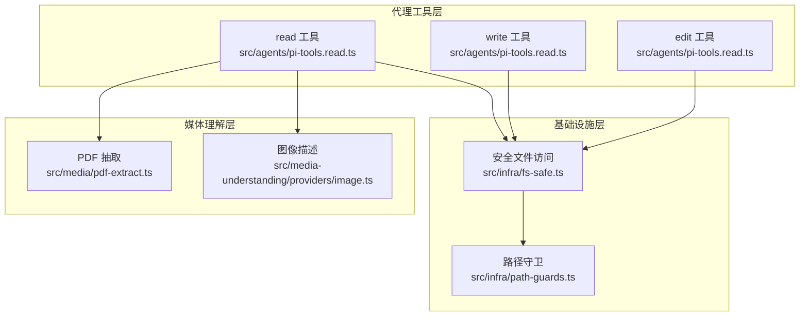
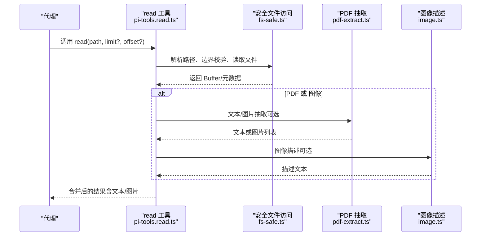
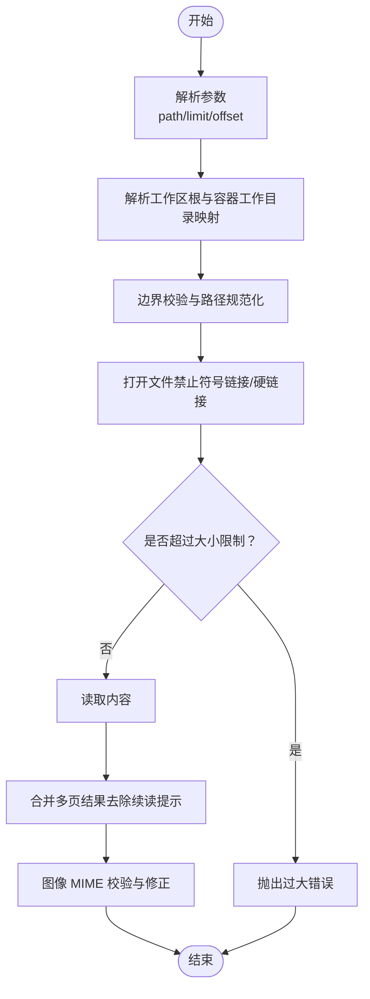
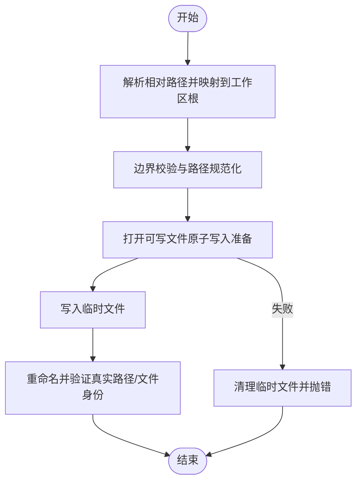
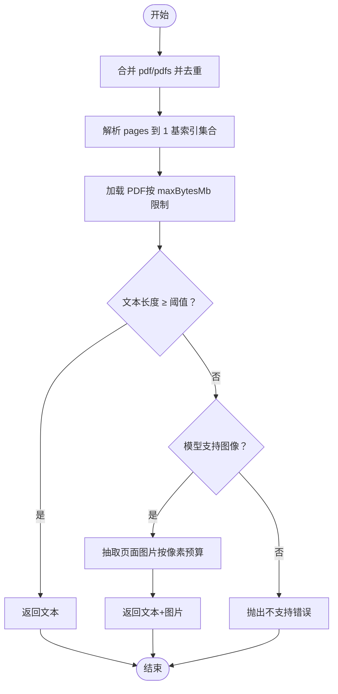
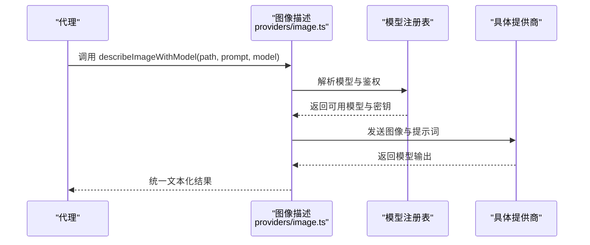
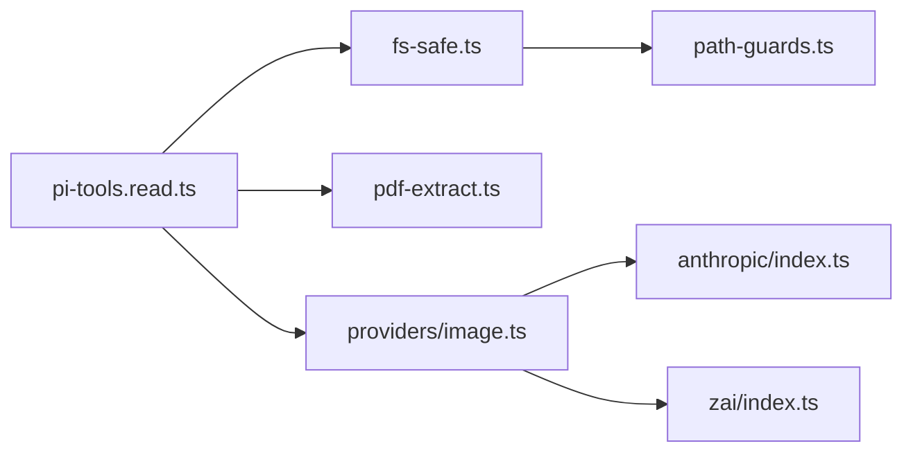

# 文件系统工具

<cite>
**本文引用的文件**
- [src/agents/pi-tools.read.ts](file://src/agents/pi-tools.read.ts)
- [src/infra/fs-safe.ts](file://src/infra/fs-safe.ts)
- [src/infra/path-guards.ts](file://src/infra/path-guards.ts)
- [src/media/pdf-extract.ts](file://src/media/pdf-extract.ts)
- [src/agents/tools/pdf-tool.ts](file://src/agents/tools/pdf-tool.ts)
- [docs/tools/pdf.md](file://docs/tools/pdf.md)
- [src/media-understanding/providers/image.ts](file://src/media-understanding/providers/image.ts)
- [src/media-understanding/providers/anthropic/index.ts](file://src/media-understanding/providers/anthropic/index.ts)
- [src/media-understanding/providers/zai/index.ts](file://src/media-understanding/providers/zai/index.ts)
</cite>

## 目录
1. [简介](#简介)
2. [项目结构](#项目结构)
3. [核心组件](#核心组件)
4. [架构总览](#架构总览)
5. [详细组件分析](#详细组件分析)
6. [依赖关系分析](#依赖关系分析)
7. [性能考量](#性能考量)
8. [故障排查指南](#故障排查指南)
9. [结论](#结论)
10. [附录](#附录)

## 简介
本文件系统工具文档聚焦于 OpenClaw 的文件读取与写入能力，以及围绕 PDF 和图像的处理工具。内容涵盖：
- 文件读取工具（read_file）：参数、输入输出格式、路径解析与安全边界、分页读取与截断提示。
- 文件写入工具（write_file）：参数、写入策略、原子替换与边界校验、追加写入与工作区隔离。
- PDF 处理工具（pdf_extract_text、pdf_extract_images）：文本与图片抽取、页面范围过滤、像素与字数阈值。
- 图像处理工具（image_analyze、image_describe）：模型选择与调用、图像 MIME 类型检测与修正、结果净化。

同时，文档提供安全限制说明（路径遍历防护、硬链接与符号链接限制、文件大小限制）与典型使用场景（文件上传下载、文本提取、图像分析），并给出可视化流程图帮助理解。

## 项目结构
OpenClaw 将文件系统工具与媒体理解工具解耦：
- 文件系统安全与路径策略位于基础设施层（fs-safe、path-guards）。
- 代理工具封装（read、write、edit）位于 pi-tools 层，并提供沙箱与宿主两种执行环境。
- 媒体理解（PDF、图像）工具位于 agents/tools 与 media-understanding/providers。

图表来源
- [src/agents/pi-tools.read.ts](file://src/agents/pi-tools.read.ts#L639-L669)
- [src/infra/fs-safe.ts](file://src/infra/fs-safe.ts#L177-L228)
- [src/infra/path-guards.ts](file://src/infra/path-guards.ts#L35-L49)
- [src/media/pdf-extract.ts](file://src/media/pdf-extract.ts#L42-L104)
- [src/media-understanding/providers/image.ts](file://src/media-understanding/providers/image.ts#L19-L79)

章节来源
- [src/agents/pi-tools.read.ts](file://src/agents/pi-tools.read.ts#L639-L669)
- [src/infra/fs-safe.ts](file://src/infra/fs-safe.ts#L177-L228)
- [src/media/pdf-extract.ts](file://src/media/pdf-extract.ts#L42-L104)
- [src/media-understanding/providers/image.ts](file://src/media-understanding/providers/image.ts#L19-L79)

## 核心组件
- 文件读取工具（read_file）
  - 支持自适应分页读取，按上下文窗口估算最大读取字节数，避免超限。
  - 自动剥离“截断续读”提示，合并多页结果；对图像 MIME 进行二次校验与修正。
  - 提供沙箱与宿主两种执行模式，支持容器工作目录映射与工作区根路径约束。
- 文件写入工具（write_file）
  - 原子写入：先写临时文件，再重命名替换，失败时清理临时文件。
  - 边界校验：严格限制在工作区根内，拒绝符号链接与硬链接，防止路径别名逃逸。
  - 支持追加写入与自动补行首换行，确保日志类文件的可读性。
- PDF 处理工具（pdf_extract_text、pdf_extract_images）
  - 文本抽取：基于 pdfjs-dist，按页面聚合文本；当文本长度不足阈值时，转为图片抽取。
  - 图片抽取：基于 @napi-rs/canvas，按像素预算缩放渲染 PNG，返回 Base64 数据。
  - 页面过滤：支持 1 基索引的连续范围与离散集合，自动去重、排序与裁剪。
- 图像处理工具（image_analyze、image_describe）
  - 模型发现与鉴权：根据代理配置解析可用模型与密钥，支持 Minimax/VLM 特殊路径。
  - 描述生成：构造消息上下文，调用模型完成接口，统一结果文本化。

章节来源
- [src/agents/pi-tools.read.ts](file://src/agents/pi-tools.read.ts#L639-L669)
- [src/infra/fs-safe.ts](file://src/infra/fs-safe.ts#L547-L589)
- [src/media/pdf-extract.ts](file://src/media/pdf-extract.ts#L42-L104)
- [src/media-understanding/providers/image.ts](file://src/media-understanding/providers/image.ts#L19-L79)

## 架构总览
下图展示从代理调用到文件系统与媒体理解的完整链路，以及安全边界检查点。

图表来源
- [src/agents/pi-tools.read.ts](file://src/agents/pi-tools.read.ts#L639-L669)
- [src/infra/fs-safe.ts](file://src/infra/fs-safe.ts#L212-L247)
- [src/media/pdf-extract.ts](file://src/media/pdf-extract.ts#L42-L104)
- [src/media-understanding/providers/image.ts](file://src/media-understanding/providers/image.ts#L19-L79)

## 详细组件分析

### 文件读取工具（read_file）
- 参数
  - path：必填，本地路径或 file:// URL，支持 ~ 展开。
  - limit：可选，显式限制读取字节数；未设置时按上下文窗口自适应。
  - offset：可选，起始行偏移，用于分页读取。
- 输入输出
  - 输入：字符串路径或 URL。
  - 输出：文本块与可选图像块；若为图片，会进行 MIME 校验与修正。
- 路径处理规则
  - 容器工作目录映射：将容器内的工作目录前缀映射回宿主工作区根。
  - 绝对/相对路径解析：绝对路径直接解析，相对路径基于工作区根。
  - 工作区边界：拒绝越界路径，抛出安全错误。
- 安全限制
  - 禁止符号链接与硬链接打开，防止路径别名攻击。
  - 文件大小限制：若超过限制，抛出“过大”错误。
  - 截断续读：自动剥离续读提示，合并多页文本。
- 使用示例
  - 读取单文件全文（受上下文窗口限制）。
  - 分页读取大文件：通过 offset 逐步拉取。
  - 读取图片并获取其 MIME 类型，随后进行图像分析。

图表来源
- [src/agents/pi-tools.read.ts](file://src/agents/pi-tools.read.ts#L639-L669)
- [src/infra/fs-safe.ts](file://src/infra/fs-safe.ts#L281-L294)

章节来源
- [src/agents/pi-tools.read.ts](file://src/agents/pi-tools.read.ts#L639-L669)
- [src/infra/fs-safe.ts](file://src/infra/fs-safe.ts#L177-L228)

### 文件写入工具（write_file）
- 参数
  - path：必填，目标路径（工作区内）。
  - content：必填，要写入的内容（字符串或 Buffer）。
  - mkdir：可选，不存在时自动创建父目录。
- 写入策略
  - 原子替换：写入临时文件，校验后重命名为目标文件，保证一致性。
  - 追加写入：支持在现有文件末尾追加，必要时自动添加换行。
- 安全限制
  - 仅允许在工作区根内写入，拒绝越界。
  - 禁止符号链接与硬链接，防止路径别名逃逸。
  - 写入前后进行真实路径与文件身份校验，失败则发出安全警告并回滚。
- 使用示例
  - 在工作区内写入配置文件。
  - 追加日志条目，自动处理换行。
  - 从外部复制文件到工作区，带大小限制与原子替换。

图表来源
- [src/infra/fs-safe.ts](file://src/infra/fs-safe.ts#L547-L589)

章节来源
- [src/infra/fs-safe.ts](file://src/infra/fs-safe.ts#L380-L501)

### PDF 处理工具（pdf_extract_text、pdf_extract_images）
- 参数
  - pdf/pdfs：单个或多个 PDF 路径/URL（最多 10 个）。
  - prompt：分析提示词，默认“Analyze this PDF document.”。
  - pages：页面范围，如“1-5”、“1,3,5-7”，1 基索引。
  - model：可选模型覆盖（provider/model）。
  - maxBytesMb：单个 PDF 最大大小（MB），默认来自配置或 10MB。
- 行为
  - 文本优先：若抽取出足够长的文本，则直接返回文本。
  - 图片回退：若文本不足且模型不支持图像输入，则抽取页面图片（PNG）。
  - 页面过滤：解析并裁剪至最大页数。
- 安全与限制
  - 本地路径、file://、http(s):// 均受支持。
  - 文本最小字符数与像素上限阈值控制资源消耗。
- 使用示例
  - 单篇 PDF 文本摘要。
  - 多 PDF 合并分析（最多 10 个）。
  - 仅需图片的场景（如 OCR 预处理）。

图表来源
- [src/agents/tools/pdf-tool.ts](file://src/agents/tools/pdf-tool.ts#L357-L367)
- [src/media/pdf-extract.ts](file://src/media/pdf-extract.ts#L42-L104)
- [docs/tools/pdf.md](file://docs/tools/pdf.md#L30-L50)

章节来源
- [src/agents/tools/pdf-tool.ts](file://src/agents/tools/pdf-tool.ts#L311-L367)
- [src/media/pdf-extract.ts](file://src/media/pdf-extract.ts#L42-L104)
- [docs/tools/pdf.md](file://docs/tools/pdf.md#L1-L50)

### 图像处理工具（image_analyze、image_describe）
- 参数
  - path：图像路径或 URL。
  - prompt：描述提示词（默认“Describe the image.”）。
  - model：可选模型覆盖（provider/model）。
- 行为
  - 模型发现：根据代理配置与认证存储解析可用模型。
  - Minimax/VLM 特殊路径：针对特定提供商走专用接口。
  - 结果文本化：统一将模型输出转换为稳定文本格式。
- 使用示例
  - 对图片进行视觉描述。
  - 与 PDF 工具配合：在无文本时抽取图片进行分析。

图表来源
- [src/media-understanding/providers/image.ts](file://src/media-understanding/providers/image.ts#L19-L79)
- [src/media-understanding/providers/anthropic/index.ts](file://src/media-understanding/providers/anthropic/index.ts#L4-L8)
- [src/media-understanding/providers/zai/index.ts](file://src/media-understanding/providers/zai/index.ts#L4-L8)

章节来源
- [src/media-understanding/providers/image.ts](file://src/media-understanding/providers/image.ts#L19-L79)
- [src/media-understanding/providers/anthropic/index.ts](file://src/media-understanding/providers/anthropic/index.ts#L4-L8)
- [src/media-understanding/providers/zai/index.ts](file://src/media-understanding/providers/zai/index.ts#L4-L8)

## 依赖关系分析
- 代理工具层依赖基础设施层的安全文件访问与路径守卫，确保所有文件操作在工作区内进行。
- PDF 抽取与图像描述分别作为独立模块被读取工具调用，形成清晰的职责分离。
- 提供商适配层（Anthropic/Zai）通过统一接口暴露图像描述能力。

图表来源
- [src/agents/pi-tools.read.ts](file://src/agents/pi-tools.read.ts#L639-L669)
- [src/infra/fs-safe.ts](file://src/infra/fs-safe.ts#L177-L228)
- [src/media/pdf-extract.ts](file://src/media/pdf-extract.ts#L42-L104)
- [src/media-understanding/providers/image.ts](file://src/media-understanding/providers/image.ts#L19-L79)
- [src/media-understanding/providers/anthropic/index.ts](file://src/media-understanding/providers/anthropic/index.ts#L4-L8)
- [src/media-understanding/providers/zai/index.ts](file://src/media-understanding/providers/zai/index.ts#L4-L8)

章节来源
- [src/agents/pi-tools.read.ts](file://src/agents/pi-tools.read.ts#L639-L669)
- [src/infra/fs-safe.ts](file://src/infra/fs-safe.ts#L177-L228)
- [src/media/pdf-extract.ts](file://src/media/pdf-extract.ts#L42-L104)
- [src/media-understanding/providers/image.ts](file://src/media-understanding/providers/image.ts#L19-L79)

## 性能考量
- 自适应读取：根据模型上下文窗口动态计算每页最大字节数，避免一次性读取过多导致内存压力。
- PDF 抽取：文本优先策略减少不必要的图片渲染；像素预算控制图片质量与体积。
- 原子写入：临时文件写入与重命名降低并发写入冲突风险，提升可靠性。
- 追加写入：在日志场景中减少随机写，提高顺序写入性能。

## 故障排查指南
- “文件过大”错误
  - 现象：读取或复制文件时报错，提示超出大小限制。
  - 排查：确认 maxBytes/maxBytesMb 设置；考虑分页读取或调整阈值。
  - 参考：[src/infra/fs-safe.ts](file://src/infra/fs-safe.ts#L282-L287)
- “路径越界/无效路径”
  - 现象：写入或读取时提示路径不在工作区根内或不是常规文件。
  - 排查：检查相对路径与工作区根映射；避免符号链接与硬链接。
  - 参考：[src/infra/fs-safe.ts](file://src/infra/fs-safe.ts#L177-L210)
- “符号链接/硬链接被阻止”
  - 现象：打开文件时报错，提示不允许符号链接或硬链接。
  - 排查：确认目标文件不是符号链接或具有多个硬链接。
  - 参考：[src/infra/fs-safe.ts](file://src/infra/fs-safe.ts#L108-L131)
- “PDF 模型不支持图像”
  - 现象：在无文本时尝试抽取图片但模型不支持图像输入。
  - 排查：更换支持图像输入的模型或启用文本优先策略。
  - 参考：[src/agents/tools/pdf-tool.ts](file://src/agents/tools/pdf-tool.ts#L248-L254)

章节来源
- [src/infra/fs-safe.ts](file://src/infra/fs-safe.ts#L108-L131)
- [src/infra/fs-safe.ts](file://src/infra/fs-safe.ts#L282-L287)
- [src/agents/tools/pdf-tool.ts](file://src/agents/tools/pdf-tool.ts#L248-L254)

## 结论
OpenClaw 的文件系统工具以“安全优先、边界明确”为核心设计原则，结合自适应读取、原子写入与严格的路径校验，有效降低了文件操作风险。PDF 与图像工具通过“文本优先、图片回退”的策略，在不同提供商能力下保持一致的用户体验。建议在生产环境中：
- 明确配置工作区根与只允许工作区写入策略；
- 合理设置 PDF 与图像的大小与像素阈值；
- 使用分页读取与追加写入优化大文件处理。

## 附录
- 实际使用示例（场景化）
  - 文件上传下载：通过 PDF/图像工具读取并分析，再写入到工作区指定路径。
  - 文本提取：对 PDF 执行文本抽取，满足摘要与检索需求。
  - 图像分析：对图片进行描述，辅助多模态问答与内容理解。
- 安全最佳实践
  - 始终启用工作区边界限制；
  - 禁用符号链接与硬链接；
  - 对大文件采用分页读取与原子写入；
  - 在多模态场景中，优先选择具备图像输入能力的模型。