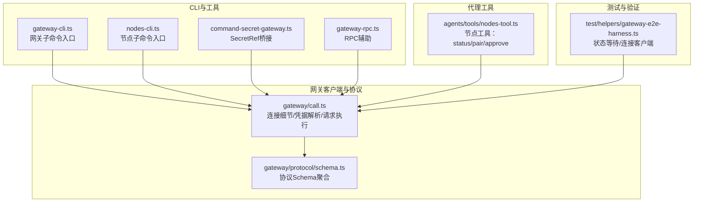
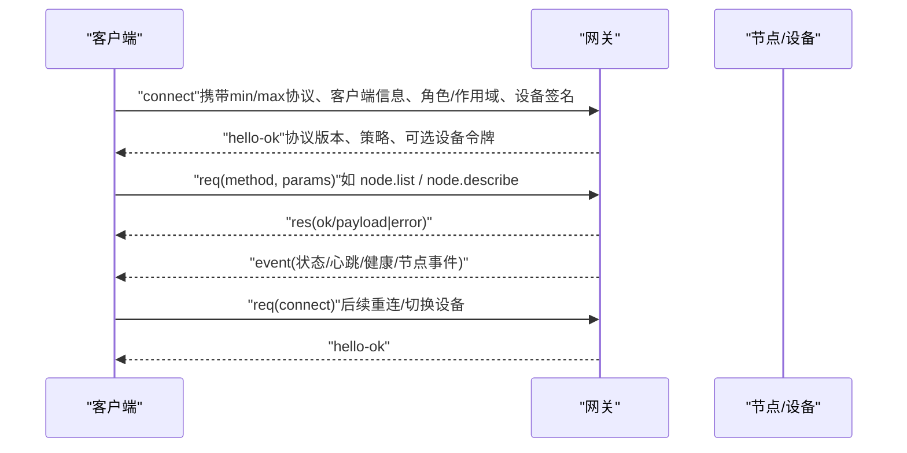
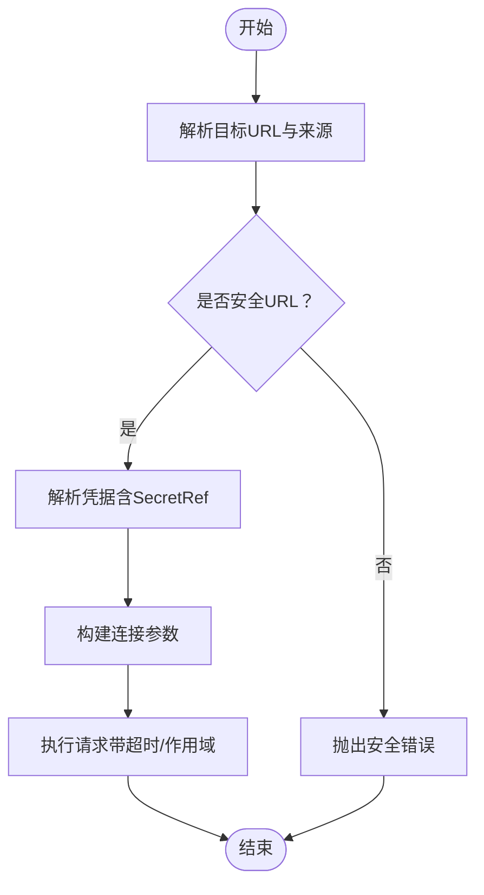
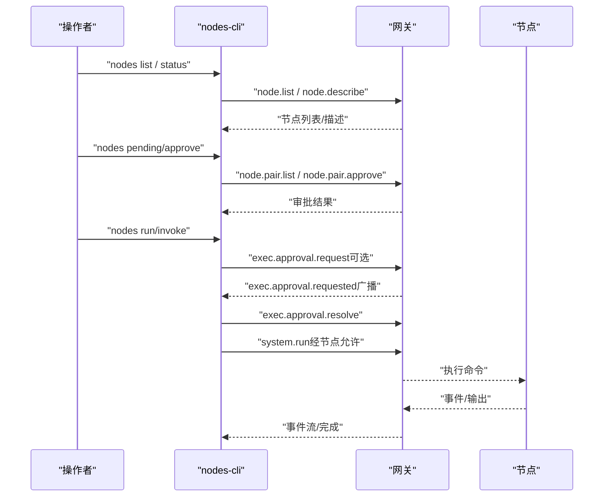
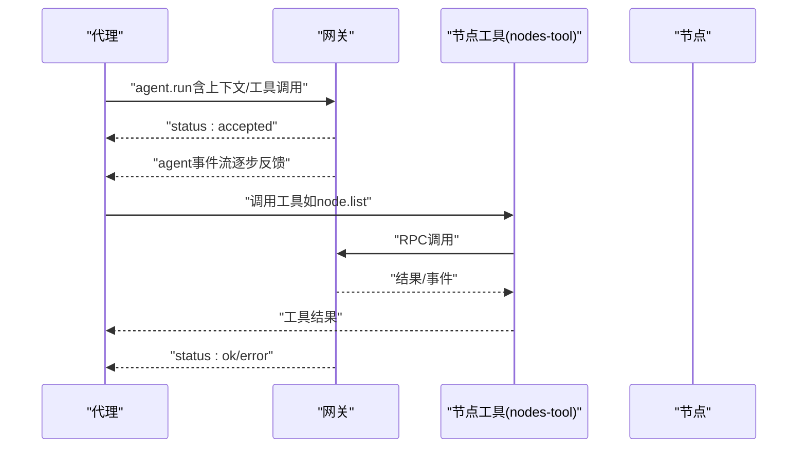
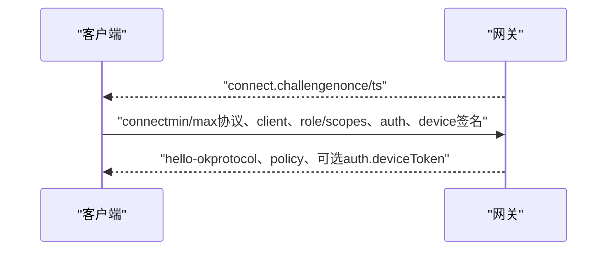
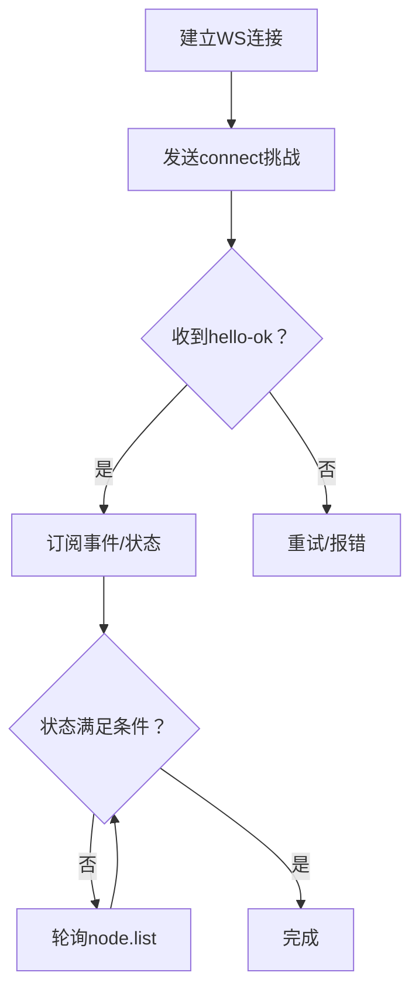
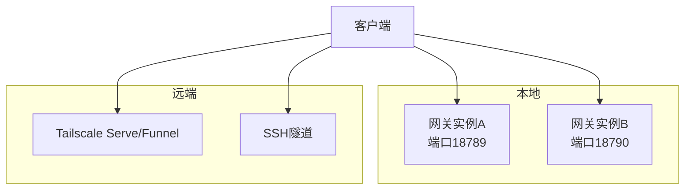
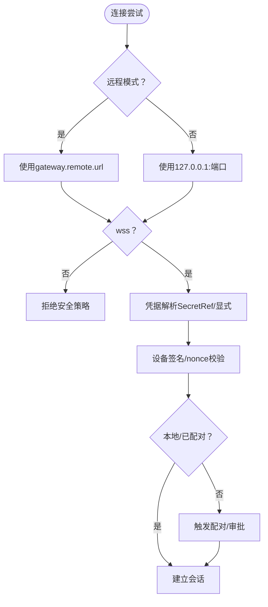
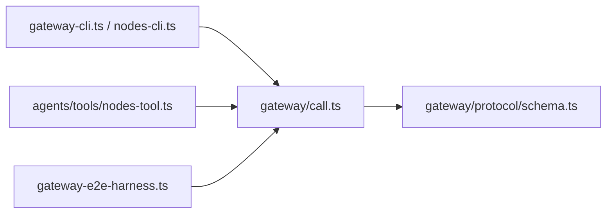

# 网关工具

<cite>
**本文引用的文件**
- [docs/gateway/index.md](file://docs/gateway/index.md)
- [docs/gateway/protocol.md](file://docs/gateway/protocol.md)
- [docs/cli/gateway.md](file://docs/cli/gateway.md)
- [docs/cli/nodes.md](file://docs/cli/nodes.md)
- [docs/gateway/security/index.md](file://docs/gateway/security/index.md)
- [src/gateway/call.ts](file://src/gateway/call.ts)
- [src/gateway/protocol/schema.ts](file://src/gateway/protocol/schema.ts)
- [src/cli/command-secret-gateway.ts](file://src/cli/command-secret-gateway.ts)
- [src/cli/gateway-cli.ts](file://src/cli/gateway-cli.ts)
- [src/cli/gateway-rpc.ts](file://src/cli/gateway-rpc.ts)
- [src/cli/nodes-cli.ts](file://src/cli/nodes-cli.ts)
- [src/agents/tools/nodes-tool.ts](file://src/agents/tools/nodes-tool.ts)
- [src/gateway/server.auth.control-ui.suite.ts](file://src/gateway/server.auth.control-ui.suite.ts)
- [src/gateway/server-methods/devices.ts](file://src/gateway/server-methods/devices.ts)
- [test/helpers/gateway-e2e-harness.ts](file://test/helpers/gateway-e2e-harness.ts)
</cite>

## 目录
1. [简介](#简介)
2. [项目结构](#项目结构)
3. [核心组件](#核心组件)
4. [架构总览](#架构总览)
5. [详细组件分析](#详细组件分析)
6. [依赖关系分析](#依赖关系分析)
7. [性能与可靠性](#性能与可靠性)
8. [故障排查指南](#故障排查指南)
9. [结论](#结论)
10. [附录：使用示例与最佳实践](#附录使用示例与最佳实践)

## 简介
本文件面向OpenClaw网关工具的技术文档，聚焦以下能力与主题：
- 网关通信工具：gateway_connect、gateway_status 的连接与状态查询机制
- 节点管理工具：nodes_list、nodes_control 的节点发现、配对审批与远程执行
- 代理步进工具：agent_step 的代理运行与事件流处理
- 网关协议与握手：WebSocket控制面与事件模型、角色与作用域、设备身份与配对
- 连接管理与状态同步：重连、超时、错误处理与健康检查
- 分布式代理协调、节点发现与负载均衡：多网关、Bonjour、Tailnet、SSH隧道
- 安全机制：认证、授权、TLS指纹、反向代理与可信代理认证
- 故障转移策略：本地回退、远程模式、端口冲突与服务生命周期

## 项目结构
OpenClaw将“网关”作为统一的WebSocket控制平面与节点传输层，CLI与各平台客户端通过该通道进行连接、鉴权、状态查询与方法调用。关键目录与职责概览：
- docs/gateway：网关运行手册、协议规范、安全与诊断
- src/gateway：网关客户端封装、协议Schema、服务器端方法与认证测试
- src/cli：网关CLI命令实现（gateway、nodes等）、RPC辅助与SecretRef桥接
- src/agents：代理工具（如nodes-tool），通过网关RPC调用节点能力
- test/helpers：端到端测试夹具，包含状态等待与连接客户端

**图表来源**
- [src/cli/gateway-cli.ts](file://src/cli/gateway-cli.ts#L1-L200)
- [src/cli/nodes-cli.ts](file://src/cli/nodes-cli.ts#L1-L2)
- [src/cli/command-secret-gateway.ts](file://src/cli/command-secret-gateway.ts#L1-L200)
- [src/cli/gateway-rpc.ts](file://src/cli/gateway-rpc.ts#L1-L200)
- [src/gateway/call.ts](file://src/gateway/call.ts#L1-L250)
- [src/gateway/protocol/schema.ts](file://src/gateway/protocol/schema.ts#L1-L19)
- [src/agents/tools/nodes-tool.ts](file://src/agents/tools/nodes-tool.ts#L180-L220)
- [test/helpers/gateway-e2e-harness.ts](file://test/helpers/gateway-e2e-harness.ts#L313-L362)

**章节来源**
- [docs/gateway/index.md](file://docs/gateway/index.md#L1-L262)
- [docs/gateway/protocol.md](file://docs/gateway/protocol.md#L1-L261)
- [docs/cli/gateway.md](file://docs/cli/gateway.md#L1-L215)
- [docs/cli/nodes.md](file://docs/cli/nodes.md#L1-L76)

## 核心组件
- 网关连接与调用封装（gateway/call.ts）
  - 解析配置与URL优先级、凭据解析（SecretRef支持）、TLS指纹、超时与安全校验
  - 统一的请求执行器，支持作用域最小化、最终响应等待与错误格式化
- 网关协议（gateway/protocol/schema.ts）
  - 协议版本、帧类型（req/res/event）、角色与作用域、节点能力声明与权限
- CLI网关命令（cli/gateway-cli.ts、cli/gateway-rpc.ts）
  - 提供gateway health/status/probe/call等子命令，支持JSON输出与超时控制
- CLI节点命令（cli/nodes-cli.ts）
  - 提供nodes list/status/pending/approve/run/invoke等子命令
- 代理节点工具（agents/tools/nodes-tool.ts）
  - 将节点能力以工具形式暴露给代理，调用网关RPC完成节点状态与配对操作
- 测试夹具（test/helpers/gateway-e2e-harness.ts）
  - 提供状态等待与连接客户端，用于端到端验证节点连接与配对状态

**章节来源**
- [src/gateway/call.ts](file://src/gateway/call.ts#L1-L250)
- [src/gateway/protocol/schema.ts](file://src/gateway/protocol/schema.ts#L1-L19)
- [src/cli/gateway-cli.ts](file://src/cli/gateway-cli.ts#L1-L200)
- [src/cli/gateway-rpc.ts](file://src/cli/gateway-rpc.ts#L1-L200)
- [src/cli/nodes-cli.ts](file://src/cli/nodes-cli.ts#L1-L2)
- [src/agents/tools/nodes-tool.ts](file://src/agents/tools/nodes-tool.ts#L180-L220)
- [test/helpers/gateway-e2e-harness.ts](file://test/helpers/gateway-e2e-harness.ts#L313-L362)

## 架构总览
OpenClaw网关采用“单控制面+节点传输”的WebSocket架构，所有客户端（CLI、Web UI、移动端、节点）均通过WS连接，首帧必须为connect请求。网关返回hello-ok快照，随后通过req/res与event进行双向交互。

**图表来源**
- [docs/gateway/protocol.md](file://docs/gateway/protocol.md#L20-L90)
- [docs/gateway/protocol.md](file://docs/gateway/protocol.md#L127-L134)

**章节来源**
- [docs/gateway/protocol.md](file://docs/gateway/protocol.md#L10-L134)

## 详细组件分析

### 网关连接与调用（gateway_connect/gateway_status）
- 连接细节与URL解析
  - 支持CLI/环境变量/配置/远程模式的URL优先级；本地自连接强制loopback
  - 安全检查：非loopback地址禁止明文ws://，除非显式允许
- 凭据解析与SecretRef
  - 支持gateway.auth与gateway.remote的token/password SecretRef解析
  - 显式URL覆盖要求显式凭据，避免隐式设备令牌回退
- 请求执行与作用域
  - 最小权限作用域推导、最终响应等待、超时与错误格式化
  - 可选TLS指纹校验（本地TLS或远程配置）

**图表来源**
- [src/gateway/call.ts](file://src/gateway/call.ts#L137-L226)
- [src/gateway/call.ts](file://src/gateway/call.ts#L330-L351)
- [src/gateway/call.ts](file://src/gateway/call.ts#L779-L800)

**章节来源**
- [src/gateway/call.ts](file://src/gateway/call.ts#L1-L250)
- [src/gateway/call.ts](file://src/gateway/call.ts#L250-L500)
- [src/gateway/call.ts](file://src/gateway/call.ts#L500-L800)

### 节点管理（nodes_list、nodes_control）
- 列表与状态
  - 通过网关RPC调用node.list、node.describe、node.pair.list等
- 配对审批
  - node.pair.approve/reject，配合节点侧权限与系统运行计划
- 远程执行
  - nodes run/invoke封装exec审批与系统运行调用，支持工作目录、环境变量、超时与幂等键

**图表来源**
- [src/agents/tools/nodes-tool.ts](file://src/agents/tools/nodes-tool.ts#L186-L219)
- [docs/cli/nodes.md](file://docs/cli/nodes.md#L25-L76)

**章节来源**
- [src/agents/tools/nodes-tool.ts](file://src/agents/tools/nodes-tool.ts#L180-L220)
- [docs/cli/nodes.md](file://docs/cli/nodes.md#L1-L76)

### 代理步进（agent_step）
- 代理循环与事件流
  - 网关协议定义了代理运行的两阶段：立即接受（accepted）与最终完成（ok/error），中间可流式接收agent事件
- 工具集成
  - 代理工具（如nodes-tool）通过网关RPC发起节点能力调用，形成“代理-网关-节点”的协作链路

**图表来源**
- [docs/gateway/protocol.md](file://docs/gateway/protocol.md#L209-L214)
- [src/agents/tools/nodes-tool.ts](file://src/agents/tools/nodes-tool.ts#L186-L219)

**章节来源**
- [docs/gateway/protocol.md](file://docs/gateway/protocol.md#L209-L214)
- [src/agents/tools/nodes-tool.ts](file://src/agents/tools/nodes-tool.ts#L180-L220)

### 网关协议与握手
- 传输与首帧
  - 文本帧JSON，首帧必须为connect
- 握手流程
  - connect.challenge → connect（含min/max协议、客户端信息、角色/作用域、设备签名、可选令牌）
  - hello-ok（协议版本、策略、可选设备令牌）
- 帧类型与版本
  - req/res/event；版本由PROTOCOL_VERSION定义，客户端发送min/max协议范围
- 角色与作用域
  - operator/node角色，operator.read/write/admin/approvals/pairing等作用域
- 设备身份与配对
  - connect阶段需包含设备标识与签名，首次配对需要批准，本地连接可自动批准

**图表来源**
- [docs/gateway/protocol.md](file://docs/gateway/protocol.md#L22-L90)

**章节来源**
- [docs/gateway/protocol.md](file://docs/gateway/protocol.md#L10-L134)

### 连接管理与状态同步
- 连接生命周期
  - 首帧connect、hello-ok快照、事件驱动的状态更新、异常关闭与重试
- 健康检查与就绪探测
  - gateway health/status/probe提供服务与RPC探针
- 端到端状态等待
  - 测试夹具提供waitForNodeStatus，轮询node.list直到节点connected+paired

**图表来源**
- [test/helpers/gateway-e2e-harness.ts](file://test/helpers/gateway-e2e-harness.ts#L339-L362)

**章节来源**
- [test/helpers/gateway-e2e-harness.ts](file://test/helpers/gateway-e2e-harness.ts#L313-L362)
- [docs/cli/gateway.md](file://docs/cli/gateway.md#L82-L114)

### 分布式代理协调、节点发现与负载均衡
- 多网关与远程访问
  - 支持gateway.remote.url与远程模式；默认loopback绑定，非loopback需认证
  - 远程访问推荐Tailscale Serve/Funnel或SSH隧道
- 节点发现
  - Bonjour（mDNS-SD）广播_openclaw-gw._tcp，支持最小/完整模式与Wide-Area记录
- 负载均衡与高可用
  - 通过独立端口与隔离配置运行多个网关实例，结合SSH隧道或Tailscale实现就近接入

**图表来源**
- [docs/gateway/index.md](file://docs/gateway/index.md#L108-L123)
- [docs/gateway/index.md](file://docs/gateway/index.md#L171-L190)
- [docs/cli/gateway.md](file://docs/cli/gateway.md#L179-L215)

**章节来源**
- [docs/gateway/index.md](file://docs/gateway/index.md#L108-L123)
- [docs/gateway/index.md](file://docs/gateway/index.md#L171-L190)
- [docs/cli/gateway.md](file://docs/cli/gateway.md#L179-L215)

### 安全机制、认证流程与故障转移
- 认证与授权
  - 共享密钥（token/password）或设备令牌；设备身份签名与nonce校验；本地连接自动批准
- TLS与指纹
  - 支持wss与证书指纹pinning；远程模式可继承配置的TLS指纹
- 反向代理与可信代理认证
  - 通过trustedProxies与X-Forwarded-For识别真实客户端IP；Serve场景下可信任Tailscale身份头
- 故障转移
  - 本地回退：当远程配置缺失时回退至本地loopback；端口占用与冲突提示

**图表来源**
- [src/gateway/call.ts](file://src/gateway/call.ts#L137-L226)
- [src/gateway/call.ts](file://src/gateway/call.ts#L330-L351)
- [docs/gateway/security/index.md](file://docs/gateway/security/index.md#L312-L352)

**章节来源**
- [src/gateway/call.ts](file://src/gateway/call.ts#L137-L226)
- [src/gateway/call.ts](file://src/gateway/call.ts#L330-L351)
- [docs/gateway/security/index.md](file://docs/gateway/security/index.md#L312-L352)

## 依赖关系分析
- 组件耦合
  - CLI命令依赖网关调用封装（gateway/call.ts）进行连接与请求
  - 代理工具通过网关RPC调用节点能力，形成“工具→网关→节点”的链路
  - 协议Schema集中定义了方法、帧与作用域，CLI与服务端共享
- 外部依赖
  - SecretRef解析（SecretRef不可用时抛错并回退其他候选路径）
  - 测试夹具依赖网关客户端与状态轮询

**图表来源**
- [src/cli/gateway-cli.ts](file://src/cli/gateway-cli.ts#L1-L200)
- [src/cli/nodes-cli.ts](file://src/cli/nodes-cli.ts#L1-L2)
- [src/agents/tools/nodes-tool.ts](file://src/agents/tools/nodes-tool.ts#L180-L220)
- [src/gateway/call.ts](file://src/gateway/call.ts#L1-L250)
- [src/gateway/protocol/schema.ts](file://src/gateway/protocol/schema.ts#L1-L19)
- [test/helpers/gateway-e2e-harness.ts](file://test/helpers/gateway-e2e-harness.ts#L313-L362)

**章节来源**
- [src/gateway/call.ts](file://src/gateway/call.ts#L1-L250)
- [src/gateway/protocol/schema.ts](file://src/gateway/protocol/schema.ts#L1-L19)
- [src/agents/tools/nodes-tool.ts](file://src/agents/tools/nodes-tool.ts#L180-L220)
- [test/helpers/gateway-e2e-harness.ts](file://test/helpers/gateway-e2e-harness.ts#L313-L362)

## 性能与可靠性
- 连接与请求
  - 使用最小权限作用域与超时控制，避免阻塞；事件驱动减少轮询开销
- 状态同步
  - 通过事件与hello-ok快照保持状态一致性；序列断档时建议刷新health/system-presence
- 安全与稳定性
  - 强制安全URL策略、设备签名校验与配对要求，降低未授权访问风险
- 可观测性
  - CLI提供gateway health/status/probe与日志尾随，便于快速定位问题

[本节为通用指导，无需特定文件引用]

## 故障排查指南
- 常见失败信号
  - 非loopback绑定且无认证：拒绝绑定
  - 端口冲突（EADDRINUSE）：更换端口或强制重启
  - 远程模式但缺少gateway.remote.url：设置远程URL或切换本地模式
  - 连接时未授权：核对token/password与设备令牌
- 诊断步骤
  - 使用gateway probe扫描本地与远程网关
  - 使用gateway status与channels status --probe确认就绪
  - 检查SecretRef解析与凭据来源（gateway.auth/gateway.remote）
- 测试与验证
  - 使用测试夹具的waitForNodeStatus等待节点连接与配对完成

**章节来源**
- [docs/gateway/index.md](file://docs/gateway/index.md#L235-L244)
- [docs/cli/gateway.md](file://docs/cli/gateway.md#L115-L127)
- [test/helpers/gateway-e2e-harness.ts](file://test/helpers/gateway-e2e-harness.ts#L339-L362)

## 结论
OpenClaw网关以统一的WebSocket协议承载控制面与节点传输，结合最小权限作用域、设备身份与配对、TLS与可信代理认证，提供了安全可控的分布式代理与节点协同能力。通过CLI命令与代理工具，用户可以高效地完成连接、状态查询、节点管理与远程执行，并在多网关与远程访问场景中实现高可用与就近接入。

[本节为总结，无需特定文件引用]

## 附录：使用示例与最佳实践
- 启动与健康检查
  - 在本地启动网关并查看状态与日志
  - 使用gateway probe扫描本地与远程网关
- 远程访问
  - 通过SSH隧道或Tailscale Serve/Funnel访问网关
- 节点管理
  - 查看节点列表与状态，处理待审批请求，执行远程命令
- 安全加固
  - 仅在loopback绑定时使用token；启用TLS与证书指纹；严格限制作用域与工具策略

**章节来源**
- [docs/gateway/index.md](file://docs/gateway/index.md#L27-L66)
- [docs/cli/gateway.md](file://docs/cli/gateway.md#L22-L63)
- [docs/cli/gateway.md](file://docs/cli/gateway.md#L179-L215)
- [docs/cli/nodes.md](file://docs/cli/nodes.md#L25-L76)
- [docs/gateway/security/index.md](file://docs/gateway/security/index.md#L594-L727)