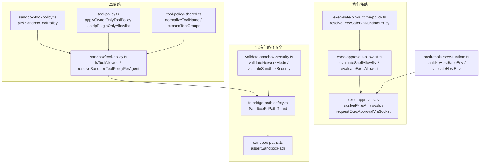
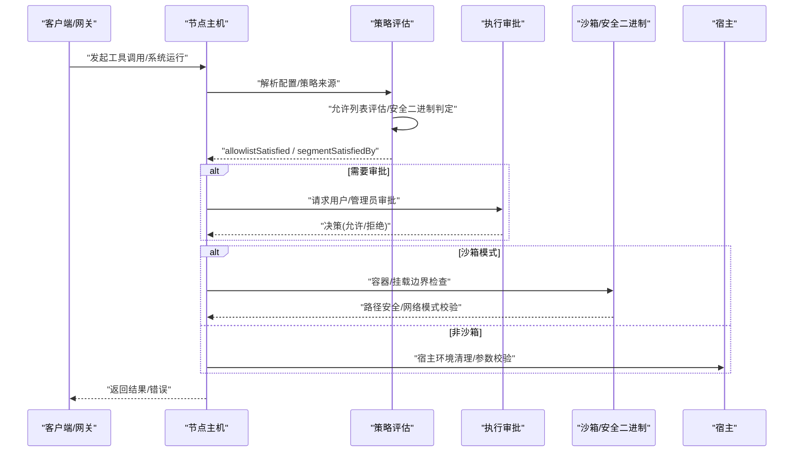
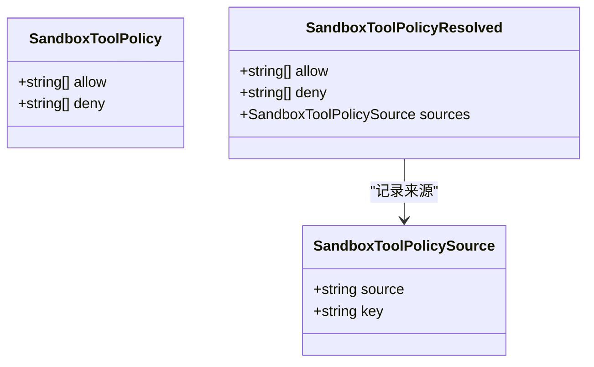
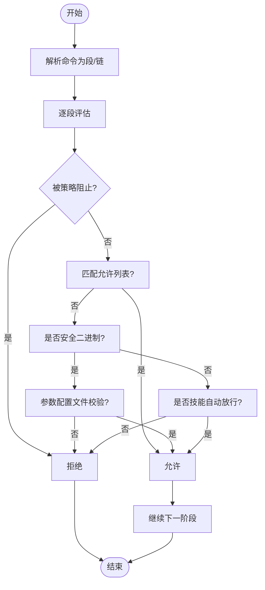
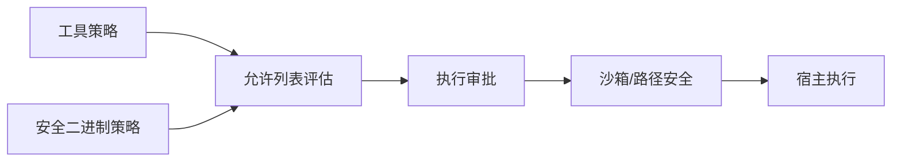

# 工具策略控制系统

<cite>
**本文引用的文件**
- [src/agents/sandbox-tool-policy.ts](file://src/agents/sandbox-tool-policy.ts)
- [src/agents/tool-policy.ts](file://src/agents/tool-policy.ts)
- [src/agents/tool-policy-shared.ts](file://src/agents/tool-policy-shared.ts)
- [src/agents/sandbox/tool-policy.ts](file://src/agents/sandbox/tool-policy.ts)
- [src/agents/sandbox/types.ts](file://src/agents/sandbox/types.ts)
- [src/infra/exec-approvals-allowlist.ts](file://src/infra/exec-approvals-allowlist.ts)
- [src/infra/exec-approvals.ts](file://src/infra/exec-approvals.ts)
- [src/infra/exec-safe-bin-runtime-policy.ts](file://src/infra/exec-safe-bin-runtime-policy.ts)
- [src/agents/sandbox/fs-bridge-path-safety.ts](file://src/agents/sandbox/fs-bridge-path-safety.ts)
- [src/agents/sandbox-paths.ts](file://src/agents/sandbox-paths.ts)
- [src/agents/sandbox/validate-sandbox-security.ts](file://src/agents/sandbox/validate-sandbox-security.ts)
- [src/agents/bash-tools.exec-runtime.ts](file://src/agents/bash-tools.exec-runtime.ts)
- [src/agents/pi-tools.safe-bins.test.ts](file://src/agents/pi-tools.safe-bins.test.ts)
- [src/infra/exec-approvals-safe-bins.test.ts](file://src/infra/exec-approvals-safe-bins.test.ts)
- [src/infra/exec-approvals.test.ts](file://src/infra/exec-approvals.test.ts)
- [src/commands/doctor-config-flow.ts](file://src/commands/doctor-config-flow.ts)
- [src/security/audit.ts](file://src/security/audit.ts)
- [src/gateway/node-invoke-system-run-approval.ts](file://src/gateway/node-invoke-system-run-approval.ts)
- [src/node-host/invoke-system-run.ts](file://src/node-host/invoke-system-run.ts)
</cite>

## 目录
1. [简介](#简介)
2. [项目结构](#项目结构)
3. [核心组件](#核心组件)
4. [架构总览](#架构总览)
5. [详细组件分析](#详细组件分析)
6. [依赖关系分析](#依赖关系分析)
7. [性能考量](#性能考量)
8. [故障排除指南](#故障排除指南)
9. [结论](#结论)
10. [附录](#附录)

## 简介
本文件系统性阐述 OpenClaw 的“工具策略控制系统”，聚焦以下目标：
- 工具访问控制：白名单与黑名单策略、工具调用权限验证、沙箱隔离机制
- 工具策略管道：策略评估流程、权限检查与执行控制
- 配置优先级：全局策略、代理特定策略、会话级策略
- 安全考虑：路径遍历防护、资源限制、执行环境隔离
- 实战指导：策略配置示例与故障排除

该系统在“工具策略”（工具白/黑名单）与“执行策略”（命令解析、允许列表、安全二进制信任）两条主线协同工作，既保证可用性，又确保最小权限与边界安全。

## 项目结构
围绕工具策略控制的关键模块分布如下：
- 工具策略（工具白/黑名单）
  - 沙箱工具策略：src/agents/sandbox-tool-policy.ts、src/agents/sandbox/tool-policy.ts、src/agents/sandbox/types.ts
  - 通用工具策略：src/agents/tool-policy.ts、src/agents/tool-policy-shared.ts
- 执行策略（命令解析、允许列表、安全二进制）
  - 允许列表评估：src/infra/exec-approvals-allowlist.ts
  - 执行审批与配置：src/infra/exec-approvals.ts
  - 安全二进制运行时策略：src/infra/exec-safe-bin-runtime-policy.ts
- 沙箱与路径安全
  - 路径安全与挂载边界：src/agents/sandbox/fs-bridge-path-safety.ts、src/agents/sandbox-paths.ts
  - 沙箱安全校验：src/agents/sandbox/validate-sandbox-security.ts
- 运行时环境与测试
  - Bash 工具执行环境清理：src/agents/bash-tools.exec-runtime.ts
  - 测试用例：src/agents/pi-tools.safe-bins.test.ts、src/infra/exec-approvals-safe-bins.test.ts、src/infra/exec-approvals.test.ts
- 配置与审计
  - 配置收集与可信目录合并：src/commands/doctor-config-flow.ts
  - 安全审计：src/security/audit.ts
- 网关与节点执行入口
  - 系统运行审批与过期校验：src/gateway/node-invoke-system-run-approval.ts
  - 系统运行策略评估入口：src/node-host/invoke-system-run.ts

**图表来源**
- [src/agents/sandbox-tool-policy.ts](file://src/agents/sandbox-tool-policy.ts#L1-L38)
- [src/agents/sandbox/tool-policy.ts](file://src/agents/sandbox/tool-policy.ts#L1-L110)
- [src/agents/tool-policy.ts](file://src/agents/tool-policy.ts#L1-L206)
- [src/agents/tool-policy-shared.ts](file://src/agents/tool-policy-shared.ts#L1-L50)
- [src/infra/exec-approvals-allowlist.ts](file://src/infra/exec-approvals-allowlist.ts#L1-L610)
- [src/infra/exec-approvals.ts](file://src/infra/exec-approvals.ts#L1-L588)
- [src/infra/exec-safe-bin-runtime-policy.ts](file://src/infra/exec-safe-bin-runtime-policy.ts#L1-L158)
- [src/agents/sandbox/fs-bridge-path-safety.ts](file://src/agents/sandbox/fs-bridge-path-safety.ts#L1-L77)
- [src/agents/sandbox-paths.ts](file://src/agents/sandbox-paths.ts#L40-L79)
- [src/agents/sandbox/validate-sandbox-security.ts](file://src/agents/sandbox/validate-sandbox-security.ts#L272-L306)
- [src/agents/bash-tools.exec-runtime.ts](file://src/agents/bash-tools.exec-runtime.ts#L38-L66)

**章节来源**
- [src/agents/sandbox-tool-policy.ts](file://src/agents/sandbox-tool-policy.ts#L1-L38)
- [src/agents/sandbox/tool-policy.ts](file://src/agents/sandbox/tool-policy.ts#L1-L110)
- [src/agents/tool-policy.ts](file://src/agents/tool-policy.ts#L1-L206)
- [src/agents/tool-policy-shared.ts](file://src/agents/tool-policy-shared.ts#L1-L50)
- [src/infra/exec-approvals-allowlist.ts](file://src/infra/exec-approvals-allowlist.ts#L1-L610)
- [src/infra/exec-approvals.ts](file://src/infra/exec-approvals.ts#L1-L588)
- [src/infra/exec-safe-bin-runtime-policy.ts](file://src/infra/exec-safe-bin-runtime-policy.ts#L1-L158)
- [src/agents/sandbox/fs-bridge-path-safety.ts](file://src/agents/sandbox/fs-bridge-path-safety.ts#L1-L77)
- [src/agents/sandbox-paths.ts](file://src/agents/sandbox-paths.ts#L40-L79)
- [src/agents/sandbox/validate-sandbox-security.ts](file://src/agents/sandbox/validate-sandbox-security.ts#L272-L306)
- [src/agents/bash-tools.exec-runtime.ts](file://src/agents/bash-tools.exec-runtime.ts#L38-L66)

## 核心组件
- 沙箱工具策略
  - 提供从配置中提取并规范化“允许/拒绝”模式的能力，并支持通配符与组展开；默认注入 image 工具以保障多模态体验。
- 通用工具策略
  - 支持所有工具场景的白/黑名单、插件组展开、所有者专用工具过滤等。
- 执行策略（允许列表与安全二进制）
  - 将 Shell 命令解析为段，逐段匹配允许列表或安全二进制使用，或基于技能自动放行；支持链式命令与包装器解包。
- 沙箱与路径安全
  - 通过挂载边界、容器根路径校验、网络模式限制等，防止逃逸与越权访问。
- 运行时环境隔离
  - 清理危险环境变量、严格校验 PATH 与宿主环境，避免污染非沙箱执行。

**章节来源**
- [src/agents/sandbox-tool-policy.ts](file://src/agents/sandbox-tool-policy.ts#L21-L37)
- [src/agents/sandbox/tool-policy.ts](file://src/agents/sandbox/tool-policy.ts#L16-L33)
- [src/agents/tool-policy.ts](file://src/agents/tool-policy.ts#L41-L52)
- [src/infra/exec-approvals-allowlist.ts](file://src/infra/exec-approvals-allowlist.ts#L281-L310)
- [src/infra/exec-safe-bin-runtime-policy.ts](file://src/infra/exec-safe-bin-runtime-policy.ts#L104-L157)
- [src/agents/sandbox/fs-bridge-path-safety.ts](file://src/agents/sandbox/fs-bridge-path-safety.ts#L45-L77)
- [src/agents/sandbox-paths.ts](file://src/agents/sandbox-paths.ts#L60-L79)
- [src/agents/bash-tools.exec-runtime.ts](file://src/agents/bash-tools.exec-runtime.ts#L38-L66)

## 架构总览
下图展示“工具策略管道”的端到端流程：从请求进入，到策略评估、权限决策与执行控制。

**图表来源**
- [src/node-host/invoke-system-run.ts](file://src/node-host/invoke-system-run.ts#L247-L285)
- [src/infra/exec-approvals.ts](file://src/infra/exec-approvals.ts#L482-L494)
- [src/infra/exec-approvals-allowlist.ts](file://src/infra/exec-approvals-allowlist.ts#L281-L310)
- [src/agents/sandbox/fs-bridge-path-safety.ts](file://src/agents/sandbox/fs-bridge-path-safety.ts#L45-L77)
- [src/agents/bash-tools.exec-runtime.ts](file://src/agents/bash-tools.exec-runtime.ts#L38-L66)

## 详细组件分析

### 组件A：沙箱工具策略
- 功能要点
  - 从配置中提取 allow/alsoAllow/deny，进行去重与合并；当仅设置 alsoAllow 时视为在隐式“全部允许”基础上追加。
  - isToolAllowed 支持通配符与组展开，deny 优先于 allow。
  - 解析策略来源（代理/全局/默认），并自动注入 image 工具（除非显式拒绝）。
- 关键实现路径
  - [pickSandboxToolPolicy](file://src/agents/sandbox-tool-policy.ts#L21-L37)
  - [isToolAllowed / resolveSandboxToolPolicyForAgent](file://src/agents/sandbox/tool-policy.ts#L16-L109)
  - [SandboxToolPolicy 类型定义](file://src/agents/sandbox/types.ts#L6-L27)

**图表来源**
- [src/agents/sandbox/types.ts](file://src/agents/sandbox/types.ts#L6-L27)
- [src/agents/sandbox/tool-policy.ts](file://src/agents/sandbox/tool-policy.ts#L35-L109)

**章节来源**
- [src/agents/sandbox-tool-policy.ts](file://src/agents/sandbox-tool-policy.ts#L1-L38)
- [src/agents/sandbox/tool-policy.ts](file://src/agents/sandbox/tool-policy.ts#L1-L110)
- [src/agents/sandbox/types.ts](file://src/agents/sandbox/types.ts#L1-L91)

### 组件B：通用工具策略与所有者限制
- 功能要点
  - 工具名归一化与别名映射、组展开、插件组扩展。
  - 对“所有者专用工具”（如 cron、gateway、whatsapp_login）进行发送方身份校验，非所有者直接屏蔽。
  - 允许列表剥离逻辑：若仅包含插件工具而无核心工具，将剥离 allow 列表以避免误封。
- 关键实现路径
  - [applyOwnerOnlyToolPolicy](file://src/agents/tool-policy.ts#L41-L52)
  - [stripPluginOnlyAllowlist](file://src/agents/tool-policy.ts#L151-L195)
  - [normalizeToolName / expandToolGroups](file://src/agents/tool-policy-shared.ts#L19-L43)

**章节来源**
- [src/agents/tool-policy.ts](file://src/agents/tool-policy.ts#L1-L206)
- [src/agents/tool-policy-shared.ts](file://src/agents/tool-policy-shared.ts#L1-L50)

### 组件C：执行策略（允许列表与安全二进制）
- 功能要点
  - 将 Shell 命令解析为段，支持链式命令（&&、||、;），并处理包装器（env、dispatch、multiplexer）解包。
  - 允许列表匹配、安全二进制使用判定（trusted dirs + profiles）、技能自动放行。
  - 生成“允许永远”模式的持久化模式（inner executable）。
- 关键实现路径
  - [evaluateShellAllowlist / evaluateExecAllowlist](file://src/infra/exec-approvals-allowlist.ts#L530-L609)
  - [resolveAllowAlwaysPatterns](file://src/infra/exec-approvals-allowlist.ts#L507-L525)
  - [isSafeBinUsage / resolveExecSafeBinRuntimePolicy](file://src/infra/exec-approvals-allowlist.ts#L51-L96)
  - [resolveExecSafeBinRuntimePolicy](file://src/infra/exec-safe-bin-runtime-policy.ts#L104-L157)

**图表来源**
- [src/infra/exec-approvals-allowlist.ts](file://src/infra/exec-approvals-allowlist.ts#L198-L310)

**章节来源**
- [src/infra/exec-approvals-allowlist.ts](file://src/infra/exec-approvals-allowlist.ts#L1-L610)
- [src/infra/exec-safe-bin-runtime-policy.ts](file://src/infra/exec-safe-bin-runtime-policy.ts#L1-L158)

### 组件D：执行审批与会话控制
- 功能要点
  - 读取/写入执行审批文件，合并默认、代理与通配符策略，计算最终安全级别与提示策略。
  - 请求审批（socket），支持超时与决策类型。
  - 系统运行审批的过期与节点绑定校验。
- 关键实现路径
  - [resolveExecApprovals / resolveExecApprovalsFromFile](file://src/infra/exec-approvals.ts#L410-L480)
  - [requestExecApprovalViaSocket](file://src/infra/exec-approvals.ts#L557-L587)
  - [node-invoke-system-run-approval 校验](file://src/gateway/node-invoke-system-run-approval.ts#L134-L190)

**章节来源**
- [src/infra/exec-approvals.ts](file://src/infra/exec-approvals.ts#L1-L588)
- [src/gateway/node-invoke-system-run-approval.ts](file://src/gateway/node-invoke-system-run-approval.ts#L134-L190)

### 组件E：沙箱与路径安全
- 功能要点
  - 路径安全：边界文件打开、挂载校验、禁止别名逃逸；支持可选的软/硬链接放宽。
  - 路径解析：拒绝相对路径回溯，确保位于沙箱根内。
  - 沙箱安全：网络模式限制（host/container:* 等），绑定源根校验。
- 关键实现路径
  - [SandboxFsPathGuard.assertPathSafety](file://src/agents/sandbox/fs-bridge-path-safety.ts#L45-L77)
  - [assertSandboxPath](file://src/agents/sandbox-paths.ts#L60-L79)
  - [validateNetworkMode / validateSandboxSecurity](file://src/agents/sandbox/validate-sandbox-security.ts#L283-L306)

**章节来源**
- [src/agents/sandbox/fs-bridge-path-safety.ts](file://src/agents/sandbox/fs-bridge-path-safety.ts#L1-L77)
- [src/agents/sandbox-paths.ts](file://src/agents/sandbox-paths.ts#L40-L79)
- [src/agents/sandbox/validate-sandbox-security.ts](file://src/agents/sandbox/validate-sandbox-security.ts#L272-L306)

### 组件F：宿主执行环境隔离
- 功能要点
  - 清理危险环境变量，阻断已知高危键；对 PATH 与宿主环境进行严格校验，失败即刻拒绝。
- 关键实现路径
  - [sanitizeHostBaseEnv / validateHostEnv](file://src/agents/bash-tools.exec-runtime.ts#L38-L66)

**章节来源**
- [src/agents/bash-tools.exec-runtime.ts](file://src/agents/bash-tools.exec-runtime.ts#L38-L66)

## 依赖关系分析
- 组件耦合
  - 工具策略与执行策略通过“允许列表”与“安全二进制”形成强关联：前者决定“是否允许”，后者决定“如何执行”。
  - 沙箱路径安全与网络策略作为执行前的边界守卫，贯穿所有容器化执行。
- 外部依赖
  - JSONL Socket 用于审批通信；文件系统用于审批配置持久化。
- 循环依赖
  - 各模块职责清晰，未见循环导入迹象。

**图表来源**
- [src/agents/tool-policy.ts](file://src/agents/tool-policy.ts#L1-L206)
- [src/infra/exec-approvals-allowlist.ts](file://src/infra/exec-approvals-allowlist.ts#L1-L610)
- [src/infra/exec-approvals.ts](file://src/infra/exec-approvals.ts#L1-L588)
- [src/agents/sandbox/fs-bridge-path-safety.ts](file://src/agents/sandbox/fs-bridge-path-safety.ts#L1-L77)
- [src/agents/bash-tools.exec-runtime.ts](file://src/agents/bash-tools.exec-runtime.ts#L38-L66)

**章节来源**
- [src/agents/tool-policy.ts](file://src/agents/tool-policy.ts#L1-L206)
- [src/infra/exec-approvals-allowlist.ts](file://src/infra/exec-approvals-allowlist.ts#L1-L610)
- [src/infra/exec-approvals.ts](file://src/infra/exec-approvals.ts#L1-L588)
- [src/agents/sandbox/fs-bridge-path-safety.ts](file://src/agents/sandbox/fs-bridge-path-safety.ts#L1-L77)
- [src/agents/bash-tools.exec-runtime.ts](file://src/agents/bash-tools.exec-runtime.ts#L38-L66)

## 性能考量
- 允许列表匹配采用预编译通配符与集合查找，复杂度与模式数量线性相关。
- 安全二进制参数校验与可信目录检查为常数时间操作，整体开销可控。
- 建议
  - 合理拆分长链命令，减少一次性解析成本。
  - 使用“允许永远”模式持久化 inner executable，降低重复解析与匹配成本。

[本节为通用建议，无需具体文件分析]

## 故障排除指南
- 常见问题与定位
  - “allowlist miss”：命令未命中允许列表或安全二进制，检查 allowlist、安全二进制配置与可信目录。
  - “审批过期/不匹配”：确认审批 ID 与节点绑定一致且未过期。
  - “路径逃逸/越权访问”：检查沙箱根与挂载配置，确保路径解析与别名策略生效。
  - “宿主环境变量被拒绝”：确认未携带危险键，必要时使用安全二进制或沙箱模式。
- 关键定位点
  - [执行策略评估入口](file://src/node-host/invoke-system-run.ts#L247-L285)
  - [系统运行审批校验](file://src/gateway/node-invoke-system-run-approval.ts#L134-L190)
  - [路径安全断言](file://src/agents/sandbox-paths.ts#L60-L79)
  - [宿主环境校验](file://src/agents/bash-tools.exec-runtime.ts#L57-L66)
- 测试参考
  - [安全二进制拒绝重定向/递归标志](file://src/agents/pi-tools.safe-bins.test.ts#L248-L284)
  - [安全二进制可信目录覆盖](file://src/infra/exec-approvals-safe-bins.test.ts#L415-L461)
  - [透明 env 包装器深度限制](file://src/infra/exec-approvals.test.ts#L344-L375)

**章节来源**
- [src/node-host/invoke-system-run.ts](file://src/node-host/invoke-system-run.ts#L247-L285)
- [src/gateway/node-invoke-system-run-approval.ts](file://src/gateway/node-invoke-system-run-approval.ts#L134-L190)
- [src/agents/sandbox-paths.ts](file://src/agents/sandbox-paths.ts#L60-L79)
- [src/agents/bash-tools.exec-runtime.ts](file://src/agents/bash-tools.exec-runtime.ts#L57-L66)
- [src/agents/pi-tools.safe-bins.test.ts](file://src/agents/pi-tools.safe-bins.test.ts#L248-L284)
- [src/infra/exec-approvals-safe-bins.test.ts](file://src/infra/exec-approvals-safe-bins.test.ts#L415-L461)
- [src/infra/exec-approvals.test.ts](file://src/infra/exec-approvals.test.ts#L344-L375)

## 结论
OpenClaw 的工具策略控制系统通过“工具策略 + 执行策略 + 沙箱与路径安全 + 宿主环境隔离”四维协同，实现了细粒度、可审计、可扩展的工具访问控制。其设计遵循最小权限原则，结合允许列表、安全二进制与沙箱边界，有效降低了执行风险。建议在生产环境中：
- 明确全局、代理与会话级策略优先级，避免相互冲突
- 合理配置安全二进制与可信目录，减少误判
- 使用“允许永远”模式固化常见命令，提升可用性
- 定期进行安全审计与路径边界审查

[本节为总结，无需具体文件分析]

## 附录

### 不同工具配置文件的作用与优先级
- 全局策略
  - tools.sandbox.tools.allow/deny：全局沙箱工具白/黑名单
  - tools.exec.safeBins / safeBinProfiles / safeBinTrustedDirs：全局安全二进制策略
- 代理特定策略
  - agents.list[].tools.sandbox.tools.allow/deny：按代理覆盖沙箱工具策略
  - agents.list[].tools.exec.*：按代理覆盖执行策略
- 会话级策略
  - 通过执行审批文件（~/.openclaw/exec-approvals.json）的 agents[*] 或默认项，控制 ask、security、allowlist 等
- 合并规则
  - deny 优先于 allow；通配符与组展开后匹配；安全二进制策略与可信目录合并
  - 参考：[策略解析与来源标注](file://src/agents/sandbox/tool-policy.ts#L35-L109)、[安全二进制运行时策略合并](file://src/infra/exec-safe-bin-runtime-policy.ts#L104-L157)、[执行审批合并](file://src/infra/exec-approvals.ts#L425-L480)

**章节来源**
- [src/agents/sandbox/tool-policy.ts](file://src/agents/sandbox/tool-policy.ts#L35-L109)
- [src/infra/exec-safe-bin-runtime-policy.ts](file://src/infra/exec-safe-bin-runtime-policy.ts#L104-L157)
- [src/infra/exec-approvals.ts](file://src/infra/exec-approvals.ts#L425-L480)

### 策略配置示例（步骤说明）
- 沙箱工具白名单
  - 在 tools.sandbox.tools.allow 中添加工具模式（支持通配符与 group:）
  - 如需追加，使用 alsoAllow（与 allow 同时出现将被 schema 校验拒绝）
- 安全二进制
  - 在 tools.exec.safeBins 中列出受信二进制名称
  - 在 safeBinTrustedDirs 中声明可信目录（绝对路径、避免临时目录）
  - 通过 safeBinProfiles 为特定二进制定义参数约束
- 执行审批
  - 在 ~/.openclaw/exec-approvals.json 中配置 agents[*].ask / security / allowlist
  - 使用 requestExecApprovalViaSocket 获取决策
- 路径与网络
  - 沙箱根与挂载必须在 allowed roots 内；网络模式禁止 host 与 container:*（除非显式允许）

[本节为操作指引，无需具体文件分析]

### 安全考虑清单
- 路径遍历防护
  - 严格解析与相对路径检查；禁止 .. 回溯；别名（符号/硬链接）逃逸检测
- 资源限制
  - 通过安全二进制参数配置文件限制危险选项；限制可信目录写权限
- 执行环境隔离
  - 清理危险环境变量；阻断 PATH 修改；非沙箱执行严格校验
- 审计与合规
  - 定期审计 elevated allowFrom 列表与安全二进制可信目录风险

**章节来源**
- [src/agents/sandbox-paths.ts](file://src/agents/sandbox-paths.ts#L40-L79)
- [src/agents/sandbox/fs-bridge-path-safety.ts](file://src/agents/sandbox/fs-bridge-path-safety.ts#L45-L77)
- [src/agents/bash-tools.exec-runtime.ts](file://src/agents/bash-tools.exec-runtime.ts#L38-L66)
- [src/security/audit.ts](file://src/security/audit.ts#L821-L936)