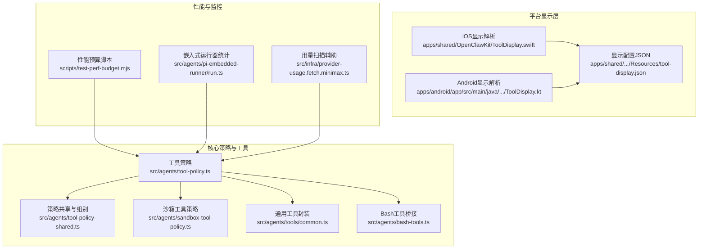
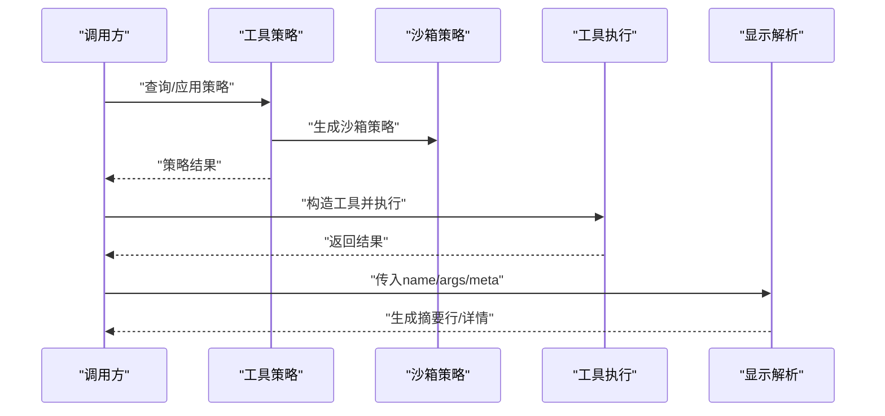
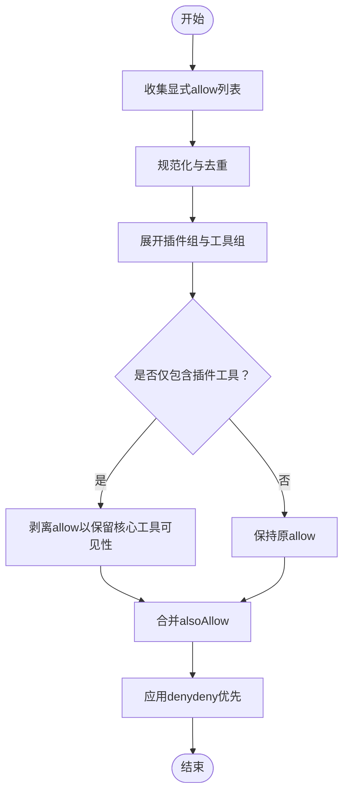
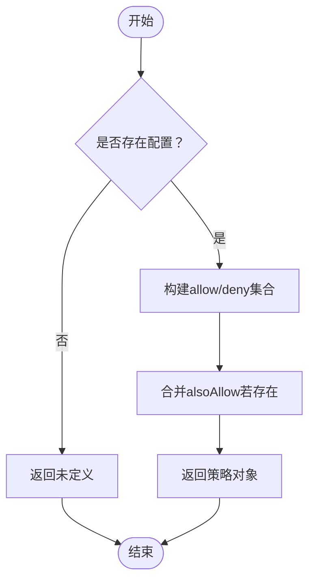
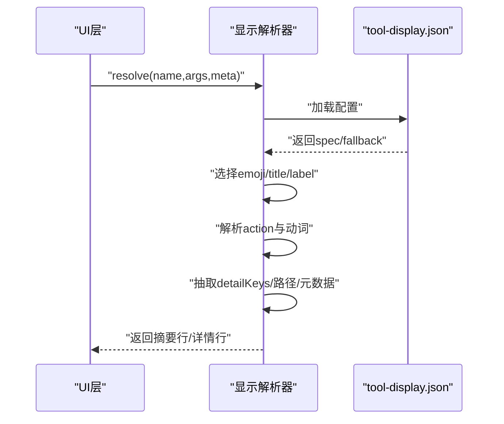
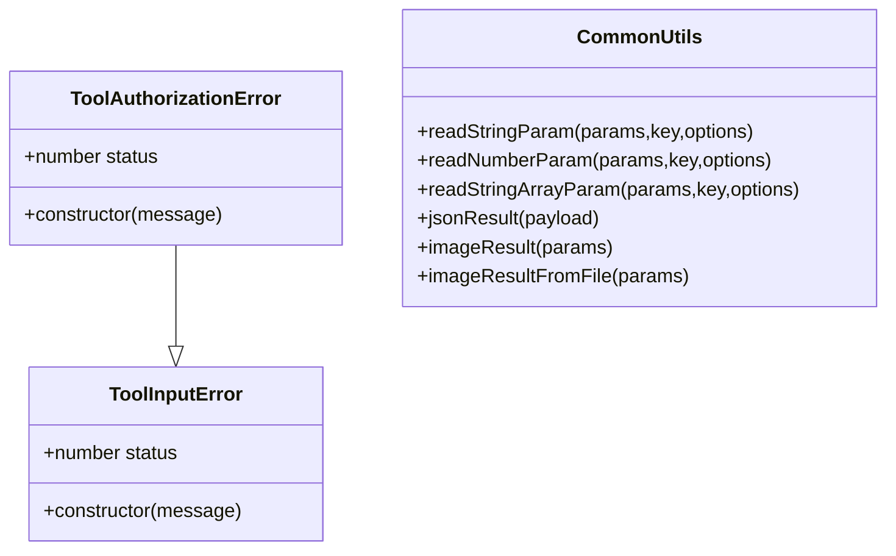
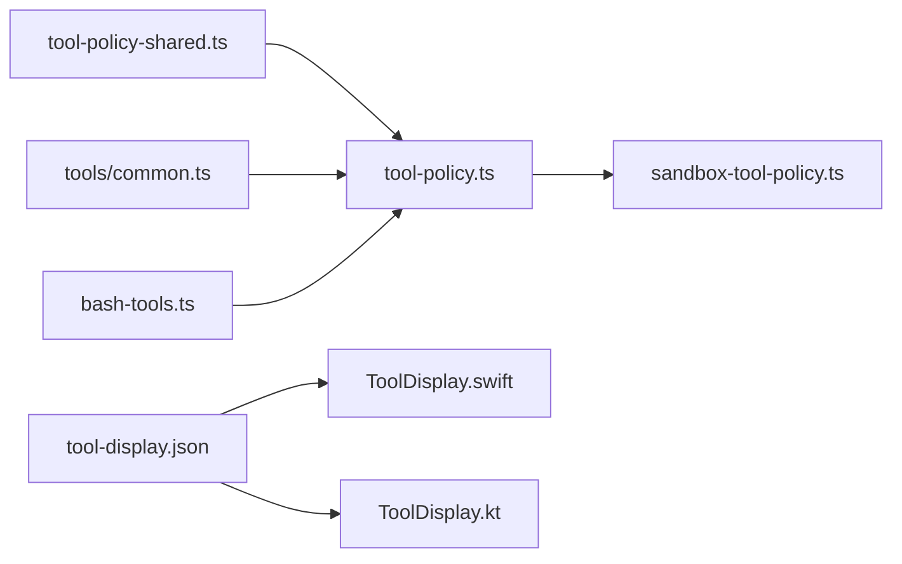

# 工具系统架构

<cite>
**本文引用的文件**
- [src/agents/tool-policy.ts](file://src/agents/tool-policy.ts)
- [src/agents/tool-policy-shared.ts](file://src/agents/tool-policy-shared.ts)
- [src/agents/sandbox-tool-policy.ts](file://src/agents/sandbox-tool-policy.ts)
- [apps/shared/OpenClawKit/Sources/OpenClawKit/ToolDisplay.swift](file://apps/shared/OpenClawKit/Sources/OpenClawKit/ToolDisplay.swift)
- [apps/android/app/src/main/java/ai/openclaw/app/tools/ToolDisplay.kt](file://apps/android/app/src/main/java/ai/openclaw/app/tools/ToolDisplay.kt)
- [apps/shared/OpenClawKit/Sources/OpenClawKit/Resources/tool-display.json](file://apps/shared/OpenClawKit/Sources/OpenClawKit/Resources/tool-display.json)
- [src/agents/tools/common.ts](file://src/agents/tools/common.ts)
- [src/agents/bash-tools.ts](file://src/agents/bash-tools.ts)
- [src/agents/openclaw-gateway-tool.test.ts](file://src/agents/openclaw-gateway-tool.test.ts)
- [src/agents/pi-tools.params.ts](file://src/agents/pi-tools.params.ts)
- [scripts/test-perf-budget.mjs](file://scripts/test-perf-budget.mjs)
- [src/agents/pi-embedded-runner/run.ts](file://src/agents/pi-embedded-runner/run.ts)
- [src/infra/provider-usage.fetch.minimax.ts](file://src/infra/provider-usage.fetch.minimax.ts)
</cite>

## 目录
1. [引言](#引言)
2. [项目结构](#项目结构)
3. [核心组件](#核心组件)
4. [架构总览](#架构总览)
5. [详细组件分析](#详细组件分析)
6. [依赖关系分析](#依赖关系分析)
7. [性能考虑](#性能考虑)
8. [故障排查指南](#故障排查指南)
9. [结论](#结论)
10. [附录](#附录)

## 引言
本文件面向OpenClaw工具系统，提供从架构到实现细节的全景式技术文档。内容覆盖工具注册机制、工具目录管理、工具策略控制（含访问控制、权限验证、沙箱隔离与安全策略）、工具显示配置（UI定制、参数展示、交互模式），并给出自定义工具开发指南与性能优化及监控策略。目标是帮助开发者在理解现有能力的基础上，快速扩展与集成新的工具。

## 项目结构
OpenClaw采用多平台共享核心与平台特定实现相结合的组织方式：
- 核心策略与工具逻辑位于src/agents下，统一处理工具策略、参数校验、通用工具封装等。
- 平台侧显示配置与解析位于apps/shared/OpenClawKit与apps/android中，通过JSON配置驱动UI呈现。
- 沙箱与安全策略位于src/agents/sandbox-tool-policy.ts，结合测试用例验证策略行为。
- 性能与监控策略分布在脚本与运行时代码中，用于回归预算与资源消耗评估。

图表来源
- [src/agents/tool-policy.ts](file://src/agents/tool-policy.ts#L1-L206)
- [src/agents/tool-policy-shared.ts](file://src/agents/tool-policy-shared.ts#L1-L50)
- [src/agents/sandbox-tool-policy.ts](file://src/agents/sandbox-tool-policy.ts#L1-L37)
- [apps/shared/OpenClawKit/Sources/OpenClawKit/ToolDisplay.swift](file://apps/shared/OpenClawKit/Sources/OpenClawKit/ToolDisplay.swift#L46-L146)
- [apps/android/app/src/main/java/ai/openclaw/app/tools/ToolDisplay.kt](file://apps/android/app/src/main/java/ai/openclaw/app/tools/ToolDisplay.kt#L1-L91)
- [apps/shared/OpenClawKit/Sources/OpenClawKit/Resources/tool-display.json](file://apps/shared/OpenClawKit/Sources/OpenClawKit/Resources/tool-display.json#L1-L198)
- [src/agents/tools/common.ts](file://src/agents/tools/common.ts#L1-L341)
- [src/agents/bash-tools.ts](file://src/agents/bash-tools.ts#L1-L9)
- [scripts/test-perf-budget.mjs](file://scripts/test-perf-budget.mjs#L98-L127)
- [src/agents/pi-embedded-runner/run.ts](file://src/agents/pi-embedded-runner/run.ts#L121-L155)
- [src/infra/provider-usage.fetch.minimax.ts](file://src/infra/provider-usage.fetch.minimax.ts#L192-L227)

章节来源
- [src/agents/tool-policy.ts](file://src/agents/tool-policy.ts#L1-L206)
- [src/agents/tool-policy-shared.ts](file://src/agents/tool-policy-shared.ts#L1-L50)
- [src/agents/sandbox-tool-policy.ts](file://src/agents/sandbox-tool-policy.ts#L1-L37)
- [apps/shared/OpenClawKit/Sources/OpenClawKit/ToolDisplay.swift](file://apps/shared/OpenClawKit/Sources/OpenClawKit/ToolDisplay.swift#L46-L146)
- [apps/android/app/src/main/java/ai/openclaw/app/tools/ToolDisplay.kt](file://apps/android/app/src/main/java/ai/openclaw/app/tools/ToolDisplay.kt#L1-L91)
- [apps/shared/OpenClawKit/Sources/OpenClawKit/Resources/tool-display.json](file://apps/shared/OpenClawKit/Sources/OpenClawKit/Resources/tool-display.json#L1-L198)
- [src/agents/tools/common.ts](file://src/agents/tools/common.ts#L1-L341)
- [src/agents/bash-tools.ts](file://src/agents/bash-tools.ts#L1-L9)
- [scripts/test-perf-budget.mjs](file://scripts/test-perf-budget.mjs#L98-L127)
- [src/agents/pi-embedded-runner/run.ts](file://src/agents/pi-embedded-runner/run.ts#L121-L155)
- [src/infra/provider-usage.fetch.minimax.ts](file://src/infra/provider-usage.fetch.minimax.ts#L192-L227)

## 核心组件
- 工具策略系统：负责工具允许/拒绝列表、插件组展开、所有者限制、以及策略合并与剥离等。
- 沙箱工具策略：基于allow/deny集合生成沙箱策略对象，支持通配符与优先级。
- 显示配置与解析：通过JSON配置映射工具名到UI显示规范，并在iOS/Android侧进行解析与摘要生成。
- 通用工具封装：提供参数读取、类型转换、结果封装、图片结果生成、错误类型等通用能力。
- Bash工具桥接：导出执行与进程类工具的创建与调用入口。
- 参数校验与错误处理：提供结构化参数校验、必填项检查、错误分类与抛出。

章节来源
- [src/agents/tool-policy.ts](file://src/agents/tool-policy.ts#L1-L206)
- [src/agents/sandbox-tool-policy.ts](file://src/agents/sandbox-tool-policy.ts#L1-L37)
- [apps/shared/OpenClawKit/Sources/OpenClawKit/ToolDisplay.swift](file://apps/shared/OpenClawKit/Sources/OpenClawKit/ToolDisplay.swift#L46-L146)
- [apps/shared/OpenClawKit/Sources/OpenClawKit/Resources/tool-display.json](file://apps/shared/OpenClawKit/Sources/OpenClawKit/Resources/tool-display.json#L1-L198)
- [src/agents/tools/common.ts](file://src/agents/tools/common.ts#L1-L341)
- [src/agents/bash-tools.ts](file://src/agents/bash-tools.ts#L1-L9)
- [src/agents/pi-tools.params.ts](file://src/agents/pi-tools.params.ts#L154-L204)

## 架构总览
OpenClaw工具系统以“策略—执行—显示”三层解耦：
- 策略层：统一收敛工具策略（允许/拒绝、插件组、所有者限制），输出标准化策略对象。
- 执行层：提供通用工具封装与Bash桥接，承载具体工具的输入参数读取、校验与执行。
- 显示层：通过JSON配置驱动UI摘要生成，跨平台一致呈现工具动作与参数。

图表来源
- [src/agents/tool-policy.ts](file://src/agents/tool-policy.ts#L1-L206)
- [src/agents/sandbox-tool-policy.ts](file://src/agents/sandbox-tool-policy.ts#L1-L37)
- [apps/shared/OpenClawKit/Sources/OpenClawKit/ToolDisplay.swift](file://apps/shared/OpenClawKit/Sources/OpenClawKit/ToolDisplay.swift#L46-L146)
- [apps/shared/OpenClawKit/Sources/OpenClawKit/Resources/tool-display.json](file://apps/shared/OpenClawKit/Sources/OpenClawKit/Resources/tool-display.json#L1-L198)

## 详细组件分析

### 工具策略系统
- 允许/拒绝列表收集与规范化：支持多策略合并、去重与展开。
- 插件组展开：支持“group:plugins”与按插件ID展开，避免仅插件工具导致的策略误伤。
- 所有者限制：对ownerOnly工具在非所有者调用时进行拦截或移除。
- 策略合并：支持alsoAllow的附加合并，确保策略可叠加。
- 组别与别名：统一工具名大小写与别名，扩展工具组别。

图表来源
- [src/agents/tool-policy.ts](file://src/agents/tool-policy.ts#L70-L205)

章节来源
- [src/agents/tool-policy.ts](file://src/agents/tool-policy.ts#L1-L206)
- [src/agents/tool-policy-shared.ts](file://src/agents/tool-policy-shared.ts#L1-L50)

### 沙箱工具策略
- 支持allow/deny集合，当allow为空时视为“允许全部”，deny存在时优先屏蔽。
- alsoAllow与allow并集，若仅有alsoAllow而无allow，则隐式视为允许全部再叠加。
- 测试覆盖通配符匹配、deny优先、空allow的行为等。

图表来源
- [src/agents/sandbox-tool-policy.ts](file://src/agents/sandbox-tool-policy.ts#L1-L37)

章节来源
- [src/agents/sandbox-tool-policy.ts](file://src/agents/sandbox-tool-policy.ts#L1-L37)

### 工具显示配置与解析
- 配置结构：版本号、全局回退规则、工具专属规则与动作映射。
- iOS/Android解析：根据工具名与动作选择对应规格，提取emoji、标题、标签、动词与详情键值。
- 详情生成：优先从动作详情键、文件路径、元数据等来源抽取详情文本；支持路径短路与主目录缩写。

图表来源
- [apps/shared/OpenClawKit/Sources/OpenClawKit/ToolDisplay.swift](file://apps/shared/OpenClawKit/Sources/OpenClawKit/ToolDisplay.swift#L46-L146)
- [apps/android/app/src/main/java/ai/openclaw/app/tools/ToolDisplay.kt](file://apps/android/app/src/main/java/ai/openclaw/app/tools/ToolDisplay.kt#L60-L91)
- [apps/shared/OpenClawKit/Sources/OpenClawKit/Resources/tool-display.json](file://apps/shared/OpenClawKit/Sources/OpenClawKit/Resources/tool-display.json#L1-L198)

章节来源
- [apps/shared/OpenClawKit/Sources/OpenClawKit/ToolDisplay.swift](file://apps/shared/OpenClawKit/Sources/OpenClawKit/ToolDisplay.swift#L46-L146)
- [apps/android/app/src/main/java/ai/openclaw/app/tools/ToolDisplay.kt](file://apps/android/app/src/main/java/ai/openclaw/app/tools/ToolDisplay.kt#L1-L91)
- [apps/shared/OpenClawKit/Sources/OpenClawKit/Resources/tool-display.json](file://apps/shared/OpenClawKit/Sources/OpenClawKit/Resources/tool-display.json#L1-L198)

### 通用工具封装与参数校验
- 参数读取：支持字符串、数字、数组等类型，自动处理驼峰/蛇形键兼容、trim与必填校验。
- 结果封装：统一text/image结果格式，支持图片结果从内存或文件生成。
- 错误类型：区分输入错误与授权错误，便于上层策略与UI反馈。
- 可选动作门控：根据action开关决定是否执行某分支。

图表来源
- [src/agents/tools/common.ts](file://src/agents/tools/common.ts#L26-L341)

章节来源
- [src/agents/tools/common.ts](file://src/agents/tools/common.ts#L1-L341)
- [src/agents/pi-tools.params.ts](file://src/agents/pi-tools.params.ts#L154-L204)

### Bash工具桥接
- 导出执行与进程工具的创建与调用函数，作为系统命令与外部进程的抽象入口。
- 与策略系统配合，确保在沙箱与权限范围内执行。

章节来源
- [src/agents/bash-tools.ts](file://src/agents/bash-tools.ts#L1-L9)

### 内置工具功能与使用方法（示例）
- 文件操作：read、write、edit、attach等，详情键通常包含path/url等定位信息。
- 网络请求：browser/canvas/nodes等通道，动作涵盖状态、打开、截图、上传、节点操作等。
- 系统命令：process/bash等，动作聚焦会话、命令执行等。
- 管理与网关：cron、gateway等，动作包括状态、增删改查、重启等。

章节来源
- [apps/shared/OpenClawKit/Sources/OpenClawKit/Resources/tool-display.json](file://apps/shared/OpenClawKit/Sources/OpenClawKit/Resources/tool-display.json#L27-L195)

### 自定义工具开发指南
- 接口定义：遵循AgentTool约定，提供name、execute与可选的ownerOnly标记。
- 参数验证：使用通用工具封装提供的参数读取与校验函数，确保必填、类型与格式正确。
- 错误处理：根据场景抛出ToolInputError或ToolAuthorizationError，便于策略与UI处理。
- 结果封装：优先使用jsonResult或imageResult系列，保证内容与details一致性。
- 显示配置：在tool-display.json中为新工具添加spec与动作映射，确保UI可读性。

章节来源
- [src/agents/tools/common.ts](file://src/agents/tools/common.ts#L1-L341)
- [apps/shared/OpenClawKit/Sources/OpenClawKit/Resources/tool-display.json](file://apps/shared/OpenClawKit/Sources/OpenClawKit/Resources/tool-display.json#L1-L198)

## 依赖关系分析
- 工具策略依赖策略共享模块（工具组、别名、规范化）。
- 沙箱策略由工具策略配置派生，测试用例验证其行为。
- 显示解析依赖JSON配置，iOS/Android分别实现解析逻辑。
- 通用工具封装被各类工具复用，提供一致的参数与结果处理。
- Bash工具桥接作为系统命令抽象，贯穿策略与执行链路。

图表来源
- [src/agents/tool-policy-shared.ts](file://src/agents/tool-policy-shared.ts#L1-L50)
- [src/agents/tool-policy.ts](file://src/agents/tool-policy.ts#L1-L206)
- [src/agents/sandbox-tool-policy.ts](file://src/agents/sandbox-tool-policy.ts#L1-L37)
- [apps/shared/OpenClawKit/Sources/OpenClawKit/Resources/tool-display.json](file://apps/shared/OpenClawKit/Sources/OpenClawKit/Resources/tool-display.json#L1-L198)
- [apps/shared/OpenClawKit/Sources/OpenClawKit/ToolDisplay.swift](file://apps/shared/OpenClawKit/Sources/OpenClawKit/ToolDisplay.swift#L46-L146)
- [apps/android/app/src/main/java/ai/openclaw/app/tools/ToolDisplay.kt](file://apps/android/app/src/main/java/ai/openclaw/app/tools/ToolDisplay.kt#L60-L91)
- [src/agents/tools/common.ts](file://src/agents/tools/common.ts#L1-L341)
- [src/agents/bash-tools.ts](file://src/agents/bash-tools.ts#L1-L9)

章节来源
- [src/agents/tool-policy-shared.ts](file://src/agents/tool-policy-shared.ts#L1-L50)
- [src/agents/tool-policy.ts](file://src/agents/tool-policy.ts#L1-L206)
- [src/agents/sandbox-tool-policy.ts](file://src/agents/sandbox-tool-policy.ts#L1-L37)
- [apps/shared/OpenClawKit/Sources/OpenClawKit/Resources/tool-display.json](file://apps/shared/OpenClawKit/Sources/OpenClawKit/Resources/tool-display.json#L1-L198)
- [apps/shared/OpenClawKit/Sources/OpenClawKit/ToolDisplay.swift](file://apps/shared/OpenClawKit/Sources/OpenClawKit/ToolDisplay.swift#L46-L146)
- [apps/android/app/src/main/java/ai/openclaw/app/tools/ToolDisplay.kt](file://apps/android/app/src/main/java/ai/openclaw/app/tools/ToolDisplay.kt#L60-L91)
- [src/agents/tools/common.ts](file://src/agents/tools/common.ts#L1-L341)
- [src/agents/bash-tools.ts](file://src/agents/bash-tools.ts#L1-L9)

## 性能考虑
- 性能预算：通过脚本对测试用例设定最大耗时与基线回归阈值，防止性能退化。
- 运行时统计：嵌入式运行器记录用量指标（输入/输出/缓存/总计），用于诊断与优化。
- 资源扫描：用量扫描辅助模块对不同键集合进行评分与候选收集，辅助资源治理。

章节来源
- [scripts/test-perf-budget.mjs](file://scripts/test-perf-budget.mjs#L98-L127)
- [src/agents/pi-embedded-runner/run.ts](file://src/agents/pi-embedded-runner/run.ts#L121-L155)
- [src/infra/provider-usage.fetch.minimax.ts](file://src/infra/provider-usage.fetch.minimax.ts#L192-L227)

## 故障排查指南
- 策略相关问题：检查allow/deny是否正确展开与合并，确认是否因仅插件工具导致allow被剥离。
- 沙箱策略问题：验证通配符匹配与deny优先级，确保策略对象生成符合预期。
- 显示解析问题：核对tool-display.json中的工具与动作映射，确认detailKeys是否覆盖关键参数。
- 参数校验问题：依据参数校验函数的错误消息定位缺失或类型不匹配的字段。
- 网关工具调用：参考测试用例中的调用方式与期望结果，确保action与参数路径正确。

章节来源
- [src/agents/tool-policy.ts](file://src/agents/tool-policy.ts#L151-L195)
- [src/agents/sandbox-tool-policy.ts](file://src/agents/sandbox-tool-policy.ts#L21-L37)
- [apps/shared/OpenClawKit/Sources/OpenClawKit/Resources/tool-display.json](file://apps/shared/OpenClawKit/Sources/OpenClawKit/Resources/tool-display.json#L1-L198)
- [src/agents/pi-tools.params.ts](file://src/agents/pi-tools.params.ts#L154-L204)
- [src/agents/openclaw-gateway-tool.test.ts](file://src/agents/openclaw-gateway-tool.test.ts#L191-L222)

## 结论
OpenClaw工具系统通过清晰的策略、执行与显示三层架构，实现了跨平台一致的工具体验。策略系统提供灵活的访问控制与沙箱隔离，显示配置保障了良好的用户交互，通用封装与参数校验提升了工具开发效率与稳定性。建议在新增工具时严格遵循参数与错误处理规范，并完善显示配置，以获得最佳的用户体验与可维护性。

## 附录
- 工具策略测试要点：通配符匹配、deny优先、空allow行为、alsoAllow合并、剥离仅插件allow。
- 显示配置最佳实践：为常用动作提供label与detailKeys，确保UI摘要可读；为路径类工具提供路径短路与主目录缩写。