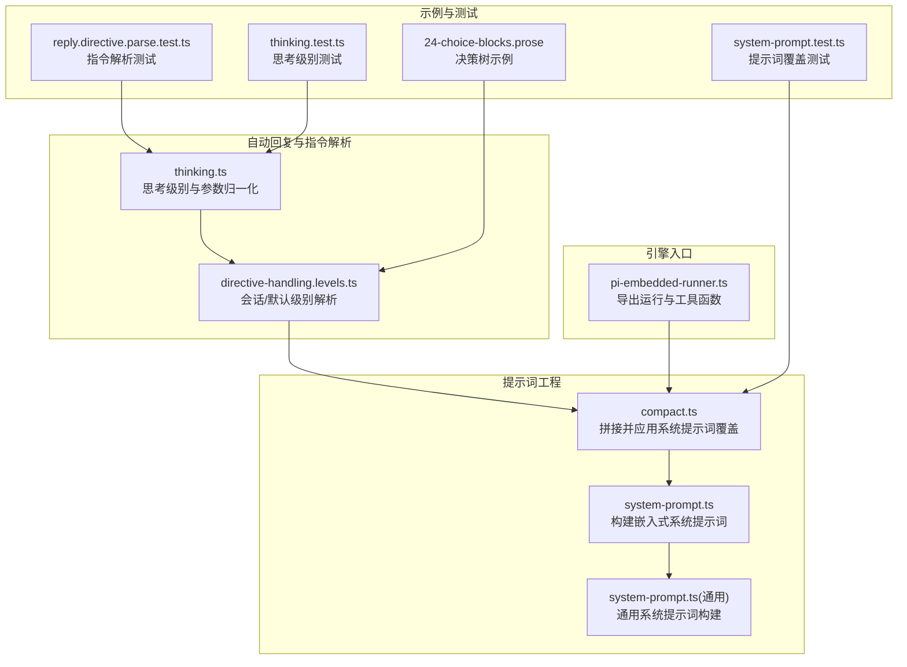
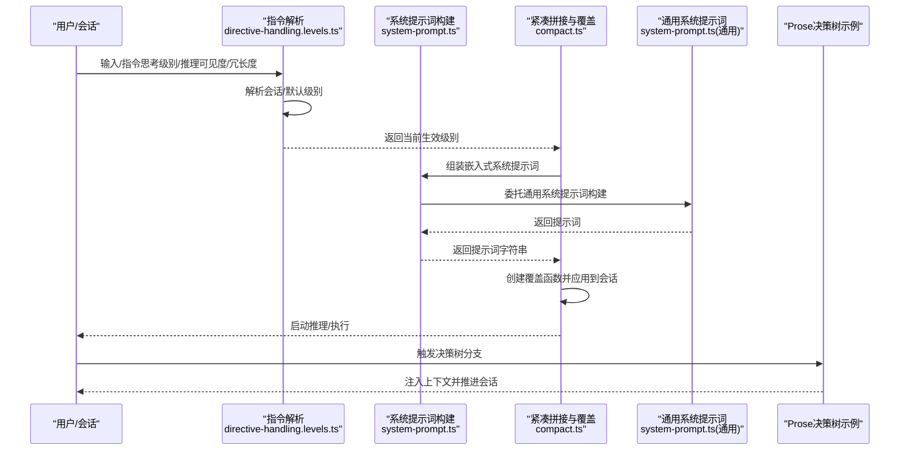
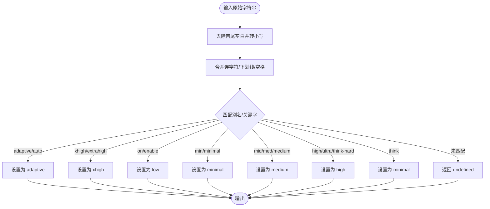
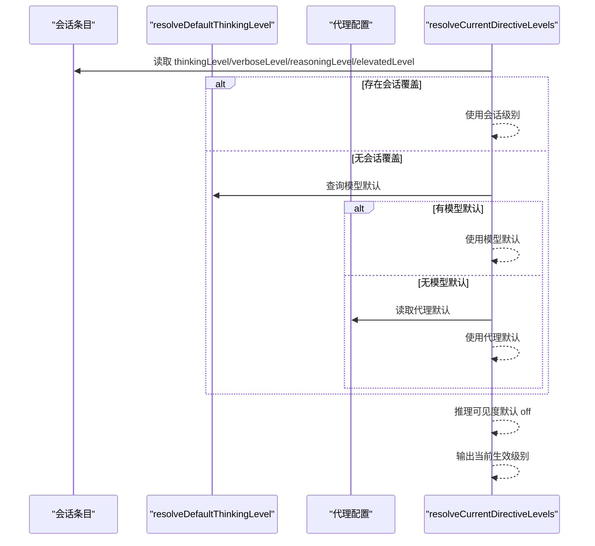
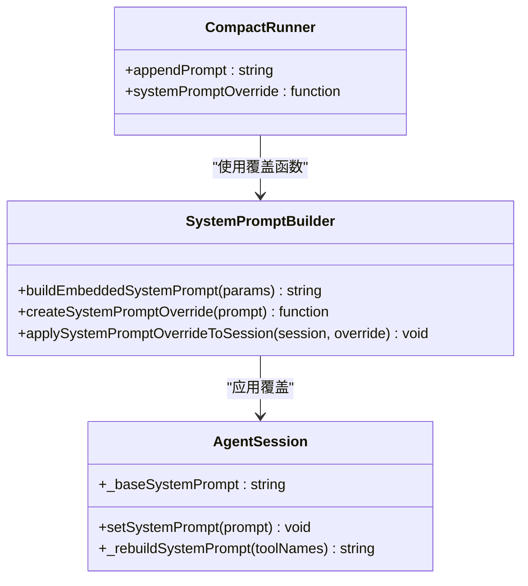
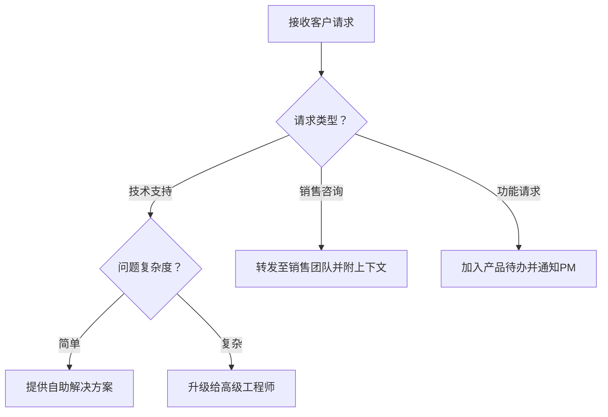
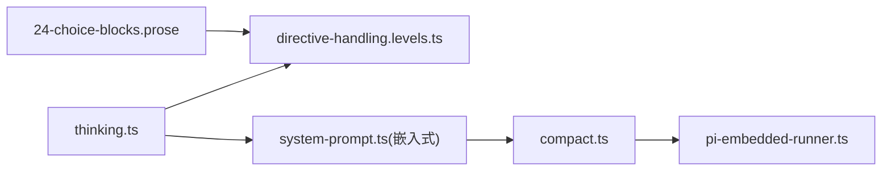

# 思考过程引擎

<cite>
**本文引用的文件**
- [src/auto-reply/thinking.ts](file://src/auto-reply/thinking.ts)
- [src/auto-reply/reply/directive-handling.levels.ts](file://src/auto-reply/reply/directive-handling.levels.ts)
- [src/agents/pi-embedded-runner/system-prompt.ts](file://src/agents/pi-embedded-runner/system-prompt.ts)
- [src/agents/pi-embedded-runner/compact.ts](file://src/agents/pi-embedded-runner/compact.ts)
- [src/agents/pi-embedded-runner.ts](file://src/agents/pi-embedded-runner.ts)
- [src/agents/system-prompt.ts](file://src/agents/system-prompt.ts)
- [src/auto-reply/reply.directive.parse.test.ts](file://src/auto-reply/reply.directive.parse.test.ts)
- [src/auto-reply/thinking.test.ts](file://src/auto-reply/thinking.test.ts)
- [src/agents/pi-embedded-runner/system-prompt.test.ts](file://src/agents/pi-embedded-runner/system-prompt.test.ts)
- [extensions/open-prose/skills/prose/examples/24-choice-blocks.prose](file://extensions/open-prose/skills/prose/examples/24-choice-blocks.prose)
- [src/cli/browser-cli-debug.ts](file://src/cli/browser-cli-debug.ts)
</cite>

## 目录
1. [引言](#引言)
2. [项目结构](#项目结构)
3. [核心组件](#核心组件)
4. [架构总览](#架构总览)
5. [详细组件分析](#详细组件分析)
6. [依赖关系分析](#依赖关系分析)
7. [性能考量](#性能考量)
8. [故障排查指南](#故障排查指南)
9. [结论](#结论)
10. [附录](#附录)

## 引言
本技术文档聚焦于 OpenClaw 的“思考过程引擎”，系统性阐述代理的思考机制（推理过程、决策树构建、行动规划）、系统提示词工程（模板设计、参数注入、动态调整）、思维模式配置（深度思考/快速反应/创造性思维切换）、思考过程的可视化与调试（思维链追踪、决策记录、性能分析），以及优化最佳实践（提示词调优、参数配置、效果评估）与监控指标及异常处理策略。本文以仓库中现有实现为依据，结合测试用例与示例技能，给出可操作的工程化指导。

## 项目结构
思考过程引擎相关代码主要分布在以下模块：
- 自动回复与思考级别解析：src/auto-reply/thinking.ts、src/auto-reply/reply/directive-handling.levels.ts
- 提示词工程与系统提示词应用：src/agents/pi-embedded-runner/system-prompt.ts、src/agents/pi-embedded-runner/compact.ts、src/agents/system-prompt.ts
- 引擎入口与导出：src/agents/pi-embedded-runner.ts
- 示例与测试：extensions/open-prose/skills/prose/examples/24-choice-blocks.prose、多处测试文件
- 调试与追踪：src/cli/browser-cli-debug.ts

图表来源
- [src/auto-reply/thinking.ts](file://src/auto-reply/thinking.ts#L1-L235)
- [src/auto-reply/reply/directive-handling.levels.ts](file://src/auto-reply/reply/directive-handling.levels.ts#L1-L42)
- [src/agents/pi-embedded-runner/system-prompt.ts](file://src/agents/pi-embedded-runner/system-prompt.ts#L1-L109)
- [src/agents/pi-embedded-runner/compact.ts](file://src/agents/pi-embedded-runner/compact.ts#L548-L578)
- [src/agents/system-prompt.ts](file://src/agents/system-prompt.ts)
- [src/agents/pi-embedded-runner.ts](file://src/agents/pi-embedded-runner.ts#L1-L29)
- [extensions/open-prose/skills/prose/examples/24-choice-blocks.prose](file://extensions/open-prose/skills/prose/examples/24-choice-blocks.prose#L69-L86)
- [src/auto-reply/reply.directive.parse.test.ts](file://src/auto-reply/reply.directive.parse.test.ts#L46-L85)
- [src/auto-reply/thinking.test.ts](file://src/auto-reply/thinking.test.ts#L1-L42)
- [src/agents/pi-embedded-runner/system-prompt.test.ts](file://src/agents/pi-embedded-runner/system-prompt.test.ts#L1-L37)

章节来源
- [src/auto-reply/thinking.ts](file://src/auto-reply/thinking.ts#L1-L235)
- [src/auto-reply/reply/directive-handling.levels.ts](file://src/auto-reply/reply/directive-handling.levels.ts#L1-L42)
- [src/agents/pi-embedded-runner/system-prompt.ts](file://src/agents/pi-embedded-runner/system-prompt.ts#L1-L109)
- [src/agents/pi-embedded-runner/compact.ts](file://src/agents/pi-embedded-runner/compact.ts#L548-L578)
- [src/agents/system-prompt.ts](file://src/agents/system-prompt.ts)
- [src/agents/pi-embedded-runner.ts](file://src/agents/pi-embedded-runner.ts#L1-L29)
- [extensions/open-prose/skills/prose/examples/24-choice-blocks.prose](file://extensions/open-prose/skills/prose/examples/24-choice-blocks.prose#L69-L86)
- [src/auto-reply/reply.directive.parse.test.ts](file://src/auto-reply/reply.directive.parse.test.ts#L46-L85)
- [src/auto-reply/thinking.test.ts](file://src/auto-reply/thinking.test.ts#L1-L42)
- [src/agents/pi-embedded-runner/system-prompt.test.ts](file://src/agents/pi-embedded-runner/system-prompt.test.ts#L1-L37)

## 核心组件
- 思考级别与参数归一化：负责将用户输入或配置标准化为内部枚举，支持别名映射、二元思维提供方识别、X-High 模型能力探测、列表生成与格式化等。
- 指令级别解析：从会话上下文、代理默认配置与模型默认值中解析当前生效的思考/冗长度/推理可见度/提升权限级别。
- 系统提示词构建与覆盖：在嵌入式运行器中组装系统提示词，支持额外提示、工具摘要、时间信息、沙箱与运行时信息等；提供覆盖函数以动态替换系统提示词。
- 决策树与行动规划：通过 Prose 技能中的 choice-blocks 构建嵌套决策树，驱动会话流转与上下文注入，形成可追踪的行动规划。
- 引擎入口与导出：统一导出运行、历史限制、队列、沙箱信息、工具拆分等能力，便于上层集成。

章节来源
- [src/auto-reply/thinking.ts](file://src/auto-reply/thinking.ts#L1-L235)
- [src/auto-reply/reply/directive-handling.levels.ts](file://src/auto-reply/reply/directive-handling.levels.ts#L1-L42)
- [src/agents/pi-embedded-runner/system-prompt.ts](file://src/agents/pi-embedded-runner/system-prompt.ts#L1-L109)
- [src/agents/pi-embedded-runner/compact.ts](file://src/agents/pi-embedded-runner/compact.ts#L548-L578)
- [extensions/open-prose/skills/prose/examples/24-choice-blocks.prose](file://extensions/open-prose/skills/prose/examples/24-choice-blocks.prose#L69-L86)
- [src/agents/pi-embedded-runner.ts](file://src/agents/pi-embedded-runner.ts#L1-L29)

## 架构总览
思考过程引擎围绕“指令解析—系统提示词—推理执行—决策树—行动规划”的主干流程展开，并通过覆盖机制与运行时参数实现动态调整。

图表来源
- [src/auto-reply/reply/directive-handling.levels.ts](file://src/auto-reply/reply/directive-handling.levels.ts#L3-L41)
- [src/agents/pi-embedded-runner/system-prompt.ts](file://src/agents/pi-embedded-runner/system-prompt.ts#L11-L87)
- [src/agents/pi-embedded-runner/compact.ts](file://src/agents/pi-embedded-runner/compact.ts#L548-L578)
- [src/agents/system-prompt.ts](file://src/agents/system-prompt.ts)
- [extensions/open-prose/skills/prose/examples/24-choice-blocks.prose](file://extensions/open-prose/skills/prose/examples/24-choice-blocks.prose#L69-L86)

## 详细组件分析

### 思考级别与参数归一化
- 支持的思考级别：off/minimal/low/medium/high/xhigh/adaptive；提供别名映射与容错处理（如 mid→medium、xhigh 变体、on→low、adaptive/auto）。
- 二元思维提供方识别：针对特定提供方（如 z.ai/z-ai）返回二元开关，简化交互。
- X-High 能力探测：基于模型引用集合判断是否支持 xhigh 思考级别。
- 列表与格式化：生成可用级别列表、标签列表与提示语句，便于 CLI/配置展示。
- 其他参数归一化：verbose/notice/elevated/reasoning/usage-display 等均提供标准化函数与默认值解析。

图表来源
- [src/auto-reply/thinking.ts](file://src/auto-reply/thinking.ts#L44-L81)

章节来源
- [src/auto-reply/thinking.ts](file://src/auto-reply/thinking.ts#L1-L235)
- [src/auto-reply/thinking.test.ts](file://src/auto-reply/thinking.test.ts#L1-L42)

### 指令级别解析与动态覆盖
- 优先级顺序：会话覆盖 > 模型默认 > 代理默认 > 固定 off。
- 当存在会话级别的思考级别时，直接采用会话值，不再查询默认值。
- 对推理可见度（reasoning）默认 off，对冗长度与提升权限按代理默认或会话覆盖决定。
- 测试覆盖了“偏好模型默认”“保留会话覆盖”等关键分支。

图表来源
- [src/auto-reply/reply/directive-handling.levels.ts](file://src/auto-reply/reply/directive-handling.levels.ts#L3-L41)

章节来源
- [src/auto-reply/reply/directive-handling.levels.ts](file://src/auto-reply/reply/directive-handling.levels.ts#L1-L42)
- [src/auto-reply/reply.directive.parse.test.ts](file://src/auto-reply/reply.directive.parse.test.ts#L46-L85)

### 系统提示词工程与动态调整
- 构建嵌入式系统提示词：聚合工作区、工具摘要、运行时信息、沙箱信息、时间格式、上下文文件、心跳提示、技能提示、记忆引用模式等。
- 提示词覆盖：提供覆盖函数，将定制提示词应用于会话；同时记录基础提示词与重建函数，便于后续刷新。
- 紧凑拼接：在运行前将构建好的提示词作为覆盖注入，确保会话启动时即具备完整上下文。

图表来源
- [src/agents/pi-embedded-runner/system-prompt.ts](file://src/agents/pi-embedded-runner/system-prompt.ts#L11-L109)
- [src/agents/pi-embedded-runner/compact.ts](file://src/agents/pi-embedded-runner/compact.ts#L548-L578)

章节来源
- [src/agents/pi-embedded-runner/system-prompt.ts](file://src/agents/pi-embedded-runner/system-prompt.ts#L1-L109)
- [src/agents/pi-embedded-runner/compact.ts](file://src/agents/pi-embedded-runner/compact.ts#L548-L578)
- [src/agents/pi-embedded-runner/system-prompt.test.ts](file://src/agents/pi-embedded-runner/system-prompt.test.ts#L1-L37)

### 决策树构建与行动规划
- 通过 Prose 技能中的 choice-blocks 实现嵌套决策树，根据请求类型与复杂度选择不同分支（如简单/复杂技术问题、销售咨询、功能请求）。
- 分支内注入上下文并推进会话，形成可追踪的行动规划链路。

图表来源
- [extensions/open-prose/skills/prose/examples/24-choice-blocks.prose](file://extensions/open-prose/skills/prose/examples/24-choice-blocks.prose#L69-L86)

章节来源
- [extensions/open-prose/skills/prose/examples/24-choice-blocks.prose](file://extensions/open-prose/skills/prose/examples/24-choice-blocks.prose#L69-L86)

### 思维模式配置与切换机制
- 思考级别：off/minimal/low/medium/high/xhigh/adaptive，支持别名与能力探测，CLI 展示与提示语句生成。
- 推理可见度：off/on/stream，用于控制推理流的可见性。
- 冗长度与系统通知：on/off/full，影响输出冗余与系统提示。
- 提升权限：off/on/ask/full，控制执行权限的严格程度。
- 切换策略：优先会话覆盖，其次模型默认，再次代理默认，最后固定 off。

章节来源
- [src/auto-reply/thinking.ts](file://src/auto-reply/thinking.ts#L1-L235)
- [src/auto-reply/reply/directive-handling.levels.ts](file://src/auto-reply/reply/directive-handling.levels.ts#L1-L42)

## 依赖关系分析
- thinking.ts 为所有级别与参数归一化的中心，被 directive-handling.levels.ts 与系统提示词构建模块间接依赖。
- system-prompt.ts 与 compact.ts 协作完成提示词构建与覆盖应用，后者在运行前注入覆盖。
- engine 导出统一接口，便于上层集成与扩展。

图表来源
- [src/auto-reply/thinking.ts](file://src/auto-reply/thinking.ts#L1-L235)
- [src/auto-reply/reply/directive-handling.levels.ts](file://src/auto-reply/reply/directive-handling.levels.ts#L1-L42)
- [src/agents/pi-embedded-runner/system-prompt.ts](file://src/agents/pi-embedded-runner/system-prompt.ts#L1-L109)
- [src/agents/pi-embedded-runner/compact.ts](file://src/agents/pi-embedded-runner/compact.ts#L548-L578)
- [src/agents/pi-embedded-runner.ts](file://src/agents/pi-embedded-runner.ts#L1-L29)
- [extensions/open-prose/skills/prose/examples/24-choice-blocks.prose](file://extensions/open-prose/skills/prose/examples/24-choice-blocks.prose#L69-L86)

章节来源
- [src/auto-reply/thinking.ts](file://src/auto-reply/thinking.ts#L1-L235)
- [src/auto-reply/reply/directive-handling.levels.ts](file://src/auto-reply/reply/directive-handling.levels.ts#L1-L42)
- [src/agents/pi-embedded-runner/system-prompt.ts](file://src/agents/pi-embedded-runner/system-prompt.ts#L1-L109)
- [src/agents/pi-embedded-runner/compact.ts](file://src/agents/pi-embedded-runner/compact.ts#L548-L578)
- [src/agents/pi-embedded-runner.ts](file://src/agents/pi-embedded-runner.ts#L1-L29)
- [extensions/open-prose/skills/prose/examples/24-choice-blocks.prose](file://extensions/open-prose/skills/prose/examples/24-choice-blocks.prose#L69-L86)

## 性能考量
- 提示词构建成本：工具摘要、运行时信息、上下文文件等字段会增加提示词长度，建议按需裁剪与缓存摘要。
- 思考级别与模型能力：xhigh 需要特定模型支持，避免无效尝试导致重试与延迟。
- 推理可见度：stream 模式可能带来持续输出开销，应结合业务场景启用。
- 历史与上下文限制：通过历史轮次限制与上下文截断减少上下文膨胀，提高响应稳定性。
- 并发与队列：合理利用运行队列与并发控制，避免资源争用。

## 故障排查指南
- 指令解析失败：检查输入别名是否符合归一化规则，参考测试用例验证边界情况。
- 提示词覆盖不生效：确认覆盖函数已正确应用到会话，并检查基础提示词与重建函数是否被记录。
- 决策树分支错误：核对 choice-blocks 的选项与上下文注入逻辑，确保分支条件与预期一致。
- 调试与追踪：使用浏览器 CLI 调试命令停止并导出 trace，定位性能瓶颈与异常路径。

章节来源
- [src/auto-reply/thinking.test.ts](file://src/auto-reply/thinking.test.ts#L1-L42)
- [src/agents/pi-embedded-runner/system-prompt.test.ts](file://src/agents/pi-embedded-runner/system-prompt.test.ts#L1-L37)
- [src/auto-reply/reply.directive.parse.test.ts](file://src/auto-reply/reply.directive.parse.test.ts#L46-L85)
- [src/cli/browser-cli-debug.ts](file://src/cli/browser-cli-debug.ts#L207-L232)

## 结论
OpenClaw 的思考过程引擎通过“指令解析—系统提示词—推理执行—决策树—行动规划”的闭环，实现了可配置、可追踪、可优化的智能代理行为。借助别名归一化、覆盖机制与运行时参数，系统能够在不同场景下灵活切换思维模式，并通过测试与示例技能保障行为一致性与可维护性。建议在实际部署中结合性能指标与异常监控，持续迭代提示词与参数配置，以获得更优的用户体验与业务效果。

## 附录
- 提示词模板设计要点：明确角色、约束、工具清单、上下文注入点、输出格式与校验规则。
- 参数注入与动态调整：通过会话覆盖、模型默认与代理默认的优先级实现动态调整，避免硬编码。
- 思维模式切换：以 off/minimal/low/medium/high/xhigh/adaptive 为主线，配合推理可见度与冗长度进行微调。
- 可视化与调试：利用 trace 导出与日志记录，建立思维链与决策过程的可观测性。
- 优化最佳实践：定期评估 token 使用、响应时延与准确率，基于 A/B 实验优化提示词与参数。