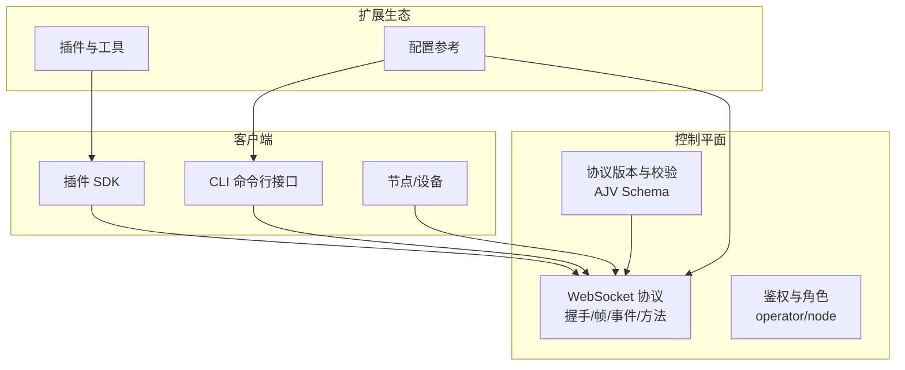
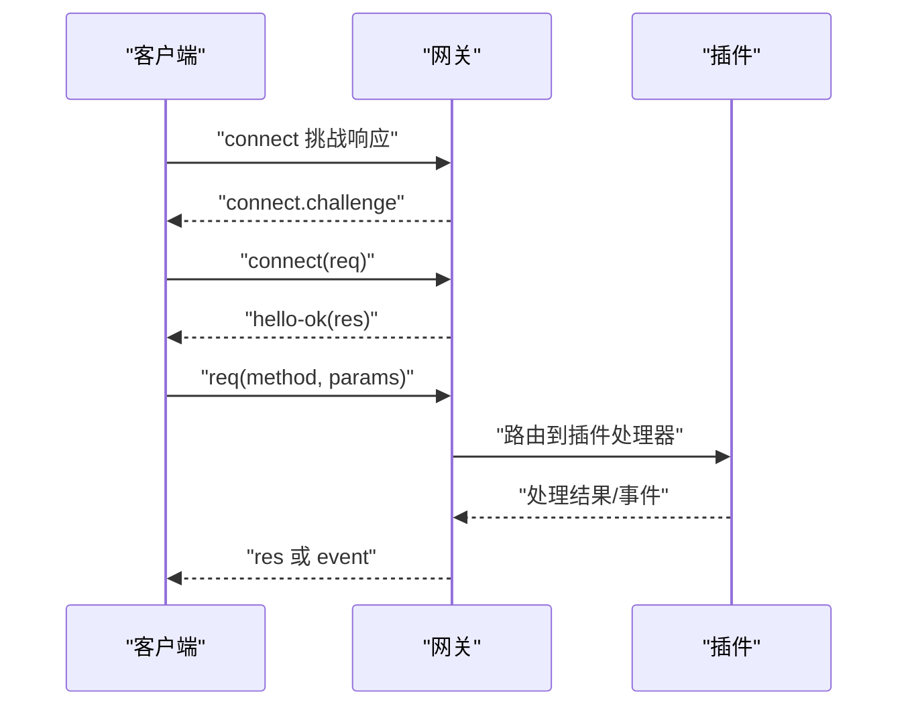
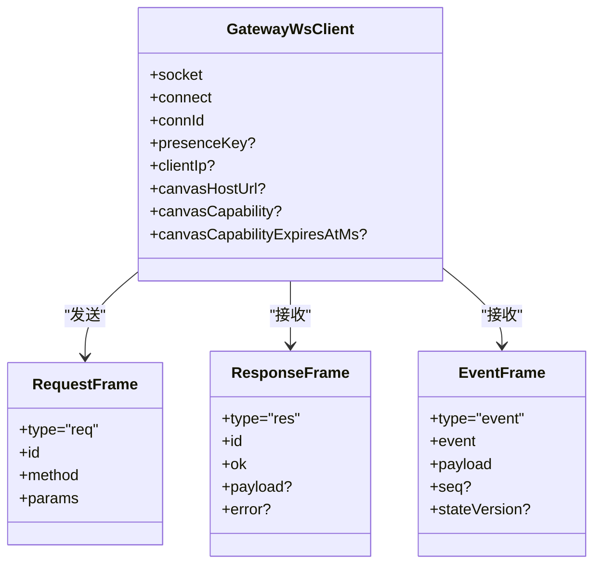
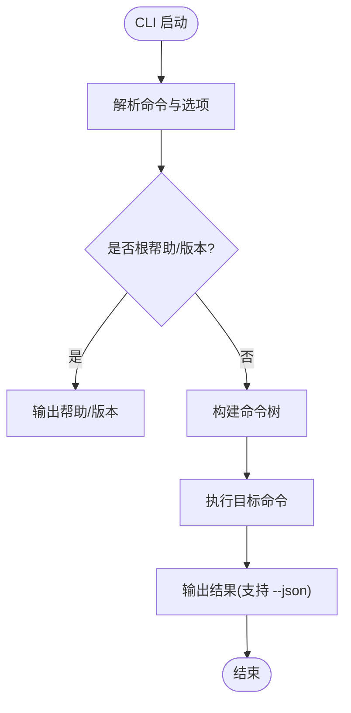
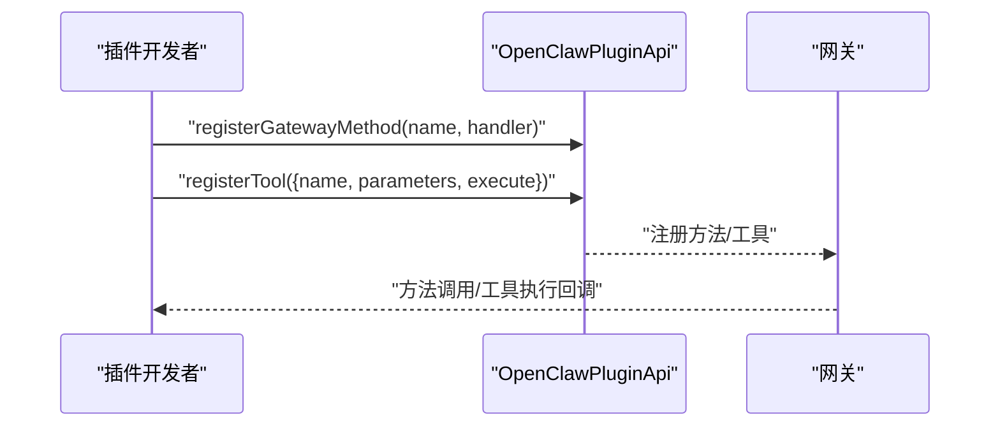
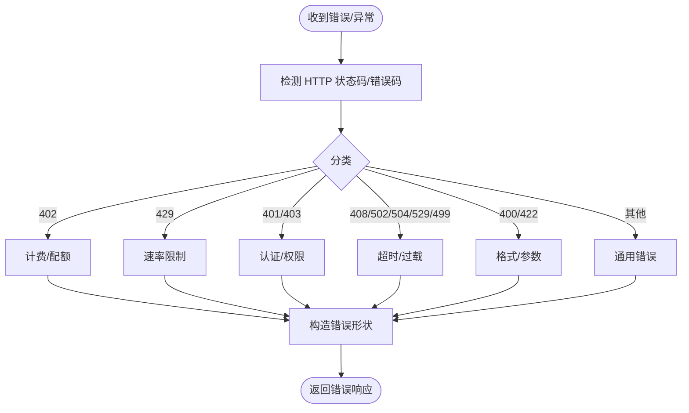
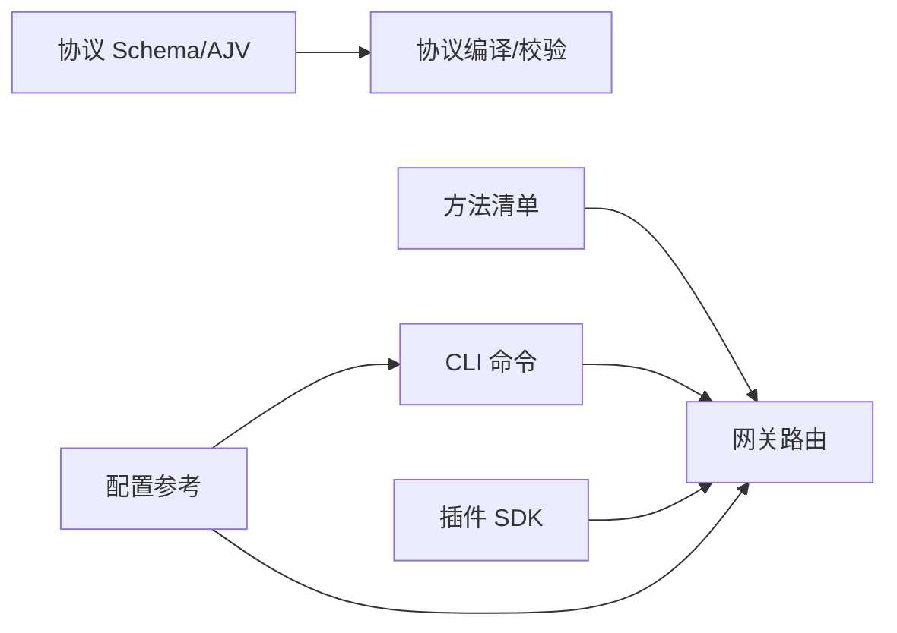

# API 参考

<cite>
**本文档引用的文件**
- [docs/gateway/protocol.md](file://docs/gateway/protocol.md)
- [src/gateway/protocol/index.ts](file://src/gateway/protocol/index.ts)
- [src/gateway/protocol/schema.ts](file://src/gateway/protocol/schema.ts)
- [src/gateway/server-methods-list.ts](file://src/gateway/server-methods-list.ts)
- [src/gateway/server/ws-types.ts](file://src/gateway/server/ws-types.ts)
- [docs/cli/index.md](file://docs/cli/index.md)
- [src/cli/program/context.ts](file://src/cli/program/context.ts)
- [src/cli/program/help.ts](file://src/cli/program/help.ts)
- [src/cli/argv.ts](file://src/cli/argv.ts)
- [src/plugin-sdk/index.ts](file://src/plugin-sdk/index.ts)
- [src/plugin-sdk/entrypoints.ts](file://src/plugin-sdk/entrypoints.ts)
- [scripts/lib/plugin-sdk-entries.mjs](file://scripts/lib/plugin-sdk-entries.mjs)
- [extensions/voice-call/index.ts](file://extensions/voice-call/index.ts)
- [docs/gateway/configuration-reference.md](file://docs/gateway/configuration-reference.md)
- [src/gateway/protocol/schema/error-codes.ts](file://src/gateway/protocol/schema/error-codes.ts)
- [src/agents/pi-embedded-helpers/errors.ts](file://src/agents/pi-embedded-helpers/errors.ts)
- [src/agents/failover-error.ts](file://src/agents/failover-error.ts)
</cite>

## 目录
1. [简介](#简介)
2. [项目结构](#项目结构)
3. [核心组件](#核心组件)
4. [架构总览](#架构总览)
5. [详细组件分析](#详细组件分析)
6. [依赖关系分析](#依赖关系分析)
7. [性能考虑](#性能考虑)
8. [故障排查指南](#故障排查指南)
9. [结论](#结论)
10. [附录](#附录)

## 简介
本参考文档面向 OpenClaw 的控制平面与扩展生态，覆盖以下能力：
- WebSocket 控制平面 API：握手、帧格式、方法与事件、鉴权与角色权限、协议版本与兼容性
- CLI 命令接口：命令树、选项、输出样式与示例
- 插件开发 API：插件 SDK 暴露的类型与运行时能力、注册方法与工具
- 工具调用接口：节点能力调用、网关方法、插件工具与错误分类

本文件同时提供版本管理、向后兼容策略与迁移指引，并给出客户端实现要点、集成最佳实践与性能优化建议。

## 项目结构
OpenClaw 将“控制平面 + 节点传输”统一在 WebSocket 协议之上；CLI 提供丰富的命令集；插件 SDK 为扩展生态提供一致的开发体验；配置参考文档定义了各通道与模型的细粒度参数。

图表来源
- [docs/gateway/protocol.md:1-154](file://docs/gateway/protocol.md#L1-L154)
- [src/gateway/protocol/index.ts:253-458](file://src/gateway/protocol/index.ts#L253-L458)
- [docs/cli/index.md:1-120](file://docs/cli/index.md#L1-L120)
- [src/plugin-sdk/index.ts:1-120](file://src/plugin-sdk/index.ts#L1-L120)
- [docs/gateway/configuration-reference.md:1-120](file://docs/gateway/configuration-reference.md#L1-L120)

章节来源
- [docs/gateway/protocol.md:1-154](file://docs/gateway/protocol.md#L1-L154)
- [docs/cli/index.md:1-120](file://docs/cli/index.md#L1-L120)
- [src/plugin-sdk/index.ts:1-120](file://src/plugin-sdk/index.ts#L1-L120)
- [docs/gateway/configuration-reference.md:1-120](file://docs/gateway/configuration-reference.md#L1-L120)

## 核心组件
- 控制平面协议（WebSocket）
  - 运输层：文本帧 JSON
  - 首帧必须是 connect 请求
  - 握手阶段由 Gateway 发出挑战，客户端完成认证与角色声明
  - 帧类型：req/res/event；幂等键用于副作用方法
- CLI 命令体系
  - 全局标志、输出样式、命令树与子命令
  - 支持 JSON 输出、非交互模式与批量脚本
- 插件 SDK
  - 统一导出类型、运行时上下文、HTTP 路由注册、Webhook 目标解析
  - 插件可注册网关方法与工具，暴露给控制平面与会话运行时
- 配置参考
  - 通道级 DM/群组策略、心跳、媒体限制、重试与网络参数
  - 多账户通道支持与默认账户选择

章节来源
- [docs/gateway/protocol.md:17-154](file://docs/gateway/protocol.md#L17-L154)
- [src/gateway/protocol/index.ts:253-458](file://src/gateway/protocol/index.ts#L253-L458)
- [docs/cli/index.md:62-120](file://docs/cli/index.md#L62-L120)
- [src/plugin-sdk/index.ts:1-120](file://src/plugin-sdk/index.ts#L1-L120)
- [docs/gateway/configuration-reference.md:18-120](file://docs/gateway/configuration-reference.md#L18-L120)

## 架构总览
控制平面采用“单控制平面 + 节点传输”的统一 WebSocket 协议。客户端在握手阶段声明角色与作用域，随后通过方法调用与事件订阅进行交互。插件通过 SDK 注册方法与工具，增强网关能力。

图表来源
- [docs/gateway/protocol.md:22-90](file://docs/gateway/protocol.md#L22-L90)
- [src/gateway/server-methods-list.ts:108-133](file://src/gateway/server-methods-list.ts#L108-L133)

章节来源
- [docs/gateway/protocol.md:22-90](file://docs/gateway/protocol.md#L22-L90)
- [src/gateway/server-methods-list.ts:108-133](file://src/gateway/server-methods-list.ts#L108-L133)

## 详细组件分析

### WebSocket 控制平面 API
- 帧格式与角色
  - req/res/event 三类帧
  - 角色：operator（控制面）、node（节点）
  - 作用域：operator.read/write/admin/approvals/pairing 等
- 握手流程
  - Gateway 先发 challenge，客户端随后发送 connect 请求
  - connect 包含 min/max protocol、client 信息、role/scopes/caps/commands/permissions/auth/locale/userAgent/device 等
  - 成功后返回 hello-ok，可能携带 deviceToken 与策略
- 方法与事件
  - 方法列表包含节点配对、设备令牌、会话、配置、技能、Cron、聊天等
  - 事件包括 connect.challenge、agent、chat、presence、tick、shutdown、health、心跳、cron、节点配对与执行审批等
- 鉴权与设备令牌
  - connect 中包含 token 与设备签名信息
  - 设备令牌成功颁发后，hello-ok 返回 auth 字段
- 协议版本与校验
  - 使用 AJV Schema 校验 connect、帧、参数与响应
  - 格式化验证错误，便于定位问题

图表来源
- [src/gateway/server/ws-types.ts:4-13](file://src/gateway/server/ws-types.ts#L4-L13)
- [src/gateway/protocol/index.ts:259-423](file://src/gateway/protocol/index.ts#L259-L423)

章节来源
- [docs/gateway/protocol.md:17-154](file://docs/gateway/protocol.md#L17-L154)
- [src/gateway/protocol/index.ts:253-458](file://src/gateway/protocol/index.ts#L253-L458)
- [src/gateway/server/ws-types.ts:4-13](file://src/gateway/server/ws-types.ts#L4-L13)

### CLI 命令接口
- 全局标志
  - --dev、--profile、--no-color、--update、-V/--version/-v
- 输出样式
  - TTY 渲染彩色与进度指示；--json/--plain 关闭样式；支持 OSC-8 超链接
- 命令树与示例
  - 包含 setup、configure、config、doctor、dashboard、backup、reset、uninstall、update、message、agent、agents、acp、status、health、sessions、gateway、logs、system、models、memory、directory、nodes、devices、approvals、sandbox、tui、browser、cron、dns、docs、hooks、webhooks、pairing、qr、plugins、channels、security、secrets、skills、daemon、clawbot、voicecall 等
- 子命令与选项
  - 各命令均提供子命令与选项，支持 --json 与非交互模式
- 帮助与示例
  - 帮助页包含示例与文档链接

图表来源
- [docs/cli/index.md:93-264](file://docs/cli/index.md#L93-L264)
- [src/cli/program/help.ts:129-140](file://src/cli/program/help.ts#L129-L140)

章节来源
- [docs/cli/index.md:62-120](file://docs/cli/index.md#L62-L120)
- [src/cli/program/context.ts:11-32](file://src/cli/program/context.ts#L11-L32)
- [src/cli/program/help.ts:129-140](file://src/cli/program/help.ts#L129-L140)
- [src/cli/argv.ts:303-328](file://src/cli/argv.ts#L303-L328)

### 插件开发 API
- SDK 暴露
  - 通道适配器、消息/群组/目录/安全/心跳/网关适配器类型
  - 插件运行时、日志、Webhook 路由注册、请求 URL 解析、SSRF 策略、命令运行等
  - ACP 运行时能力、会话绑定服务、状态辅助、允许白名单解析等
- 插件注册
  - 注册网关方法（如 voicecall.start）
  - 注册工具（如 voice_call），定义参数 Schema
- 插件 SDK 分发
  - 以 openclaw/plugin-sdk 发布，提供明确的子路径导出与类型映射

图表来源
- [src/plugin-sdk/index.ts:1-120](file://src/plugin-sdk/index.ts#L1-L120)
- [extensions/voice-call/index.ts:376-411](file://extensions/voice-call/index.ts#L376-L411)
- [src/plugin-sdk/entrypoints.ts:1-36](file://src/plugin-sdk/entrypoints.ts#L1-L36)
- [scripts/lib/plugin-sdk-entries.mjs:1-36](file://scripts/lib/plugin-sdk-entries.mjs#L1-L36)

章节来源
- [src/plugin-sdk/index.ts:1-120](file://src/plugin-sdk/index.ts#L1-L120)
- [extensions/voice-call/index.ts:113-144](file://extensions/voice-call/index.ts#L113-L144)
- [extensions/voice-call/index.ts:376-411](file://extensions/voice-call/index.ts#L376-L411)
- [src/plugin-sdk/entrypoints.ts:1-36](file://src/plugin-sdk/entrypoints.ts#L1-L36)
- [scripts/lib/plugin-sdk-entries.mjs:1-36](file://scripts/lib/plugin-sdk-entries.mjs#L1-L36)

### 工具调用接口
- 节点能力调用
  - node.invoke、node.invoke.result、node.event、node.pending.* 系列方法
  - 适用于摄像头、画布、屏幕、位置、语音等节点能力
- 网关方法
  - 包括设备配对、令牌轮换/吊销、节点列表/描述/重命名、会话管理、配置读写、技能状态、Cron 管理、聊天历史/发送/中止、系统事件等
- 插件工具
  - 以工具形式暴露，例如 voice_call，支持发起通话、继续通话、播报、查询状态等

章节来源
- [src/gateway/server-methods-list.ts:66-133](file://src/gateway/server-methods-list.ts#L66-L133)
- [extensions/voice-call/index.ts:113-144](file://extensions/voice-call/index.ts#L113-L144)
- [extensions/voice-call/index.ts:376-411](file://extensions/voice-call/index.ts#L376-L411)

### API 版本管理、向后兼容与迁移
- 协议版本
  - connect 中包含 min/maxProtocol，握手成功后以 hello-ok 中的 protocol 为准
  - 协议版本通过 Schema 与 AJV 校验保障
- 向后兼容
  - 通过最小/最大协议版本协商，避免不兼容升级导致的连接失败
  - 事件与方法名变更需在新版本中保持旧名称可用一段时间
- 迁移指引
  - CLI 在部分只读命令上跳过状态迁移，避免不必要的重启或数据变更
  - 配置层面提供多账户与默认账户选择，减少迁移成本

章节来源
- [docs/gateway/protocol.md:22-90](file://docs/gateway/protocol.md#L22-L90)
- [src/gateway/protocol/index.ts:253-458](file://src/gateway/protocol/index.ts#L253-L458)
- [src/cli/argv.ts:303-328](file://src/cli/argv.ts#L303-L328)
- [docs/gateway/configuration-reference.md:620-650](file://docs/gateway/configuration-reference.md#L620-L650)

### 错误码与错误分类
- 错误码
  - NOT_LINKED、NOT_PAIRED、AGENT_TIMEOUT、INVALID_REQUEST、UNAVAILABLE
- 错误形状
  - code、message、details、retryable、retryAfterMs
- 错误分类
  - 基于 HTTP 状态码与消息内容识别计费、速率限制、认证、超时、过载、格式等问题
  - 支持从文本中提取错误负载对象，进行结构化解析

图表来源
- [src/gateway/protocol/schema/error-codes.ts:1-23](file://src/gateway/protocol/schema/error-codes.ts#L1-L23)
- [src/agents/failover-error.ts:94-133](file://src/agents/failover-error.ts#L94-L133)
- [src/agents/pi-embedded-helpers/errors.ts:401-443](file://src/agents/pi-embedded-helpers/errors.ts#L401-L443)
- [src/agents/pi-embedded-helpers/errors.ts:509-564](file://src/agents/pi-embedded-helpers/errors.ts#L509-L564)

章节来源
- [src/gateway/protocol/schema/error-codes.ts:1-23](file://src/gateway/protocol/schema/error-codes.ts#L1-L23)
- [src/agents/failover-error.ts:94-133](file://src/agents/failover-error.ts#L94-L133)
- [src/agents/pi-embedded-helpers/errors.ts:401-443](file://src/agents/pi-embedded-helpers/errors.ts#L401-L443)
- [src/agents/pi-embedded-helpers/errors.ts:509-564](file://src/agents/pi-embedded-helpers/errors.ts#L509-L564)

## 依赖关系分析
- 控制平面依赖
  - 协议层依赖 AJV Schema 校验，确保请求/响应一致性
  - 方法清单动态聚合来自通道插件的网关方法
- CLI 依赖
  - 命令树与帮助页生成，全局上下文提供版本与通道选项
- 插件 SDK 依赖
  - 统一导出类型与运行时工具，插件通过注册接口接入网关
- 配置参考
  - 为 CLI 与网关提供字段级语义与默认值，影响通道行为与策略

图表来源
- [src/gateway/protocol/index.ts:253-458](file://src/gateway/protocol/index.ts#L253-L458)
- [src/gateway/server-methods-list.ts:108-133](file://src/gateway/server-methods-list.ts#L108-L133)
- [docs/cli/index.md:93-264](file://docs/cli/index.md#L93-L264)
- [src/plugin-sdk/index.ts:1-120](file://src/plugin-sdk/index.ts#L1-L120)
- [docs/gateway/configuration-reference.md:1-120](file://docs/gateway/configuration-reference.md#L1-L120)

章节来源
- [src/gateway/protocol/index.ts:253-458](file://src/gateway/protocol/index.ts#L253-L458)
- [src/gateway/server-methods-list.ts:108-133](file://src/gateway/server-methods-list.ts#L108-L133)
- [docs/cli/index.md:93-264](file://docs/cli/index.md#L93-L264)
- [src/plugin-sdk/index.ts:1-120](file://src/plugin-sdk/index.ts#L1-L120)
- [docs/gateway/configuration-reference.md:1-120](file://docs/gateway/configuration-reference.md#L1-L120)

## 性能考虑
- WebSocket 帧与事件
  - 使用文本帧与紧凑 JSON，减少序列化开销
  - 事件按需推送，避免冗余广播
- CLI 输出
  - TTY 下启用彩色与进度指示；非 TTY 使用 --json 降低解析负担
- 插件与工具
  - 工具参数使用 Schema 校验，提前发现无效输入
  - Webhook 与 HTTP 请求设置体大小限制与速率限制，防止资源耗尽
- 配置与通道
  - 合理设置媒体上限、重试策略与网络参数，平衡吞吐与稳定性

[本节为通用指导，无需特定文件引用]

## 故障排查指南
- 协议握手失败
  - 检查 connect 参数完整性与协议版本范围
  - 确认设备签名与 token 正确
- 方法调用错误
  - 查看错误码与错误形状，结合 HTTP 状态码与消息内容判断类型
  - 对计费/配额、速率限制、认证、超时/过载、格式等问题采取相应措施
- CLI 行为异常
  - 使用 --json 获取机器可读输出，便于脚本化诊断
  - 对只读命令跳过状态迁移，避免误触发重启
- 配置问题
  - 使用配置参考核对通道策略、媒体限制与网络参数
  - 多账户场景下确认默认账户与 per-account 覆盖

章节来源
- [docs/gateway/protocol.md:22-90](file://docs/gateway/protocol.md#L22-L90)
- [src/gateway/protocol/schema/error-codes.ts:1-23](file://src/gateway/protocol/schema/error-codes.ts#L1-L23)
- [src/agents/failover-error.ts:94-133](file://src/agents/failover-error.ts#L94-L133)
- [src/cli/argv.ts:303-328](file://src/cli/argv.ts#L303-L328)
- [docs/gateway/configuration-reference.md:18-120](file://docs/gateway/configuration-reference.md#L18-L120)

## 结论
OpenClaw 通过统一的 WebSocket 控制平面与完善的 CLI、插件 SDK、配置参考，提供了可扩展、可观测且可迁移的自动化平台。遵循本文档的协议规范、错误分类与最佳实践，可高效构建稳定可靠的集成方案。

[本节为总结，无需特定文件引用]

## 附录
- API 客户端实现要点
  - 首帧必须是 connect 请求；握手成功后缓存协议版本与策略
  - 对副作用方法使用幂等键，避免重复执行
  - 使用 AJV Schema 校验请求/响应，提升健壮性
- 集成最佳实践
  - 优先使用 --json 输出，便于自动化与监控
  - 在多账户通道中明确默认账户与 per-account 覆盖
  - 对速率限制与配额变化建立告警与降级策略
- 性能优化建议
  - 合理设置媒体上限与分片策略，避免大包阻塞
  - 使用事件驱动而非轮询，降低带宽与 CPU 开销
  - 对插件工具与 Webhook 设置合理的体大小与并发限制

[本节为通用指导，无需特定文件引用]