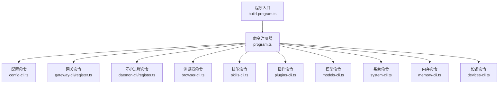
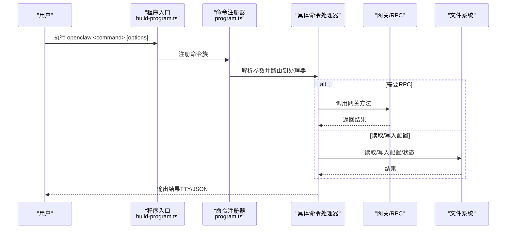
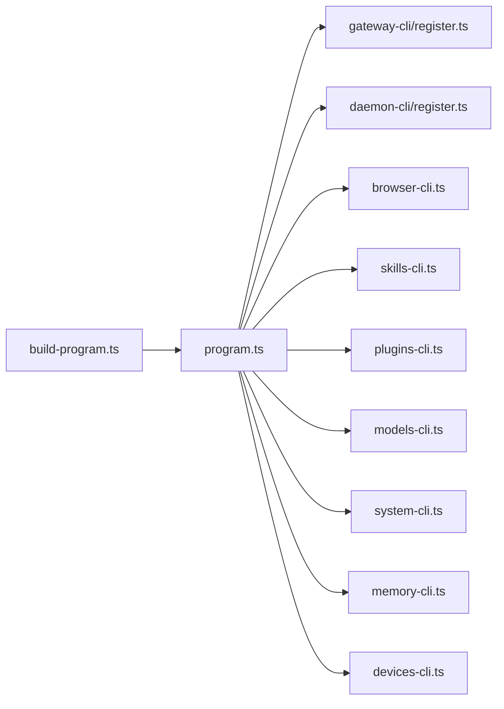

# CLI 命令接口

<cite>
**本文档引用的文件**
- [docs/cli/index.md](file://docs/cli/index.md)
- [src/cli/program.ts](file://src/cli/program.ts)
- [src/cli/program/build-program.ts](file://src/cli/program/build-program.ts)
- [src/cli/config-cli.ts](file://src/cli/config-cli.ts)
- [src/cli/gateway-cli.ts](file://src/cli/gateway-cli.ts)
- [src/cli/gateway-cli/register.ts](file://src/cli/gateway-cli/register.ts)
- [src/cli/daemon-cli.ts](file://src/cli/daemon-cli.ts)
- [src/cli/daemon-cli/register.ts](file://src/cli/daemon-cli/register.ts)
- [src/cli/browser-cli.ts](file://src/cli/browser-cli.ts)
- [src/cli/browser-cli-manage.ts](file://src/cli/browser-cli-manage.ts)
- [src/cli/skills-cli.ts](file://src/cli/skills-cli.ts)
- [src/cli/plugins-cli.ts](file://src/cli/plugins-cli.ts)
- [src/cli/models-cli.ts](file://src/cli/models-cli.ts)
- [src/cli/system-cli.ts](file://src/cli/system-cli.ts)
- [src/cli/memory-cli.ts](file://src/cli/memory-cli.ts)
- [src/cli/devices-cli.ts](file://src/cli/devices-cli.ts)
</cite>

## 目录
1. [简介](#简介)
2. [项目结构](#项目结构)
3. [核心组件](#核心组件)
4. [架构总览](#架构总览)
5. [详细组件分析](#详细组件分析)
6. [依赖关系分析](#依赖关系分析)
7. [性能考虑](#性能考虑)
8. [故障排除指南](#故障排除指南)
9. [结论](#结论)
10. [附录](#附录)

## 简介
本文件为 OpenClaw CLI 命令接口的完整参考文档，覆盖配置管理、网关控制、浏览器操作、插件与技能管理、模型与内存检索、系统事件与心跳、设备配对与令牌管理等全部命令族。内容包括命令语法、参数说明、返回值格式、错误处理策略，并提供实际使用示例、批处理脚本思路与自动化集成建议。

## 项目结构
CLI 子系统以“命令注册 + 运行时执行”的方式组织，核心入口负责构建程序上下文、注册各命令族，并在运行时注入通用选项（如认证、输出样式、全局标志）。命令按功能域拆分到独立模块，通过统一的注册器挂载到根命令树上。

图表来源
- [src/cli/program/build-program.ts:1-21](file://src/cli/program/build-program.ts#L1-L21)
- [src/cli/program.ts:1-3](file://src/cli/program.ts#L1-L3)
- [src/cli/config-cli.ts:395-477](file://src/cli/config-cli.ts#L395-L477)
- [src/cli/gateway-cli/register.ts:89-281](file://src/cli/gateway-cli/register.ts#L89-L281)
- [src/cli/daemon-cli/register.ts:6-20](file://src/cli/daemon-cli/register.ts#L6-L20)
- [src/cli/browser-cli.ts:19-56](file://src/cli/browser-cli.ts#L19-L56)
- [src/cli/skills-cli.ts:40-82](file://src/cli/skills-cli.ts#L40-L82)
- [src/cli/plugins-cli.ts:369-843](file://src/cli/plugins-cli.ts#L369-L843)
- [src/cli/models-cli.ts:37-444](file://src/cli/models-cli.ts#L37-L444)
- [src/cli/system-cli.ts:41-133](file://src/cli/system-cli.ts#L41-L133)
- [src/cli/memory-cli.ts:576-818](file://src/cli/memory-cli.ts#L576-L818)
- [src/cli/devices-cli.ts:213-454](file://src/cli/devices-cli.ts#L213-L454)

章节来源
- [src/cli/program/build-program.ts:1-21](file://src/cli/program/build-program.ts#L1-L21)
- [src/cli/program.ts:1-3](file://src/cli/program.ts#L1-L3)

## 核心组件
- 程序构建器：创建 Commander 实例、设置上下文、注册帮助与预动作钩子、加载命令族。
- 命令注册器：集中挂载各命令族，提供统一的选项注入与帮助文本扩展。
- 运行时与错误处理：统一的命令包装器负责捕获异常、输出彩色日志、设置退出码。
- 全局选项：认证（token/password）、输出样式（--json/--no-color）、调试（--verbose/--debug）等。

章节来源
- [src/cli/program/build-program.ts:8-20](file://src/cli/program/build-program.ts#L8-L20)
- [src/cli/gateway-cli/register.ts:29-35](file://src/cli/gateway-cli/register.ts#L29-L35)

## 架构总览
CLI 采用“命令树 + RPC 调用 + 文件/状态读写”的分层架构。命令解析后，根据目标选择本地状态检查、RPC 调用或文件系统操作；输出统一走运行时日志，支持人类可读与 JSON 机器输出。

图表来源
- [src/cli/program/build-program.ts:8-20](file://src/cli/program/build-program.ts#L8-L20)
- [src/cli/gateway-cli/register.ts:114-137](file://src/cli/gateway-cli/register.ts#L114-L137)

## 详细组件分析

### 配置命令（config）
- 功能：非交互式配置读取、设置、删除、校验、打印当前配置路径。
- 关键能力：
  - 支持点/方括号路径（如 models.providers.anthropic.apiKey），自动创建嵌套对象/数组。
  - 严格 JSON5 解析或回退字符串解析。
  - 写入前基于“解析后的配置快照”进行 unset 操作，避免默认值泄漏。
  - 校验失败时输出逐条问题并提示使用 doctor 修复。
- 参数与返回：
  - get：--json 输出值；不存在时退出码 1。
  - set：--strict-json/--json 切换解析模式；成功提示重启网关生效。
  - unset：成功提示重启网关生效。
  - file：输出当前配置文件绝对路径。
  - validate：--json 输出 {valid,path,issues?}。
- 错误处理：路径非法、解析失败、写入失败均输出错误并退出码 1。

章节来源
- [src/cli/config-cli.ts:279-308](file://src/cli/config-cli.ts#L279-L308)
- [src/cli/config-cli.ts:310-331](file://src/cli/config-cli.ts#L310-L331)
- [src/cli/config-cli.ts:333-342](file://src/cli/config-cli.ts#L333-L342)
- [src/cli/config-cli.ts:344-393](file://src/cli/config-cli.ts#L344-L393)
- [src/cli/config-cli.ts:395-477](file://src/cli/config-cli.ts#L395-L477)

### 网关命令（gateway）
- 功能：运行、查询、探测、发现网关，以及直接调用网关 RPC 方法。
- 子命令：
  - run：前台运行网关。
  - status/install/uninstall/start/stop/restart：服务管理（兼容旧版 daemon 子命令）。
  - call：调用 health/status/system-presence/cron.* 等方法，支持 --params JSON。
  - health：获取健康状态，支持通道健康摘要。
  - probe/discover：探测可达性、发现本地/广域网关。
- 通用选项：--token/--password 继承自父级；--json 控制输出；--timeout 控制整体预算。
- 返回值：默认人类可读，--json 输出原始 JSON；部分命令输出结构化表格或列表。

章节来源
- [src/cli/gateway-cli/register.ts:89-281](file://src/cli/gateway-cli/register.ts#L89-L281)
- [src/cli/daemon-cli/register.ts:6-20](file://src/cli/daemon-cli/register.ts#L6-L20)

### 守护进程命令（daemon）
- 功能：与 gateway 命令等价的服务管理命令，提供更明确的“守护进程”语义。
- 子命令：status/install/uninstall/start/stop/restart。
- 说明：与 gateway service 基本一致，便于历史脚本迁移。

章节来源
- [src/cli/daemon-cli/register.ts:6-20](file://src/cli/daemon-cli/register.ts#L6-L20)

### 浏览器命令（browser）
- 功能：管理专用浏览器（Chrome/Chromium）实例，包括状态、启动/停止、标签页、配置文件、调试等。
- 子命令族：
  - manage：status/start/stop/reset-profile/tabs/tab/new/select/close/open/focus/close/profiles/create-profile/delete-profile。
  - extension/inspect/actions/observe/debug/state：扩展、检查、动作、观察、调试、状态。
- 通用选项：--browser-profile 指定配置文件；--json 控制输出。
- 行为：未带子命令时输出帮助并退出码 1；支持超时控制与进度指示。

章节来源
- [src/cli/browser-cli.ts:19-56](file://src/cli/browser-cli.ts#L19-L56)
- [src/cli/browser-cli-manage.ts:129-529](file://src/cli/browser-cli-manage.ts#L129-L529)

### 技能命令（skills）
- 功能：列出、查看、检查技能可用性。
- 子命令：
  - list [--json] [--eligible] [-v,--verbose]
  - info <name> [--json]
  - check [--json]
- 默认行为：无子命令时等同 list。
- 输出：支持 JSON 与人类可读两种格式。

章节来源
- [src/cli/skills-cli.ts:40-82](file://src/cli/skills-cli.ts#L40-L82)

### 插件命令（plugins）
- 功能：插件安装、启用/禁用、卸载、更新、信息展示与状态检查。
- 子命令：
  - list [--json] [--enabled] [--verbose]
  - info <id> [--json]
  - enable <id> / disable <id>
  - uninstall <id> [--keep-files] [--force] [--dry-run]
  - install <path-or-spec> [-l,--link] [--pin]
  - update [--all] [--dry-run]
- 安装策略：本地路径、归档、npm 规范；支持“捆绑源”回退；记录安装记录与版本；应用互斥槽位策略。
- 卸载流程：预览将移除的条目（配置项、安装记录、允许列表、加载路径、内存槽位、目录），确认后执行并提示重启网关。

章节来源
- [src/cli/plugins-cli.ts:369-843](file://src/cli/plugins-cli.ts#L369-L843)

### 模型命令（models）
- 功能：模型发现、扫描、状态查看、别名与回退管理、认证配置与轮转顺序。
- 子命令：
  - list [--all|--local|--provider] [--json|--plain]
  - status [--json|--plain] [--check] [--probe...] [--agent]
  - set <model> / set-image <model>
  - aliases: list/add/remove
  - fallbacks: list/add/remove/clear
  - image-fallbacks: list/add/remove/clear
  - scan [--min-params|--max-age-days|--provider|--max-candidates|--timeout|--concurrency|--no-probe|--yes|--no-input|--set-default|--set-image] [--json]
  - auth: add/login/setup-token/paste-token/login-github-copilot/order:get/set/clear
- 通用选项：--agent 覆盖默认代理；--status-json/--status-plain 等别名。
- 行为：--check 在认证过期/缺失时非零退出；--probe 支持并发与超时控制。

章节来源
- [src/cli/models-cli.ts:37-444](file://src/cli/models-cli.ts#L37-L444)

### 系统命令（system）
- 功能：系统事件、心跳与存在性控制。
- 子命令：
  - event --text <text> [--mode now|next-heartbeat] [--json]
  - heartbeat last|enable|disable [--json]
  - presence [--json]
- 行为：--mode 校验；成功输出 ok 或 JSON；错误统一输出并退出码 1。

章节来源
- [src/cli/system-cli.ts:41-133](file://src/cli/system-cli.ts#L41-L133)

### 内存命令（memory）
- 功能：内存索引状态查看、强制重建索引、语义搜索。
- 子命令：
  - status [--agent] [--json|--deep|--index|--force|--verbose]
  - index [--agent] [--force] [--verbose]
  - search [query] [--query] [--agent] [--max-results] [--min-score] [--json]
- 行为：
  - status：支持深度探测向量/嵌入可用性；--index 强制重建；--deep 同时触发深度探测。
  - index：进度条显示；支持 verbose 输出阶段标签与 ETA。
  - search：必填查询；--json 输出结构化结果；空结果输出“无匹配”。

章节来源
- [src/cli/memory-cli.ts:576-818](file://src/cli/memory-cli.ts#L576-L818)

### 设备命令（devices）
- 功能：设备配对请求列表、批准/拒绝、移除、清理、令牌轮换与吊销。
- 子命令：
  - list [--json]
  - approve [<requestId>|--latest] [--json]
  - reject <requestId> [--json]
  - remove <deviceId> [--json]
  - clear [--pending] [--yes] [--json]
  - rotate --device <id> --role <role> [--scope ...] [--json]
  - revoke --device <id> --role <role> [--json]
- 行为：
  - 自动回退到本地配对文件（当远程网关需要配对但 URL 为本地环回时）。
  - --yes 必须显式确认破坏性操作（如 clear）。
  - 输出表格化列表，支持 JSON。

章节来源
- [src/cli/devices-cli.ts:213-454](file://src/cli/devices-cli.ts#L213-L454)

## 依赖关系分析
- 命令注册依赖于 Commander 与运行时上下文，通过统一的注册器集中挂载。
- 网关相关命令共享 RPC 选项注入与错误包装逻辑，确保一致性。
- 浏览器命令依赖浏览器客户端与 CDP/Chrome MCP 传输抽象。
- 插件与模型命令依赖配置解析与状态目录，涉及文件系统与网络探测。
- 内存命令依赖内存搜索管理器与会话/工作区路径解析。
- 设备命令在远程不可达时自动回退到本地配对文件。

图表来源
- [src/cli/program/build-program.ts:8-20](file://src/cli/program/build-program.ts#L8-L20)
- [src/cli/gateway-cli/register.ts:89-281](file://src/cli/gateway-cli/register.ts#L89-L281)
- [src/cli/daemon-cli/register.ts:6-20](file://src/cli/daemon-cli/register.ts#L6-L20)
- [src/cli/browser-cli.ts:19-56](file://src/cli/browser-cli.ts#L19-L56)
- [src/cli/skills-cli.ts:40-82](file://src/cli/skills-cli.ts#L40-L82)
- [src/cli/plugins-cli.ts:369-843](file://src/cli/plugins-cli.ts#L369-L843)
- [src/cli/models-cli.ts:37-444](file://src/cli/models-cli.ts#L37-L444)
- [src/cli/system-cli.ts:41-133](file://src/cli/system-cli.ts#L41-L133)
- [src/cli/memory-cli.ts:576-818](file://src/cli/memory-cli.ts#L576-L818)
- [src/cli/devices-cli.ts:213-454](file://src/cli/devices-cli.ts#L213-L454)

## 性能考虑
- 大多数命令支持 --json 输出，便于脚本消费，减少解析开销。
- 深度探测（如 memory --deep、models --probe）会增加网络/磁盘访问，建议在必要时使用。
- 浏览器命令与内存索引涉及长耗时操作，内置进度条与可选 verbose 输出，避免阻塞。
- 网关命令的 --timeout 可控整体预算，避免长时间等待。

## 故障排除指南
- 配置无效：使用 config validate 或 doctor 修复；--json 输出机器可读问题清单。
- 网关不可达：使用 gateway probe/discover 获取诊断信息；检查 token/password 与绑定地址。
- 插件安装失败：检查本地路径/归档完整性；必要时使用捆绑源回退；查看安装记录与版本。
- 内存索引异常：使用 memory status --deep 探测向量/嵌入可用性；必要时 memory index --force 重建。
- 设备配对：若远程网关要求配对且 URL 为本地环回，系统会自动回退到本地配对文件；否则需先批准远程请求。

章节来源
- [src/cli/config-cli.ts:344-393](file://src/cli/config-cli.ts#L344-L393)
- [src/cli/gateway-cli/register.ts:192-209](file://src/cli/gateway-cli/register.ts#L192-L209)
- [src/cli/memory-cli.ts:335-574](file://src/cli/memory-cli.ts#L335-L574)
- [src/cli/devices-cli.ts:100-145](file://src/cli/devices-cli.ts#L100-L145)

## 结论
本 CLI 提供了从配置、网关、浏览器、插件、技能、模型、内存、系统到设备的全栈命令集，既适合交互式使用也适合自动化集成。通过统一的运行时与错误处理、丰富的输出格式与选项，能够满足从日常运维到复杂场景的多样化需求。

## 附录

### 常用命令速查与示例
- 配置
  - 查看配置：openclaw config get models.providers.anthropic.apiKey
  - 设置配置：openclaw config set models.defaults.model claude-3-5-sonnet
  - 校验配置：openclaw config validate
- 网关
  - 启动网关：openclaw gateway run
  - 查看健康：openclaw gateway health
  - 直接调用：openclaw gateway call status
- 浏览器
  - 启动浏览器：openclaw browser start
  - 打开新标签：openclaw browser open https://example.com
- 插件
  - 安装插件：openclaw plugins install ./my-plugin.tgz
  - 启用插件：openclaw plugins enable my-plugin
  - 更新插件：openclaw plugins update --all
- 技能
  - 列出技能：openclaw skills list
  - 检查就绪：openclaw skills check
- 模型
  - 查看状态：openclaw models status
  - 设置默认模型：openclaw models set claude-4
  - 认证登录：openclaw models auth login --provider anthropic
- 内存
  - 状态：openclaw memory status
  - 重建索引：openclaw memory index --force
  - 语义搜索：openclaw memory search "部署问题"
- 系统
  - 发送事件：openclaw system event --text "备份完成"
  - 心跳控制：openclaw system heartbeat disable
- 设备
  - 列表：openclaw devices list
  - 批准配对：openclaw devices approve --latest
  - 轮换令牌：openclaw devices rotate --device abc123 --role monitor --scope read

章节来源
- [docs/cli/index.md:1-800](file://docs/cli/index.md#L1-L800)
- [src/cli/memory-cli.ts:576-818](file://src/cli/memory-cli.ts#L576-L818)