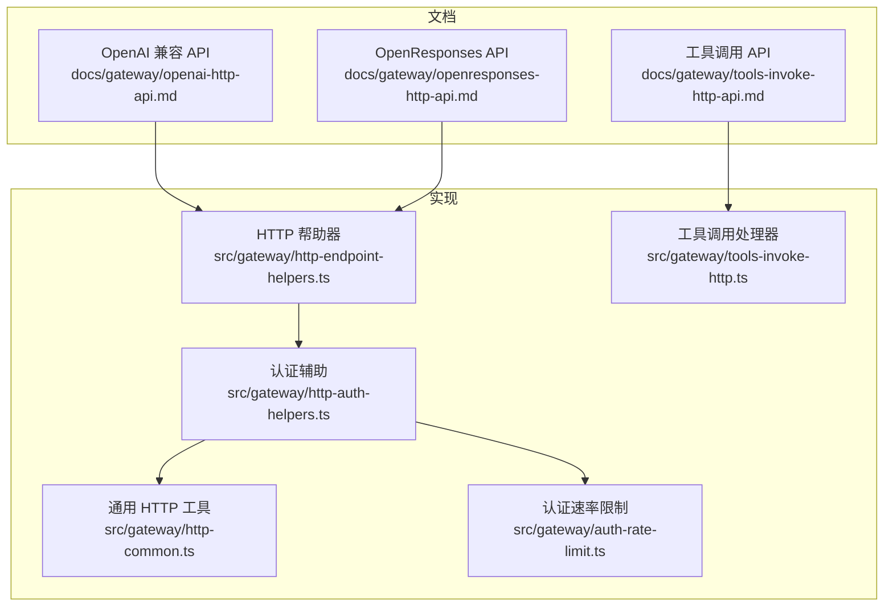
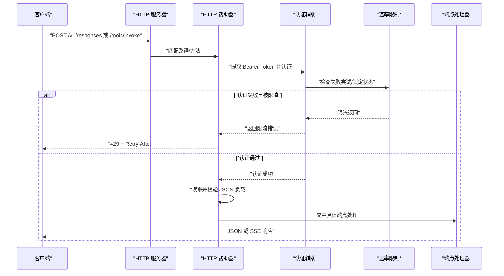
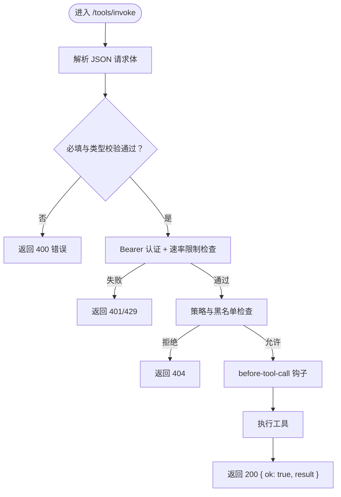
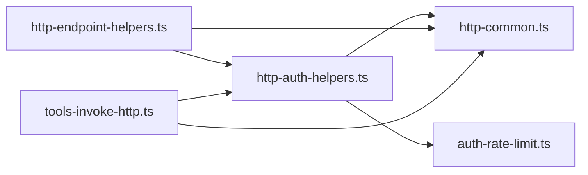

# HTTP API

<cite>
**本文引用的文件**
- [openai-http-api.md](file://docs/gateway/openai-http-api.md)
- [openresponses-http-api.md](file://docs/gateway/openresponses-http-api.md)
- [tools-invoke-http-api.md](file://docs/gateway/tools-invoke-http-api.md)
- [authentication.md](file://docs/gateway/authentication.md)
- [configuration-reference.md](file://docs/gateway/configuration-reference.md)
- [http-endpoint-helpers.ts](file://src/gateway/http-endpoint-helpers.ts)
- [http-auth-helpers.ts](file://src/gateway/http-auth-helpers.ts)
- [http-common.ts](file://src/gateway/http-common.ts)
- [auth-rate-limit.ts](file://src/gateway/auth-rate-limit.ts)
- [tools-invoke-http.ts](file://src/gateway/tools-invoke-http.ts)
- [openresponses-http-api.md（中文）](file://docs/zh-CN/gateway/openresponses-http-api.md)
- [openai-http-api.md（中文）](file://docs/zh-CN/gateway/openai-http-api.md)
- [tools-invoke-http-api.md（中文）](file://docs/zh-CN/gateway/tools-invoke-http-api.md)
</cite>

## 目录
1. [简介](#简介)
2. [项目结构](#项目结构)
3. [核心组件](#核心组件)
4. [架构总览](#架构总览)
5. [详细组件分析](#详细组件分析)
6. [依赖关系分析](#依赖关系分析)
7. [性能考量](#性能考量)
8. [故障排查指南](#故障排查指南)
9. [结论](#结论)
10. [附录](#附录)

## 简介
本文件为 OpenClaw Gateway 的 HTTP API 完整参考，覆盖以下三类端点：
- OpenAI 兼容 API：/v1/chat/completions
- OpenResponses 兼容 API：/v1/responses
- 工具调用 HTTP API：/tools/invoke

内容包括端点规范、请求/响应格式、认证方式、错误码与速率限制、示例与最佳实践，并补充版本管理、向后兼容性与迁移策略说明。

## 项目结构
- 文档层：位于 docs/gateway 与 docs/zh-CN/gateway，提供英文与中文版 API 规范与示例。
- 实现层：位于 src/gateway，包含通用 HTTP 帮助器、认证与速率限制、具体端点处理器等。

图表来源
- [openai-http-api.md](file://docs/gateway/openai-http-api.md)
- [openresponses-http-api.md](file://docs/gateway/openresponses-http-api.md)
- [tools-invoke-http-api.md](file://docs/gateway/tools-invoke-http-api.md)
- [http-endpoint-helpers.ts](file://src/gateway/http-endpoint-helpers.ts)
- [http-auth-helpers.ts](file://src/gateway/http-auth-helpers.ts)
- [http-common.ts](file://src/gateway/http-common.ts)
- [auth-rate-limit.ts](file://src/gateway/auth-rate-limit.ts)
- [tools-invoke-http.ts](file://src/gateway/tools-invoke-http.ts)

章节来源
- [openai-http-api.md](file://docs/gateway/openai-http-api.md)
- [openresponses-http-api.md](file://docs/gateway/openresponses-http-api.md)
- [tools-invoke-http-api.md](file://docs/gateway/tools-invoke-http-api.md)
- [http-endpoint-helpers.ts](file://src/gateway/http-endpoint-helpers.ts)
- [http-auth-helpers.ts](file://src/gateway/http-auth-helpers.ts)
- [http-common.ts](file://src/gateway/http-common.ts)
- [auth-rate-limit.ts](file://src/gateway/auth-rate-limit.ts)
- [tools-invoke-http.ts](file://src/gateway/tools-invoke-http.ts)

## 核心组件
- 通用 HTTP 帮助器：统一处理路径匹配、方法校验、JSON 解析与错误响应。
- 认证与速率限制：基于 Bearer Token 的网关认证，支持失败次数滑动窗口限流。
- OpenAI 兼容端点：/v1/chat/completions，支持 SSE 流式输出。
- OpenResponses 端点：/v1/responses，支持 item-based 输入、工具调用与 SSE。
- 工具调用端点：/tools/invoke，直接执行单个工具，受策略与黑名单约束。

章节来源
- [http-endpoint-helpers.ts](file://src/gateway/http-endpoint-helpers.ts)
- [http-auth-helpers.ts](file://src/gateway/http-auth-helpers.ts)
- [http-common.ts](file://src/gateway/http-common.ts)
- [auth-rate-limit.ts](file://src/gateway/auth-rate-limit.ts)
- [tools-invoke-http.ts](file://src/gateway/tools-invoke-http.ts)
- [openai-http-api.md](file://docs/gateway/openai-http-api.md)
- [openresponses-http-api.md](file://docs/gateway/openresponses-http-api.md)
- [tools-invoke-http-api.md](file://docs/gateway/tools-invoke-http-api.md)

## 架构总览
下图展示 HTTP 请求在 Gateway 中的处理链路：从入口到认证、参数解析、业务处理与响应返回。

图表来源
- [http-endpoint-helpers.ts](file://src/gateway/http-endpoint-helpers.ts)
- [http-auth-helpers.ts](file://src/gateway/http-auth-helpers.ts)
- [http-common.ts](file://src/gateway/http-common.ts)
- [auth-rate-limit.ts](file://src/gateway/auth-rate-limit.ts)
- [tools-invoke-http.ts](file://src/gateway/tools-invoke-http.ts)

## 详细组件分析

### OpenAI 兼容 API：/v1/chat/completions
- 端点
  - 方法：POST
  - 路径：/v1/chat/completions
  - 默认关闭，需在配置中开启
- 认证与安全
  - 使用 Bearer Token，遵循 Gateway 认证配置
  - 高权限面：视为网关操作员凭据，建议仅内网/私有入口暴露
- 选择代理与会话
  - model 字段支持 openclaw:<agentId> 或 agent:<agentId>
  - 可通过 x-openclaw-agent-id 指定代理
  - 可通过 x-openclaw-session-key 控制会话路由
  - user 字段可用于稳定派生会话键
- 流式输出（SSE）
  - stream=true 时返回 text/event-stream
  - 事件行格式为 data: <json>，结束为 data: [DONE]
- 示例
  - 非流式与流式调用示例见文档

章节来源
- [openai-http-api.md](file://docs/gateway/openai-http-api.md)
- [openai-http-api.md（中文）](file://docs/zh-CN/gateway/openai-http-api.md)

### OpenResponses API：/v1/responses
- 端点
  - 方法：POST
  - 路径：/v1/responses
  - 默认关闭，需在配置中开启
- 认证与安全
  - 与 OpenAI 端点一致的认证与安全边界
- 请求结构（支持）
  - input：字符串或 item 数组
  - instructions：合并到系统提示
  - tools：客户端函数工具定义
  - tool_choice：工具筛选/强制
  - stream：启用 SSE
  - max_output_tokens：尽力而为的输出限制
  - user：稳定会话路由
- 支持的 item 类型
  - message：roles 包含 system、developer、user、assistant
  - function_call_output：用于回传工具结果
  - reasoning 与 item_reference：兼容字段，当前忽略
- 文件与图片
  - input_file 与 input_image 支持 base64/URL
  - MIME 与大小限制、PDF 解析策略、URL 白名单与安全限制
- 流式输出（SSE）
  - 事件类型：response.created、response.in_progress、response.output_item.added、response.content_part.added、response.output_text.delta、response.output_text.done、response.content_part.done、response.output_item.done、response.completed、response.failed
- 错误
  - 统一 JSON 错误对象，常见 401/400/405
- 示例
  - 非流式与流式调用示例见文档

章节来源
- [openresponses-http-api.md](file://docs/gateway/openresponses-http-api.md)
- [openresponses-http-api.md（中文）](file://docs/zh-CN/gateway/openresponses-http-api.md)

### 工具调用 HTTP API：/tools/invoke
- 端点
  - 方法：POST
  - 路径：/tools/invoke
  - 总是启用，但受认证、策略与黑名单约束
- 认证
  - Bearer Token，支持速率限制
- 请求体字段
  - tool：必填，工具名称
  - action：可选，若工具 schema 支持则自动注入到 args
  - args：可选，工具特定参数
  - sessionKey：可选，默认 main
  - dryRun：保留字段，当前忽略
- 策略与路由
  - 通过与代理相同的策略链：tools.profile、tools.allow、agents.<id>.tools.allow、群组/通道策略、子代理策略
  - 默认黑名单：sessions_spawn、sessions_send、gateway、whatsapp_login
  - 可通过 gateway.tools 自定义黑名单
- 响应
  - 200：{ ok: true, result }
  - 400：{ ok: false, error: { type, message } }
  - 401：未授权
  - 429：认证限流（带 Retry-After）
  - 404：工具不可用（未找到或未允许）
  - 405：方法不允许
  - 500：工具执行异常（消息已清洗）

图表来源
- [tools-invoke-http.ts](file://src/gateway/tools-invoke-http.ts)
- [http-common.ts](file://src/gateway/http-common.ts)

章节来源
- [tools-invoke-http-api.md](file://docs/gateway/tools-invoke-http-api.md)
- [tools-invoke-http-api.md（中文）](file://docs/zh-CN/gateway/tools-invoke-http-api.md)
- [tools-invoke-http.ts](file://src/gateway/tools-invoke-http.ts)

## 依赖关系分析
- 认证与速率限制
  - authorizeGatewayBearerRequestOrReply 调用 authorizeHttpGatewayConnect 执行认证
  - 若启用 rateLimiter，则对失败尝试进行滑动窗口计数与锁定期控制
- 通用 HTTP 工具
  - setDefaultSecurityHeaders、sendJson、sendUnauthorized、sendRateLimited、sendInvalidRequest、readJsonBodyOrError、setSseHeaders 等统一封装
- 端点帮助器
  - handleGatewayPostJsonEndpoint 统一处理路径匹配、方法校验、认证与 JSON 读取

图表来源
- [http-auth-helpers.ts](file://src/gateway/http-auth-helpers.ts)
- [http-common.ts](file://src/gateway/http-common.ts)
- [http-endpoint-helpers.ts](file://src/gateway/http-endpoint-helpers.ts)
- [auth-rate-limit.ts](file://src/gateway/auth-rate-limit.ts)
- [tools-invoke-http.ts](file://src/gateway/tools-invoke-http.ts)

章节来源
- [http-auth-helpers.ts](file://src/gateway/http-auth-helpers.ts)
- [http-common.ts](file://src/gateway/http-common.ts)
- [http-endpoint-helpers.ts](file://src/gateway/http-endpoint-helpers.ts)
- [auth-rate-limit.ts](file://src/gateway/auth-rate-limit.ts)
- [tools-invoke-http.ts](file://src/gateway/tools-invoke-http.ts)

## 性能考量
- 速率限制
  - 认证失败尝试采用滑动窗口计数，超过阈值进入锁定期
  - 支持对本地回环地址豁免，避免本地调试被锁
- 负载大小
  - 端点均内置最大负载字节限制，超限返回 413
- 流式输出
  - SSE 模式下逐段推送，降低首字节延迟
- 会话稳定性
  - user 字段可派生稳定会话键，减少重复调用的上下文重建成本

章节来源
- [auth-rate-limit.ts](file://src/gateway/auth-rate-limit.ts)
- [http-common.ts](file://src/gateway/http-common.ts)
- [openai-http-api.md](file://docs/gateway/openai-http-api.md)
- [openresponses-http-api.md](file://docs/gateway/openresponses-http-api.md)

## 故障排查指南
- 认证失败与限流
  - 401：无效或缺失 Bearer Token
  - 429：失败尝试过多，返回 Retry-After 秒数
- 请求体问题
  - 400：请求体无效
  - 413：请求体过大
  - 408：请求体读取超时
  - 405：方法不允许（例如非 POST）
- 工具调用
  - 404：工具未找到或未被允许
  - 500：工具执行异常（消息已清洗）
- 安全与策略
  - 高权限端点仅限内网/私有入口，避免直接暴露公网
  - 如需跨网络访问，结合可信代理与网络出口控制

章节来源
- [http-common.ts](file://src/gateway/http-common.ts)
- [tools-invoke-http.ts](file://src/gateway/tools-invoke-http.ts)
- [openai-http-api.md](file://docs/gateway/openai-http-api.md)
- [openresponses-http-api.md](file://docs/gateway/openresponses-http-api.md)

## 结论
- OpenAI 兼容与 OpenResponses 端点提供标准 HTTP 接口，便于现有生态集成
- /tools/invoke 提供细粒度工具调用能力，配合策略与黑名单保障安全
- 通过速率限制与安全头策略，提升端点可用性与安全性
- 建议优先启用 OpenResponses 端点，逐步弃用 OpenAI 兼容端点

## 附录

### 版本管理、向后兼容与迁移
- OpenAI 兼容端点标记为遗留，建议迁移到 OpenResponses 端点
- 两者可独立开关，便于渐进迁移
- OpenResponses 端点默认关闭，需显式启用

章节来源
- [openresponses-http-api.md](file://docs/gateway/openresponses-http-api.md)
- [openai-http-api.md](file://docs/gateway/openai-http-api.md)

### 认证与密钥管理
- 支持 API Key 与订阅型 setup-token（Anthropic）
- 建议在网关主机上管理密钥，守护进程场景推荐使用 ~/.openclaw/.env
- 支持多密钥轮转与按需重试策略

章节来源
- [authentication.md](file://docs/gateway/authentication.md)

### 配置参考要点
- 网关 HTTP 端点开关与资源限制
  - chatCompletions.enabled / responses.enabled
  - responses 端点的 maxBodyBytes、maxUrlParts、files/images 限制
- 认证速率限制配置
  - maxAttempts、windowMs、lockoutMs、exemptLoopback、pruneIntervalMs

章节来源
- [configuration-reference.md](file://docs/gateway/configuration-reference.md)