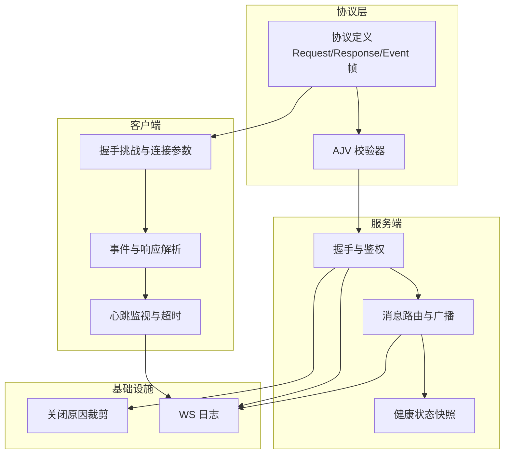
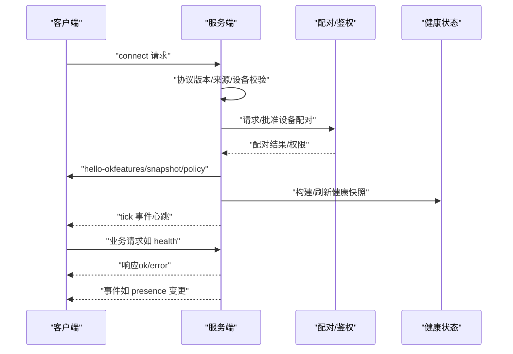
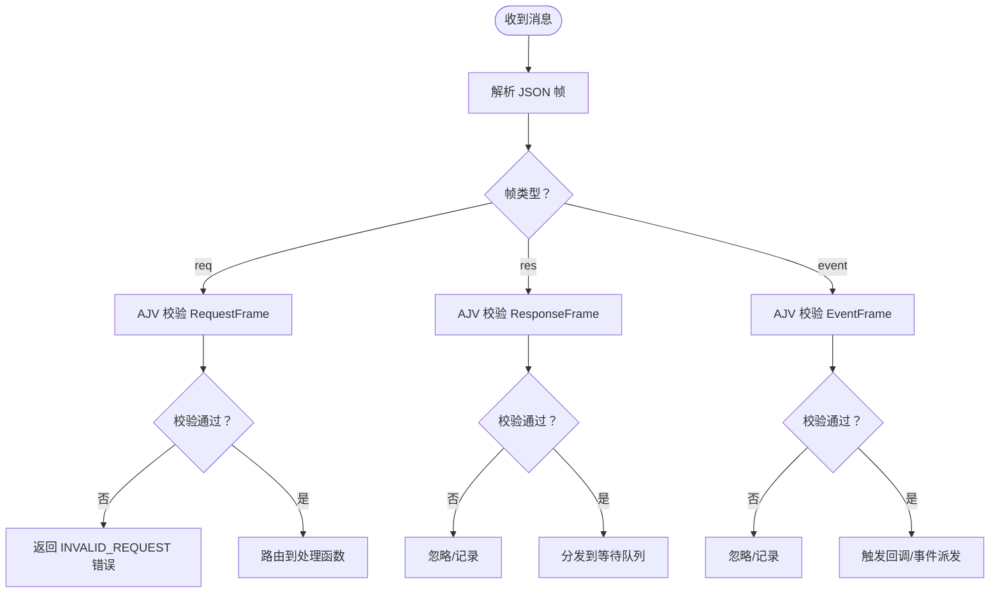
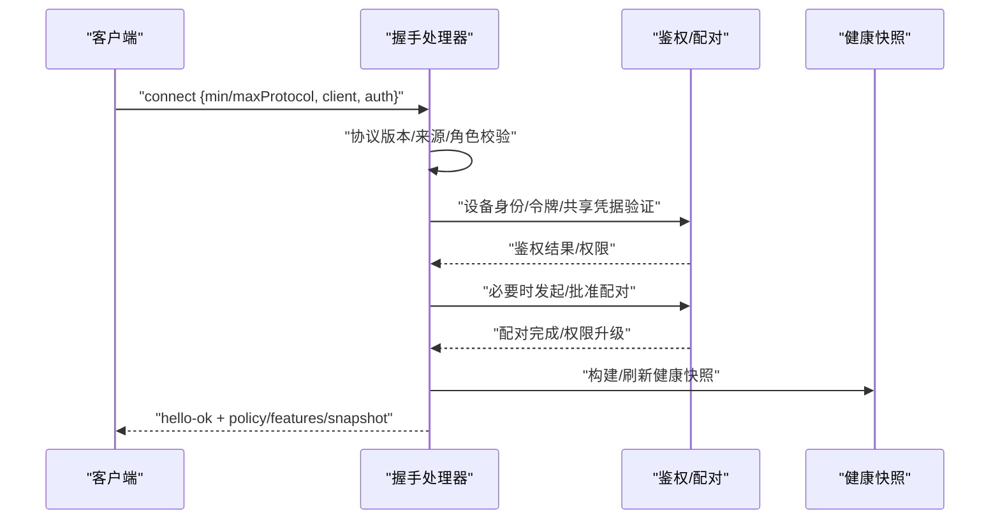
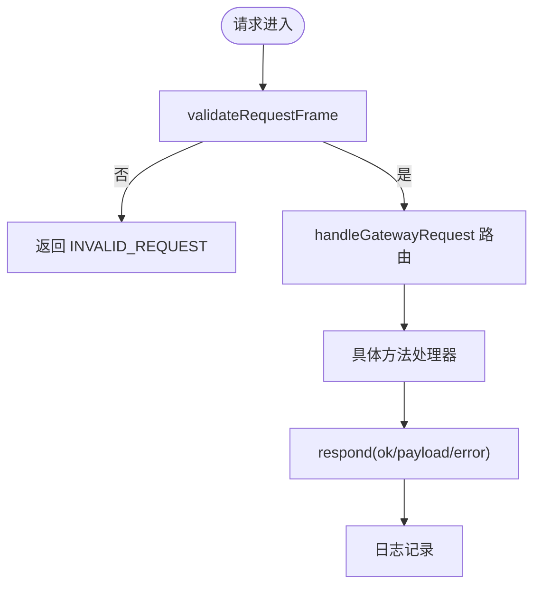
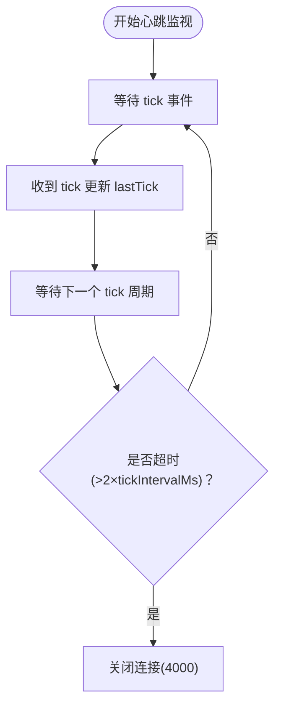
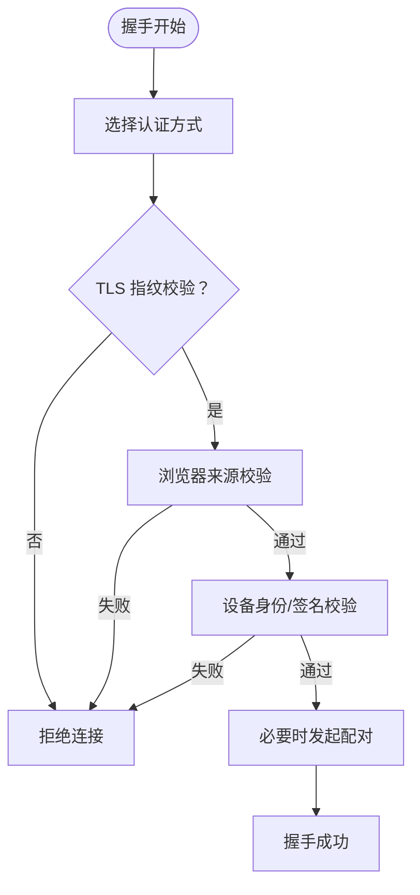
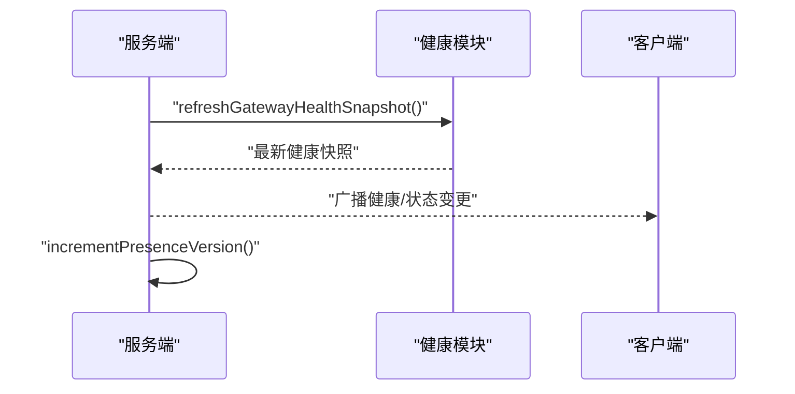
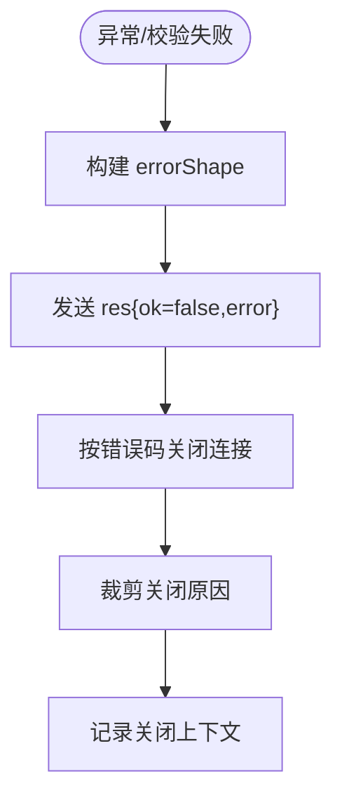
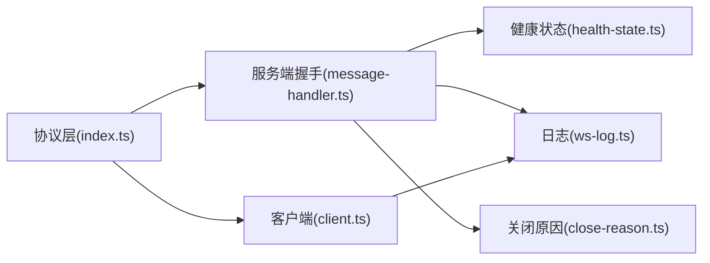

# WebSocket API

<cite>
**本文引用的文件**
- [message-handler.ts](file://src/gateway/server/ws-connection/message-handler.ts)
- [ws-types.ts](file://src/gateway/server/ws-types.ts)
- [index.ts](file://src/gateway/protocol/index.ts)
- [client.ts](file://src/gateway/client.ts)
- [ws-log.ts](file://src/gateway/ws-log.ts)
- [health-state.ts](file://src/gateway/server/health-state.ts)
- [close-reason.ts](file://src/gateway/server/close-reason.ts)
- [typebox.md](file://docs/zh-CN/concepts/typebox.md)
- [gateway/index.md](file://docs/zh-CN/gateway/index.md)
- [ws-connection.ts](file://src/gateway/server/ws-connection.ts)
- [client.watchdog.test.ts](file://src/gateway/client.watchdog.test.ts)
- [test-helpers.server.ts](file://src/gateway/test-helpers.server.ts)
</cite>

## 目录
1. [简介](#简介)
2. [项目结构](#项目结构)
3. [核心组件](#核心组件)
4. [架构总览](#架构总览)
5. [详细组件分析](#详细组件分析)
6. [依赖关系分析](#依赖关系分析)
7. [性能考量](#性能考量)
8. [故障排查指南](#故障排查指南)
9. [结论](#结论)
10. [附录](#附录)

## 简介
本文件系统性梳理并说明控制平面 WebSocket API 的设计与实现，覆盖连接建立、消息格式、事件类型、实时交互模式、连接处理、消息路由、状态同步、错误处理、心跳机制、认证流程与安全策略，并提供客户端实现要点、调试与监控方法。

## 项目结构
围绕 WebSocket 控制平面的关键代码分布在以下模块：
- 协议定义与校验：协议帧类型、参数模式、错误码等由统一的协议层定义并通过 AJV 校验。
- 服务端握手与消息处理：负责连接鉴权、配对、状态快照、事件广播与请求路由。
- 客户端实现：负责握手挑战、连接参数构造、事件与响应解析、心跳监视与重连。
- 日志与健康：统一的 WebSocket 日志格式与健康状态快照。
- 关闭原因裁剪：避免过长关闭原因导致日志膨胀。

**图表来源**
- [index.ts:1-673](file://src/gateway/protocol/index.ts#L1-L673)
- [message-handler.ts:132-1164](file://src/gateway/server/ws-connection/message-handler.ts#L132-L1164)
- [client.ts:1-753](file://src/gateway/client.ts#L1-L753)
- [ws-log.ts:47-100](file://src/gateway/ws-log.ts#L47-L100)
- [close-reason.ts:1-14](file://src/gateway/server/close-reason.ts#L1-L14)

**章节来源**
- [index.ts:1-673](file://src/gateway/protocol/index.ts#L1-L673)
- [message-handler.ts:132-1164](file://src/gateway/server/ws-connection/message-handler.ts#L132-L1164)
- [client.ts:1-753](file://src/gateway/client.ts#L1-L753)
- [ws-log.ts:47-100](file://src/gateway/ws-log.ts#L47-L100)
- [close-reason.ts:1-14](file://src/gateway/server/close-reason.ts#L1-L14)

## 核心组件
- 协议与帧模型
  - 三类帧：请求帧、响应帧、事件帧；首帧必须为 connect 请求。
  - 参数与返回体通过 TypeBox 模式定义，运行时由 AJV 校验。
- 服务端握手与鉴权
  - 协议版本协商、角色与作用域解析、浏览器来源检查、设备身份校验、配对流程与权限升级。
- 客户端握手与心跳
  - 首次连接收到 connect.challenge 后携带 nonce 发送 connect；随后监听 tick 并启动心跳监视器。
- 健康与状态
  - 构建全局快照（presence、health、stateVersion），周期刷新健康状态并广播变更。

**章节来源**
- [typebox.md:1-41](file://docs/zh-CN/concepts/typebox.md#L1-L41)
- [gateway/index.md:135-144](file://docs/zh-CN/gateway/index.md#L135-L144)
- [message-handler.ts:343-1059](file://src/gateway/server/ws-connection/message-handler.ts#L343-L1059)
- [client.ts:554-614](file://src/gateway/client.ts#L554-L614)

## 架构总览
下图展示从客户端到服务端的典型握手与会话生命周期，包括鉴权、配对、状态同步与事件广播。

**图表来源**
- [message-handler.ts:343-1059](file://src/gateway/server/ws-connection/message-handler.ts#L343-L1059)
- [health-state.ts:17-85](file://src/gateway/server/health-state.ts#L17-L85)
- [client.ts:554-614](file://src/gateway/client.ts#L554-L614)

## 详细组件分析

### 协议与消息格式
- 帧类型
  - 请求帧：type="req"，包含 id、method、params。
  - 响应帧：type="res"，包含 id、ok、payload 或 error。
  - 事件帧：type="event"，包含 event、payload，可选 seq、stateVersion。
- 首帧约束
  - 必须为 connect 请求，包含 min/maxProtocol、client 元数据与可选 auth/caps/locale/userAgent 等。
- hello-ok 响应
  - 包含 protocol、server（version、connId）、features（methods/events）、snapshot、policy（maxPayload、maxBufferedBytes、tickIntervalMs）。
- 错误与恢复
  - 使用统一 ErrorCodes 与 errorShape，支持 details/code 用于 UI 提示与自动恢复建议。

**图表来源**
- [index.ts:253-458](file://src/gateway/protocol/index.ts#L253-L458)
- [message-handler.ts:258-1142](file://src/gateway/server/ws-connection/message-handler.ts#L258-L1142)

**章节来源**
- [typebox.md:75-142](file://docs/zh-CN/concepts/typebox.md#L75-L142)
- [gateway/index.md:135-144](file://docs/zh-CN/gateway/index.md#L135-L144)
- [index.ts:1-673](file://src/gateway/protocol/index.ts#L1-L673)

### 连接建立与握手
- 协议版本协商
  - 客户端 min/maxProtocol 与服务端 PROTOCOL_VERSION 对齐，否则拒绝并关闭。
- 角色与作用域
  - 解析 role 并显式声明 scopes，未绑定设备身份时清空作用域以避免自声明权限。
- 浏览器来源检查
  - 对 Control UI/WebChat 强制来源校验，支持 Host 头回退的安全开关。
- 设备身份与签名
  - 校验设备公钥、签名时间戳、nonce 一致性；签名过期或不匹配将拒绝。
- 鉴权决策
  - 支持网关令牌、设备令牌、共享密码等多种方式；失败时返回结构化错误细节。
- 配对与权限升级
  - 未配对或角色/作用域/元数据升级需发起配对请求；静默配对仅限特定本地场景。
- 成功握手
  - 返回 hello-ok，包含 features、snapshot、policy；更新 presence 并记录节点元信息。

**图表来源**
- [message-handler.ts:369-1059](file://src/gateway/server/ws-connection/message-handler.ts#L369-L1059)

**章节来源**
- [message-handler.ts:343-1059](file://src/gateway/server/ws-connection/message-handler.ts#L343-L1059)

### 消息路由与事件分发
- 请求路由
  - 仅接受合法请求帧；非法帧返回 INVALID_REQUEST；内部错误返回 UNAVAILABLE。
- 事件分发
  - 事件帧按 event 类型分发给订阅者；支持 seq 序号与 stateVersion 版本号。
- 广播与状态同步
  - presence 变更与健康快照变更通过广播传播，客户端据此更新本地状态。

**图表来源**
- [message-handler.ts:1062-1134](file://src/gateway/server/ws-connection/message-handler.ts#L1062-L1134)
- [index.ts:253-262](file://src/gateway/protocol/index.ts#L253-L262)

**章节来源**
- [message-handler.ts:1062-1134](file://src/gateway/server/ws-connection/message-handler.ts#L1062-L1134)

### 心跳机制与保活
- 心跳事件
  - 服务端周期性推送 tick 事件，客户端记录 lastTick。
- 心跳监视
  - 客户端根据 hello-ok 中的 tickIntervalMs 启动定时器，若超过 2×tickIntervalMs 未收到 tick，则主动关闭（4000）。
- 测试验证
  - 单元测试通过设置极短 tickIntervalMs 快速触发 watchdog 关闭。

**图表来源**
- [client.ts:659-681](file://src/gateway/client.ts#L659-L681)
- [client.watchdog.test.ts:39-77](file://src/gateway/client.watchdog.test.ts#L39-L77)

**章节来源**
- [client.ts:659-681](file://src/gateway/client.ts#L659-L681)
- [client.watchdog.test.ts:39-77](file://src/gateway/client.watchdog.test.ts#L39-L77)

### 认证流程与安全
- 多源认证
  - 支持网关令牌、设备令牌、共享密码、引导令牌；优先级与缓存策略由客户端选择逻辑决定。
- TLS 证书指纹
  - 客户端可配置期望的 TLS 指纹，连接建立后进行比对，不一致则拒绝。
- 浏览器来源策略
  - 对 Control UI/WebChat 强制 Origin/Host 校验，支持安全回退开关并记录安全指标。
- 代理与 IP 归属
  - 严格区分可信代理与本地直连，避免代理头滥用导致的本地信任误判。

**图表来源**
- [client.ts:518-552](file://src/gateway/client.ts#L518-L552)
- [client.ts:683-708](file://src/gateway/client.ts#L683-L708)
- [message-handler.ts:406-444](file://src/gateway/server/ws-connection/message-handler.ts#L406-L444)

**章节来源**
- [client.ts:518-552](file://src/gateway/client.ts#L518-L552)
- [client.ts:683-708](file://src/gateway/client.ts#L683-L708)
- [message-handler.ts:406-444](file://src/gateway/server/ws-connection/message-handler.ts#L406-L444)

### 状态同步与健康
- 快照构建
  - 包含 presence、health、stateVersion、uptimeMs、配置路径与会话默认值等。
- 健康刷新
  - 异步刷新健康快照并广播更新；presenceVersion 与 healthVersion 递增。
- 连接生命周期
  - 连接建立时写入 presence，断开时清理并记录关闭原因。

**图表来源**
- [health-state.ts:70-85](file://src/gateway/server/health-state.ts#L70-L85)
- [message-handler.ts:943-948](file://src/gateway/server/ws-connection/message-handler.ts#L943-L948)

**章节来源**
- [health-state.ts:17-85](file://src/gateway/server/health-state.ts#L17-L85)
- [message-handler.ts:943-948](file://src/gateway/server/ws-connection/message-handler.ts#L943-L948)

### 错误处理与关闭
- 结构化错误
  - 统一使用 errorShape 与 ErrorCodes，支持 details/code 便于 UI 展示与自动恢复。
- 关闭原因裁剪
  - 限制关闭原因最大字节数，避免日志膨胀。
- 连接关闭上下文
  - 记录握手状态、持续时间、最后帧类型/方法/id、来源/主机/用户代理等。

**图表来源**
- [message-handler.ts:1062-1142](file://src/gateway/server/ws-connection/message-handler.ts#L1062-L1142)
- [close-reason.ts:5-14](file://src/gateway/server/close-reason.ts#L5-L14)
- [ws-connection.ts:207-241](file://src/gateway/server/ws-connection.ts#L207-L241)

**章节来源**
- [message-handler.ts:1062-1142](file://src/gateway/server/ws-connection/message-handler.ts#L1062-L1142)
- [close-reason.ts:5-14](file://src/gateway/server/close-reason.ts#L5-L14)
- [ws-connection.ts:207-241](file://src/gateway/server/ws-connection.ts#L207-L241)

### 客户端实现指南
- 连接参数
  - 首帧 connect 必须包含 min/maxProtocol、client 元数据与可选 auth/caps/locale/userAgent。
- 握手挑战
  - 首次收到 event:connect.challenge 后，提取 nonce 并发送 connect。
- 事件与响应
  - 事件帧按 event 分发；响应帧按 id 匹配并处理 accepted/最终结果。
- 心跳与重连
  - 记录 lastTick 并按 tickIntervalMs 启动监视；超时主动关闭；实现指数退避重连。
- 安全与认证
  - 若使用 wss，配置 TLS 指纹；优先使用设备令牌或网关令牌，避免明文密码。

**章节来源**
- [client.ts:554-614](file://src/gateway/client.ts#L554-L614)
- [client.ts:659-708](file://src/gateway/client.ts#L659-L708)
- [test-helpers.server.ts:661-704](file://src/gateway/test-helpers.server.ts#L661-L704)

## 依赖关系分析
- 协议层依赖 AJV 进行运行时校验，确保消息结构正确。
- 服务端握手依赖鉴权、配对、健康与日志模块；客户端依赖协议与网络层。
- 事件与请求路由依赖上下文与广播机制。

**图表来源**
- [index.ts:1-673](file://src/gateway/protocol/index.ts#L1-L673)
- [message-handler.ts:132-1164](file://src/gateway/server/ws-connection/message-handler.ts#L132-L1164)
- [client.ts:1-753](file://src/gateway/client.ts#L1-L753)
- [health-state.ts:1-86](file://src/gateway/server/health-state.ts#L1-L86)
- [ws-log.ts:47-100](file://src/gateway/ws-log.ts#L47-L100)
- [close-reason.ts:1-14](file://src/gateway/server/close-reason.ts#L1-L14)

**章节来源**
- [index.ts:1-673](file://src/gateway/protocol/index.ts#L1-L673)
- [message-handler.ts:132-1164](file://src/gateway/server/ws-connection/message-handler.ts#L132-L1164)
- [client.ts:1-753](file://src/gateway/client.ts#L1-L753)
- [health-state.ts:1-86](file://src/gateway/server/health-state.ts#L1-L86)
- [ws-log.ts:47-100](file://src/gateway/ws-log.ts#L47-L100)
- [close-reason.ts:1-14](file://src/gateway/server/close-reason.ts#L1-L14)

## 性能考量
- 最大载荷与缓冲
  - 服务端通过 policy.maxPayload 与 maxBufferedBytes 限制单帧大小与累积缓冲，防止内存压力。
- 心跳间隔
  - tickIntervalMs 决定心跳频率，过小增加带宽与 CPU 开销，过大影响保活灵敏度。
- 广播与版本
  - presenceVersion 与 healthVersion 递增，客户端按 stateVersion 判断增量更新，减少全量同步成本。

**章节来源**
- [message-handler.ts:976-980](file://src/gateway/server/ws-connection/message-handler.ts#L976-L980)
- [health-state.ts:57-64](file://src/gateway/server/health-state.ts#L57-L64)

## 故障排查指南
- 常见错误与定位
  - 协议不匹配：检查 min/maxProtocol 与 PROTOCOL_VERSION 是否一致。
  - 非法握手：确认首帧为 connect 且参数通过校验。
  - 未授权：查看鉴权失败原因与 details/code，按建议补充令牌或完成配对。
  - 设备身份问题：核对设备公钥、签名时间戳、nonce 与连接 nonce 一致性。
- 日志与监控
  - 使用 ws-log 输出请求/响应/事件的简明摘要，结合 connId/seq/stateVersion 定位问题。
  - 监控心跳：若出现“tick 超时”关闭，检查网络质量与服务端心跳策略。
- 关闭原因
  - 通过关闭原因裁剪后的文本与关闭码定位根因；结合握手状态与最后帧元信息辅助诊断。

**章节来源**
- [message-handler.ts:369-385](file://src/gateway/server/ws-connection/message-handler.ts#L369-L385)
- [ws-log.ts:47-100](file://src/gateway/ws-log.ts#L47-L100)
- [ws-connection.ts:207-241](file://src/gateway/server/ws-connection.ts#L207-L241)

## 结论
该 WebSocket 控制平面 API 以协议层为核心，配合严格的握手与鉴权、完善的配对与权限管理、可靠的心跳与保活、以及结构化的错误与日志体系，实现了高可用、可观测、易扩展的控制通道。客户端遵循 connect.challenge→connect→hello-ok 的握手序列，按 tick 保持活跃，并通过事件与响应实现状态同步与方法调用。

## 附录

### 连接示例与消息格式规范
- 首帧（connect）
  - 必填字段：type="req"、method="connect"、params.{minProtocol,maxProtocol,client{id,displayName?,version,platform,deviceFamily?,modelIdentifier?,mode,instanceId?},caps?,auth?,locale?,userAgent?}
- hello-ok
  - 必填字段：type="hello-ok"、protocol、server.{version,connId}、features.{methods[],events[]}、snapshot、policy.{maxPayload,maxBufferedBytes,tickIntervalMs}
- 请求/响应
  - req：type="req"、id、method、params
  - res：type="res"、id、ok、payload|error
- 事件
  - event：type="event"、event、payload、seq?、stateVersion?

**章节来源**
- [typebox.md:75-142](file://docs/zh-CN/concepts/typebox.md#L75-L142)
- [gateway/index.md:135-144](file://docs/zh-CN/gateway/index.md#L135-L144)