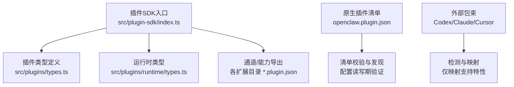
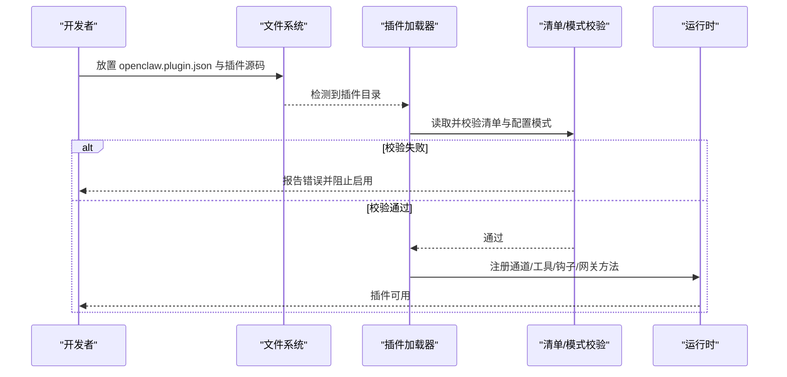
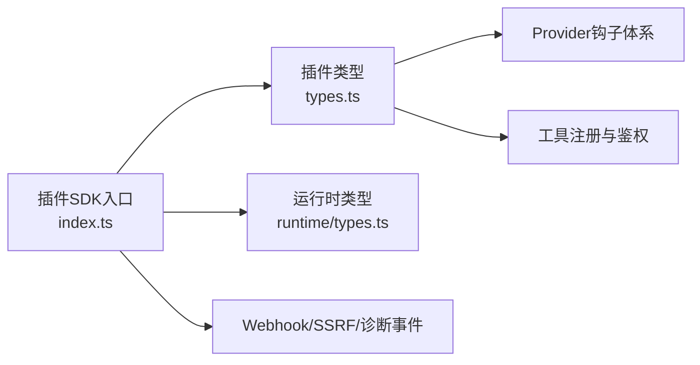

# 插件开发 API

<cite>
**本文引用的文件**
- [src/plugin-sdk/index.ts](file://src/plugin-sdk/index.ts)
- [src/plugins/types.ts](file://src/plugins/types.ts)
- [src/plugins/runtime/types.ts](file://src/plugins/runtime/types.ts)
- [docs/plugins/manifest.md](file://docs/plugins/manifest.md)
- [docs/plugins/agent-tools.md](file://docs/plugins/agent-tools.md)
- [docs/plugins/bundles.md](file://docs/plugins/bundles.md)
- [extensions/discord/openclaw.plugin.json](file://extensions/discord/openclaw.plugin.json)
- [extensions/anthropic/openclaw.plugin.json](file://extensions/anthropic/openclaw.plugin.json)
- [extensions/shared/runtime.ts](file://extensions/shared/runtime.ts)
</cite>

## 目录
1. [简介](#简介)
2. [项目结构](#项目结构)
3. [核心组件](#核心组件)
4. [架构总览](#架构总览)
5. [详细组件分析](#详细组件分析)
6. [依赖分析](#依赖分析)
7. [性能考虑](#性能考虑)
8. [故障排查指南](#故障排查指南)
9. [结论](#结论)
10. [附录](#附录)

## 简介
本文件为 OpenClaw 插件开发 API 的权威参考，覆盖插件接口规范、生命周期管理、工具注册与事件处理机制；同时给出插件清单格式、依赖声明、权限配置与安全约束说明，并提供开发模板、测试指南与发布流程建议，以及插件间通信、资源共享与冲突解决策略。

## 项目结构
OpenClaw 将“插件 SDK”导出入口集中于统一索引文件，按功能域拆分导出项：通道适配器类型、运行时类型、HTTP/Webhook 能力、状态与配置辅助、安全与鉴权等。插件生态由“原生插件（openclaw.plugin.json）”与“外部包束（Codex/Claude/Cursor）”两类构成，前者在加载前即进行清单与配置模式校验，后者以元数据映射方式有限接入。

图示来源
- [src/plugin-sdk/index.ts:1-872](file://src/plugin-sdk/index.ts#L1-L872)
- [src/plugins/types.ts:1-1775](file://src/plugins/types.ts#L1-L1775)
- [src/plugins/runtime/types.ts:1-64](file://src/plugins/runtime/types.ts#L1-L64)
- [docs/plugins/manifest.md:1-100](file://docs/plugins/manifest.md#L1-L100)
- [docs/plugins/bundles.md:1-293](file://docs/plugins/bundles.md#L1-L293)

章节来源
- [src/plugin-sdk/index.ts:1-872](file://src/plugin-sdk/index.ts#L1-L872)
- [docs/plugins/manifest.md:1-100](file://docs/plugins/manifest.md#L1-L100)
- [docs/plugins/bundles.md:1-293](file://docs/plugins/bundles.md#L1-L293)

## 核心组件
- 插件 SDK 入口与导出
  - 统一导出通道适配器类型、插件类型、运行时类型、HTTP/Webhook 工具、状态与配置辅助、安全与鉴权等。
  - 提供运行时包装器、日志后端、会话绑定、允许列表解析、命令鉴权、入站信封构建、回复派发、媒体加载、SSRF 策略、持久化去重、诊断事件等能力。
- 插件类型与钩子
  - 定义插件工具上下文、工具工厂、钩子选项、配置校验结果、UI 提示等。
  - 定义 Provider 认证方法、动态模型解析、运行时认证、用量查询、流封装、缓存 TTL 合规性、思考策略、现代模型策略、目录增强等钩子上下文与回调签名。
- 运行时类型
  - 定义子代理运行参数与结果、等待参数与结果、会话消息查询、会话删除等运行时 API。

章节来源
- [src/plugin-sdk/index.ts:1-872](file://src/plugin-sdk/index.ts#L1-L872)
- [src/plugins/types.ts:1-1775](file://src/plugins/types.ts#L1-L1775)
- [src/plugins/runtime/types.ts:1-64](file://src/plugins/runtime/types.ts#L1-L64)

## 架构总览
OpenClaw 插件系统分为“原生插件”和“外部包束”两大类：

- 原生插件
  - 必须提供 openclaw.plugin.json 清单，清单中包含 id、configSchema、可选的 kind、channels、providers、providerAuthEnvVars、skills 等字段。
  - 在加载阶段对清单与配置模式进行严格校验，缺失或无效将阻断配置验证。
- 外部包束
  - 支持 Codex、Claude、Cursor 三类包束，OpenClaw 将其归一化为内部记录，映射已支持特性（如技能根、Hook 包、MCP 配置、嵌入式 Pi 设置），未映射部分仅作能力探测但不执行。
  - 安装顺序优先本地原生布局，避免双格式包被误判为包束。

图示来源
- [docs/plugins/manifest.md:1-100](file://docs/plugins/manifest.md#L1-L100)
- [docs/plugins/bundles.md:1-293](file://docs/plugins/bundles.md#L1-L293)

章节来源
- [docs/plugins/manifest.md:1-100](file://docs/plugins/manifest.md#L1-L100)
- [docs/plugins/bundles.md:1-293](file://docs/plugins/bundles.md#L1-L293)

## 详细组件分析

### 插件清单与依赖声明
- 必填字段
  - id：插件标识符
  - configSchema：内联 JSON Schema，用于配置读写期校验
- 可选字段
  - kind：插件种类（如 memory、context-engine）
  - channels：该插件注册的通道 id 列表
  - providers：该插件注册的 Provider id 列表
  - providerAuthEnvVars：Provider 认证环境变量映射，便于无需启动运行时即可进行环境标记验证
  - skills：相对插件根的技能目录数组
  - name/description/uiHints/version：显示名、描述、UI 提示、版本信息
- 行为与限制
  - 未知 channels.* 会被视为错误（除非通道 id 在其他插件清单中声明）
  - plugins.entries.<id>、plugins.allow、plugins.deny、plugins.slots.* 必须引用“可发现”的插件 id
  - 若插件存在但清单损坏或缺失，验证失败，Doctor 会报告插件错误
  - 若插件已安装但被禁用，保留配置并在 Doctor 与日志中警告

章节来源
- [docs/plugins/manifest.md:1-100](file://docs/plugins/manifest.md#L1-L100)
- [extensions/discord/openclaw.plugin.json:1-10](file://extensions/discord/openclaw.plugin.json#L1-L10)
- [extensions/anthropic/openclaw.plugin.json:1-13](file://extensions/anthropic/openclaw.plugin.json#L1-L13)

### 插件接口规范与生命周期
- 插件类型与上下文
  - OpenClawPluginToolContext：工具执行上下文，包含会话键、请求者身份、沙箱状态等
  - OpenClawPluginToolFactory：工具工厂函数，返回工具或工具数组
  - OpenClawPluginHookOptions：钩子注册选项
- 生命周期阶段
  - 发现与加载：扫描 openclaw.plugin.json，读取 configSchema，进行严格校验
  - 注册：注册通道适配器、工具、钩子、网关方法、Webhook 目标等
  - 运行：在运行时根据上下文调用工具、处理事件、执行子代理任务
  - 卸载：清理资源、注销路由与目标、释放锁与去重缓存

章节来源
- [src/plugins/types.ts:1-800](file://src/plugins/types.ts#L1-L800)
- [src/plugin-sdk/index.ts:1-872](file://src/plugin-sdk/index.ts#L1-L872)

### 工具注册与事件处理机制
- 工具注册
  - 支持必选工具与可选工具（需加入允许列表）
  - 工具名称不可与核心工具冲突；插件 id 作为允许列表条目时，表示启用该插件下的全部工具
- 事件处理
  - 提供入站信封构建、会话上下文解析、回复派发、媒体加载、SSRF 策略、持久化去重、诊断事件等能力
  - 支持 Webhook 目标注册与鉴权解析、请求体读取与限流、异常追踪等

章节来源
- [docs/plugins/agent-tools.md:1-100](file://docs/plugins/agent-tools.md#L1-L100)
- [src/plugin-sdk/index.ts:1-872](file://src/plugin-sdk/index.ts#L1-L872)

### 运行时 API 与子代理
- 子代理运行
  - run：提交一次运行，返回 runId
  - waitForRun：等待运行完成，返回状态与错误信息
  - getSessionMessages：查询会话消息
  - deleteSession：删除会话（可选是否删除转录）
- 通道适配器
  - 通过 channel 字段访问各通道能力（如 Discord、Slack、Telegram 等）

章节来源
- [src/plugins/runtime/types.ts:1-64](file://src/plugins/runtime/types.ts#L1-L64)
- [src/plugin-sdk/index.ts:1-872](file://src/plugin-sdk/index.ts#L1-L872)

### 权限配置与安全约束
- 允许列表与发送方鉴权
  - 通过 allow/deny 控制工具可用性；支持按插件 id 或工具名启用
  - 命令鉴权与直连 DM 授权决策由专用模块提供
- SSRF 与主机白名单
  - 提供基于后缀的主机名白名单策略与 HTTPS URL 合法性检查
- Webhook 安全
  - 请求体大小限制、速率限制、异常计数器、内容类型检查、鉴权解析与拒绝非 POST 请求
- 诊断事件
  - 提供诊断事件的发射、订阅与心跳事件等

章节来源
- [src/plugin-sdk/index.ts:1-872](file://src/plugin-sdk/index.ts#L1-L872)

### 插件间通信、资源共享与冲突解决
- 插件间通信
  - 通过共享运行时上下文（会话键、请求者身份、沙箱状态）进行协作
  - 使用子代理运行与会话消息查询实现跨工具的数据共享
- 资源共享
  - 文件锁、临时路径、持久化去重、媒体加载等资源通过统一工具函数管理
- 冲突解决
  - 工具名称冲突：与核心工具冲突的插件工具将被跳过
  - 允许列表冲突：插件 id 作为允许列表条目时启用该插件下所有工具，避免重复声明
  - Provider 动态模型解析：提供 prepareDynamicModel 与 resolveDynamicModel 的异步链路，确保网络预热与确定性解析

章节来源
- [src/plugins/types.ts:1-1775](file://src/plugins/types.ts#L1-L1775)
- [src/plugin-sdk/index.ts:1-872](file://src/plugin-sdk/index.ts#L1-L872)

## 依赖分析
- 组件耦合
  - 插件 SDK 入口聚合导出，降低上层使用复杂度
  - 类型定义集中在 types.ts，运行时 API 在 runtime/types.ts，便于维护与演进
- 外部依赖
  - 原生插件依赖 openclaw.plugin.json 清单与配置模式
  - 包束插件依赖包束布局与映射规则，未映射特性仅作探测

图示来源
- [src/plugin-sdk/index.ts:1-872](file://src/plugin-sdk/index.ts#L1-L872)
- [src/plugins/types.ts:1-1775](file://src/plugins/types.ts#L1-L1775)
- [src/plugins/runtime/types.ts:1-64](file://src/plugins/runtime/types.ts#L1-L64)

章节来源
- [src/plugin-sdk/index.ts:1-872](file://src/plugin-sdk/index.ts#L1-L872)
- [src/plugins/types.ts:1-1775](file://src/plugins/types.ts#L1-L1775)
- [src/plugins/runtime/types.ts:1-64](file://src/plugins/runtime/types.ts#L1-L64)

## 性能考虑
- 异步队列与键控任务
  - 使用 keyed-async-queue 对并发任务进行限流与去重，避免热点竞争
- 媒体与文本处理
  - 文本分片、媒体加载与链接格式化减少大消息传输开销
- 缓存与去重
  - 持久化去重与 SSRF 策略减少重复请求与潜在风险
- Webhook 流控
  - 请求体大小限制、固定窗口限流与异常追踪降低峰值压力

章节来源
- [src/plugin-sdk/index.ts:1-872](file://src/plugin-sdk/index.ts#L1-L872)

## 故障排查指南
- 清单与配置错误
  - 检查 openclaw.plugin.json 是否存在且字段合法；确认 configSchema 是否与实际配置一致
  - 若插件被禁用但仍存在配置，Doctor 会发出警告
- 工具不可用
  - 确认工具是否为可选工具，是否已在允许列表中启用
  - 确认插件 id 未与核心工具名称冲突
- Webhook 问题
  - 检查内容类型、请求体大小限制、鉴权解析与目标注册
  - 使用异常追踪与限流器定位瓶颈
- Provider 认证
  - 使用 providerAuthEnvVars 快速探测环境变量
  - 若缺少凭证，ProviderBuildMissingAuthMessageContext 可定制更具体的提示

章节来源
- [docs/plugins/manifest.md:1-100](file://docs/plugins/manifest.md#L1-L100)
- [docs/plugins/agent-tools.md:1-100](file://docs/plugins/agent-tools.md#L1-L100)
- [src/plugin-sdk/index.ts:1-872](file://src/plugin-sdk/index.ts#L1-L872)

## 结论
OpenClaw 插件系统以严格的原生清单与配置模式校验为基础，结合丰富的运行时能力与安全策略，为多通道、多 Provider 的插件生态提供了清晰的开发与集成路径。对于外部包束，采用“有限映射+能力探测”的安全策略，既保持兼容性又控制信任边界。开发者可依据本文档完成从清单编写、工具注册到运行时交互的全流程开发与运维。

## 附录

### 开发模板与最佳实践
- 清单模板
  - 参考现有插件清单，至少包含 id、configSchema；按需添加 channels/providers/skills 等
- 工具模板
  - 使用工具工厂函数注册工具，必要时声明为可选工具并通过允许列表启用
- 运行时模板
  - 通过运行时包装器创建带日志的运行时实例，确保错误可追踪
- 安全模板
  - 明确 providerAuthEnvVars，使用 SSRF 策略与 Webhook 流控，启用诊断事件以便排障

章节来源
- [extensions/discord/openclaw.plugin.json:1-10](file://extensions/discord/openclaw.plugin.json#L1-L10)
- [extensions/anthropic/openclaw.plugin.json:1-13](file://extensions/anthropic/openclaw.plugin.json#L1-L13)
- [docs/plugins/agent-tools.md:1-100](file://docs/plugins/agent-tools.md#L1-L100)
- [extensions/shared/runtime.ts:1-15](file://extensions/shared/runtime.ts#L1-L15)
- [src/plugin-sdk/index.ts:1-872](file://src/plugin-sdk/index.ts#L1-L872)

### 测试指南
- 单元测试
  - 针对工具执行逻辑、鉴权流程、Webhook 解析与流控进行单元测试
- 集成测试
  - 使用真实或模拟的通道与 Provider，验证工具在不同允许列表组合下的行为
- 性能测试
  - 使用异步队列与媒体加载场景评估吞吐与延迟

章节来源
- [src/plugin-sdk/index.ts:1-872](file://src/plugin-sdk/index.ts#L1-L872)

### 发布流程
- 原生插件
  - 准备 openclaw.plugin.json 与配置模式，确保校验通过后再启用
  - 通过包管理器发布，遵循清单中的 providerAuthEnvVars 与依赖声明
- 包束插件
  - 按 Codex/Claude/Cursor 标准布局准备内容与元数据
  - 使用 CLI 安装并查看能力映射，确认支持特性

章节来源
- [docs/plugins/manifest.md:1-100](file://docs/plugins/manifest.md#L1-L100)
- [docs/plugins/bundles.md:1-293](file://docs/plugins/bundles.md#L1-L293)