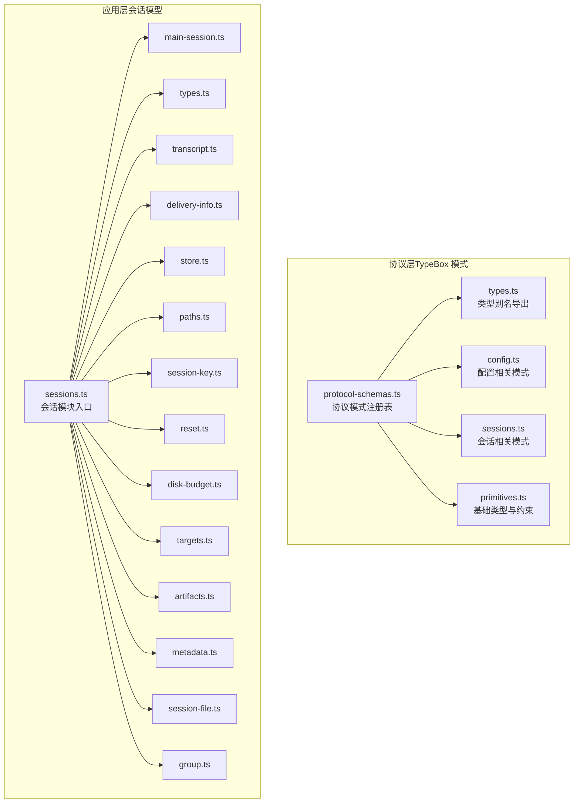
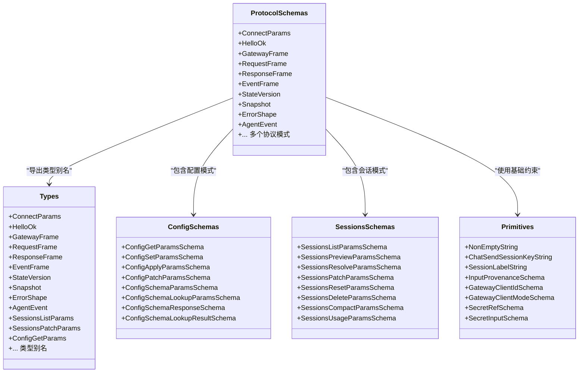
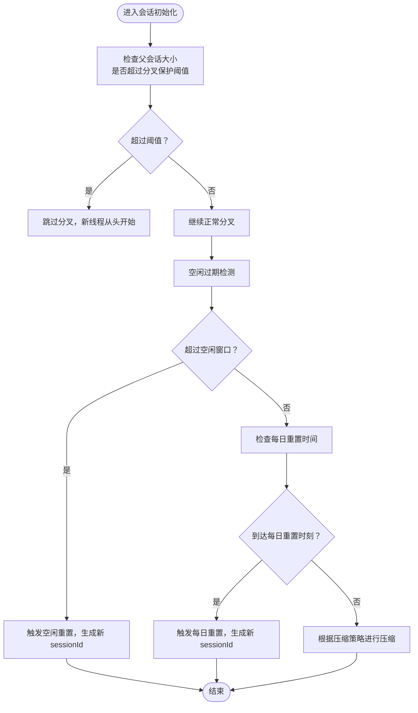
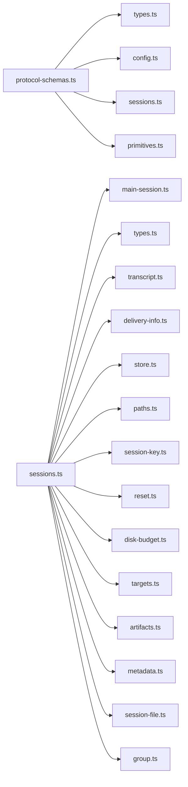

# 数据模型

<cite>
**本文引用的文件**
- [types.ts](file://src/gateway/protocol/schema/types.ts)
- [protocol-schemas.ts](file://src/gateway/protocol/schema/protocol-schemas.ts)
- [config.ts](file://src/gateway/protocol/schema/config.ts)
- [sessions.ts](file://src/gateway/protocol/schema/sessions.ts)
- [primitives.ts](file://src/gateway/protocol/schema/primitives.ts)
- [sessions.ts](file://src/config/sessions.ts)
- [sessions/main-session.ts](file://src/config/sessions/main-session.ts)
- [sessions/types.ts](file://src/config/sessions/types.ts)
- [sessions/transcript.ts](file://src/config/sessions/transcript.ts)
- [sessions/delivery-info.ts](file://src/config/sessions/delivery-info.ts)
- [sessions/store.ts](file://src/config/sessions/store.ts)
- [sessions/paths.ts](file://src/config/sessions/paths.ts)
- [sessions/session-key.ts](file://src/config/sessions/session-key.ts)
- [sessions/reset.ts](file://src/config/sessions/reset.ts)
- [sessions/disk-budget.ts](file://src/config/sessions/disk-budget.ts)
- [sessions/targets.ts](file://src/config/sessions/targets.ts)
- [sessions/artifacts.ts](file://src/config/sessions/artifacts.ts)
- [sessions/metadata.ts](file://src/config/sessions/metadata.ts)
- [sessions/session-file.ts](file://src/config/sessions/session-file.ts)
- [sessions/group.ts](file://src/config/sessions/group.ts)
- [sessions/usage-tracking.md](file://docs/concepts/usage-tracking.md)
- [session-management-compaction.md](file://docs/reference/session-management-compaction.md)
- [sessions-id.md](file://docs/concepts/session-id.md)
- [json-utf8-bytes.test.ts](file://src/infra/json-utf8-bytes.test.ts)
- [sparkle-build.ts](file://scripts/sparkle-build.ts)
- [GatewayEnvironment.swift](file://apps/macos/Sources/OpenClaw/GatewayEnvironment.swift)
- [bridge-protocol.md](file://docs/gateway/bridge-protocol.md)
</cite>

## 目录
1. [简介](#简介)
2. [项目结构](#项目结构)
3. [核心组件](#核心组件)
4. [架构总览](#架构总览)
5. [详细组件分析](#详细组件分析)
6. [依赖分析](#依赖分析)
7. [性能考虑](#性能考虑)
8. [故障排查指南](#故障排查指南)
9. [结论](#结论)
10. [附录](#附录)

## 简介
本文件为 OpenClaw 项目的数据模型参考文档，聚焦于协议与应用层的核心数据结构、接口定义与类型规范。内容覆盖：
- 协议层：桥接协议帧、配置模型、会话管理、节点与设备、工具与技能目录、定时任务、日志与聊天事件等。
- 应用层：会话存储结构、会话键与 ID 规范、转录与交付信息、磁盘配额与目标策略等。
- 序列化与版本兼容：基于 TypeBox 的模式定义、JSON 序列化字节长度计算、SemVer 兼容检查与桥接协议版本说明。

本文件提供字段定义、数据类型、验证规则与示例数据路径，并给出序列化/反序列化与版本兼容处理建议。

## 项目结构
数据模型主要分布在以下位置：
- 协议层模式与类型导出：src/gateway/protocol/schema
- 应用层会话模型与实现：src/config/sessions
- 文档与概念说明：docs 下的 reference 与 concepts

图表来源
- [protocol-schemas.ts:1-302](file://src/gateway/protocol/schema/protocol-schemas.ts#L1-L302)
- [types.ts:1-132](file://src/gateway/protocol/schema/types.ts#L1-L132)
- [config.ts:1-101](file://src/gateway/protocol/schema/config.ts#L1-L101)
- [sessions.ts:1-140](file://src/gateway/protocol/schema/sessions.ts#L1-L140)
- [primitives.ts:1-85](file://src/gateway/protocol/schema/primitives.ts#L1-L85)
- [sessions.ts:1-15](file://src/config/sessions.ts#L1-L15)

章节来源
- [protocol-schemas.ts:1-302](file://src/gateway/protocol/schema/protocol-schemas.ts#L1-L302)
- [sessions.ts:1-15](file://src/config/sessions.ts#L1-L15)

## 核心组件
本节概述协议层与应用层的关键数据结构与职责边界。

- 协议模式注册表：集中声明所有协议请求/响应/事件的模式，供类型别名导出使用。
- 类型别名导出：将模式静态推断为 TypeScript 类型，便于在客户端与服务端共享。
- 基础类型与约束：统一字符串长度、枚举值、正则表达式等约束。
- 配置模式：支持配置获取、设置、应用、补丁、Schema 查询与 UI 提示。
- 会话模式：支持会话列表、预览、解析、打补丁、重置、删除、压缩与用量统计。
- 应用层会话：会话键、会话 ID、转录、交付信息、存储、路径、重置策略、磁盘预算、目标与制品、元数据与分组。

章节来源
- [protocol-schemas.ts:162-302](file://src/gateway/protocol/schema/protocol-schemas.ts#L162-L302)
- [types.ts:7-132](file://src/gateway/protocol/schema/types.ts#L7-L132)
- [primitives.ts:12-85](file://src/gateway/protocol/schema/primitives.ts#L12-L85)
- [config.ts:10-101](file://src/gateway/protocol/schema/config.ts#L10-L101)
- [sessions.ts:4-140](file://src/gateway/protocol/schema/sessions.ts#L4-L140)
- [sessions.ts:1-15](file://src/config/sessions.ts#L1-L15)

## 架构总览
下图展示协议层模式到类型别名再到应用层会话模型的整体关系。

图表来源
- [protocol-schemas.ts:162-302](file://src/gateway/protocol/schema/protocol-schemas.ts#L162-L302)
- [types.ts:7-132](file://src/gateway/protocol/schema/types.ts#L7-L132)
- [config.ts:10-101](file://src/gateway/protocol/schema/config.ts#L10-L101)
- [sessions.ts:4-140](file://src/gateway/protocol/schema/sessions.ts#L4-L140)
- [primitives.ts:12-85](file://src/gateway/protocol/schema/primitives.ts#L12-L85)

## 详细组件分析

### 协议层数据模型

#### 配置模型
- 字段与类型
  - 获取配置：空对象模式，无额外属性。
  - 设置配置：raw 必填非空字符串；可选 baseHash。
  - 应用/补丁配置：raw 必填非空字符串；可选 baseHash、sessionKey、note、restartDelayMs（>=0）。
  - Schema 查询：空对象；查询参数 path 为限定长度与字符集的字符串。
  - UI 提示：label/help/tags/group/order/advanced/sensitive/placeholder/itemTemplate。
  - Schema 响应：schema 任意类型、uiHints 记录、version 与 generatedAt 非空字符串。
  - Schema 子项：key/path/type/required/hasChildren/hint/hintPath。
- 验证规则
  - 字符串长度与正则限制；整数范围限制；枚举与联合类型约束。
- 示例数据路径
  - [配置模式定义:10-101](file://src/gateway/protocol/schema/config.ts#L10-L101)

章节来源
- [config.ts:10-101](file://src/gateway/protocol/schema/config.ts#L10-L101)

#### 会话数据模型
- 字段与类型
  - 列表：limit、activeMinutes、includeGlobal、includeUnknown、includeDerivedTitles、includeLastMessage、label、spawnedBy、agentId、search。
  - 预览：keys（至少一项）、limit、maxChars。
  - 解析：key/sessionId/label/agentId/spawnedBy/includeGlobal/includeUnknown。
  - 打补丁：label/thinkingLevel/fastMode/verboseLevel/reasoningLevel/responseUsage/elevatedLevel/execHost/execSecurity/execAsk/execNode/model/spawnedBy/spawnedWorkspaceDir/spawnDepth/subagentRole/subagentControlScope/sendPolicy/groupActivation。
  - 重置：key、reason（new/reset）。
  - 删除：key、deleteTranscript、emitLifecycleHooks。
  - 压缩：key、maxLines。
  - 用量：key、startDate（YYYY-MM-DD）、endDate（YYYY-MM-DD）、mode（utc/gateway/specific）、utcOffset（UTC±HH[:MM]）、limit、includeContextWeight。
- 验证规则
  - 数值范围、字符串格式、可空联合类型、枚举与字面量。
- 示例数据路径
  - [会话模式定义:4-140](file://src/gateway/protocol/schema/sessions.ts#L4-L140)

章节来源
- [sessions.ts:4-140](file://src/gateway/protocol/schema/sessions.ts#L4-L140)

#### 基础类型与约束
- 非空字符串、会话键与标签长度、输入来源（kind/originSessionId/sourceSessionKey/sourceChannel/sourceTool）。
- 网关客户端 ID 与模式（枚举）、密钥引用来源（env/file/exec）与模式。
- 密钥输入：字符串或密钥引用联合类型。
- 示例数据路径
  - [基础类型定义:12-85](file://src/gateway/protocol/schema/primitives.ts#L12-L85)

章节来源
- [primitives.ts:12-85](file://src/gateway/protocol/schema/primitives.ts#L12-L85)

#### 协议类型别名导出
- 将协议模式静态推断为 TypeScript 类型，如 ConnectParams、HelloOk、GatewayFrame、RequestFrame、ResponseFrame、EventFrame、StateVersion、Snapshot、ErrorShape、AgentEvent、Sessions*、Config*、Wizard*、Nodes*、Devices*、ExecApprovals*、Cron*、Logs*、Chat* 等。
- 示例数据路径
  - [类型别名导出:7-132](file://src/gateway/protocol/schema/types.ts#L7-L132)

章节来源
- [types.ts:7-132](file://src/gateway/protocol/schema/types.ts#L7-L132)

#### 协议模式注册表
- 统一注册所有协议模式，包含代理、通道、配置、会话、节点、设备、执行审批、定时任务、日志与聊天、快照、向导等。
- 版本常量：PROTOCOL_VERSION。
- 示例数据路径
  - [协议模式注册表:162-302](file://src/gateway/protocol/schema/protocol-schemas.ts#L162-L302)

章节来源
- [protocol-schemas.ts:162-302](file://src/gateway/protocol/schema/protocol-schemas.ts#L162-L302)

### 应用层会话模型

#### 会话键与 ID
- 会话键与 ID 的长度与格式约束，用于标识与派生标题、预览等。
- 示例数据路径
  - [会话键定义](file://src/config/sessions/session-key.ts)
  - [会话 ID 正则与判定:1-5](file://src/sessions/session-id.ts#L1-L5)

章节来源
- [session-key.ts](file://src/config/sessions/session-key.ts)
- [session-id.ts:1-5](file://src/sessions/session-id.ts#L1-L5)

#### 会话存储与结构
- 存储结构：会话条目、全局与未知会话控制、派生标题与最近消息预览。
- 文件与路径：会话文件、路径管理、磁盘预算与目标策略。
- 重置策略：每日重置、空闲过期、父线程分叉保护。
- 示例数据路径
  - [会话存储与结构](file://src/config/sessions/store.ts)
  - [会话路径](file://src/config/sessions/paths.ts)
  - [会话重置](file://src/config/sessions/reset.ts)
  - [磁盘预算](file://src/config/sessions/disk-budget.ts)
  - [目标策略](file://src/config/sessions/targets.ts)

章节来源
- [store.ts](file://src/config/sessions/store.ts)
- [paths.ts](file://src/config/sessions/paths.ts)
- [reset.ts](file://src/config/sessions/reset.ts)
- [disk-budget.ts](file://src/config/sessions/disk-budget.ts)
- [targets.ts](file://src/config/sessions/targets.ts)

#### 转录、交付与制品
- 转录：消息历史、上下文权重与系统提示报告。
- 交付信息：渠道、接收方、账户 ID 等。
- 制品：会话产物与元数据。
- 示例数据路径
  - [转录](file://src/config/sessions/transcript.ts)
  - [交付信息](file://src/config/sessions/delivery-info.ts)
  - [制品](file://src/config/sessions/artifacts.ts)
  - [元数据](file://src/config/sessions/metadata.ts)
  - [会话文件](file://src/config/sessions/session-file.ts)

章节来源
- [transcript.ts](file://src/config/sessions/transcript.ts)
- [delivery-info.ts](file://src/config/sessions/delivery-info.ts)
- [artifacts.ts](file://src/config/sessions/artifacts.ts)
- [metadata.ts](file://src/config/sessions/metadata.ts)
- [session-file.ts](file://src/config/sessions/session-file.ts)

#### 会话分组与主会话
- 分组：按标签、代理、来源等维度组织。
- 主会话：会话生命周期与状态管理。
- 示例数据路径
  - [分组](file://src/config/sessions/group.ts)
  - [主会话](file://src/config/sessions/main-session.ts)

章节来源
- [group.ts](file://src/config/sessions/group.ts)
- [main-session.ts](file://src/config/sessions/main-session.ts)

#### 会话类型与入口
- 类型导出：会话相关类型集合。
- 入口模块：聚合导出各子模块。
- 示例数据路径
  - [会话类型](file://src/config/sessions/types.ts)
  - [会话入口:1-15](file://src/config/sessions.ts#L1-L15)

章节来源
- [types.ts](file://src/config/sessions/types.ts)
- [sessions.ts:1-15](file://src/config/sessions.ts#L1-L15)

### 概念与流程图

#### 会话重置与压缩规则

图表来源
- [session-management-compaction.md:126-139](file://docs/reference/session-management-compaction.md#L126-L139)

章节来源
- [session-management-compaction.md:126-139](file://docs/reference/session-management-compaction.md#L126-L139)

## 依赖分析
- 协议层内部依赖：ProtocolSchemas 注册表统一管理各模式；types.ts 通过静态推断导出类型别名；primitives.ts 提供基础约束。
- 应用层依赖：sessions.ts 入口模块聚合各子模块；会话存储与路径、重置、预算、目标、制品、元数据、分组与主会话相互协作。
- 版本与兼容：PROTOCOL_VERSION 定义协议版本；SemVer 解析与比较用于网关兼容性检查；桥接协议当前为隐式 v1，预期向后兼容并在破坏性变更前引入显式版本字段。

图表来源
- [protocol-schemas.ts:162-302](file://src/gateway/protocol/schema/protocol-schemas.ts#L162-L302)
- [types.ts:7-132](file://src/gateway/protocol/schema/types.ts#L7-L132)
- [config.ts:10-101](file://src/gateway/protocol/schema/config.ts#L10-L101)
- [sessions.ts:4-140](file://src/gateway/protocol/schema/sessions.ts#L4-L140)
- [primitives.ts:12-85](file://src/gateway/protocol/schema/primitives.ts#L12-L85)
- [sessions.ts:1-15](file://src/config/sessions.ts#L1-L15)

章节来源
- [protocol-schemas.ts:162-302](file://src/gateway/protocol/schema/protocol-schemas.ts#L162-L302)
- [sessions.ts:1-15](file://src/config/sessions.ts#L1-L15)

## 性能考虑
- 字节长度计算：对 JSON 序列化失败或特殊类型（BigInt、Symbol）采用字符串回退，确保字节长度计算稳定。
- 会话预览与派生标题：涉及文件读取，建议通过 limit 控制结果集规模以避免 IO 放大。
- 压缩策略：maxLines 控制压缩上限，平衡存储与检索成本。
- 示例数据路径
  - [JSON UTF-8 字节长度测试:1-43](file://src/infra/json-utf8-bytes.test.ts#L1-L43)

章节来源
- [json-utf8-bytes.test.ts:1-43](file://src/infra/json-utf8-bytes.test.ts#L1-L43)
- [sessions.ts:11-19](file://src/gateway/protocol/schema/sessions.ts#L11-L19)

## 故障排查指南
- 配置应用失败
  - 检查 baseHash 与 raw 是否满足非空约束；确认 restartDelayMs 与 timeoutMs 的数值范围。
  - 参考路径：[配置模式定义:10-51](file://src/gateway/protocol/schema/config.ts#L10-L51)
- 会话操作异常
  - 列表/预览/解析：核对 keys、label、agentId、spawnedBy 等字段类型与可空联合。
  - 打补丁：确认 responseUsage、subagentRole、sendPolicy、groupActivation 等枚举值。
  - 删除：注意 deleteTranscript 与 emitLifecycleHooks 的副作用。
  - 参考路径：[会话模式定义:4-140](file://src/gateway/protocol/schema/sessions.ts#L4-L140)
- 会话重置与压缩
  - 确认空闲过期与每日重置时间点；检查父会话大小是否超过分叉保护阈值。
  - 参考路径：[会话重置与压缩规则:126-139](file://docs/reference/session-management-compaction.md#L126-L139)
- 序列化问题
  - 对 BigInt、Symbol 或循环引用，采用字符串回退策略；必要时降级处理。
  - 参考路径：[JSON UTF-8 字节长度测试:30-42](file://src/infra/json-utf8-bytes.test.ts#L30-L42)

章节来源
- [config.ts:10-51](file://src/gateway/protocol/schema/config.ts#L10-L51)
- [sessions.ts:4-140](file://src/gateway/protocol/schema/sessions.ts#L4-L140)
- [session-management-compaction.md:126-139](file://docs/reference/session-management-compaction.md#L126-L139)
- [json-utf8-bytes.test.ts:30-42](file://src/infra/json-utf8-bytes.test.ts#L30-L42)

## 结论
本文档梳理了 OpenClaw 的数据模型体系：协议层通过 TypeBox 模式与类型别名实现强约束与跨端一致性；应用层围绕会话存储、转录、交付与制品构建完整生命周期管理。结合字节长度计算、版本兼容与重置/压缩策略，可在保证性能与稳定性的同时提升可维护性与扩展性。

## 附录

### 版本兼容与协议说明
- 协议版本：PROTOCOL_VERSION=3。
- 桥接协议：当前为隐式 v1，预期向后兼容；破坏性变更前引入显式版本字段。
- 网关兼容性：macOS 端使用 SemVer 解析与比较进行兼容性检查。
- 示例数据路径
  - [协议版本常量:301-302](file://src/gateway/protocol/schema/protocol-schemas.ts#L301-L302)
  - [桥接协议版本说明:88-92](file://docs/gateway/bridge-protocol.md#L88-L92)
  - [SemVer 解析与比较:5-38](file://apps/macos/Sources/OpenClaw/GatewayEnvironment.swift#L5-L38)

章节来源
- [protocol-schemas.ts:301-302](file://src/gateway/protocol/schema/protocol-schemas.ts#L301-L302)
- [bridge-protocol.md:88-92](file://docs/gateway/bridge-protocol.md#L88-L92)
- [GatewayEnvironment.swift:5-38](file://apps/macos/Sources/OpenClaw/GatewayEnvironment.swift#L5-L38)

### 会话与用量追踪
- 会话管理与压缩：规则与实现细节见参考文档。
- 用量追踪：上下文权重分解与系统提示报告。
- 示例数据路径
  - [会话管理与压缩:126-139](file://docs/reference/session-management-compaction.md#L126-L139)
  - [用量追踪文档](file://docs/concepts/usage-tracking.md)

章节来源
- [session-management-compaction.md:126-139](file://docs/reference/session-management-compaction.md#L126-L139)
- [sessions-usage-tracking.md](file://docs/concepts/usage-tracking.md)