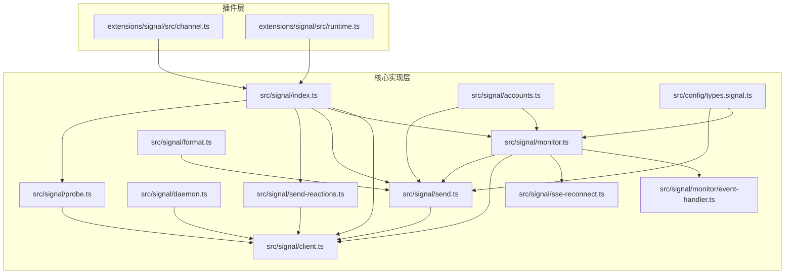
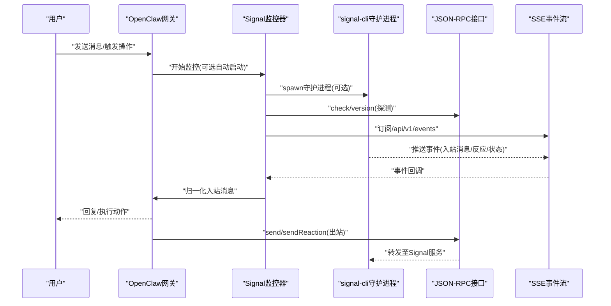
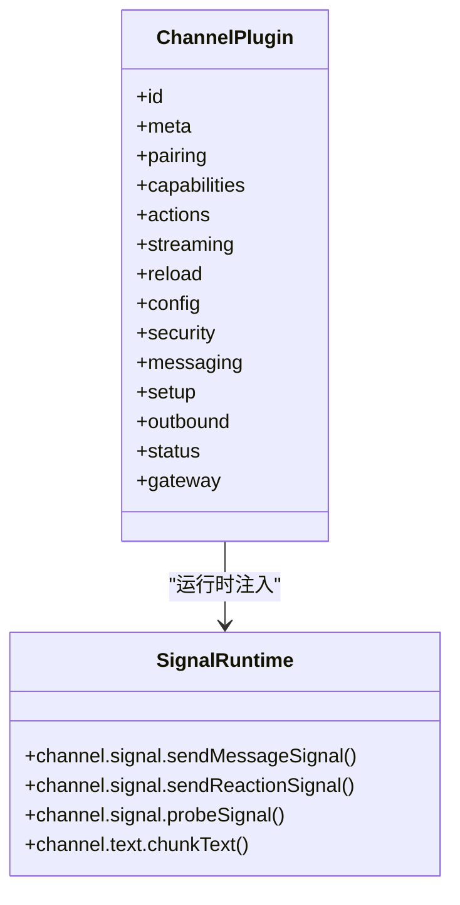
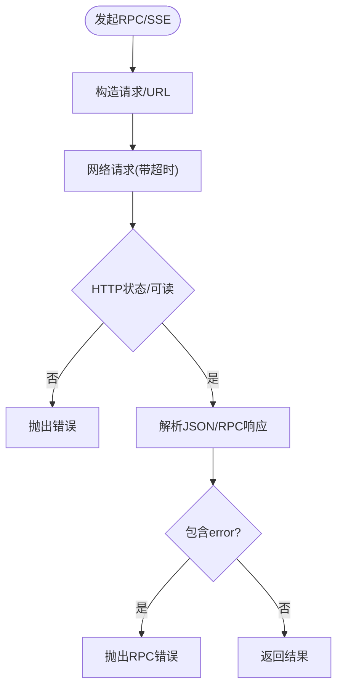
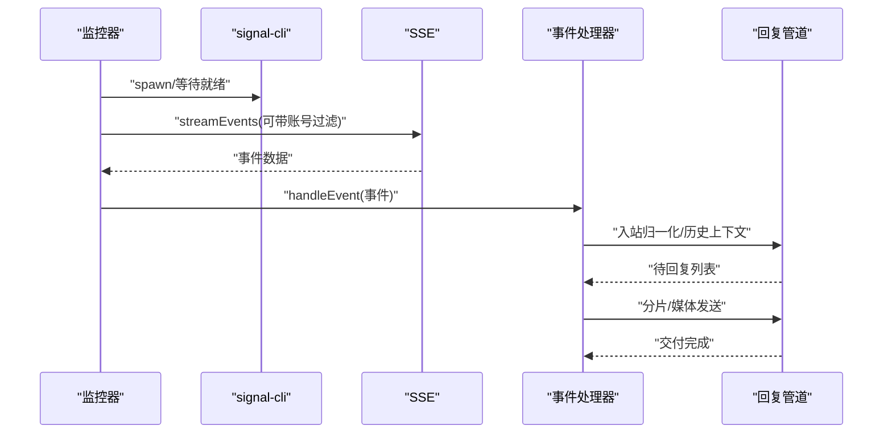
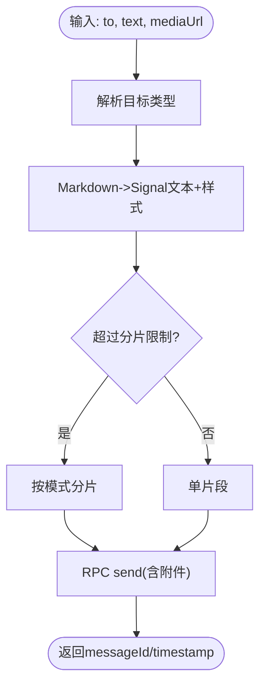
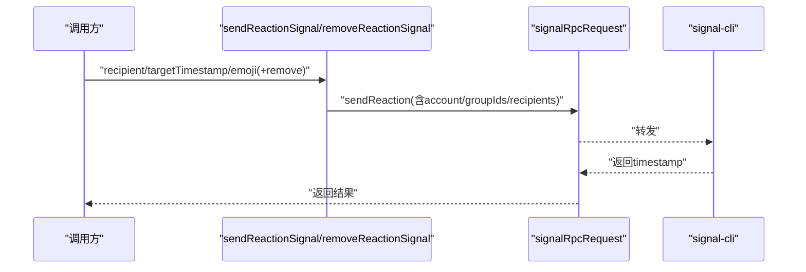
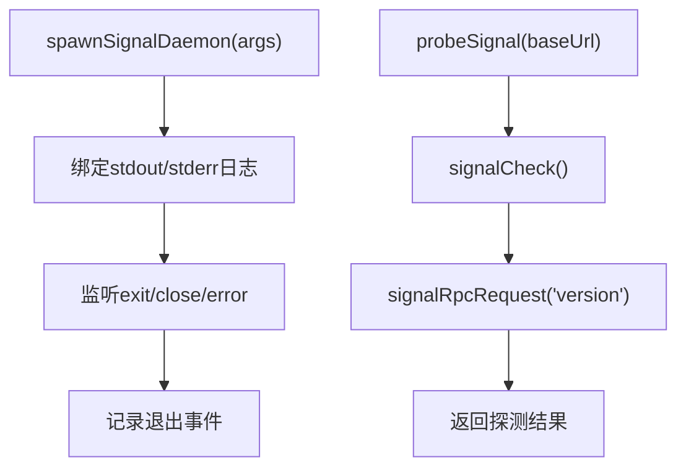
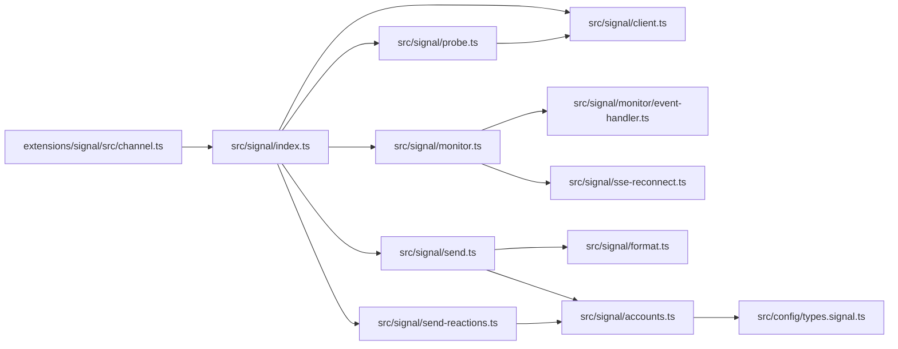

# Signal集成

<cite>
**本文引用的文件**
- [docs/channels/signal.md](file://docs/channels/signal.md)
- [extensions/signal/src/channel.ts](file://extensions/signal/src/channel.ts)
- [extensions/signal/src/runtime.ts](file://extensions/signal/src/runtime.ts)
- [src/signal/index.ts](file://src/signal/index.ts)
- [src/signal/client.ts](file://src/signal/client.ts)
- [src/signal/monitor.ts](file://src/signal/monitor.ts)
- [src/signal/send.ts](file://src/signal/send.ts)
- [src/signal/daemon.ts](file://src/signal/daemon.ts)
- [src/signal/format.ts](file://src/signal/format.ts)
- [src/signal/accounts.ts](file://src/signal/accounts.ts)
- [src/config/types.signal.ts](file://src/config/types.signal.ts)
- [src/signal/monitor/event-handler.ts](file://src/signal/monitor/event-handler.ts)
- [src/signal/send-reactions.ts](file://src/signal/send-reactions.ts)
- [src/signal/probe.ts](file://src/signal/probe.ts)
- [src/signal/sse-reconnect.ts](file://src/signal/sse-reconnect.ts)
</cite>

## 目录
1. [简介](#简介)
2. [项目结构](#项目结构)
3. [核心组件](#核心组件)
4. [架构总览](#架构总览)
5. [详细组件分析](#详细组件分析)
6. [依赖关系分析](#依赖关系分析)
7. [性能考量](#性能考量)
8. [故障排查指南](#故障排查指南)
9. [结论](#结论)
10. [附录](#附录)

## 简介
本文件面向在OpenClaw中集成Signal渠道（通过signal-cli）的开发者与运维人员，系统性说明Signal Desktop Bridge的使用方法、消息收发与联系人/群组管理、Signal特有的加密与端到端安全模型、消息同步与设备配对流程，并提供可落地的实现示例路径，帮助快速完成消息处理、联系人列表管理与设备间同步。

## 项目结构
Signal集成由“插件层”和“核心实现层”两部分组成：
- 插件层：负责配置解析、账号管理、消息动作适配、状态探测等，位于extensions/signal。
- 核心实现层：负责与signal-cli通信（HTTP JSON-RPC + SSE）、事件处理、消息发送、反应（Reaction）发送、Markdown格式化、媒体下载与分片、守护进程生命周期管理等，位于src/signal。

图表来源
- [extensions/signal/src/channel.ts](file://extensions/signal/src/channel.ts#L105-L324)
- [extensions/signal/src/runtime.ts](file://extensions/signal/src/runtime.ts#L1-L7)
- [src/signal/index.ts](file://src/signal/index.ts#L1-L6)
- [src/signal/client.ts](file://src/signal/client.ts#L70-L132)
- [src/signal/monitor.ts](file://src/signal/monitor.ts#L327-L478)
- [src/signal/send.ts](file://src/signal/send.ts#L99-L193)
- [src/signal/send-reactions.ts](file://src/signal/send-reactions.ts#L143-L191)
- [src/signal/probe.ts](file://src/signal/probe.ts#L23-L57)
- [src/signal/sse-reconnect.ts](file://src/signal/sse-reconnect.ts#L23-L81)

章节来源
- [extensions/signal/src/channel.ts](file://extensions/signal/src/channel.ts#L105-L324)
- [src/signal/index.ts](file://src/signal/index.ts#L1-L6)

## 核心组件
- 插件入口与能力声明：定义Signal渠道的元数据、配对、消息动作、安全策略、目标解析、设置向导、出站发送、状态探测与网关启动流程。
- 客户端通信：封装signal-cli JSON-RPC与SSE接口，统一错误解析与超时控制。
- 监控器：负责守护进程生命周期、SSE事件拉取、入站事件处理、历史上下文构建、媒体下载、分片发送、反应通知策略。
- 发送器：支持文本与媒体发送、Markdown转Signal样式、分片策略、打字指示与已读回执。
- 反应发送：基于RPC发送或移除Reaction，支持个人与群组场景。
- 探测器：检查daemon可达性并查询版本信息。
- 守护进程：spawn signal-cli daemon，转发日志，处理退出事件。
- 账号与配置：解析多账号配置、合并默认值、生成基础URL与启用状态。

章节来源
- [extensions/signal/src/channel.ts](file://extensions/signal/src/channel.ts#L105-L324)
- [src/signal/client.ts](file://src/signal/client.ts#L70-L132)
- [src/signal/monitor.ts](file://src/signal/monitor.ts#L327-L478)
- [src/signal/send.ts](file://src/signal/send.ts#L99-L193)
- [src/signal/send-reactions.ts](file://src/signal/send-reactions.ts#L143-L191)
- [src/signal/probe.ts](file://src/signal/probe.ts#L23-L57)
- [src/signal/daemon.ts](file://src/signal/daemon.ts#L91-L148)
- [src/signal/accounts.ts](file://src/signal/accounts.ts#L35-L70)

## 架构总览
Signal集成采用“外部CLI桥接”的模式：OpenClaw通过HTTP JSON-RPC与signal-cli交互，通过SSE订阅事件；同时支持自动启动signal-cli守护进程或连接已有外部守护进程。监控器负责事件解码、入站消息归一化、会话与历史上下文管理、出站回复与媒体处理。

图表来源
- [src/signal/monitor.ts](file://src/signal/monitor.ts#L327-L478)
- [src/signal/client.ts](file://src/signal/client.ts#L134-L216)
- [src/signal/daemon.ts](file://src/signal/daemon.ts#L91-L148)
- [src/signal/send.ts](file://src/signal/send.ts#L99-L193)
- [src/signal/send-reactions.ts](file://src/signal/send-reactions.ts#L143-L191)

## 详细组件分析

### 组件A：Signal插件入口与能力
- 元数据与配对：声明渠道能力（直聊/群聊、媒体、反应），提供配对通知与允许条目标准化。
- 安全策略：按账户维度构建DM策略（默认“配对”），支持允许列表与警告收集。
- 目标解析：支持E.164、uuid、group等标识，提供“看起来像目标ID”的判断。
- 出站发送：文本与媒体分片发送，支持自定义分片限制与模式。
- 状态与探测：默认运行态快照、问题收集、按账户探测daemon、构建账户快照。
- 网关启动：延迟导入监控器，避免初始化循环；启动监控并传入媒体上限等参数。

图表来源
- [extensions/signal/src/channel.ts](file://extensions/signal/src/channel.ts#L105-L324)
- [extensions/signal/src/runtime.ts](file://extensions/signal/src/runtime.ts#L1-L7)

章节来源
- [extensions/signal/src/channel.ts](file://extensions/signal/src/channel.ts#L105-L324)
- [extensions/signal/src/runtime.ts](file://extensions/signal/src/runtime.ts#L1-L7)

### 组件B：客户端通信（JSON-RPC + SSE）
- JSON-RPC：请求构造、超时、响应解析、错误包装；支持check与version等基础探测。
- SSE：事件流读取、行级解析、事件缓冲与flush、支持按账号过滤、AbortSignal中断。
- 错误处理：空响应、非法JSON、缺失result字段、HTTP错误均抛出明确错误。

图表来源
- [src/signal/client.ts](file://src/signal/client.ts#L70-L132)
- [src/signal/client.ts](file://src/signal/client.ts#L134-L216)

章节来源
- [src/signal/client.ts](file://src/signal/client.ts#L70-L132)
- [src/signal/client.ts](file://src/signal/client.ts#L134-L216)

### 组件C：监控器（事件处理与上下文）
- 守护进程生命周期：可选自动启动、等待就绪、合并Abort信号、记录退出原因。
- 事件处理：创建事件处理器，解析入站消息、构建会话键、组装历史上下文、处理媒体下载、分片发送回复。
- 反应通知：根据配置决定是否通知、通知范围（仅自己/允许列表/全部）。
- 连接恢复：SSE断线重连，指数退避与抖动，日志记录。

图表来源
- [src/signal/monitor.ts](file://src/signal/monitor.ts#L327-L478)
- [src/signal/sse-reconnect.ts](file://src/signal/sse-reconnect.ts#L23-L81)
- [src/signal/monitor/event-handler.ts](file://src/signal/monitor/event-handler.ts#L79-L200)

章节来源
- [src/signal/monitor.ts](file://src/signal/monitor.ts#L327-L478)
- [src/signal/sse-reconnect.ts](file://src/signal/sse-reconnect.ts#L23-L81)
- [src/signal/monitor/event-handler.ts](file://src/signal/monitor/event-handler.ts#L79-L200)

### 组件D：发送器（文本/媒体/打字/已读）
- 目标解析：支持recipient/group/username多种形式，构建RPC参数。
- 文本处理：Markdown转Signal文本与样式，支持表格模式、Spoiler、链接展开；按长度或换行分片。
- 媒体处理：从URL解析本地附件、限制大小、无正文时自动占位提示。
- 打字指示：发送/停止打字；已读回执：按需转发（DM）。
- RPC调用：统一上下文解析（baseUrl/account/accountId）。

图表来源
- [src/signal/send.ts](file://src/signal/send.ts#L99-L193)
- [src/signal/format.ts](file://src/signal/format.ts#L234-L246)
- [src/signal/format.ts](file://src/signal/format.ts#L371-L397)

章节来源
- [src/signal/send.ts](file://src/signal/send.ts#L99-L193)
- [src/signal/format.ts](file://src/signal/format.ts#L234-L246)
- [src/signal/format.ts](file://src/signal/format.ts#L371-L397)

### 组件E：反应发送（Reaction）
- 参数校验：目标时间戳、表情符号、群组场景下的作者信息。
- 请求构建：支持移除Reaction；支持按UUID/E.164或groupId定位。
- RPC调用：统一上下文解析与超时控制。

图表来源
- [src/signal/send-reactions.ts](file://src/signal/send-reactions.ts#L143-L191)
- [src/signal/client.ts](file://src/signal/client.ts#L70-L107)

章节来源
- [src/signal/send-reactions.ts](file://src/signal/send-reactions.ts#L143-L191)
- [src/signal/client.ts](file://src/signal/client.ts#L70-L107)

### 组件F：守护进程与探测
- 守护进程：spawn signal-cli daemon，绑定HTTP地址，输出分类日志，记录退出事件。
- 探测：HTTP可达性检查与version查询，用于状态报告。

图表来源
- [src/signal/daemon.ts](file://src/signal/daemon.ts#L91-L148)
- [src/signal/probe.ts](file://src/signal/probe.ts#L23-L57)
- [src/signal/client.ts](file://src/signal/client.ts#L109-L132)

章节来源
- [src/signal/daemon.ts](file://src/signal/daemon.ts#L91-L148)
- [src/signal/probe.ts](file://src/signal/probe.ts#L23-L57)

## 依赖关系分析
- 插件层依赖核心实现层的导出函数（monitorSignalProvider、probeSignal、sendMessageSignal、sendReactionSignal、resolveSignalReactionLevel）。
- 核心实现层内部模块高度内聚：client负责网络，monitor负责生命周期与事件，send/format负责消息与媒体，daemon/probe负责守护与探测，accounts/types负责配置解析。
- 配置类型与账号解析贯穿监控器与发送器，确保多账号与默认账号行为一致。

图表来源
- [src/signal/index.ts](file://src/signal/index.ts#L1-L6)
- [src/signal/monitor.ts](file://src/signal/monitor.ts#L327-L478)
- [src/signal/send.ts](file://src/signal/send.ts#L99-L193)
- [src/signal/send-reactions.ts](file://src/signal/send-reactions.ts#L143-L191)
- [src/signal/probe.ts](file://src/signal/probe.ts#L23-L57)
- [src/signal/client.ts](file://src/signal/client.ts#L70-L132)
- [src/signal/accounts.ts](file://src/signal/accounts.ts#L35-L70)
- [src/config/types.signal.ts](file://src/config/types.signal.ts#L48-L54)

章节来源
- [src/signal/index.ts](file://src/signal/index.ts#L1-L6)
- [src/signal/accounts.ts](file://src/signal/accounts.ts#L35-L70)
- [src/config/types.signal.ts](file://src/config/types.signal.ts#L48-L54)

## 性能考量
- 分片策略：默认文本分片上限与模式可在配置中调整；Markdown渲染后可能因链接展开导致超出限制，实现内置二次分片以保持样式正确性。
- 媒体限制：默认媒体上限（MB）可通过配置覆盖；发送前进行大小校验与占位提示，避免空正文发送。
- SSE重连：指数退避与抖动，降低瞬时风暴影响；支持AbortSignal中断。
- 打字指示：在回复生成期间刷新打字状态，提升交互体验。
- 多账号：按账户合并配置，避免重复解析成本。

## 故障排查指南
- 基础检查：优先运行状态、网关状态、日志跟踪、诊断命令与通道探测。
- 常见问题：
  - 守护进程可达但无回复：核对account与daemon设置、接收模式。
  - DM被忽略：发送者处于待批准状态。
  - 群组消息被忽略：提及/允许列表策略阻断。
  - 配置校验失败：运行诊断修复。
  - 诊断中未出现Signal：确认启用开关。
- 额外检查：列出配对、查找守护进程、查看最近日志。

章节来源
- [docs/channels/signal.md](file://docs/channels/signal.md#L251-L286)

## 结论
通过signal-cli桥接，OpenClaw实现了对Signal的完整集成：从设备配对、消息收发、媒体处理到反应与已读回执，均以清晰的模块化架构与稳健的错误处理保障可用性。建议在生产环境使用独立机器人号码、严格的DM策略与定期维护signal-cli版本，以获得最佳稳定性与安全性。

## 附录

### 使用示例（实现路径）
- 消息发送
  - 文本发送：参考[sendMessageSignal](file://src/signal/send.ts#L99-L193)。
  - 媒体发送：参考[sendMessageSignal](file://src/signal/send.ts#L99-L193)与媒体解析逻辑。
  - 打字指示：参考[sendTypingSignal](file://src/signal/send.ts#L195-L219)。
  - 已读回执：参考[sendReadReceiptSignal](file://src/signal/send.ts#L221-L250)。
- 入站处理与上下文
  - 事件处理入口：参考[createSignalEventHandler](file://src/signal/monitor/event-handler.ts#L79-L200)。
  - 历史上下文与会话键：参考[monitor.ts](file://src/signal/monitor.ts#L327-L478)中的历史构建与会话存储。
- 反应（Reaction）
  - 发送/移除：参考[sendReactionSignal](file://src/signal/send-reactions.ts#L143-L191)。
  - 通知策略：参考[monitor.ts](file://src/signal/monitor.ts#L159-L191)中的通知模式与允许列表。
- 设备配对与安全策略
  - 配对通知与允许条目标准化：参考[channel.ts](file://extensions/signal/src/channel.ts#L111-L117)与安全策略构建：参考[channel.ts](file://extensions/signal/src/channel.ts#L158-L183)。
- 守护进程与探测
  - 自动启动与等待就绪：参考[monitor.ts](file://src/signal/monitor.ts#L382-L419)。
  - 探测：参考[probeSignal](file://src/signal/probe.ts#L23-L57)。
- 配置参考
  - 信号配置项：参考[types.signal.ts](file://src/config/types.signal.ts#L6-L54)。
  - 账号解析与合并：参考[accounts.ts](file://src/signal/accounts.ts#L35-L70)。

章节来源
- [src/signal/send.ts](file://src/signal/send.ts#L99-L193)
- [src/signal/send.ts](file://src/signal/send.ts#L195-L250)
- [src/signal/send-reactions.ts](file://src/signal/send-reactions.ts#L143-L191)
- [src/signal/monitor/event-handler.ts](file://src/signal/monitor/event-handler.ts#L79-L200)
- [src/signal/monitor.ts](file://src/signal/monitor.ts#L382-L419)
- [src/signal/probe.ts](file://src/signal/probe.ts#L23-L57)
- [src/config/types.signal.ts](file://src/config/types.signal.ts#L6-L54)
- [src/signal/accounts.ts](file://src/signal/accounts.ts#L35-L70)
- [extensions/signal/src/channel.ts](file://extensions/signal/src/channel.ts#L111-L183)