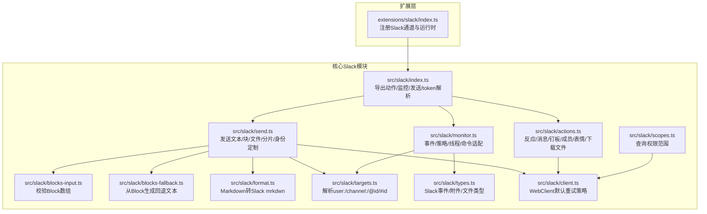
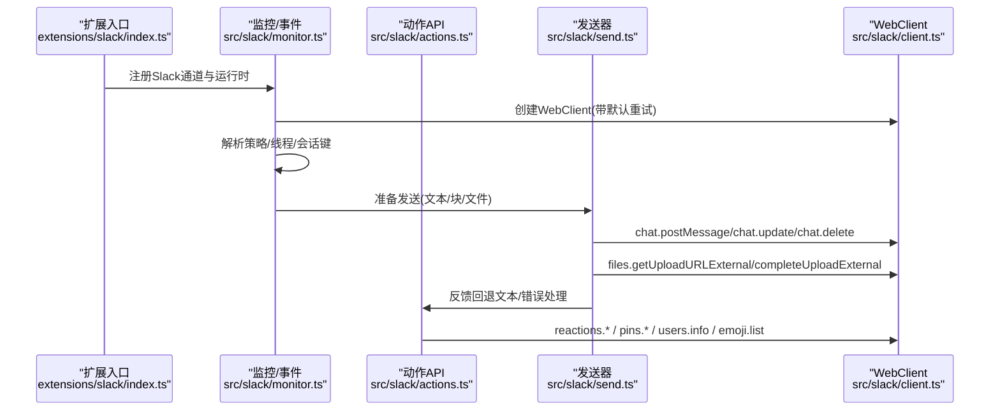
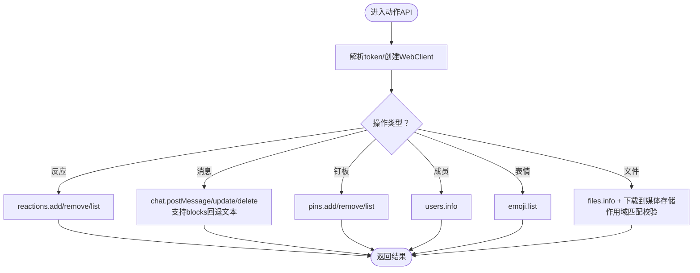
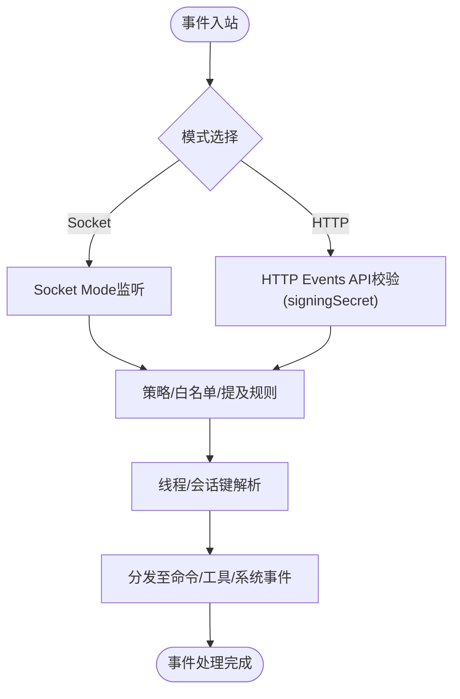
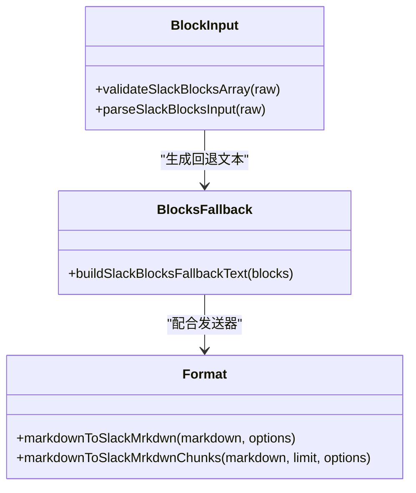
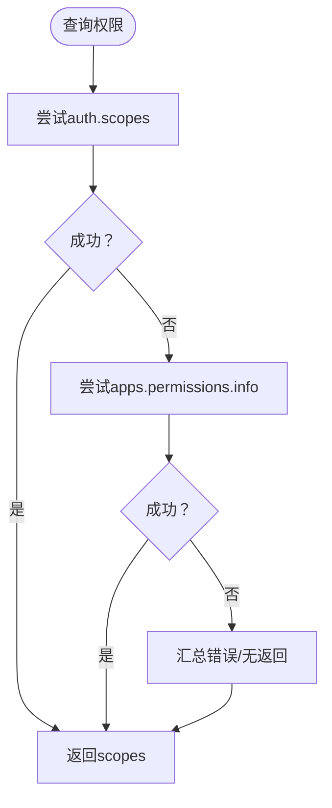
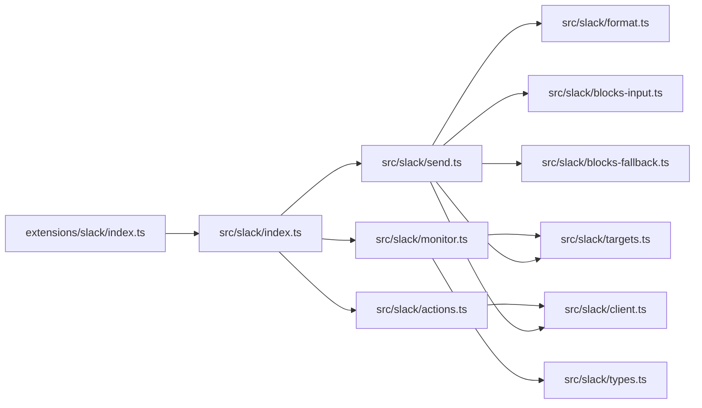

# Slack集成

<cite>
**本文引用的文件**
- [docs/channels/slack.md](file://docs/channels/slack.md)
- [extensions/slack/index.ts](file://extensions/slack/index.ts)
- [skills/slack/SKILL.md](file://skills/slack/SKILL.md)
- [src/slack/index.ts](file://src/slack/index.ts)
- [src/slack/actions.ts](file://src/slack/actions.ts)
- [src/slack/send.ts](file://src/slack/send.ts)
- [src/slack/client.ts](file://src/slack/client.ts)
- [src/slack/blocks-fallback.ts](file://src/slack/blocks-fallback.ts)
- [src/slack/blocks-input.ts](file://src/slack/blocks-input.ts)
- [src/slack/format.ts](file://src/slack/format.ts)
- [src/slack/targets.ts](file://src/slack/targets.ts)
- [src/slack/types.ts](file://src/slack/types.ts)
- [src/slack/monitor.ts](file://src/slack/monitor.ts)
- [src/slack/scopes.ts](file://src/slack/scopes.ts)
</cite>

## 目录
1. [简介](#简介)
2. [项目结构](#项目结构)
3. [核心组件](#核心组件)
4. [架构总览](#架构总览)
5. [详细组件分析](#详细组件分析)
6. [依赖关系分析](#依赖关系分析)
7. [性能与可靠性](#性能与可靠性)
8. [故障排查指南](#故障排查指南)
9. [结论](#结论)
10. [附录：配置与示例路径](#附录配置与示例路径)

## 简介
本文件面向在OpenClaw中集成Slack渠道的开发者与运维人员，系统性说明Slack Web API与Events API的使用方式，涵盖OAuth认证、实时消息（Socket Mode与HTTP Events API）、工作区管理、Block Kit富文本、用户群组、频道权限与应用安装流程。文档同时提供可直接定位到源码的示例路径，帮助快速落地“发送富文本消息、处理用户交互、管理Slack应用权限”等常见任务。

## 项目结构
OpenClaw通过插件化扩展与核心通道模块协同实现Slack集成：
- 扩展层：在插件入口注册Slack通道与运行时
- 核心层：提供Slack动作（反应、消息、钉板、成员信息、表情包）、发送器（文本/块/文件）、客户端与Block Kit工具、目标解析、类型定义、监控与事件处理、权限范围查询等能力



图表来源
- [extensions/slack/index.ts](file://extensions/slack/index.ts#L1-L18)
- [src/slack/index.ts](file://src/slack/index.ts#L1-L26)
- [src/slack/actions.ts](file://src/slack/actions.ts#L1-L447)
- [src/slack/send.ts](file://src/slack/send.ts#L1-L361)
- [src/slack/blocks-input.ts](file://src/slack/blocks-input.ts#L1-L46)
- [src/slack/blocks-fallback.ts](file://src/slack/blocks-fallback.ts#L1-L96)
- [src/slack/format.ts](file://src/slack/format.ts#L1-L151)
- [src/slack/targets.ts](file://src/slack/targets.ts#L1-L58)
- [src/slack/types.ts](file://src/slack/types.ts#L1-L62)
- [src/slack/client.ts](file://src/slack/client.ts#L1-L21)
- [src/slack/monitor.ts](file://src/slack/monitor.ts#L1-L6)
- [src/slack/scopes.ts](file://src/slack/scopes.ts#L92-L116)

章节来源
- [extensions/slack/index.ts](file://extensions/slack/index.ts#L1-L18)
- [src/slack/index.ts](file://src/slack/index.ts#L1-L26)

## 核心组件
- 动作API（Web API）：反应、消息读写删、钉板、成员信息、表情列表、文件下载等
- 发送器：统一发送文本、Block Kit、文件；自动分片、Markdown转mrkdwn、自定义身份（用户名/头像）
- 事件与监控：Socket Mode与HTTP Events API双模式；策略控制、线程与会话、交互事件映射
- Block Kit：输入校验、回退文本生成、Markdown渲染适配
- 权限范围：查询bot/user token权限，辅助安装与诊断
- 目标解析：user:/channel:/@id/#id解析，DM自动打开对话

章节来源
- [src/slack/actions.ts](file://src/slack/actions.ts#L80-L283)
- [src/slack/send.ts](file://src/slack/send.ts#L252-L360)
- [src/slack/blocks-input.ts](file://src/slack/blocks-input.ts#L34-L46)
- [src/slack/blocks-fallback.ts](file://src/slack/blocks-fallback.ts#L47-L95)
- [src/slack/format.ts](file://src/slack/format.ts#L117-L150)
- [src/slack/targets.ts](file://src/slack/targets.ts#L17-L58)
- [src/slack/scopes.ts](file://src/slack/scopes.ts#L92-L116)

## 架构总览
下图展示Slack集成在OpenClaw中的端到端调用链：插件注册、事件接收、策略与线程解析、内容准备、Web API调用与回退文本生成。



图表来源
- [extensions/slack/index.ts](file://extensions/slack/index.ts#L11-L14)
- [src/slack/monitor.ts](file://src/slack/monitor.ts#L1-L6)
- [src/slack/send.ts](file://src/slack/send.ts#L252-L360)
- [src/slack/actions.ts](file://src/slack/actions.ts#L80-L283)
- [src/slack/client.ts](file://src/slack/client.ts#L18-L21)

## 详细组件分析

### 组件A：Slack动作API（反应/消息/钉板/成员/表情/文件下载）
- 能力概览
  - 反应：添加/移除/移除自己的反应，列出反应
  - 消息：发送/编辑/删除；读取最近消息（支持线程）
  - 钉板：钉住/取消/列出
  - 成员：成员信息
  - 表情：表情列表
  - 文件：根据文件ID下载到本地媒体存储（含作用域检查）
- 关键点
  - 默认使用bot token；支持显式token或账户级token解析
  - 编辑消息支持Block Kit校验与回退文本生成
  - 下载文件前刷新files.info以获取最新私有下载地址，并进行作用域匹配校验



图表来源
- [src/slack/actions.ts](file://src/slack/actions.ts#L80-L283)
- [src/slack/blocks-fallback.ts](file://src/slack/blocks-fallback.ts#L47-L95)
- [src/slack/client.ts](file://src/slack/client.ts#L18-L21)

章节来源
- [src/slack/actions.ts](file://src/slack/actions.ts#L80-L283)
- [src/slack/blocks-fallback.ts](file://src/slack/blocks-fallback.ts#L47-L95)

### 组件B：发送器（文本/块/文件，分片与身份定制）
- 能力概览
  - 文本：Markdown转Slack mrkdwn，按配置分片（默认上限4000字符），支持段落优先换行
  - 块：Block Kit数组校验，生成回退文本，postMessage最佳努力尝试（含自定义身份）
  - 文件：三步上传（获取预签名URL→上传→完成），支持caption与thread_ts
  - 目标：user:/channel:/@id/#id解析，DM自动打开对话
- 关键点
  - 自定义身份（用户名/头像）在缺少chat:write.customize时自动降级
  - 无有效内容（文本/块/媒体）时抛错
  - 对静默回复标记进行抑制

```mermaid
sequenceDiagram
participant Cfg as "配置/账户"
participant S as "发送器<br/>sendMessageSlack"
participant T as "目标解析<br/>targets.ts"
participant F as "格式化<br/>format.ts"
participant B as "Block校验<br/>blocks-input.ts"
participant FB as "回退文本<br/>blocks-fallback.ts"
participant W as "WebClient"
Cfg->>S : accountId/token/blocks/mediaUrl/threadTs/identity
S->>T : 解析user : /channel : /@id/#id
alt blocks存在
S->>B : 校验Block数组
S->>FB : 生成回退文本
S->>W : chat.postMessage(含blocks/identity)
else 文本/文件
S->>F : Markdown转mrkdwn并分片
opt 有媒体
S->>W : files.getUploadURLExternal
S->>W : POST到预签名URL
S->>W : files.completeUploadExternal
loop 分片文本
S->>W : chat.postMessage
end
else 仅文本
loop 分片
S->>W : chat.postMessage
end
end
end
S-->>Cfg : 返回messageId/channelId
```

图表来源
- [src/slack/send.ts](file://src/slack/send.ts#L252-L360)
- [src/slack/targets.ts](file://src/slack/targets.ts#L17-L58)
- [src/slack/format.ts](file://src/slack/format.ts#L117-L150)
- [src/slack/blocks-input.ts](file://src/slack/blocks-input.ts#L34-L46)
- [src/slack/blocks-fallback.ts](file://src/slack/blocks-fallback.ts#L47-L95)
- [src/slack/client.ts](file://src/slack/client.ts#L18-L21)

章节来源
- [src/slack/send.ts](file://src/slack/send.ts#L252-L360)
- [src/slack/targets.ts](file://src/slack/targets.ts#L17-L58)
- [src/slack/format.ts](file://src/slack/format.ts#L117-L150)

### 组件C：事件与监控（Socket Mode + HTTP Events API）
- 能力概览
  - 支持Socket Mode与HTTP Events API两种模式
  - 事件订阅：app_mention、message.*、reaction_*、member_*、channel_rename、pin_*等
  - 策略控制：DM/频道/提及/用户白名单
  - 线程与会话：按聊天类型与replyToMode路由，支持thread历史拉取
  - 交互事件：Block动作、Modal交互映射为系统事件
- 关键点
  - Socket Mode默认启用，HTTP模式需配置signingSecret与webhookPath
  - 多账户HTTP模式需为每个账户设置唯一webhookPath
  - 未授权/不满足范围的事件会被丢弃或记录



图表来源
- [docs/channels/slack.md](file://docs/channels/slack.md#L24-L121)
- [src/slack/monitor.ts](file://src/slack/monitor.ts#L1-L6)

章节来源
- [docs/channels/slack.md](file://docs/channels/slack.md#L24-L121)
- [src/slack/monitor.ts](file://src/slack/monitor.ts#L1-L6)

### 组件D：Block Kit与富文本
- 输入校验：限制最大数量、类型非空、数组格式
- 回退文本：从header/section/image/video/context等块提取可读文本
- Markdown适配：转义与保留合法angle token，构建链接markup



图表来源
- [src/slack/blocks-input.ts](file://src/slack/blocks-input.ts#L34-L46)
- [src/slack/blocks-fallback.ts](file://src/slack/blocks-fallback.ts#L47-L95)
- [src/slack/format.ts](file://src/slack/format.ts#L117-L150)

章节来源
- [src/slack/blocks-input.ts](file://src/slack/blocks-input.ts#L34-L46)
- [src/slack/blocks-fallback.ts](file://src/slack/blocks-fallback.ts#L47-L95)
- [src/slack/format.ts](file://src/slack/format.ts#L117-L150)

### 组件E：权限范围与安装清单
- 权限查询：优先auth.scopes，其次apps.permissions.info，失败收集错误
- 安装清单要点：bot用户、App Home Messages Tab、Slash Commands、Socket Mode、Event Subscriptions、必要bot scopes



图表来源
- [src/slack/scopes.ts](file://src/slack/scopes.ts#L92-L116)

章节来源
- [src/slack/scopes.ts](file://src/slack/scopes.ts#L92-L116)
- [docs/channels/slack.md](file://docs/channels/slack.md#L340-L431)

## 依赖关系分析
- 插件入口依赖运行时与通道注册
- 发送器依赖目标解析、格式化、Block校验、WebClient
- 动作API依赖WebClient与媒体解析
- 监控依赖类型定义、目标解析、策略与线程解析



图表来源
- [extensions/slack/index.ts](file://extensions/slack/index.ts#L1-L18)
- [src/slack/index.ts](file://src/slack/index.ts#L1-L26)
- [src/slack/send.ts](file://src/slack/send.ts#L1-L361)
- [src/slack/actions.ts](file://src/slack/actions.ts#L1-L447)
- [src/slack/monitor.ts](file://src/slack/monitor.ts#L1-L6)
- [src/slack/targets.ts](file://src/slack/targets.ts#L1-L58)
- [src/slack/format.ts](file://src/slack/format.ts#L1-L151)
- [src/slack/blocks-input.ts](file://src/slack/blocks-input.ts#L1-L46)
- [src/slack/blocks-fallback.ts](file://src/slack/blocks-fallback.ts#L1-L96)
- [src/slack/client.ts](file://src/slack/client.ts#L1-L21)
- [src/slack/types.ts](file://src/slack/types.ts#L1-L62)

章节来源
- [src/slack/index.ts](file://src/slack/index.ts#L1-L26)

## 性能与可靠性
- 默认重试策略：指数退避，避免瞬时抖动放大
- 发送分片：按配置与平台上限（4000）切分，减少单次请求失败影响
- 文件上传：采用三步上传，降低中间环节失败概率
- 自定义身份降级：在缺少chat:write.customize时自动回退，保证可用性

章节来源
- [src/slack/client.ts](file://src/slack/client.ts#L3-L16)
- [src/slack/send.ts](file://src/slack/send.ts#L298-L319)

## 故障排查指南
- 无回复/未触发
  - 检查DM策略、频道白名单、是否需要提及、用户白名单
  - 使用诊断命令查看状态与日志
- Socket模式无法连接
  - 校验Slack应用设置中Socket Mode已启用、token正确
- HTTP模式未收到事件
  - 校验signingSecret、webhookPath、Request URL一致且唯一
- 自定义身份无效
  - 确认具备chat:write.customize权限；否则自动降级
- 权限不足
  - 使用权限查询接口核对当前token的scopes

章节来源
- [docs/channels/slack.md](file://docs/channels/slack.md#L433-L490)
- [src/slack/scopes.ts](file://src/slack/scopes.ts#L92-L116)

## 结论
OpenClaw对Slack的集成覆盖了Web API与Events API两大面：前者用于发送富文本、管理消息与资源，后者用于实时事件接入与策略控制。通过严格的Block Kit校验、回退文本生成与分片策略，系统在复杂消息形态与高并发场景下保持稳定与可维护性。配合完善的权限查询与安装清单，开发者可以快速完成应用安装、权限配置与生产部署。

## 附录：配置与示例路径
- 快速设置（Socket Mode/HTTP Events API）
  - 示例路径：[docs/channels/slack.md](file://docs/channels/slack.md#L24-L121)
- 权限范围与安装清单
  - 示例路径：[docs/channels/slack.md](file://docs/channels/slack.md#L340-L431)
- 发送富文本消息（文本/块/文件）
  - 示例路径：[src/slack/send.ts](file://src/slack/send.ts#L252-L360)
- 处理用户交互（反应/钉板/成员/表情）
  - 示例路径：[src/slack/actions.ts](file://src/slack/actions.ts#L80-L283)
- 管理Slack应用权限
  - 示例路径：[src/slack/scopes.ts](file://src/slack/scopes.ts#L92-L116)
- 插件注册与运行时
  - 示例路径：[extensions/slack/index.ts](file://extensions/slack/index.ts#L1-L18)
- 技能使用说明（Slack动作工具）
  - 示例路径：[skills/slack/SKILL.md](file://skills/slack/SKILL.md#L1-L145)