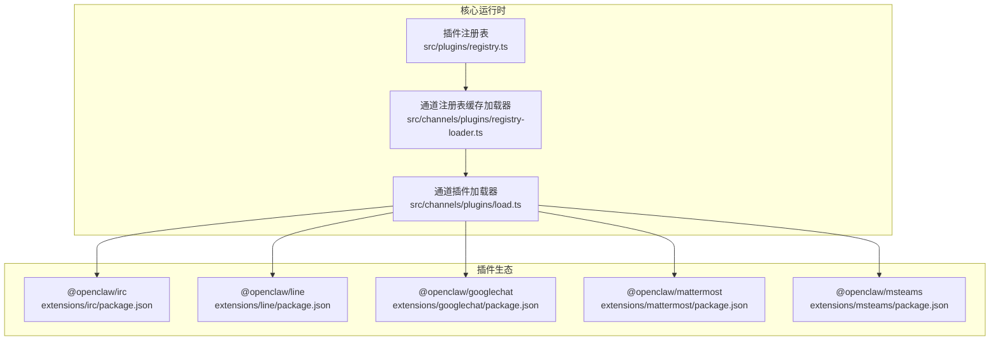
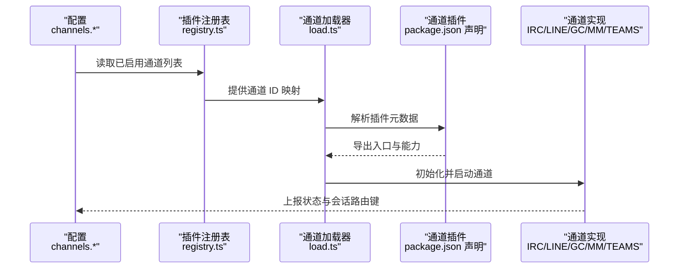
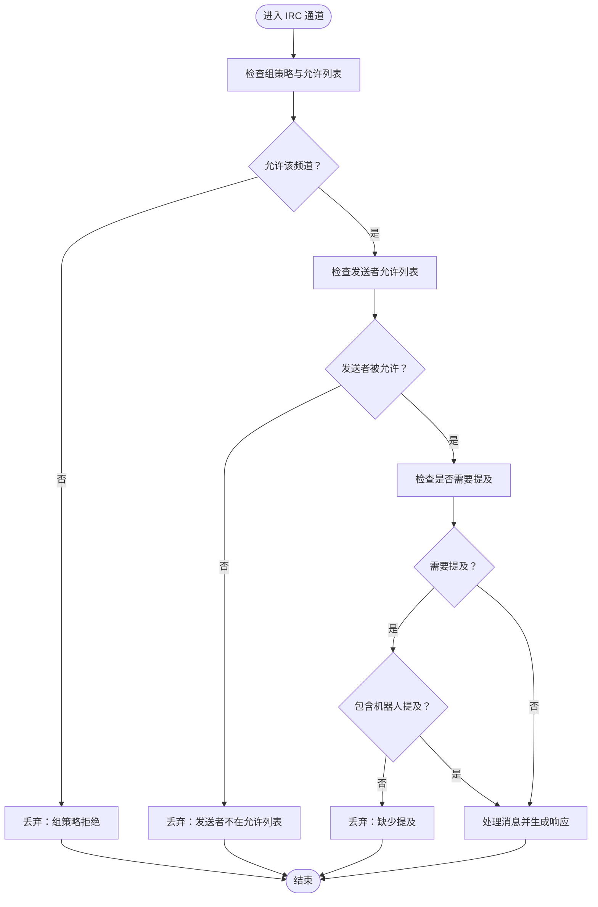
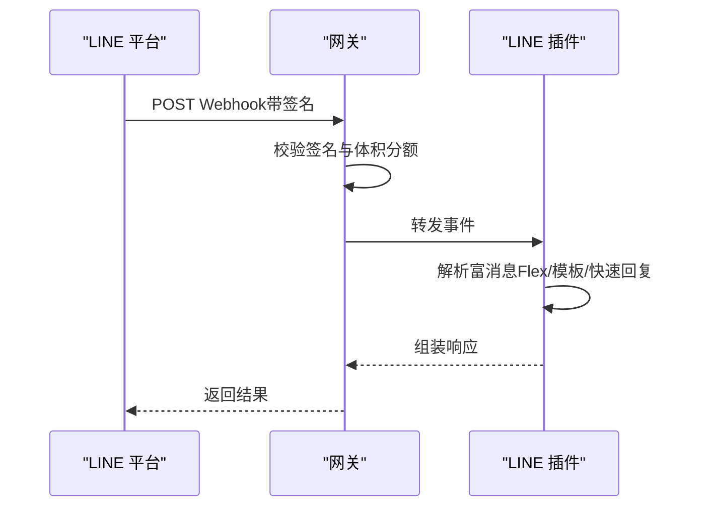
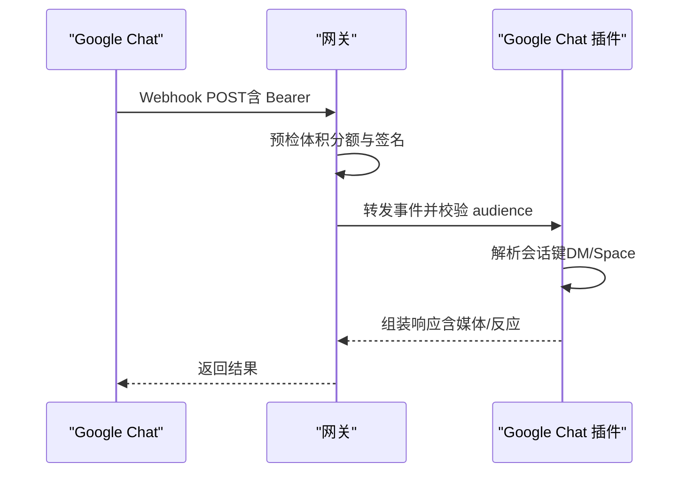
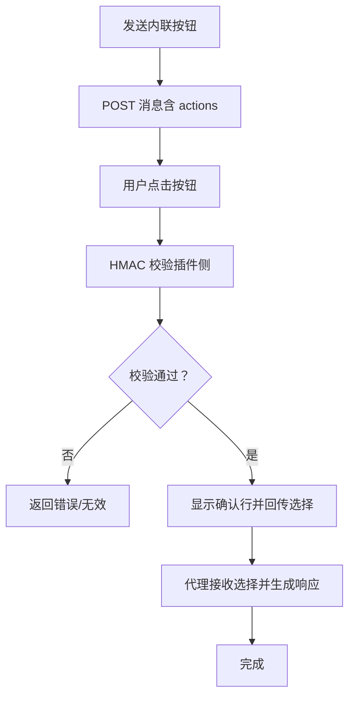
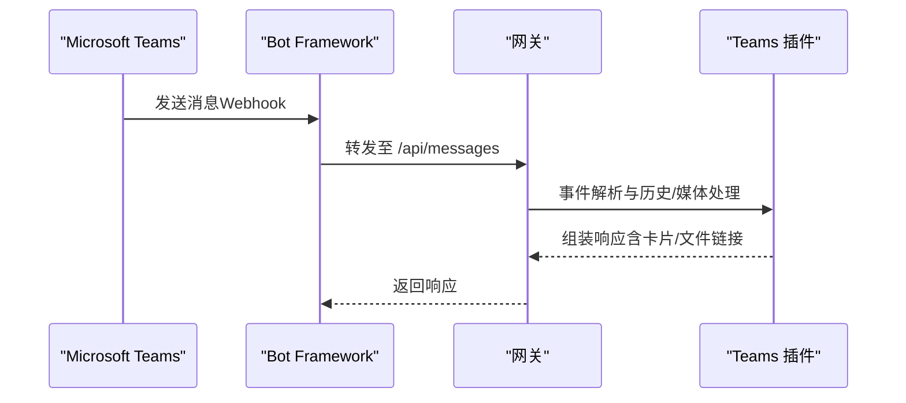
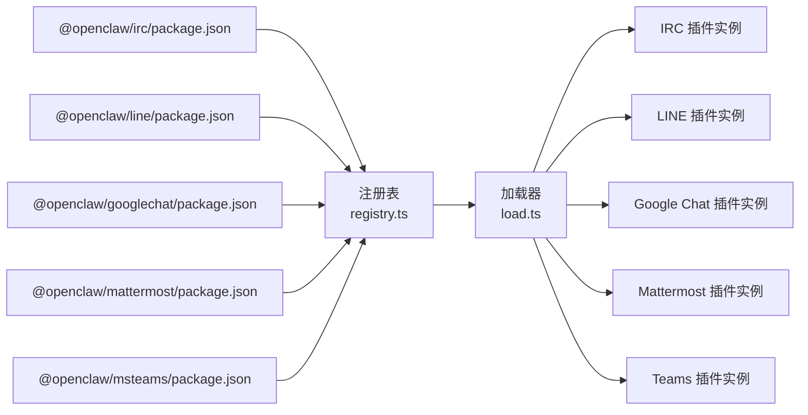

# 其他渠道集成

<cite>
**本文引用的文件**
- [docs/channels/index.md](file://docs/channels/index.md)
- [docs/channels/irc.md](file://docs/channels/irc.md)
- [docs/channels/line.md](file://docs/channels/line.md)
- [docs/channels/googlechat.md](file://docs/channels/googlechat.md)
- [docs/channels/mattermost.md](file://docs/channels/mattermost.md)
- [docs/channels/msteams.md](file://docs/channels/msteams.md)
- [extensions/irc/package.json](file://extensions/irc/package.json)
- [extensions/line/package.json](file://extensions/line/package.json)
- [extensions/googlechat/package.json](file://extensions/googlechat/package.json)
- [extensions/mattermost/package.json](file://extensions/mattermost/package.json)
- [extensions/msteams/package.json](file://extensions/msteams/package.json)
- [src/channels/plugins/registry-loader.ts](file://src/channels/plugins/registry-loader.ts)
- [src/channels/plugins/load.ts](file://src/channels/plugins/load.ts)
- [src/plugins/registry.ts](file://src/plugins/registry.ts)
</cite>

## 目录
1. [简介](#简介)
2. [项目结构](#项目结构)
3. [核心组件](#核心组件)
4. [架构总览](#架构总览)
5. [详细组件分析](#详细组件分析)
6. [依赖关系分析](#依赖关系分析)
7. [性能考量](#性能考量)
8. [故障排除指南](#故障排除指南)
9. [结论](#结论)
10. [附录](#附录)

## 简介
本文件面向需要为其他即时通讯渠道（IRC、LINE、Google Chat、Mattermost、Microsoft Teams）创建集成的开发者与运维人员。内容覆盖各渠道的认证方式、消息格式与特殊功能，提供通用的渠道适配器开发指南与最佳实践，并记录各渠道的限制、性能考虑与故障排除方法。

## 项目结构
OpenClaw 通过“插件化通道”架构支持多渠道：每个渠道以独立插件形式存在，由核心运行时按需加载与注册。配置位于主配置中对应通道段落，插件通过包元数据声明自身能力与文档路径，运行时通过注册表解析并加载。

**图表来源**
- [src/plugins/registry.ts](file://src/plugins/registry.ts#L402-L428)
- [src/channels/plugins/registry-loader.ts](file://src/channels/plugins/registry-loader.ts#L1-L35)
- [src/channels/plugins/load.ts](file://src/channels/plugins/load.ts#L1-L8)
- [extensions/irc/package.json](file://extensions/irc/package.json#L1-L15)
- [extensions/line/package.json](file://extensions/line/package.json#L1-L28)
- [extensions/googlechat/package.json](file://extensions/googlechat/package.json#L1-L48)
- [extensions/mattermost/package.json](file://extensions/mattermost/package.json#L1-L30)
- [extensions/msteams/package.json](file://extensions/msteams/package.json#L1-L38)

**章节来源**
- [docs/channels/index.md](file://docs/channels/index.md#L1-L48)
- [src/plugins/registry.ts](file://src/plugins/registry.ts#L402-L428)
- [src/channels/plugins/registry-loader.ts](file://src/channels/plugins/registry-loader.ts#L1-L35)
- [src/channels/plugins/load.ts](file://src/channels/plugins/load.ts#L1-L8)

## 核心组件
- 插件注册与发现
  - 注册表负责收集各插件对“通道”的声明，校验并去重，维护通道 ID 列表与来源信息。
- 通道插件加载器
  - 基于通道 ID 从注册表解析插件导出对象，支持缓存与注册表变更感知。
- 各通道插件
  - 每个通道插件在 package.json 中声明其通道标识、文档路径、安装方式与依赖，核心运行时按需加载。

**章节来源**
- [src/plugins/registry.ts](file://src/plugins/registry.ts#L402-L428)
- [src/channels/plugins/registry-loader.ts](file://src/channels/plugins/registry-loader.ts#L1-L35)
- [src/channels/plugins/load.ts](file://src/channels/plugins/load.ts#L1-L8)
- [extensions/irc/package.json](file://extensions/irc/package.json#L1-L15)
- [extensions/line/package.json](file://extensions/line/package.json#L1-L28)
- [extensions/googlechat/package.json](file://extensions/googlechat/package.json#L1-L48)
- [extensions/mattermost/package.json](file://extensions/mattermost/package.json#L1-L30)
- [extensions/msteams/package.json](file://extensions/msteams/package.json#L1-L38)

## 架构总览
下图展示从配置到插件加载再到各通道处理的整体流程，以及各通道的关键特性与差异点。

**图表来源**
- [src/plugins/registry.ts](file://src/plugins/registry.ts#L402-L428)
- [src/channels/plugins/load.ts](file://src/channels/plugins/load.ts#L1-L8)
- [extensions/irc/package.json](file://extensions/irc/package.json#L1-L15)
- [extensions/line/package.json](file://extensions/line/package.json#L1-L28)
- [extensions/googlechat/package.json](file://extensions/googlechat/package.json#L1-L48)
- [extensions/mattermost/package.json](file://extensions/mattermost/package.json#L1-L30)
- [extensions/msteams/package.json](file://extensions/msteams/package.json#L1-L38)

## 详细组件分析

### IRC 集成
- 认证与连接
  - 支持主机、端口、TLS、昵称、初始频道等基础配置；可选 NickServ 身份识别与一次性注册。
- 安全与访问控制
  - 分为“群组策略（组/频道）”与“发送者策略（允许谁触发）”，默认 DM 与组均采用白名单或配对模式。
  - 支持每频道允许列表与提及强制开关，避免未授权触发。
- 消息行为
  - 文本分片、Markdown 处理、流式响应缓冲、媒体下载上限等。
- 特殊功能
  - 工具权限按发送者粒度控制，支持“*”通配与显式身份前缀匹配。
- 故障排除
  - 若无回复，检查组策略、允许列表与是否被“缺少提及”拦截；TLS 证书与主机可达性问题需单独验证。

**图表来源**
- [docs/channels/irc.md](file://docs/channels/irc.md#L46-L127)

**章节来源**
- [docs/channels/irc.md](file://docs/channels/irc.md#L1-L242)

### LINE 集成
- 认证与连接
  - 使用 Messaging API 的“频道访问令牌 + 频道密钥”进行签名验证；支持多账号与自定义 webhook 路径。
- 安全与访问控制
  - DM 默认配对模式；支持用户 ID 白名单与组策略；ID 区分大小写。
- 消息行为
  - 文本长度分片、Markdown 清洗、Flex 卡片/模板消息/快速回复等富媒体能力；媒体下载上限可调。
- 特殊功能
  - 提供 `/card` 命令用于快速发送 Flex 卡片预设。
- 故障排除
  - webhook 验证失败通常为 HTTPS 与密钥不一致；媒体下载错误可通过提高上限解决。

**图表来源**
- [docs/channels/line.md](file://docs/channels/line.md#L12-L54)

**章节来源**
- [docs/channels/line.md](file://docs/channels/line.md#L1-L192)

### Google Chat 集成
- 认证与连接
  - 使用服务账号进行 Bearer Token 校验；支持多种 audience 类型（应用 URL、项目号）；仅暴露 webhook 路径对外。
- 安全与访问控制
  - DM 默认配对；空间（群组）默认需要 @提及；支持目标标识（用户/空间）与允许列表。
- 消息行为
  - Typing Indicator 可选；附件下载经媒体管道并受上限控制；反应工具可选开启。
- 特殊功能
  - 会话键按 agentId + 空间/私聊区分；支持 reactions 工具与配置项。
- 故障排除
  - 405 错误通常为通道未配置或插件未启用；核对 webhook URL、audience 与网关重启状态。

**图表来源**
- [docs/channels/googlechat.md](file://docs/channels/googlechat.md#L139-L153)

**章节来源**
- [docs/channels/googlechat.md](file://docs/channels/googlechat.md#L1-L262)

### Mattermost 集成
- 认证与连接
  - 使用 Bot Token 与 WebSocket 事件；支持多账号与命令回调路径；按钮交互使用 HMAC 校验。
- 安全与访问控制
  - DM 默认配对；组策略默认白名单且需要提及；支持用户 ID 白名单与每频道覆盖。
- 消息行为
  - 支持内联按钮（Inline Buttons），按钮回调需满足 Mattermost 动作路由规则；支持反应动作。
- 特殊功能
  - 目录适配器可解析频道与用户名；支持不同聊天模式（oncall/onmessage/onchar）。
- 故障排除
  - 按钮点击无效多因非字母数字 ID 或 HMAC 不匹配；需严格遵循回调 URL 与内部地址可达性要求。

**图表来源**
- [docs/channels/mattermost.md](file://docs/channels/mattermost.md#L178-L235)

**章节来源**
- [docs/channels/mattermost.md](file://docs/channels/mattermost.md#L1-L363)

### Microsoft Teams 集成
- 认证与连接
  - 使用 Azure Bot（App ID/密码/租户）并通过 Bot Framework Webhook 接收消息；需公网可访问路径或隧道。
- 安全与访问控制
  - DM 默认配对；组策略默认白名单且需要提及；支持团队/频道级允许列表与覆盖。
- 消息行为
  - 支持文本、图片与文件（需 Graph 权限与 SharePoint 配置）；支持 Adaptive Cards 与投票。
- 特殊功能
  - 支持两种 UI 风格（Posts/Threads）的回复样式配置；支持按用户/频道粒度工具策略。
- 故障排除
  - 图片不显示多因缺少 Graph 权限；Webhook 超时导致重复与丢包需优化响应速度。

**图表来源**
- [docs/channels/msteams.md](file://docs/channels/msteams.md#L142-L149)

**章节来源**
- [docs/channels/msteams.md](file://docs/channels/msteams.md#L1-L777)

## 依赖关系分析
- 通道插件的元数据
  - 各通道插件在 package.json 中声明通道 ID、文档路径、安装方式与依赖，核心运行时据此加载。
- 运行时加载链路
  - 注册表收集并规范化通道声明；缓存加载器基于通道 ID 解析插件导出对象；加载器最终返回可用插件实例。

**图表来源**
- [extensions/irc/package.json](file://extensions/irc/package.json#L1-L15)
- [extensions/line/package.json](file://extensions/line/package.json#L1-L28)
- [extensions/googlechat/package.json](file://extensions/googlechat/package.json#L1-L48)
- [extensions/mattermost/package.json](file://extensions/mattermost/package.json#L1-L30)
- [extensions/msteams/package.json](file://extensions/msteams/package.json#L1-L38)
- [src/plugins/registry.ts](file://src/plugins/registry.ts#L402-L428)
- [src/channels/plugins/load.ts](file://src/channels/plugins/load.ts#L1-L8)

**章节来源**
- [src/plugins/registry.ts](file://src/plugins/registry.ts#L402-L428)
- [src/channels/plugins/load.ts](file://src/channels/plugins/load.ts#L1-L8)
- [extensions/irc/package.json](file://extensions/irc/package.json#L1-L15)
- [extensions/line/package.json](file://extensions/line/package.json#L1-L28)
- [extensions/googlechat/package.json](file://extensions/googlechat/package.json#L1-L48)
- [extensions/mattermost/package.json](file://extensions/mattermost/package.json#L1-L30)
- [extensions/msteams/package.json](file://extensions/msteams/package.json#L1-L38)

## 性能考量
- 响应延迟与超时
  - Teams Webhook 对长耗时响应可能触发重试与丢包，建议快速返回并异步处理。
- 媒体下载与带宽
  - 各通道对媒体大小有限制或需要额外权限（如 Graph），应合理设置上限并优化下载策略。
- 会话与历史
  - Teams 在无 Graph 权限时无法读取历史；若需“补读”消息，需配置 Graph 权限并注意管理员同意流程。
- 按钮与交互
  - Mattermost 按钮回调对 ID 有严格限制（仅字母数字），HMAC 生成需与网关一致，避免验证失败。

[本节为通用指导，无需特定文件引用]

## 故障排除指南
- IRC
  - 无回复：检查组策略、允许列表与“缺少提及”日志；必要时关闭提及强制。
  - 登录失败：核对昵称可用性与服务器密码；TLS 证书与主机可达性。
- LINE
  - Webhook 验证失败：确保 HTTPS 与密钥一致；核对 webhook 路径。
  - 媒体下载错误：提高媒体上限。
- Google Chat
  - 405：通道未配置或插件未启用；核对配置与重启网关。
  - audience 不匹配：核对应用 URL 或项目号。
- Mattermost
  - 按钮点击无效：检查按钮 ID 是否为字母数字；核对 HMAC 生成逻辑与上下文字段。
  - 回调不可达：确保 Mattermost 可访问回调 URL，必要时配置内部地址白名单。
- Teams
  - 图片不显示：确认 Graph 权限与管理员同意；重新安装应用并完全退出 Teams。
  - Webhook 超时：优化响应时间，避免长时间阻塞。

**章节来源**
- [docs/channels/irc.md](file://docs/channels/irc.md#L237-L242)
- [docs/channels/line.md](file://docs/channels/line.md#L184-L192)
- [docs/channels/googlechat.md](file://docs/channels/googlechat.md#L209-L256)
- [docs/channels/mattermost.md](file://docs/channels/mattermost.md#L351-L363)
- [docs/channels/msteams.md](file://docs/channels/msteams.md#L745-L777)

## 结论
通过插件化通道架构，OpenClaw 能够以统一方式接入多种即时通讯平台。各通道在认证、消息格式与安全策略上各有侧重，但都遵循“配置驱动 + 插件加载 + 事件处理”的通用范式。建议在新渠道接入时参考现有通道的配置模式、安全策略与交互细节，结合本文提供的最佳实践与故障排除清单，快速稳定地完成集成。

[本节为总结性内容，无需特定文件引用]

## 附录

### 通用渠道适配器开发指南与最佳实践
- 插件元数据
  - 在 package.json 中声明通道 ID、文档路径、安装方式与依赖，确保运行时可正确加载。
- 认证与安全
  - 优先采用签名/令牌校验；对敏感参数使用环境变量或密钥管理；默认采用白名单与配对模式。
- 消息与富媒体
  - 明确文本分片策略与 Markdown 行为；提供富媒体能力映射（如 Flex/卡片/按钮）。
- 交互与会话
  - 设计稳定的会话键与路由规则；对按钮/反应等交互进行严格的签名校验与可达性测试。
- 性能与可靠性
  - 控制响应时延，避免 Webhook 超时；对媒体下载设置上限并优化网络路径。
- 文档与可观测性
  - 提供最小可运行配置示例；完善日志与探针输出，便于排障。

**章节来源**
- [extensions/irc/package.json](file://extensions/irc/package.json#L1-L15)
- [extensions/line/package.json](file://extensions/line/package.json#L1-L28)
- [extensions/googlechat/package.json](file://extensions/googlechat/package.json#L1-L48)
- [extensions/mattermost/package.json](file://extensions/mattermost/package.json#L1-L30)
- [extensions/msteams/package.json](file://extensions/msteams/package.json#L1-L38)
- [src/plugins/registry.ts](file://src/plugins/registry.ts#L402-L428)
- [src/channels/plugins/load.ts](file://src/channels/plugins/load.ts#L1-L8)