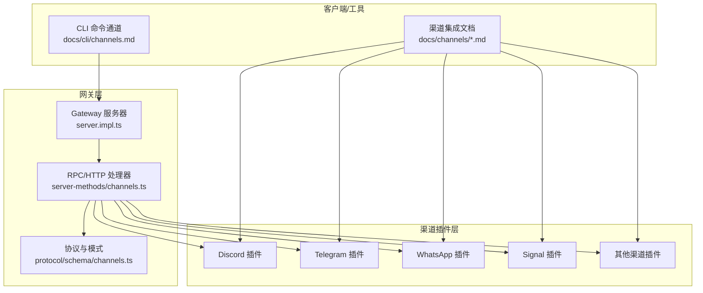
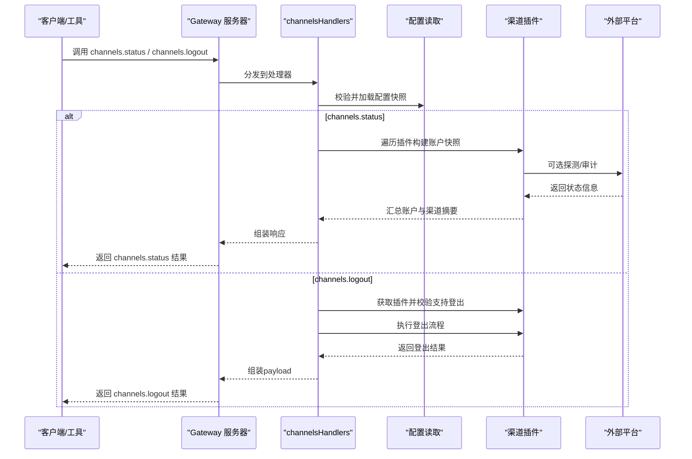
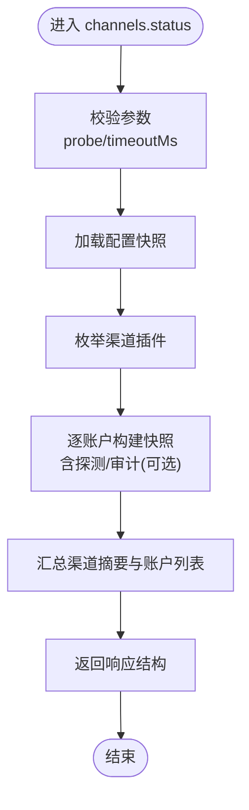
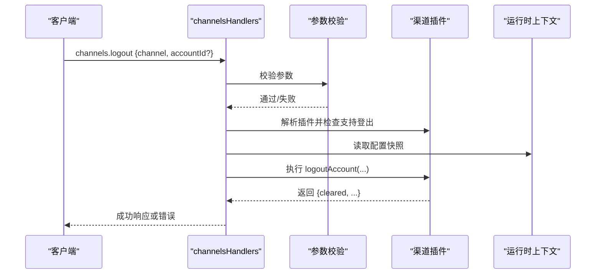
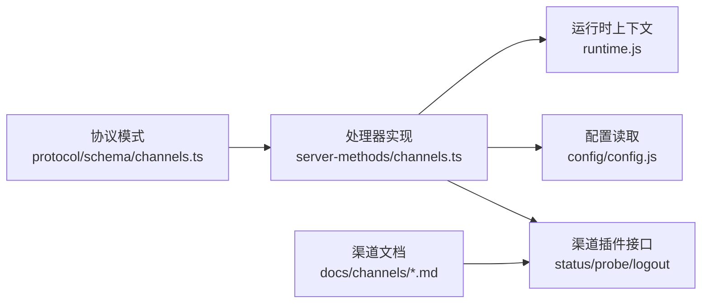

# 渠道集成接口

<cite>
**本文引用的文件**
- [channels.ts（协议模式）](file://src/gateway/protocol/schema/channels.ts)
- [channels.ts（服务端处理器）](file://src/gateway/server-methods/channels.ts)
- [channels.ts（类型定义）](file://apps/macos/Sources/OpenClawProtocol/GatewayModels.swift)
- [channels.ts（类型定义）](file://apps/shared/OpenClawKit/Sources/OpenClawProtocol/GatewayModels.swift)
- [channels.md（CLI参考）](file://docs/cli/channels.md)
- [index.md（渠道总览）](file://docs/channels/index.md)
- [discord.md（Discord集成指南）](file://docs/channels/discord.md)
- [server.impl.ts（网关服务器实现）](file://src/gateway/server.impl.ts)
- [plugins-http.test.ts（HTTP插件路由测试）](file://src/gateway/server/plugins-http.test.ts)
- [plugin.md（插件开发参考）](file://docs/tools/plugin.md)
</cite>

## 目录
1. [简介](#简介)
2. [项目结构](#项目结构)
3. [核心组件](#核心组件)
4. [架构总览](#架构总览)
5. [详细组件分析](#详细组件分析)
6. [依赖关系分析](#依赖关系分析)
7. [性能考量](#性能考量)
8. [故障排查指南](#故障排查指南)
9. [结论](#结论)
10. [附录](#附录)

## 简介
本文件面向OpenClaw渠道集成系统的使用者与开发者，提供channels.*系列REST API的完整接口文档与最佳实践。内容覆盖渠道状态管理、消息发送、账户管理等能力，并结合多平台即时通讯渠道（如Discord、Telegram、WhatsApp等）的实际集成示例，帮助快速完成对接与运维。

## 项目结构
OpenClaw通过“网关（Gateway）+ 插件（Channel Plugins）”的架构实现跨平台渠道接入。网关负责统一的RPC/HTTP处理、认证与运行时状态管理；各渠道以插件形式提供适配器，实现登录、登出、状态探测、消息收发等功能。

图表来源
- [server.impl.ts](file://src/gateway/server.impl.ts#L1-L200)
- [channels.ts（服务端处理器）](file://src/gateway/server-methods/channels.ts#L69-L292)
- [channels.ts（协议模式）](file://src/gateway/protocol/schema/channels.ts#L95-L192)
- [channels.md（CLI参考）](file://docs/cli/channels.md#L1-L102)
- [index.md（渠道总览）](file://docs/channels/index.md#L1-L48)

章节来源
- [server.impl.ts](file://src/gateway/server.impl.ts#L1-L200)
- [channels.ts（服务端处理器）](file://src/gateway/server-methods/channels.ts#L69-L292)
- [channels.ts（协议模式）](file://src/gateway/protocol/schema/channels.ts#L95-L192)
- [channels.md（CLI参考）](file://docs/cli/channels.md#L1-L102)
- [index.md（渠道总览）](file://docs/channels/index.md#L1-L48)

## 核心组件
- 协议与数据模型：channels.status、channels.logout等请求参数与响应结构由TypeBox Schema定义，确保跨语言一致性。
- 服务端处理器：channelsHandlers提供channels.status与channels.logout的具体实现逻辑。
- 类型定义：Swift/Shared Kit侧提供对应的结构体映射，便于macOS/iOS/共享模块消费。
- CLI与文档：CLI命令用于账户管理与状态查看，渠道文档提供各平台配置与最佳实践。

章节来源
- [channels.ts（协议模式）](file://src/gateway/protocol/schema/channels.ts#L95-L192)
- [channels.ts（服务端处理器）](file://src/gateway/server-methods/channels.ts#L69-L292)
- [channels.ts（类型定义）](file://apps/macos/Sources/OpenClawProtocol/GatewayModels.swift#L1895-L1983)
- [channels.ts（类型定义）](file://apps/shared/OpenClawKit/Sources/OpenClawProtocol/GatewayModels.swift#L1895-L1983)
- [channels.md（CLI参考）](file://docs/cli/channels.md#L1-L102)

## 架构总览
channels.*系列接口通过网关统一入口分发至对应渠道插件，插件负责具体业务逻辑与外部平台交互。下图展示典型调用链路：

图表来源
- [channels.ts（服务端处理器）](file://src/gateway/server-methods/channels.ts#L69-L292)
- [channels.ts（协议模式）](file://src/gateway/protocol/schema/channels.ts#L95-L192)
- [server.impl.ts](file://src/gateway/server.impl.ts#L1-L200)

## 详细组件分析

### channels.status 接口
- 功能：查询所有已配置渠道的状态摘要、账户列表与默认账户ID；可选进行账户探测与审计。
- 请求参数
  - probe: 是否执行探测/审计（可选）
  - timeoutMs: 探测超时时间（毫秒，最小0）
- 响应结构
  - ts: 时间戳
  - channelOrder: 渠道显示顺序
  - channelLabels: 渠道标签映射
  - channelDetailLabels: 渠道详情标签映射（可选）
  - channelSystemImages: 渠道系统图标映射（可选）
  - channelMeta: 渠道UI元信息数组（可选）
  - channels: 各渠道摘要对象
  - channelAccounts: 各渠道账户快照数组
  - channelDefaultAccountId: 各渠道默认账户ID映射
- 数据模型
  - ChannelsStatusParamsSchema
  - ChannelsStatusResultSchema
  - ChannelAccountSnapshotSchema
  - ChannelUiMetaSchema

图表来源
- [channels.ts（服务端处理器）](file://src/gateway/server-methods/channels.ts#L69-L236)
- [channels.ts（协议模式）](file://src/gateway/protocol/schema/channels.ts#L95-L166)

章节来源
- [channels.ts（服务端处理器）](file://src/gateway/server-methods/channels.ts#L69-L236)
- [channels.ts（协议模式）](file://src/gateway/protocol/schema/channels.ts#L95-L166)

### channels.logout 接口
- 功能：对指定渠道的账户执行登出操作，清理会话或令牌。
- 请求参数
  - channel: 渠道ID（必填）
  - accountId: 账户ID（可选）
- 响应负载
  - channel: 渠道ID
  - accountId: 实际使用的账户ID
  - cleared: 是否清理了本地状态
  - 其他插件特定字段
- 错误处理
  - 参数无效、渠道不支持登出、配置无效、执行异常等均返回相应错误码与描述。

图表来源
- [channels.ts（服务端处理器）](file://src/gateway/server-methods/channels.ts#L237-L292)
- [channels.ts（协议模式）](file://src/gateway/protocol/schema/channels.ts#L168-L174)

章节来源
- [channels.ts（服务端处理器）](file://src/gateway/server-methods/channels.ts#L237-L292)
- [channels.ts（协议模式）](file://src/gateway/protocol/schema/channels.ts#L168-L174)

### 账户管理与登录/登出（CLI）
- 添加/移除账户：通过CLI为不同渠道添加或删除账户配置，支持交互式向导与非交互模式。
- 登录/登出：对支持交互式登录的渠道执行登录/登出，适用于需要二维码扫描或浏览器授权的场景。
- 能力探测与名称解析：获取渠道能力提示、解析用户/群组ID，辅助路由与权限配置。

章节来源
- [channels.md（CLI参考）](file://docs/cli/channels.md#L1-L102)

### 多平台集成示例与最佳实践

#### Discord 集成
- 快速设置要点
  - 创建应用与机器人，启用特权意图（消息内容、成员、在线状态）
  - 生成邀请URL并添加机器人到服务器
  - 收集服务器ID、用户ID与机器人Token
  - 在OpenClaw中配置token、启用并启动网关
  - 通过私信机器人完成首次配对
- 最佳实践
  - 使用允许白名单策略控制服务器与频道访问
  - 为不同频道配置是否需要@提及
  - 合理设置历史消息限制与流式预览模式
  - 使用线程绑定保持子代理会话一致性

章节来源
- [discord.md（Discord集成指南）](file://docs/channels/discord.md#L1-L800)

#### Telegram 集成
- 快速设置要点
  - 通过BotFather创建机器人，获取Token
  - 在OpenClaw中配置token并启用
  - 启动网关后即可开始对话
- 最佳实践
  - 使用Webhook时配置webhookSecret与webhookUrl
  - 对多账户场景使用accounts段落区分不同账号

章节来源
- [index.md（渠道总览）](file://docs/channels/index.md#L1-L48)

#### WhatsApp 集成
- 快速设置要点
  - 使用Baileys，需进行二维码配对
  - 配置完成后保存状态以便后续自动登录
- 最佳实践
  - 将二维码配对与状态持久化作为生产部署的关键步骤
  - 注意磁盘存储与状态迁移策略

章节来源
- [index.md（渠道总览）](file://docs/channels/index.md#L1-L48)

#### Signal 集成
- 特点：基于signal-cli，强调隐私保护
- 配置：指定signal-cli路径与设备信息，按需配置账户

章节来源
- [index.md（渠道总览）](file://docs/channels/index.md#L1-L48)

## 依赖关系分析
- 协议层与实现层解耦：协议模式独立于实现，便于跨语言消费与测试。
- 插件化扩展：各渠道插件仅暴露必要的生命周期函数（如probeAccount、auditAccount、logoutAccount），降低耦合度。
- 运行时上下文：处理器通过上下文访问运行时状态、停止渠道连接、标记登出状态等。

图表来源
- [channels.ts（协议模式）](file://src/gateway/protocol/schema/channels.ts#L95-L192)
- [channels.ts（服务端处理器）](file://src/gateway/server-methods/channels.ts#L1-L293)
- [server.impl.ts](file://src/gateway/server.impl.ts#L1-L200)

章节来源
- [channels.ts（协议模式）](file://src/gateway/protocol/schema/channels.ts#L95-L192)
- [channels.ts（服务端处理器）](file://src/gateway/server-methods/channels.ts#L1-L293)
- [server.impl.ts](file://src/gateway/server.impl.ts#L1-L200)

## 性能考量
- 探测与审计的超时控制：通过timeoutMs限制单次探测耗时，避免阻塞整体状态查询。
- 账户快照构建：按需探测/审计，仅在probe为true且账户已配置时执行，减少不必要的外部调用。
- 并发与限流：网关内置认证速率限制器，浏览器来源与普通来源采用不同策略，防止滥用。
- 日志与可观测性：对异常进行格式化日志输出，便于定位问题。

章节来源
- [channels.ts（服务端处理器）](file://src/gateway/server-methods/channels.ts#L82-L84)
- [server.impl.ts](file://src/gateway/server.impl.ts#L150-L163)

## 故障排查指南
- 状态查询降级：当网关不可达时，CLI可打印配置摘要，避免完全无反馈。
- 凭据与作用域：部分渠道需要额外scope或会话密钥，可通过CLI doctor修复或重新认证。
- 登出失败：若插件不支持logoutAccount或配置无效，将返回相应错误；请先确认配置有效性再尝试登出。
- 文档与工具：参考渠道文档中的疑难解答与安全配置，结合CLI命令进行诊断。

章节来源
- [channels.md（CLI参考）](file://docs/cli/channels.md#L65-L71)
- [channels.ts（服务端处理器）](file://src/gateway/server-methods/channels.ts#L237-L292)

## 结论
channels.*系列接口提供了统一的渠道状态管理与账户登出能力，配合CLI与渠道文档，可快速完成多平台即时通讯渠道的集成与运维。建议在生产环境中：
- 明确渠道能力与权限范围，优先使用白名单策略
- 合理配置探测超时与审计频率
- 对关键渠道（如WhatsApp）完善配对与状态持久化方案
- 利用CLI与文档工具进行日常巡检与排障

## 附录

### API 定义与示例路径
- channels.status
  - 请求参数：probe、timeoutMs
  - 响应结构：ts、channelOrder、channelLabels、channelDetailLabels、channelSystemImages、channelMeta、channels、channelAccounts、channelDefaultAccountId
  - 示例路径：[channels.ts（服务端处理器）](file://src/gateway/server-methods/channels.ts#L69-L236)，[channels.ts（协议模式）](file://src/gateway/protocol/schema/channels.ts#L95-L166)
- channels.logout
  - 请求参数：channel、accountId
  - 响应负载：channel、accountId、cleared及其他插件字段
  - 示例路径：[channels.ts（服务端处理器）](file://src/gateway/server-methods/channels.ts#L237-L292)，[channels.ts（协议模式）](file://src/gateway/protocol/schema/channels.ts#L168-L174)

### HTTP路由与插件机制
- 网关支持插件注册HTTP路由，要求显式声明auth级别，避免冲突与越权。
- 测试用例展示了精确匹配优先于前缀匹配、错误时返回500与日志记录等行为。

章节来源
- [plugins-http.test.ts（HTTP插件路由测试）](file://src/gateway/server/plugins-http.test.ts#L42-L228)
- [plugin.md（插件开发参考）](file://docs/tools/plugin.md#L139-L144)