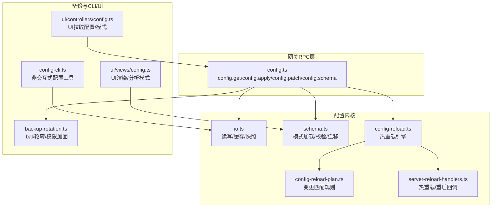
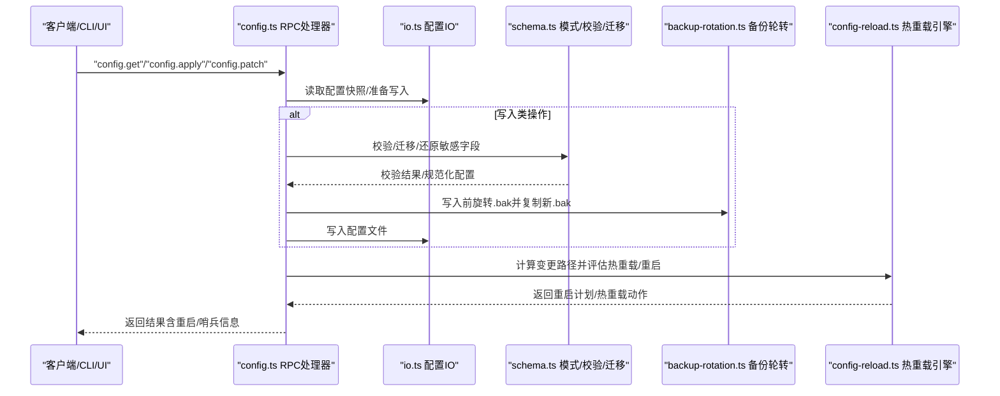
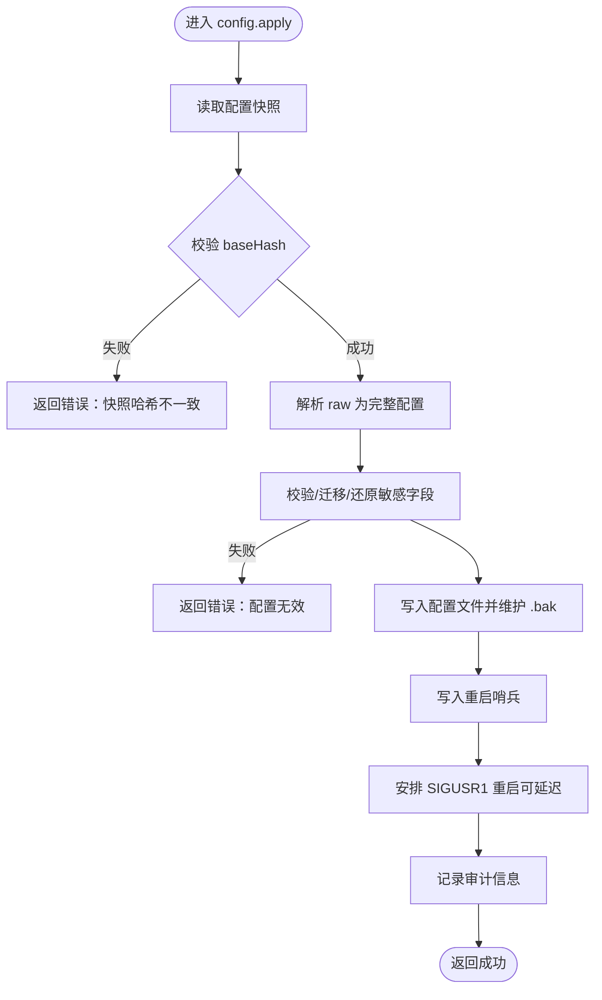
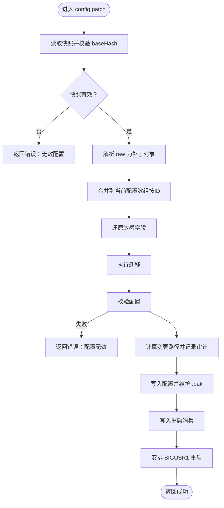
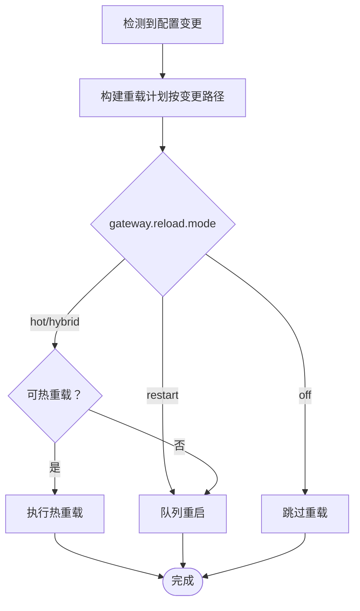
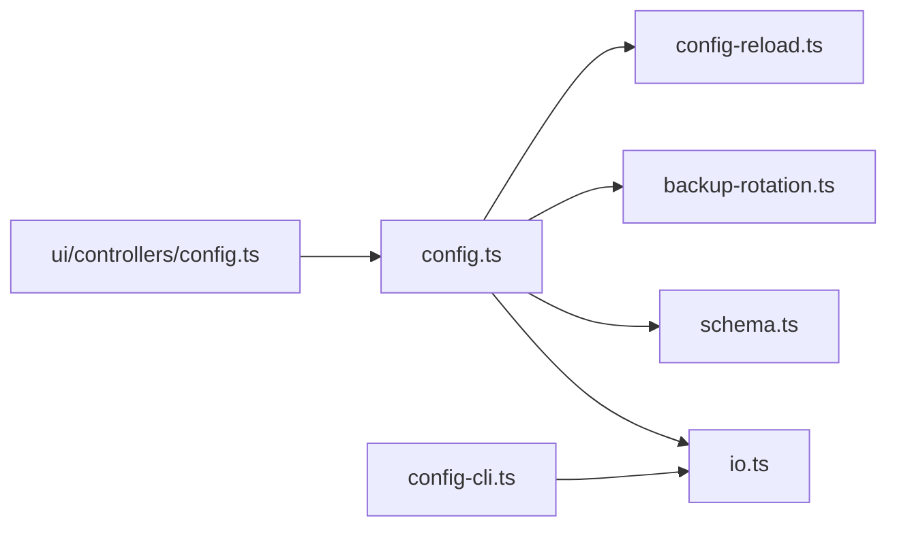

# 配置管理接口

<cite>
**本文引用的文件**
- [src/gateway/server-methods/config.ts](file://src/gateway/server-methods/config.ts)
- [src/config/io.ts](file://src/config/io.ts)
- [src/config/schema.ts](file://src/config/schema.ts)
- [src/gateway/config-reload.ts](file://src/gateway/config-reload.ts)
- [src/gateway/config-reload-plan.ts](file://src/gateway/config-reload-plan.ts)
- [src/gateway/server-reload-handlers.ts](file://src/gateway/server-reload-handlers.ts)
- [src/config/backup-rotation.ts](file://src/config/backup-rotation.ts)
- [src/cli/config-cli.ts](file://src/cli/config-cli.ts)
- [docs/zh-CN/gateway/configuration.md](file://docs/zh-CN/gateway/configuration.md)
- [docs/zh-CN/cli/config.md](file://docs/zh-CN/cli/config.md)
- [ui/src/ui/controllers/config.ts](file://ui/src/ui/controllers/config.ts)
- [ui/src/ui/views/config.ts](file://ui/src/ui/views/config.ts)
</cite>

## 目录
1. [简介](#简介)
2. [项目结构](#项目结构)
3. [核心组件](#核心组件)
4. [架构总览](#架构总览)
5. [详细组件分析](#详细组件分析)
6. [依赖关系分析](#依赖关系分析)
7. [性能考量](#性能考量)
8. [故障排查指南](#故障排查指南)
9. [结论](#结论)
10. [附录](#附录)

## 简介
本文件面向 OpenClaw 的配置管理接口，系统性说明以下能力：
- 配置读取：config.get
- 配置应用：config.apply
- 配置补丁：config.patch
- 配置模式：config.schema、config.schema.lookup
- 配置热重载：基于变更路径的热重载策略与重启策略
- 配置备份与权限加固：写入时自动维护 .bak 备份轮转
- 错误处理与最佳实践：参数校验、并发保护、审计与提示

目标是帮助开发者与运维人员正确、安全地通过 RPC 接口或 CLI 工具进行配置变更与运维。

## 项目结构
与配置管理相关的核心模块分布如下：
- 网关 RPC 方法：提供 config.get、config.apply、config.patch、config.schema 等 RPC 接口
- 配置 IO 与缓存：负责读取、写入、缓存与快照
- 配置模式与校验：加载 JSON Schema、UI 提示、校验与迁移
- 热重载引擎：根据变更路径决定热重载或重启
- 备份轮转：写入时自动维护 .bak 备份轮转与权限加固
- CLI 辅助：非交互式配置读取/设置/校验等
- UI 控制器：拉取配置与模式，驱动表单渲染

图表来源
- [src/gateway/server-methods/config.ts](file://src/gateway/server-methods/config.ts#L262-L516)
- [src/config/io.ts](file://src/config/io.ts#L1349-L1380)
- [src/config/schema.ts](file://src/config/schema.ts)
- [src/gateway/config-reload.ts](file://src/gateway/config-reload.ts#L54-L182)
- [src/gateway/config-reload-plan.ts](file://src/gateway/config-reload-plan.ts#L100-L140)
- [src/gateway/server-reload-handlers.ts](file://src/gateway/server-reload-handlers.ts#L26-L161)
- [src/config/backup-rotation.ts](file://src/config/backup-rotation.ts#L16-L125)
- [src/cli/config-cli.ts](file://src/cli/config-cli.ts#L1-L200)
- [ui/src/ui/controllers/config.ts](file://ui/src/ui/controllers/config.ts#L39-L77)
- [ui/src/ui/views/config.ts](file://ui/src/ui/views/config.ts#L405-L420)

章节来源
- [src/gateway/server-methods/config.ts](file://src/gateway/server-methods/config.ts#L262-L516)
- [src/config/io.ts](file://src/config/io.ts#L1349-L1380)
- [src/config/schema.ts](file://src/config/schema.ts)
- [src/gateway/config-reload.ts](file://src/gateway/config-reload.ts#L54-L182)
- [src/gateway/config-reload-plan.ts](file://src/gateway/config-reload-plan.ts#L100-L140)
- [src/gateway/server-reload-handlers.ts](file://src/gateway/server-reload-handlers.ts#L26-L161)
- [src/config/backup-rotation.ts](file://src/config/backup-rotation.ts#L16-L125)
- [src/cli/config-cli.ts](file://src/cli/config-cli.ts#L1-L200)
- [ui/src/ui/controllers/config.ts](file://ui/src/ui/controllers/config.ts#L39-L77)
- [ui/src/ui/views/config.ts](file://ui/src/ui/views/config.ts#L405-L420)

## 核心组件
- RPC 接口层：提供 config.get、config.apply、config.patch、config.schema、config.schema.lookup、config.set 等方法
- 配置 IO 层：负责读取配置文件快照、写入配置、缓存失效、运行时快照设置
- 模式与校验层：加载插件模式、校验配置对象、执行迁移、生成 UI 提示
- 热重载引擎：解析 gateway.reload.mode/debounceMs，构建重载计划，按需热重载或重启
- 备份轮转：写入前旋转 .bak，写入后复制当前配置到 .bak，加固权限，清理孤儿备份
- CLI 与 UI：CLI 提供非交互式配置读取/设置/校验；UI 通过 RPC 拉取配置与模式并渲染

章节来源
- [src/gateway/server-methods/config.ts](file://src/gateway/server-methods/config.ts#L262-L516)
- [src/config/io.ts](file://src/config/io.ts#L1349-L1380)
- [src/config/schema.ts](file://src/config/schema.ts)
- [src/gateway/config-reload.ts](file://src/gateway/config-reload.ts#L54-L182)
- [src/config/backup-rotation.ts](file://src/config/backup-rotation.ts#L16-L125)
- [src/cli/config-cli.ts](file://src/cli/config-cli.ts#L1-L200)
- [ui/src/ui/controllers/config.ts](file://ui/src/ui/controllers/config.ts#L39-L77)

## 架构总览
下图展示配置管理从请求到落盘、备份与热重载的整体流程。

图表来源
- [src/gateway/server-methods/config.ts](file://src/gateway/server-methods/config.ts#L262-L516)
- [src/config/io.ts](file://src/config/io.ts#L1349-L1380)
- [src/config/schema.ts](file://src/config/schema.ts)
- [src/config/backup-rotation.ts](file://src/config/backup-rotation.ts#L16-L125)
- [src/gateway/config-reload.ts](file://src/gateway/config-reload.ts#L54-L182)

## 详细组件分析

### config.get：获取配置快照与模式
- 功能要点
  - 返回当前配置快照（含原始内容、解析后配置、校验状态、哈希等）
  - 同步返回 JSON Schema 与 UI 提示，供 UI 表单渲染
- 参数与返回
  - 参数：无
  - 返回：配置快照（含 path、exists、raw、parsed、resolved、valid、config、hash、issues、warnings、legacyIssues）
  - 模式：schema、uiHints、version
- 并发与一致性
  - 通过快照哈希（baseHash）与“基础哈希校验”机制，避免并发写入导致的竞态
- 使用建议
  - UI 在发起写入前先调用 config.get 获取快照与哈希，再进行后续操作
  - CLI 中 openclaw config get 支持路径查询与 JSON 输出

章节来源
- [src/gateway/server-methods/config.ts](file://src/gateway/server-methods/config.ts#L262-L270)
- [src/gateway/server-methods/config.ts](file://src/gateway/server-methods/config.ts#L57-L121)
- [ui/src/ui/controllers/config.ts](file://ui/src/ui/controllers/config.ts#L39-L53)
- [docs/zh-CN/cli/config.md](file://docs/zh-CN/cli/config.md#L1-L58)

### config.apply：一次性应用完整配置并重启
- 功能要点
  - 验证 + 写入完整配置 + 写入重启哨兵 + 安排 SIGUSR1 重启
  - 适用于整包替换场景，注意会整体替换配置
- 关键流程
  - 读取快照并校验 baseHash
  - 解析 raw（JSON5）为完整配置，执行校验/迁移/还原敏感字段
  - 写入配置文件，维护 .bak 备份
  - 构建重启哨兵并安排重启（支持延迟重启）
  - 记录审计信息（操作者、设备、IP、变更路径）
- 参数说明
  - raw：完整配置的 JSON5 字符串
  - baseHash：来自 config.get 的配置哈希（存在配置时必填）
  - sessionKey、deliveryContext、threadId：用于重启后唤醒会话
  - note：重启哨兵备注
  - restartDelayMs：重启前延迟（毫秒，默认 2000）
- 错误处理
  - 参数缺失/类型错误、快照哈希不一致、解析失败、校验失败、写入失败、重启失败均会返回错误

图表来源
- [src/gateway/server-methods/config.ts](file://src/gateway/server-methods/config.ts#L455-L516)
- [src/config/backup-rotation.ts](file://src/config/backup-rotation.ts#L16-L125)

章节来源
- [src/gateway/server-methods/config.ts](file://src/gateway/server-methods/config.ts#L455-L516)
- [docs/zh-CN/gateway/configuration.md](file://docs/zh-CN/gateway/configuration.md#L54-L68)

### config.patch：对现有配置进行补丁合并并重启
- 功能要点
  - 对当前配置进行 JSON5 补丁合并（支持数组按 ID 合并）
  - 还原被隐藏的敏感字段，执行迁移与校验
  - 写入配置并维护 .bak，安排重启
- 关键流程
  - 读取快照并校验 baseHash
  - 校验快照有效（无效配置需先修复）
  - 解析 raw（JSON5 对象），执行合并、还原、迁移、校验
  - 计算变更路径，记录审计
  - 写入配置、维护 .bak、写入重启哨兵、安排重启
- 参数说明
  - raw：JSON5 补丁对象（字符串形式）
  - 其余与 apply 相同（baseHash、sessionKey、note、restartDelayMs 等）
- 注意事项
  - 仅支持对象补丁；数组按 ID 合并策略由合并库提供
  - 若配置无效，需先修复后再进行补丁操作

图表来源
- [src/gateway/server-methods/config.ts](file://src/gateway/server-methods/config.ts#L333-L454)
- [src/config/backup-rotation.ts](file://src/config/backup-rotation.ts#L16-L125)

章节来源
- [src/gateway/server-methods/config.ts](file://src/gateway/server-methods/config.ts#L333-L454)

### config.set：设置单个配置值（非补丁）
- 功能要点
  - 与 patch 类似，但针对单值设置（通常由 UI 或 CLI 使用）
- 流程要点
  - 读取快照并校验 baseHash
  - 解析 raw（JSON5）为完整配置
  - 写入配置并返回结果

章节来源
- [src/gateway/server-methods/config.ts](file://src/gateway/server-methods/config.ts#L310-L332)

### config.schema 与 config.schema.lookup：模式与路径查询
- config.schema
  - 返回 JSON Schema 与 UI 提示，供 UI 渲染表单
- config.schema.lookup
  - 按路径查询模式片段，若路径不存在则返回错误
- UI 使用
  - UI 通过 config.schema 获取 schema 与 uiHints，渲染表单
  - UI 通过 config.schema.lookup 获取特定路径的模式详情

章节来源
- [src/gateway/server-methods/config.ts](file://src/gateway/server-methods/config.ts#L271-L309)
- [ui/src/ui/controllers/config.ts](file://ui/src/ui/controllers/config.ts#L55-L77)
- [ui/src/ui/views/config.ts](file://ui/src/ui/views/config.ts#L405-L420)

### 配置热重载与重启策略
- 热重载引擎
  - 解析 gateway.reload.mode 与 debounceMs
  - 基于变更路径构建重载计划（hot/noop/restart）
  - 当 mode=off 时禁用；mode=restart 时直接重启；hot 模式优先热重载，无法热重载时降级重启
- 重启策略
  - 通过 SIGUSR1 触发重启，支持延迟重启与审计
  - 重启前写入“重启哨兵”，重启后可唤醒最后活跃会话
- 插件贡献
  - 通道插件可声明 configPrefixes（热重载/无操作前缀），影响重载计划

图表来源
- [src/gateway/config-reload.ts](file://src/gateway/config-reload.ts#L54-L182)
- [src/gateway/config-reload-plan.ts](file://src/gateway/config-reload-plan.ts#L100-L140)
- [src/gateway/server-reload-handlers.ts](file://src/gateway/server-reload-handlers.ts#L26-L161)

章节来源
- [src/gateway/config-reload.ts](file://src/gateway/config-reload.ts#L54-L182)
- [src/gateway/config-reload-plan.ts](file://src/gateway/config-reload-plan.ts#L100-L140)
- [src/gateway/server-reload-handlers.ts](file://src/gateway/server-reload-handlers.ts#L26-L161)

### 备份与恢复（写入时维护 .bak）
- 轮转策略
  - 维护固定数量的 .bak 文件轮转，写入前旋转，写入后复制当前配置到 .bak
- 权限加固
  - 将所有 .bak 文件权限设为仅属主可读写，提升安全性
- 孤儿备份清理
  - 清理不在轮转范围内的孤儿 .bak.* 文件
- 恢复建议
  - 发生问题时可使用最近的 .bak 进行恢复

章节来源
- [src/config/backup-rotation.ts](file://src/config/backup-rotation.ts#L16-L125)

### 非交互式配置 CLI（openclaw config）
- 支持命令
  - config get/path：按路径获取值（支持 JSON 输出）
  - config set/path：按路径设置值（支持 JSON5 解析）
  - config unset/path：按路径取消设置
  - config file：打印当前配置文件路径
  - config validate：校验配置有效性
- 路径语法
  - 支持点号与方括号表示法（如 agents.list[0].id）

章节来源
- [src/cli/config-cli.ts](file://src/cli/config-cli.ts#L1-L200)
- [docs/zh-CN/cli/config.md](file://docs/zh-CN/cli/config.md#L1-L58)

## 依赖关系分析
- RPC 层依赖 IO 层进行读写与缓存管理
- RPC 层依赖模式与校验层进行 schema 加载、校验与迁移
- 写入路径同时触发备份轮转与热重载/重启决策
- UI 通过 RPC 拉取配置与模式，驱动表单渲染
- CLI 与 UI 互补：CLI 适合自动化与脚本，UI 适合可视化与交互

图表来源
- [src/gateway/server-methods/config.ts](file://src/gateway/server-methods/config.ts#L262-L516)
- [src/config/io.ts](file://src/config/io.ts#L1349-L1380)
- [src/config/schema.ts](file://src/config/schema.ts)
- [src/config/backup-rotation.ts](file://src/config/backup-rotation.ts#L16-L125)
- [src/gateway/config-reload.ts](file://src/gateway/config-reload.ts#L54-L182)
- [ui/src/ui/controllers/config.ts](file://ui/src/ui/controllers/config.ts#L39-L77)
- [src/cli/config-cli.ts](file://src/cli/config-cli.ts#L1-L200)

章节来源
- [src/gateway/server-methods/config.ts](file://src/gateway/server-methods/config.ts#L262-L516)
- [src/config/io.ts](file://src/config/io.ts#L1349-L1380)
- [src/config/schema.ts](file://src/config/schema.ts)
- [src/config/backup-rotation.ts](file://src/config/backup-rotation.ts#L16-L125)
- [src/gateway/config-reload.ts](file://src/gateway/config-reload.ts#L54-L182)
- [ui/src/ui/controllers/config.ts](file://ui/src/ui/controllers/config.ts#L39-L77)
- [src/cli/config-cli.ts](file://src/cli/config-cli.ts#L1-L200)

## 性能考量
- 配置缓存
  - IO 层提供配置缓存与运行时快照，写入后清空缓存，避免读到陈旧配置
- 热重载去抖
  - 通过 debounceMs 控制重载频率，减少频繁变更带来的抖动
- 写入开销
  - 写入时进行 .bak 轮转与复制，建议在批量变更时合并为一次 apply 或补丁，降低写入次数
- 并发保护
  - baseHash 校验防止并发写入覆盖彼此变更

章节来源
- [src/config/io.ts](file://src/config/io.ts#L1349-L1380)
- [src/gateway/config-reload.ts](file://src/gateway/config-reload.ts#L54-L66)
- [src/gateway/server-methods/config.ts](file://src/gateway/server-methods/config.ts#L57-L121)

## 故障排查指南
- 常见错误与处理
  - 参数无效：检查 raw 是否为字符串、JSON5 是否合法
  - 快照哈希不一致：先重新调用 config.get 获取最新快照与哈希
  - 配置无效：根据返回的 issues 逐项修正；必要时运行 doctor 诊断
  - 写入失败：检查文件权限与磁盘空间；确认 .bak 写入是否成功
  - 重启失败：检查 SIGUSR1 监听是否存在；查看重启计划与审计日志
- 诊断工具
  - doctor：用于诊断配置问题与修复
  - config.validate：快速验证配置有效性
- 回滚与恢复
  - 使用最近的 .bak 文件回滚
  - 如需恢复到历史版本，可手动复制对应 .bak.* 文件

章节来源
- [src/gateway/server-methods/config.ts](file://src/gateway/server-methods/config.ts#L333-L454)
- [src/gateway/server-methods/config.ts](file://src/gateway/server-methods/config.ts#L455-L516)
- [src/config/backup-rotation.ts](file://src/config/backup-rotation.ts#L16-L125)
- [docs/zh-CN/gateway/configuration.md](file://docs/zh-CN/gateway/configuration.md#L35-L68)
- [docs/zh-CN/cli/config.md](file://docs/zh-CN/cli/config.md#L1-L58)

## 结论
OpenClaw 的配置管理以“安全、可观测、可回滚”为核心设计原则：
- 通过 RPC 接口提供统一的配置读取、应用、补丁与模式查询能力
- 写入路径自动维护 .bak 备份轮转与权限加固，确保可恢复性
- 基于变更路径的热重载与重启策略，兼顾稳定性与灵活性
- 配套 CLI 与 UI，满足自动化与交互式场景

建议在生产环境遵循“先 get+校验，再 apply/patch”的流程，并在关键变更前做好备份。

## 附录

### API 一览与参数说明
- config.get
  - 用途：获取配置快照与模式
  - 参数：无
  - 返回：快照与模式
- config.apply
  - 用途：一次性应用完整配置并重启
  - 参数：raw（完整配置 JSON5）、baseHash（可选）、sessionKey（可选）、note（可选）、restartDelayMs（可选）
  - 返回：写入路径、脱敏后的配置、重启计划、重启哨兵信息
- config.patch
  - 用途：对现有配置进行补丁合并并重启
  - 参数：raw（补丁 JSON5 对象）、baseHash（可选）、其余同 apply
  - 返回：写入路径、脱敏后的配置、重启计划、重启哨兵信息
- config.set
  - 用途：设置单个配置值
  - 参数：raw（完整配置 JSON5）
  - 返回：写入路径、脱敏后的配置
- config.schema / config.schema.lookup
  - 用途：获取模式与路径模式
  - 返回：schema、uiHints、version；或指定路径的模式片段

章节来源
- [src/gateway/server-methods/config.ts](file://src/gateway/server-methods/config.ts#L262-L516)
- [docs/zh-CN/gateway/configuration.md](file://docs/zh-CN/gateway/configuration.md#L54-L68)
- [docs/zh-CN/cli/config.md](file://docs/zh-CN/cli/config.md#L1-L58)