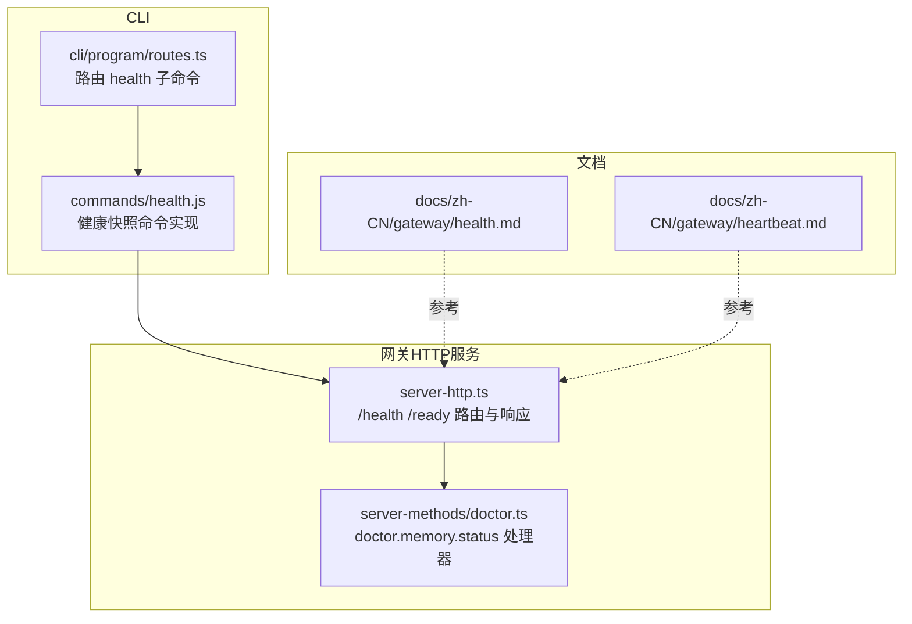
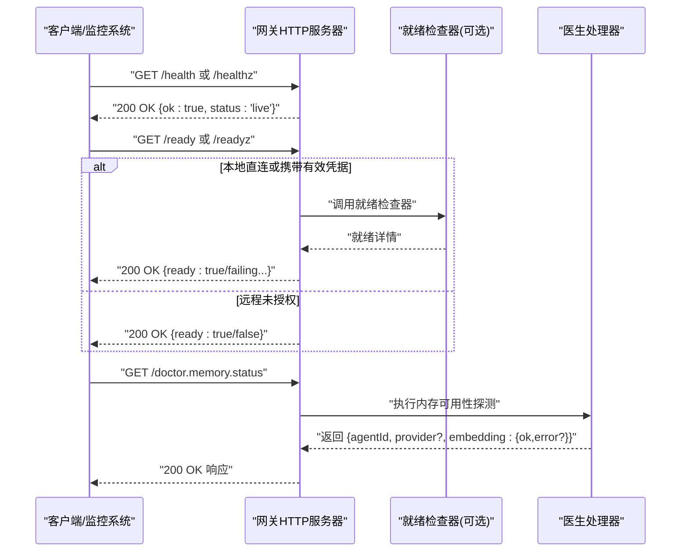
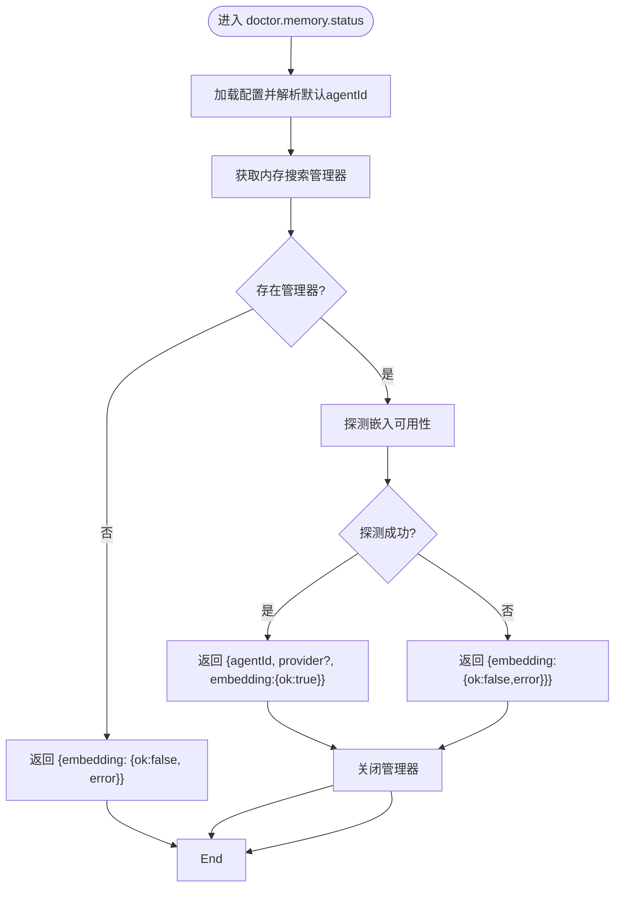
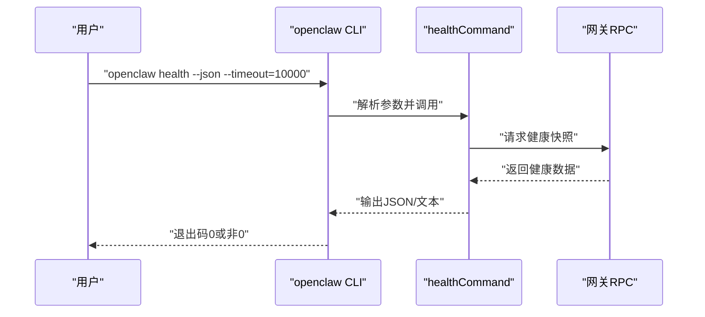
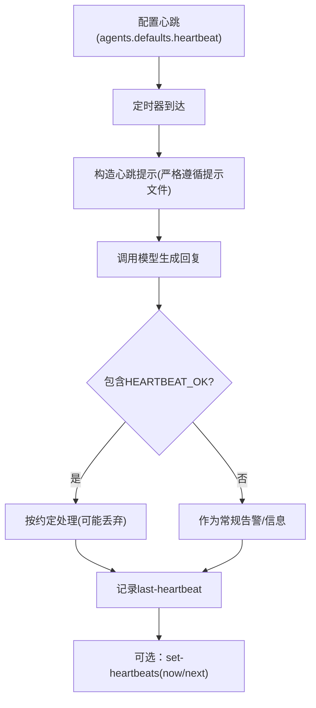
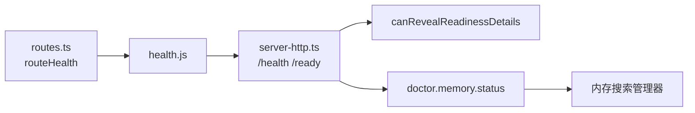

# 健康检查端点

<cite>
**本文引用的文件**
- [src/gateway/server-http.ts](file://src/gateway/server-http.ts)
- [src/gateway/server-http.probe.test.ts](file://src/gateway/server-http.probe.test.ts)
- [src/gateway/server-methods/doctor.ts](file://src/gateway/server-methods/doctor.ts)
- [src/gateway/server-methods/doctor.test.ts](file://src/gateway/server-methods/doctor.test.ts)
- [src/commands/health.js](file://src/commands/health.js)
- [src/cli/program/routes.ts](file://src/cli/program/routes.ts)
- [docs/zh-CN/gateway/health.md](file://docs/zh-CN/gateway/health.md)
- [docs/zh-CN/gateway/heartbeat.md](file://docs/zh-CN/gateway/heartbeat.md)
</cite>

## 目录
1. [简介](#简介)
2. [项目结构](#项目结构)
3. [核心组件](#核心组件)
4. [架构总览](#架构总览)
5. [详细组件分析](#详细组件分析)
6. [依赖关系分析](#依赖关系分析)
7. [性能考量](#性能考量)
8. [故障排查指南](#故障排查指南)
9. [结论](#结论)

## 简介
本文件面向 OpenClaw 网关的健康检查相关端点，聚焦以下接口：
- 健康探针：/health、/healthz
- 就绪探针：/ready、/readyz
- 医生端点：doctor.memory.status
- 心跳机制与 last-heartbeat、set-heartbeats 的使用与最佳实践

文档提供每个端点的 HTTP 方法、URL 路径、鉴权与访问范围、请求参数、响应格式、状态码以及典型用法与最佳实践，帮助运维与开发者快速定位网关健康问题。

## 项目结构
与健康检查端点直接相关的代码主要分布在：
- 网关 HTTP 服务器：负责 /health、/healthz、/ready、/readyz 的路由与响应
- 医生端点处理器：doctor.memory.status 的实现
- CLI 健康命令：openclaw health 的入口与行为
- 文档：健康检查与心跳机制的官方说明

图表来源
- [src/gateway/server-http.ts](file://src/gateway/server-http.ts#L88-L93)
- [src/gateway/server-methods/doctor.ts](file://src/gateway/server-methods/doctor.ts#L16-L62)
- [src/cli/program/routes.ts](file://src/cli/program/routes.ts#L17-L33)
- [src/commands/health.js](file://src/commands/health.js)

章节来源
- [src/gateway/server-http.ts](file://src/gateway/server-http.ts#L88-L93)
- [src/gateway/server-methods/doctor.ts](file://src/gateway/server-methods/doctor.ts#L16-L62)
- [src/cli/program/routes.ts](file://src/cli/program/routes.ts#L17-L33)
- [docs/zh-CN/gateway/health.md](file://docs/zh-CN/gateway/health.md#L1-L43)
- [docs/zh-CN/gateway/heartbeat.md](file://docs/zh-CN/gateway/heartbeat.md#L47-L91)

## 核心组件
- 健康探针与就绪探针：由网关 HTTP 服务器统一处理，支持 GET/HEAD，返回标准化 JSON。
- 医生端点 doctor.memory.status：用于检查网关内存嵌入能力可用性。
- CLI 健康命令 openclaw health：向运行中的网关请求健康快照，支持 --json、--timeout 等选项。

章节来源
- [src/gateway/server-http.ts](file://src/gateway/server-http.ts#L184-L236)
- [src/gateway/server-methods/doctor.ts](file://src/gateway/server-methods/doctor.ts#L16-L62)
- [src/cli/program/routes.ts](file://src/cli/program/routes.ts#L17-L33)

## 架构总览
下图展示健康检查端点在系统中的交互关系：

图表来源
- [src/gateway/server-http.ts](file://src/gateway/server-http.ts#L88-L93)
- [src/gateway/server-http.ts](file://src/gateway/server-http.ts#L184-L236)
- [src/gateway/server-methods/doctor.ts](file://src/gateway/server-methods/doctor.ts#L16-L62)

## 详细组件分析

### 健康探针：/health 与 /healthz
- HTTP 方法：GET、HEAD
- URL 路径：/health、/healthz
- 访问范围：无条件返回“存活”状态，不包含就绪细节
- 鉴权与代理：不受限，适合外部健康检查工具快速探测
- 响应格式：
  - 成功：200 OK，JSON：{ ok: true, status: "live" }
  - HEAD：仅返回状态码，无响应体
- 典型用途：容器编排、反向代理层的存活探测

章节来源
- [src/gateway/server-http.ts](file://src/gateway/server-http.ts#L88-L93)
- [src/gateway/server-http.ts](file://src/gateway/server-http.ts#L198-L236)
- [src/gateway/server-http.probe.test.ts](file://src/gateway/server-http.probe.test.ts#L112-L132)

### 就绪探针：/ready 与 /readyz
- HTTP 方法：GET、HEAD
- URL 路径：/ready、/readyz
- 访问范围与鉴权：
  - 本地直连或携带有效凭据时，返回详细就绪信息（包括 failing 列表、uptimeMs）
  - 远程未授权时，仅返回 { ready: boolean }
- 响应格式：
  - 200 OK：{ ready: true, failing: [], uptimeMs: <毫秒> }
  - 503 Service Unavailable：{ ready: false } 或 { ready: false, failing: ["internal"], uptimeMs: 0 }
  - HEAD：返回 200 或 503，无响应体
- 典型用途：容器启动就绪、部署阶段等待网关完全可用

章节来源
- [src/gateway/server-http.ts](file://src/gateway/server-http.ts#L184-L236)
- [src/gateway/server-http.ts](file://src/gateway/server-http.ts#L160-L182)
- [src/gateway/server-http.probe.test.ts](file://src/gateway/server-http.probe.test.ts#L13-L33)
- [src/gateway/server-http.probe.test.ts](file://src/gateway/server-http.probe.test.ts#L35-L40)
- [src/gateway/server-http.probe.test.ts](file://src/gateway/server-http.probe.test.ts#L92-L110)
- [src/gateway/server-http.probe.test.ts](file://src/gateway/server-http.probe.test.ts#L134-L155)

### 医生端点：doctor.memory.status
- HTTP 方法：GET（通过网关内部路由分发）
- URL 路径：doctor.memory.status（内部方法名）
- 请求参数：无
- 响应字段：
  - agentId：默认智能体标识
  - provider：内存搜索提供方（可选）
  - embedding：{ ok: boolean, error?: string }
- 响应状态：200 OK（成功）
- 错误场景：
  - 内存搜索管理器缺失：返回 { embedding: { ok: false, error } }
  - 探测异常：返回 { embedding: { ok: false, error: "gateway memory probe failed: ..." } }
- 关闭资源：始终尝试关闭内存搜索管理器

图表来源
- [src/gateway/server-methods/doctor.ts](file://src/gateway/server-methods/doctor.ts#L16-L62)

章节来源
- [src/gateway/server-methods/doctor.ts](file://src/gateway/server-methods/doctor.ts#L7-L14)
- [src/gateway/server-methods/doctor.ts](file://src/gateway/server-methods/doctor.ts#L16-L62)
- [src/gateway/server-methods/doctor.test.ts](file://src/gateway/server-methods/doctor.test.ts#L22-L31)
- [src/gateway/server-methods/doctor.test.ts](file://src/gateway/server-methods/doctor.test.ts#L54-L82)
- [src/gateway/server-methods/doctor.test.ts](file://src/gateway/server-methods/doctor.test.ts#L84-L112)

### CLI 健康命令：openclaw health
- 子命令：health
- 关键选项：
  - --json：以 JSON 输出健康快照
  - --timeout <毫秒>：覆盖默认超时
  - --verbose：详细输出（含调试）
- 行为说明：
  - 仅当 --json 未指定时才预加载插件元数据（文本输出需要）
  - 将 RPC 输出透传给调用者，不直接访问渠道套接字
  - 若网关不可达或探测失败/超时，以非零退出

图表来源
- [src/cli/program/routes.ts](file://src/cli/program/routes.ts#L17-L33)
- [src/commands/health.js](file://src/commands/health.js)

章节来源
- [src/cli/program/routes.ts](file://src/cli/program/routes.ts#L17-L33)
- [docs/zh-CN/gateway/health.md](file://docs/zh-CN/gateway/health.md#L40-L43)

### 心跳机制与 last-heartbeat、set-heartbeats
- 心跳配置与行为：
  - 默认间隔：30 分钟；当认证模式为 Anthropic OAuth/setup-token 时为 1 小时
  - 提示内容：严格遵循提示文件与系统提示中的 Heartbeat 部分
  - 响应约定：若回复以 HEARTBEAT_OK 开头或结尾且满足长度限制，将被视作确认并丢弃
- last-heartbeat：
  - 用于查询最近一次心跳的运行摘要（如时间戳、是否成功、提示内容等）
  - 通常通过网关内部 API 或 CLI 查询
- set-heartbeats：
  - 用于手动触发或调整心跳运行（如立即运行、等待下次时钟周期）
  - 支持模式：now（立即）、next-heartbeat（等待下一个周期）

图表来源
- [docs/zh-CN/gateway/heartbeat.md](file://docs/zh-CN/gateway/heartbeat.md#L47-L91)
- [docs/zh-CN/gateway/heartbeat.md](file://docs/zh-CN/gateway/heartbeat.md#L64-L71)
- [docs/zh-CN/gateway/heartbeat.md](file://docs/zh-CN/gateway/heartbeat.md#L250-L260)

章节来源
- [docs/zh-CN/gateway/heartbeat.md](file://docs/zh-CN/gateway/heartbeat.md#L47-L91)
- [docs/zh-CN/gateway/heartbeat.md](file://docs/zh-CN/gateway/heartbeat.md#L64-L71)
- [docs/zh-CN/gateway/heartbeat.md](file://docs/zh-CN/gateway/heartbeat.md#L250-L260)

## 依赖关系分析
- server-http.ts
  - 维护探针路径映射：/health、/healthz、/ready、/readyz
  - 权限判定：canRevealReadinessDetails 决定是否返回详细就绪信息
  - 就绪检查器：getReadiness（可选）用于 /ready 与 /readyz
- server-methods/doctor.ts
  - 依赖配置加载、默认智能体解析、内存搜索管理器
  - 返回 doctor.memory.status 的标准化负载
- CLI routes.ts
  - 将 health 子命令路由到 healthCommand，并根据 --json 控制插件预加载
- commands/health.js
  - 实现健康快照请求与输出控制

图表来源
- [src/cli/program/routes.ts](file://src/cli/program/routes.ts#L17-L33)
- [src/commands/health.js](file://src/commands/health.js)
- [src/gateway/server-http.ts](file://src/gateway/server-http.ts#L160-L182)
- [src/gateway/server-http.ts](file://src/gateway/server-http.ts#L88-L93)
- [src/gateway/server-methods/doctor.ts](file://src/gateway/server-methods/doctor.ts#L16-L62)

章节来源
- [src/gateway/server-http.ts](file://src/gateway/server-http.ts#L88-L93)
- [src/gateway/server-http.ts](file://src/gateway/server-http.ts#L160-L182)
- [src/gateway/server-methods/doctor.ts](file://src/gateway/server-methods/doctor.ts#L16-L62)
- [src/cli/program/routes.ts](file://src/cli/program/routes.ts#L17-L33)

## 性能考量
- /health 与 /healthz 为浅层探测，适合高频调用，响应开销极低
- /ready 与 /readyz 在本地直连或具备有效凭据时返回详细信息，可能触发内部检查器，建议在部署阶段使用，避免频繁外部探测
- doctor.memory.status 会建立并探测内存搜索管理器，建议按需调用，避免在高并发场景下频繁触发
- CLI 健康命令 --timeout 可根据环境调优，避免长时间阻塞

## 故障排查指南
- /ready 返回 503：
  - 检查就绪检查器是否抛出异常
  - 确认远程访问是否具备有效凭据以获取详细信息
- /ready 返回 { ready: false, failing: [...] }：
  - 按渠道维度排查认证、网络与会话状态
- doctor.memory.status 返回错误：
  - 确认内存搜索管理器可用性与配置
  - 查看错误信息中的具体原因（如超时、不可用）
- CLI 健康命令失败：
  - 使用 --timeout 调整超时
  - 使用 --verbose 获取更多上下文
  - 参考官方健康检查文档进行端到端排查

章节来源
- [src/gateway/server-http.probe.test.ts](file://src/gateway/server-http.probe.test.ts#L92-L110)
- [src/gateway/server-methods/doctor.test.ts](file://src/gateway/server-methods/doctor.test.ts#L84-L112)
- [docs/zh-CN/gateway/health.md](file://docs/zh-CN/gateway/health.md#L28-L43)

## 结论
- /health 与 /healthz 适用于存活探测，/ready 与 /readyz 适用于就绪探测，二者配合可满足容器编排与部署阶段的健康保障
- doctor.memory.status 提供内存嵌入可用性的细粒度检查，便于定位记忆相关问题
- CLI 健康命令 openclaw health 为自动化与脚本化提供了统一入口
- 心跳机制通过严格提示与响应约定，确保后台任务与人类签到的稳定执行