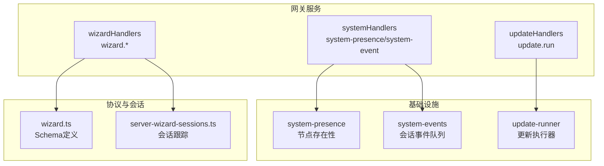
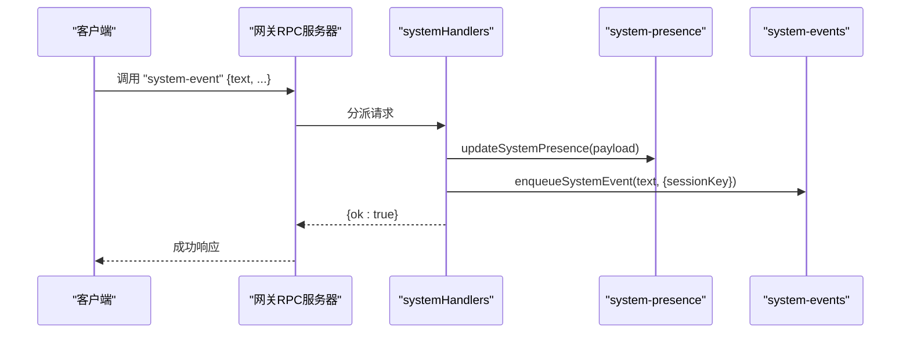
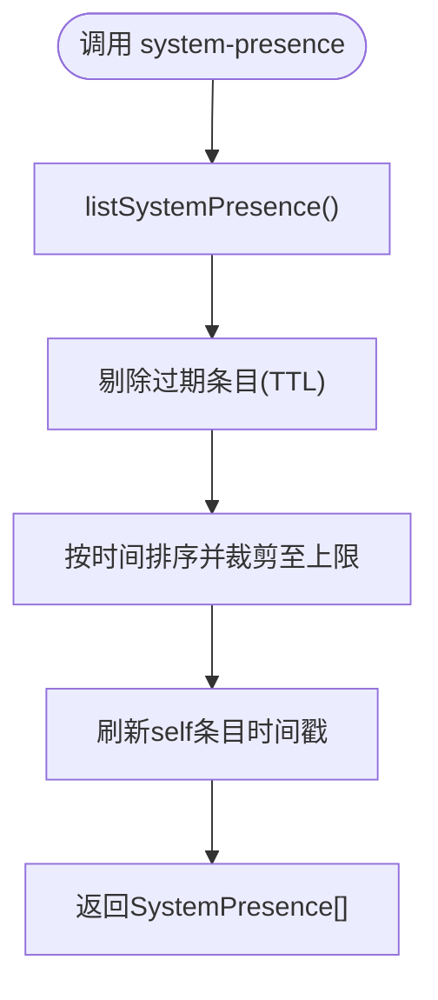
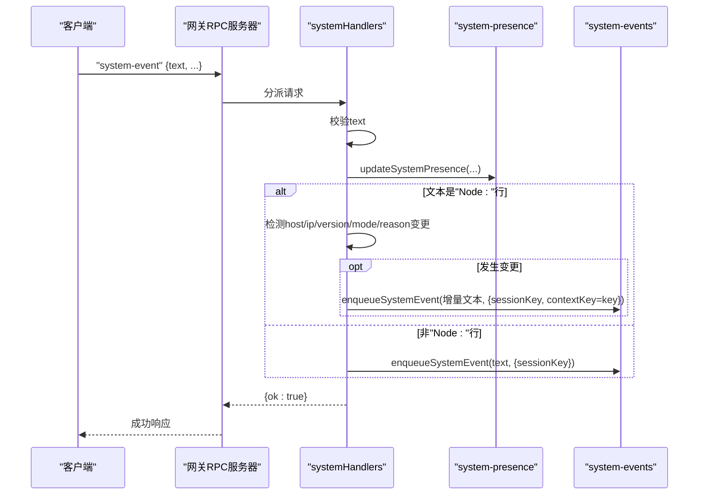
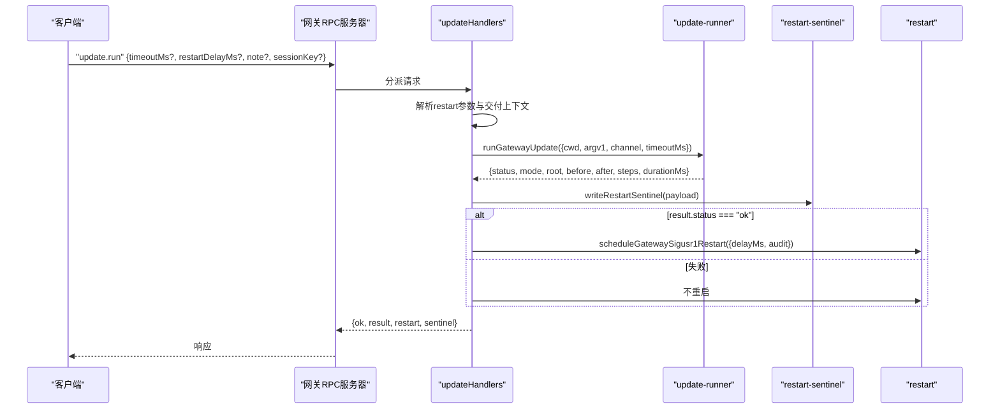
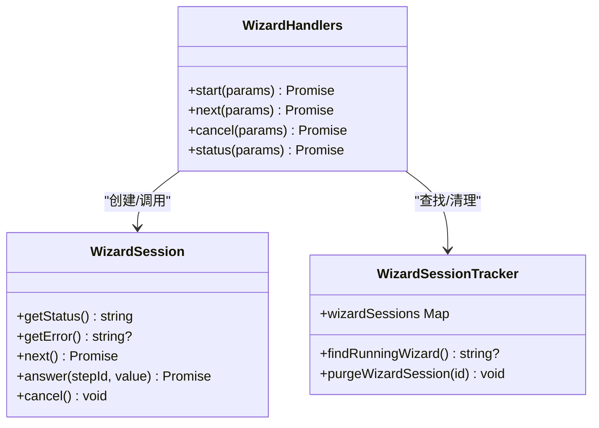
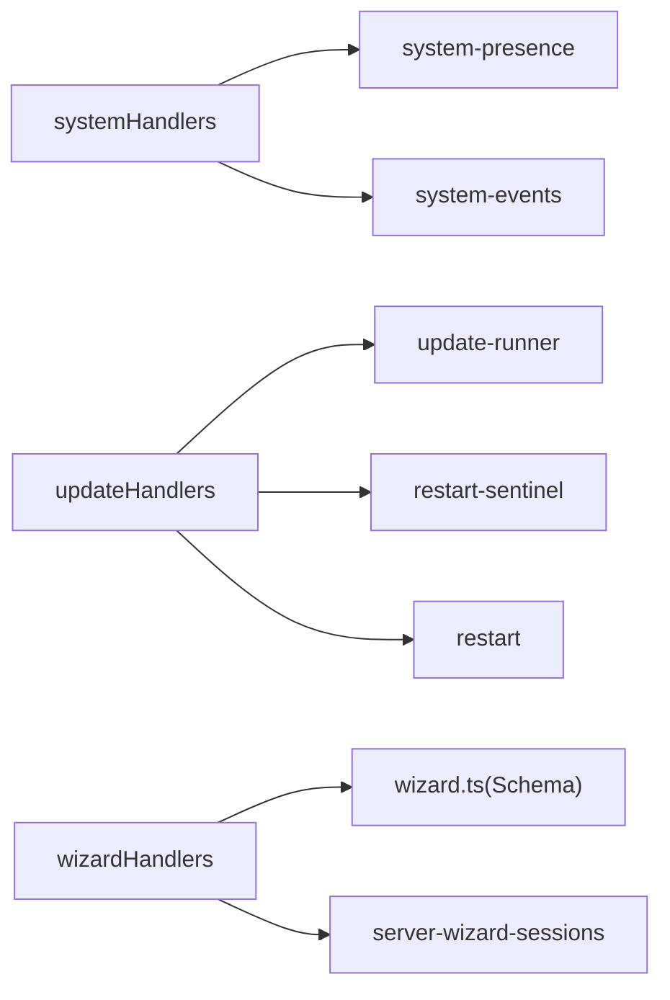

# 系统管理端点

<cite>
**本文档引用的文件**
- [src/infra/system-presence.ts](file://src/infra/system-presence.ts)
- [src/infra/system-events.ts](file://src/infra/system-events.ts)
- [src/gateway/server-methods/system.ts](file://src/gateway/server-methods/system.ts)
- [src/gateway/server-methods/update.ts](file://src/gateway/server-methods/update.ts)
- [src/gateway/server-methods/wizard.ts](file://src/gateway/server-methods/wizard.ts)
- [src/gateway/protocol/schema/wizard.ts](file://src/gateway/protocol/schema/wizard.ts)
- [src/gateway/server-wizard-sessions.ts](file://src/gateway/server-wizard-sessions.ts)
- [src/infra/update-runner.ts](file://src/infra/update-runner.ts)
</cite>

## 目录
1. [简介](#简介)
2. [项目结构](#项目结构)
3. [核心组件](#核心组件)
4. [架构总览](#架构总览)
5. [详细组件分析](#详细组件分析)
6. [依赖关系分析](#依赖关系分析)
7. [性能考量](#性能考量)
8. [故障排查指南](#故障排查指南)
9. [结论](#结论)

## 简介
本文件面向OpenClaw网关系统的系统管理端点，聚焦以下RPC方法的API级文档与技术实现说明：
- system-presence：系统节点存在性与状态快照查询
- system-event：系统事件入队与节点状态变更事件通知
- update.run：网关更新执行与重启调度
- wizard.start / wizard.next / wizard.cancel / wizard.status：向导会话生命周期管理

文档覆盖请求参数、响应结构、错误码、内部处理流程、事件广播与状态同步机制，并提供序列图与类图帮助理解。

## 项目结构
围绕系统管理端点的相关模块组织如下：
- 基础设施层（infra）
  - system-presence：系统节点存在性数据模型、合并策略、列表清理
  - system-events：会话级系统事件队列（去重、上下文键、容量限制）
  - update-runner：更新执行流水线（Git分支/标签切换、依赖安装、构建、健康检查）
- 网关服务层（gateway/server-methods）
  - system：system-presence与system-event的RPC处理器
  - update：update.run的RPC处理器
  - wizard：向导会话的RPC处理器
- 协议与会话跟踪
  - protocol/schema/wizard：向导参数与结果的Schema定义
  - server-wizard-sessions：向导会话Map与运行中检测、过期清理

**图表来源**
- [src/infra/system-presence.ts](file://src/infra/system-presence.ts#L1-L290)
- [src/infra/system-events.ts](file://src/infra/system-events.ts#L1-L120)
- [src/infra/update-runner.ts](file://src/infra/update-runner.ts#L320-L800)
- [src/gateway/server-methods/system.ts](file://src/gateway/server-methods/system.ts#L1-L135)
- [src/gateway/server-methods/update.ts](file://src/gateway/server-methods/update.ts#L1-L135)
- [src/gateway/server-methods/wizard.ts](file://src/gateway/server-methods/wizard.ts#L1-L119)
- [src/gateway/protocol/schema/wizard.ts](file://src/gateway/protocol/schema/wizard.ts#L1-L104)
- [src/gateway/server-wizard-sessions.ts](file://src/gateway/server-wizard-sessions.ts#L1-L28)

**章节来源**
- [src/infra/system-presence.ts](file://src/infra/system-presence.ts#L1-L290)
- [src/infra/system-events.ts](file://src/infra/system-events.ts#L1-L120)
- [src/infra/update-runner.ts](file://src/infra/update-runner.ts#L320-L800)
- [src/gateway/server-methods/system.ts](file://src/gateway/server-methods/system.ts#L1-L135)
- [src/gateway/server-methods/update.ts](file://src/gateway/server-methods/update.ts#L1-L135)
- [src/gateway/server-methods/wizard.ts](file://src/gateway/server-methods/wizard.ts#L1-L119)
- [src/gateway/protocol/schema/wizard.ts](file://src/gateway/protocol/schema/wizard.ts#L1-L104)
- [src/gateway/server-wizard-sessions.ts](file://src/gateway/server-wizard-sessions.ts#L1-L28)

## 核心组件
- 系统存在性（SystemPresence）
  - 数据结构：包含主机名、IP、版本、平台、设备族、机型标识、最后输入秒数、模式、原因、设备ID、角色/作用域/标签集合、文本描述与时间戳
  - 合并策略：按deviceId/instanceId/host/ip/解析文本前缀等优先级生成键；合并字段时对数组进行去重合并
  - 列表维护：带TTL与最大条目数的LRU清理；自刷新self条目
- 系统事件（SystemEvent）
  - 会话级队列：每个sessionKey对应一个队列，容量上限，去重相邻重复项
  - 上下文键：支持contextKey区分不同上下文，变更时可触发“上下文变化”判断
  - 出队：支持drain/peek/has等操作
- 更新执行（update.run）
  - 执行器：根据配置通道选择dev或release路径；dev通道进行预检（worktree+构建+lint）；release通道选择最高稳定/β标签并checkout
  - 结果：返回状态、模式、前后SHA/版本、步骤明细与耗时
  - 重启：仅在成功后调度SIGUSR1重启，失败不重启避免损坏状态
- 向导（wizard.*）
  - 会话：基于WizardSession封装，支持start/next/cancel/status
  - 并发控制：同一时刻仅允许一个运行中的向导
  - 过期清理：非running状态的会话自动清理

**章节来源**
- [src/infra/system-presence.ts](file://src/infra/system-presence.ts#L6-L290)
- [src/infra/system-events.ts](file://src/infra/system-events.ts#L1-L120)
- [src/infra/update-runner.ts](file://src/infra/update-runner.ts#L320-L800)
- [src/gateway/server-methods/wizard.ts](file://src/gateway/server-methods/wizard.ts#L1-L119)
- [src/gateway/server-wizard-sessions.ts](file://src/gateway/server-wizard-sessions.ts#L1-L28)

## 架构总览
系统管理端点通过网关RPC入口分派到各处理器，处理器调用基础设施模块完成状态更新、事件入队、更新执行与向导会话管理，并在必要时触发广播或重启。

**图表来源**
- [src/gateway/server-methods/system.ts](file://src/gateway/server-methods/system.ts#L34-L133)
- [src/infra/system-presence.ts](file://src/infra/system-presence.ts#L193-L246)
- [src/infra/system-events.ts](file://src/infra/system-events.ts#L51-L83)

## 详细组件分析

### system-presence 接口
- 方法名：system-presence
- 请求体：无
- 响应体：SystemPresence[]（按最近时间倒序）
- 处理逻辑要点：
  - 调用listSystemPresence，内部执行TTL清理与LRU裁剪，确保self条目存在
  - 返回当前所有有效节点的存在性快照

**图表来源**
- [src/gateway/server-methods/system.ts](file://src/gateway/server-methods/system.ts#L30-L33)
- [src/infra/system-presence.ts](file://src/infra/system-presence.ts#L270-L289)

**章节来源**
- [src/gateway/server-methods/system.ts](file://src/gateway/server-methods/system.ts#L30-L33)
- [src/infra/system-presence.ts](file://src/infra/system-presence.ts#L270-L289)

### system-event 接口
- 方法名：system-event
- 请求体参数：
  - text: 必填（字符串，将被trim）
  - 可选字段：deviceId、instanceId、host、ip、mode、version、platform、deviceFamily、modelIdentifier、lastInputSeconds、reason、roles[]、scopes[]、tags[]
- 响应体：{ ok: boolean }
- 处理逻辑要点：
  - 参数校验：text必填且非空
  - 更新存在性：调用updateSystemPresence合并payload与解析后的text
  - 节点行处理：当text以“Node:”开头时，若host/ip/version/mode/reason发生变更（忽略特定reason），则构造增量事件并入队
  - 其他事件：直接入队
  - 广播：触发一次存在性快照广播
- 错误码：INVALID_REQUEST（text为空）

**图表来源**
- [src/gateway/server-methods/system.ts](file://src/gateway/server-methods/system.ts#L34-L133)
- [src/infra/system-presence.ts](file://src/infra/system-presence.ts#L193-L246)
- [src/infra/system-events.ts](file://src/infra/system-events.ts#L51-L83)

**章节来源**
- [src/gateway/server-methods/system.ts](file://src/gateway/server-methods/system.ts#L34-L133)
- [src/infra/system-presence.ts](file://src/infra/system-presence.ts#L193-L246)
- [src/infra/system-events.ts](file://src/infra/system-events.ts#L51-L83)

### update.run 接口
- 方法名：update.run
- 请求体参数：
  - 可选：timeoutMs（毫秒）、restartDelayMs（重启延迟）、note（重启备注）、sessionKey（用于审计与重启哨兵）
- 响应体：包含ok、result（状态/模式/根目录/前后版本/步骤/耗时）、restart（重启计划信息）、sentinel（重启哨兵路径与载荷）
- 处理逻辑要点：
  - 参数校验与解析：提取restart请求参数与交付上下文
  - 通道与根目录：读取配置通道，定位OpenClaw包根目录
  - 执行更新：调用runGatewayUpdate，按通道执行不同流程（dev预检/checkout或release标签切换）
  - 写入重启哨兵：无论成功与否均写入重启哨兵，记录统计与日志尾部
  - 重启调度：仅在成功后调度SIGUSR1重启，失败时不重启
  - 审计日志：记录控制面操作者信息与状态
- 错误码：由验证器与内部异常转换为标准错误形状

**图表来源**
- [src/gateway/server-methods/update.ts](file://src/gateway/server-methods/update.ts#L19-L133)
- [src/infra/update-runner.ts](file://src/infra/update-runner.ts#L320-L800)

**章节来源**
- [src/gateway/server-methods/update.ts](file://src/gateway/server-methods/update.ts#L19-L133)
- [src/infra/update-runner.ts](file://src/infra/update-runner.ts#L320-L800)

### wizard.* 接口族
- 方法名：wizard.start / wizard.next / wizard.cancel / wizard.status
- 请求体参数与Schema：
  - wizard.start：{ mode?: "local"|"remote", workspace?: string }
  - wizard.next：{ sessionId: string, answer?: { stepId: string, value?: unknown } }
  - wizard.cancel：{ sessionId: string }
  - wizard.status：{ sessionId: string }
- 响应体：
  - wizard.start：{ sessionId, done, step?, status?, error? }
  - wizard.next：{ done, step?, status?, error? }
  - wizard.cancel：{ status, error? }
  - wizard.status：{ status, error? }
- 处理逻辑要点：
  - 并发控制：findRunningWizard确保同一时刻仅有一个运行中的向导
  - 会话管理：使用Map存储WizardSession；非running状态的会话在status或next后清理
  - 输入校验：通过validateXXXParams与assertValidParams统一校验
  - 错误处理：未找到会话返回INVALID_REQUEST；非running状态下next/cancel返回相应错误

**图表来源**
- [src/gateway/server-methods/wizard.ts](file://src/gateway/server-methods/wizard.ts#L16-L118)
- [src/gateway/server-wizard-sessions.ts](file://src/gateway/server-wizard-sessions.ts#L3-L27)
- [src/gateway/protocol/schema/wizard.ts](file://src/gateway/protocol/schema/wizard.ts#L11-L104)

**章节来源**
- [src/gateway/server-methods/wizard.ts](file://src/gateway/server-methods/wizard.ts#L1-L119)
- [src/gateway/server-wizard-sessions.ts](file://src/gateway/server-wizard-sessions.ts#L1-L28)
- [src/gateway/protocol/schema/wizard.ts](file://src/gateway/protocol/schema/wizard.ts#L1-L104)

## 依赖关系分析
- systemHandlers依赖：
  - system-presence：更新/列举节点存在性
  - system-events：事件入队与上下文变更判断
  - heartbeat/广播：存在性快照广播
- updateHandlers依赖：
  - update-runner：执行更新流程
  - restart-sentinel：写入重启哨兵
  - restart：调度SIGUSR1重启
- wizardHandlers依赖：
  - wizard.ts（Schema）：参数与结果Schema
  - server-wizard-sessions：会话Map与并发控制

**图表来源**
- [src/gateway/server-methods/system.ts](file://src/gateway/server-methods/system.ts#L1-L135)
- [src/gateway/server-methods/update.ts](file://src/gateway/server-methods/update.ts#L1-L135)
- [src/gateway/server-methods/wizard.ts](file://src/gateway/server-methods/wizard.ts#L1-L119)
- [src/gateway/protocol/schema/wizard.ts](file://src/gateway/protocol/schema/wizard.ts#L1-L104)
- [src/gateway/server-wizard-sessions.ts](file://src/gateway/server-wizard-sessions.ts#L1-L28)

**章节来源**
- [src/gateway/server-methods/system.ts](file://src/gateway/server-methods/system.ts#L1-L135)
- [src/gateway/server-methods/update.ts](file://src/gateway/server-methods/update.ts#L1-L135)
- [src/gateway/server-methods/wizard.ts](file://src/gateway/server-methods/wizard.ts#L1-L119)
- [src/gateway/protocol/schema/wizard.ts](file://src/gateway/protocol/schema/wizard.ts#L1-L104)
- [src/gateway/server-wizard-sessions.ts](file://src/gateway/server-wizard-sessions.ts#L1-L28)

## 性能考量
- system-presence
  - TTL与上限裁剪：避免内存无限增长；自刷新减少抖动
  - 合并策略：数组去重合并，减少冗余字段
- system-events
  - 容量限制与去重：防止事件风暴；上下文键区分避免无关事件堆积
- update-runner
  - dev通道预检：通过worktree隔离与多步校验降低回滚风险
  - 日志截断：限制重启哨兵与步骤日志长度，避免过大载荷
- wizard
  - 会话Map：O(1)查找；非running自动清理，避免悬挂会话

[本节为通用性能建议，无需具体文件分析]

## 故障排查指南
- system-event
  - 若text为空，返回INVALID_REQUEST
  - 节点变更事件未出现：确认text是否以“Node:”开头；检查reason是否被忽略（如periodic/heartbeat）
- update.run
  - 失败不重启：检查result.status与steps日志；确认通道与网络可达性
  - 重启未发生：确认scheduleGatewaySigusr1Restart返回的restart对象；核对审计日志
- wizard.*
  - “向导已运行”：findRunningWizard返回已有sessionId，需先结束当前会话
  - “向导未找到”：sessionId无效或已过期，检查会话Map与status清理逻辑

**章节来源**
- [src/gateway/server-methods/system.ts](file://src/gateway/server-methods/system.ts#L34-L133)
- [src/gateway/server-methods/update.ts](file://src/gateway/server-methods/update.ts#L19-L133)
- [src/gateway/server-methods/wizard.ts](file://src/gateway/server-methods/wizard.ts#L23-L118)

## 结论
本文档梳理了OpenClaw网关系统管理端点的API语义、请求/响应结构、内部处理流程与关键依赖。通过system-presence与system-event实现系统状态报告与事件通知，借助update.run完成受控更新与安全重启，配合wizard.*提供可中断、可查询的交互式配置体验。上述组件共同构成网关可观测、可治理、可演进的系统管理能力。