# 设备管理端点

<cite>
**本文档引用的文件**
- [src/gateway/server-methods/devices.ts](file://src/gateway/server-methods/devices.ts)
- [src/infra/device-pairing.ts](file://src/infra/device-pairing.ts)
- [src/gateway/protocol/schema/devices.ts](file://src/gateway/protocol/schema/devices.ts)
- [src/gateway/protocol/index.ts](file://src/gateway/protocol/index.ts)
- [src/gateway/device-auth.ts](file://src/gateway/device-auth.ts)
- [src/infra/pairing-token.ts](file://src/infra/pairing-token.ts)
- [src/shared/device-auth.ts](file://src/shared/device-auth.ts)
- [src/gateway/server-methods/types.ts](file://src/gateway/server-methods/types.ts)
- [src/security/secret-equal.ts](file://src/security/secret-equal.ts)
- [src/shared/operator-scope-compat.ts](file://src/shared/operator-scope-compat.ts)
</cite>

## 目录
1. [简介](#简介)
2. [项目结构](#项目结构)
3. [核心组件](#核心组件)
4. [架构总览](#架构总览)
5. [详细组件分析](#详细组件分析)
6. [依赖关系分析](#依赖关系分析)
7. [性能考虑](#性能考虑)
8. [故障排除指南](#故障排除指南)
9. [结论](#结论)

## 简介
本文件面向OpenClaw网关的设备管理端点，系统性梳理并说明以下接口的完整技术实现与使用规范：
- 设备配对：device.pair.list、device.pair.approve、device.pair.reject、device.pair.remove
- 设备令牌：device.token.rotate、device.token.revoke

内容覆盖请求参数校验、设备认证与安全验证、权限控制（作用域与角色）、会话广播通知、状态持久化与并发安全等关键环节，并提供流程图与时序图帮助理解。

## 项目结构
围绕设备管理的核心代码分布在以下模块：
- 网关请求处理器：负责接收RPC请求、参数校验、调用基础设施方法、返回响应与事件广播
- 基础设施层：负责设备配对状态持久化、令牌生成与验证、作用域与角色兼容性判断
- 协议与模式：定义请求参数Schema、错误码与校验器
- 安全工具：定时安全比较、随机令牌生成

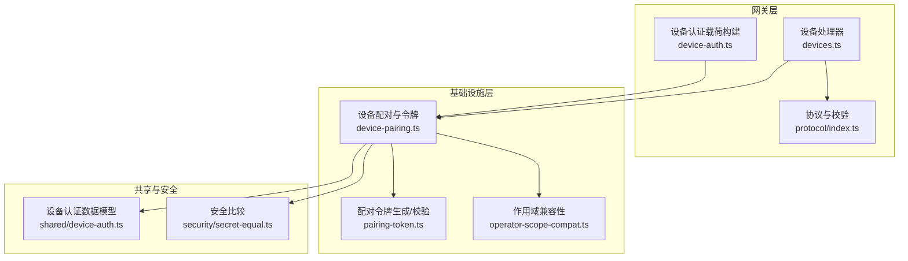

**图表来源**
- [src/gateway/server-methods/devices.ts](file://src/gateway/server-methods/devices.ts#L1-L216)
- [src/gateway/protocol/index.ts](file://src/gateway/protocol/index.ts#L1-L673)
- [src/infra/device-pairing.ts](file://src/infra/device-pairing.ts#L1-L654)
- [src/gateway/device-auth.ts](file://src/gateway/device-auth.ts#L1-L55)
- [src/infra/pairing-token.ts](file://src/infra/pairing-token.ts#L1-L13)
- [src/shared/device-auth.ts](file://src/shared/device-auth.ts#L1-L31)
- [src/security/secret-equal.ts](file://src/security/secret-equal.ts#L1-L13)
- [src/shared/operator-scope-compat.ts](file://src/shared/operator-scope-compat.ts#L1-L50)

**章节来源**
- [src/gateway/server-methods/devices.ts](file://src/gateway/server-methods/devices.ts#L1-L216)
- [src/infra/device-pairing.ts](file://src/infra/device-pairing.ts#L1-L654)
- [src/gateway/protocol/schema/devices.ts](file://src/gateway/protocol/schema/devices.ts#L1-L68)
- [src/gateway/protocol/index.ts](file://src/gateway/protocol/index.ts#L1-L673)

## 核心组件
- 设备处理器（deviceHandlers）：集中实现所有设备管理RPC端点，包含参数校验、业务逻辑调用、日志记录、事件广播与响应封装
- 设备配对与令牌服务：提供配对列表查询、批准/拒绝/移除、令牌轮换/吊销、令牌验证与持久化
- 协议与校验：基于TypeBox定义Schema并通过AJV编译为校验器，统一格式化错误信息
- 安全与作用域：令牌采用定时安全比较；作用域支持operator前缀的层级推导与兼容判断

**章节来源**
- [src/gateway/server-methods/devices.ts](file://src/gateway/server-methods/devices.ts#L34-L215)
- [src/infra/device-pairing.ts](file://src/infra/device-pairing.ts#L255-L640)
- [src/gateway/protocol/index.ts](file://src/gateway/protocol/index.ts#L377-L458)
- [src/shared/operator-scope-compat.ts](file://src/shared/operator-scope-compat.ts#L1-L50)

## 架构总览
下图展示设备管理端点在网关中的整体交互路径：客户端发起RPC请求，经协议校验后由处理器调用基础设施方法，必要时写入状态文件并广播事件。

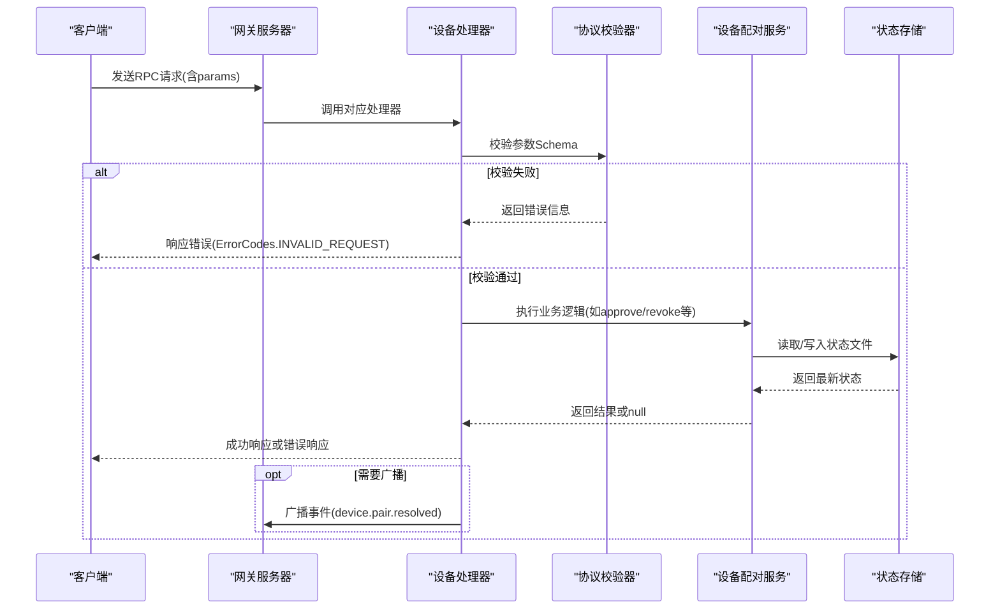

**图表来源**
- [src/gateway/server-methods/devices.ts](file://src/gateway/server-methods/devices.ts#L34-L215)
- [src/gateway/protocol/index.ts](file://src/gateway/protocol/index.ts#L377-L458)
- [src/infra/device-pairing.ts](file://src/infra/device-pairing.ts#L83-L103)

## 详细组件分析

### 设备配对端点

#### device.pair.list
- 功能：列出待审批的配对请求与已配对设备摘要
- 参数：无
- 处理流程：
  - 校验参数Schema（空对象）
  - 调用基础设施方法加载状态并排序
  - 对已配对设备进行脱敏（仅返回令牌摘要）
- 响应：包含pending与paired数组

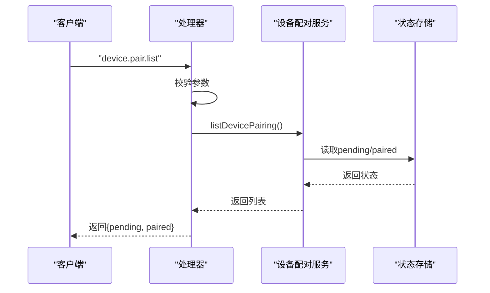

**图表来源**
- [src/gateway/server-methods/devices.ts](file://src/gateway/server-methods/devices.ts#L35-L57)
- [src/infra/device-pairing.ts](file://src/infra/device-pairing.ts#L255-L262)

**章节来源**
- [src/gateway/server-methods/devices.ts](file://src/gateway/server-methods/devices.ts#L35-L57)
- [src/gateway/protocol/schema/devices.ts](file://src/gateway/protocol/schema/devices.ts#L4-L4)
- [src/infra/device-pairing.ts](file://src/infra/device-pairing.ts#L255-L262)

#### device.pair.approve
- 功能：批准待审批的设备配对请求，生成/更新设备令牌
- 参数：requestId（非空字符串）
- 处理流程：
  - 校验requestId
  - 调用approveDevicePairing，合并角色与作用域，生成新令牌
  - 记录日志并广播device.pair.resolved事件（决策为approved）
  - 返回批准后的设备信息（令牌摘要已汇总）

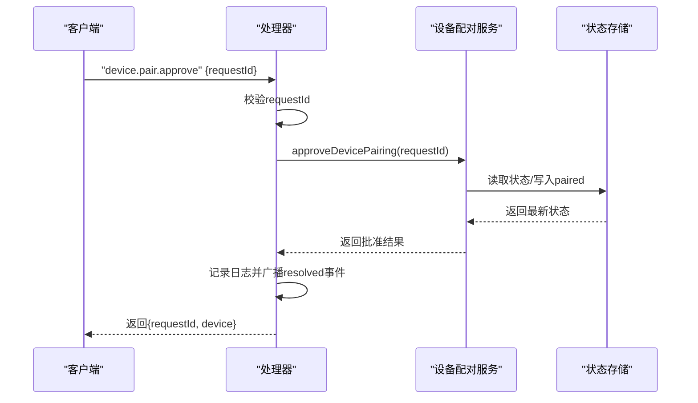

**图表来源**
- [src/gateway/server-methods/devices.ts](file://src/gateway/server-methods/devices.ts#L59-L92)
- [src/infra/device-pairing.ts](file://src/infra/device-pairing.ts#L320-L383)

**章节来源**
- [src/gateway/server-methods/devices.ts](file://src/gateway/server-methods/devices.ts#L59-L92)
- [src/gateway/protocol/schema/devices.ts](file://src/gateway/protocol/schema/devices.ts#L6-L9)
- [src/infra/device-pairing.ts](file://src/infra/device-pairing.ts#L320-L383)

#### device.pair.reject
- 功能：拒绝待审批的设备配对请求
- 参数：requestId（非空字符串）
- 处理流程：
  - 校验requestId
  - 调用rejectDevicePairing，从待审批中移除
  - 广播device.pair.resolved事件（决策为rejected）

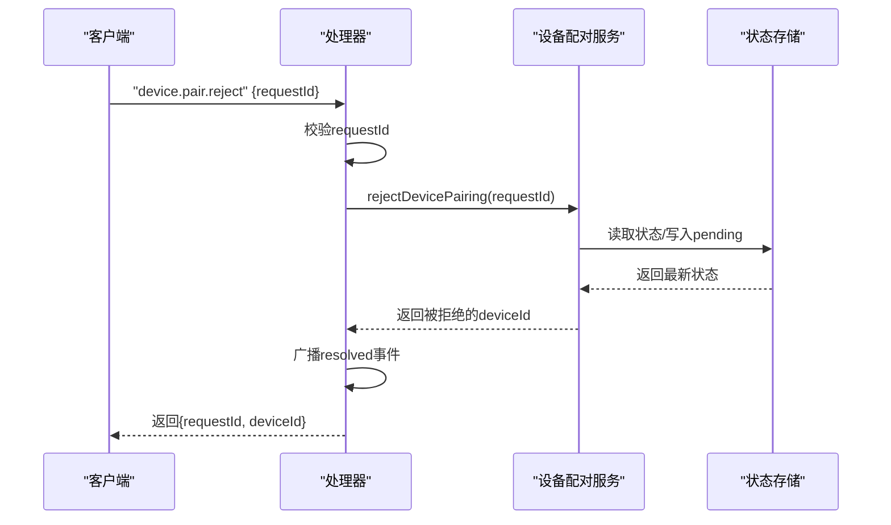

**图表来源**
- [src/gateway/server-methods/devices.ts](file://src/gateway/server-methods/devices.ts#L94-L124)
- [src/infra/device-pairing.ts](file://src/infra/device-pairing.ts#L386-L403)

**章节来源**
- [src/gateway/server-methods/devices.ts](file://src/gateway/server-methods/devices.ts#L94-L124)
- [src/gateway/protocol/schema/devices.ts](file://src/gateway/protocol/schema/devices.ts#L11-L14)
- [src/infra/device-pairing.ts](file://src/infra/device-pairing.ts#L386-L403)

#### device.pair.remove
- 功能：移除已配对设备（解除绑定）
- 参数：deviceId（非空字符串）
- 处理流程：
  - 校验deviceId
  - 调用removePairedDevice，删除paired条目
  - 记录日志并返回成功

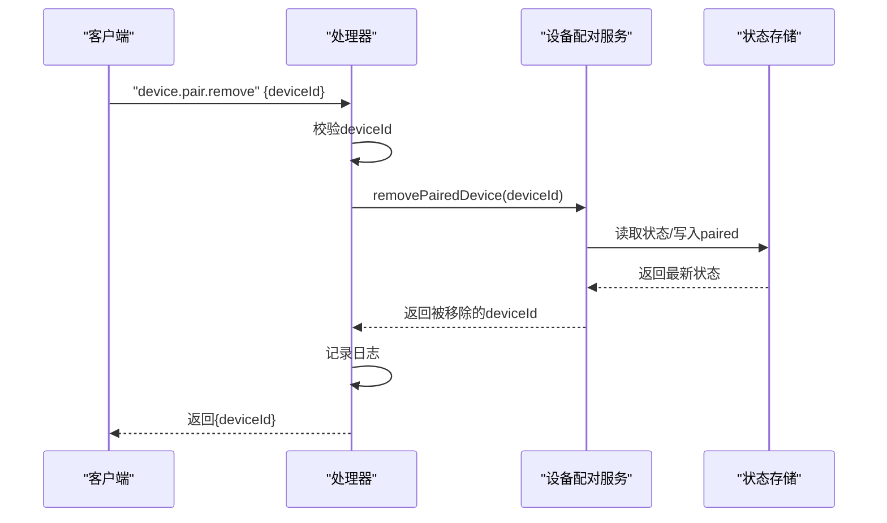

**图表来源**
- [src/gateway/server-methods/devices.ts](file://src/gateway/server-methods/devices.ts#L126-L147)
- [src/infra/device-pairing.ts](file://src/infra/device-pairing.ts#L405-L419)

**章节来源**
- [src/gateway/server-methods/devices.ts](file://src/gateway/server-methods/devices.ts#L126-L147)
- [src/gateway/protocol/schema/devices.ts](file://src/gateway/protocol/schema/devices.ts#L16-L19)
- [src/infra/device-pairing.ts](file://src/infra/device-pairing.ts#L405-L419)

### 设备令牌端点

#### device.token.rotate
- 功能：轮换指定设备的指定角色令牌，可选更新作用域
- 参数：deviceId、role、scopes（可选）
- 处理流程：
  - 校验参数Schema
  - 调用rotateDeviceToken，计算请求作用域与批准作用域的关系，生成新令牌
  - 记录日志并返回新令牌及元信息

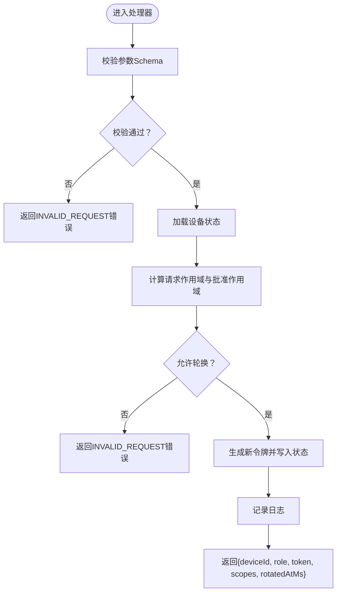

**图表来源**
- [src/gateway/server-methods/devices.ts](file://src/gateway/server-methods/devices.ts#L149-L186)
- [src/infra/device-pairing.ts](file://src/infra/device-pairing.ts#L572-L612)

**章节来源**
- [src/gateway/server-methods/devices.ts](file://src/gateway/server-methods/devices.ts#L149-L186)
- [src/gateway/protocol/schema/devices.ts](file://src/gateway/protocol/schema/devices.ts#L21-L28)
- [src/infra/device-pairing.ts](file://src/infra/device-pairing.ts#L572-L612)

#### device.token.revoke
- 功能：吊销指定设备的指定角色令牌
- 参数：deviceId、role
- 处理流程：
  - 校验参数Schema
  - 调用revokeDeviceToken，设置revokedAtMs
  - 记录日志并返回吊销时间

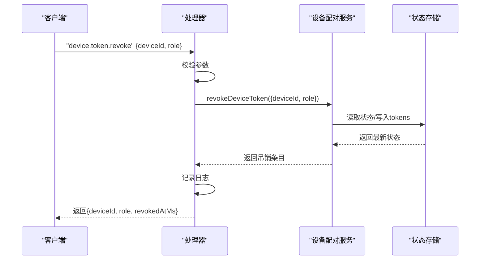

**图表来源**
- [src/gateway/server-methods/devices.ts](file://src/gateway/server-methods/devices.ts#L188-L214)
- [src/infra/device-pairing.ts](file://src/infra/device-pairing.ts#L614-L640)

**章节来源**
- [src/gateway/server-methods/devices.ts](file://src/gateway/server-methods/devices.ts#L188-L214)
- [src/gateway/protocol/schema/devices.ts](file://src/gateway/protocol/schema/devices.ts#L30-L36)
- [src/infra/device-pairing.ts](file://src/infra/device-pairing.ts#L614-L640)

### 设备认证与安全验证

#### 设备认证载荷构建
- 支持v2与v3版本载荷，包含设备标识、客户端信息、角色、作用域、签名时间、可选令牌与nonce
- v3版本额外标准化平台与设备系列字段

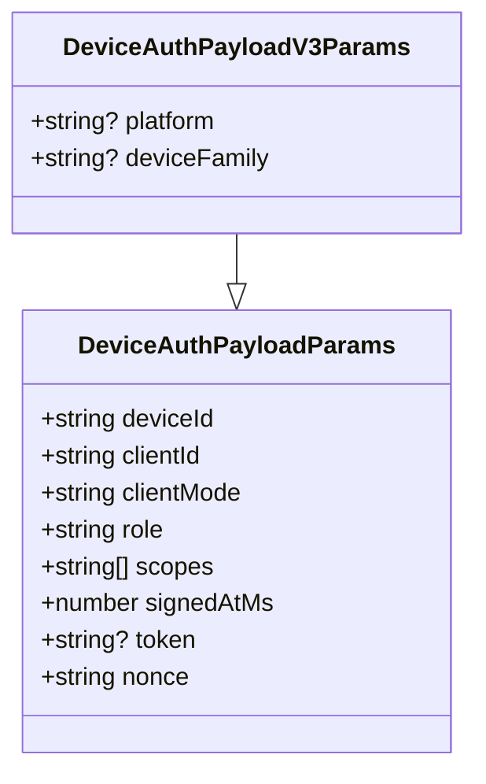

**图表来源**
- [src/gateway/device-auth.ts](file://src/gateway/device-auth.ts#L4-L18)

**章节来源**
- [src/gateway/device-auth.ts](file://src/gateway/device-auth.ts#L20-L54)

#### 令牌生成与验证
- 令牌长度固定，使用安全随机源生成
- 使用定时安全比较函数避免时序攻击

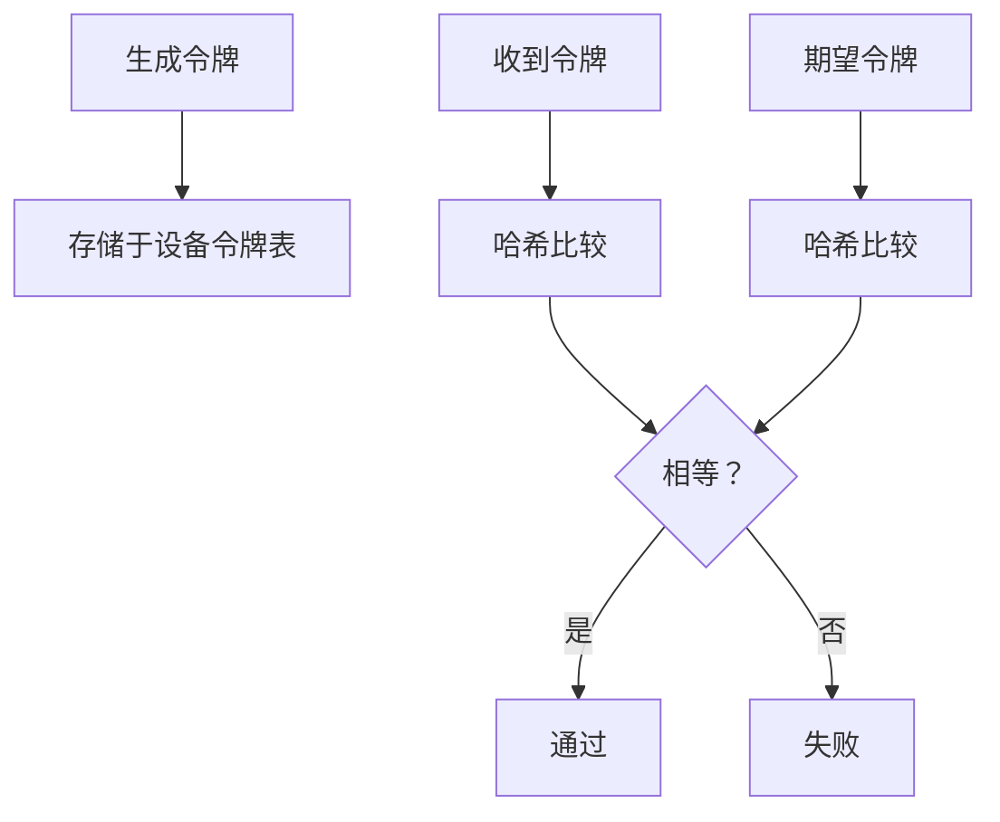

**图表来源**
- [src/infra/pairing-token.ts](file://src/infra/pairing-token.ts#L6-L12)
- [src/security/secret-equal.ts](file://src/security/secret-equal.ts#L3-L12)

**章节来源**
- [src/infra/pairing-token.ts](file://src/infra/pairing-token.ts#L1-L13)
- [src/security/secret-equal.ts](file://src/security/secret-equal.ts#L1-L13)

#### 权限控制与作用域
- 角色为operator时，支持operator.admin对其他operator.*作用域的推导授权
- 请求作用域必须完全包含于授予作用域集合

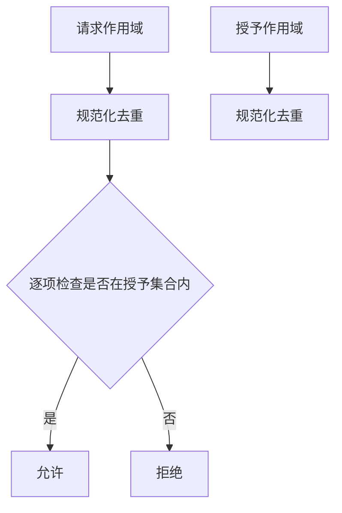

**图表来源**
- [src/shared/operator-scope-compat.ts](file://src/shared/operator-scope-compat.ts#L31-L49)

**章节来源**
- [src/shared/operator-scope-compat.ts](file://src/shared/operator-scope-compat.ts#L1-L50)

## 依赖关系分析

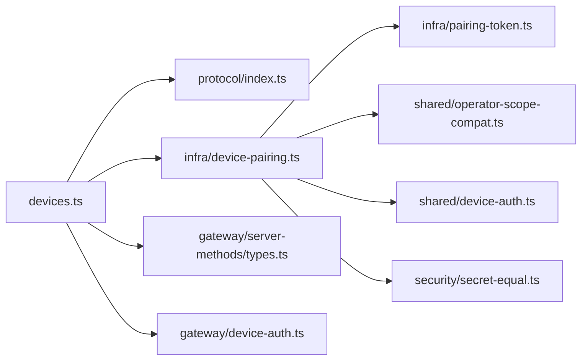

**图表来源**
- [src/gateway/server-methods/devices.ts](file://src/gateway/server-methods/devices.ts#L1-L22)
- [src/gateway/protocol/index.ts](file://src/gateway/protocol/index.ts#L1-L251)
- [src/infra/device-pairing.ts](file://src/infra/device-pairing.ts#L1-L12)
- [src/infra/pairing-token.ts](file://src/infra/pairing-token.ts#L1-L13)
- [src/shared/operator-scope-compat.ts](file://src/shared/operator-scope-compat.ts#L1-L50)
- [src/shared/device-auth.ts](file://src/shared/device-auth.ts#L1-L31)
- [src/security/secret-equal.ts](file://src/security/secret-equal.ts#L1-L13)
- [src/gateway/server-methods/types.ts](file://src/gateway/server-methods/types.ts#L1-L113)
- [src/gateway/device-auth.ts](file://src/gateway/device-auth.ts#L1-L55)

**章节来源**
- [src/gateway/server-methods/devices.ts](file://src/gateway/server-methods/devices.ts#L1-L22)
- [src/infra/device-pairing.ts](file://src/infra/device-pairing.ts#L1-L12)

## 性能考虑
- 并发安全：所有状态变更均通过异步锁包裹，避免竞态条件
- I/O优化：批量读写pending与paired两个JSON文件，减少磁盘访问次数
- TTL清理：待审批请求具备TTL，定期清理过期条目
- 序列化：返回给客户端的数据仅包含必要字段，令牌摘要按角色排序输出

[本节为通用性能建议，不直接分析具体文件]

## 故障排除指南
- 参数校验失败
  - 现象：返回INVALID_REQUEST错误，包含格式化的校验错误列表
  - 排查：确认请求体字段类型与Schema一致，避免多余字段
  - 参考：协议校验器与错误格式化函数
- 设备未配对或角色缺失
  - 现象：令牌验证失败，原因包含device-not-paired、role-missing、token-missing、token-revoked、token-mismatch、scope-mismatch
  - 排查：确认设备已批准配对、角色存在且未被吊销、作用域匹配
- 操作无效
  - 现象：未知requestId或unknown deviceId/role
  - 排查：核对ID是否正确、是否已完成批准或移除

**章节来源**
- [src/gateway/protocol/index.ts](file://src/gateway/protocol/index.ts#L424-L458)
- [src/infra/device-pairing.ts](file://src/infra/device-pairing.ts#L470-L508)

## 结论
本文档系统梳理了OpenClaw网关的设备管理端点，明确了各接口的职责边界、参数约束、安全策略与错误处理方式。通过协议Schema与AJV校验确保输入一致性，借助作用域兼容性与定时安全比较保障权限控制与令牌安全，配合事件广播与日志记录完善可观测性。实际部署中建议结合监控告警与审计日志，持续评估性能与安全性。