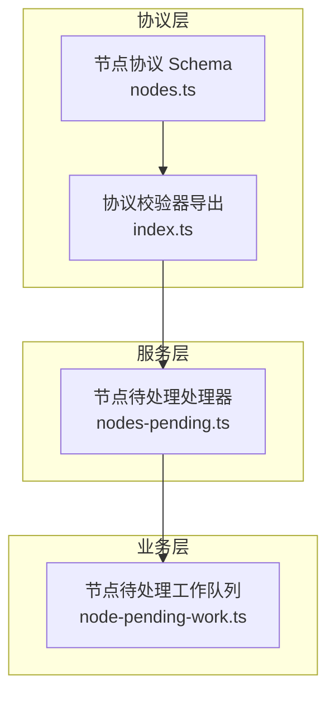
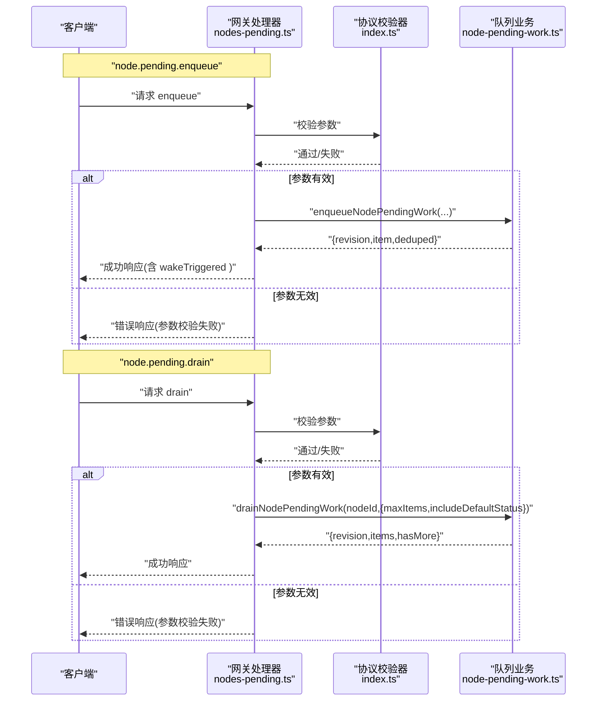
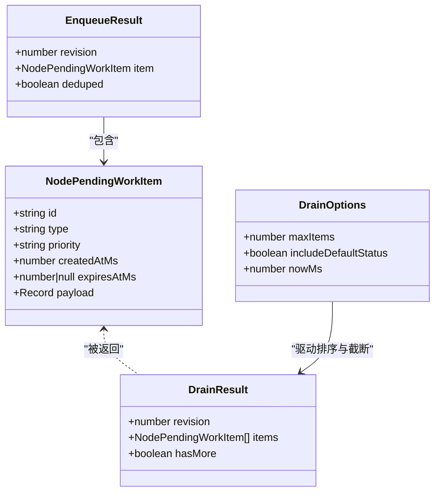
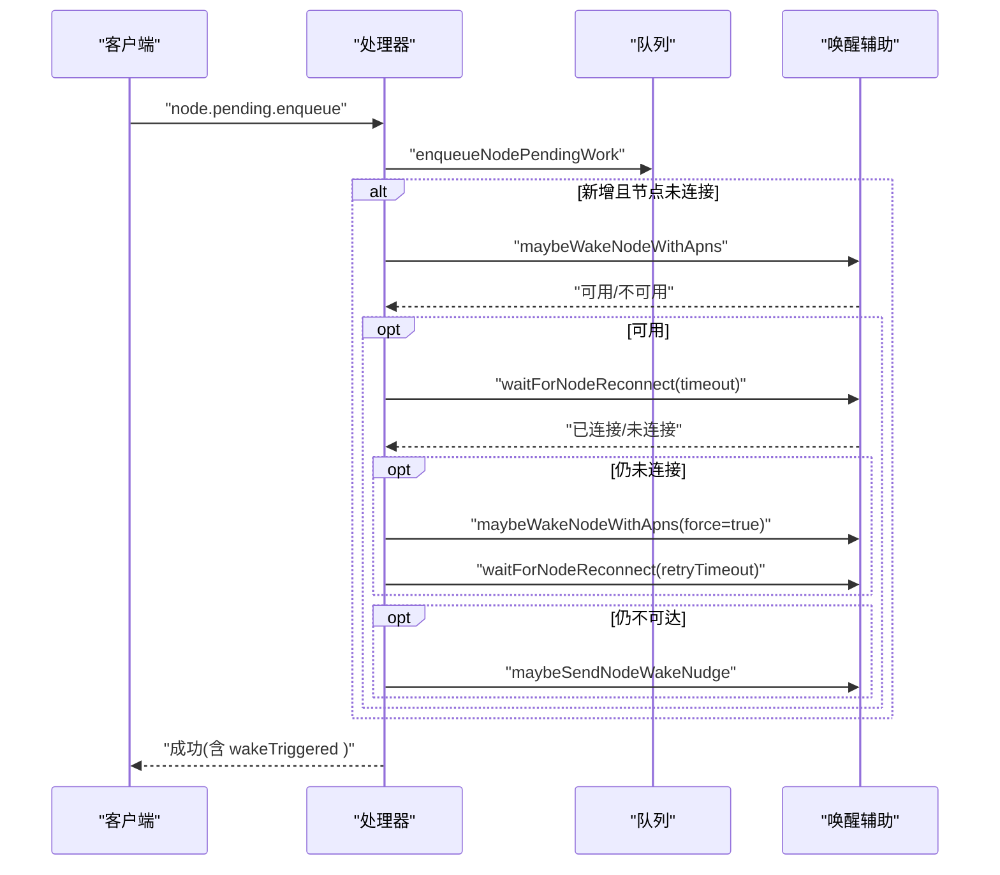
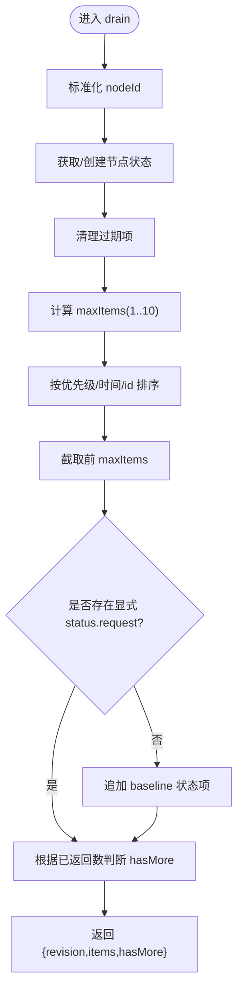
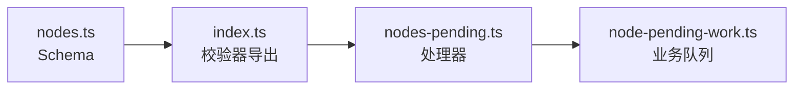

# 待处理工作接口

<cite>
**本文档引用的文件**
- [src/gateway/node-pending-work.ts](file://src/gateway/node-pending-work.ts)
- [src/gateway/server-methods/nodes-pending.ts](file://src/gateway/server-methods/nodes-pending.ts)
- [src/gateway/protocol/schema/nodes.ts](file://src/gateway/protocol/schema/nodes.ts)
- [src/gateway/protocol/index.ts](file://src/gateway/protocol/index.ts)
- [src/gateway/server-methods/nodes-pending.test.ts](file://src/gateway/server-methods/nodes-pending.test.ts)
- [src/gateway/node-pending-work.test.ts](file://src/gateway/node-pending-work.test.ts)
</cite>

## 目录
1. [简介](#简介)
2. [项目结构](#项目结构)
3. [核心组件](#核心组件)
4. [架构总览](#架构总览)
5. [详细组件分析](#详细组件分析)
6. [依赖关系分析](#依赖关系分析)
7. [性能考量](#性能考量)
8. [故障排查指南](#故障排查指南)
9. [结论](#结论)
10. [附录](#附录)

## 简介
本文件面向 OpenClaw 待处理工作队列系统，聚焦 node.pending.* 系列端点的 API 文档与实现解析，涵盖工作项创建、状态跟踪、进度报告、结果获取、优先级调度、超时与重试机制、生命周期管理、并发控制与错误恢复，并提供监控与调试建议。该系统以轻量内存队列为核心，支持按节点隔离的工作项集合，提供“拉取-确认”模式的工作交付与回收。

## 项目结构
node.pending.* 接口由三层组成：
- 协议层：定义请求参数、响应结构与校验器（TypeBox Schema + AJV 校验）
- 服务层：将协议与业务逻辑对接，负责设备身份解析、唤醒辅助与连接等待
- 业务层：在内存中维护每个节点的工作项队列，提供入队、拉取、确认等操作

图表来源
- [src/gateway/protocol/schema/nodes.ts](file://src/gateway/protocol/schema/nodes.ts#L106-L144)
- [src/gateway/protocol/index.ts](file://src/gateway/protocol/index.ts#L307-L312)
- [src/gateway/server-methods/nodes-pending.ts](file://src/gateway/server-methods/nodes-pending.ts#L31-L158)
- [src/gateway/node-pending-work.ts](file://src/gateway/node-pending-work.ts#L97-L185)

章节来源
- [src/gateway/protocol/schema/nodes.ts](file://src/gateway/protocol/schema/nodes.ts#L106-L144)
- [src/gateway/protocol/index.ts](file://src/gateway/protocol/index.ts#L307-L312)
- [src/gateway/server-methods/nodes-pending.ts](file://src/gateway/server-methods/nodes-pending.ts#L31-L158)
- [src/gateway/node-pending-work.ts](file://src/gateway/node-pending-work.ts#L97-L185)

## 核心组件
- 工作类型与优先级
  - 类型：status.request、location.request
  - 优先级：default、normal、high（高优仅在入队时允许）
- 数据模型
  - 工作项：包含 id、type、priority、createdAtMs、expiresAtMs、payload
  - 拉取结果：包含 nodeId、revision、items、hasMore
  - 入队结果：包含 nodeId、revision、queued、wakeTriggered
- 关键函数
  - 入队：enqueueNodePendingWork
  - 拉取：drainNodePendingWork
  - 确认：acknowledgeNodePendingWork
  - 测试辅助：resetNodePendingWorkForTests、getNodePendingWorkStateCountForTests

章节来源
- [src/gateway/node-pending-work.ts](file://src/gateway/node-pending-work.ts#L3-L16)
- [src/gateway/node-pending-work.ts](file://src/gateway/node-pending-work.ts#L97-L185)
- [src/gateway/protocol/schema/nodes.ts](file://src/gateway/protocol/schema/nodes.ts#L4-L10)
- [src/gateway/protocol/schema/nodes.ts](file://src/gateway/protocol/schema/nodes.ts#L113-L133)
- [src/gateway/protocol/schema/nodes.ts](file://src/gateway/protocol/schema/nodes.ts#L135-L154)

## 架构总览
node.pending.* 的调用链路如下：

图表来源
- [src/gateway/server-methods/nodes-pending.ts](file://src/gateway/server-methods/nodes-pending.ts#L31-L158)
- [src/gateway/protocol/index.ts](file://src/gateway/protocol/index.ts#L307-L312)
- [src/gateway/node-pending-work.ts](file://src/gateway/node-pending-work.ts#L97-L157)

## 详细组件分析

### 1) 工作项生命周期与数据模型
- 生命周期阶段
  - 创建：enqueueNodePendingWork
  - 拉取：drainNodePendingWork（可带 maxItems 限制）
  - 确认：acknowledgeNodePendingWork（移除已处理项）
  - 过期清理：自动清理过期项（expiresAtMs）
- 数据模型
  - 工作项字段：id、type、priority、createdAtMs、expiresAtMs、payload
  - 拉取返回：items 数组、hasMore 标记、revision 版本号
  - 入队返回：queued 工作项、wakeTriggered 标识（当触发唤醒流程）

图表来源
- [src/gateway/node-pending-work.ts](file://src/gateway/node-pending-work.ts#L9-L16)
- [src/gateway/node-pending-work.ts](file://src/gateway/node-pending-work.ts#L23-L33)
- [src/gateway/node-pending-work.ts](file://src/gateway/node-pending-work.ts#L131-L157)
- [src/gateway/node-pending-work.ts](file://src/gateway/node-pending-work.ts#L97-L129)

章节来源
- [src/gateway/node-pending-work.ts](file://src/gateway/node-pending-work.ts#L9-L16)
- [src/gateway/node-pending-work.ts](file://src/gateway/node-pending-work.ts#L23-L33)
- [src/gateway/node-pending-work.ts](file://src/gateway/node-pending-work.ts#L131-L157)
- [src/gateway/node-pending-work.ts](file://src/gateway/node-pending-work.ts#L97-L129)

### 2) node.pending.enqueue：工作项创建与唤醒流程
- 功能要点
  - 参数校验：nodeId、type、priority、expiresInMs、wake
  - 去重策略：同类型在同一节点仅保留一个实例
  - 过期时间：可选，最小 1 秒，最大 86400 秒
  - 唤醒辅助：当新入队且节点未连接时，尝试 APNS 唤醒与重连等待；若仍不可达则发送唤醒提示
- 返回值：包含 revision、queued 工作项与 wakeTriggered 标识

图表来源
- [src/gateway/server-methods/nodes-pending.ts](file://src/gateway/server-methods/nodes-pending.ts#L60-L158)

章节来源
- [src/gateway/server-methods/nodes-pending.ts](file://src/gateway/server-methods/nodes-pending.ts#L60-L158)
- [src/gateway/protocol/schema/nodes.ts](file://src/gateway/protocol/schema/nodes.ts#L135-L144)

### 3) node.pending.drain：状态跟踪与进度报告
- 功能要点
  - 参数校验：maxItems（1~10）
  - 拉取策略：按优先级降序、创建时间升序、id 字典序排序
  - 默认状态：若无显式 status.request，则补充一条 baseline 状态项
  - 分页标记：hasMore 表示是否还有剩余项
- 返回值：包含 nodeId、revision、items、hasMore

图表来源
- [src/gateway/node-pending-work.ts](file://src/gateway/node-pending-work.ts#L131-L157)

章节来源
- [src/gateway/node-pending-work.ts](file://src/gateway/node-pending-work.ts#L131-L157)
- [src/gateway/protocol/schema/nodes.ts](file://src/gateway/protocol/schema/nodes.ts#L106-L111)
- [src/gateway/protocol/schema/nodes.ts](file://src/gateway/protocol/schema/nodes.ts#L125-L133)

### 4) node.pending.ack：结果获取与回收
- 功能要点
  - 参数校验：ids 至少 1 个
  - 回收策略：移除指定 id（忽略默认状态项）
  - 版本更新：删除发生时递增 revision
- 返回值：包含 revision 与 removedItemIds

章节来源
- [src/gateway/node-pending-work.ts](file://src/gateway/node-pending-work.ts#L159-L185)
- [src/gateway/protocol/schema/nodes.ts](file://src/gateway/protocol/schema/nodes.ts#L54-L59)

### 5) 优先级调度与并发控制
- 优先级规则
  - 高优先级项优先于普通项，普通优先于默认
  - 同优先级按创建时间早到晚
  - 时间相同时按 id 字典序
- 并发与去重
  - 同类型在同一节点去重，避免重复投递
  - 拉取时受 maxItems 限制，默认 4，上限 10
- 超时与重试
  - 唤醒后等待重连，分两阶段等待时长
  - 若仍不可达，发送唤醒提示

章节来源
- [src/gateway/node-pending-work.ts](file://src/gateway/node-pending-work.ts#L40-L44)
- [src/gateway/node-pending-work.ts](file://src/gateway/node-pending-work.ts#L74-L85)
- [src/gateway/node-pending-work.ts](file://src/gateway/node-pending-work.ts#L142-L143)
- [src/gateway/server-methods/nodes-pending.ts](file://src/gateway/server-methods/nodes-pending.ts#L84-L146)

### 6) 错误恢复机制
- 参数校验失败：立即返回 INVALID_PARAMS
- 设备身份缺失：返回 INVALID_REQUEST（需要已连接设备身份）
- 唤醒失败或未连接：记录日志并继续流程，最终返回结果
- 过期项自动清理：减少堆积与资源占用

章节来源
- [src/gateway/server-methods/nodes-pending.ts](file://src/gateway/server-methods/nodes-pending.ts#L33-L51)
- [src/gateway/protocol/index.ts](file://src/gateway/protocol/index.ts#L424-L458)
- [src/gateway/node-pending-work.ts](file://src/gateway/node-pending-work.ts#L60-L72)

## 依赖关系分析
- 协议与校验
  - nodes.ts 定义 Schema，index.ts 导出 validateNodePending* 校验器
- 处理器与业务
  - nodes-pending.ts 依赖 node-pending-work.ts 的核心方法
  - 处理器还依赖唤醒辅助与连接等待工具（在测试中被模拟）
- 类型与约束
  - NodePendingWorkPrioritySchema 限制为 normal、high（入队时），而拉取返回包含 default、normal、high

图表来源
- [src/gateway/protocol/schema/nodes.ts](file://src/gateway/protocol/schema/nodes.ts#L106-L144)
- [src/gateway/protocol/index.ts](file://src/gateway/protocol/index.ts#L307-L312)
- [src/gateway/server-methods/nodes-pending.ts](file://src/gateway/server-methods/nodes-pending.ts#L1-L21)
- [src/gateway/node-pending-work.ts](file://src/gateway/node-pending-work.ts#L1-L21)

章节来源
- [src/gateway/protocol/schema/nodes.ts](file://src/gateway/protocol/schema/nodes.ts#L106-L144)
- [src/gateway/protocol/index.ts](file://src/gateway/protocol/index.ts#L307-L312)
- [src/gateway/server-methods/nodes-pending.ts](file://src/gateway/server-methods/nodes-pending.ts#L1-L21)
- [src/gateway/node-pending-work.ts](file://src/gateway/node-pending-work.ts#L1-L21)

## 性能考量
- 内存队列：单机内存 Map 存储，适合小规模节点与短期任务
- 排序复杂度：每次拉取对当前队列项进行排序，O(n log n)，n 为队列长度
- 去重与过期清理：入队时 O(n) 查找现有类型，清理过期项 O(n)
- 并发建议：多节点场景下建议按节点分区或引入持久化队列，避免内存膨胀
- 调优参数：合理设置 maxItems、expiresInMs，平衡吞吐与延迟

## 故障排查指南
- 常见问题
  - 参数校验失败：检查 nodeId、type、priority、expiresInMs 是否符合 Schema
  - 未连接设备身份：确保客户端已建立连接并携带设备 id
  - 唤醒无响应：查看日志中的唤醒阶段与重试信息，确认网络与推送配置
- 调试步骤
  - 使用 drain 获取当前队列快照，观察 items 与 hasMore
  - 使用 ack 确认已处理项，观察 removedItemIds 与 revision 变化
  - 在测试中使用 resetNodePendingWorkForTests 清理状态，复现问题
- 监控指标建议
  - 入队速率、拉取速率、确认速率
  - 唤醒成功率、重连等待时长、队列长度
  - 过期项比例、去重命中率

章节来源
- [src/gateway/server-methods/nodes-pending.test.ts](file://src/gateway/server-methods/nodes-pending.test.ts#L1-L55)
- [src/gateway/node-pending-work.test.ts](file://src/gateway/node-pending-work.test.ts#L1-L42)
- [src/gateway/server-methods/nodes-pending.ts](file://src/gateway/server-methods/nodes-pending.ts#L84-L146)

## 结论
node.pending.* 接口以简洁的内存队列实现，提供了可靠的节点工作项管理能力：支持优先级调度、去重、默认状态补充、分页拉取与确认回收，并内置唤醒辅助与重连等待机制。对于高并发与持久化需求，建议结合外部存储与分布式队列扩展。

## 附录

### A. API 规范摘要
- node.pending.enqueue
  - 请求参数：nodeId、type、priority（可选）、expiresInMs（可选）、wake（可选）
  - 响应字段：nodeId、revision、queued、wakeTriggered
- node.pending.drain
  - 请求参数：maxItems（可选，1~10）
  - 响应字段：nodeId、revision、items、hasMore
- node.pending.ack
  - 请求参数：ids（至少 1）
  - 响应字段：nodeId、revision、removedItemIds

章节来源
- [src/gateway/protocol/schema/nodes.ts](file://src/gateway/protocol/schema/nodes.ts#L106-L154)
- [src/gateway/server-methods/nodes-pending.ts](file://src/gateway/server-methods/nodes-pending.ts#L31-L158)