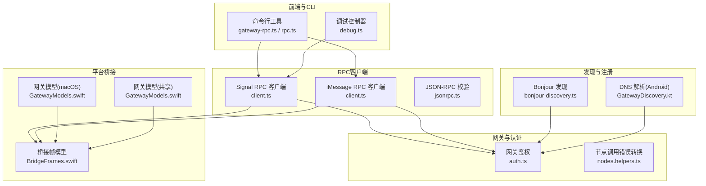
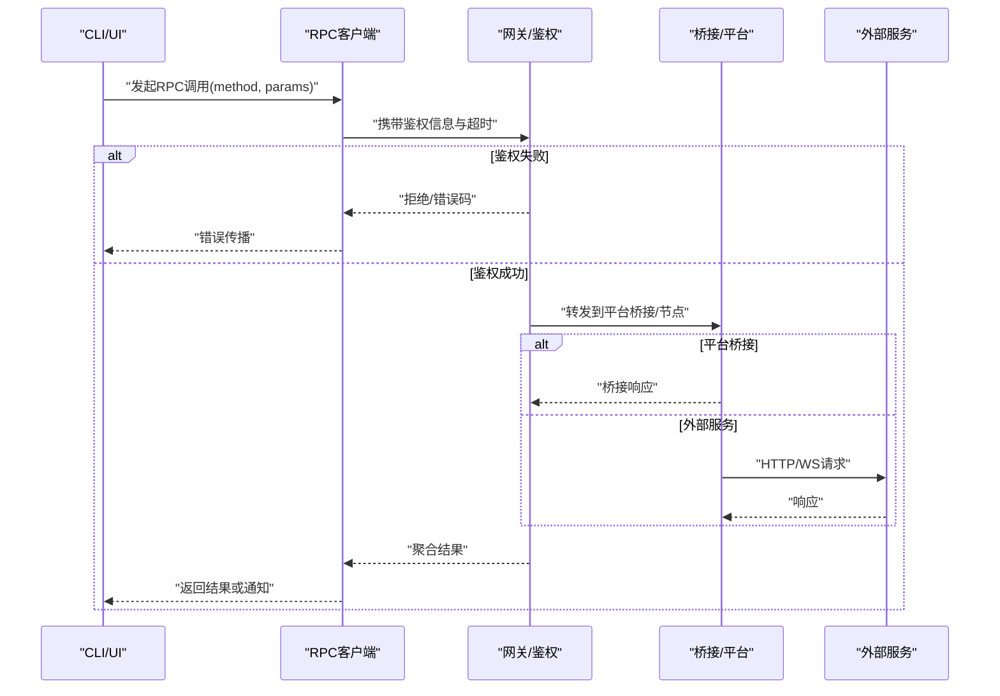
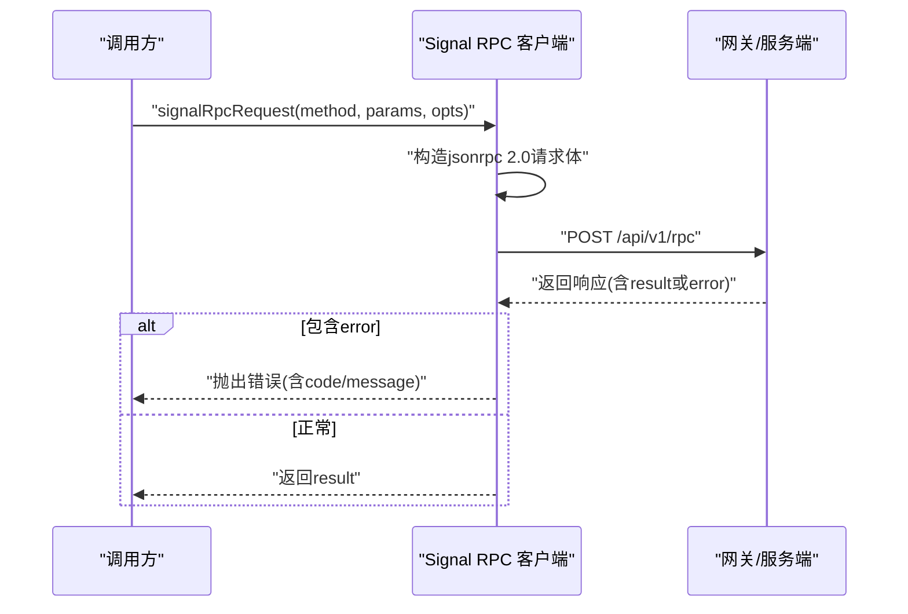
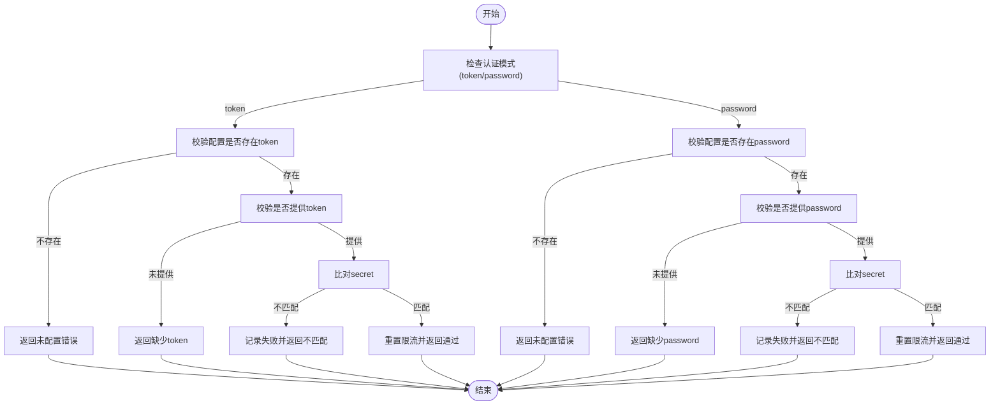
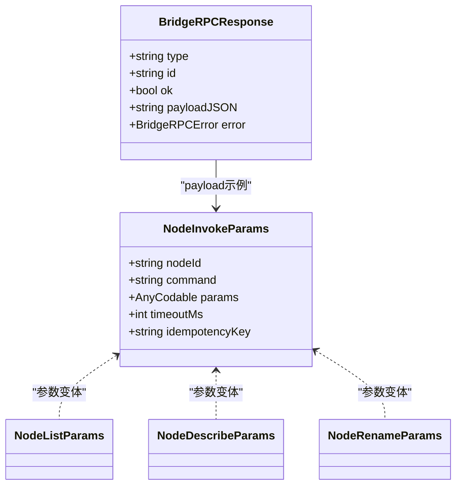
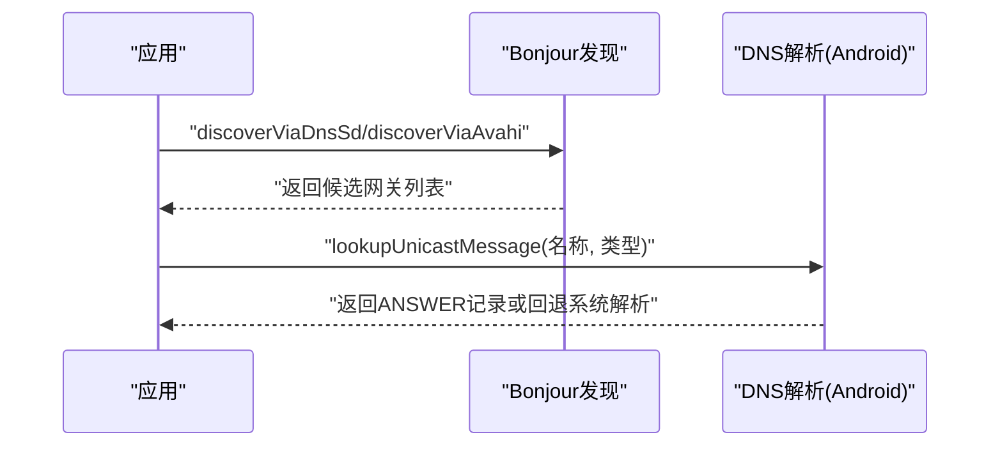
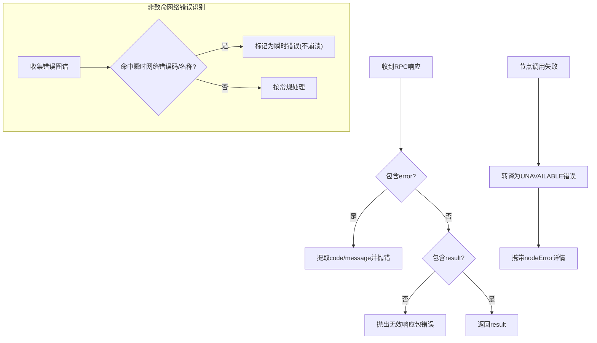
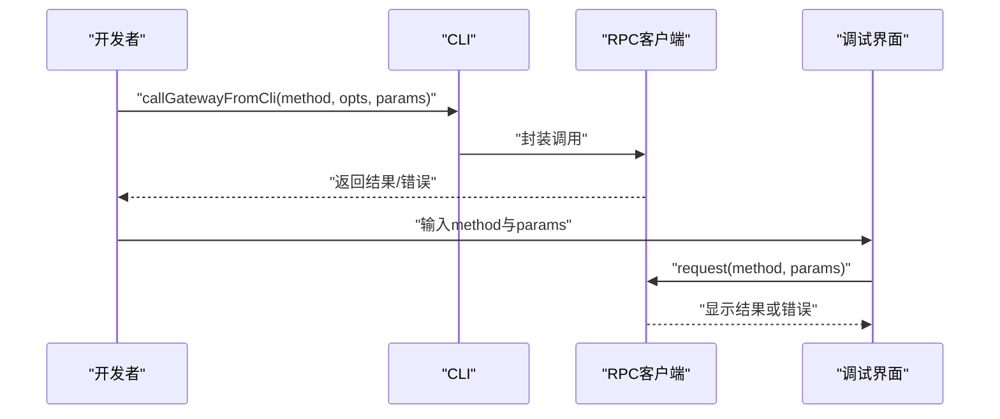
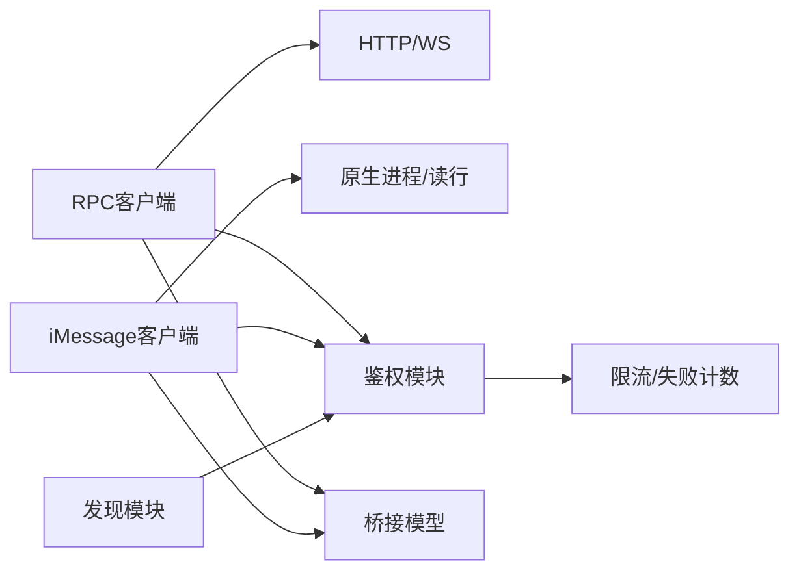

# RPC适配器

<cite>
**本文引用的文件**
- [BridgeFrames.swift](file://apps/shared/OpenClawKit/Sources/OpenClawKit/BridgeFrames.swift)
- [GatewayModels.swift（macOS）](file://apps/macos/Sources/OpenClawProtocol/GatewayModels.swift)
- [GatewayModels.swift（共享）](file://apps/shared/OpenClawKit/Sources/OpenClawKit/GatewayModels.swift)
- [jsonrpc.ts](file://extensions/acpx/src/runtime-internals/jsonrpc.ts)
- [rpc-context.ts](file://src/signal/rpc-context.ts)
- [client.ts（Signal）](file://src/signal/client.ts)
- [client.ts（iMessage）](file://src/imessage/client.ts)
- [gateway-rpc.ts](file://src/cli/gateway-rpc.ts)
- [rpc.ts（节点CLI）](file://src/cli/nodes-cli/rpc.ts)
- [auth.ts](file://src/gateway/auth.ts)
- [nodes.helpers.ts](file://src/gateway/server-methods/nodes.helpers.ts)
- [unhandled-rejections.ts](file://src/infra/unhandled-rejections.ts)
- [GatewayDiscovery.kt](file://apps/android/app/src/main/java/ai/openclaw/app/gateway/GatewayDiscovery.kt)
- [bonjour-discovery.ts](file://src/infra/bonjour-discovery.ts)
- [debug.ts（UI控制器）](file://ui/src/ui/controllers/debug.ts)
- [android-node.capabilities.live.test.ts](file://src/gateway/android-node.capabilities.live.test.ts)
- [targets.test.ts](file://src/imessage/targets.test.ts)
</cite>

## 目录
1. [引言](#引言)
2. [项目结构](#项目结构)
3. [核心组件](#核心组件)
4. [架构总览](#架构总览)
5. [组件详解](#组件详解)
6. [依赖关系分析](#依赖关系分析)
7. [性能与监控](#性能与监控)
8. [故障排查指南](#故障排查指南)
9. [结论](#结论)
10. [附录：RPC方法清单与规范](#附录rpc方法清单与规范)

## 引言
本文件面向OpenClaw RPC适配器系统，系统性阐述RPC调用的实现机制、扩展方式、可用方法、参数与返回规范、权限控制与安全验证、适配器注册与发现、错误处理与异常传播、性能监控与日志记录、自定义适配器开发指南以及测试与调试方法。目标是帮助开发者在多平台（Web、iOS、Android、macOS）与多通道（WebSocket、HTTP、原生桥接）下，稳定、安全、可扩展地使用与扩展RPC能力。

## 项目结构
OpenClaw的RPC体系横跨前端、后端与多平台桥接层：
- 前端与CLI：通过统一的RPC客户端封装调用后端网关或平台服务。
- 网关与认证：负责接入鉴权、请求路由与错误转换。
- 平台桥接：在iOS/macOS/Android等平台通过原生桥接或本地服务暴露RPC接口。
- 发现与注册：通过DNS-SD/Tailscale/本地解析等方式进行网关发现与注册。

图表来源
- [gateway-rpc.ts](file://src/cli/gateway-rpc.ts#L1-L48)
- [rpc.ts（节点CLI）](file://src/cli/nodes-cli/rpc.ts#L1-L97)
- [client.ts（Signal）](file://src/signal/client.ts#L70-L107)
- [client.ts（iMessage）](file://src/imessage/client.ts#L1-L46)
- [jsonrpc.ts](file://extensions/acpx/src/runtime-internals/jsonrpc.ts#L1-L48)
- [auth.ts](file://src/gateway/auth.ts#L448-L485)
- [nodes.helpers.ts](file://src/gateway/server-methods/nodes.helpers.ts#L55-L80)
- [BridgeFrames.swift](file://apps/shared/OpenClawKit/Sources/OpenClawKit/BridgeFrames.swift#L241-L261)
- [GatewayModels.swift（macOS）](file://apps/macos/Sources/OpenClawProtocol/GatewayModels.swift#L813-L872)
- [GatewayModels.swift（共享）](file://apps/shared/OpenClawKit/Sources/OpenClawKit/GatewayModels.swift#L813-L872)
- [bonjour-discovery.ts](file://src/infra/bonjour-discovery.ts#L559-L590)
- [GatewayDiscovery.kt](file://apps/android/app/src/main/java/ai/openclaw/app/gateway/GatewayDiscovery.kt#L281-L334)

章节来源
- [gateway-rpc.ts](file://src/cli/gateway-rpc.ts#L1-L48)
- [rpc.ts（节点CLI）](file://src/cli/nodes-cli/rpc.ts#L1-L97)
- [client.ts（Signal）](file://src/signal/client.ts#L70-L107)
- [client.ts（iMessage）](file://src/imessage/client.ts#L1-L46)
- [jsonrpc.ts](file://extensions/acpx/src/runtime-internals/jsonrpc.ts#L1-L48)
- [auth.ts](file://src/gateway/auth.ts#L448-L485)
- [nodes.helpers.ts](file://src/gateway/server-methods/nodes.helpers.ts#L55-L80)
- [BridgeFrames.swift](file://apps/shared/OpenClawKit/Sources/OpenClawKit/BridgeFrames.swift#L241-L261)
- [GatewayModels.swift（macOS）](file://apps/macos/Sources/OpenClawProtocol/GatewayModels.swift#L813-L872)
- [GatewayModels.swift（共享）](file://apps/shared/OpenClawKit/Sources/OpenClawKit/GatewayModels.swift#L813-L872)
- [bonjour-discovery.ts](file://src/infra/bonjour-discovery.ts#L559-L590)
- [GatewayDiscovery.kt](file://apps/android/app/src/main/java/ai/openclaw/app/gateway/GatewayDiscovery.kt#L281-L334)

## 核心组件
- RPC客户端封装：统一发起RPC请求、解析响应、处理错误与超时。
- 网关鉴权与安全：支持token/password模式，带速率限制与失败计数。
- 平台桥接模型：定义桥接帧、节点参数等数据结构，确保跨平台一致性。
- 发现与注册：Bonjour/DNS-SD与本地DNS解析，支持广域与局域发现。
- 错误处理与异常传播：统一错误包装、非致命网络错误识别、节点调用失败转译。
- 调试与监控：CLI与UI调试入口、日志与指标聚合。

章节来源
- [client.ts（Signal）](file://src/signal/client.ts#L70-L107)
- [client.ts（iMessage）](file://src/imessage/client.ts#L196-L255)
- [auth.ts](file://src/gateway/auth.ts#L448-L485)
- [BridgeFrames.swift](file://apps/shared/OpenClawKit/Sources/OpenClawKit/BridgeFrames.swift#L241-L261)
- [GatewayModels.swift（macOS）](file://apps/macos/Sources/OpenClawProtocol/GatewayModels.swift#L813-L872)
- [GatewayModels.swift（共享）](file://apps/shared/OpenClawKit/Sources/OpenClawKit/GatewayModels.swift#L813-L872)
- [bonjour-discovery.ts](file://src/infra/bonjour-discovery.ts#L559-L590)
- [GatewayDiscovery.kt](file://apps/android/app/src/main/java/ai/openclaw/app/gateway/GatewayDiscovery.kt#L281-L334)
- [unhandled-rejections.ts](file://src/infra/unhandled-rejections.ts#L138-L172)
- [nodes.helpers.ts](file://src/gateway/server-methods/nodes.helpers.ts#L55-L80)

## 架构总览
RPC调用从CLI/UI进入，经由RPC客户端封装，再由网关鉴权与路由，最终到达平台桥接或远端服务。平台侧通过桥接模型与发现机制注册自身能力，供上层统一调用。

图表来源
- [gateway-rpc.ts](file://src/cli/gateway-rpc.ts#L22-L47)
- [rpc.ts（节点CLI）](file://src/cli/nodes-cli/rpc.ts#L16-L38)
- [client.ts（Signal）](file://src/signal/client.ts#L70-L107)
- [client.ts（iMessage）](file://src/imessage/client.ts#L196-L255)
- [auth.ts](file://src/gateway/auth.ts#L448-L485)

## 组件详解

### RPC客户端（Signal/iMessage）
- Signal客户端：基于HTTP JSON-RPC 2.0，支持超时、错误解析与空结果处理。
- iMessage客户端：基于JSON-RPC 2.0，维护挂起请求队列、定时器与通知分发；在测试环境禁止启动。

图表来源
- [client.ts（Signal）](file://src/signal/client.ts#L70-L107)

章节来源
- [client.ts（Signal）](file://src/signal/client.ts#L70-L107)
- [client.ts（iMessage）](file://src/imessage/client.ts#L1-L46)
- [client.ts（iMessage）](file://src/imessage/client.ts#L196-L255)

### 网关鉴权与安全
- 支持token/password两种模式，缺失凭据不计入限流槽位，错误凭据触发限流。
- 返回结构包含是否通过与采用的认证方式，便于上层策略选择。

图表来源
- [auth.ts](file://src/gateway/auth.ts#L448-L485)

章节来源
- [auth.ts](file://src/gateway/auth.ts#L448-L485)

### 平台桥接与数据模型
- 桥接响应结构：包含类型、ID、成功标志、负载JSON与错误对象，用于统一响应格式。
- 网关模型：定义节点列表、描述、重命名、调用等参数结构，保证跨平台一致。

图表来源
- [BridgeFrames.swift](file://apps/shared/OpenClawKit/Sources/OpenClawKit/BridgeFrames.swift#L241-L261)
- [GatewayModels.swift（macOS）](file://apps/macos/Sources/OpenClawProtocol/GatewayModels.swift#L813-L872)
- [GatewayModels.swift（共享）](file://apps/shared/OpenClawKit/Sources/OpenClawKit/GatewayModels.swift#L813-L872)

章节来源
- [BridgeFrames.swift](file://apps/shared/OpenClawKit/Sources/OpenClawKit/BridgeFrames.swift#L241-L261)
- [GatewayModels.swift（macOS）](file://apps/macos/Sources/OpenClawProtocol/GatewayModels.swift#L813-L872)
- [GatewayModels.swift（共享）](file://apps/shared/OpenClawKit/Sources/OpenClawKit/GatewayModels.swift#L813-L872)

### 发现与注册机制
- Bonjour发现：按域名并行查询，支持广域回退至Tailnet DNS。
- Android DNS解析：通过DNS记录解析网关实例名与答案集，支持系统DNS与直连解析器回退。

图表来源
- [bonjour-discovery.ts](file://src/infra/bonjour-discovery.ts#L559-L590)
- [GatewayDiscovery.kt](file://apps/android/app/src/main/java/ai/openclaw/app/gateway/GatewayDiscovery.kt#L310-L334)

章节来源
- [bonjour-discovery.ts](file://src/infra/bonjour-discovery.ts#L559-L590)
- [GatewayDiscovery.kt](file://apps/android/app/src/main/java/ai/openclaw/app/gateway/GatewayDiscovery.kt#L281-L334)

### 错误处理与异常传播
- JSON-RPC消息校验：严格区分通知、请求与响应，确保消息完整性。
- 非致命网络错误识别：根据错误码/名称判断是否应被忽略或降级。
- 节点调用失败转译：将节点错误映射为“不可用”错误并携带细节。

图表来源
- [jsonrpc.ts](file://extensions/acpx/src/runtime-internals/jsonrpc.ts#L26-L47)
- [unhandled-rejections.ts](file://src/infra/unhandled-rejections.ts#L138-L172)
- [nodes.helpers.ts](file://src/gateway/server-methods/nodes.helpers.ts#L55-L80)

章节来源
- [jsonrpc.ts](file://extensions/acpx/src/runtime-internals/jsonrpc.ts#L26-L47)
- [unhandled-rejections.ts](file://src/infra/unhandled-rejections.ts#L138-L172)
- [nodes.helpers.ts](file://src/gateway/server-methods/nodes.helpers.ts#L55-L80)

### CLI与调试入口
- CLI：统一的网关RPC调用封装，支持URL、token、超时、期望最终响应等选项。
- UI调试：允许直接发起RPC调用，捕获并展示结果或错误。

图表来源
- [gateway-rpc.ts](file://src/cli/gateway-rpc.ts#L22-L47)
- [rpc.ts（节点CLI）](file://src/cli/nodes-cli/rpc.ts#L16-L38)
- [debug.ts（UI控制器）](file://ui/src/ui/controllers/debug.ts#L45-L60)

章节来源
- [gateway-rpc.ts](file://src/cli/gateway-rpc.ts#L1-L48)
- [rpc.ts（节点CLI）](file://src/cli/nodes-cli/rpc.ts#L1-L97)
- [debug.ts（UI控制器）](file://ui/src/ui/controllers/debug.ts#L45-L60)

## 依赖关系分析
- 客户端依赖：RPC客户端依赖HTTP/WS传输与超时封装；iMessage客户端依赖原生进程与行读取。
- 网关依赖：鉴权模块独立于具体传输；节点辅助模块负责错误转译。
- 平台依赖：桥接模型与平台SDK耦合度低，通过结构化参数解耦。
- 发现依赖：Bonjour与DNS解析分别针对不同平台与网络环境。

图表来源
- [client.ts（Signal）](file://src/signal/client.ts#L70-L107)
- [client.ts（iMessage）](file://src/imessage/client.ts#L196-L255)
- [auth.ts](file://src/gateway/auth.ts#L448-L485)
- [BridgeFrames.swift](file://apps/shared/OpenClawKit/Sources/OpenClawKit/BridgeFrames.swift#L241-L261)
- [bonjour-discovery.ts](file://src/infra/bonjour-discovery.ts#L559-L590)

章节来源
- [client.ts（Signal）](file://src/signal/client.ts#L70-L107)
- [client.ts（iMessage）](file://src/imessage/client.ts#L196-L255)
- [auth.ts](file://src/gateway/auth.ts#L448-L485)
- [BridgeFrames.swift](file://apps/shared/OpenClawKit/Sources/OpenClawKit/BridgeFrames.swift#L241-L261)
- [bonjour-discovery.ts](file://src/infra/bonjour-discovery.ts#L559-L590)

## 性能与监控
- 超时与重试：RPC客户端支持超时设置；对于瞬时网络错误可避免崩溃并自动恢复。
- 调用幂等：节点调用支持幂等键，降低重复执行风险。
- 日志与指标：UI与CLI提供调试输出；后端可结合日志与指标聚合模块进行观测。

章节来源
- [client.ts（Signal）](file://src/signal/client.ts#L70-L107)
- [rpc.ts（节点CLI）](file://src/cli/nodes-cli/rpc.ts#L40-L57)
- [unhandled-rejections.ts](file://src/infra/unhandled-rejections.ts#L138-L172)

## 故障排查指南
- 测试环境限制：iMessage RPC在测试环境会拒绝启动，避免污染测试上下文。
- 未授权提示：当出现特定错误关键词时，CLI提供明确的签名或环境变量提示。
- 节点调用失败：统一转译为“不可用”，并携带底层错误详情，便于定位。

章节来源
- [targets.test.ts](file://src/imessage/targets.test.ts#L88-L101)
- [rpc.ts（节点CLI）](file://src/cli/nodes-cli/rpc.ts#L59-L73)
- [nodes.helpers.ts](file://src/gateway/server-methods/nodes.helpers.ts#L55-L80)

## 结论
OpenClaw RPC适配器系统通过统一的客户端封装、严格的鉴权与错误处理、跨平台桥接模型与灵活的发现机制，实现了在多终端、多协议下的稳定RPC能力。建议在扩展新适配器时遵循本文档的参数规范、安全策略与错误传播约定，并结合CLI/UI调试工具进行快速验证。

## 附录：RPC方法清单与规范

### 方法分类与用途
- 网关管理类
  - 功能：远程调用网关方法，如节点列表、节点描述、节点重命名、节点调用等。
  - 来源：CLI封装与节点CLI工具。
- 平台桥接类
  - 功能：通过桥接模型与平台交互，返回统一响应结构。
  - 来源：桥接帧与平台模型。
- 诊断与调试类
  - 功能：获取日志、生成诊断信息等，辅助排障。
  - 来源：节点能力测试与调试入口。

章节来源
- [gateway-rpc.ts](file://src/cli/gateway-rpc.ts#L1-L48)
- [rpc.ts（节点CLI）](file://src/cli/nodes-cli/rpc.ts#L1-L97)
- [BridgeFrames.swift](file://apps/shared/OpenClawKit/Sources/OpenClawKit/BridgeFrames.swift#L241-L261)
- [android-node.capabilities.live.test.ts](file://src/gateway/android-node.capabilities.live.test.ts#L201-L234)

### 参数规范与返回格式
- 通用请求
  - 字段：method（字符串）、params（对象或省略）、id（字符串/数字/null）。
  - 来源：JSON-RPC 2.0校验与Signal/iMessage客户端。
- 通用响应
  - 字段：jsonrpc（固定为"2.0"）、id（与请求对应）、result（成功结果，可选）、error（错误对象，可选）。
  - 来源：Signal客户端解析与iMessage客户端处理。
- 桥接响应
  - 字段：type（固定为"res"）、id（请求ID）、ok（布尔）、payloadJSON（负载JSON，可选）、error（错误对象，可选）。
  - 来源：桥接帧模型。
- 节点调用参数
  - 字段：nodeId（字符串）、command（字符串）、params（可选）、timeoutMs（可选）、idempotencyKey（字符串）。
  - 来源：平台网关模型。

章节来源
- [jsonrpc.ts](file://extensions/acpx/src/runtime-internals/jsonrpc.ts#L26-L47)
- [client.ts（Signal）](file://src/signal/client.ts#L70-L107)
- [client.ts（iMessage）](file://src/imessage/client.ts#L196-L255)
- [BridgeFrames.swift](file://apps/shared/OpenClawKit/Sources/OpenClawKit/BridgeFrames.swift#L241-L261)
- [GatewayModels.swift（macOS）](file://apps/macos/Sources/OpenClawProtocol/GatewayModels.swift#L813-L872)
- [GatewayModels.swift（共享）](file://apps/shared/OpenClawKit/Sources/OpenClawKit/GatewayModels.swift#L813-L872)

### 权限控制与安全验证
- 认证模式：token/password。
- 行为规则：缺失凭据不计入限流；错误凭据触发限流；通过后重置限流。
- 上层策略：依据返回的认证方式决定后续行为。

章节来源
- [auth.ts](file://src/gateway/auth.ts#L448-L485)

### 注册与发现机制
- Bonjour：按域名并行查询，必要时回退到Tailnet DNS。
- DNS解析：Android侧通过系统DNS与直连解析器回退，解析网关实例名与答案集。

章节来源
- [bonjour-discovery.ts](file://src/infra/bonjour-discovery.ts#L559-L590)
- [GatewayDiscovery.kt](file://apps/android/app/src/main/java/ai/openclaw/app/gateway/GatewayDiscovery.kt#L310-L334)

### 错误处理与异常传播
- JSON-RPC：严格校验消息结构，错误与结果互斥。
- 非致命网络错误：根据错误码/名称识别，避免不必要的崩溃。
- 节点调用：失败转译为“不可用”，携带底层错误详情。

章节来源
- [jsonrpc.ts](file://extensions/acpx/src/runtime-internals/jsonrpc.ts#L26-L47)
- [unhandled-rejections.ts](file://src/infra/unhandled-rejections.ts#L138-L172)
- [nodes.helpers.ts](file://src/gateway/server-methods/nodes.helpers.ts#L55-L80)

### 性能监控与日志记录
- 超时与重试：客户端支持超时；瞬时网络错误不导致崩溃。
- 调试入口：CLI/UI提供直接调用与结果展示。
- 指标聚合：后端可结合日志与指标模块进行统计。

章节来源
- [client.ts（Signal）](file://src/signal/client.ts#L70-L107)
- [rpc.ts（节点CLI）](file://src/cli/nodes-cli/rpc.ts#L16-L38)
- [debug.ts（UI控制器）](file://ui/src/ui/controllers/debug.ts#L45-L60)
- [unhandled-rejections.ts](file://src/infra/unhandled-rejections.ts#L138-L172)

### 自定义RPC适配器开发指南与最佳实践
- 遵循JSON-RPC 2.0规范，确保请求与响应字段完整。
- 在测试环境中避免启动原生RPC进程，防止污染测试状态。
- 使用幂等键保障节点调用的幂等性。
- 对瞬时网络错误进行识别与降级处理，提升系统韧性。
- 提供清晰的错误信息与错误码，便于上层策略与用户理解。

章节来源
- [jsonrpc.ts](file://extensions/acpx/src/runtime-internals/jsonrpc.ts#L26-L47)
- [targets.test.ts](file://src/imessage/targets.test.ts#L88-L101)
- [rpc.ts（节点CLI）](file://src/cli/nodes-cli/rpc.ts#L40-L57)
- [unhandled-rejections.ts](file://src/infra/unhandled-rejections.ts#L138-L172)

### 测试方法与调试技巧
- 单元测试：对RPC客户端与错误解析进行断言，覆盖正常与异常路径。
- 集成测试：通过节点能力测试验证方法行为与错误码。
- 调试技巧：使用CLI/UI直接发起RPC调用，观察返回与错误；关注未授权提示与签名要求。

章节来源
- [client.ts（Signal）](file://src/signal/client.ts#L27-L67)
- [android-node.capabilities.live.test.ts](file://src/gateway/android-node.capabilities.live.test.ts#L201-L234)
- [debug.ts（UI控制器）](file://ui/src/ui/controllers/debug.ts#L45-L60)