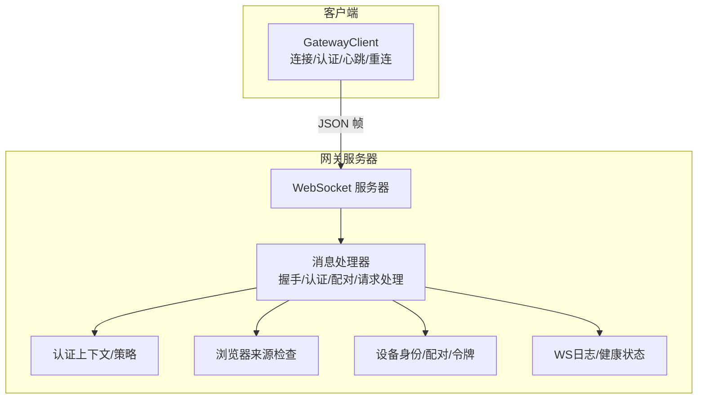
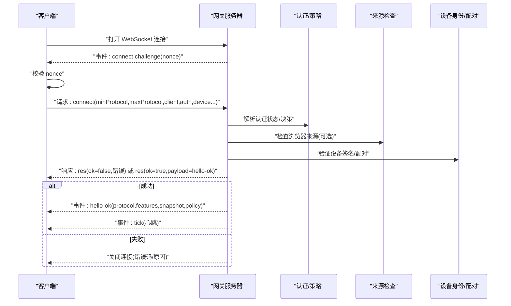
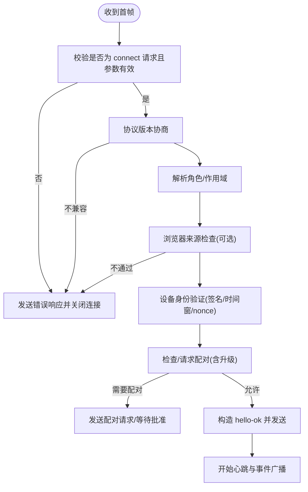
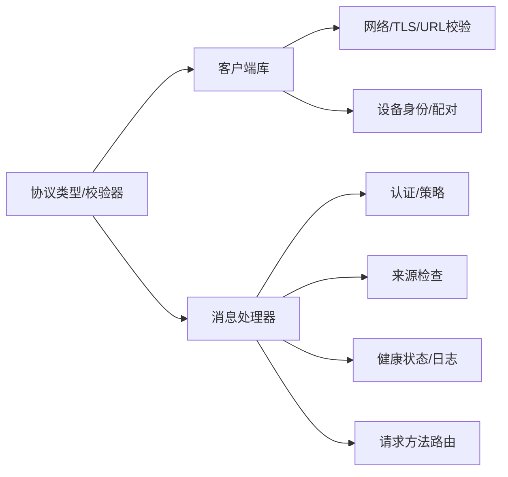

# WebSocket协议

<cite>
**本文引用的文件**
- [src/gateway/protocol/index.ts](file://src/gateway/protocol/index.ts)
- [src/gateway/protocol/schema/types.ts](file://src/gateway/protocol/schema/types.ts)
- [src/gateway/client.ts](file://src/gateway/client.ts)
- [src/gateway/server/ws-connection/message-handler.ts](file://src/gateway/server/ws-connection/message-handler.ts)
- [src/gateway/server.ts](file://src/gateway/server.ts)
- [src/gateway/server-constants.ts](file://src/gateway/server-constants.ts)
- [src/gateway/net.ts](file://src/gateway/net.ts)
- [src/gateway/protocol/client-info.ts](file://src/gateway/protocol/client-info.ts)
- [src/gateway/protocol/connect-error-details.ts](file://src/gateway/protocol/connect-error-details.ts)
- [src/gateway/auth-rate-limit.ts](file://src/gateway/auth-rate-limit.ts)
- [src/gateway/origin-check.ts](file://src/gateway/origin-check.ts)
- [src/gateway/device-auth.ts](file://src/gateway/device-auth.ts)
- [src/gateway/infra/device-identity.ts](file://src/gateway/infra/device-identity.ts)
- [src/gateway/infra/device-pairing.ts](file://src/gateway/infra/device-pairing.ts)
- [src/gateway/infra/ws.ts](file://src/gateway/infra/ws.ts)
- [src/gateway/ws-log.ts](file://src/gateway/ws-log.ts)
- [src/gateway/version.ts](file://src/gateway/version.ts)
- [src/gateway/server-health.ts](file://src/gateway/server-health.ts)
- [src/gateway/server-methods.ts](file://src/gateway/server-methods.ts)
- [src/gateway/server-methods/types.ts](file://src/gateway/server-methods/types.ts)
- [src/gateway/server-auth.ts](file://src/gateway/server-auth.ts)
- [src/gateway/server-auth-context.ts](file://src/gateway/server-auth-context.ts)
- [src/gateway/server-auth-messages.ts](file://src/gateway/server-auth-messages.ts)
- [src/gateway/server-auth-policy.ts](file://src/gateway/server-auth-policy.ts)
- [src/gateway/server-unauthorized-guard.ts](file://src/gateway/server-unauthorized-guard.ts)
- [src/gateway/server-close-reason.ts](file://src/gateway/server-close-reason.ts)
- [src/gateway/server-health-state.ts](file://src/gateway/server-health-state.ts)
- [src/gateway/server-node-events.ts](file://src/gateway/server-node-events.ts)
- [src/gateway/server-node-events-types.ts](file://src/gateway/server-node-events-types.ts)
- [src/gateway/server-node-events.test.ts](file://src/gateway/server-node-events.test.ts)
- [src/gateway/ws-types.ts](file://src/gateway/ws-types.ts)
- [src/gateway/server-auth-default-token.suite.ts](file://src/gateway/server.auth.default-token.suite.ts)
- [src/gateway/android-node.capabilities.live.test.ts](file://src/gateway/android-node.capabilities.live.test.ts)
- [apps/macos/Sources/OpenClaw/GatewayConnection.swift](file://apps/macos/Sources/OpenClaw/GatewayConnection.swift)
- [scripts/dev/gateway-ws-client.ts](file://scripts/dev/gateway-ws-client.ts)
</cite>

## 目录
1. [引言](#引言)
2. [项目结构](#项目结构)
3. [核心组件](#核心组件)
4. [架构总览](#架构总览)
5. [详细组件分析](#详细组件分析)
6. [依赖关系分析](#依赖关系分析)
7. [性能考量](#性能考量)
8. [故障排查指南](#故障排查指南)
9. [结论](#结论)
10. [附录](#附录)

## 引言
本文件为 OpenClaw 网关 WebSocket 协议的权威技术文档，覆盖连接建立（握手、认证、配对）、消息格式（帧类型、参数校验、序列化）、事件与命令体系、实时交互模式（心跳、重连、流控）、协议版本与兼容性策略，以及客户端连接示例与调试工具使用方法。目标读者既包括需要集成客户端的开发者，也包括需要理解服务端实现细节的工程师。

## 项目结构
OpenClaw 的 WebSocket 协议实现主要位于网关子系统中，采用“协议模式 + 校验器 + 消息处理器 + 客户端库”的分层设计：
- 协议模式与校验：在协议目录下通过 TypeBox 定义数据模型，并由 AJV 生成强类型校验器，确保消息格式一致性与向前兼容。
- 服务器端：在 WebSocket 连接建立后，按序执行握手、认证、配对、状态初始化与请求处理；同时维护心跳与健康状态。
- 客户端：封装连接、挑战响应、认证、请求/响应、事件订阅、心跳监控、断线重连与 TLS 指纹校验等。

图表来源
- [src/gateway/client.ts](file://src/gateway/client.ts#L86-L531)
- [src/gateway/server/ws-connection/message-handler.ts](file://src/gateway/server/ws-connection/message-handler.ts#L236-L1216)
- [src/gateway/server-auth.ts](file://src/gateway/server-auth.ts)
- [src/gateway/origin-check.ts](file://src/gateway/origin-check.ts)
- [src/gateway/infra/device-identity.ts](file://src/gateway/infra/device-identity.ts)
- [src/gateway/infra/device-pairing.ts](file://src/gateway/infra/device-pairing.ts)
- [src/gateway/ws-log.ts](file://src/gateway/ws-log.ts)

章节来源
- [src/gateway/protocol/index.ts](file://src/gateway/protocol/index.ts#L253-L458)
- [src/gateway/protocol/schema/types.ts](file://src/gateway/protocol/schema/types.ts#L1-L30)
- [src/gateway/client.ts](file://src/gateway/client.ts#L86-L531)
- [src/gateway/server/ws-connection/message-handler.ts](file://src/gateway/server/ws-connection/message-handler.ts#L236-L1216)

## 核心组件
- 协议模式与校验
  - 使用 TypeBox 定义帧与参数模型，AJV 编译为强类型校验器，统一暴露于协议索引模块，便于客户端与服务端共享。
  - 关键类型：连接参数、请求帧、响应帧、事件帧、快照、在线状态、错误结构、协议版本等。
- 服务器消息处理器
  - 负责握手阶段的协议协商、角色与作用域解析、浏览器来源校验、设备身份验证与配对、生成 hello-ok 并建立会话。
  - 正常连接后，严格校验请求帧并路由到相应方法处理器，返回响应或错误。
- 客户端库
  - 提供连接生命周期管理、挑战-响应认证、设备签名、TLS 指纹校验、心跳监视、断线重连、请求队列与等待最终结果等能力。
- 心跳与健康
  - 服务端周期性生成心跳事件，客户端通过心跳监视检测静默断开；服务端维护健康快照与版本号，支持探测刷新。

章节来源
- [src/gateway/protocol/index.ts](file://src/gateway/protocol/index.ts#L253-L458)
- [src/gateway/protocol/schema/types.ts](file://src/gateway/protocol/schema/types.ts#L1-L30)
- [src/gateway/server/ws-connection/message-handler.ts](file://src/gateway/server/ws-connection/message-handler.ts#L363-L1216)
- [src/gateway/client.ts](file://src/gateway/client.ts#L86-L531)

## 架构总览
下面的时序图展示了从客户端发起连接到握手完成的全过程，包括挑战-响应、协议版本协商、认证与配对、以及 hello-ok 返回。

图表来源
- [src/gateway/client.ts](file://src/gateway/client.ts#L360-L431)
- [src/gateway/server/ws-connection/message-handler.ts](file://src/gateway/server/ws-connection/message-handler.ts#L363-L1132)
- [src/gateway/origin-check.ts](file://src/gateway/origin-check.ts)
- [src/gateway/infra/device-identity.ts](file://src/gateway/infra/device-identity.ts)
- [src/gateway/infra/device-pairing.ts](file://src/gateway/infra/device-pairing.ts)

## 详细组件分析

### 连接建立与握手流程
- 首帧必须是请求且方法为 connect，参数需满足 ConnectParams 校验。
- 协议版本协商：客户端 minProtocol/maxProtocol 与服务端 PROTOCOL_VERSION 必须有交集，否则拒绝。
- 角色与作用域：服务端解析角色并默认清空未绑定的作用域，避免凭空授予权限。
- 浏览器来源校验：若存在 Origin 头或受信任代理，将进行来源检查，不匹配则拒绝。
- 设备身份验证：服务端验证设备公钥、签名时间窗、nonce 与签名版本（v2/v3），并根据配对记录决定是否需要配对。
- 配对与升级：当角色/作用域/元数据升级时，可能触发静默自动批准或弹出配对请求。
- 成功后返回 hello-ok，包含协议版本、特性列表、快照、Canvas 能力令牌与策略（最大负载、缓冲字节、心跳间隔）。

图表来源
- [src/gateway/server/ws-connection/message-handler.ts](file://src/gateway/server/ws-connection/message-handler.ts#L394-L1132)
- [src/gateway/origin-check.ts](file://src/gateway/origin-check.ts)
- [src/gateway/infra/device-identity.ts](file://src/gateway/infra/device-identity.ts)
- [src/gateway/infra/device-pairing.ts](file://src/gateway/infra/device-pairing.ts)

章节来源
- [src/gateway/server/ws-connection/message-handler.ts](file://src/gateway/server/ws-connection/message-handler.ts#L394-L1132)
- [src/gateway/protocol/connect-error-details.ts](file://src/gateway/protocol/connect-error-details.ts)
- [src/gateway/protocol/client-info.ts](file://src/gateway/protocol/client-info.ts)

### 认证与配对机制
- 共享密钥认证：支持 token/password，用于网关级访问。
- 设备令牌认证：基于持久化的设备令牌，优先于共享密钥参与（在无显式共享密钥时）。
- 设备身份：客户端使用设备私钥对连接参数进行签名，服务端验证签名与时间窗，确保抗重放。
- 配对策略：本地/受信任代理场景可静默批准，否则触发配对请求；角色/作用域/元数据升级时要求重新配对。
- 来源检查：浏览器来源校验仅在特定场景启用，防止跨站攻击。

章节来源
- [src/gateway/server/ws-connection/message-handler.ts](file://src/gateway/server/ws-connection/message-handler.ts#L547-L957)
- [src/gateway/infra/device-identity.ts](file://src/gateway/infra/device-identity.ts)
- [src/gateway/infra/device-pairing.ts](file://src/gateway/infra/device-pairing.ts)
- [src/gateway/origin-check.ts](file://src/gateway/origin-check.ts)

### 心跳保活与静默断开检测
- 服务端周期性发送心跳事件，客户端维护 lastTick 时间戳。
- 客户端心跳监视：若超过两倍心跳间隔未收到 tick，主动关闭连接（自定义关闭码）。
- 服务端策略：心跳间隔由 hello-ok 中 policy.tickIntervalMs 决定，客户端可配置最小监视间隔。

章节来源
- [src/gateway/client.ts](file://src/gateway/client.ts#L453-L475)
- [src/gateway/server/ws-connection/message-handler.ts](file://src/gateway/server/ws-connection/message-handler.ts#L1049-L1053)

### 消息格式规范
- 帧类型
  - 请求帧(req)：type="req"，包含 id、method、params。
  - 响应帧(res)：type="res"，包含 id、ok、payload 或 error。
  - 事件帧(event)：type="event"，包含 event、payload、可选 seq。
  - 连接挑战事件(connect.challenge)：携带 nonce。
  - 心跳事件(tick)：用于保活。
- 参数与载荷
  - 所有参数均通过 AJV 校验，错误信息格式化输出。
  - 错误结构包含 code、message、details（如错误码、原因等）。
- 序列化
  - 使用 JSON 字符串传输，服务端/客户端均以字符串解析后再校验。

章节来源
- [src/gateway/protocol/index.ts](file://src/gateway/protocol/index.ts#L253-L458)
- [src/gateway/protocol/schema/types.ts](file://src/gateway/protocol/schema/types.ts#L1-L30)
- [src/gateway/client.ts](file://src/gateway/client.ts#L360-L411)

### 事件与命令体系
- 事件类型
  - 连接挑战：connect.challenge
  - 心跳：tick
  - 设备配对：device.pair.requested/device.pair.resolved
  - 节点事件：exec.started/finished/denied、chat.subscribe/unsubscribe 等
  - 系统通知：根据配置与运行时状态广播
- 命令与方法
  - 方法列表在 hello-ok.features.methods 中声明，服务器端集中注册与路由。
  - 示例方法（非完整列表）：agent.*、status、system-event、health、channels.status、config.*、wizard.*、talk.*、web.login.*、models.list、chat.*、sessions.*、skills.*、voicewake.*、node.pair.*、device.pair.*

章节来源
- [src/gateway/server/ws-connection/message-handler.ts](file://src/gateway/server/ws-connection/message-handler.ts#L1038-L1053)
- [src/gateway/server-methods.ts](file://src/gateway/server-methods.ts)
- [apps/macos/Sources/OpenClaw/GatewayConnection.swift](file://apps/macos/Sources/OpenClaw/GatewayConnection.swift#L56-L89)

### 实时交互模式与错误处理
- 断线重连
  - 客户端指数退避重连，上限至 30 秒；清理心跳定时器，失败时刷新待处理请求。
- 流量控制
  - 服务端限制单连接最大负载与缓冲字节，客户端在握手后获取策略值。
- 错误处理
  - 无效握手、协议不匹配、来源不被允许、设备身份无效、未配对、重复未授权请求等均有明确错误码与提示。
- 间隙检测
  - 客户端跟踪事件 seq，检测丢包并回调 onGap。

章节来源
- [src/gateway/client.ts](file://src/gateway/client.ts#L433-L475)
- [src/gateway/server-constants.ts](file://src/gateway/server-constants.ts)
- [src/gateway/server/ws-connection/message-handler.ts](file://src/gateway/server/ws-connection/message-handler.ts#L1134-L1216)

### 协议版本管理与向后兼容
- 版本字段
  - PROTOCOL_VERSION 在协议模式中定义，客户端通过 minProtocol/maxProtocol 发送。
- 不兼容处理
  - 若客户端 maxProtocol 小于服务端版本或 minProtocol 大于服务端版本，直接拒绝并关闭连接。
- 向前兼容
  - 未知帧类型保留原始载荷，避免旧客户端因新字段报错。
- 文档与生成
  - 新增方法需在服务器端注册并在文档中更新；Swift 代码生成保留未知帧类型。

章节来源
- [src/gateway/protocol/index.ts](file://src/gateway/protocol/index.ts#L561-L564)
- [src/gateway/server-auth-default-token.suite.ts](file://src/gateway/server.auth.default-token.suite.ts#L301-L313)
- [docs/concepts/typebox.md](file://docs/concepts/typebox.md#L264-L268)

### 客户端连接示例与调试工具
- 客户端类
  - GatewayClient 提供 start/stop、请求/响应、事件监听、心跳监视、断线重连、TLS 指纹校验等。
- 连接安全
  - 默认禁止明文 ws:// 连接到非回环地址，可通过环境变量开启私有网络例外。
- 调试工具
  - 提供独立的开发脚本用于手动连接与测试。
  - 支持打印 WS 日志、健康状态、来源检查指标等。

章节来源
- [src/gateway/client.ts](file://src/gateway/client.ts#L108-L222)
- [src/gateway/net.ts](file://src/gateway/net.ts)
- [scripts/dev/gateway-ws-client.ts](file://scripts/dev/gateway-ws-client.ts)

## 依赖关系分析
- 客户端依赖
  - 协议模式与校验器、设备身份与配对、网络与 TLS 工具、日志与版本信息。
- 服务器端依赖
  - 认证上下文与策略、来源检查、设备身份与配对、健康状态与日志、请求方法路由、速率限制与洪水防护。
- 组件耦合
  - 协议层通过 AJV 校验器解耦客户端与服务端；消息处理器集中处理握手与请求，降低上层复杂度。

图表来源
- [src/gateway/protocol/index.ts](file://src/gateway/protocol/index.ts#L253-L458)
- [src/gateway/client.ts](file://src/gateway/client.ts#L1-L36)
- [src/gateway/server/ws-connection/message-handler.ts](file://src/gateway/server/ws-connection/message-handler.ts#L1-L87)

章节来源
- [src/gateway/protocol/index.ts](file://src/gateway/protocol/index.ts#L253-L458)
- [src/gateway/client.ts](file://src/gateway/client.ts#L1-L36)
- [src/gateway/server/ws-connection/message-handler.ts](file://src/gateway/server/ws-connection/message-handler.ts#L1-L87)

## 性能考量
- 心跳与事件广播
  - 服务端按策略发送心跳，客户端按两倍阈值检测静默断开，避免资源浪费。
- 负载与缓冲
  - 服务端限制单连接最大负载与缓冲字节，客户端在握手后获知策略，合理规划批量操作。
- 认证与配对
  - 设备签名验证与配对请求可能带来额外延迟，建议缓存设备令牌与配对元数据。
- 日志与健康
  - 服务端健康快照与版本号在握手后同步，减少后续查询成本。

## 故障排查指南
- 常见错误与原因
  - 协议不匹配：客户端 min/max 与服务端版本无交集。
  - 无效握手：首帧非 connect 或参数校验失败。
  - 来源不被允许：浏览器来源检查失败。
  - 设备身份问题：ID 不匹配、签名过期、nonce 缺失或不一致、签名无效。
  - 未配对：设备未配对或角色/作用域/元数据升级。
  - 重复未授权请求：触发洪水防护，服务端可能关闭连接。
- 排查步骤
  - 检查握手阶段的错误响应与关闭原因。
  - 核对协议版本范围与客户端设备签名参数。
  - 验证浏览器来源与代理配置。
  - 查看设备配对记录与升级审计日志。
  - 使用开发脚本复现问题并开启详细日志。

章节来源
- [src/gateway/server/ws-connection/message-handler.ts](file://src/gateway/server/ws-connection/message-handler.ts#L402-L433)
- [src/gateway/server/ws-connection/message-handler.ts](file://src/gateway/server/ws-connection/message-handler.ts#L564-L600)
- [src/gateway/server/ws-connection/message-handler.ts](file://src/gateway/server/ws-connection/message-handler.ts#L662-L681)
- [src/gateway/server/ws-connection/message-handler.ts](file://src/gateway/server/ws-connection/message-handler.ts#L846-L866)
- [src/gateway/server-auth-default-token.suite.ts](file://src/gateway/server.auth.default-token.suite.ts#L301-L330)

## 结论
OpenClaw 的 WebSocket 协议通过严格的模式定义与校验、完善的握手与认证流程、清晰的事件与命令体系，以及稳健的心跳与重连机制，提供了高可靠、可扩展的实时通信基础。版本管理与向前兼容策略确保了长期演进的稳定性。建议在生产环境中始终使用 wss:// 并正确配置来源检查与设备配对策略，以获得最佳的安全性与可用性。

## 附录
- 关键配置项
  - 网关绑定与可信代理、控制 UI 允许来源、心跳间隔、最大负载与缓冲字节等。
- 参考实现
  - 客户端类 GatewayClient 的 start/request/onEvent/onClose 生命周期。
  - 服务器端消息处理器的握手、认证、配对与请求处理逻辑。
  - 节点事件处理与系统通知广播。

章节来源
- [src/gateway/server.ts](file://src/gateway/server.ts)
- [src/gateway/server-constants.ts](file://src/gateway/server-constants.ts)
- [src/gateway/client.ts](file://src/gateway/client.ts#L86-L531)
- [src/gateway/server-node-events.ts](file://src/gateway/server-node-events.ts#L490-L543)
- [src/gateway/server-node-events-types.ts](file://src/gateway/server-node-events-types.ts#L1-L36)