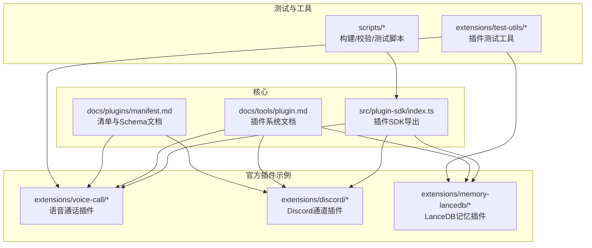
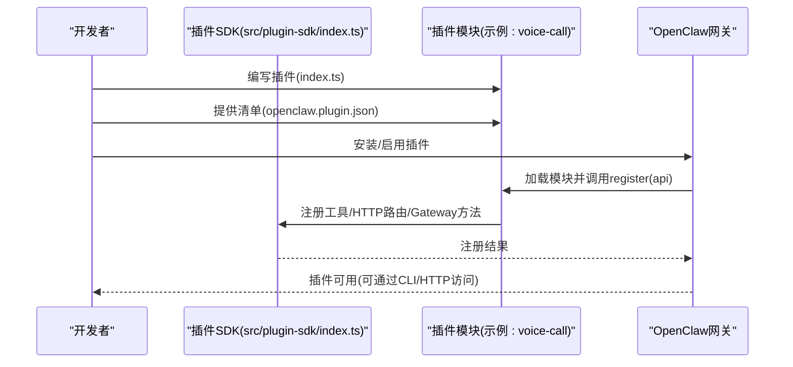
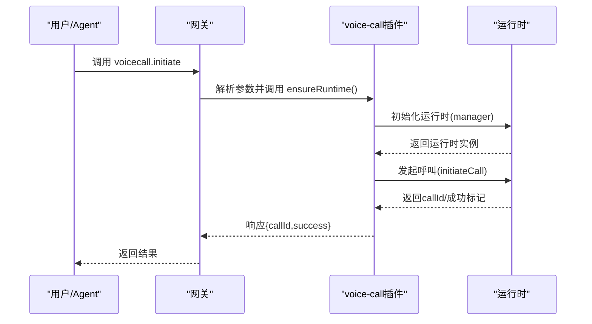
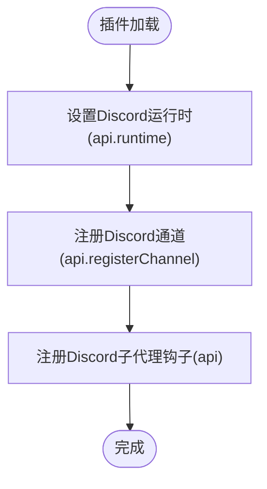
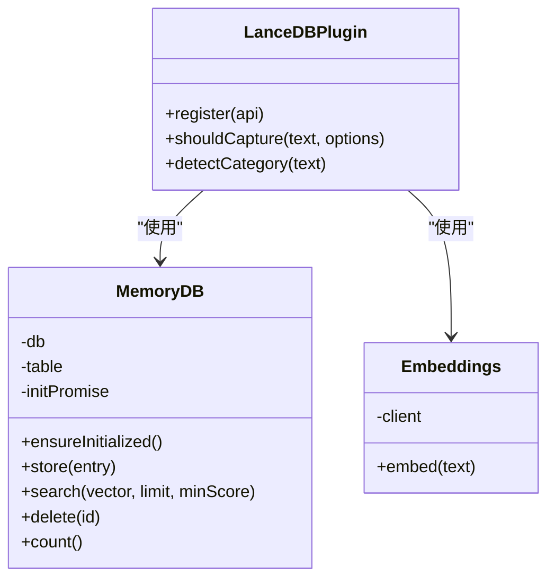
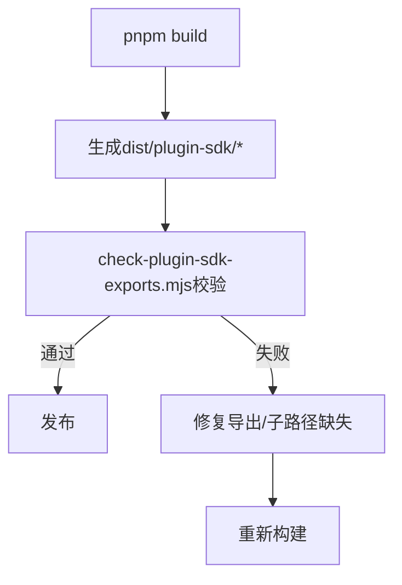
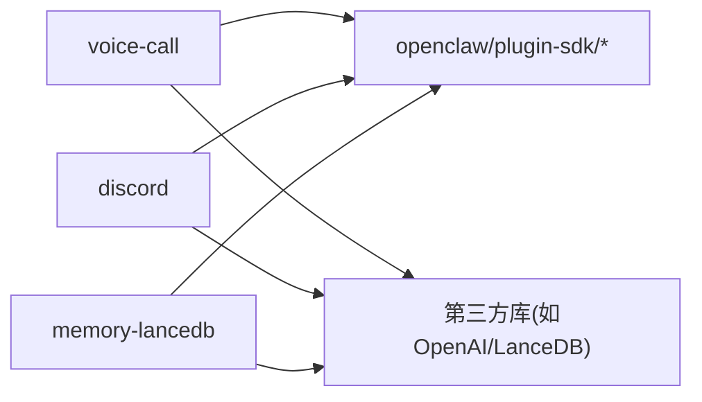

# 插件开发指南

<cite>
**本文引用的文件**
- [docs/tools/plugin.md](file://docs/tools/plugin.md)
- [docs/plugins/manifest.md](file://docs/plugins/manifest.md)
- [src/plugin-sdk/index.ts](file://src/plugin-sdk/index.ts)
- [extensions/voice-call/index.ts](file://extensions/voice-call/index.ts)
- [extensions/voice-call/openclaw.plugin.json](file://extensions/voice-call/openclaw.plugin.json)
- [extensions/discord/index.ts](file://extensions/discord/index.ts)
- [extensions/discord/openclaw.plugin.json](file://extensions/discord/openclaw.plugin.json)
- [extensions/memory-lancedb/index.ts](file://extensions/memory-lancedb/index.ts)
- [extensions/test-utils/plugin-runtime-mock.ts](file://extensions/test-utils/plugin-runtime-mock.ts)
- [extensions/test-utils/runtime-env.ts](file://extensions/test-utils/runtime-env.ts)
- [extensions/diffs/index.test.ts](file://extensions/diffs/index.test.ts)
- [scripts/check-plugin-sdk-exports.mjs](file://scripts/check-plugin-sdk-exports.mjs)
- [scripts/dev/test-device-pair-telegram.ts](file://scripts/dev/test-device-pair-telegram.ts)
- [scripts/e2e/plugins-docker.sh](file://scripts/e2e/plugins-docker.sh)
- [scripts/build-docs-list.mjs](file://scripts/build-docs-list.mjs)
- [scripts/run-node.mjs](file://scripts/run-node.mjs)
- [scripts/watch-node.mjs](file://scripts/watch-node.mjs)
- [scripts/vitest.unit.config.ts](file://scripts/vitest.unit.config.ts)
- [scripts/vitest.extensions.config.ts](file://scripts/vitest.extensions.config.ts)
- [scripts/vitest.live.config.ts](file://scripts/vitest.live.config.ts)
- [scripts/vitest.e2e.config.ts](file://scripts/vitest.e2e.config.ts)
- [scripts/vitest.scoped-config.ts](file://scripts/vitest.scoped-config.ts)
- [scripts/vitest.gateway.config.ts](file://scripts/vitest.gateway.config.ts)
- [scripts/vitest.channels.config.ts](file://scripts/vitest.channels.config.ts)
- [scripts/vitest.live.config.ts](file://scripts/vitest.live.config.ts)
- [scripts/vitest.scoped-config.ts](file://scripts/vitest.scoped-config.ts)
- [scripts/vitest.gateway.config.ts](file://scripts/vitest.gateway.config.ts)
- [scripts/vitest.channels.config.ts](file://scripts/vitest.channels.config.ts)
- [scripts/vitest.unit.config.ts](file://scripts/vitest.unit.config.ts)
- [scripts/vitest.extensions.config.ts](file://scripts/vitest.extensions.config.ts)
- [scripts/vitest.live.config.ts](file://scripts/vitest.live.config.ts)
- [scripts/vitest.e2e.config.ts](file://scripts/vitest.e2e.config.ts)
- [scripts/vitest.scoped-config.ts](file://scripts/vitest.scoped-config.ts)
- [scripts/vitest.gateway.config.ts](file://scripts/vitest.gateway.config.ts)
- [scripts/vitest.channels.config.ts](file://scripts/vitest.channels.config.ts)
- [scripts/vitest.unit.config.ts](file://scripts/vitest.unit.config.ts)
- [scripts/vitest.extensions.config.ts](file://scripts/vitest.extensions.config.ts)
- [scripts/vitest.live.config.ts](file://scripts/vitest.live.config.ts)
- [scripts/vitest.e2e.config.ts](file://scripts/vitest.e2e.config.ts)
- [scripts/vitest.scoped-config.ts](file://scripts/vitest.scoped-config.ts)
- [scripts/vitest.gateway.config.ts](file://scripts/vitest.gateway.config.ts)
- [scripts/vitest.channels.config.ts](file://scripts/vitest.channels.config.ts)
- [scripts/vitest.unit.config.ts](file://scripts/vitest.unit.config.ts)
- [scripts/vitest.extensions.config.ts](file://scripts/vitest.extensions.config.ts)
- [scripts/vitest.live.config.ts](file://scripts/vitest.live.config.ts)
- [scripts/vitest.e2e.config.ts](file://scripts/vitest.e2e.config.ts)
- [scripts/vitest.scoped-config.ts](file://scripts/vitest.scoped-config.ts)
- [scripts/vitest.gateway.config.ts](file://scripts/vitest.gateway.config.ts)
- [scripts/vitest.channels.config.ts](file://scripts/vitest.channels.config.ts)
- [scripts/vitest.unit.config.ts](file://scripts/vitest.unit.config.ts)
- [scripts/vitest.extensions.config.ts](file://scripts/vitest.extensions.config.ts)
- [scripts/vitest.live.config.ts](file://scripts/vitest.live.config.ts)
- [scripts/vitest.e2e.config.ts](file://scripts/vitest.e2e.config.ts)
- [scripts/vitest.scoped-config.ts](file://scripts/vitest.scoped-config.ts)
- [scripts/vitest.gateway.config.ts](file://scripts/vitest.gateway.config.ts)
- [scripts/vitest.channels.config.ts](file://scripts/vitest.channels.config.ts)
- [scripts/vitest.unit.config.ts](file://scripts/vitest.unit.config.ts)
- [scripts/vitest.extensions.config.ts](file://scripts/vitest.extensions.config.ts)
- [scripts/vitest.live.config.ts](file://scripts/vitest.live.config.ts)
- [scripts/vitest.e2e.config.ts](file://scripts/vitest.e2e.config.ts)
- [scripts/vitest.scoped-config.ts](file://scripts/vitest.scoped-config.ts)
- [scripts/vitest.gateway.config.ts](file://scripts/vitest.gateway.config.ts)
- [scripts/vitest.channels.config.ts](file://scripts/vitest.channels.config.ts)
- [scripts/vitest.unit.config.ts](file://scripts/vitest.unit.config.ts)
- [scripts/vitest.extensions.config.ts](file://scripts/vitest.extensions.config.ts)
- [scripts/vitest.live.config.ts](file://scripts/vitest.live.config.ts)
- [scripts/vitest.e2e.config.ts](file://scripts/vitest.e2e.config.ts)
- [scripts......](file://scripts/vitest.scoped-config.ts)
- [scripts/vitest.gateway.config.ts](file://scripts/vitest.gateway.config.ts)
- [scripts/vitest.channels.config.ts](file://scripts/vitest.channels.config.ts)
- [scripts/vitest.unit.config.ts](file://scripts/vitest.unit.config.ts)
- [scripts/vitest.extensions.config.ts](file://scripts/vitest.extensions.config.ts)
- [scripts/vitest.live.config.ts](file://scripts/vitest.live.config.ts)
- [scripts/vitest.e2e.config.ts](file://scripts/vitest.e2e.config.ts)
- [scripts/vitest.scoped-config.ts](file://scripts/vitest.scoped-config.ts)
- [scripts/vitest.gateway.config.ts](file://scripts/vitest.gateway.config.ts)
- [scripts/vitest.channels.config.ts](file://scripts/vitest.channels.config.ts)
- [scripts/vitest.unit.config.ts](file://scripts/vitest.unit.config.ts)
- [scripts/vitest.extensions.config.ts](file://scripts/vitest.extensions.config.ts)
- [scripts/vitest.live.config.ts](file://scripts/vitest.live.config.ts)
- [scripts/vitest.e2e.config.ts](file://scripts/vitest.e2e.config.ts)
- [scripts/vitest.scoped-config.ts](file://scripts/vitest.scoped-config.ts)
- [scripts/vitest.gateway.config.ts](file://scripts/vitest.gateway.config.ts)
- [scripts/vitest.channels.config.ts](file://scripts/vitest.channels.config.ts)
- [scripts/vitest.unit.config.ts](file://scripts/vitest.unit.config.ts)
- [scripts/vitest.extensions.config.ts](file://scripts/vitest.extensions.config.ts)
- [scripts/vitest.live.config.ts](file://scripts/vitest.live.config.ts)
- [scripts/vitest.e2e.config.ts](file://scripts/vitest.e2e.config.ts)
- [scripts/vitest.scoped-config.ts](file://scripts/vitest.scoped-config.ts)
- [scripts/vitest.gateway.config.ts](file://scripts/vitest.gateway.config.ts)
- [scripts/vitest.channels.config.ts](file://scripts/vitest.channels.config.ts)
- [scripts/vitest.unit.config.ts](file://scripts/vitest.unit.config.ts)
- [scripts/vitest.extensions.config.ts](file://scripts/vitest.extensions.config.ts)
- [scripts/vitest.live.config.ts](file://scripts/vitest.live.config.ts)
- [scripts/vitest.e2e.config.ts](file://scripts/vitest.e2e.config.ts)
- [scripts/vitest.scoped-config.ts](file://scripts/vitest.scoped-config.ts)
- [scripts/vitest.gateway.config.ts](file://scripts/vitest.gateway.config.ts)
- [scripts/vitest.channels.config.ts](file://scripts/vitest.channels.config.ts)
- [scripts/vitest.unit.config.ts](file://scripts/vitest.unit.config.ts)
- [scripts/vitest.extensions.config.ts](file://scripts/vitest.extensions.config.ts)
- [scripts/vitest.live.config.ts](file://scripts/vitest.live.config.ts)
- [scripts/vitest.e2e.config.ts](file://scripts/vitest.e2e.config.ts)
- [scripts/vitest.scoped-config.ts](file://scripts/vitest.scoped-config.ts)
- [scripts/vitest.gateway.config.ts](file://scripts/vitest.gateway.config.ts)
- [scripts/vitest.channels.config.ts](file://scripts/vitest.channels.config.ts)
- [scripts/vitest.unit.config.ts](file://scripts/vitest.unit.config.ts)
- [scripts/vitest.extensions.config.ts](file://scripts/vitest.extensions.config.ts)
- [scripts/vitest.live.config.ts](file://scripts/vitest.live.config.ts)
- [scripts/vitest.e2e.config.ts](file://scripts/vitest.e2e.config.ts)
- [scripts/vitest.scoped-config.ts](file://scripts......)
</cite>

## 目录
1. [简介](#简介)
2. [项目结构](#项目结构)
3. [核心组件](#核心组件)
4. [架构总览](#架构总览)
5. [详细组件分析](#详细组件分析)
6. [依赖关系分析](#依赖关系分析)
7. [性能考虑](#性能考虑)
8. [故障排查指南](#故障排查指南)
9. [结论](#结论)
10. [附录](#附录)

## 简介
本指南面向希望在 OpenClaw 平台上开发插件（扩展）的开发者，覆盖从环境准备、项目结构、开发与测试、调试到打包分发与版本管理的完整流程。OpenClaw 插件是可按需加载的小型模块，用于扩展网关能力（如消息通道、工具、RPC 方法、HTTP 路由、上下文引擎等），并以 TypeScript 模块形式在运行时加载。

## 项目结构
OpenClaw 仓库采用多包工作区组织，插件相关的核心位置包括：
- 核心 SDK：src/plugin-sdk/index.ts 提供插件 API 的统一导出入口，涵盖运行时助手、通道适配器、HTTP/Webhook 注册、配置模式等。
- 官方插件示例：extensions 下包含多种官方插件，如 voice-call、discord、memory-lancedb 等，可作为开发模板。
- 文档：docs/tools/plugin.md 与 docs/plugins/manifest.md 提供插件系统概览、清单要求与最佳实践。
- 测试与工具：extensions/test-utils 提供插件运行时 Mock；scripts 下包含构建、校验与测试脚本。

图表来源
- [src/plugin-sdk/index.ts](file://src/plugin-sdk/index.ts#L1-L812)
- [docs/tools/plugin.md](file://docs/tools/plugin.md#L1-L963)
- [docs/plugins/manifest.md](file://docs/plugins/manifest.md#L1-L76)
- [extensions/voice-call/index.ts](file://extensions/voice-call/index.ts#L1-L543)
- [extensions/discord/index.ts](file://extensions/discord/index.ts#L1-L20)
- [extensions/memory-lancedb/index.ts](file://extensions/memory-lancedb/index.ts#L1-L679)
- [extensions/test-utils/plugin-runtime-mock.ts](file://extensions/test-utils/plugin-runtime-mock.ts#L1-L272)
- [scripts/check-plugin-sdk-exports.mjs](file://scripts/check-plugin-sdk-exports.mjs#L1-L158)

章节来源
- [docs/tools/plugin.md](file://docs/tools/plugin.md#L1-L963)
- [docs/plugins/manifest.md](file://docs/plugins/manifest.md#L1-L76)
- [src/plugin-sdk/index.ts](file://src/plugin-sdk/index.ts#L1-L812)

## 核心组件
- 插件 SDK 导出：统一导出通道类型、运行时助手、HTTP/Webhook 工具、状态辅助、配置模式、SSRF/限流等能力，供插件作者按需引入。
- 插件清单 openclaw.plugin.json：每个插件必须提供，包含 id、configSchema、可选 kind、channels/providers/skills 等元信息。
- 插件注册 API：插件通过导出函数或对象实现 register(api)，在其中注册工具、HTTP 路由、CLI 命令、服务、提供者、通道等。
- 运行时助手：api.runtime 提供 TTS/STT、媒体处理、系统命令、子代理会话等能力；api.on 提供生命周期钩子。
- 配置与验证：插件配置通过 JSON Schema 校验，支持 uiHints 控制 UI 表单渲染；严格规则禁止未知字段与非法引用。

章节来源
- [src/plugin-sdk/index.ts](file://src/plugin-sdk/index.ts#L1-L812)
- [docs/tools/plugin.md](file://docs/tools/plugin.md#L484-L586)
- [docs/plugins/manifest.md](file://docs/plugins/manifest.md#L18-L76)

## 架构总览
OpenClaw 插件在网关进程中运行，具备以下关键交互路径：
- 清单发现与加载：扫描配置路径、工作区扩展、全局扩展与内置扩展，解析 openclaw.plugin.json 并加载插件模块。
- 运行时注册：插件在 register(api) 中调用 api.register* 系列方法完成功能注册。
- 请求处理：HTTP/Webhook 与 Gateway RPC 通过 api.registerHttpRoute/api.registerGatewayMethod 注册路由与方法。
- 生命周期：通过 api.on 注册 before_prompt_build/before_agent_start 等钩子，参与提示构造与代理生命周期事件。

图表来源
- [src/plugin-sdk/index.ts](file://src/plugin-sdk/index.ts#L1-L812)
- [extensions/voice-call/index.ts](file://extensions/voice-call/index.ts#L146-L543)
- [extensions/voice-call/openclaw.plugin.json](file://extensions/voice-call/openclaw.plugin.json#L1-L601)
- [docs/tools/plugin.md](file://docs/tools/plugin.md#L484-L586)

章节来源
- [docs/tools/plugin.md](file://docs/tools/plugin.md#L228-L483)

## 详细组件分析

### 组件A：语音通话插件（voice-call）
- 功能概述：提供发起/继续/对讲/结束电话、查询状态、注册 Gateway 方法、CLI 命令与后台服务。
- 关键点：
  - 自定义配置解析与兼容旧字段（如 twilio.from → fromNumber）。
  - 通过 api.registerGatewayMethod 注册 voicecall.* 方法。
  - 通过 api.registerTool 注册 voice_call 工具。
  - 通过 api.registerCli 注册 voicecall 子命令。
  - 通过 api.registerService 注册启动/停止逻辑。
- 清单与 Schema：openclaw.plugin.json 内嵌完整 JSON Schema，含 provider、号码、隧道、TTS/STT、流式通话等配置项。

图表来源
- [extensions/voice-call/index.ts](file://extensions/voice-call/index.ts#L230-L375)
- [extensions/voice-call/openclaw.plugin.json](file://extensions/voice-call/openclaw.plugin.json#L162-L599)

章节来源
- [extensions/voice-call/index.ts](file://extensions/voice-call/index.ts#L146-L543)
- [extensions/voice-call/openclaw.plugin.json](file://extensions/voice-call/openclaw.plugin.json#L1-L601)

### 组件B：Discord 通道插件（discord）
- 功能概述：注册 Discord 通道适配器，设置运行时，注册子代理钩子。
- 关键点：
  - 使用空配置模式 emptyPluginConfigSchema。
  - 通过 api.registerChannel 注册通道插件。
  - 在 openclaw.plugin.json 中声明 channels: ["discord"]。

图表来源
- [extensions/discord/index.ts](file://extensions/discord/index.ts#L7-L19)
- [extensions/discord/openclaw.plugin.json](file://extensions/discord/openclaw.plugin.json#L1-L10)

章节来源
- [extensions/discord/index.ts](file://extensions/discord/index.ts#L1-L20)
- [extensions/discord/openclaw.plugin.json](file://extensions/discord/openclaw.plugin.json#L1-L10)

### 组件C：LanceDB 记忆插件（memory-lancedb）
- 功能概述：基于 LanceDB 的长期记忆存储，提供检索、存储、遗忘工具，并通过生命周期钩子实现自动召回与捕获。
- 关键点：
  - 类 MemoryDB 封装 LanceDB 连接、表初始化、向量搜索与删除。
  - 类 Embeddings 使用 OpenAI 生成向量。
  - 规则过滤 shouldCapture 与分类 detectCategory。
  - 通过 api.registerTool 注册 memory_recall/store/forget 工具。
  - 通过 api.on 注册 before_agent_start 与 agent_end 钩子实现自动召回/捕获。
  - 通过 api.registerCli 注册 ltm 子命令集合。

图表来源
- [extensions/memory-lancedb/index.ts](file://extensions/memory-lancedb/index.ts#L59-L157)
- [extensions/memory-lancedb/index.ts](file://extensions/memory-lancedb/index.ts#L163-L186)
- [extensions/memory-lancedb/index.ts](file://extensions/memory-lancedb/index.ts#L292-L679)

章节来源
- [extensions/memory-lancedb/index.ts](file://extensions/memory-lancedb/index.ts#L1-L679)

### 组件D：插件 SDK 与清单校验
- SDK 导出：src/plugin-sdk/index.ts 统一导出插件 API，包含运行时助手、通道类型、HTTP/Webhook 工具、配置模式等。
- 清单校验：docs/plugins/manifest.md 明确清单必需字段、Schema 要求与验证行为。
- 构建校验：scripts/check-plugin-sdk-exports.mjs 在构建后检查 dist/plugin-sdk 的导出完整性，防止遗漏关键导出导致运行时错误。

图表来源
- [src/plugin-sdk/index.ts](file://src/plugin-sdk/index.ts#L1-L812)
- [docs/plugins/manifest.md](file://docs/plugins/manifest.md#L1-L76)
- [scripts/check-plugin-sdk-exports.mjs](file://scripts/check-plugin-sdk-exports.mjs#L1-L158)

章节来源
- [src/plugin-sdk/index.ts](file://src/plugin-sdk/index.ts#L1-L812)
- [docs/plugins/manifest.md](file://docs/plugins/manifest.md#L1-L76)
- [scripts/check-plugin-sdk-exports.mjs](file://scripts/check-plugin-sdk-exports.mjs#L1-L158)

## 依赖关系分析
- 插件与 SDK：插件通过 openclaw/plugin-sdk 子路径导入所需能力，避免引入整个 SDK。
- 插件与运行时：插件通过 api.runtime 访问核心运行时能力，但不得直接导入 src/**。
- 插件与清单：插件必须提供 openclaw.plugin.json，否则配置验证失败。
- 插件与第三方：部分插件依赖外部库（如 LanceDB、OpenAI），需在插件目录安装依赖并遵循构建限制。

图表来源
- [extensions/voice-call/index.ts](file://extensions/voice-call/index.ts#L1-L14)
- [extensions/discord/index.ts](file://extensions/discord/index.ts#L1-L5)
- [extensions/memory-lancedb/index.ts](file://extensions/memory-lancedb/index.ts#L9-L20)

章节来源
- [docs/tools/plugin.md](file://docs/tools/plugin.md#L146-L186)
- [docs/plugins/manifest.md](file://docs/plugins/manifest.md#L64-L76)

## 性能考虑
- 插件发现与清单缓存：可通过环境变量禁用或调整缓存窗口，减少启动/重载开销。
- 运行时资源：避免在插件中进行昂贵的同步操作；合理使用 api.runtime 的媒体与子代理能力。
- HTTP/Webhook：使用内存限流与请求体限制，避免过载。
- 记忆插件：向量维度与相似度阈值影响检索性能，建议根据场景调优。

章节来源
- [docs/tools/plugin.md](file://docs/tools/plugin.md#L219-L227)
- [src/plugin-sdk/index.ts](file://src/plugin-sdk/index.ts#L419-L440)

## 故障排查指南
- 清单与 Schema 错误：检查 openclaw.plugin.json 是否存在、id 与 channels/providers/skills 是否与清单一致；确保 configSchema 合法且无未知字段。
- 运行时错误：确认 dist/plugin-sdk 导出完整，避免运行时报错“不是函数”。
- 单元测试与集成测试：使用 extensions/test-utils 提供的 Mock 与测试脚本，结合 scripts/vitest.* 配置运行测试。
- 端到端测试：使用 scripts/e2e/plugins-docker.sh 进行插件安装与功能验证。
- 开发辅助：使用 scripts/run-node.mjs/scripts/watch-node.mjs 快速运行与监听变更。

章节来源
- [docs/plugins/manifest.md](file://docs/plugins/manifest.md#L53-L63)
- [scripts/check-plugin-sdk-exports.mjs](file://scripts/check-plugin-sdk-exports.mjs#L92-L117)
- [extensions/test-utils/plugin-runtime-mock.ts](file://extensions/test-utils/plugin-runtime-mock.ts#L1-L272)
- [scripts/vitest.unit.config.ts](file://scripts/vitest.unit.config.ts)
- [scripts/vitest.extensions.config.ts](file://scripts/vitest.extensions.config.ts)
- [scripts/vitest.live.config.ts](file://scripts/vitest.live.config.ts)
- [scripts/vitest.e2e.config.ts](file://scripts/vitest.e2e.config.ts)
- [scripts/vitest.scoped-config.ts](file://scripts/vitest.scoped-config.ts)
- [scripts/vitest.gateway.config.ts](file://scripts/vitest.gateway.config.ts)
- [scripts/vitest.channels.config.ts](file://scripts/vitest.channels.config.ts)
- [scripts/e2e/plugins-docker.sh](file://scripts/e2e/plugins-docker.sh)
- [scripts/run-node.mjs](file://scripts/run-node.mjs)
- [scripts/watch-node.mjs](file://scripts/watch-node.mjs)

## 结论
OpenClaw 插件体系以清晰的清单与 SDK 为核心，提供了强大的扩展能力与严格的配置校验。通过官方示例与测试工具，开发者可以快速上手并构建高质量插件。建议在开发过程中遵循清单与 Schema 要求、充分利用 SDK 工具、完善单元与端到端测试，并关注性能与安全。

## 附录

### A. 基础环境搭建与工具链
- Node.js 与包管理：使用 pnpm，按需安装依赖于插件目录，避免 postinstall 构建。
- 构建与校验：pnpm build 后运行 scripts/check-plugin-sdk-exports.mjs 确保导出完整。
- 文档生成：使用 scripts/build-docs-list.mjs 生成文档索引。

章节来源
- [docs/tools/plugin.md](file://docs/tools/plugin.md#L294-L304)
- [scripts/check-plugin-sdk-exports.mjs](file://scripts/check-plugin-sdk-exports.mjs#L1-L158)
- [scripts/build-docs-list.mjs](file://scripts/build-docs-list.mjs)

### B. 项目结构与文件命名规范
- 插件根目录必须包含 openclaw.plugin.json。
- 插件入口文件通常为 index.ts，导出插件对象或函数。
- 可选：在 openclaw.plugin.json 中声明 skills 目录，以便加载技能资源。
- 包装插件：若需要将多个扩展打包为一个 npm 包，可在 package.json 中通过 openclaw.extensions 指定入口列表。

章节来源
- [docs/plugins/manifest.md](file://docs/plugins/manifest.md#L9-L16)
- [docs/tools/plugin.md](file://docs/tools/plugin.md#L278-L299)

### C. 最佳实践与编码标准
- 使用 openclaw/plugin-sdk 子路径导入，避免引入 monolithic 导出。
- 在插件中提供完整的 JSON Schema 与 uiHints，提升用户体验。
- 严格遵守插件清单字段与验证规则，避免未知字段与非法引用。
- 使用 api.on 注册生命周期钩子，避免直接修改核心行为。
- 对外暴露的 HTTP/Webhook 必须显式声明 auth 与匹配策略。

章节来源
- [docs/tools/plugin.md](file://docs/tools/plugin.md#L146-L186)
- [docs/tools/plugin.md](file://docs/tools/plugin.md#L384-L392)
- [docs/tools/plugin.md](file://docs/tools/plugin.md#L114-L145)

### D. 测试策略与单元测试编写
- 使用 extensions/test-utils 提供的 createPluginRuntimeMock 与 createRuntimeEnv 创建测试替身。
- 参考 extensions/diffs/index.test.ts 的测试模式：验证工具注册、HTTP 路由注册、钩子生效与默认配置应用。
- 使用 scripts/vitest.* 配置运行不同粒度的测试（单元、扩展、端到端、网关、频道等）。

章节来源
- [extensions/test-utils/plugin-runtime-mock.ts](file://extensions/test-utils/plugin-runtime-mock.ts#L35-L272)
- [extensions/test-utils/runtime-env.ts](file://extensions/test-utils/runtime-env.ts#L4-L13)
- [extensions/diffs/index.test.ts](file://extensions/diffs/index.test.ts#L6-L141)
- [scripts/vitest.unit.config.ts](file://scripts/vitest.unit.config.ts)
- [scripts/vitest.extensions.config.ts](file://scripts/vitest.extensions.config.ts)
- [scripts/vitest.live.config.ts](file://scripts/vitest.live.config.ts)
- [scripts/vitest.e2e.config.ts](file://scripts/vitest.e2e.config.ts)
- [scripts/vitest.scoped-config.ts](file://scripts/vitest.scoped-config.ts)
- [scripts/vitest.gateway.config.ts](file://scripts/vitest.gateway.config.ts)
- [scripts/vitest.channels.config.ts](file://scripts/vitest.channels.config.ts)

### E. 调试技巧
- 使用 scripts/run-node.mjs/scripts/watch-node.mjs 快速运行与监听变更。
- 在本地开发时，可使用 scripts/dev/test-device-pair-telegram.ts 等脚本进行特定场景验证。
- 利用插件运行时 Mock，隔离外部依赖，聚焦业务逻辑。

章节来源
- [scripts/run-node.mjs](file://scripts/run-node.mjs)
- [scripts/watch-node.mjs](file://scripts/watch-node.mjs)
- [scripts/dev/test-device-pair-telegram.ts](file://scripts/dev/test-device-pair-telegram.ts)

### F. 打包、分发与版本管理
- 官方插件通过 npm 分发，支持精确版本或 dist-tag；不接受 semver 范围与裸 spec。
- 安装跟踪：plugins.update 仅对受跟踪的 npm 安装生效；更新前会校验完整性元数据。
- 本地/链接安装：支持从本地文件/目录复制或链接到 ~/.openclaw/extensions/<id>。
- 版本与稳定性：遵循语义化版本，提供明确稳定性保证。

章节来源
- [docs/tools/plugin.md](file://docs/tools/plugin.md#L28-L44)
- [docs/tools/plugin.md](file://docs/tools/plugin.md#L479-L481)

### G. 安全开发注意事项
- 清单与路径安全：非内置插件需满足安全检查（路径解析、权限、所有权等），否则发出警告。
- SSRF 与主机白名单：使用 src/plugin-sdk/index.ts 中的 SSRF 策略工具限制允许的主机。
- Webhook 安全：使用内存限流与请求体限制，避免滥用；必要时启用签名验证。
- 依赖限制：避免需要 postinstall 构建的包，保持纯 JS/TS 依赖树。

章节来源
- [docs/tools/plugin.md](file://docs/tools/plugin.md#L262-L270)
- [src/plugin-sdk/index.ts](file://src/plugin-sdk/index.ts#L442-L456)
- [src/plugin-sdk/index.ts](file://src/plugin-sdk/index.ts#L419-L440)
- [docs/tools/plugin.md](file://docs/tools/plugin.md#L301-L304)

### H. 性能优化与资源管理
- 合理使用 api.runtime 的媒体与子代理能力，避免阻塞。
- 记忆插件的向量维度与相似度阈值需平衡精度与性能。
- HTTP/Webhook 使用内存计数器与固定窗口限流，控制并发与异常流量。

章节来源
- [extensions/memory-lancedb/index.ts](file://extensions/memory-lancedb/index.ts#L163-L186)
- [src/plugin-sdk/index.ts](file://src/plugin-sdk/index.ts#L429-L440)

### I. 插件开发示例与模板
- 语音通话插件：提供 Gateway 方法、工具、CLI 与服务的完整示例。
- Discord 通道插件：最小化通道插件模板，展示如何注册通道与钩子。
- LanceDB 记忆插件：展示工具、CLI、钩子与复杂依赖管理。

章节来源
- [extensions/voice-call/index.ts](file://extensions/voice-call/index.ts#L146-L543)
- [extensions/discord/index.ts](file://extensions/discord/index.ts#L7-L19)
- [extensions/memory-lancedb/index.ts](file://extensions/memory-lancedb/index.ts#L292-L679)

### J. 文档编写与发布规范
- 文档索引：使用 scripts/build-docs-list.mjs 生成文档列表。
- 插件文档：在 docs/tools/plugin.md 与 docs/plugins/manifest.md 中维护插件系统与清单规范。

章节来源
- [scripts/build-docs-list.mjs](file://scripts/build-docs-list.mjs)
- [docs/tools/plugin.md](file://docs/tools/plugin.md#L1-L963)
- [docs/plugins/manifest.md](file://docs/plugins/manifest.md#L1-L76)