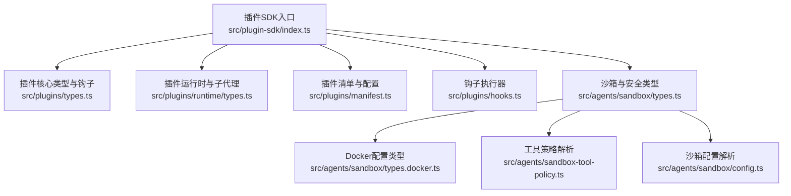
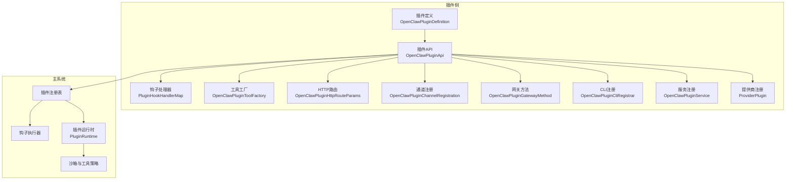
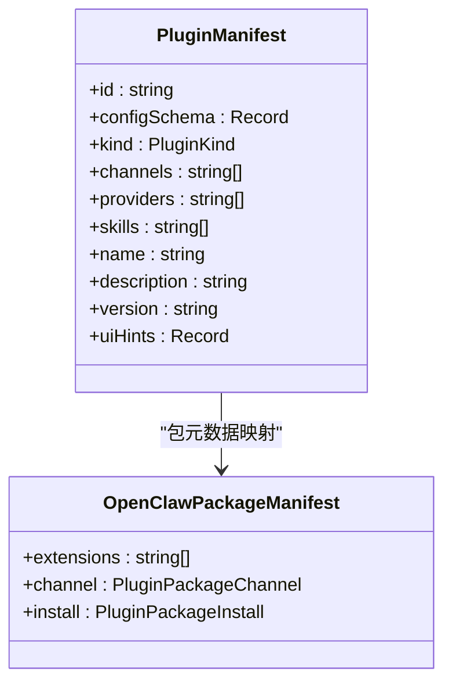
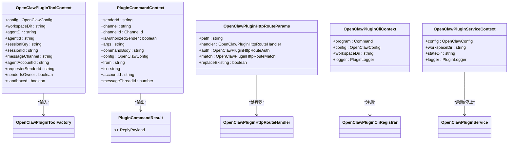
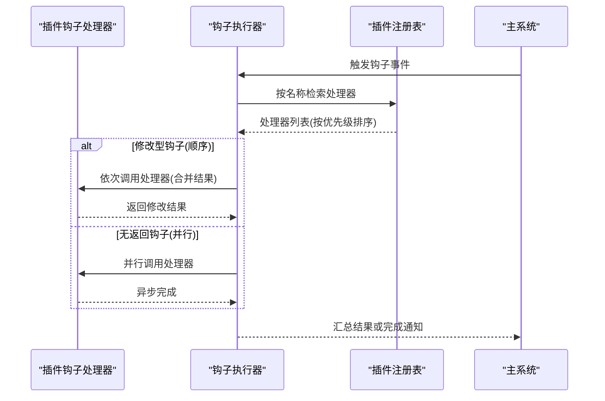
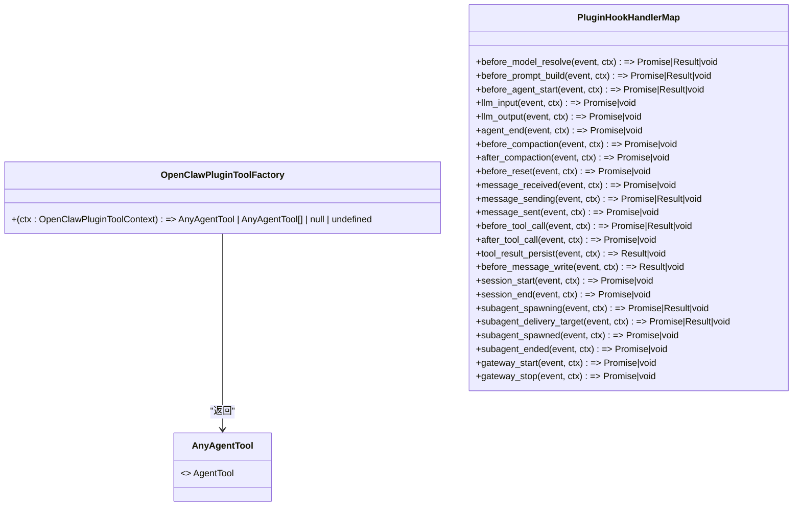
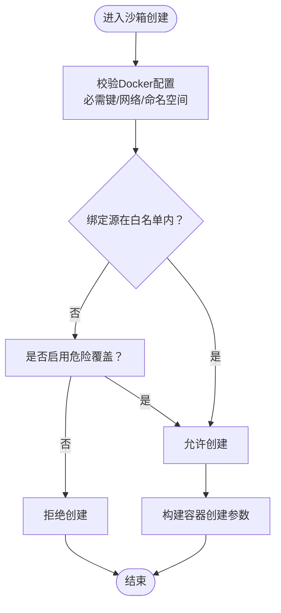
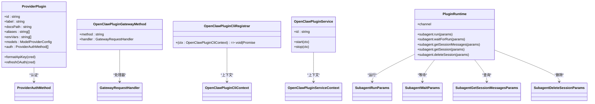
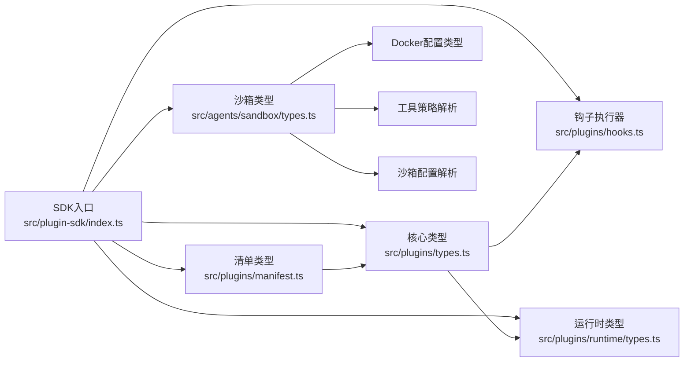

# 插件类型系统

<cite>
**本文档引用的文件**
- [src/plugin-sdk/index.ts](file://src/plugin-sdk/index.ts)
- [src/plugins/types.ts](file://src/plugins/types.ts)
- [src/plugins/runtime/types.ts](file://src/plugins/runtime/types.ts)
- [src/plugins/manifest.ts](file://src/plugins/manifest.ts)
- [src/plugins/hooks.ts](file://src/plugins/hooks.ts)
- [src/agents/sandbox/types.ts](file://src/agents/sandbox/types.ts)
- [src/agents/sandbox/types.docker.ts](file://src/agents/sandbox/types.docker.ts)
- [src/agents/sandbox-tool-policy.ts](file://src/agents/sandbox-tool-policy.ts)
- [src/agents/sandbox/config.ts](file://src/agents/sandbox/config.ts)
- [src/agents/sandbox-create-args.test.ts](file://src/agents/sandbox-create-args.test.ts)
- [src/agents/sandbox-explain.test.ts](file://src/agents/sandbox-explain.test.ts)
- [src/config/zod-schema.agent-runtime.ts](file://src/config/zod-schema.agent-runtime.ts)
- [src/agents/openclaw-tools.ts](file://src/agents/openclaw-tools.ts)
- [src/infra/agent-events.ts](file://src/infra/agent-events.ts)
- [src/agents/pi-tools.types.ts](file://src/agents/pi-tools.types.ts)
- [extensions/diffs/openclaw.plugin.json](file://extensions/diffs/openclaw.plugin.json)
</cite>

## 目录
1. [简介](#简介)
2. [项目结构](#项目结构)
3. [核心组件](#核心组件)
4. [架构总览](#架构总览)
5. [详细组件分析](#详细组件分析)
6. [依赖关系分析](#依赖关系分析)
7. [性能考量](#性能考量)
8. [故障排查指南](#故障排查指南)
9. [结论](#结论)
10. [附录](#附录)

## 简介
本文件为 OpenClaw 插件系统的类型定义参考文档，聚焦于插件 SDK 的核心类型、接口定义与生命周期事件，涵盖插件清单、配置与元数据结构、开发接口的参数与返回类型、插件与主系统的交互消息格式、工具与技能类型、以及权限、安全与沙箱相关类型。文档旨在帮助插件开发者准确理解类型约束、生命周期钩子语义与安全策略，确保插件在不同运行环境中的兼容性与安全性。

## 项目结构
OpenClaw 插件系统由以下关键模块构成：
- 插件 SDK 导出入口：统一导出插件开发所需的类型与工具函数
- 插件核心类型与生命周期：定义插件 API、钩子名称、事件与结果类型
- 插件清单与配置：定义清单结构、配置模式与校验
- 运行时与子代理：定义插件运行时能力与子代理交互接口
- 安全与沙箱：定义工具策略、容器配置与运行时安全策略
- 钩子执行器：定义钩子注册、优先级与合并策略



**图表来源**
- [src/plugin-sdk/index.ts](file://src/plugin-sdk/index.ts#L1-L812)
- [src/plugins/types.ts](file://src/plugins/types.ts#L1-L893)
- [src/plugins/runtime/types.ts](file://src/plugins/runtime/types.ts#L1-L64)
- [src/plugins/manifest.ts](file://src/plugins/manifest.ts#L1-L199)
- [src/plugins/hooks.ts](file://src/plugins/hooks.ts#L1-L763)
- [src/agents/sandbox/types.ts](file://src/agents/sandbox/types.ts#L1-L91)
- [src/agents/sandbox/types.docker.ts](file://src/agents/sandbox/types.docker.ts#L1-L14)
- [src/agents/sandbox-tool-policy.ts](file://src/agents/sandbox-tool-policy.ts#L1-L37)
- [src/agents/sandbox/config.ts](file://src/agents/sandbox/config.ts#L157-L188)

**章节来源**
- [src/plugin-sdk/index.ts](file://src/plugin-sdk/index.ts#L1-L812)

## 核心组件
本节概述插件系统的关键类型与职责边界：
- 插件 API 类型：定义插件对外暴露的能力、注册方法与上下文对象
- 生命周期钩子：定义从模型解析、提示构建、消息发送、工具调用到会话与网关生命周期的事件
- 清单与配置：定义插件清单字段、配置模式与 UI 提示
- 运行时与子代理：定义插件运行时能力与子代理交互接口
- 安全与沙箱：定义工具策略、容器配置与运行时安全策略

**章节来源**
- [src/plugins/types.ts](file://src/plugins/types.ts#L22-L306)
- [src/plugins/types.ts](file://src/plugins/types.ts#L321-L394)
- [src/plugins/manifest.ts](file://src/plugins/manifest.ts#L11-L27)
- [src/plugins/runtime/types.ts](file://src/plugins/runtime/types.ts#L8-L63)
- [src/agents/sandbox/types.ts](file://src/agents/sandbox/types.ts#L6-L91)

## 架构总览
下图展示插件系统在运行时的交互关系：插件通过 SDK 注册工具、钩子、HTTP 路由、通道适配器、网关方法、CLI 与服务，并在生命周期中接收事件回调；同时受沙箱与工具策略约束，确保安全可控。



**图表来源**
- [src/plugins/types.ts](file://src/plugins/types.ts#L248-L306)
- [src/plugins/hooks.ts](file://src/plugins/hooks.ts#L126-L760)
- [src/plugins/runtime/types.ts](file://src/plugins/runtime/types.ts#L51-L63)
- [src/agents/sandbox/types.ts](file://src/agents/sandbox/types.ts#L55-L91)

## 详细组件分析

### 插件 API 与生命周期钩子
- 插件 API：提供注册工具、钩子、HTTP 路由、通道、网关方法、CLI、服务与提供商的能力，并暴露运行时与路径解析等工具
- 生命周期钩子：覆盖模型解析前、提示构建前、代理开始、LLM 输入/输出、会话开始/结束、消息收发、工具调用前后、结果持久化、消息写入、子代理派生与结束、网关启动/停止等阶段
- 钩子事件与结果：每个钩子定义了对应的事件对象与可选结果对象，支持顺序合并或并行执行策略

```mermaid
classDiagram
class OpenClawPluginApi {
+id : string
+name : string
+version : string
+description : string
+source : string
+config : OpenClawConfig
+pluginConfig : Record<string, unknown>
+runtime : PluginRuntime
+logger : PluginLogger
+registerTool(tool, opts)
+registerHook(events, handler, opts)
+registerHttpRoute(params)
+registerChannel(registration)
+registerGatewayMethod(method, handler)
+registerCli(registrar, opts)
+registerService(service)
+registerProvider(provider)
+registerCommand(command)
+registerContextEngine(id, factory)
+resolvePath(input)
+on(hookName, handler, opts)
}
class PluginHookName {
<<enumeration>>
"before_model_resolve"
"before_prompt_build"
"before_agent_start"
"llm_input"
"llm_output"
"agent_end"
"before_compaction"
"after_compaction"
"before_reset"
"message_received"
"message_sending"
"message_sent"
"before_tool_call"
"after_tool_call"
"tool_result_persist"
"before_message_write"
"session_start"
"session_end"
"subagent_spawning"
"subagent_delivery_target"
"subagent_spawned"
"subagent_ended"
"gateway_start"
"gateway_stop"
}
OpenClawPluginApi --> PluginHookName : "on()"
```

**图表来源**
- [src/plugins/types.ts](file://src/plugins/types.ts#L263-L306)
- [src/plugins/types.ts](file://src/plugins/types.ts#L321-L394)

**章节来源**
- [src/plugins/types.ts](file://src/plugins/types.ts#L263-L306)
- [src/plugins/types.ts](file://src/plugins/types.ts#L321-L394)

### 插件清单、配置与元数据
- 清单结构：包含插件标识、配置模式、可选种类、通道/提供商/技能路径、名称、描述、版本与 UI 提示
- 配置模式：通过 JSON Schema 定义，支持 UI 提示键值对，便于生成配置界面
- 包元数据：支持 package.json 中的 openclaw 字段，用于安装与渠道选择



**图表来源**
- [src/plugins/manifest.ts](file://src/plugins/manifest.ts#L11-L27)
- [src/plugins/manifest.ts](file://src/plugins/manifest.ts#L149-L173)

**章节来源**
- [src/plugins/manifest.ts](file://src/plugins/manifest.ts#L11-L27)
- [src/plugins/manifest.ts](file://src/plugins/manifest.ts#L121-L199)

### 插件开发接口：参数与返回类型
- 工具上下文：包含配置、工作空间、代理目录、会话键、会话 ID、消息通道、请求者身份与沙箱状态等
- 工具工厂：根据上下文返回工具集合或空值
- 命令上下文：包含发送者标识、通道、授权状态、命令体、配置与账户信息
- 命令结果：统一为回复载荷类型
- HTTP 路由：定义路径、处理器、认证方式与匹配策略
- CLI 上下文：包含 Commander 程序、配置、工作空间与日志器
- 服务上下文：包含配置、工作空间、状态目录与日志器



**图表来源**
- [src/plugins/types.ts](file://src/plugins/types.ts#L58-L73)
- [src/plugins/types.ts](file://src/plugins/types.ts#L146-L182)
- [src/plugins/types.ts](file://src/plugins/types.ts#L208-L228)
- [src/plugins/types.ts](file://src/plugins/types.ts#L221-L235)

**章节来源**
- [src/plugins/types.ts](file://src/plugins/types.ts#L58-L73)
- [src/plugins/types.ts](file://src/plugins/types.ts#L146-L182)
- [src/plugins/types.ts](file://src/plugins/types.ts#L208-L228)
- [src/plugins/types.ts](file://src/plugins/types.ts#L221-L235)

### 插件与主系统的交互与消息格式
- 钩子事件：按阶段传递事件对象，部分钩子支持修改结果（如消息内容、工具参数、模型/提供商覆盖）
- 并行与顺序执行：消息发送、LLM 输入/输出、代理结束等采用并行执行；工具调用前后、消息写入等采用顺序执行并合并结果
- 子代理交互：提供派生、投递目标解析、已生成与结束事件，支持线程绑定与回声消息控制



**图表来源**
- [src/plugins/hooks.ts](file://src/plugins/hooks.ts#L126-L264)
- [src/plugins/hooks.ts](file://src/plugins/hooks.ts#L203-L224)

**章节来源**
- [src/plugins/hooks.ts](file://src/plugins/hooks.ts#L126-L264)
- [src/plugins/hooks.ts](file://src/plugins/hooks.ts#L203-L224)

### 工具、技能与钩子类型
- 工具类型：统一为代理工具类型别名，插件通过工厂函数注入
- 技能类型：通过清单声明技能目录，配合工具注册形成命令与能力
- 钩子处理器映射：每类钩子定义对应的处理器签名，支持同步与异步返回



**图表来源**
- [src/agents/pi-tools.types.ts](file://src/agents/pi-tools.types.ts#L1-L4)
- [src/plugins/types.ts](file://src/plugins/types.ts#L75-L77)
- [src/plugins/types.ts](file://src/plugins/types.ts#L787-L884)

**章节来源**
- [src/agents/pi-tools.types.ts](file://src/agents/pi-tools.types.ts#L1-L4)
- [src/plugins/types.ts](file://src/plugins/types.ts#L75-L77)
- [src/plugins/types.ts](file://src/plugins/types.ts#L787-L884)

### 权限、安全与沙箱类型
- 工具策略：支持全局、代理级与默认策略的合并，允许与拒绝列表组合
- 沙箱配置：包含模式、作用域、工作空间访问、Docker 与浏览器配置、工具策略与清理策略
- Docker 安全：强制必需键、限制网络模式与命名空间共享，支持危险选项的显式覆盖
- 运行时安全：通过 Zod 模式校验与运行时检查，阻止危险绑定挂载与保留目标路径



**图表来源**
- [src/agents/sandbox/types.ts](file://src/agents/sandbox/types.ts#L55-L91)
- [src/agents/sandbox/types.docker.ts](file://src/agents/sandbox/types.docker.ts#L12-L14)
- [src/agents/sandbox-create-args.test.ts](file://src/agents/sandbox-create-args.test.ts#L259-L302)
- [src/config/zod-schema.agent-runtime.ts](file://src/config/zod-schema.agent-runtime.ts#L483-L511)

**章节来源**
- [src/agents/sandbox-tool-policy.ts](file://src/agents/sandbox-tool-policy.ts#L21-L37)
- [src/agents/sandbox/config.ts](file://src/agents/sandbox/config.ts#L157-L188)
- [src/agents/sandbox/types.ts](file://src/agents/sandbox/types.ts#L55-L91)
- [src/agents/sandbox-create-args.test.ts](file://src/agents/sandbox-create-args.test.ts#L41-L302)
- [src/config/zod-schema.agent-runtime.ts](file://src/config/zod-schema.agent-runtime.ts#L131-L511)

### 插件扩展与自定义功能
- 提供商插件：定义提供商标识、标签、模型配置、认证方法与刷新逻辑
- 网关方法：注册自定义网关处理方法
- CLI 扩展：注册命令行子命令与参数
- 服务扩展：注册后台服务并在启动/停止时执行
- 子代理运行时：提供运行、等待、获取会话消息与删除会话的能力



**图表来源**
- [src/plugins/types.ts](file://src/plugins/types.ts#L122-L132)
- [src/plugins/types.ts](file://src/plugins/types.ts#L134-L137)
- [src/plugins/types.ts](file://src/plugins/types.ts#L228-L241)
- [src/plugins/runtime/types.ts](file://src/plugins/runtime/types.ts#L8-L63)

**章节来源**
- [src/plugins/types.ts](file://src/plugins/types.ts#L122-L132)
- [src/plugins/types.ts](file://src/plugins/types.ts#L134-L137)
- [src/plugins/types.ts](file://src/plugins/types.ts#L228-L241)
- [src/plugins/runtime/types.ts](file://src/plugins/runtime/types.ts#L8-L63)

## 依赖关系分析
- 插件 SDK 统一导出类型与工具，集中于入口文件
- 插件核心类型与钩子定义位于 types.ts，被钩子执行器与运行时广泛依赖
- 清单加载与配置校验依赖边界文件读取与 JSON 解析
- 沙箱与安全策略贯穿运行时与配置校验层



**图表来源**
- [src/plugin-sdk/index.ts](file://src/plugin-sdk/index.ts#L1-L812)
- [src/plugins/types.ts](file://src/plugins/types.ts#L1-L893)
- [src/plugins/runtime/types.ts](file://src/plugins/runtime/types.ts#L1-L64)
- [src/plugins/manifest.ts](file://src/plugins/manifest.ts#L1-L199)
- [src/plugins/hooks.ts](file://src/plugins/hooks.ts#L1-L763)
- [src/agents/sandbox/types.ts](file://src/agents/sandbox/types.ts#L1-L91)
- [src/agents/sandbox/types.docker.ts](file://src/agents/sandbox/types.docker.ts#L1-L14)
- [src/agents/sandbox-tool-policy.ts](file://src/agents/sandbox-tool-policy.ts#L1-L37)
- [src/agents/sandbox/config.ts](file://src/agents/sandbox/config.ts#L157-L188)

**章节来源**
- [src/plugin-sdk/index.ts](file://src/plugin-sdk/index.ts#L1-L812)
- [src/plugins/types.ts](file://src/plugins/types.ts#L1-L893)
- [src/plugins/manifest.ts](file://src/plugins/manifest.ts#L1-L199)
- [src/plugins/hooks.ts](file://src/plugins/hooks.ts#L1-L763)
- [src/agents/sandbox/types.ts](file://src/agents/sandbox/types.ts#L1-L91)

## 性能考量
- 钩子执行策略：修改型钩子顺序执行并合并结果，避免竞态；无返回钩子并行执行提升吞吐
- 子代理运行：提供等待与批量查询接口，减少阻塞与重复 IO
- 沙箱创建：严格的安全校验与参数构建，避免运行时失败带来的重试成本

[本节为通用指导，无需具体文件分析]

## 故障排查指南
- 钩子错误处理：钩子处理器异常会被捕获或抛出，日志器会记录错误信息
- 沙箱创建失败：检查危险覆盖开关与绑定源白名单，确认保留目标路径未被覆盖
- 配置校验失败：依据 Zod 模式与运行时检查输出的错误信息修正配置

**章节来源**
- [src/plugins/hooks.ts](file://src/plugins/hooks.ts#L184-L197)
- [src/agents/sandbox-create-args.test.ts](file://src/agents/sandbox-create-args.test.ts#L259-L302)
- [src/config/zod-schema.agent-runtime.ts](file://src/config/zod-schema.agent-runtime.ts#L139-L163)

## 结论
OpenClaw 插件系统通过明确的类型定义与严格的生命周期钩子设计，提供了强大的扩展能力与可控的安全边界。开发者可通过 SDK 快速注册工具、钩子、HTTP 路由与服务，并在沙箱与工具策略的约束下安全地扩展系统能力。清单与配置模式确保了插件的可维护性与可发现性。

[本节为总结性内容，无需具体文件分析]

## 附录
- 示例清单：差异查看插件的清单展示了配置模式与 UI 提示的组织方式
- 工具解析：插件工具在运行时解析并注入到代理工具集

**章节来源**
- [extensions/diffs/openclaw.plugin.json](file://extensions/diffs/openclaw.plugin.json#L1-L183)
- [src/agents/openclaw-tools.ts](file://src/agents/openclaw-tools.ts#L200-L222)