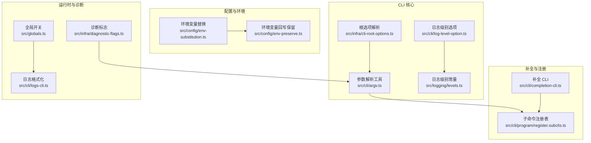
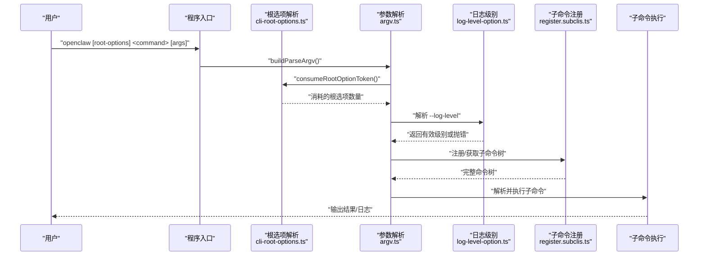
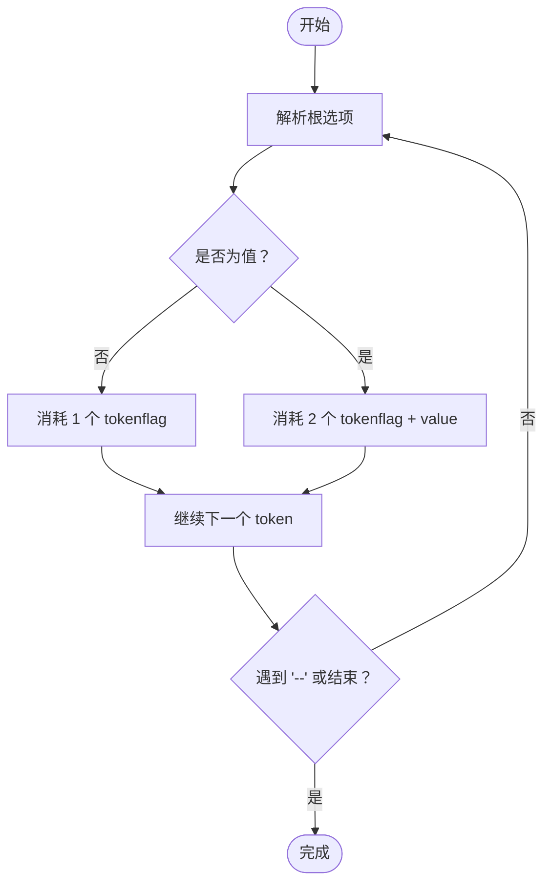
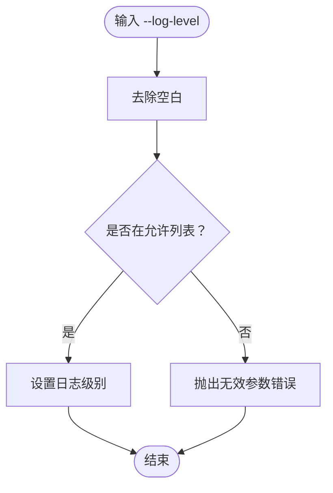
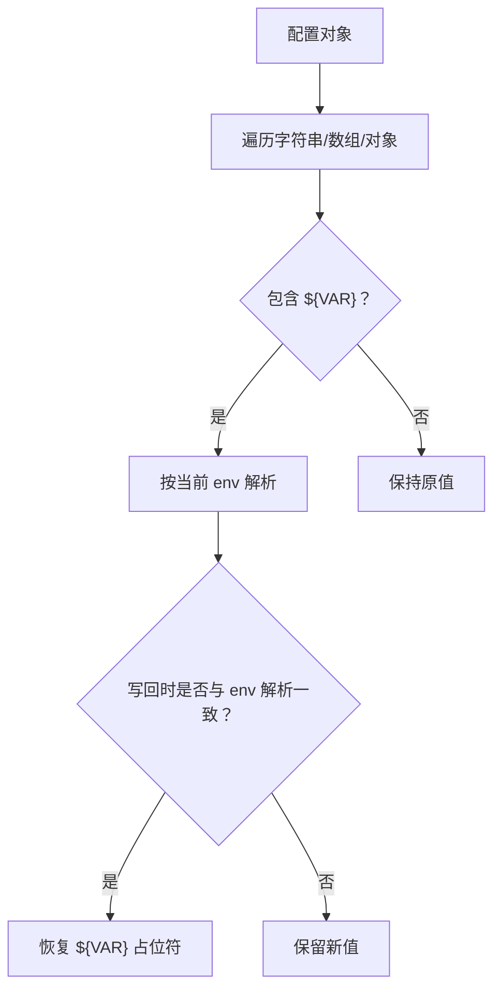
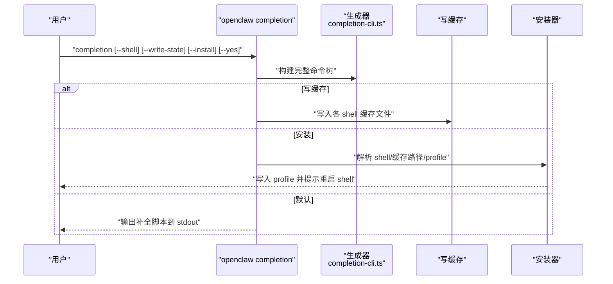
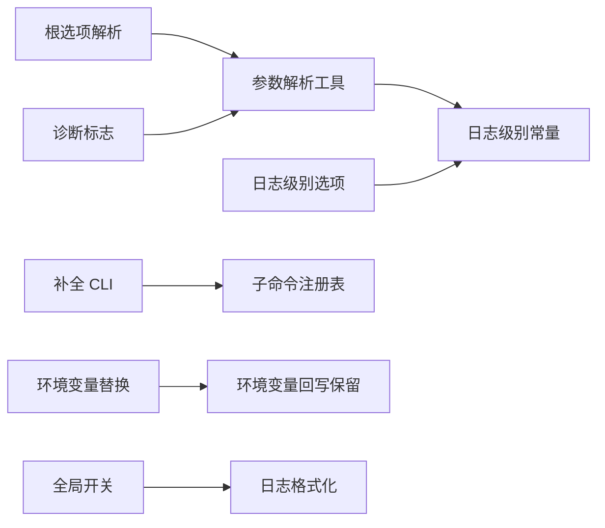

# 命令选项和参数

<cite>
**本文引用的文件**
- [src/infra/cli-root-options.ts](file://src/infra/cli-root-options.ts)
- [src/cli/argv.ts](file://src/cli/argv.ts)
- [src/cli/log-level-option.ts](file://src/cli/log-level-option.ts)
- [src/logging/levels.ts](file://src/logging/levels.ts)
- [src/config/env-substitution.ts](file://src/config/env-substitution.ts)
- [src/config/env-preserve.ts](file://src/config/env-preserve.ts)
- [src/cli/completion-cli.ts](file://src/cli/completion-cli.ts)
- [src/cli/program/register.subclis.ts](file://src/cli/program/register.subclis.ts)
- [src/globals.ts](file://src/globals.ts)
- [src/infra/diagnostic-flags.ts](file://src/infra/diagnostic-flags.ts)
- [src/cli/logs-cli.ts](file://src/cli/logs-cli.ts)
</cite>

## 目录
1. [简介](#简介)
2. [项目结构](#项目结构)
3. [核心组件](#核心组件)
4. [架构总览](#架构总览)
5. [详细组件分析](#详细组件分析)
6. [依赖关系分析](#依赖关系分析)
7. [性能考量](#性能考量)
8. [故障排查指南](#故障排查指南)
9. [结论](#结论)
10. [附录](#附录)

## 简介
本文件系统性梳理 OpenClaw 的命令行选项与参数体系，覆盖以下主题：
- 全局命令行选项：日志级别、输出格式、配置文件路径等
- 参数解析与验证：必填项、可选项、默认值与校验
- 命令行补全：生成、安装与缓存策略
- 环境变量覆盖与优先级：配置加载时的变量替换与回写保留
- 安全与敏感信息处理：避免在日志中泄露敏感数据
- 脚本编写最佳实践与错误处理策略
- 调试模式、详细输出与静默模式的使用

## 项目结构
OpenClaw 的 CLI 子系统由“根选项解析”“通用参数解析”“日志级别选项”“环境变量替换”“补全子命令”“诊断标志”等模块组成，围绕 commander 构建命令树并进行统一解析。

图表来源
- [src/infra/cli-root-options.ts](file://src/infra/cli-root-options.ts#L1-L32)
- [src/cli/argv.ts](file://src/cli/argv.ts#L1-L329)
- [src/cli/log-level-option.ts](file://src/cli/log-level-option.ts#L1-L12)
- [src/logging/levels.ts](file://src/logging/levels.ts#L1-L37)
- [src/config/env-substitution.ts](file://src/config/env-substitution.ts#L1-L203)
- [src/config/env-preserve.ts](file://src/config/env-preserve.ts#L1-L38)
- [src/cli/completion-cli.ts](file://src/cli/completion-cli.ts#L1-L666)
- [src/cli/program/register.subclis.ts](file://src/cli/program/register.subclis.ts#L259-L310)
- [src/globals.ts](file://src/globals.ts#L1-L52)
- [src/infra/diagnostic-flags.ts](file://src/infra/diagnostic-flags.ts#L1-L51)
- [src/cli/logs-cli.ts](file://src/cli/logs-cli.ts#L89-L128)

章节来源
- [src/infra/cli-root-options.ts](file://src/infra/cli-root-options.ts#L1-L32)
- [src/cli/argv.ts](file://src/cli/argv.ts#L1-L329)
- [src/cli/completion-cli.ts](file://src/cli/completion-cli.ts#L1-L666)
- [src/cli/program/register.subclis.ts](file://src/cli/program/register.subclis.ts#L259-L310)

## 核心组件
- 根选项解析器：识别并消费全局布尔/值型选项（如 --dev、--no-color、--profile、--log-level），支持“=值”与“空格分隔”的两种赋值形式，并正确处理“--”终止符。
- 通用参数解析：提供帮助/版本检测、命令路径提取、位置参数抽取、正整数参数解析、verbose/debug 判定等。
- 日志级别选项：对 --log-level 进行严格校验，仅允许受支持的日志级别，否则抛出无效参数错误。
- 环境变量替换：在配置加载阶段将字符串中的 ${VAR} 替换为进程环境变量值；支持缺失变量的警告收集与保留占位符策略。
- 补全子命令：动态生成 zsh/bash/fish/powershell 的补全脚本，支持写入缓存与自动安装到用户 shell 配置文件。
- 诊断标志：从环境变量 OPENCLAW_DIAGNOSTICS 合并诊断开关，支持多值、去重与大小写归一化。
- 日志格式化：根据时间戳、级别、模块/子系统标签与消息进行美化输出，支持彩色与本地时间显示。

章节来源
- [src/infra/cli-root-options.ts](file://src/infra/cli-root-options.ts#L1-L32)
- [src/cli/argv.ts](file://src/cli/argv.ts#L1-L329)
- [src/cli/log-level-option.ts](file://src/cli/log-level-option.ts#L1-L12)
- [src/logging/levels.ts](file://src/logging/levels.ts#L1-L37)
- [src/config/env-substitution.ts](file://src/config/env-substitution.ts#L1-L203)
- [src/config/env-preserve.ts](file://src/config/env-preserve.ts#L1-L38)
- [src/cli/completion-cli.ts](file://src/cli/completion-cli.ts#L1-L666)
- [src/infra/diagnostic-flags.ts](file://src/infra/diagnostic-flags.ts#L1-L51)
- [src/cli/logs-cli.ts](file://src/cli/logs-cli.ts#L89-L128)

## 架构总览
OpenClaw CLI 的控制流如下：启动时构建 argv 规范化数组，先解析根选项，再按子命令树解析具体命令与参数；日志级别与诊断标志在解析早期即被应用，确保后续流程按预期输出。

图表来源
- [src/cli/argv.ts](file://src/cli/argv.ts#L276-L301)
- [src/infra/cli-root-options.ts](file://src/infra/cli-root-options.ts#L16-L31)
- [src/cli/log-level-option.ts](file://src/cli/log-level-option.ts#L6-L12)
- [src/cli/program/register.subclis.ts](file://src/cli/program/register.subclis.ts#L259-L310)

## 详细组件分析

### 根选项与参数解析
- 支持的全局布尔选项：--dev、--no-color
- 支持的全局值选项：--profile、--log-level
- 值解析规则：
  - “--flag=value” 形式视为单 token 消耗
  - “--flag value” 形式仅当 value 非选项且非“--”时才作为值
  - “--”之后的内容停止解析为选项
- 命令路径与位置参数：
  - 提供“跳过根选项”的命令路径提取，用于路由与参数抽取
  - 位置参数抽取时会跳过未知选项，保证健壮性
- 版本/帮助判定：
  - 仅当 --version 或 -V 出现在根位置时才视为根级调用
  - -v 可作为 --version 的别名，但需满足根级条件

图表来源
- [src/infra/cli-root-options.ts](file://src/infra/cli-root-options.ts#L16-L31)
- [src/cli/argv.ts](file://src/cli/argv.ts#L197-L225)

章节来源
- [src/infra/cli-root-options.ts](file://src/infra/cli-root-options.ts#L1-L32)
- [src/cli/argv.ts](file://src/cli/argv.ts#L127-L184)
- [src/cli/argv.ts](file://src/cli/argv.ts#L197-L225)
- [src/cli/argv.ts](file://src/cli/argv.ts#L227-L274)

### 日志级别与输出格式
- 受支持的日志级别：silent、fatal、error、warn、info、debug、trace
- --log-level 选项：
  - 严格校验输入，不合法值抛出 InvalidArgumentError
  - 允许前后空白字符，内部会 trim 后匹配
- 输出格式：
  - 支持普通/美化输出，可选择本地时间显示与彩色
  - 将日志行解析为结构化对象后格式化输出

图表来源
- [src/cli/log-level-option.ts](file://src/cli/log-level-option.ts#L6-L12)
- [src/logging/levels.ts](file://src/logging/levels.ts#L13-L23)
- [src/cli/logs-cli.ts](file://src/cli/logs-cli.ts#L89-L128)

章节来源
- [src/cli/log-level-option.ts](file://src/cli/log-level-option.ts#L1-L12)
- [src/logging/levels.ts](file://src/logging/levels.ts#L1-L37)
- [src/cli/logs-cli.ts](file://src/cli/logs-cli.ts#L89-L128)

### 环境变量覆盖与优先级
- 配置加载时替换：
  - 字符串中的 ${VAR} 在配置解析后被替换为 process.env 中的值
  - 仅匹配大写/下划线命名规范的变量
  - 缺失变量默认抛出 MissingEnvVarError；可通过回调收集警告而不中断
- 回写保留策略：
  - 写回配置时，若新值与当前环境变量解析结果一致，则恢复原 ${VAR} 占位符，避免丢失环境变量语义
- 优先级建议（基于实现行为推导）：
  - CLI 显式传入的值通常优先于配置文件中的默认值（通过 commander 的 getOptionValueSource 判断）
  - 环境变量替换发生在配置加载阶段，最终生效值以“替换后的配置”为准

图表来源
- [src/config/env-substitution.ts](file://src/config/env-substitution.ts#L161-L203)
- [src/config/env-preserve.ts](file://src/config/env-preserve.ts#L21-L38)

章节来源
- [src/config/env-substitution.ts](file://src/config/env-substitution.ts#L1-L203)
- [src/config/env-preserve.ts](file://src/config/env-preserve.ts#L1-L38)

### 命令行补全功能
- 支持 shell：zsh、bash、fish、powershell
- 功能：
  - 生成补全脚本并输出到 stdout
  - 将脚本写入缓存目录（$OPENCLAW_STATE_DIR/completions）
  - 自动安装到用户 shell 配置文件（支持交互确认与非交互 yes）
- 安装逻辑：
  - 自动识别 SHELL 名称并推断目标 profile 文件
  - 使用带注释头块的方式追加/更新补全注入行
  - 支持检测慢速动态加载模式（source <(...)）并提示优化

图表来源
- [src/cli/completion-cli.ts](file://src/cli/completion-cli.ts#L231-L301)
- [src/cli/completion-cli.ts](file://src/cli/completion-cli.ts#L303-L377)
- [src/cli/completion-cli.ts](file://src/cli/completion-cli.ts#L379-L484)
- [src/cli/completion-cli.ts](file://src/cli/completion-cli.ts#L486-L592)
- [src/cli/completion-cli.ts](file://src/cli/completion-cli.ts#L594-L666)

章节来源
- [src/cli/completion-cli.ts](file://src/cli/completion-cli.ts#L1-L666)
- [src/cli/program/register.subclis.ts](file://src/cli/program/register.subclis.ts#L302-L310)

### 调试模式、详细输出与静默模式
- 调试模式：
  - 通过 --log-level debug/trace 获取更细粒度日志
  - 通过 --debug（在支持场景下）提升 verbose 等级
- 详细输出：
  - 通过 --verbose 打印额外信息；结合日志级别与全局 verbose 标志
  - 全局 verbose 标志影响控制台输出样式与内容
- 静默模式：
  - 通过 --log-level silent 关闭控制台日志输出
  - 仍可将日志写入文件（取决于文件日志级别）

章节来源
- [src/cli/argv.ts](file://src/cli/argv.ts#L127-L135)
- [src/globals.ts](file://src/globals.ts#L1-L52)
- [src/logging/levels.ts](file://src/logging/levels.ts#L25-L37)

### 诊断标志与环境变量
- 诊断标志来源：
  - 配置文件中的 diagnostics.flags 数组
  - 环境变量 OPENCLAW_DIAGNOSTICS（支持 0/false/off/none 与 1/true/all/*）
- 合并与去重：
  - 多源合并后进行大小写归一化与去重

章节来源
- [src/infra/diagnostic-flags.ts](file://src/infra/diagnostic-flags.ts#L1-L51)

## 依赖关系分析
- 根选项解析依赖通用参数解析工具（如“--”终止符、值判定）
- 日志级别解析依赖日志级别常量定义
- 补全子命令依赖子命令注册表以构建完整命令树
- 环境变量替换与回写保留分别作用于配置读取与写回阶段
- 全局 verbose 与日志格式化共同决定输出风格

图表来源
- [src/infra/cli-root-options.ts](file://src/infra/cli-root-options.ts#L1-L32)
- [src/cli/argv.ts](file://src/cli/argv.ts#L1-L329)
- [src/logging/levels.ts](file://src/logging/levels.ts#L1-L37)
- [src/cli/log-level-option.ts](file://src/cli/log-level-option.ts#L1-L12)
- [src/cli/completion-cli.ts](file://src/cli/completion-cli.ts#L1-L666)
- [src/cli/program/register.subclis.ts](file://src/cli/program/register.subclis.ts#L259-L310)
- [src/config/env-substitution.ts](file://src/config/env-substitution.ts#L1-L203)
- [src/config/env-preserve.ts](file://src/config/env-preserve.ts#L1-L38)
- [src/globals.ts](file://src/globals.ts#L1-L52)
- [src/cli/logs-cli.ts](file://src/cli/logs-cli.ts#L89-L128)
- [src/infra/diagnostic-flags.ts](file://src/infra/diagnostic-flags.ts#L1-L51)

章节来源
- [src/cli/argv.ts](file://src/cli/argv.ts#L1-L329)
- [src/cli/log-level-option.ts](file://src/cli/log-level-option.ts#L1-L12)
- [src/config/env-substitution.ts](file://src/config/env-substitution.ts#L1-L203)
- [src/cli/completion-cli.ts](file://src/cli/completion-cli.ts#L1-L666)

## 性能考量
- 补全缓存：优先写入缓存文件并在 profile 中引用缓存路径，避免每次启动都执行动态生成，显著降低 shell 启动开销
- 延迟注册：子命令采用延迟注册策略，仅在需要时构建完整命令树，减少启动时的解析成本
- 选项解析短路：根选项解析器在遇到“--”或未知选项时及时短路，避免无谓扫描

章节来源
- [src/cli/completion-cli.ts](file://src/cli/completion-cli.ts#L85-L97)
- [src/cli/completion-cli.ts](file://src/cli/completion-cli.ts#L231-L301)
- [src/infra/cli-root-options.ts](file://src/infra/cli-root-options.ts#L16-L31)

## 故障排查指南
- 无效日志级别
  - 现象：传入 --log-level 后报“无效参数”
  - 排查：确认值是否在允许列表内（silent/fatal/error/warn/info/debug/trace），注意大小写与空白
- 环境变量缺失
  - 现象：配置加载时报缺少环境变量
  - 排查：检查 ${VAR} 是否存在于 process.env；或使用 onMissing 回调收集警告而非抛错
- 补全未生效
  - 现象：安装后 shell 无补全
  - 排查：确认已写入缓存；检查 profile 是否包含正确的 source 行；避免使用慢速动态加载模式
- verbose 输出异常
  - 现象：开启 --verbose 未见详细输出
  - 排查：确认日志级别不低于 debug；检查全局 verbose 标志是否启用

章节来源
- [src/cli/log-level-option.ts](file://src/cli/log-level-option.ts#L6-L12)
- [src/config/env-substitution.ts](file://src/config/env-substitution.ts#L29-L37)
- [src/cli/completion-cli.ts](file://src/cli/completion-cli.ts#L314-L322)
- [src/globals.ts](file://src/globals.ts#L15-L32)

## 结论
OpenClaw 的命令行选项与参数系统以“根选项优先、严格校验、可扩展注册、环境变量透明替换”为核心设计原则。通过补全缓存、延迟注册与健壮的解析器，既保证了开发体验，也兼顾了启动性能与安全性。建议在自动化脚本中优先使用显式选项与缓存补全，配合环境变量与诊断标志进行可控的调试与排障。

## 附录

### 常用选项清单与默认值
- --dev：布尔，启用开发者模式（根选项）
- --no-color：布尔，禁用彩色输出（根选项）
- --profile：字符串，配置文件档位（根选项）
- --log-level：字符串，日志级别（silent/fatal/error/warn/info/debug/trace），默认 info
- --verbose：布尔，提升详细输出（通用）
- --debug：布尔，提升调试级别（通用）
- --version/-V：布尔，显示版本（根选项）
- -h/--help：布尔，显示帮助（根选项）

章节来源
- [src/infra/cli-root-options.ts](file://src/infra/cli-root-options.ts#L3-L4)
- [src/cli/log-level-option.ts](file://src/cli/log-level-option.ts#L4-L12)
- [src/cli/argv.ts](file://src/cli/argv.ts#L12-L16)
- [src/cli/argv.ts](file://src/cli/argv.ts#L127-L135)