# 插件管理命令

<cite>
**本文档引用的文件**
- [src/cli/plugins-cli.ts](file://src/cli/plugins-cli.ts)
- [docs/cli/plugins.md](file://docs/cli/plugins.md)
- [src/plugins/uninstall.ts](file://src/plugins/uninstall.ts)
- [src/plugins/toggle-config.ts](file://src/plugins/toggle-config.ts)
- [docs/plugins/manifest.md](file://docs/plugins/manifest.md)
- [src/config/validation.ts](file://src/config/validation.ts)
- [src/plugins/loader.ts](file://src/plugins/loader.ts)
- [src/gateway/config-reload.ts](file://src/gateway/config-reload.ts)
- [src/gateway/server-reload-handlers.ts](file://src/gateway/server-reload-handlers.ts)
- [src/gateway/server.impl.ts](file://src/gateway/server.impl.ts)
- [src/cli/program/config-guard.ts](file://src/cli/program/config-guard.ts)
- [src/commands/doctor-config-flow.ts](file://src/commands/doctor-config-flow.ts)
- [src/security/audit-extra.async.ts](file://src/security/audit-extra.async.ts)
- [src/plugins/install.test.ts](file://src/plugins/install.test.ts)
- [extensions/open-prose/skills/prose/examples/45-plugin-release.prose](file://extensions/open-prose/skills/prose/examples/45-plugin-release.prose)
</cite>

## 目录
1. [简介](#简介)
2. [项目结构](#项目结构)
3. [核心组件](#核心组件)
4. [架构总览](#架构总览)
5. [详细组件分析](#详细组件分析)
6. [依赖关系分析](#依赖关系分析)
7. [性能考量](#性能考量)
8. [故障排除指南](#故障排除指南)
9. [结论](#结论)
10. [附录](#附录)

## 简介
本文件面向使用 OpenClaw 的开发者与运维人员，系统化梳理“plugins-cli”命令族的使用方法与内部机制，覆盖插件安装、卸载、更新、启用/禁用、配置校验与 Doctor 修复、版本与完整性校验、冲突与兼容性处理、重载与重启策略、配置文件编辑与验证、开发/测试/发布流程以及性能监控与故障排除等主题。目标是帮助你在安全可控的前提下高效管理插件生态。

## 项目结构
围绕插件 CLI 的关键位置如下：
- CLI 命令入口与实现：src/cli/plugins-cli.ts
- CLI 文档：docs/cli/plugins.md
- 卸载逻辑：src/plugins/uninstall.ts
- 启用/禁用配置变更：src/plugins/toggle-config.ts
- 插件清单与配置校验：docs/plugins/manifest.md、src/config/validation.ts、src/plugins/loader.ts
- 配置热重载与重启：src/gateway/config-reload.ts、src/gateway/server-reload-handlers.ts、src/gateway/server.impl.ts
- 配置无效时的门控与 Doctor 流程：src/cli/program/config-guard.ts、src/commands/doctor-config-flow.ts
- 安全审计与版本固定：src/security/audit-extra.async.ts
- 开发/测试/发布辅助：src/plugins/install.test.ts、extensions/open-prose/skills/prose/examples/45-plugin-release.prose

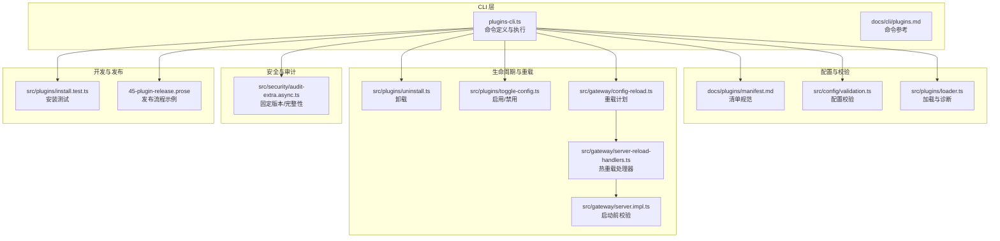

图表来源
- [src/cli/plugins-cli.ts](file://src/cli/plugins-cli.ts#L364-L827)
- [docs/cli/plugins.md](file://docs/cli/plugins.md#L1-L103)
- [src/plugins/uninstall.ts](file://src/plugins/uninstall.ts#L65-L104)
- [src/plugins/toggle-config.ts](file://src/plugins/toggle-config.ts#L4-L48)
- [docs/plugins/manifest.md](file://docs/plugins/manifest.md#L1-L76)
- [src/config/validation.ts](file://src/config/validation.ts#L350-L384)
- [src/plugins/loader.ts](file://src/plugins/loader.ts#L706-L749)
- [src/gateway/config-reload.ts](file://src/gateway/config-reload.ts#L54-L182)
- [src/gateway/server-reload-handlers.ts](file://src/gateway/server-reload-handlers.ts#L52-L236)
- [src/gateway/server.impl.ts](file://src/gateway/server.impl.ts#L308-L331)
- [src/security/audit-extra.async.ts](file://src/security/audit-extra.async.ts#L202-L252)
- [src/plugins/install.test.ts](file://src/plugins/install.test.ts#L61-L356)
- [extensions/open-prose/skills/prose/examples/45-plugin-release.prose](file://extensions/open-prose/skills/prose/examples/45-plugin-release.prose#L138-L159)

章节来源
- [src/cli/plugins-cli.ts](file://src/cli/plugins-cli.ts#L364-L827)
- [docs/cli/plugins.md](file://docs/cli/plugins.md#L1-L103)

## 核心组件
- 插件 CLI 命令族：list、info、enable、disable、install、uninstall、update、doctor
- 配置与清单：openclaw.plugin.json 必须包含 id 与 configSchema；严格校验未知键、未知插件 id、缺失/损坏清单等
- 生命周期与重载：支持热重载与必要时重启；配置无效时限制非诊断命令
- 安全与完整性：固定版本与完整性哈希校验，必要时交互确认
- 开发/测试/发布：安装测试用例、Prose 发布工作流示例

章节来源
- [docs/plugins/manifest.md](file://docs/plugins/manifest.md#L1-L76)
- [src/config/validation.ts](file://src/config/validation.ts#L350-L384)
- [src/gateway/config-reload.ts](file://src/gateway/config-reload.ts#L54-L182)
- [src/security/audit-extra.async.ts](file://src/security/audit-extra.async.ts#L202-L252)

## 架构总览
下图展示 plugins-cli 命令如何与配置、加载器、重载与 Doctor 流程协作：

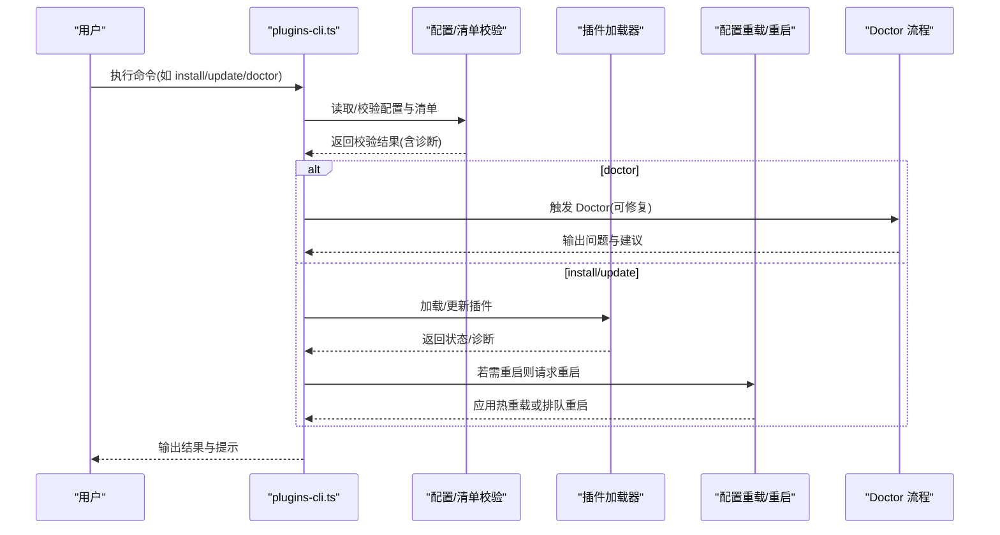

图表来源
- [src/cli/plugins-cli.ts](file://src/cli/plugins-cli.ts#L380-L827)
- [src/config/validation.ts](file://src/config/validation.ts#L350-L384)
- [src/plugins/loader.ts](file://src/plugins/loader.ts#L706-L749)
- [src/gateway/config-reload.ts](file://src/gateway/config-reload.ts#L150-L182)
- [src/gateway/server-reload-handlers.ts](file://src/gateway/server-reload-handlers.ts#L52-L236)
- [src/commands/doctor-config-flow.ts](file://src/commands/doctor-config-flow.ts#L1724-L1761)

## 详细组件分析

### 命令：plugins list/info/enable/disable
- 列表与详情：支持 JSON 输出、仅显示已启用、详细模式
- 启用/禁用：通过修改 plugins.entries.<id>.enabled 并联动内置通道的启用状态
- 重载提示：修改后需重启网关以生效

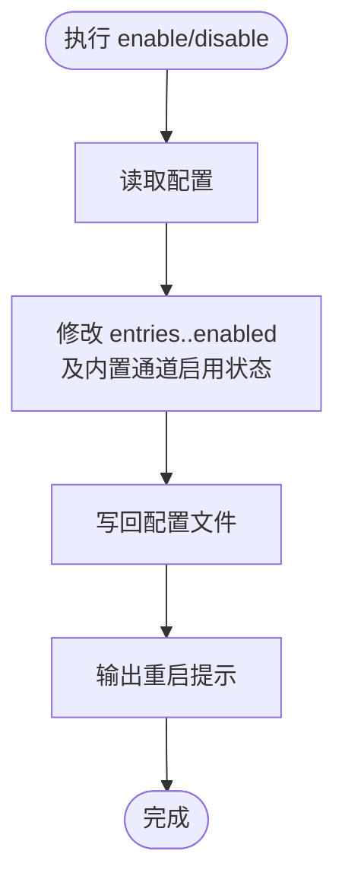

图表来源
- [src/plugins/toggle-config.ts](file://src/plugins/toggle-config.ts#L4-L48)
- [src/cli/plugins-cli.ts](file://src/cli/plugins-cli.ts#L380-L384)

章节来源
- [src/plugins/toggle-config.ts](file://src/plugins/toggle-config.ts#L4-L48)
- [src/cli/plugins-cli.ts](file://src/cli/plugins-cli.ts#L380-L384)

### 命令：plugins install
- 支持本地路径、归档(.zip/.tgz/.tar.gz/.tar)、npm 规范
- 本地目录可选择链接(--link)避免复制；链接会加入 plugins.load.paths
- npm 安装支持 --pin 固定解析到的确切版本
- 安全策略：拒绝裸 semver/URL/Git 规范；依赖安装忽略脚本；预发布版本需显式 opt-in
- 安装完成后输出重启提示

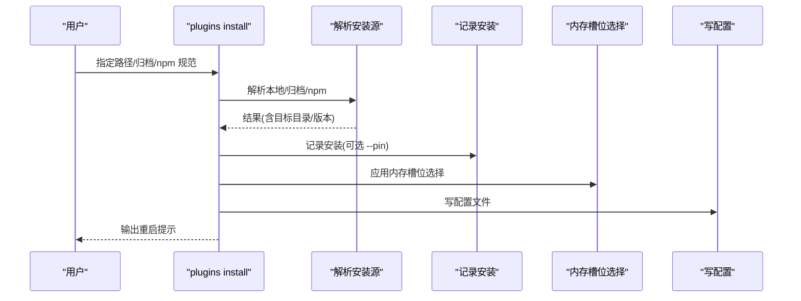

图表来源
- [src/cli/plugins-cli.ts](file://src/cli/plugins-cli.ts#L720-L727)
- [src/cli/plugins-cli.ts](file://src/cli/plugins-cli.ts#L156-L197)
- [src/cli/plugins-cli.ts](file://src/cli/plugins-cli.ts#L343-L363)

章节来源
- [src/cli/plugins-cli.ts](file://src/cli/plugins-cli.ts#L720-L727)
- [src/cli/plugins-cli.ts](file://src/cli/plugins-cli.ts#L156-L197)
- [docs/cli/plugins.md](file://docs/cli/plugins.md#L39-L71)

### 命令：plugins uninstall
- 支持 --dry-run 预演、--keep-files 保留磁盘文件、--force 跳过确认
- 删除范围：plugins.entries、plugins.installs、允许白名单、plugins.load.paths、内存槽位、插件目录
- 对活动内存插件，内存槽位重置为 memory-core

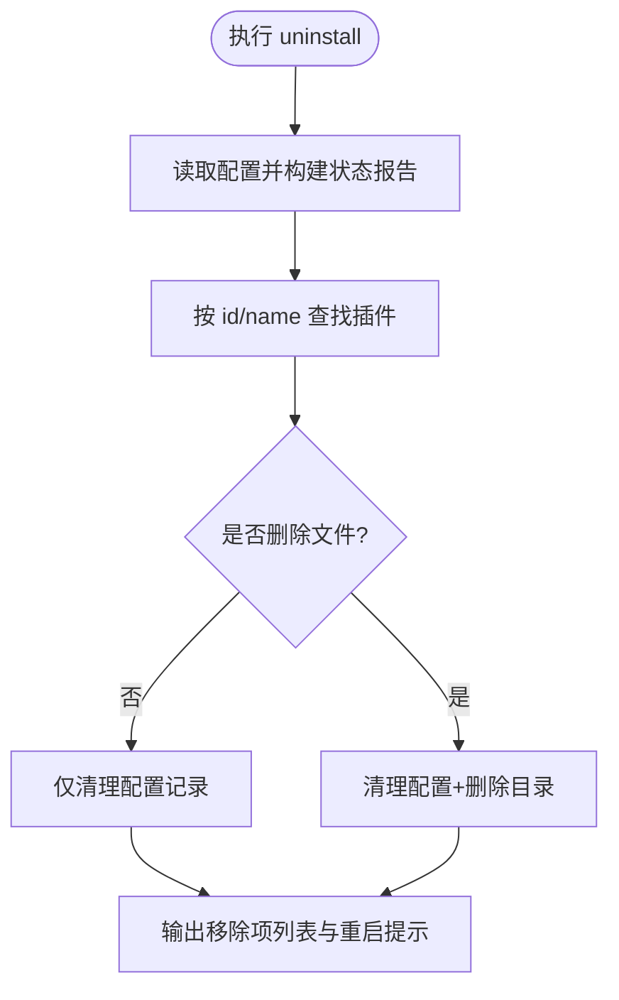

图表来源
- [src/cli/plugins-cli.ts](file://src/cli/plugins-cli.ts#L584-L717)
- [src/plugins/uninstall.ts](file://src/plugins/uninstall.ts#L65-L104)

章节来源
- [src/cli/plugins-cli.ts](file://src/cli/plugins-cli.ts#L584-L717)
- [src/plugins/uninstall.ts](file://src/plugins/uninstall.ts#L65-L104)
- [docs/cli/plugins.md](file://docs/cli/plugins.md#L72-L89)

### 命令：plugins update
- 仅对 npm 安装的插件生效；支持 --all 全量更新与 --dry-run 预演
- 当存储的完整性哈希存在且下载产物哈希变化时，会警告并询问确认；CI 可用全局 --yes 跳过交互
- 更新成功后若发生变更，写回配置并提示重启

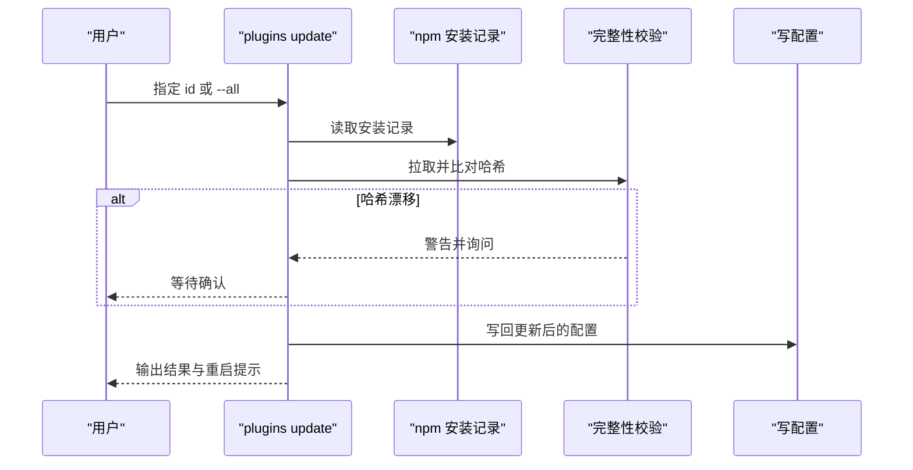

图表来源
- [src/cli/plugins-cli.ts](file://src/cli/plugins-cli.ts#L729-L789)
- [src/security/audit-extra.async.ts](file://src/security/audit-extra.async.ts#L202-L252)

章节来源
- [src/cli/plugins-cli.ts](file://src/cli/plugins-cli.ts#L729-L789)
- [docs/cli/plugins.md](file://docs/cli/plugins.md#L90-L103)
- [src/security/audit-extra.async.ts](file://src/security/audit-extra.async.ts#L202-L252)

### 命令：plugins doctor
- 报告插件错误与诊断；无问题时提示未发现问题
- Doctor 流程：每次加载配置时运行(默认 dry-run)，无效配置时给出可操作建议与修复指引

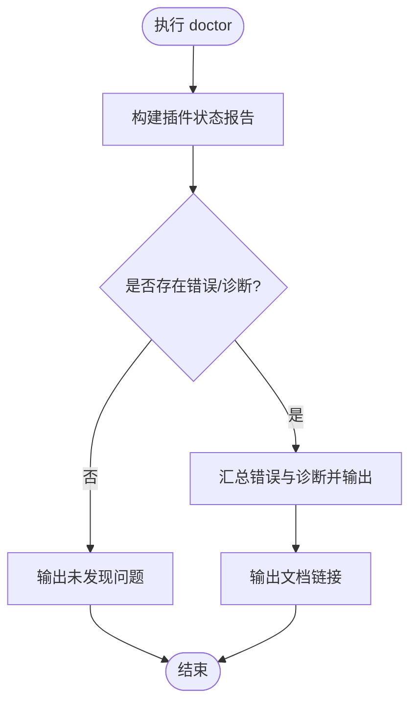

图表来源
- [src/cli/plugins-cli.ts](file://src/cli/plugins-cli.ts#L791-L825)
- [src/commands/doctor-config-flow.ts](file://src/commands/doctor-config-flow.ts#L1724-L1761)

章节来源
- [src/cli/plugins-cli.ts](file://src/cli/plugins-cli.ts#L791-L825)
- [src/commands/doctor-config-flow.ts](file://src/commands/doctor-config-flow.ts#L1724-L1761)

### 插件清单与配置校验
- 清单要求：openclaw.plugin.json 必须包含 id 与 configSchema；空 Schema 可接受
- 校验行为：未知 channels.* 键、未知插件 id、缺失/损坏清单均视为错误；禁用插件保留配置并在 Doctor 与日志中警告
- 加载阶段：manifest 用于发现与校验；运行时仍单独加载模块

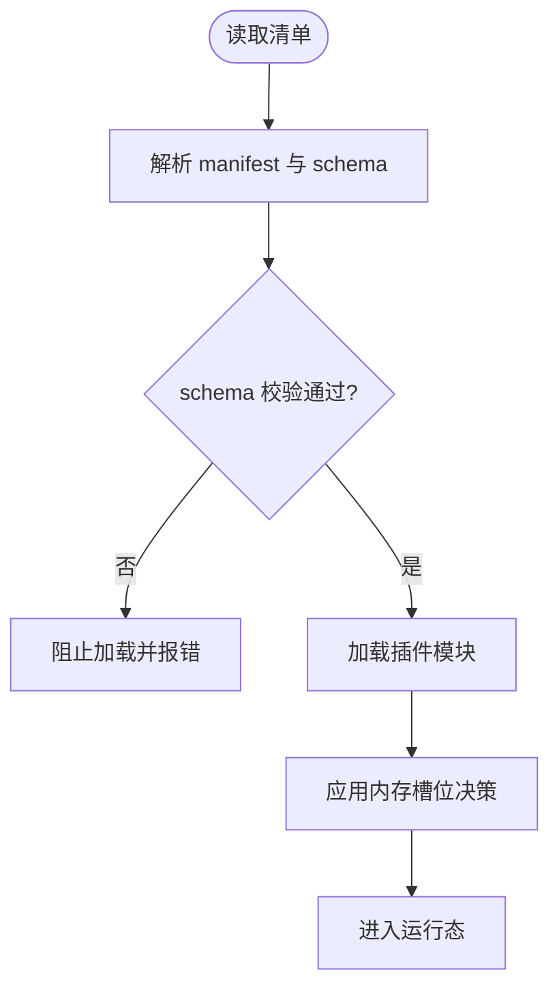

图表来源
- [docs/plugins/manifest.md](file://docs/plugins/manifest.md#L1-L76)
- [src/plugins/loader.ts](file://src/plugins/loader.ts#L706-L749)

章节来源
- [docs/plugins/manifest.md](file://docs/plugins/manifest.md#L1-L76)
- [src/config/validation.ts](file://src/config/validation.ts#L350-L384)
- [src/plugins/loader.ts](file://src/plugins/loader.ts#L706-L749)

### 配置无效时的门控与 Doctor
- 非诊断命令在配置无效时会直接失败并提示运行 doctor --fix
- Doctor 默认 dry-run，支持 --fix 自动修复并写回配置

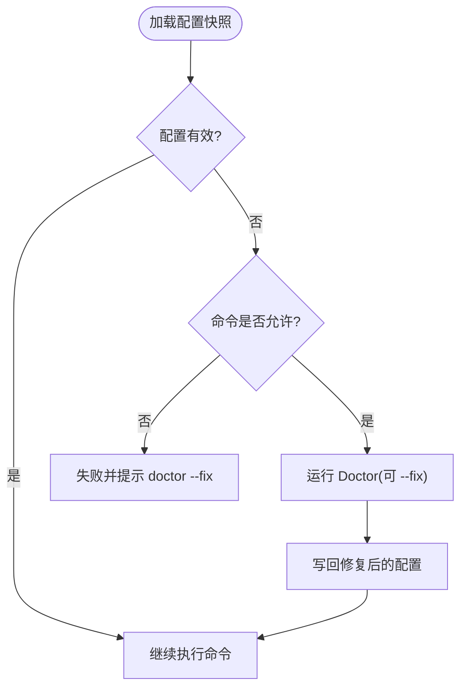

图表来源
- [src/cli/program/config-guard.ts](file://src/cli/program/config-guard.ts#L1-L39)
- [src/gateway/server.impl.ts](file://src/gateway/server.impl.ts#L308-L331)
- [src/commands/doctor-config-flow.ts](file://src/commands/doctor-config-flow.ts#L1724-L1761)

章节来源
- [src/cli/program/config-guard.ts](file://src/cli/program/config-guard.ts#L1-L39)
- [src/gateway/server.impl.ts](file://src/gateway/server.impl.ts#L308-L331)
- [src/commands/doctor-config-flow.ts](file://src/commands/doctor-config-flow.ts#L1724-L1761)

### 配置热重载与重启策略
- 重载模式：off/restart/hot/hybrid；根据变更路径决定热重载或重启
- 热重载处理器：动态调整钩子、心跳、定时任务、浏览器控制与通道健康监控
- 启动前校验：无效配置直接抛出错误并引导 Doctor 修复

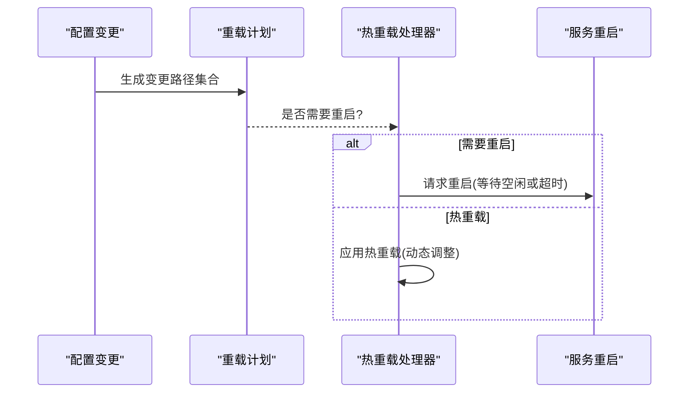

图表来源
- [src/gateway/config-reload.ts](file://src/gateway/config-reload.ts#L54-L182)
- [src/gateway/server-reload-handlers.ts](file://src/gateway/server-reload-handlers.ts#L52-L236)
- [src/gateway/server.impl.ts](file://src/gateway/server.impl.ts#L308-L331)

章节来源
- [src/gateway/config-reload.ts](file://src/gateway/config-reload.ts#L54-L182)
- [src/gateway/server-reload-handlers.ts](file://src/gateway/server-reload-handlers.ts#L52-L236)
- [src/gateway/server.impl.ts](file://src/gateway/server.impl.ts#L308-L331)

### 版本控制、兼容性与冲突处理
- 版本固定：--pin 记录解析到的确切版本；npm bare 规范与 @latest 保持稳定轨道
- 预发布版本：需显式使用 @beta/@rc 或精确预发布版本
- 完整性校验：若存储完整性哈希与实际产物不一致，提示并确认
- 冲突与兼容：通过 plugins.slots.* 选择排他性插件种类；未知 id 与未知 channels.* 键视为错误

章节来源
- [docs/cli/plugins.md](file://docs/cli/plugins.md#L48-L71)
- [src/security/audit-extra.async.ts](file://src/security/audit-extra.async.ts#L231-L252)
- [docs/plugins/manifest.md](file://docs/plugins/manifest.md#L53-L76)

### 插件启用、禁用与重载
- 启用/禁用：修改 entries.<id>.enabled 并联动内置通道启用状态
- 重载提示：修改后输出重启提示；实际是否热重载取决于重载策略与变更路径

章节来源
- [src/plugins/toggle-config.ts](file://src/plugins/toggle-config.ts#L4-L48)
- [src/gateway/config-reload.ts](file://src/gateway/config-reload.ts#L150-L182)

### 插件配置文件的编辑与验证
- 编辑方式：通过 CLI 修改 plugins.entries、plugins.installs、plugins.allow、plugins.load.paths、plugins.slots.*
- 验证时机：配置读取/写入时进行 schema 校验；Doctor 提供 dry-run 与 --fix
- 未知键与未知 id：严格错误；禁用插件保留配置但警告

章节来源
- [docs/plugins/manifest.md](file://docs/plugins/manifest.md#L53-L76)
- [src/config/validation.ts](file://src/config/validation.ts#L350-L384)
- [src/commands/doctor-config-flow.ts](file://src/commands/doctor-config-flow.ts#L1724-L1761)

### 插件开发、测试与发布
- 开发：编写 openclaw.plugin.json 与 configSchema；确保清单与 schema 正确
- 测试：安装测试用例覆盖多种安装场景与归档打包
- 发布：Prose 示例工作流包含创建 GitHub Release、市场验证、安装测试与输出验证结果

章节来源
- [src/plugins/install.test.ts](file://src/plugins/install.test.ts#L61-L356)
- [extensions/open-prose/skills/prose/examples/45-plugin-release.prose](file://extensions/open-prose/skills/prose/examples/45-plugin-release.prose#L138-L159)

### 插件性能监控与故障排除
- 性能聚合：提供延迟与用量聚合工具，可用于分析插件相关成本与耗时趋势
- 故障排除：doctor 命令输出问题摘要与修复建议；无效配置时限制非诊断命令执行

章节来源
- [src/shared/usage-aggregates.ts](file://src/shared/usage-aggregates.ts#L1-L109)
- [src/cli/plugins-cli.ts](file://src/cli/plugins-cli.ts#L791-L825)
- [src/cli/program/config-guard.ts](file://src/cli/program/config-guard.ts#L1-L39)

## 依赖关系分析
- 命令层依赖配置与清单校验、加载器与 Doctor 流程
- 卸载与启用/禁用分别影响配置记录与内存槽位
- 重载策略受配置变更路径与模式设置影响

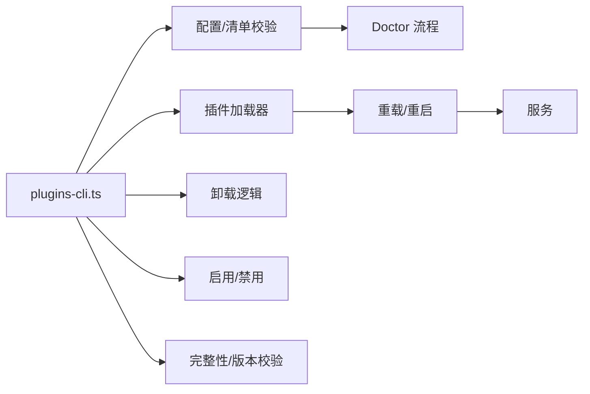

图表来源
- [src/cli/plugins-cli.ts](file://src/cli/plugins-cli.ts#L364-L827)
- [src/plugins/uninstall.ts](file://src/plugins/uninstall.ts#L65-L104)
- [src/plugins/toggle-config.ts](file://src/plugins/toggle-config.ts#L4-L48)
- [src/config/validation.ts](file://src/config/validation.ts#L350-L384)
- [src/plugins/loader.ts](file://src/plugins/loader.ts#L706-L749)
- [src/gateway/config-reload.ts](file://src/gateway/config-reload.ts#L54-L182)
- [src/gateway/server-reload-handlers.ts](file://src/gateway/server-reload-handlers.ts#L52-L236)
- [src/commands/doctor-config-flow.ts](file://src/commands/doctor-config-flow.ts#L1724-L1761)

章节来源
- [src/cli/plugins-cli.ts](file://src/cli/plugins-cli.ts#L364-L827)
- [src/plugins/uninstall.ts](file://src/plugins/uninstall.ts#L65-L104)
- [src/plugins/toggle-config.ts](file://src/plugins/toggle-config.ts#L4-L48)
- [src/config/validation.ts](file://src/config/validation.ts#L350-L384)
- [src/plugins/loader.ts](file://src/plugins/loader.ts#L706-L749)
- [src/gateway/config-reload.ts](file://src/gateway/config-reload.ts#L54-L182)
- [src/gateway/server-reload-handlers.ts](file://src/gateway/server-reload-handlers.ts#L52-L236)
- [src/commands/doctor-config-flow.ts](file://src/commands/doctor-config-flow.ts#L1724-L1761)

## 性能考量
- 使用 --pin 固定版本可减少不必要的更新与潜在回滚风险
- 归档安装与链接安装(--link)在不同场景下权衡磁盘占用与加载性能
- 完整性校验与 Doctor 修复在 CI 中可用 --yes 跳过交互，提高自动化效率

## 故障排除指南
- 配置无效：运行 doctor --fix 修复；随后重试命令
- 插件加载失败：查看 doctor 输出的插件错误与诊断；检查清单与 schema
- 需要重启：按提示重启网关以应用更改
- 安装/更新冲突：确认 npm 规范与版本固定；遇到完整性漂移按提示确认

章节来源
- [src/cli/plugins-cli.ts](file://src/cli/plugins-cli.ts#L791-L825)
- [src/cli/program/config-guard.ts](file://src/cli/program/config-guard.ts#L1-L39)
- [src/gateway/server.impl.ts](file://src/gateway/server.impl.ts#L308-L331)

## 结论
plugins-cli 提供了从安装、启用/禁用、更新到卸载与诊断的完整闭环。结合严格的清单与配置校验、Doctor 修复流程、热重载与重启策略，以及版本固定与完整性校验，能够在保证安全与稳定的前提下高效管理插件生态。建议在生产环境优先使用 --pin 固定版本，并配合 doctor 与重载策略进行变更管理。

## 附录
- 命令速查：list、info、enable、disable、install、uninstall、update、doctor
- 清单与 schema：openclaw.plugin.json 必须包含 id 与 configSchema
- 安全与兼容：拒绝裸 semver/URL/Git 规范；预发布版本需显式 opt-in；通过 slots 选择排他性插件种类