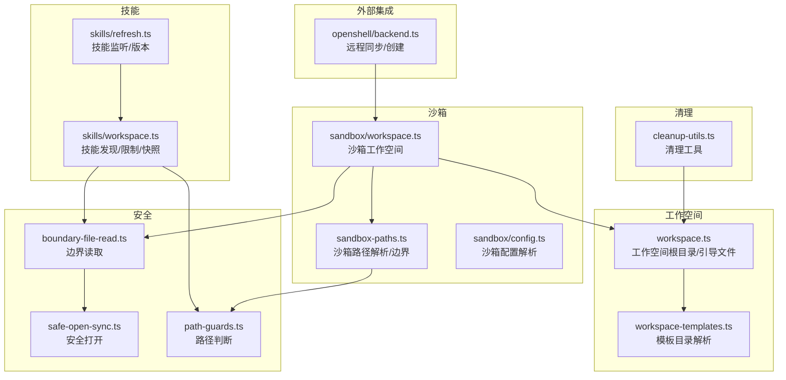
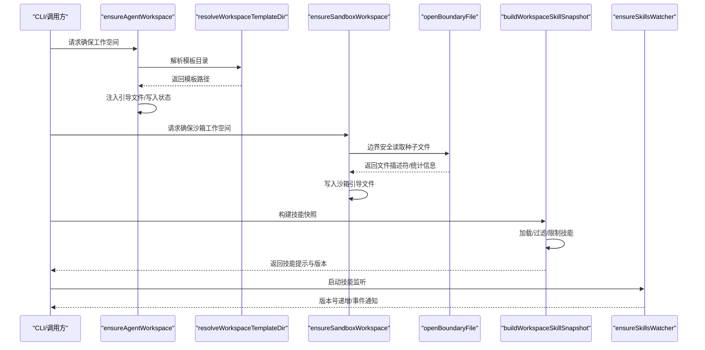
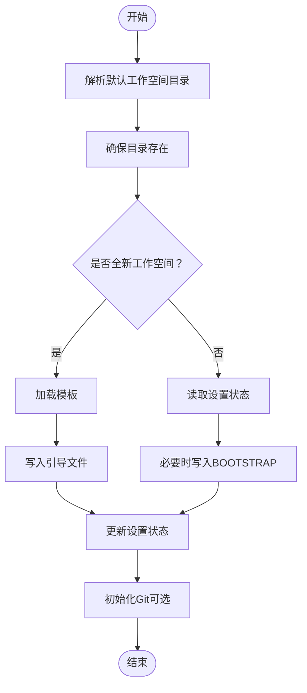
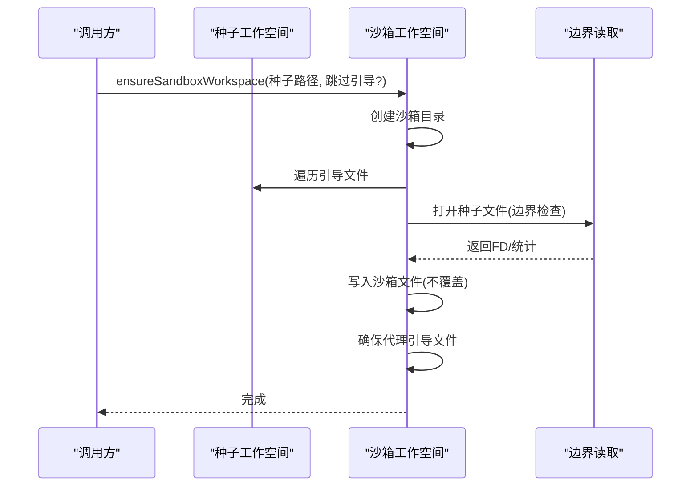
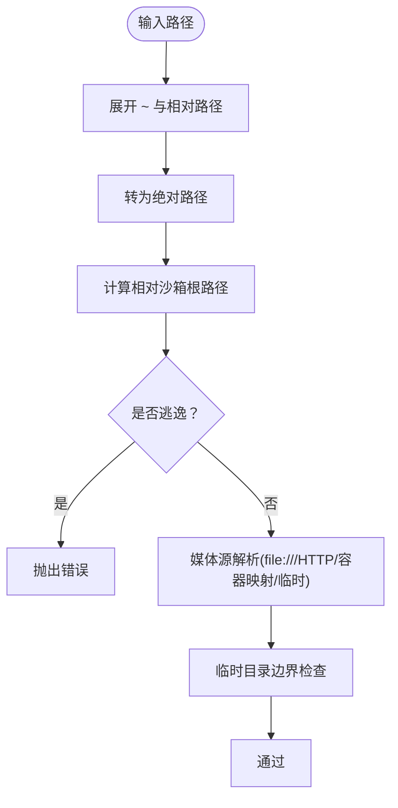
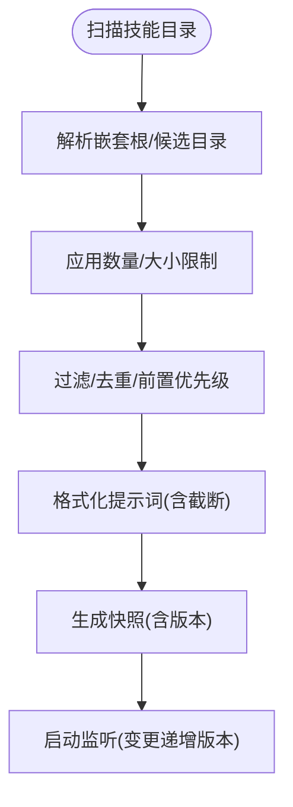
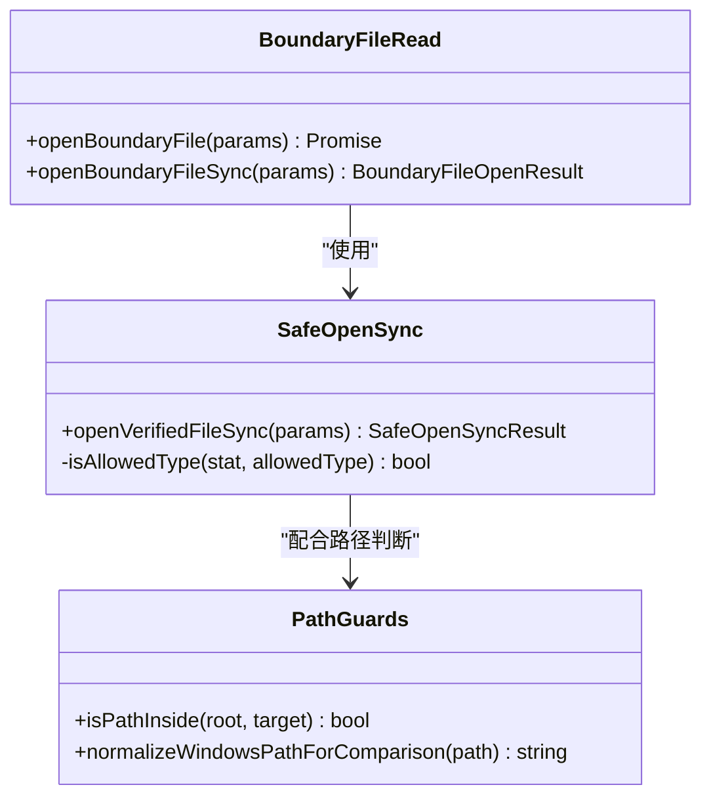
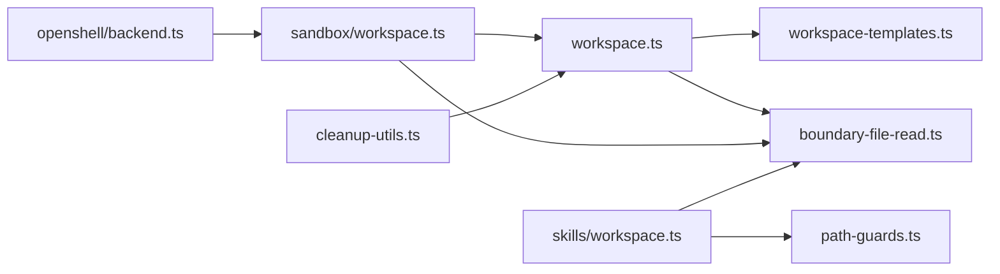

# 代理工作空间管理

<cite>
**本文引用的文件**
- [src/agents/workspace.ts](file://src/agents/workspace.ts)
- [src/agents/sandbox/workspace.ts](file://src/agents/sandbox/workspace.ts)
- [src/agents/workspace-templates.ts](file://src/agents/workspace-templates.ts)
- [src/agents/sandbox-paths.ts](file://src/agents/sandbox-paths.ts)
- [src/agents/skills/workspace.ts](file://src/agents/skills/workspace.ts)
- [src/agents/skills/refresh.ts](file://src/agents/skills/refresh.ts)
- [src/infra/boundary-file-read.ts](file://src/infra/boundary-file-read.ts)
- [src/infra/safe-open-sync.ts](file://src/infra/safe-open-sync.ts)
- [src/infra/path-guards.ts](file://src/infra/path-guards.ts)
- [src/commands/cleanup-utils.ts](file://src/commands/cleanup-utils.ts)
- [extensions/openshell/src/backend.ts](file://extensions/openshell/src/backend.ts)
- [src/agents/sandbox/config.ts](file://src/agents/sandbox/config.ts)
</cite>

## 目录
1. [简介](#简介)
2. [项目结构](#项目结构)
3. [核心组件](#核心组件)
4. [架构总览](#架构总览)
5. [详细组件分析](#详细组件分析)
6. [依赖关系分析](#依赖关系分析)
7. [性能考量](#性能考量)
8. [故障排除指南](#故障排除指南)
9. [结论](#结论)
10. [附录](#附录)

## 简介
本文件系统性阐述代理工作空间管理的设计与实现，覆盖工作空间的创建、配置与管理机制；解释沙箱隔离策略、文件系统权限控制与路径解析规则；说明工作空间模板、引导文件注入与技能快照加载流程；给出安全策略、清理机制与持久化选项；并提供最佳实践、性能优化建议与故障排除指南，帮助用户自定义工作空间行为并扩展存储能力。

## 项目结构
工作空间相关代码主要分布在以下模块：
- 工作空间根目录与引导文件：负责默认工作空间位置、模板加载、引导文件注入与状态记录
- 沙箱工作空间：负责在沙箱环境中复制种子工作空间、注入引导文件、同步代理工作空间
- 路径与边界控制：负责沙箱路径解析、边界检查与临时媒体路径校验
- 技能工作空间：负责技能发现、过滤、限制、快照构建与增量监听
- 安全与边界读取：负责受控文件打开、类型与大小校验、硬链接拒绝等
- 清理工具：负责工作空间与状态目录的清理与安全保护

**图表来源**
- [src/agents/workspace.ts:1-648](file://src/agents/workspace.ts#L1-L648)
- [src/agents/workspace-templates.ts:1-60](file://src/agents/workspace-templates.ts#L1-L60)
- [src/agents/sandbox/workspace.ts:1-66](file://src/agents/sandbox/workspace.ts#L1-L66)
- [src/agents/sandbox-paths.ts:1-218](file://src/agents/sandbox-paths.ts#L1-L218)
- [src/agents/skills/workspace.ts:1-882](file://src/agents/skills/workspace.ts#L1-L882)
- [src/agents/skills/refresh.ts:1-208](file://src/agents/skills/refresh.ts#L1-L208)
- [src/infra/boundary-file-read.ts:1-203](file://src/infra/boundary-file-read.ts#L1-L203)
- [src/infra/safe-open-sync.ts:1-102](file://src/infra/safe-open-sync.ts#L1-L102)
- [src/infra/path-guards.ts:1-48](file://src/infra/path-guards.ts#L1-L48)
- [src/commands/cleanup-utils.ts:1-154](file://src/commands/cleanup-utils.ts#L1-L154)
- [extensions/openshell/src/backend.ts:337-400](file://extensions/openshell/src/backend.ts#L337-L400)
- [src/agents/sandbox/config.ts:224-276](file://src/agents/sandbox/config.ts#L224-L276)

**章节来源**
- [src/agents/workspace.ts:1-648](file://src/agents/workspace.ts#L1-L648)
- [src/agents/workspace-templates.ts:1-60](file://src/agents/workspace-templates.ts#L1-L60)
- [src/agents/sandbox/workspace.ts:1-66](file://src/agents/sandbox/workspace.ts#L1-L66)
- [src/agents/sandbox-paths.ts:1-218](file://src/agents/sandbox-paths.ts#L1-L218)
- [src/agents/skills/workspace.ts:1-882](file://src/agents/skills/workspace.ts#L1-L882)
- [src/agents/skills/refresh.ts:1-208](file://src/agents/skills/refresh.ts#L1-L208)
- [src/infra/boundary-file-read.ts:1-203](file://src/infra/boundary-file-read.ts#L1-L203)
- [src/infra/safe-open-sync.ts:1-102](file://src/infra/safe-open-sync.ts#L1-L102)
- [src/infra/path-guards.ts:1-48](file://src/infra/path-guards.ts#L1-L48)
- [src/commands/cleanup-utils.ts:1-154](file://src/commands/cleanup-utils.ts#L1-L154)
- [extensions/openshell/src/backend.ts:337-400](file://extensions/openshell/src/backend.ts#L337-L400)
- [src/agents/sandbox/config.ts:224-276](file://src/agents/sandbox/config.ts#L224-L276)

## 核心组件
- 工作空间根与引导文件
  - 默认工作空间目录解析、模板目录定位、引导文件注入与状态记录
  - 支持多套引导文件（如 AGENTS、SOUL、TOOLS、IDENTITY、USER、HEARTBEAT、BOOTSTRAP、MEMORY）
- 沙箱工作空间
  - 将“种子”工作空间中的引导文件复制到沙箱目录，确保边界安全读取
  - 同步代理工作空间与远程工作空间，按访问策略清理目标目录
- 路径与边界控制
  - 解析沙箱输入路径、相对路径计算、边界逃逸检测
  - 媒体源解析（HTTP、file://、容器映射、临时目录）与别名逃逸防护
- 技能工作空间
  - 技能目录扫描、嵌套根检测、大小与数量限制、过滤与去重
  - 快照构建、提示词截断、监听与版本号递增
- 安全与边界读取
  - 受控文件打开、拒绝硬链接、最大字节限制、类型校验
- 清理工具
  - 收集工作空间列表、构建清理计划、安全移除策略

**章节来源**
- [src/agents/workspace.ts:12-465](file://src/agents/workspace.ts#L12-L465)
- [src/agents/sandbox/workspace.ts:17-65](file://src/agents/sandbox/workspace.ts#L17-L65)
- [src/agents/sandbox-paths.ts:40-135](file://src/agents/sandbox-paths.ts#L40-L135)
- [src/agents/skills/workspace.ts:292-638](file://src/agents/skills/workspace.ts#L292-L638)
- [src/infra/boundary-file-read.ts:67-166](file://src/infra/boundary-file-read.ts#L67-L166)
- [src/infra/safe-open-sync.ts:27-94](file://src/infra/safe-open-sync.ts#L27-L94)
- [src/commands/cleanup-utils.ts:21-141](file://src/commands/cleanup-utils.ts#L21-L141)

## 架构总览
下图展示了工作空间从创建到运行的关键流程：模板注入、边界安全读取、沙箱复制、技能快照与监听、以及清理与远程同步。

**图表来源**
- [src/agents/workspace.ts:327-465](file://src/agents/workspace.ts#L327-L465)
- [src/agents/workspace-templates.ts:14-54](file://src/agents/workspace-templates.ts#L14-L54)
- [src/agents/sandbox/workspace.ts:17-65](file://src/agents/sandbox/workspace.ts#L17-L65)
- [src/infra/boundary-file-read.ts:142-166](file://src/infra/boundary-file-read.ts#L142-L166)
- [src/agents/skills/workspace.ts:567-584](file://src/agents/skills/workspace.ts#L567-L584)
- [src/agents/skills/refresh.ts:132-208](file://src/agents/skills/refresh.ts#L132-L208)

## 详细组件分析

### 工作空间根与引导文件注入
- 默认工作空间目录根据环境变量与用户主目录解析，支持多配置文件注入
- 模板目录优先从包内资源或当前工作目录查找，缺失时回退到内置模板
- 引导文件采用“存在即写”的策略，避免覆盖已有内容；同时维护工作空间设置状态文件
- 支持在新工作空间初始化时自动创建 Git 仓库（若可用）

**图表来源**
- [src/agents/workspace.ts:12-465](file://src/agents/workspace.ts#L12-L465)
- [src/agents/workspace-templates.ts:14-54](file://src/agents/workspace-templates.ts#L14-L54)

**章节来源**
- [src/agents/workspace.ts:12-465](file://src/agents/workspace.ts#L12-L465)
- [src/agents/workspace-templates.ts:14-54](file://src/agents/workspace-templates.ts#L14-L54)

### 沙箱工作空间与种子复制
- 将“种子”工作空间中的引导文件复制到沙箱目录，使用边界安全读取以防止越界与符号链接攻击
- 若未显式跳过，会继续执行代理工作空间的引导文件注入
- 远程同步时按访问策略清理目标目录后上传，避免残留

**图表来源**
- [src/agents/sandbox/workspace.ts:17-65](file://src/agents/sandbox/workspace.ts#L17-L65)
- [src/infra/boundary-file-read.ts:142-166](file://src/infra/boundary-file-read.ts#L142-L166)

**章节来源**
- [src/agents/sandbox/workspace.ts:17-65](file://src/agents/sandbox/workspace.ts#L17-L65)
- [src/infra/boundary-file-read.ts:67-166](file://src/infra/boundary-file-read.ts#L67-L166)

### 路径解析与沙箱边界控制
- 输入路径展开（~、相对路径）、解析为绝对路径
- 计算相对于沙箱根的相对路径，若逃逸则抛出错误
- 媒体源支持 HTTP、file://、容器映射路径与临时目录，均需通过边界检查
- 临时媒体路径与沙箱路径均进行别名逃逸检测

**图表来源**
- [src/agents/sandbox-paths.ts:40-135](file://src/agents/sandbox-paths.ts#L40-L135)
- [src/agents/sandbox-paths.ts:184-210](file://src/agents/sandbox-paths.ts#L184-L210)

**章节来源**
- [src/agents/sandbox-paths.ts:40-135](file://src/agents/sandbox-paths.ts#L40-L135)
- [src/agents/sandbox-paths.ts:184-210](file://src/agents/sandbox-paths.ts#L184-L210)

### 技能工作空间与快照加载
- 多源合并：额外目录、内置、托管、个人与项目代理、工作空间自身
- 嵌套根检测与候选限制，避免过大目录扫描
- 文件大小限制与数量限制，超限警告并截断
- 提示词构建与字符数限制，二分搜索最优前缀
- 监听 SKILL.md 变更，按工作空间维度递增版本号

**图表来源**
- [src/agents/skills/workspace.ts:292-638](file://src/agents/skills/workspace.ts#L292-L638)
- [src/agents/skills/refresh.ts:59-208](file://src/agents/skills/refresh.ts#L59-L208)

**章节来源**
- [src/agents/skills/workspace.ts:292-638](file://src/agents/skills/workspace.ts#L292-L638)
- [src/agents/skills/refresh.ts:59-208](file://src/agents/skills/refresh.ts#L59-L208)

### 安全策略与边界读取
- 受控文件打开：拒绝路径符号链接、拒绝硬链接、限制最大字节数、类型校验
- 边界读取：解析真实路径、比较打开前后文件标识，防止原子性攻击
- 路径判断：跨平台路径规范化与包含判断，处理 Windows UNC 与大小写差异

**图表来源**
- [src/infra/safe-open-sync.ts:27-94](file://src/infra/safe-open-sync.ts#L27-L94)
- [src/infra/boundary-file-read.ts:67-166](file://src/infra/boundary-file-read.ts#L67-L166)
- [src/infra/path-guards.ts:35-47](file://src/infra/path-guards.ts#L35-L47)

**章节来源**
- [src/infra/safe-open-sync.ts:27-94](file://src/infra/safe-open-sync.ts#L27-L94)
- [src/infra/boundary-file-read.ts:67-166](file://src/infra/boundary-file-read.ts#L67-L166)
- [src/infra/path-guards.ts:35-47](file://src/infra/path-guards.ts#L35-L47)

### 清理机制与持久化选项
- 收集工作空间目录（默认与配置列表），构建清理计划
- 移除策略：拒绝根目录与家目录，Dry-run 保护
- 状态与配置分离：可选择将配置与 OAuth 存放于状态目录内或独立路径
- Git 初始化仅在全新工作空间且 Git 可用时进行

**章节来源**
- [src/commands/cleanup-utils.ts:21-141](file://src/commands/cleanup-utils.ts#L21-L141)
- [src/agents/workspace.ts:310-325](file://src/agents/workspace.ts#L310-L325)

### 远程同步与沙箱配置
- Openshell 后端负责沙箱创建与种子同步，支持 GPU、自动 Provider、策略参数传递
- 远程同步时按访问策略清理目标目录并上传，避免污染
- 沙箱配置解析遵循“代理覆盖 > 全局 > 默认”，支持模式、作用域、工具策略、Docker/SSH/Browser 参数

**章节来源**
- [extensions/openshell/src/backend.ts:337-400](file://extensions/openshell/src/backend.ts#L337-L400)
- [src/agents/sandbox/config.ts:224-276](file://src/agents/sandbox/config.ts#L224-L276)

## 依赖关系分析
- 工作空间模块依赖模板解析与边界读取，确保引导文件注入的安全性
- 沙箱模块依赖工作空间与边界读取，保证种子复制与写入的安全
- 技能模块依赖路径守卫与边界读取，保障扫描与读取的稳定性
- 清理工具依赖工作空间默认目录解析，统一清理入口
- 外部集成（Openshell）依赖沙箱工作空间与路径解析，完成远程同步

**图表来源**
- [src/agents/workspace.ts:1-648](file://src/agents/workspace.ts#L1-L648)
- [src/agents/workspace-templates.ts:1-60](file://src/agents/workspace-templates.ts#L1-L60)
- [src/agents/sandbox/workspace.ts:1-66](file://src/agents/sandbox/workspace.ts#L1-L66)
- [src/infra/boundary-file-read.ts:1-203](file://src/infra/boundary-file-read.ts#L1-L203)
- [src/agents/skills/workspace.ts:1-882](file://src/agents/skills/workspace.ts#L1-L882)
- [src/infra/path-guards.ts:1-48](file://src/infra/path-guards.ts#L1-L48)
- [src/commands/cleanup-utils.ts:1-154](file://src/commands/cleanup-utils.ts#L1-L154)
- [extensions/openshell/src/backend.ts:337-400](file://extensions/openshell/src/backend.ts#L337-L400)

**章节来源**
- [src/agents/workspace.ts:1-648](file://src/agents/workspace.ts#L1-L648)
- [src/agents/workspace-templates.ts:1-60](file://src/agents/workspace-templates.ts#L1-L60)
- [src/agents/sandbox/workspace.ts:1-66](file://src/agents/sandbox/workspace.ts#L1-L66)
- [src/infra/boundary-file-read.ts:1-203](file://src/infra/boundary-file-read.ts#L1-L203)
- [src/agents/skills/workspace.ts:1-882](file://src/agents/skills/workspace.ts#L1-L882)
- [src/infra/path-guards.ts:1-48](file://src/infra/path-guards.ts#L1-L48)
- [src/commands/cleanup-utils.ts:1-154](file://src/commands/cleanup-utils.ts#L1-L154)
- [extensions/openshell/src/backend.ts:337-400](file://extensions/openshell/src/backend.ts#L337-L400)

## 性能考量
- 技能扫描限制
  - 候选目录上限、每源加载上限、单文件大小上限，避免扫描风暴
  - 对大目录采用启发式检测与截断，减少 IO 开销
- 提示词截断
  - 基于技能数量与字符数双重限制，二分搜索最优前缀，平衡上下文与性能
- 监听优化
  - 仅监听 SKILL.md 变更，忽略大型无关树，降低 FD 占用
  - 可配置防抖阈值，合并频繁变更
- I/O 缓存
  - 工作空间文件缓存基于 inode/dev/size/mtime 标识，避免重复读取
- 路径解析
  - 绝对化与规范化减少多次解析成本，跨平台路径归一化避免重复比较

[本节为通用指导，无需特定文件来源]

## 故障排除指南
- 引导文件未注入
  - 检查模板目录是否存在与可读；确认工作空间是否全新或已存在用户内容
  - 查看设置状态文件是否正确更新
- 路径逃逸错误
  - 确认输入路径未指向沙箱根之外；检查相对路径与 ~ 展开
  - 媒体源使用 file:// 时，确认容器映射路径或临时目录边界
- 硬链接/符号链接拒绝
  - 移除硬链接或符号链接；检查文件类型与大小限制
- 技能未加载或被截断
  - 使用审计命令查看技能数量与字符数限制；检查 SKILL.md 是否存在且大小合规
  - 调整监听防抖或禁用监听以手动刷新
- 清理失败
  - 确认目标路径非根目录或家目录；使用 Dry-run 预演
  - 检查权限与挂载情况

**章节来源**
- [src/agents/workspace.ts:487-547](file://src/agents/workspace.ts#L487-L547)
- [src/agents/sandbox-paths.ts:54-78](file://src/agents/sandbox-paths.ts#L54-L78)
- [src/infra/safe-open-sync.ts:55-76](file://src/infra/safe-open-sync.ts#L55-L76)
- [src/agents/skills/workspace.ts:529-565](file://src/agents/skills/workspace.ts#L529-L565)
- [src/commands/cleanup-utils.ts:78-105](file://src/commands/cleanup-utils.ts#L78-L105)

## 结论
本系统通过模板驱动的引导文件注入、严格的边界读取与路径控制、多源技能聚合与监听、以及完善的清理与远程同步机制，实现了安全、可控、可扩展的代理工作空间管理。遵循本文档的最佳实践与优化建议，可在保证安全的前提下获得稳定高效的运行体验。

[本节为总结性内容，无需特定文件来源]

## 附录

### 最佳实践
- 工作空间
  - 使用默认工作空间目录或明确指定路径；避免将工作空间置于系统关键目录
  - 初始阶段启用 Git 自动初始化，便于追踪变更
- 沙箱
  - 严格限定种子工作空间与沙箱根；使用边界读取复制引导文件
  - 远程同步前清理目标目录，避免历史残留影响
- 技能
  - 控制技能目录规模与单文件大小；合理设置监听防抖
  - 使用审计命令定期检查技能数量与字符数限制
- 安全
  - 拒绝硬链接与符号链接；限制最大文件大小
  - 跨平台路径规范化，避免大小写与 UNC 差异导致的误判

[本节为通用指导，无需特定文件来源]

### 自定义与扩展
- 自定义工作空间行为
  - 通过配置覆盖沙箱模式、作用域、工具策略与运行时参数
  - 扩展额外技能目录与插件技能目录
- 扩展存储能力
  - 在远程后端中实现自定义同步逻辑（参考远程同步流程）
  - 使用临时目录策略承载媒体等中间态数据

**章节来源**
- [src/agents/sandbox/config.ts:224-276](file://src/agents/sandbox/config.ts#L224-L276)
- [src/agents/skills/workspace.ts:448-488](file://src/agents/skills/workspace.ts#L448-L488)
- [extensions/openshell/src/backend.ts:376-400](file://extensions/openshell/src/backend.ts#L376-L400)