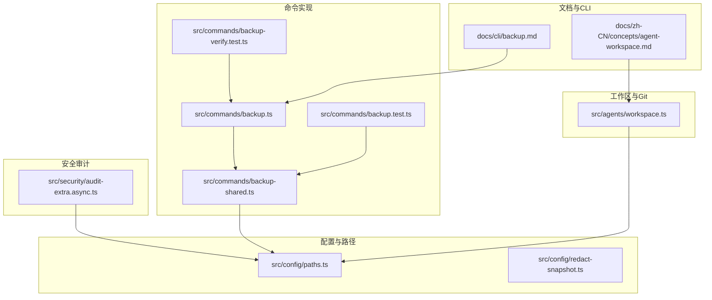
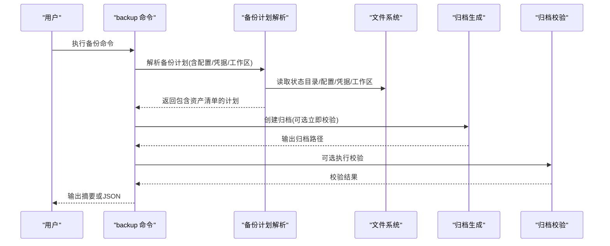
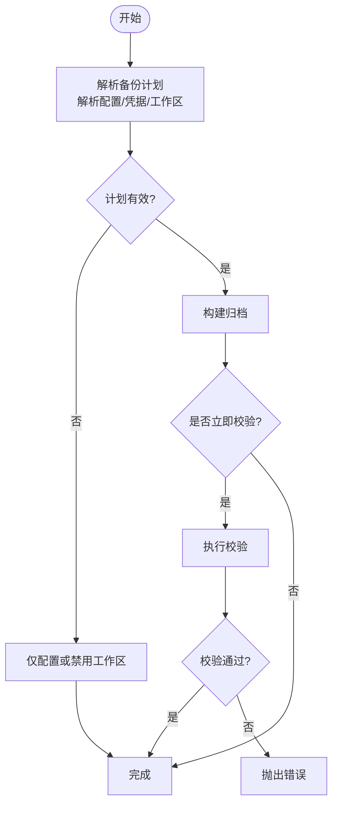
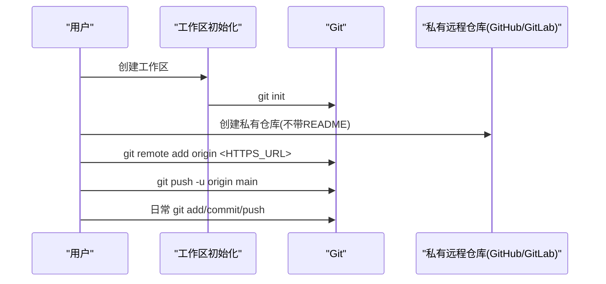
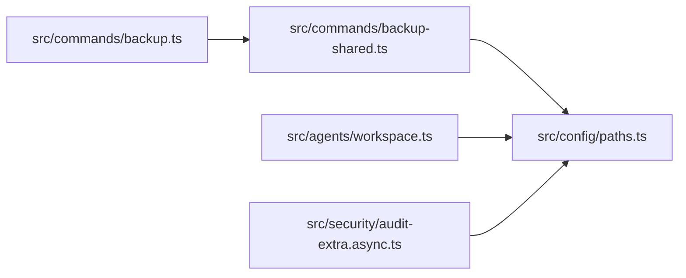

# 备份策略

<cite>
**本文引用的文件**
- [.gitignore](file://.gitignore)
- [.gitattributes](file://.gitattributes)
- [README.md](file://README.md)
- [docs/cli/backup.md](file://docs/cli/backup.md)
- [docs/zh-CN/concepts/agent-workspace.md](file://docs/zh-CN/concepts/agent-workspace.md)
- [src/commands/backup.ts](file://src/commands/backup.ts)
- [src/commands/backup-shared.ts](file://src/commands/backup-shared.ts)
- [src/commands/backup.test.ts](file://src/commands/backup.test.ts)
- [src/commands/backup-verify.test.ts](file://src/commands/backup-verify.test.ts)
- [src/agents/workspace.ts](file://src/agents/workspace.ts)
- [src/config/paths.ts](file://src/config/paths.ts)
- [src/config/redact-snapshot.ts](file://src/config/redact-snapshot.ts)
- [src/security/audit-extra.async.ts](file://src/security/audit-extra.async.ts)
- [package.json](file://package.json)
</cite>

## 目录
1. [简介](#简介)
2. [项目结构](#项目结构)
3. [核心组件](#核心组件)
4. [架构总览](#架构总览)
5. [详细组件分析](#详细组件分析)
6. [依赖关系分析](#依赖关系分析)
7. [性能考量](#性能考量)
8. [故障排查指南](#故障排查指南)
9. [结论](#结论)
10. [附录](#附录)

## 简介
本文件面向“工作空间备份与迁移”的完整策略，结合仓库内现有实现与文档，系统化阐述以下主题：
- 私有 Git 仓库作为工作空间备份方案的优势与实施步骤
- 初始化仓库、添加远程仓库、日常更新的工作流
- GitHub、GitLab 等平台的集成配置与命令示例
- .gitignore 配置建议、敏感信息保护策略与备份验证方法
- 工作空间迁移到新机器的完整流程（含仓库克隆、路径配置、会话迁移）
- 冲突处理、分支管理与版本回滚实践

## 项目结构
围绕工作空间备份与迁移，本仓库的关键位置与职责如下：
- 文档层：提供 CLI 备份参考与工作区备份最佳实践
- 命令层：提供本地备份归档能力与校验逻辑
- 配置层：定义状态目录、配置文件与凭据目录的解析规则
- 安全审计层：对凭据目录权限进行安全检查
- 工作区初始化与 Git 集成：在首次创建工作区时尝试初始化 Git 仓库

图示来源
- [docs/cli/backup.md:1-77](file://docs/cli/backup.md#L1-L77)
- [docs/zh-CN/concepts/agent-workspace.md:113-220](file://docs/zh-CN/concepts/agent-workspace.md#L113-L220)
- [src/commands/backup.ts:1-32](file://src/commands/backup.ts#L1-L32)
- [src/commands/backup-shared.ts:1-211](file://src/commands/backup-shared.ts#L1-L211)
- [src/config/paths.ts:1-273](file://src/config/paths.ts#L1-L273)
- [src/agents/workspace.ts:284-325](file://src/agents/workspace.ts#L284-L325)
- [src/security/audit-extra.async.ts:983-1026](file://src/security/audit-extra.async.ts#L983-L1026)
- [src/commands/backup.test.ts:95-394](file://src/commands/backup.test.ts#L95-L394)
- [src/commands/backup-verify.test.ts:217-249](file://src/commands/backup-verify.test.ts#L217-L249)

章节来源
- [docs/cli/backup.md:1-77](file://docs/cli/backup.md#L1-L77)
- [docs/zh-CN/concepts/agent-workspace.md:113-220](file://docs/zh-CN/concepts/agent-workspace.md#L113-L220)
- [src/commands/backup.ts:1-32](file://src/commands/backup.ts#L1-L32)
- [src/commands/backup-shared.ts:1-211](file://src/commands/backup-shared.ts#L1-L211)
- [src/config/paths.ts:1-273](file://src/config/paths.ts#L1-L273)
- [src/agents/workspace.ts:284-325](file://src/agents/workspace.ts#L284-L325)
- [src/security/audit-extra.async.ts:983-1026](file://src/security/audit-extra.async.ts#L983-L1026)
- [src/commands/backup.test.ts:95-394](file://src/commands/backup.test.ts#L95-L394)
- [src/commands/backup-verify.test.ts:217-249](file://src/commands/backup-verify.test.ts#L217-L249)

## 核心组件
- 备份 CLI 与归档生成
  - 提供本地备份归档能力，支持仅备份配置、跳过工作区、输出 JSON、立即校验等选项
  - 归档包含清单文件，记录源路径与归档布局，并在创建后可选地进行校验
- 工作区 Git 初始化
  - 在首次创建工作区时尝试初始化 Git 仓库，便于后续纳入私有仓库备份
- 配置与路径解析
  - 明确状态目录、配置文件与凭据目录的解析优先级与默认位置
- 敏感信息与权限
  - 对凭据目录进行权限审计，建议通过占位符与外部密管存储真实密钥
- 迁移与会话
  - 文档提供工作区迁移到新机器的步骤，明确会话需单独迁移

章节来源
- [docs/cli/backup.md:9-77](file://docs/cli/backup.md#L9-L77)
- [src/commands/backup.ts:11-31](file://src/commands/backup.ts#L11-L31)
- [src/commands/backup-shared.ts:106-211](file://src/commands/backup-shared.ts#L106-L211)
- [src/agents/workspace.ts:310-325](file://src/agents/workspace.ts#L310-L325)
- [src/config/paths.ts:60-252](file://src/config/paths.ts#L60-L252)
- [src/security/audit-extra.async.ts:983-1018](file://src/security/audit-extra.async.ts#L983-L1018)
- [docs/zh-CN/concepts/agent-workspace.md:188-220](file://docs/zh-CN/concepts/agent-workspace.md#L188-L220)

## 架构总览
下图展示了“本地备份归档”与“工作区 Git 初始化”的整体交互，以及与配置解析、安全审计的关系。

图示来源
- [src/commands/backup.ts:11-31](file://src/commands/backup.ts#L11-L31)
- [src/commands/backup-shared.ts:106-211](file://src/commands/backup-shared.ts#L106-L211)
- [src/config/paths.ts:60-252](file://src/config/paths.ts#L60-L252)
- [docs/cli/backup.md:13-31](file://docs/cli/backup.md#L13-L31)

章节来源
- [src/commands/backup.ts:11-31](file://src/commands/backup.ts#L11-L31)
- [src/commands/backup-shared.ts:106-211](file://src/commands/backup-shared.ts#L106-L211)
- [src/config/paths.ts:60-252](file://src/config/paths.ts#L60-L252)
- [docs/cli/backup.md:13-31](file://docs/cli/backup.md#L13-L31)

## 详细组件分析

### 组件A：本地备份归档与校验
- 功能要点
  - 支持仅备份配置、跳过工作区、输出 JSON、默认归档命名与去重策略
  - 归档包含清单文件，用于校验完整性与定位根清单
  - 创建后可选立即校验，失败时抛出错误
- 关键行为
  - 当配置无效且启用工作区备份时，快速失败；可通过“仅配置”或“禁用工作区”绕过
  - 对重复路径进行去重，避免自包含与冗余
- 测试覆盖
  - 覆盖“仅配置”、“无效配置下的部分备份”、“工作区被状态目录覆盖”等场景

图示来源
- [src/commands/backup-shared.ts:106-211](file://src/commands/backup-shared.ts#L106-L211)
- [docs/cli/backup.md:25-31](file://docs/cli/backup.md#L25-L31)
- [src/commands/backup.test.ts:354-394](file://src/commands/backup.test.ts#L354-L394)
- [src/commands/backup-verify.test.ts:217-249](file://src/commands/backup-verify.test.ts#L217-L249)

章节来源
- [docs/cli/backup.md:13-77](file://docs/cli/backup.md#L13-L77)
- [src/commands/backup.ts:11-31](file://src/commands/backup.ts#L11-L31)
- [src/commands/backup-shared.ts:106-211](file://src/commands/backup-shared.ts#L106-L211)
- [src/commands/backup.test.ts:95-394](file://src/commands/backup.test.ts#L95-L394)
- [src/commands/backup-verify.test.ts:217-249](file://src/commands/backup-verify.test.ts#L217-L249)

### 组件B：工作区 Git 初始化与私有仓库集成
- 功能要点
  - 首次创建工作区时尝试初始化 Git 仓库，便于纳入私有仓库备份
  - 提供 GitHub/GitLab 的私有仓库初始化与推送示例
- 工作流
  - 初始化仓库 -> 添加远程 -> 推送 -> 日常更新

图示来源
- [src/agents/workspace.ts:310-325](file://src/agents/workspace.ts#L310-L325)
- [docs/zh-CN/concepts/agent-workspace.md:133-186](file://docs/zh-CN/concepts/agent-workspace.md#L133-L186)

章节来源
- [src/agents/workspace.ts:310-325](file://src/agents/workspace.ts#L310-L325)
- [docs/zh-CN/concepts/agent-workspace.md:113-220](file://docs/zh-CN/concepts/agent-workspace.md#L113-L220)

### 组件C：配置与路径解析
- 关键点
  - 状态目录、配置文件、凭据目录的解析顺序与优先级
  - 支持通过环境变量覆盖默认路径
- 与备份的关系
  - 备份计划基于解析后的路径进行资产收集与去重

章节来源
- [src/config/paths.ts:60-252](file://src/config/paths.ts#L60-L252)
- [src/commands/backup-shared.ts:115-117](file://src/commands/backup-shared.ts#L115-L117)

### 组件D：敏感信息保护与权限审计
- 敏感信息
  - 建议使用占位符，真实密钥存放在密码管理器、环境变量或状态目录中
- 权限审计
  - 凭据目录对组/世界可写/可读应被识别为高/警告风险，并给出修复建议

章节来源
- [docs/zh-CN/concepts/agent-workspace.md:188-206](file://docs/zh-CN/concepts/agent-workspace.md#L188-L206)
- [src/security/audit-extra.async.ts:983-1018](file://src/security/audit-extra.async.ts#L983-L1018)
- [src/config/redact-snapshot.ts:241-292](file://src/config/redact-snapshot.ts#L241-L292)

## 依赖关系分析
- 备份命令依赖备份计划解析模块，后者依赖配置与路径解析模块
- 工作区初始化依赖 Git 可用性检测
- 安全审计依赖凭据目录解析

图示来源
- [src/commands/backup.ts:1-32](file://src/commands/backup.ts#L1-L32)
- [src/commands/backup-shared.ts:1-211](file://src/commands/backup-shared.ts#L1-L211)
- [src/config/paths.ts:1-273](file://src/config/paths.ts#L1-L273)
- [src/agents/workspace.ts:284-325](file://src/agents/workspace.ts#L284-L325)
- [src/security/audit-extra.async.ts:983-1026](file://src/security/audit-extra.async.ts#L983-L1026)

章节来源
- [src/commands/backup.ts:1-32](file://src/commands/backup.ts#L1-L32)
- [src/commands/backup-shared.ts:1-211](file://src/commands/backup-shared.ts#L1-L211)
- [src/config/paths.ts:1-273](file://src/config/paths.ts#L1-L273)
- [src/agents/workspace.ts:284-325](file://src/agents/workspace.ts#L284-L325)
- [src/security/audit-extra.async.ts:983-1026](file://src/security/audit-extra.async.ts#L983-L1026)

## 性能考量
- 备份大小主要由工作区决定；如需更小/更快的归档，可选择“仅配置”或“禁用工作区”
- 校验会扫描归档，可能增加时间成本；仅在需要时启用
- 文件系统行为与可用空间影响压缩与写入性能

章节来源
- [docs/cli/backup.md:63-77](file://docs/cli/backup.md#L63-L77)

## 故障排查指南
- 备份失败（配置无效）
  - 现象：启用工作区备份时，若配置无效则快速失败
  - 处理：改用“仅配置”或“禁用工作区”进行部分备份
- 归档校验失败
  - 现象：校验发现清单缺失、路径遍历或资产不存在
  - 处理：检查归档完整性与清单，修正后再试
- 凭据目录权限问题
  - 现象：对组/世界可写/可读被标记为高/警告风险
  - 处理：调整权限至仅当前用户可读写

章节来源
- [docs/cli/backup.md:49-62](file://docs/cli/backup.md#L49-L62)
- [src/commands/backup-verify.test.ts:217-249](file://src/commands/backup-verify.test.ts#L217-L249)
- [src/security/audit-extra.async.ts:983-1018](file://src/security/audit-extra.async.ts#L983-L1018)

## 结论
- 使用私有 Git 仓库作为工作空间备份的核心方案，具备版本化、可追溯、可迁移与跨平台集成优势
- 结合本地备份归档与 Git 备份，既能满足快速恢复，又能保证工作区内容的持续演进
- 强化敏感信息保护与权限审计，确保备份与生产环境的安全边界

## 附录

### A. 私有 Git 仓库作为备份方案的优势
- 版本化与可追溯：每次提交即一次快照，便于回滚与审计
- 分支管理：可在不同分支隔离实验性变更，降低破坏性风险
- 平台集成：GitHub/GitLab 等提供完善的 CI/CD 与访问控制
- 跨平台：统一的 Git 工具链，便于多端协作与迁移

章节来源
- [docs/zh-CN/concepts/agent-workspace.md:127-129](file://docs/zh-CN/concepts/agent-workspace.md#L127-L129)

### B. 初始化仓库与添加远程
- 初始化仓库
  - 在工作区根目录初始化 Git 仓库
- 添加远程并推送
  - GitHub/GitLab 提供私有仓库创建与 HTTPS 远程 URL
- 日常更新
  - 状态检查 -> 添加变更 -> 提交 -> 推送

章节来源
- [docs/zh-CN/concepts/agent-workspace.md:133-186](file://docs/zh-CN/concepts/agent-workspace.md#L133-L186)

### C. .gitignore 配置建议
- 基于仓库现有忽略规则，建议补充以下条目以保护敏感信息与临时文件
  - 系统与 IDE 临时文件
  - 构建产物与缓存
  - 本地凭据与会话日志
  - 二进制与大体积中间文件

章节来源
- [.gitignore:1-136](file://.gitignore#L1-L136)

### D. 敏感信息保护策略
- 不在工作区中存储真实密钥与凭据
- 使用占位符并在外部安全存储真实密钥
- 对凭据目录进行权限审计与加固

章节来源
- [docs/zh-CN/concepts/agent-workspace.md:188-206](file://docs/zh-CN/concepts/agent-workspace.md#L188-L206)
- [src/security/audit-extra.async.ts:983-1018](file://src/security/audit-extra.async.ts#L983-L1018)

### E. 备份验证方法
- 使用内置校验命令验证归档完整性
- 校验内容包括：根清单存在、路径遍历防护、资产清单与实际文件一致性

章节来源
- [docs/cli/backup.md:25-31](file://docs/cli/backup.md#L25-L31)
- [src/commands/backup-verify.test.ts:217-249](file://src/commands/backup-verify.test.ts#L217-L249)

### F. 工作空间迁移到新机器
- 步骤
  - 克隆仓库到目标路径（默认工作区路径）
  - 在配置文件中设置工作区路径
  - 运行初始化命令以补齐缺失文件
  - 单独迁移会话目录（如需要）

章节来源
- [docs/zh-CN/concepts/agent-workspace.md:208-213](file://docs/zh-CN/concepts/agent-workspace.md#L208-L213)

### G. 冲突处理、分支管理与版本回滚
- 冲突处理
  - 使用平台提供的合并工具或命令行工具解决冲突
- 分支管理
  - 为实验性变更创建独立分支，稳定后再合并
- 回滚
  - 利用 Git 提交历史进行回滚或 cherry-pick

章节来源
- [docs/zh-CN/concepts/agent-workspace.md:179-186](file://docs/zh-CN/concepts/agent-workspace.md#L179-L186)

### H. CLI 备份命令速查
- 创建备份归档（可选参数：输出目录、仅配置、禁用工作区、立即校验、JSON 输出）
- 校验归档完整性

章节来源
- [docs/cli/backup.md:13-31](file://docs/cli/backup.md#L13-L31)
- [src/commands/backup.ts:11-31](file://src/commands/backup.ts#L11-L31)