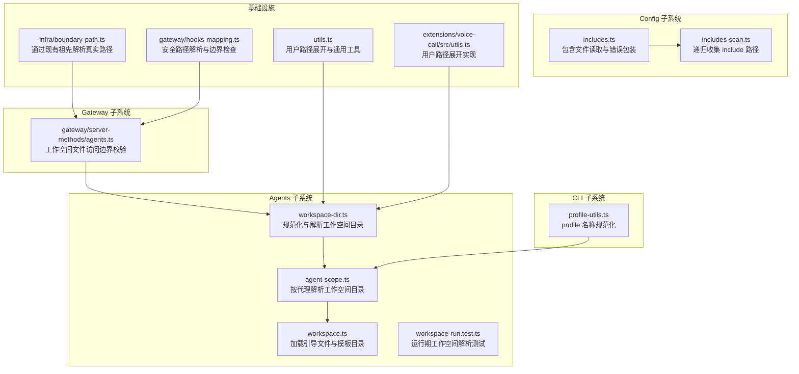
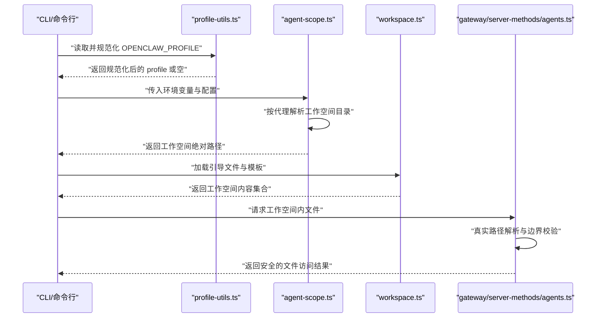
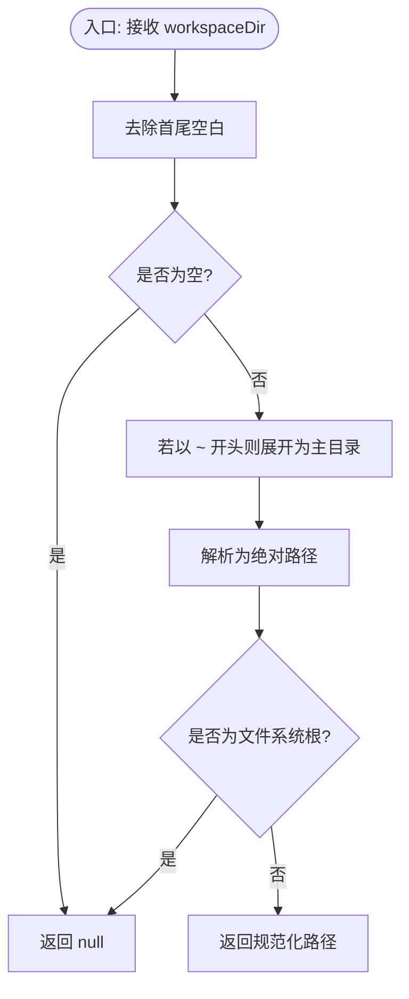
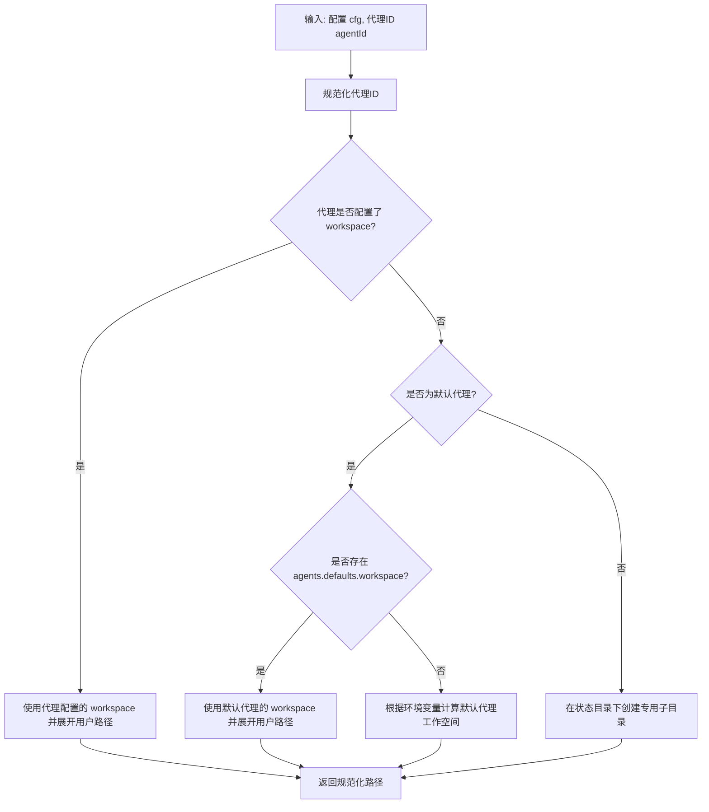
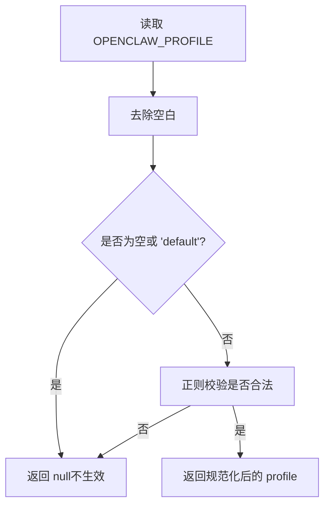
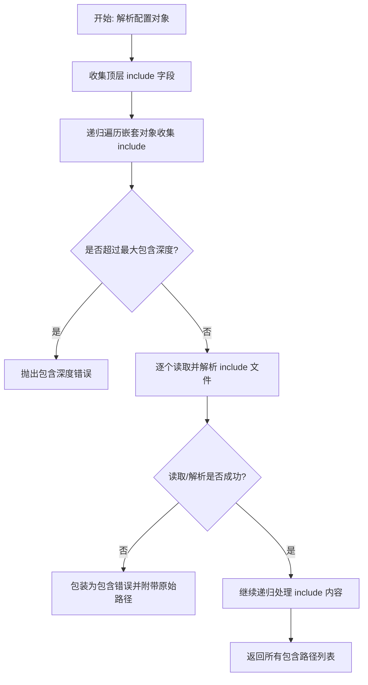
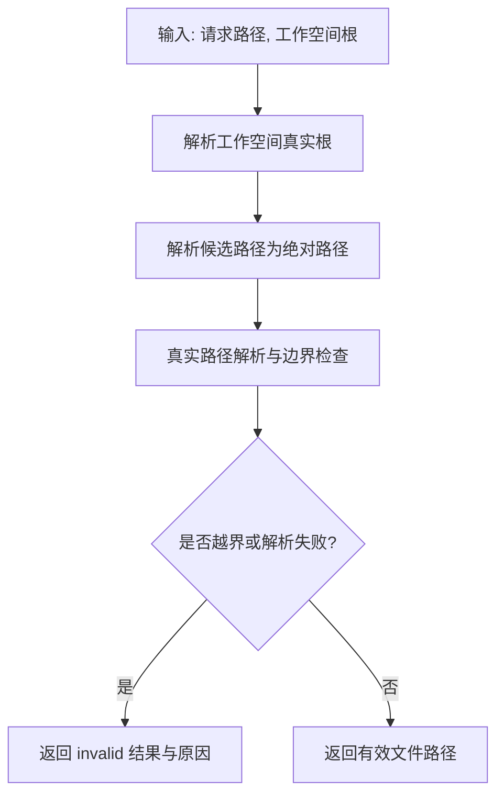
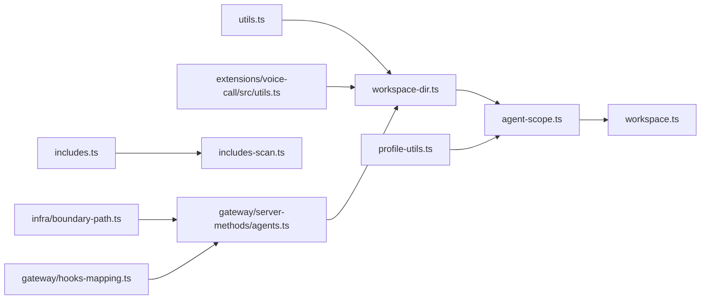

# 工作空间位置与配置

<cite>
**本文引用的文件**
- [src/agents/workspace-dir.ts](file://src/agents/workspace-dir.ts)
- [src/agents/workspace.ts](file://src/agents/workspace.ts)
- [src/agents/workspace-run.test.ts](file://src/agents/workspace-run.test.ts)
- [src/agents/agent-scope.ts](file://src/agents/agent-scope.ts)
- [src/commands/onboard-non-interactive/local/workspace.ts](file://src/commands/onboard-non-interactive/local/workspace.ts)
- [src/cli/profile-utils.ts](file://src/cli/profile-utils.ts)
- [src/gateway/server-methods/agents.ts](file://src/gateway/server-methods/agents.ts)
- [src/utils.ts](file://src/utils.ts)
- [extensions/voice-call/src/utils.ts](file://extensions/voice-call/src/utils.ts)
- [src/infra/boundary-path.ts](file://src/infra/boundary-path.ts)
- [src/gateway/hooks-mapping.ts](file://src/gateway/hooks-mapping.ts)
- [src/config/includes.ts](file://src/config/includes.ts)
- [src/config/includes-scan.ts](file://src/config/includes-scan.ts)
</cite>

## 目录
1. [简介](#简介)
2. [项目结构](#项目结构)
3. [核心组件](#核心组件)
4. [架构总览](#架构总览)
5. [详细组件分析](#详细组件分析)
6. [依赖关系分析](#依赖关系分析)
7. [性能考量](#性能考量)
8. [故障排查指南](#故障排查指南)
9. [结论](#结论)
10. [附录](#附录)

## 简介
本文件系统性阐述 OpenClaw 的“工作空间”定位与配置机制，重点覆盖以下主题：
- 默认工作空间位置规则与回退策略
- 环境变量覆盖机制（尤其是 OPENCLAW_PROFILE 对工作空间路径的影响）
- 配置文件优先级与多配置文件环境下的解析顺序
- 相对路径与绝对路径的处理规则
- 工作空间路径解析算法与边界保护
- 配置示例、最佳实践与常见错误的解决方案

## 项目结构
围绕工作空间与配置的关键目录与文件：
- agents 子系统：负责工作空间目录规范化、解析与运行时工作空间选择
- config 子系统：负责配置文件解析、包含扫描与深度限制
- cli 子系统：负责配置文件中 profile 名称的规范化
- gateway 子系统：负责工作空间内文件访问的安全边界校验
- utils 与扩展工具：提供用户路径展开、真实路径解析等通用能力

图表来源
- [src/agents/workspace-dir.ts:1-21](file://src/agents/workspace-dir.ts#L1-L21)
- [src/agents/workspace.ts:487-527](file://src/agents/workspace.ts#L487-L527)
- [src/agents/agent-scope.ts:256-288](file://src/agents/agent-scope.ts#L256-L288)
- [src/cli/profile-utils.ts:1-24](file://src/cli/profile-utils.ts#L1-L24)
- [src/config/includes.ts:221-271](file://src/config/includes.ts#L221-L271)
- [src/config/includes-scan.ts:1-53](file://src/config/includes-scan.ts#L1-L53)
- [src/gateway/server-methods/agents.ts:168-206](file://src/gateway/server-methods/agents.ts#L168-L206)
- [src/utils.ts:1-200](file://src/utils.ts#L1-L200)
- [extensions/voice-call/src/utils.ts:1-14](file://extensions/voice-call/src/utils.ts#L1-L14)
- [src/infra/boundary-path.ts:668-721](file://src/infra/boundary-path.ts#L668-L721)
- [src/gateway/hooks-mapping.ts:359-396](file://src/gateway/hooks-mapping.ts#L359-L396)

章节来源
- [src/agents/workspace-dir.ts:1-21](file://src/agents/workspace-dir.ts#L1-L21)
- [src/agents/workspace.ts:487-527](file://src/agents/workspace.ts#L487-L527)
- [src/agents/agent-scope.ts:256-288](file://src/agents/agent-scope.ts#L256-L288)
- [src/cli/profile-utils.ts:1-24](file://src/cli/profile-utils.ts#L1-L24)
- [src/config/includes.ts:221-271](file://src/config/includes.ts#L221-L271)
- [src/config/includes-scan.ts:1-53](file://src/config/includes-scan.ts#L1-L53)
- [src/gateway/server-methods/agents.ts:168-206](file://src/gateway/server-methods/agents.ts#L168-L206)
- [src/utils.ts:1-200](file://src/utils.ts#L1-L200)
- [extensions/voice-call/src/utils.ts:1-14](file://extensions/voice-call/src/utils.ts#L1-L14)
- [src/infra/boundary-path.ts:668-721](file://src/infra/boundary-path.ts#L668-L721)
- [src/gateway/hooks-mapping.ts:359-396](file://src/gateway/hooks-mapping.ts#L359-L396)

## 核心组件
- 工作空间目录规范化与解析
  - 规范化函数会去除空白、支持波浪号展开、解析为绝对路径，并拒绝将文件系统根作为工作空间（避免范围过大）。
  - 解析根目录时，若未显式提供则回退到当前工作目录。
- 按代理解析工作空间目录
  - 支持按代理 ID 解析；若代理未配置工作空间，则回退到默认代理工作空间或状态目录下的代理专用子目录。
- CLI profile 名称规范化
  - profile 名称需满足正则约束且不等于“default”，否则视为无效。
- 配置文件包含与扫描
  - 递归扫描配置中的 include 字段，支持数组与嵌套对象，限制最大包含深度并进行错误包装。
- 网关侧工作空间文件访问边界校验
  - 在网关服务端对请求路径进行真实路径解析与边界检查，防止越界访问。

章节来源
- [src/agents/workspace-dir.ts:4-20](file://src/agents/workspace-dir.ts#L4-L20)
- [src/agents/agent-scope.ts:256-288](file://src/agents/agent-scope.ts#L256-L288)
- [src/cli/profile-utils.ts:11-23](file://src/cli/profile-utils.ts#L11-L23)
- [src/config/includes.ts:224-271](file://src/config/includes.ts#L224-L271)
- [src/gateway/server-methods/agents.ts:168-206](file://src/gateway/server-methods/agents.ts#L168-L206)

## 架构总览
下图展示了从 CLI 到配置解析再到工作空间访问的整体流程，以及 OPENCLAW_PROFILE 对工作空间路径的影响路径。

图表来源
- [src/cli/profile-utils.ts:11-23](file://src/cli/profile-utils.ts#L11-L23)
- [src/agents/agent-scope.ts:256-288](file://src/agents/agent-scope.ts#L256-L288)
- [src/agents/workspace.ts:487-527](file://src/agents/workspace.ts#L487-L527)
- [src/gateway/server-methods/agents.ts:168-206](file://src/gateway/server-methods/agents.ts#L168-L206)

## 详细组件分析

### 组件一：工作空间目录规范化与解析
- 功能要点
  - 去除空白字符，支持波浪号（用户主目录）展开，统一解析为绝对路径。
  - 拒绝将文件系统根作为工作空间，避免误用导致权限与安全问题。
  - 若未提供输入，则回退到当前工作目录。
- 复杂度与性能
  - 时间复杂度近似 O(n)，主要由路径解析与可选的真实路径解析组成。
  - 空间复杂度 O(1)。
- 错误处理
  - 输入为空或被拒绝时返回空值，调用方需自行决定回退策略。

图表来源
- [src/agents/workspace-dir.ts:4-20](file://src/agents/workspace-dir.ts#L4-L20)

章节来源
- [src/agents/workspace-dir.ts:4-20](file://src/agents/workspace-dir.ts#L4-L20)

### 组件二：按代理解析工作空间目录
- 功能要点
  - 优先使用代理配置中的 workspace 设置；若未配置则回退到默认代理的默认工作空间；若仍无，则根据环境变量计算默认代理工作空间；最后回退到状态目录下的代理专用子目录。
  - 使用用户路径展开与空字节清理，确保路径安全。
- 关键行为
  - 默认代理与非默认代理的路径生成策略不同，便于隔离不同代理的工作空间。
  - 平台差异处理：在 Windows 上比较路径时转换为小写，保证跨平台一致性。

图表来源
- [src/agents/agent-scope.ts:256-288](file://src/agents/agent-scope.ts#L256-L288)

章节来源
- [src/agents/agent-scope.ts:256-288](file://src/agents/agent-scope.ts#L256-L288)

### 组件三：CLI profile 名称规范化与 OPENCLAW_PROFILE 影响
- 功能要点
  - profile 名称必须满足正则约束，且不能为“default”（会被视为空值）。
  - OPENCLAW_PROFILE 通常在 CLI 层被读取并传递给后续解析逻辑，影响默认代理工作空间与相关行为。
- 注意事项
  - 无效或非法的 profile 名称将被忽略，解析应回退到默认行为。

图表来源
- [src/cli/profile-utils.ts:11-23](file://src/cli/profile-utils.ts#L11-L23)

章节来源
- [src/cli/profile-utils.ts:11-23](file://src/cli/profile-utils.ts#L11-L23)

### 组件四：配置文件包含与扫描（多配置文件环境）
- 功能要点
  - 递归扫描配置对象中的 include 字段，支持字符串与数组两种形式，同时遍历嵌套对象。
  - 限制最大包含深度，避免过深的循环或异常配置导致栈溢出。
  - 对读取与解析失败进行错误包装，保留原始路径信息以便诊断。
- 多配置文件环境下的优先级
  - 该模块负责发现与收集 include 路径，具体合并与优先级由上层配置合并逻辑决定（不在本文件范围内）。

图表来源
- [src/config/includes-scan.ts:48-53](file://src/config/includes-scan.ts#L48-L53)
- [src/config/includes.ts:224-271](file://src/config/includes.ts#L224-L271)

章节来源
- [src/config/includes-scan.ts:1-53](file://src/config/includes-scan.ts#L1-L53)
- [src/config/includes.ts:224-271](file://src/config/includes.ts#L224-L271)

### 组件五：工作空间文件访问边界校验（网关侧）
- 功能要点
  - 将请求路径与工作空间根进行真实路径解析，确保请求路径位于工作空间根之内。
  - 若请求路径越界或无法解析，返回错误信息。
- 安全性
  - 通过真实路径解析消除符号链接别名带来的越界风险。

图表来源
- [src/gateway/server-methods/agents.ts:168-206](file://src/gateway/server-methods/agents.ts#L168-L206)

章节来源
- [src/gateway/server-methods/agents.ts:168-206](file://src/gateway/server-methods/agents.ts#L168-L206)

### 组件六：用户路径展开与真实路径解析（通用工具）
- 用户路径展开
  - 支持波浪号展开与绝对路径解析，兼容不同平台的路径分隔符。
- 真实路径解析
  - 提供通过现有祖先解析真实路径的能力，用于在部分路径不存在时仍能解析可到达的祖先真实路径。

章节来源
- [src/utils.ts:1-200](file://src/utils.ts#L1-L200)
- [extensions/voice-call/src/utils.ts:4-14](file://extensions/voice-call/src/utils.ts#L4-L14)
- [src/infra/boundary-path.ts:668-721](file://src/infra/boundary-path.ts#L668-L721)

## 依赖关系分析
- 组件耦合与内聚
  - 工作空间目录规范化与解析是多个子系统的共同依赖点，内聚度高、复用性强。
  - 网关侧边界校验依赖真实路径解析能力，形成清晰的职责分离。
- 外部依赖与集成点
  - 路径解析依赖 Node.js 的 path 与 fs 模块。
  - 用户路径展开依赖操作系统主目录信息。
- 循环依赖
  - 当前文件未见循环依赖迹象；各模块职责明确，接口清晰。

图表来源
- [src/utils.ts:1-200](file://src/utils.ts#L1-L200)
- [extensions/voice-call/src/utils.ts:1-14](file://extensions/voice-call/src/utils.ts#L1-L14)
- [src/agents/workspace-dir.ts:1-21](file://src/agents/workspace-dir.ts#L1-L21)
- [src/agents/agent-scope.ts:256-288](file://src/agents/agent-scope.ts#L256-L288)
- [src/agents/workspace.ts:487-527](file://src/agents/workspace.ts#L487-L527)
- [src/cli/profile-utils.ts:1-24](file://src/cli/profile-utils.ts#L1-L24)
- [src/config/includes.ts:221-271](file://src/config/includes.ts#L221-L271)
- [src/config/includes-scan.ts:1-53](file://src/config/includes-scan.ts#L1-L53)
- [src/gateway/server-methods/agents.ts:168-206](file://src/gateway/server-methods/agents.ts#L168-L206)
- [src/infra/boundary-path.ts:668-721](file://src/infra/boundary-path.ts#L668-L721)
- [src/gateway/hooks-mapping.ts:359-396](file://src/gateway/hooks-mapping.ts#L359-L396)

章节来源
- [src/utils.ts:1-200](file://src/utils.ts#L1-L200)
- [extensions/voice-call/src/utils.ts:1-14](file://extensions/voice-call/src/utils.ts#L1-L14)
- [src/agents/workspace-dir.ts:1-21](file://src/agents/workspace-dir.ts#L1-L21)
- [src/agents/agent-scope.ts:256-288](file://src/agents/agent-scope.ts#L256-L288)
- [src/agents/workspace.ts:487-527](file://src/agents/workspace.ts#L487-L527)
- [src/cli/profile-utils.ts:1-24](file://src/cli/profile-utils.ts#L1-L24)
- [src/config/includes.ts:221-271](file://src/config/includes.ts#L221-L271)
- [src/config/includes-scan.ts:1-53](file://src/config/includes-scan.ts#L1-L53)
- [src/gateway/server-methods/agents.ts:168-206](file://src/gateway/server-methods/agents.ts#L168-L206)
- [src/infra/boundary-path.ts:668-721](file://src/infra/boundary-path.ts#L668-L721)
- [src/gateway/hooks-mapping.ts:359-396](file://src/gateway/hooks-mapping.ts#L359-L396)

## 性能考量
- 路径解析成本
  - 主要消耗在路径字符串处理与可选的真实路径解析；在大多数场景下开销较小。
- 包含扫描
  - 最大包含深度限制可有效避免深层嵌套导致的性能问题。
- 缓存与复用
  - 工作空间模板目录存在缓存与重置机制，减少重复解析成本。

## 故障排查指南
- 常见问题与解决
  - 工作空间路径为空或被拒绝
    - 症状：返回 null 或回退到当前目录。
    - 排查：确认输入非空且非文件系统根；检查波浪号展开是否正确。
  - OPENCLAW_PROFILE 未生效
    - 症状：profile 名称被忽略。
    - 排查：确认名称符合正则且不为“default”；检查 CLI 是否正确读取环境变量。
  - 越界访问错误
    - 症状：网关侧返回路径越界错误。
    - 排查：确认请求路径位于工作空间根内；避免使用相对路径或符号链接绕过边界。
  - 包含深度超限
    - 症状：包含错误提示超过最大深度。
    - 排查：检查配置中是否存在循环 include 或过深嵌套。
- 相关实现参考
  - 工作空间目录规范化与解析：[src/agents/workspace-dir.ts:4-20](file://src/agents/workspace-dir.ts#L4-L20)
  - 按代理解析工作空间目录：[src/agents/agent-scope.ts:256-288](file://src/agents/agent-scope.ts#L256-L288)
  - CLI profile 名称规范化：[src/cli/profile-utils.ts:11-23](file://src/cli/profile-utils.ts#L11-L23)
  - 配置包含与错误包装：[src/config/includes.ts:224-271](file://src/config/includes.ts#L224-L271)
  - 网关侧边界校验：[src/gateway/server-methods/agents.ts:168-206](file://src/gateway/server-methods/agents.ts#L168-L206)

章节来源
- [src/agents/workspace-dir.ts:4-20](file://src/agents/workspace-dir.ts#L4-L20)
- [src/agents/agent-scope.ts:256-288](file://src/agents/agent-scope.ts#L256-L288)
- [src/cli/profile-utils.ts:11-23](file://src/cli/profile-utils.ts#L11-L23)
- [src/config/includes.ts:224-271](file://src/config/includes.ts#L224-L271)
- [src/gateway/server-methods/agents.ts:168-206](file://src/gateway/server-methods/agents.ts#L168-L206)

## 结论
- 工作空间路径解析遵循“显式优先、回退有序”的原则：代理配置 > 默认代理配置 > 环境变量默认 > 状态目录子目录。
- OPENCLAW_PROFILE 通过 CLI 层的 profile 名称规范化影响默认行为，但不会直接改变工作空间路径解析算法。
- 多配置文件环境通过包含扫描与深度限制保障稳定性；实际合并优先级由上层配置合并逻辑决定。
- 边界校验与真实路径解析确保工作空间访问的安全性，建议在生产环境中严格启用。

## 附录
- 配置示例与最佳实践
  - 显式指定工作空间：在代理配置中设置 workspace 字段，优先级最高。
  - 使用默认代理工作空间：在 agents.defaults 中设置，适用于默认代理。
  - 使用环境变量默认：当未显式配置时，系统会根据环境变量计算默认代理工作空间。
  - 避免使用文件系统根作为工作空间，防止权限与安全问题。
  - 在多配置文件环境中，合理组织 include 结构，避免过深嵌套。
- 相对路径与绝对路径处理
  - 所有输入都会被解析为绝对路径；相对路径基于当前工作目录解析。
  - 波浪号（~）会被展开为主目录，随后解析为绝对路径。
- 常见错误与修复
  - 症状：工作空间为空或回退到当前目录
    - 修复：提供有效的非空路径，避免使用文件系统根。
  - 症状：OPENCLAW_PROFILE 未生效
    - 修复：确保名称符合规范且不为“default”。
  - 症状：包含深度超限
    - 修复：简化配置结构，移除循环 include。