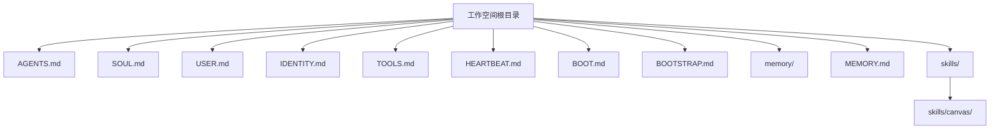
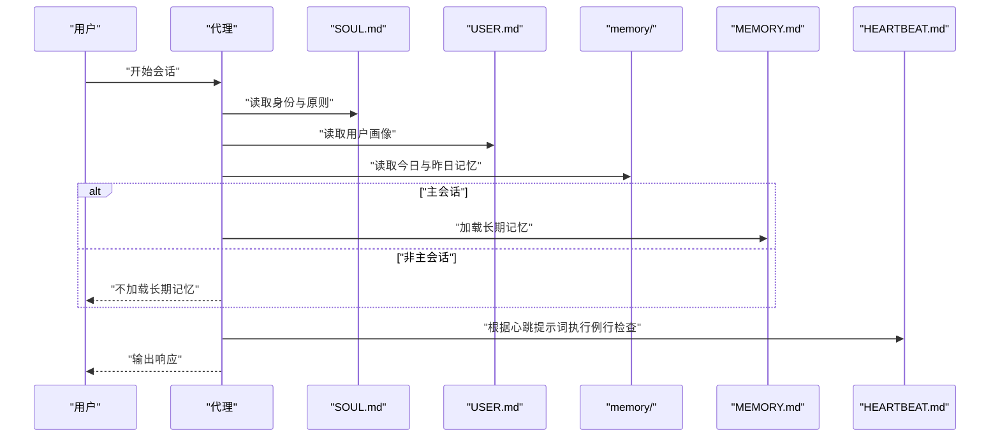
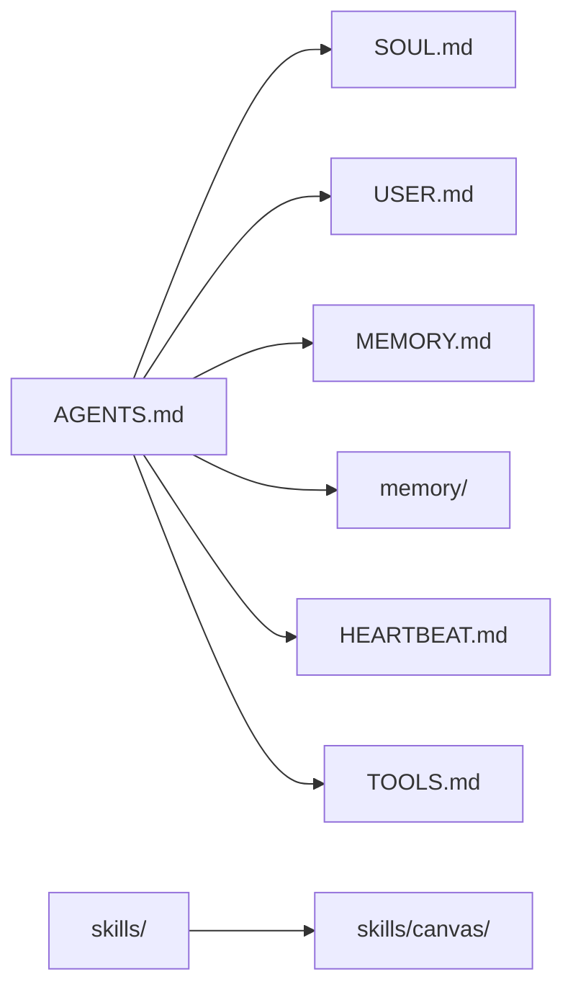

# 工作空间文件结构

<cite>
**本文引用的文件**
- [AGENTS.md](file://AGENTS.md)
- [docs/reference/templates/AGENTS.md](file://docs/reference/templates/AGENTS.md)
- [docs/reference/templates/SOUL.md](file://docs/reference/templates/SOUL.md)
- [docs/reference/templates/USER.md](file://docs/reference/templates/USER.md)
- [docs/reference/templates/IDENTITY.md](file://docs/reference/templates/IDENTITY.md)
- [docs/reference/templates/TOOLS.md](file://docs/reference/templates/TOOLS.md)
- [docs/reference/templates/HEARTBEAT.md](file://docs/reference/templates/HEARTBEAT.md)
- [docs/reference/templates/BOOT.md](file://docs/reference/templates/BOOT.md)
- [docs/reference/templates/BOOTSTRAP.md](file://docs/reference/templates/BOOTSTRAP.md)
- [skills/canvas/README.md](file://skills/canvas/README.md)
</cite>

## 目录
1. [简介](#简介)
2. [项目结构](#项目结构)
3. [核心组件](#核心组件)
4. [架构总览](#架构总览)
5. [详细组件分析](#详细组件分析)
6. [依赖关系分析](#依赖关系分析)
7. [性能考量](#性能考量)
8. [故障排查指南](#故障排查指南)
9. [结论](#结论)
10. [附录](#附录)

## 简介
本文件系统性梳理 OpenClaw 工作空间（Workspace）中的标准文件与目录组织方式，重点覆盖以下文件的作用与格式要求：
- AGENTS.md：工作区总则与会话启动流程
- SOUL.md：代理身份与行为准则
- USER.md：用户画像与上下文
- IDENTITY.md：代理身份标识
- TOOLS.md：本地化工具与设备配置
- HEARTBEAT.md：心跳任务清单
- BOOT.md：启动阶段钩子任务
- BOOTSTRAP.md：首次启动仪式与初始化流程

同时，本文还说明每日记忆日志文件夹结构、可选的长期记忆文件、技能目录组织方式，以及 Canvas 目录的用途与文件规范，并提供文件创建流程、内容模板与命名约定，帮助你按最佳实践组织工作空间。

## 项目结构
OpenClaw 的工作空间根目录即为运行时的“家”，所有与代理行为、记忆与工具相关的文件均存放于此。推荐的顶层布局如下：
- 根目录文件
  - AGENTS.md：工作区总则与会话启动流程
  - SOUL.md：代理身份与行为准则
  - USER.md：用户画像与上下文
  - IDENTITY.md：代理身份标识
  - TOOLS.md：本地化工具与设备配置
  - HEARTBEAT.md：心跳任务清单
  - BOOT.md：启动阶段钩子任务
  - BOOTSTRAP.md：首次启动仪式
- 记忆与日志
  - memory/：每日记忆日志目录（YYYY-MM-DD.md）
  - MEMORY.md：长期记忆（仅在主会话加载）
- 技能与工具
  - skills/：技能目录（每个技能一个子目录）
  - 可选：skills/canvas/：Canvas 相关技能与资源
- 其他
  - 可选：avatars/：头像等资源（相对路径）

**图表来源**
- [AGENTS.md](file://AGENTS.md)
- [docs/reference/templates/AGENTS.md](file://docs/reference/templates/AGENTS.md)
- [docs/reference/templates/SOUL.md](file://docs/reference/templates/SOUL.md)
- [docs/reference/templates/USER.md](file://docs/reference/templates/USER.md)
- [docs/reference/templates/IDENTITY.md](file://docs/reference/templates/IDENTITY.md)
- [docs/reference/templates/TOOLS.md](file://docs/reference/templates/TOOLS.md)
- [docs/reference/templates/HEARTBEAT.md](file://docs/reference/templates/HEARTBEAT.md)
- [docs/reference/templates/BOOT.md](file://docs/reference/templates/BOOT.md)
- [docs/reference/templates/BOOTSTRAP.md](file://docs/reference/templates/BOOTSTRAP.md)

**章节来源**
- [AGENTS.md](file://AGENTS.md)
- [docs/reference/templates/AGENTS.md](file://docs/reference/templates/AGENTS.md)

## 核心组件
本节对每个标准文件进行职责与格式说明，帮助你快速理解并正确创建与维护。

- AGENTS.md
  - 职责：定义工作区总则、会话启动流程、记忆与安全边界、工具与平台格式规范、心跳与定时任务策略、分组聊天礼仪等。
  - 关键点：
    - 会话启动顺序：先读 SOUL.md，再读 USER.md，再读最近两天的记忆文件；在主会话中才加载 MEMORY.md。
    - 记忆管理：每日日志 memory/YYYY-MM-DD.md 与长期记忆 MEMORY.md 的职责分离。
    - 安全边界：禁止泄露私有数据，外部动作需先询问。
    - 平台格式：针对不同平台的消息格式给出建议。
    - 心跳与定时：明确心跳与 cron 的使用场景与取舍。
  - 命名约定：位于工作空间根目录，文件名固定为 AGENTS.md。

- SOUL.md
  - 职责：定义代理的核心价值观、行为边界、个性与连续性。
  - 关键点：
    - 行为原则：真实有用、有观点、先尝试后求助、通过能力赢得信任、尊重隐私。
    - 边界与礼仪：私密信息不外泄、不确定时先询问、不在群聊中代表用户发言。
    - 连续性：每次会话从新开始，但通过文件实现持续性。
  - 命名约定：位于工作空间根目录，文件名固定为 SOUL.md。

- USER.md
  - 职责：记录用户的基本信息、称谓、时区与上下文。
  - 关键点：
    - 信息项：姓名、称谓、代词（可选）、时区、备注。
    - 上下文：兴趣、项目、烦恼、笑点等，随交互逐步完善。
  - 命名约定：位于工作空间根目录，文件名固定为 USER.md。

- IDENTITY.md
  - 职责：定义代理的身份标识（名称、生物形态、气质、表情符号、头像）。
  - 关键点：
    - 信息项：名称、生物类型、气质、表情符号、头像（支持相对路径或 URL）。
    - 头像规范：建议使用工作空间内相对路径，便于迁移与分享。
  - 命名约定：位于工作空间根目录，文件名固定为 IDENTITY.md。

- TOOLS.md
  - 职责：记录本地化工具与设备配置，与共享技能解耦。
  - 关键点：
    - 内容：摄像头、SSH 主机、TTS 配置、扬声器/房间、设备昵称等环境特定信息。
    - 分离原则：技能共享，个人设置独立，避免泄露基础设施细节。
  - 命名约定：位于工作空间根目录，文件名固定为 TOOLS.md。

- HEARTBEAT.md
  - 职责：心跳周期内的例行检查清单，用于减少 API 调用与批量处理。
  - 关键点：
    - 使用场景：邮件、日历、提醒、天气等轮询任务。
    - 触发条件：收到心跳提示词时执行，未设置则跳过。
    - 状态跟踪：可配合 memory/heartbeat-state.json 记录最近检查时间。
  - 命名约定：位于工作空间根目录，文件名固定为 HEARTBEAT.md。

- BOOT.md
  - 职责：启动阶段需要执行的任务清单（启用内部钩子），若发送消息请使用消息工具并回复 NO_REPLY。
  - 关键点：
    - 适合一次性初始化任务，如启用某些内部钩子。
    - 发送消息时遵循 NO_REPLY 模式，避免干扰主会话。
  - 命名约定：位于工作空间根目录，文件名固定为 BOOT.md。

- BOOTSTRAP.md
  - 职责：首次启动的“入世仪式”，帮助代理与用户共同确定身份、气质、联系方式等。
  - 关键点：
    - 与用户对话确定名称、生物类型、气质、表情符号。
    - 更新 IDENTITY.md 与 USER.md，随后讨论 SOUL.md 的核心原则。
    - 结束后删除该文件，进入自主运行阶段。
  - 命名约定：位于工作空间根目录，文件名固定为 BOOTSTRAP.md。

**章节来源**
- [docs/reference/templates/AGENTS.md](file://docs/reference/templates/AGENTS.md)
- [docs/reference/templates/SOUL.md](file://docs/reference/templates/SOUL.md)
- [docs/reference/templates/USER.md](file://docs/reference/templates/USER.md)
- [docs/reference/templates/IDENTITY.md](file://docs/reference/templates/IDENTITY.md)
- [docs/reference/templates/TOOLS.md](file://docs/reference/templates/TOOLS.md)
- [docs/reference/templates/HEARTBEAT.md](file://docs/reference/templates/HEARTBEAT.md)
- [docs/reference/templates/BOOT.md](file://docs/reference/templates/BOOT.md)
- [docs/reference/templates/BOOTSTRAP.md](file://docs/reference/templates/BOOTSTRAP.md)

## 架构总览
下图展示了工作空间文件在一次典型会话中的交互关系与加载顺序：

**图表来源**
- [docs/reference/templates/AGENTS.md](file://docs/reference/templates/AGENTS.md)
- [docs/reference/templates/SOUL.md](file://docs/reference/templates/SOUL.md)
- [docs/reference/templates/USER.md](file://docs/reference/templates/USER.md)
- [docs/reference/templates/HEARTBEAT.md](file://docs/reference/templates/HEARTBEAT.md)

## 详细组件分析

### AGENTS.md：工作区总则与会话启动
- 会话启动流程
  - 读取顺序：SOUL.md → USER.md → 最近两天的记忆文件（memory/YYYY-MM-DD.md）→ 若为主会话则加载 MEMORY.md。
  - 目的：确保代理在每次会话前具备身份、用户背景与近期上下文。
- 记忆与安全
  - 日常日志：每天生成 memory/YYYY-MM-DD.md，记录事件与决策。
  - 长期记忆：MEMORY.md 仅在主会话加载，避免敏感信息泄露到群聊。
- 平台格式与工具
  - 不同平台的消息格式差异（如 Discord/WhatsApp 的表格限制、链接嵌入等）。
  - 技能提供工具，本地化配置写入 TOOLS.md。
- 心跳与定时
  - 心跳用于合并检查、降低调用频率；cron 用于精确时间与隔离任务。
- 分组聊天礼仪
  - 在群聊中保持克制，只在有价值时回应，避免刷屏与打断节奏。

**章节来源**
- [docs/reference/templates/AGENTS.md](file://docs/reference/templates/AGENTS.md)

### SOUL.md：身份与行为准则
- 核心原则
  - 真实有用、有观点、先尝试后求助、通过能力赢得信任、尊重隐私。
- 边界与礼仪
  - 私密信息不外泄；不确定时先询问；不在群聊中代表用户发言。
- 连续性
  - 每次会话从新开始，但通过文件实现持续性；修改后应告知用户。

**章节来源**
- [docs/reference/templates/SOUL.md](file://docs/reference/templates/SOUL.md)

### USER.md：用户画像与上下文
- 信息项
  - 姓名、称谓、代词（可选）、时区、备注。
- 上下文建设
  - 兴趣、项目、烦恼、笑点等，随交互逐步完善，提升个性化服务能力。

**章节来源**
- [docs/reference/templates/USER.md](file://docs/reference/templates/USER.md)

### IDENTITY.md：身份标识
- 信息项
  - 名称、生物类型、气质、表情符号、头像（支持相对路径或 URL）。
- 头像规范
  - 建议使用工作空间内相对路径，便于迁移与分享。

**章节来源**
- [docs/reference/templates/IDENTITY.md](file://docs/reference/templates/IDENTITY.md)

### TOOLS.md：本地化工具与设备配置
- 内容建议
  - 摄像头、SSH 主机、TTS 配置、扬声器/房间、设备昵称等环境特定信息。
- 分离原则
  - 技能共享，个人设置独立，避免泄露基础设施细节。

**章节来源**
- [docs/reference/templates/TOOLS.md](file://docs/reference/templates/TOOLS.md)

### HEARTBEAT.md：心跳任务清单
- 使用场景
  - 邮件、日历、提醒、天气等轮询任务，合并检查以减少 API 调用。
- 触发条件
  - 收到心跳提示词时执行；未设置则跳过。
- 状态跟踪
  - 可配合 memory/heartbeat-state.json 记录最近检查时间，避免重复检查。

**章节来源**
- [docs/reference/templates/HEARTBEAT.md](file://docs/reference/templates/HEARTBEAT.md)

### BOOT.md：启动阶段钩子任务
- 适用场景
  - 启动阶段需要执行的一次性任务（例如启用内部钩子）。
- 注意事项
  - 若发送消息，请使用消息工具并回复 NO_REPLY，避免干扰主会话。

**章节来源**
- [docs/reference/templates/BOOT.md](file://docs/reference/templates/BOOT.md)

### BOOTSTRAP.md：首次启动仪式
- 流程
  - 与用户对话确定名称、生物类型、气质、表情符号。
  - 更新 IDENTITY.md 与 USER.md，随后讨论 SOUL.md 的核心原则。
  - 结束后删除该文件，进入自主运行阶段。

**章节来源**
- [docs/reference/templates/BOOTSTRAP.md](file://docs/reference/templates/BOOTSTRAP.md)

### Canvas 目录与文件规范
- 用途
  - Canvas 是一个技能目录，通常用于与可视化或画布相关的功能扩展。
- 文件规范
  - Canvas 技能的说明与使用方法见 skills/canvas/README.md。
  - 建议在工作空间中保留与 Canvas 相关的资源文件（如头像、样式表等），并使用相对路径引用。

**章节来源**
- [skills/canvas/README.md](file://skills/canvas/README.md)

## 依赖关系分析
- 文件间依赖
  - AGENTS.md 定义了会话启动顺序与规则，直接依赖 SOUL.md、USER.md、MEMORY.md 与 memory/ 目录。
  - HEARTBEAT.md 与 MEMORY.md 在 AGENTS.md 中被提及，作为会话上下文的一部分。
  - TOOLS.md 与技能解耦，独立于 AGENTS.md，但被 AGENTS.md 推荐用于工具配置。
- 目录组织
  - memory/ 与 skills/ 为工作空间的两大目录，分别承载短期记忆与长期能力扩展。
  - Canvas 技能位于 skills/canvas/ 下，遵循技能目录组织方式。

**图表来源**
- [docs/reference/templates/AGENTS.md](file://docs/reference/templates/AGENTS.md)
- [docs/reference/templates/SOUL.md](file://docs/reference/templates/SOUL.md)
- [docs/reference/templates/USER.md](file://docs/reference/templates/USER.md)
- [docs/reference/templates/HEARTBEAT.md](file://docs/reference/templates/HEARTBEAT.md)
- [docs/reference/templates/TOOLS.md](file://docs/reference/templates/TOOLS.md)
- [skills/canvas/README.md](file://skills/canvas/README.md)

**章节来源**
- [docs/reference/templates/AGENTS.md](file://docs/reference/templates/AGENTS.md)

## 性能考量
- 减少 API 调用
  - 将多项检查合并到心跳任务中，降低外部服务压力与成本。
- 控制上下文长度
  - 仅在主会话加载 MEMORY.md，避免在群聊中携带过多上下文。
- 合理使用缓存
  - 利用 memory/heartbeat-state.json 记录最近检查时间，避免重复检查。
- 选择合适的工具
  - 将环境特定配置放入 TOOLS.md，避免在通用技能中泄露基础设施细节。

## 故障排查指南
- 会话上下文缺失
  - 确认是否已按顺序读取 SOUL.md、USER.md、最近两天的记忆文件。
  - 在主会话中确认 MEMORY.md 是否存在且可读。
- 心跳任务未触发
  - 检查 HEARTBEAT.md 是否存在且包含任务条目；确认心跳提示词是否匹配。
- 长期记忆泄露风险
  - 确保仅在主会话加载 MEMORY.md，群聊中不应加载。
- 平台格式问题
  - 针对不同平台调整消息格式（如 Discord/WhatsApp 的表格与链接处理）。

**章节来源**
- [docs/reference/templates/AGENTS.md](file://docs/reference/templates/AGENTS.md)
- [docs/reference/templates/HEARTBEAT.md](file://docs/reference/templates/HEARTBEAT.md)

## 结论
通过标准化工作空间文件与目录组织，OpenClaw 能够在每次会话中快速建立身份、用户与上下文，同时通过心跳与定时任务优化资源使用。遵循本文提供的命名约定、内容模板与最佳实践，可以显著提升代理的稳定性、安全性与可维护性。

## 附录
- 文件创建流程（示例）
  - 首次启动：创建 BOOTSTRAP.md，完成身份与用户画像的对话后更新 IDENTITY.md、USER.md，并讨论 SOUL.md。
  - 初始化：创建 AGENTS.md、SOUL.md、USER.md、IDENTITY.md、TOOLS.md、HEARTBEAT.md、BOOT.md。
  - 记忆：在 memory/ 下按日期创建 YYYY-MM-DD.md，定期整理 MEMORY.md。
  - 技能：在 skills/ 下新增技能目录，必要时在 skills/canvas/ 下维护相关资源。
- 命名约定
  - 所有标准文件位于工作空间根目录，文件名固定，大小写敏感。
  - Canvas 相关资源位于 skills/canvas/ 下，使用相对路径引用。