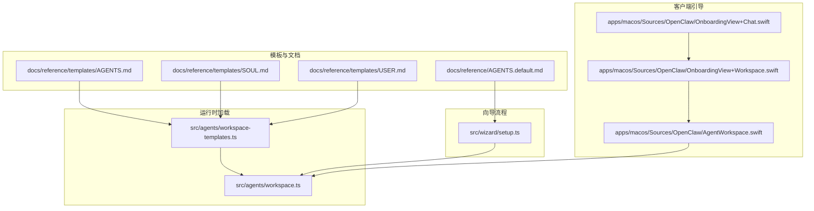
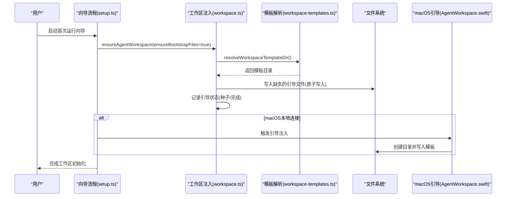
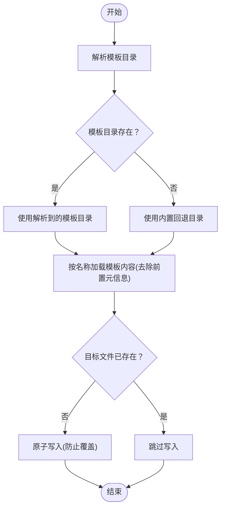
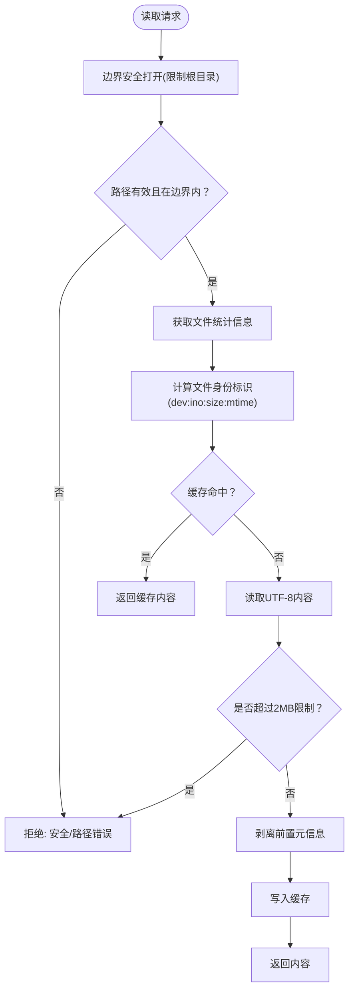
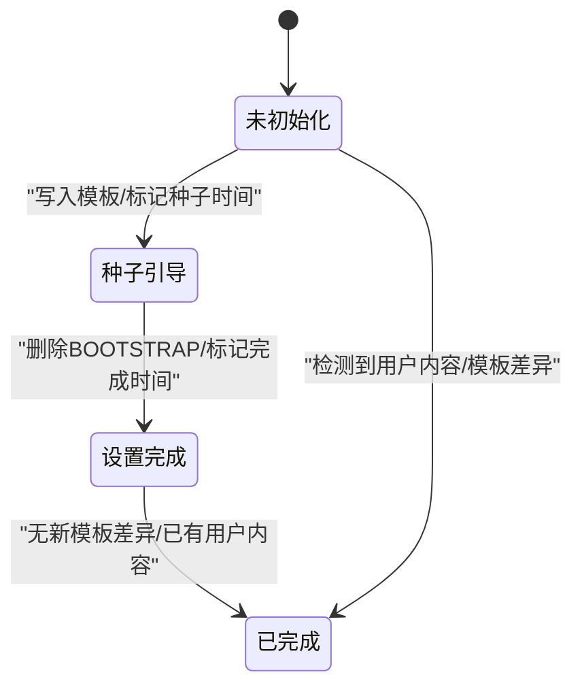
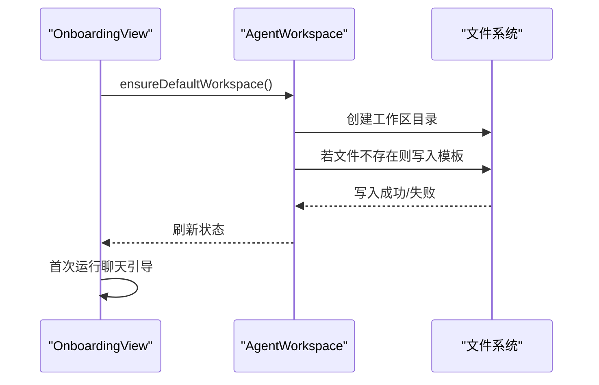
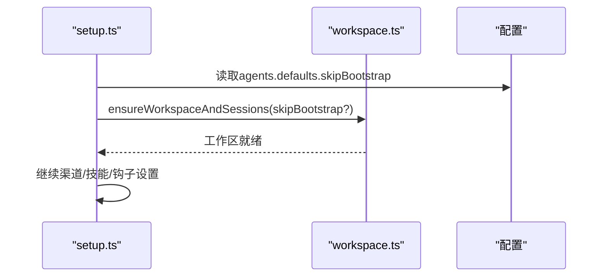
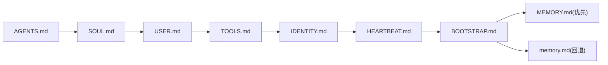
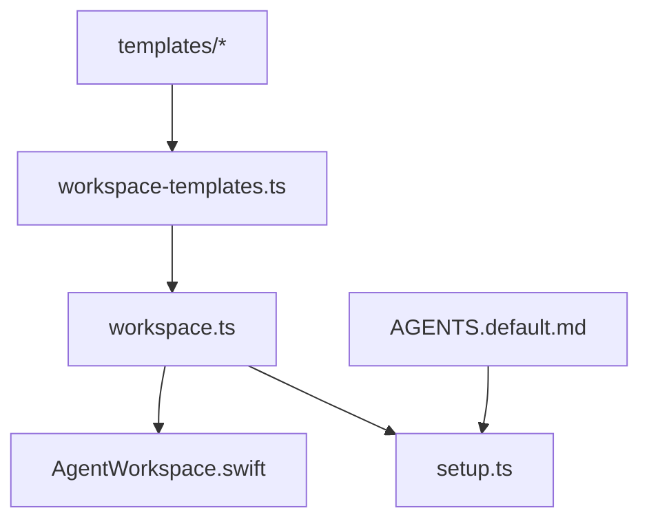

# 引导文件管理

<cite>
**本文档引用的文件**
- [AGENTS.md](file://AGENTS.md)
- [AGENTS.default.md](file://docs/reference/AGENTS.default.md)
- [AGENTS.md（模板）](file://docs/reference/templates/AGENTS.md)
- [SOUL.md（模板）](file://docs/reference/templates/SOUL.md)
- [USER.md（模板）](file://docs/reference/templates/USER.md)
- [workspace.ts](file://src/agents/workspace.ts)
- [workspace-templates.ts](file://src/agents/workspace-templates.ts)
- [AgentWorkspace.swift](file://apps/macos/Sources/OpenClaw/AgentWorkspace.swift)
- [setup.ts](file://src/wizard/setup.ts)
- [OnboardingView+Workspace.swift](file://apps/macos/Sources/OpenClaw/OnboardingView+Workspace.swift)
- [OnboardingView+Chat.swift](file://apps/macos/Sources/OpenClaw/OnboardingView+Chat.swift)
</cite>

## 目录
1. [简介](#简介)
2. [项目结构](#项目结构)
3. [核心组件](#核心组件)
4. [架构总览](#架构总览)
5. [详细组件分析](#详细组件分析)
6. [依赖关系分析](#依赖关系分析)
7. [性能考量](#性能考量)
8. [故障排除指南](#故障排除指南)
9. [结论](#结论)
10. [附录](#附录)

## 简介
本文件系统性阐述 OpenClaw 的“引导文件管理”机制，包括：
- 引导文件的自动创建与注入流程
- 版本与状态管理策略
- 核心引导文件（如 AGENTS.md、SOUL.md、USER.md 等）的作用与加载顺序
- 最大字符限制、文件截断与缺失文件处理策略
- 引导文件的重新创建、更新与备份恢复流程
- 模板来源、自定义配置与故障排除方法
- 在不覆盖用户已有内容的前提下安全更新引导文件的方法

## 项目结构
围绕引导文件管理的关键目录与文件：
- 引导文件模板：位于 docs/reference/templates 下，包含 AGENTS.md、SOUL.md、USER.md 等模板
- 默认工作区引导：docs/reference/AGENTS.default.md 提供默认工作区引导说明与复制步骤
- 运行时加载与注入：src/agents/workspace.ts 负责模板解析、边界安全读取、注入与状态记录
- 模板目录解析：src/agents/workspace-templates.ts 解析模板目录优先级
- 客户端引导：apps/macos/Sources/OpenClaw/AgentWorkspace.swift 与 OnboardingView+Workspace.swift 在 macOS 上执行首次引导与注入
- 向导流程：src/wizard/setup.ts 驱动首次运行向导并确保工作区引导文件存在
- 引导聊天提示：apps/macos/Sources/OpenClaw/OnboardingView+Chat.swift 在首次运行时引导用户完成引导流程

**图表来源**
- [workspace.ts:104-130](file://src/agents/workspace.ts#L104-L130)
- [workspace-templates.ts:14-54](file://src/agents/workspace-templates.ts#L14-L54)
- [AgentWorkspace.swift:94-113](file://apps/macos/Sources/OpenClaw/AgentWorkspace.swift#L94-L113)
- [OnboardingView+Workspace.swift:12-30](file://apps/macos/Sources/OpenClaw/OnboardingView+Workspace.swift#L12-L30)
- [OnboardingView+Chat.swift:4-26](file://apps/macos/Sources/OpenClaw/OnboardingView+Chat.swift#L4-L26)
- [setup.ts:523-525](file://src/wizard/setup.ts#L523-L525)

**章节来源**
- [workspace.ts:12-36](file://src/agents/workspace.ts#L12-L36)
- [workspace-templates.ts:14-54](file://src/agents/workspace-templates.ts#L14-L54)
- [AgentWorkspace.swift:40-113](file://apps/macos/Sources/OpenClaw/AgentWorkspace.swift#L40-L113)
- [OnboardingView+Workspace.swift:1-30](file://apps/macos/Sources/OpenClaw/OnboardingView+Workspace.swift#L1-L30)
- [OnboardingView+Chat.swift:1-26](file://apps/macos/Sources/OpenClaw/OnboardingView+Chat.swift#L1-L26)
- [setup.ts:520-565](file://src/wizard/setup.ts#L520-L565)

## 核心组件
- 模板解析器：从包根或工作目录解析模板目录，优先使用打包模板，回退到内置模板路径
- 引导文件注入器：按需写入 AGENTS.md、SOUL.md、TOOLS.md、IDENTITY.md、USER.md、HEARTBEAT.md、BOOTSTRAP.md 等
- 边界安全读取器：通过边界文件打开与缓存避免越界访问与竞态，限制单文件最大字节数
- 工作区状态机：记录引导种子时间与设置完成时间，支持迁移与幂等
- 客户端引导：macOS 上在首次运行时创建目录并注入模板文件
- 向导驱动：首次运行向导确保工作区存在并可选择跳过引导

**章节来源**
- [workspace.ts:104-130](file://src/agents/workspace.ts#L104-L130)
- [workspace.ts:181-195](file://src/agents/workspace.ts#L181-L195)
- [workspace.ts:487-547](file://src/agents/workspace.ts#L487-L547)
- [workspace.ts:268-282](file://src/agents/workspace.ts#L268-L282)
- [workspace-templates.ts:14-54](file://src/agents/workspace-templates.ts#L14-L54)
- [AgentWorkspace.swift:94-113](file://apps/macos/Sources/OpenClaw/AgentWorkspace.swift#L94-L113)
- [setup.ts:523-525](file://src/wizard/setup.ts#L523-L525)

## 架构总览
引导文件管理由“模板解析—注入—边界读取—状态记录—客户端与向导协同”构成闭环。

**图表来源**
- [setup.ts:523-525](file://src/wizard/setup.ts#L523-L525)
- [workspace.ts:327-465](file://src/agents/workspace.ts#L327-L465)
- [workspace-templates.ts:14-54](file://src/agents/workspace-templates.ts#L14-L54)
- [AgentWorkspace.swift:94-113](file://apps/macos/Sources/OpenClaw/AgentWorkspace.swift#L94-L113)

## 详细组件分析

### 组件一：模板解析与注入
- 模板目录解析优先级：包根 docs/reference/templates > 当前工作目录 docs/reference/templates > 内置回退路径
- 注入策略：仅在目标文件不存在时写入；使用原子写入标志 wx，避免覆盖已有内容
- 支持额外引导文件：通过通配符解析匹配并进行白名单校验，拒绝非引导文件名

**图表来源**
- [workspace-templates.ts:14-54](file://src/agents/workspace-templates.ts#L14-L54)
- [workspace.ts:104-130](file://src/agents/workspace.ts#L104-L130)
- [workspace.ts:181-195](file://src/agents/workspace.ts#L181-L195)

**章节来源**
- [workspace-templates.ts:14-54](file://src/agents/workspace-templates.ts#L14-L54)
- [workspace.ts:104-130](file://src/agents/workspace.ts#L104-L130)
- [workspace.ts:181-195](file://src/agents/workspace.ts#L181-L195)

### 组件二：边界安全读取与最大字符限制
- 边界安全打开：限定只允许读取工作区根下的文件，防止越界
- 缓存策略：基于 inode/dev/大小/修改时间生成稳定标识，命中则直接返回缓存内容
- 最大字节限制：单个引导文件最大 2MB，超过将被拒绝读取
- 前置元信息剥离：去除 YAML/JSON 元信息块，仅保留正文

**图表来源**
- [workspace.ts:56-88](file://src/agents/workspace.ts#L56-L88)
- [workspace.ts](file://src/agents/workspace.ts#L40)
- [workspace.ts:90-102](file://src/agents/workspace.ts#L90-L102)

**章节来源**
- [workspace.ts:40-88](file://src/agents/workspace.ts#L40-L88)
- [workspace.ts:90-102](file://src/agents/workspace.ts#L90-L102)

### 组件三：工作区状态管理与迁移
- 状态文件：.openclaw/workspace-state.json 记录引导种子时间与设置完成时间
- 幂等性：若检测到用户已有内容或模板差异，标记为已完成，避免重复注入 BOOTSTRAP.md
- 迁移兼容：旧字段 onboardingCompletedAt 自动迁移至 setupCompletedAt 并持久化

**图表来源**
- [workspace.ts:268-282](file://src/agents/workspace.ts#L268-L282)
- [workspace.ts:391-452](file://src/agents/workspace.ts#L391-L452)

**章节来源**
- [workspace.ts:268-282](file://src/agents/workspace.ts#L268-L282)
- [workspace.ts:391-452](file://src/agents/workspace.ts#L391-L452)

### 组件四：客户端引导（macOS）
- 目录创建：确保工作区目录存在
- 模板注入：若对应引导文件不存在，则写入默认模板
- 安全检查：若工作区非空且包含模板文件集合之外的内容，禁止覆盖
- 首次运行聊天引导：在合适时机发送引导消息，提示用户先阅读 SOUL.md 并完成首次运行仪式

**图表来源**
- [OnboardingView+Workspace.swift:12-30](file://apps/macos/Sources/OpenClaw/OnboardingView+Workspace.swift#L12-L30)
- [AgentWorkspace.swift:94-113](file://apps/macos/Sources/OpenClaw/AgentWorkspace.swift#L94-L113)
- [OnboardingView+Chat.swift:4-26](file://apps/macos/Sources/OpenClaw/OnboardingView+Chat.swift#L4-L26)

**章节来源**
- [AgentWorkspace.swift:94-113](file://apps/macos/Sources/OpenClaw/AgentWorkspace.swift#L94-L113)
- [OnboardingView+Workspace.swift:1-30](file://apps/macos/Sources/OpenClaw/OnboardingView+Workspace.swift#L1-L30)
- [OnboardingView+Chat.swift:1-26](file://apps/macos/Sources/OpenClaw/OnboardingView+Chat.swift#L1-L26)

### 组件五：向导流程与工作区准备
- 向导调用 ensureWorkspaceAndSessions，根据配置决定是否跳过引导注入
- 注入完成后继续后续设置（渠道、技能、钩子等）

**图表来源**
- [setup.ts:523-525](file://src/wizard/setup.ts#L523-L525)

**章节来源**
- [setup.ts:520-565](file://src/wizard/setup.ts#L520-L565)

### 组件六：核心引导文件的作用与加载顺序
- AGENTS.md：工作区总纲，定义会话启动流程、记忆系统、工具与技能使用规范
- SOUL.md：身份与边界，定义语气、原则与连续性
- USER.md：关于使用者的信息与上下文
- TOOLS.md：环境特定的工具与技能备注
- IDENTITY.md：身份声明与边界
- HEARTBEAT.md：周期性任务清单与检查点
- BOOTSTRAP.md：首次运行的“出生证书”，引导用户完成身份与工作区初始化后通常会被删除

加载顺序（运行时注入）：
1) AGENTS.md
2) SOUL.md
3) USER.md
4) TOOLS.md
5) IDENTITY.md
6) HEARTBEAT.md
7) BOOTSTRAP.md
8) MEMORY.md 或 memory.md（二选一，优先大写）

**图表来源**
- [workspace.ts:487-547](file://src/agents/workspace.ts#L487-L547)
- [workspace.ts:467-485](file://src/agents/workspace.ts#L467-L485)
- [AGENTS.default.md:49-71](file://docs/reference/AGENTS.default.md#L49-L71)

**章节来源**
- [workspace.ts:487-547](file://src/agents/workspace.ts#L487-L547)
- [workspace.ts:467-485](file://src/agents/workspace.ts#L467-L485)
- [AGENTS.default.md:49-71](file://docs/reference/AGENTS.default.md#L49-L71)

## 依赖关系分析
- workspace.ts 依赖 workspace-templates.ts 获取模板目录
- macOS 引导依赖 workspace.ts 的注入能力
- 向导流程依赖 workspace.ts 的工作区准备与状态记录
- 文档模板（AGENTS.default.md、模板目录）为用户提供复制与替换参考

**图表来源**
- [workspace-templates.ts:14-54](file://src/agents/workspace-templates.ts#L14-L54)
- [workspace.ts:327-465](file://src/agents/workspace.ts#L327-L465)
- [AgentWorkspace.swift:94-113](file://apps/macos/Sources/OpenClaw/AgentWorkspace.swift#L94-L113)
- [setup.ts:523-525](file://src/wizard/setup.ts#L523-L525)
- [AGENTS.default.md:21-33](file://docs/reference/AGENTS.default.md#L21-L33)

**章节来源**
- [workspace-templates.ts:14-54](file://src/agents/workspace-templates.ts#L14-L54)
- [workspace.ts:327-465](file://src/agents/workspace.ts#L327-L465)
- [AgentWorkspace.swift:94-113](file://apps/macos/Sources/OpenClaw/AgentWorkspace.swift#L94-L113)
- [setup.ts:523-525](file://src/wizard/setup.ts#L523-L525)
- [AGENTS.default.md:21-33](file://docs/reference/AGENTS.default.md#L21-L33)

## 性能考量
- 原子写入：使用 wx 标志避免并发写入导致的覆盖与竞态
- 文件缓存：基于文件身份标识的缓存减少重复读取与 IO
- 最大字节限制：2MB 限制防止超大文件占用内存与带宽
- 幂等性：重复运行不会重复注入，提升用户体验与稳定性

[本节为通用性能讨论，无需具体文件分析]

## 故障排除指南
常见问题与解决思路：
- 模板缺失：模板目录解析失败时回退到内置路径；若仍失败，检查打包模板是否完整
- 权限不足：确保工作区目录可写；macOS 引导会在必要时创建目录并注入
- 超长文件：单文件超过 2MB 将被拒绝读取；请拆分或清理无关内容
- 覆盖风险：仅在文件不存在时注入；若已有内容，注入将跳过
- 状态异常：检查 .openclaw/workspace-state.json 是否存在且格式正确；必要时手动修复或删除以重置

**章节来源**
- [workspace-templates.ts:14-54](file://src/agents/workspace-templates.ts#L14-L54)
- [workspace.ts](file://src/agents/workspace.ts#L40)
- [workspace.ts:181-195](file://src/agents/workspace.ts#L181-L195)
- [workspace.ts:268-282](file://src/agents/workspace.ts#L268-L282)

## 结论
OpenClaw 的引导文件管理通过“模板解析—原子注入—边界安全读取—状态记录—客户端与向导协同”的闭环，实现了：
- 不覆盖用户已有内容的安全注入
- 明确的加载顺序与最小化白名单策略
- 可观测的状态追踪与迁移兼容
- 面向用户的默认工作区引导与模板复制流程

该体系既保证了首次运行的顺畅体验，也为后续更新与维护提供了清晰的边界与保障。

[本节为总结，无需具体文件分析]

## 附录

### 引导文件模板与默认工作区
- 使用默认工作区引导：参考 docs/reference/AGENTS.default.md 中的复制步骤，将模板复制到工作区
- 替换为默认个人助理：可将 AGENTS.default.md 复制为 AGENTS.md，作为默认工作区引导
- 模板来源：docs/reference/templates 下的 AGENTS.md、SOUL.md、USER.md 等

**章节来源**
- [AGENTS.default.md:11-33](file://docs/reference/AGENTS.default.md#L11-L33)
- [AGENTS.md（模板）:12-26](file://docs/reference/templates/AGENTS.md#L12-L26)
- [SOUL.md（模板）:12-44](file://docs/reference/templates/SOUL.md#L12-L44)
- [USER.md（模板）:7-24](file://docs/reference/templates/USER.md#L7-L24)

### 在不覆盖现有文件的情况下更新引导文件
- 方式一：复制默认模板到工作区，保留已有内容
  - 参考 AGENTS.default.md 中的复制步骤，将模板复制到工作区
- 方式二：通过向导或客户端引导注入缺失文件
  - 向导流程会根据配置决定是否跳过引导注入
  - 客户端引导仅在文件不存在时写入，避免覆盖
- 方式三：手动编辑
  - 直接编辑工作区内的 AGENTS.md、SOUL.md、USER.md 等文件，保持原有内容不变

**章节来源**
- [AGENTS.default.md:21-33](file://docs/reference/AGENTS.default.md#L21-L33)
- [setup.ts:523-525](file://src/wizard/setup.ts#L523-L525)
- [AgentWorkspace.swift:94-113](file://apps/macos/Sources/OpenClaw/AgentWorkspace.swift#L94-L113)

### 版本管理与备份恢复
- 版本位置：多处版本信息分布在 package.json、各平台构建配置与文档中
- 备份建议：将工作区作为 git 仓库管理，便于回滚与恢复
- 恢复策略：删除工作区后重新运行向导或复制模板，即可重建引导文件

**章节来源**
- [workspace.ts:268-282](file://src/agents/workspace.ts#L268-L282)
- [AGENTS.default.md:80-90](file://docs/reference/AGENTS.default.md#L80-L90)