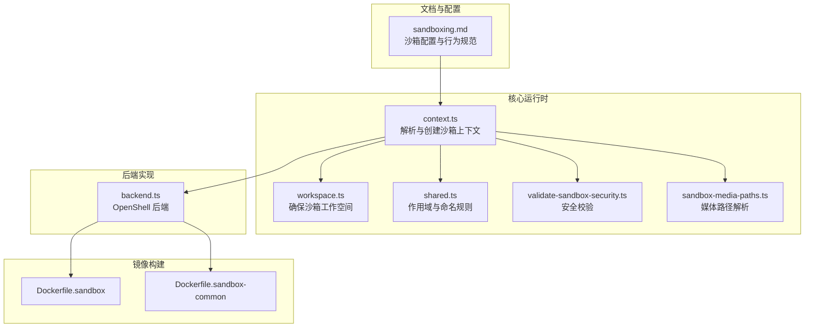
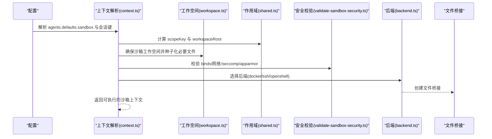
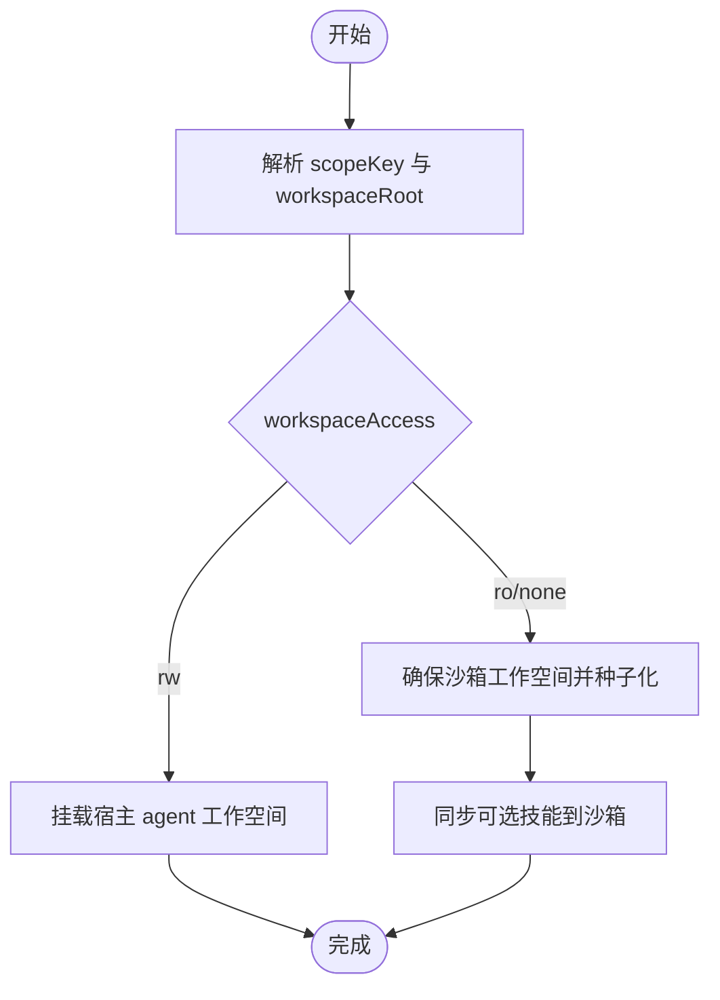
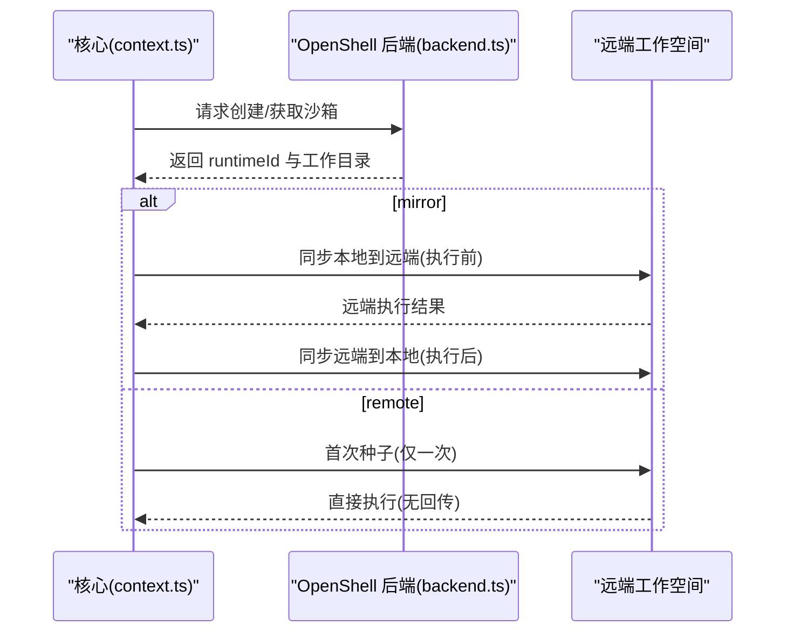
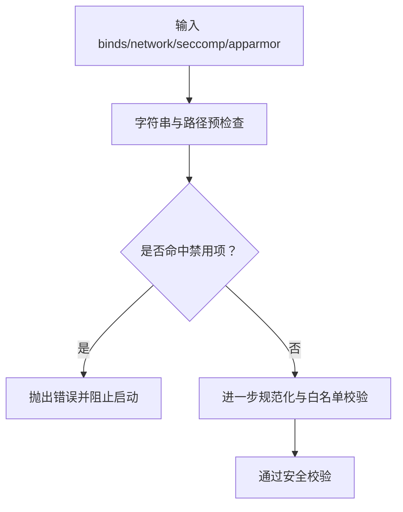
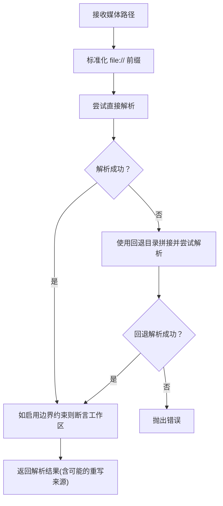
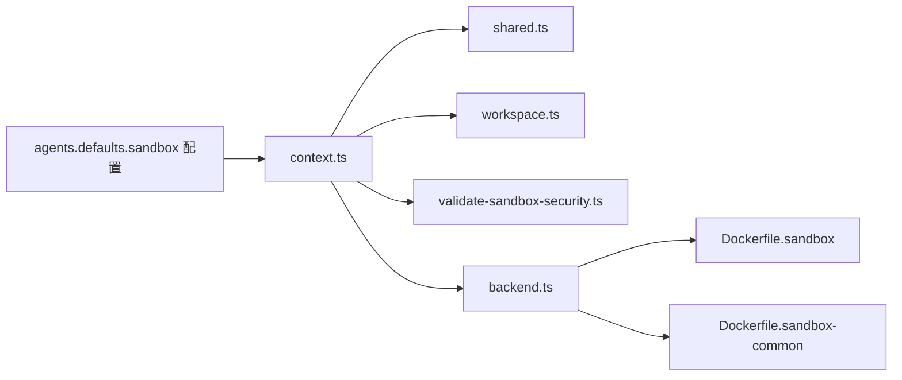

# 沙箱集成机制

<cite>
**本文引用的文件**
- [sandboxing.md](file://docs/gateway/sandboxing.md)
- [context.ts](file://src/agents/sandbox/context.ts)
- [workspace.ts](file://src/agents/sandbox/workspace.ts)
- [shared.ts](file://src/agents/sandbox/shared.ts)
- [validate-sandbox-security.ts](file://src/agents/sandbox/validate-sandbox-security.ts)
- [sandbox-media-paths.ts](file://src/agents/sandbox-media-paths.ts)
- [backend.ts](file://extensions/openshell/src/backend.ts)
- [Dockerfile.sandbox](file://Dockerfile.sandbox)
- [Dockerfile.sandbox-common](file://Dockerfile.sandbox-common)
- [sandbox-skills.test.ts](file://src/agents/sandbox-skills.test.ts)
</cite>

## 目录
1. [简介](#简介)
2. [项目结构](#项目结构)
3. [核心组件](#核心组件)
4. [架构总览](#架构总览)
5. [详细组件分析](#详细组件分析)
6. [依赖关系分析](#依赖关系分析)
7. [性能考量](#性能考量)
8. [故障排除指南](#故障排除指南)
9. [结论](#结论)
10. [附录](#附录)

## 简介
本文件系统性阐述 OpenClaw 的沙箱集成机制，重点覆盖以下方面：
- 工作空间与沙箱系统的集成方式：默认工作空间与沙箱工作空间的区别
- workspaceAccess 配置选项对文件访问权限的影响
- 启用沙箱时的工作空间切换机制
- 沙箱工作空间的存储位置、隔离策略与安全边界
- 沙箱配置参数、权限控制规则与路径映射机制
- 沙箱启用的最佳实践、性能考虑与故障排除

## 项目结构
围绕沙箱功能的关键目录与文件如下：
- 文档与规范：docs/gateway/sandboxing.md
- 核心运行时与上下文：src/agents/sandbox/*.ts
- OpenShell 插件后端：extensions/openshell/src/backend.ts
- 沙箱镜像构建：Dockerfile.sandbox、Dockerfile.sandbox-common
- 测试用例：src/agents/sandbox-skills.test.ts

**图表来源**
- [sandboxing.md:1-447](file://docs/gateway/sandboxing.md#L1-L447)
- [context.ts:1-238](file://src/agents/sandbox/context.ts#L1-L238)
- [workspace.ts:1-66](file://src/agents/sandbox/workspace.ts#L1-L66)
- [shared.ts:1-47](file://src/agents/sandbox/shared.ts#L1-L47)
- [validate-sandbox-security.ts:1-344](file://src/agents/sandbox/validate-sandbox-security.ts#L1-L344)
- [sandbox-media-paths.ts:1-81](file://src/agents/sandbox-media-paths.ts#L1-L81)
- [backend.ts:89-446](file://extensions/openshell/src/backend.ts#L89-L446)
- [Dockerfile.sandbox:1-25](file://Dockerfile.sandbox#L1-L25)
- [Dockerfile.sandbox-common:1-49](file://Dockerfile.sandbox-common#L1-L49)

**章节来源**
- [sandboxing.md:1-447](file://docs/gateway/sandboxing.md#L1-L447)
- [context.ts:1-238](file://src/agents/sandbox/context.ts#L1-L238)

## 核心组件
- 沙箱上下文解析与创建：负责根据会话键、配置与工作空间，决定是否启用沙箱、如何布局沙箱工作空间，并创建后端与文件桥接。
- 沙箱工作空间管理：在首次使用时从宿主工作空间种子化（seed）必要的元数据文件，确保沙箱内具备最小可用环境。
- 作用域与命名：按 session/agent/shared 三种作用域生成工作空间根目录与子目录名，保证不同作用域下的隔离与共享策略。
- 安全校验：对 bind mounts、网络模式、seccomp/apparmor 等进行严格校验，阻断高危配置。
- 媒体路径解析：在沙箱内解析媒体路径，支持工作区边界约束与回退目录策略。
- OpenShell 后端：提供远程执行与文件桥接能力，支持 mirror 与 remote 两种工作模型。

**章节来源**
- [context.ts:1-238](file://src/agents/sandbox/context.ts#L1-L238)
- [workspace.ts:1-66](file://src/agents/sandbox/workspace.ts#L1-L66)
- [shared.ts:1-47](file://src/agents/sandbox/shared.ts#L1-L47)
- [validate-sandbox-security.ts:1-344](file://src/agents/sandbox/validate-sandbox-security.ts#L1-L344)
- [sandbox-media-paths.ts:1-81](file://src/agents/sandbox-media-paths.ts#L1-L81)
- [backend.ts:89-446](file://extensions/openshell/src/backend.ts#L89-L446)

## 架构总览
下图展示沙箱生命周期与关键交互：从配置解析到工作空间布局，再到后端选择与文件桥接，最终由工具在沙箱中执行。

**图表来源**
- [context.ts:91-213](file://src/agents/sandbox/context.ts#L91-L213)
- [workspace.ts:17-65](file://src/agents/sandbox/workspace.ts#L17-L65)
- [shared.ts:18-34](file://src/agents/sandbox/shared.ts#L18-L34)
- [validate-sandbox-security.ts:328-343](file://src/agents/sandbox/validate-sandbox-security.ts#L328-L343)
- [backend.ts:89-146](file://extensions/openshell/src/backend.ts#L89-L146)

## 详细组件分析

### 组件A：工作空间与沙箱上下文
- 作用域与工作空间布局
  - scope: session/agent/shared 决定 workspaceRoot 下的子目录组织方式
  - workspaceAccess: none/ro/rw 决定容器内挂载点与写入权限
  - 当 workspaceAccess 为 rw 时，容器内工作空间直接指向宿主 agent 工作空间；否则指向沙箱工作空间
- 种子化流程
  - 首次创建时将宿主工作空间中的关键元数据文件复制到沙箱工作空间
  - 若未设置跳过引导，则在沙箱工作空间内生成引导文件
- 技能镜像同步
  - 在 workspaceAccess 为 ro 或 none 时，会将可选技能复制到沙箱工作空间，以便工具读取

**图表来源**
- [context.ts:21-66](file://src/agents/sandbox/context.ts#L21-L66)
- [workspace.ts:17-65](file://src/agents/sandbox/workspace.ts#L17-L65)
- [sandbox-skills.test.ts:33-78](file://src/agents/sandbox-skills.test.ts#L33-L78)

**章节来源**
- [context.ts:21-66](file://src/agents/sandbox/context.ts#L21-L66)
- [workspace.ts:17-65](file://src/agents/sandbox/workspace.ts#L17-L65)
- [sandbox-skills.test.ts:33-78](file://src/agents/sandbox-skills.test.ts#L33-L78)

### 组件B：OpenShell 后端与工作模型
- 后端能力
  - 支持 mirror 与 remote 两种模式
  - 提供文件桥接与远程命令执行
  - 不支持 sandbox.docker.binds（由插件限制）
- mirror 模式
  - 执行前将本地工作空间同步至远端，执行后将远端工作空间同步回本地
  - 适合需要本地编辑即时反映到沙箱的场景
- remote 模式
  - 首次创建时将本地工作空间一次性种子到远端
  - 之后所有文件操作与执行均直接针对远端工作空间
  - 适合远端作为“真实工作区”的场景

**图表来源**
- [backend.ts:89-146](file://extensions/openshell/src/backend.ts#L89-L146)
- [backend.ts:284-322](file://extensions/openshell/src/backend.ts#L284-L322)
- [backend.ts:402-428](file://extensions/openshell/src/backend.ts#L402-L428)

**章节来源**
- [backend.ts:89-146](file://extensions/openshell/src/backend.ts#L89-L146)
- [backend.ts:284-322](file://extensions/openshell/src/backend.ts#L284-L322)
- [backend.ts:402-428](file://extensions/openshell/src/backend.ts#L402-L428)

### 组件C：安全边界与权限控制
- bind mounts 安全校验
  - 禁止挂载系统敏感路径（如 /etc、/proc、/sys、/dev、/run*、/var/run/docker.sock 等）
  - 禁止覆盖保留目标路径（如 /workspace、/agent）
  - 支持白名单允许源根目录与危险豁免开关
- 网络模式限制
  - 默认禁止 host 与 container:* 命名空间加入模式
  - 可通过危险开关启用，但需明确信任
- seccomp/apparmor
  - 禁止 unconfined 配置，要求使用受控策略或省略

**图表来源**
- [validate-sandbox-security.ts:96-117](file://src/agents/sandbox/validate-sandbox-security.ts#L96-L117)
- [validate-sandbox-security.ts:234-281](file://src/agents/sandbox/validate-sandbox-security.ts#L234-L281)
- [validate-sandbox-security.ts:283-306](file://src/agents/sandbox/validate-sandbox-security.ts#L283-L306)
- [validate-sandbox-security.ts:308-326](file://src/agents/sandbox/validate-sandbox-security.ts#L308-L326)

**章节来源**
- [validate-sandbox-security.ts:16-37](file://src/agents/sandbox/validate-sandbox-security.ts#L16-L37)
- [validate-sandbox-security.ts:234-343](file://src/agents/sandbox/validate-sandbox-security.ts#L234-L343)

### 组件D：媒体路径与工作区边界
- 媒体路径解析
  - 支持 file:// 与普通路径
  - 可指定回退目录（inboundFallbackDir），当直接解析失败时尝试回退
  - 可启用 workspaceOnly 以强制工作区边界约束
- 路径重写与回退
  - 若解析到回退路径，返回 rewrittenFrom 字段提示原始路径

**图表来源**
- [sandbox-media-paths.ts:21-80](file://src/agents/sandbox-media-paths.ts#L21-L80)

**章节来源**
- [sandbox-media-paths.ts:1-81](file://src/agents/sandbox-media-paths.ts#L1-L81)

## 依赖关系分析
- 上下文解析依赖作用域计算、工作空间确保与安全校验
- OpenShell 后端依赖插件配置与远程 CLI
- 文件桥接依赖后端提供的传输与权限策略
- 镜像构建为 Docker 后端提供基础运行环境

**图表来源**
- [context.ts:1-238](file://src/agents/sandbox/context.ts#L1-L238)
- [shared.ts:1-47](file://src/agents/sandbox/shared.ts#L1-L47)
- [workspace.ts:1-66](file://src/agents/sandbox/workspace.ts#L1-L66)
- [validate-sandbox-security.ts:1-344](file://src/agents/sandbox/validate-sandbox-security.ts#L1-L344)
- [backend.ts:89-146](file://extensions/openshell/src/backend.ts#L89-L146)
- [Dockerfile.sandbox:1-25](file://Dockerfile.sandbox#L1-L25)
- [Dockerfile.sandbox-common:1-49](file://Dockerfile.sandbox-common#L1-L49)

**章节来源**
- [context.ts:1-238](file://src/agents/sandbox/context.ts#L1-L238)
- [backend.ts:89-146](file://extensions/openshell/src/backend.ts#L89-L146)

## 性能考量
- workspaceAccess 与挂载策略
  - workspaceAccess: none/ro 将写入挂载关闭或只读，减少容器内写放大带来的同步成本
  - Docker 默认网络为 none，避免不必要的 egress 带来额外开销
- OpenShell 模式选择
  - remote 模式减少每轮执行前后同步，降低 I/O 成本
  - mirror 模式在每次执行前后进行双向同步，适合需要实时同步的场景
- 镜像与工具链
  - 使用 common 镜像可减少容器内安装步骤，缩短冷启动时间
  - setupCommand 需要网络与 root 权限，建议在镜像层固化而非容器内执行

[本节为通用指导，不直接分析具体文件]

## 故障排除指南
- 沙箱未生效
  - 检查 agents.defaults.sandbox.mode 是否为 non-main/all
  - 确认会话键不是主会话（主会话在 non-main 模式下不会启用沙箱）
- workspaceAccess 导致写入失败
  - ro/none 模式下写入会被拒绝；切换到 rw 或在工具策略上放宽
- OpenShell 同步问题
  - remote 模式下宿主修改不会自动反映到远端，需 recreate 重新种子
  - mirror 模式下若同步失败，检查远端可达性与权限
- bind mounts 被拒绝
  - 检查是否挂载了系统敏感路径或覆盖保留目标路径
  - 使用 allowedSourceRoots 白名单或危险豁免开关（仅在完全信任时启用）
- Docker 网络与安全策略
  - host 与 container:* 命名空间加入被默认禁止；如需启用请明确风险
  - seccomp/apparmor 使用 unconfined 会被拒绝

**章节来源**
- [sandboxing.md:238-250](file://docs/gateway/sandboxing.md#L238-L250)
- [validate-sandbox-security.ts:283-326](file://src/agents/sandbox/validate-sandbox-security.ts#L283-L326)
- [backend.ts:89-95](file://extensions/openshell/src/backend.ts#L89-L95)

## 结论
OpenClaw 的沙箱集成通过“配置驱动 + 后端抽象 + 安全校验”的方式，在保障安全的前提下提供了灵活的工作空间模型。默认工作空间与沙箱工作空间的分离、workspaceAccess 的细粒度权限控制、以及 OpenShell 的 mirror/remote 模式选择，使得用户可以在安全性与易用性之间按需权衡。结合合理的镜像与网络策略，可在多数场景下获得稳定且高性能的执行体验。

[本节为总结性内容，不直接分析具体文件]

## 附录

### A. 关键配置参数速览
- agents.defaults.sandbox.mode：控制启用范围（off/non-main/all）
- agents.defaults.sandbox.scope：控制容器数量（session/agent/shared）
- agents.defaults.sandbox.backend：后端类型（docker/ssh/openshell）
- agents.defaults.sandbox.workspaceAccess：工作空间可见性（none/ro/rw）
- agents.defaults.sandbox.docker.binds：自定义 bind 挂载
- agents.defaults.sandbox.browser.binds：浏览器容器专用挂载
- plugins.entries.openshell.config.mode：OpenShell 工作模型（mirror/remote）

**章节来源**
- [sandboxing.md:39-66](file://docs/gateway/sandboxing.md#L39-L66)
- [sandboxing.md:171-221](file://docs/gateway/sandboxing.md#L171-L221)
- [sandboxing.md:258-269](file://docs/gateway/sandboxing.md#L258-L269)

### B. 最佳实践清单
- 默认启用沙箱（mode: non-main 或 all），仅在特殊需求下关闭
- 使用 workspaceAccess: ro/none 限制写入，必要时再提升到 rw
- 优先使用 remote 模式以降低同步开销，需要实时同步时使用 mirror
- 自定义 binds 时使用 allowedSourceRoots 并避免挂载系统敏感路径
- 使用 common 镜像减少容器内安装步骤，缩短冷启动时间
- 对于 OpenShell，recreate 用于重置远端工作空间状态

**章节来源**
- [sandboxing.md:213-236](file://docs/gateway/sandboxing.md#L213-L236)
- [validate-sandbox-security.ts:29-37](file://src/agents/sandbox/validate-sandbox-security.ts#L29-L37)