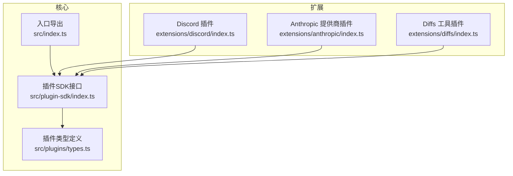
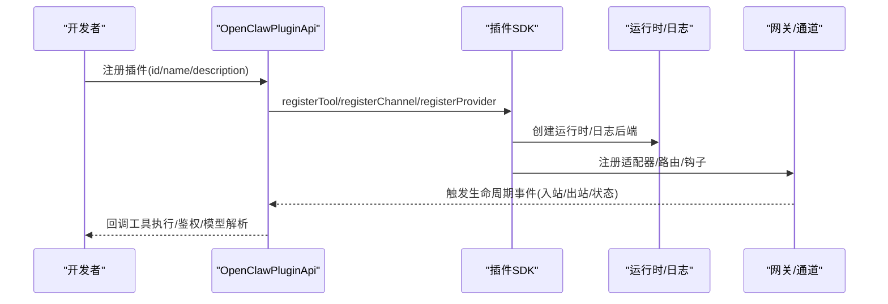
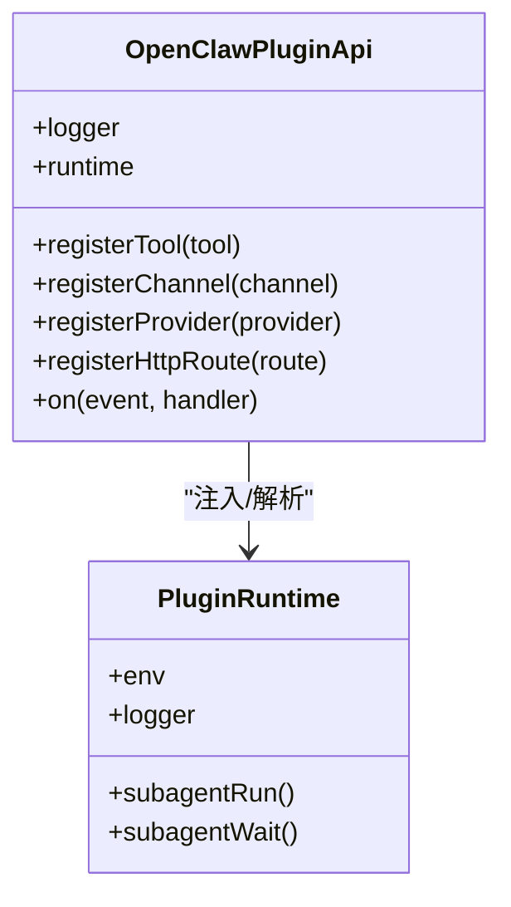
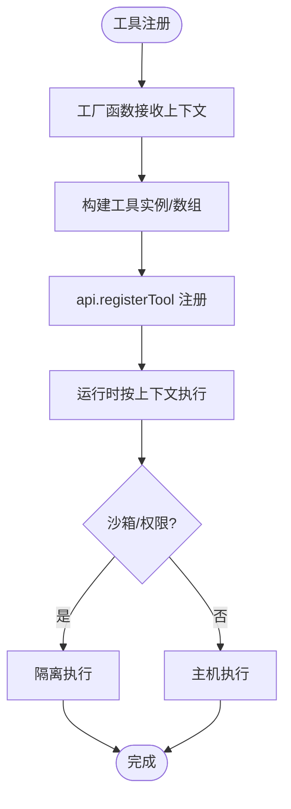
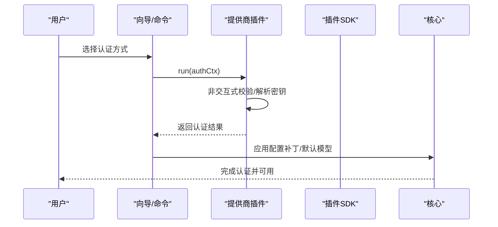
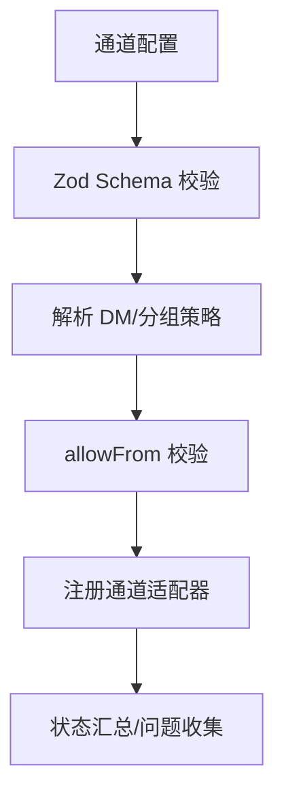
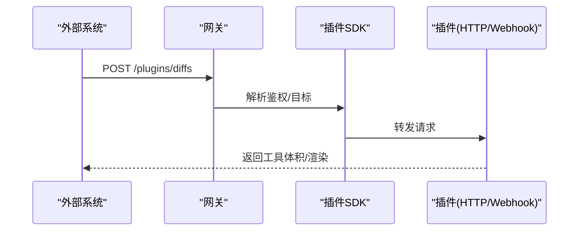
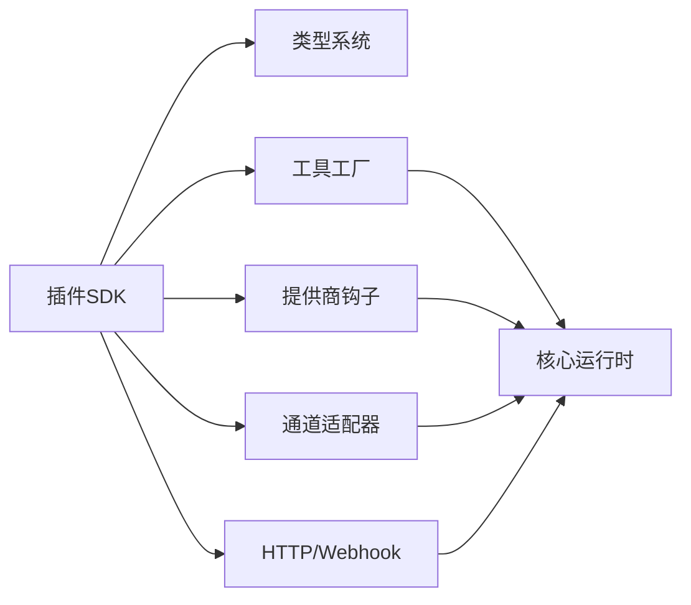

# 代理工具开发

<cite>
**本文引用的文件**
- [README.md](file://README.md)
- [index.ts](file://src/index.ts)
- [plugin-sdk/index.ts](file://src/plugin-sdk/index.ts)
- [plugins/types.ts](file://src/plugins/types.ts)
- [shared/runtime.ts](file://extensions/shared/runtime.ts)
- [allowlist-resolution.ts](file://src/plugin-sdk/allowlist-resolution.ts)
- [config-schema-helpers.ts](file://extensions/shared/config-schema-helpers.ts)
- [discord/index.ts](file://extensions/discord/index.ts)
- [anthropic/index.ts](file://extensions/anthropic/index.ts)
- [diffs/index.ts](file://extensions/diffs/index.ts)
</cite>

## 目录
1. [简介](#简介)
2. [项目结构](#项目结构)
3. [核心组件](#核心组件)
4. [架构总览](#架构总览)
5. [详细组件分析](#详细组件分析)
6. [依赖分析](#依赖分析)
7. [性能考虑](#性能考虑)
8. [故障排查指南](#故障排查指南)
9. [结论](#结论)
10. [附录](#附录)

## 简介
本指南面向代理工具开发者，系统阐述 OpenClaw 的工具开发框架、工具接口规范与实现模式，覆盖工具生命周期管理、依赖注入、测试策略、最佳实践、性能优化与安全考量，并提供可扩展工具集、自定义工具与第三方工具服务集成的实操路径。

## 项目结构
OpenClaw 采用多模块与插件化架构：核心运行时通过入口导出统一 API；插件 SDK 提供工具、通道、提供商与运行时能力的标准化接口；各扩展（如 Discord、Anthropic、Diffs）以插件形式注册到系统中，形成可组合的能力集合。

图示来源
- [index.ts:1-58](file://src/index.ts#L1-L58)
- [plugin-sdk/index.ts:1-800](file://src/plugin-sdk/index.ts#L1-L800)
- [plugins/types.ts:1-800](file://src/plugins/types.ts#L1-L800)
- [discord/index.ts:1-23](file://extensions/discord/index.ts#L1-L23)
- [anthropic/index.ts:1-319](file://extensions/anthropic/index.ts#L1-L319)
- [diffs/index.ts:1-45](file://extensions/diffs/index.ts#L1-L45)

章节来源
- [README.md:1-560](file://README.md#L1-L560)
- [index.ts:1-58](file://src/index.ts#L1-L58)

## 核心组件
- 入口导出层：负责安装全局错误处理、解析 CLI 并导出库级能力（配置加载、会话存储、端口检查等），作为包根导出的统一入口。
- 插件 SDK：集中暴露工具、通道、提供商、运行时、HTTP 路由、Webhook、状态与鉴权等能力的类型与工厂方法，是所有插件实现的契约。
- 插件类型系统：定义工具上下文、提供商认证、模型解析、流包装、使用量查询、思维级别策略等扩展点，确保插件与核心解耦。

章节来源
- [index.ts:1-58](file://src/index.ts#L1-L58)
- [plugin-sdk/index.ts:1-800](file://src/plugin-sdk/index.ts#L1-L800)
- [plugins/types.ts:1-800](file://src/plugins/types.ts#L1-L800)

## 架构总览
OpenClaw 的工具开发围绕“插件 API + 运行时环境 + 生命周期钩子”展开。插件通过注册工具、通道适配器、提供商与 HTTP/Webhook 能力，接入统一的会话、消息路由与安全控制。

图示来源
- [plugin-sdk/index.ts:1-800](file://src/plugin-sdk/index.ts#L1-L800)
- [plugins/types.ts:1-800](file://src/plugins/types.ts#L1-L800)
- [shared/runtime.ts:1-15](file://extensions/shared/runtime.ts#L1-L15)

## 详细组件分析

### 组件A：插件注册与生命周期
- 注册入口：插件在注册阶段传入 id、name、description、configSchema，并通过 API 完成工具、通道、提供商、HTTP 路由与钩子的注册。
- 生命周期钩子：支持 before_prompt_build 等钩子，允许插件在提示构建前注入系统上下文或调整行为。
- 运行时注入：通过 SDK 提供的 createLoggerBackedRuntime 解析日志后端，保证插件在不同环境下具备一致的日志能力。

图示来源
- [discord/index.ts:1-23](file://extensions/discord/index.ts#L1-L23)
- [diffs/index.ts:1-45](file://extensions/diffs/index.ts#L1-L45)
- [shared/runtime.ts:1-15](file://extensions/shared/runtime.ts#L1-L15)

章节来源
- [discord/index.ts:1-23](file://extensions/discord/index.ts#L1-L23)
- [diffs/index.ts:1-45](file://extensions/diffs/index.ts#L1-L45)
- [shared/runtime.ts:1-15](file://extensions/shared/runtime.ts#L1-L15)

### 组件B：工具接口规范与实现模式
- 工具上下文：OpenClawPluginToolContext 提供会话键、请求者身份、沙箱模式、工作区与代理目录等信息，便于工具按需读取。
- 工具工厂：OpenClawPluginToolFactory 接受上下文返回工具实例或数组，支持可选工具声明。
- 工具注册：插件通过 api.registerTool 将工具注册到系统，工具名称与别名由插件定义。
- 执行模式：工具在运行时根据上下文决定是否沙箱执行、是否允许设备节点能力等。

图示来源
- [plugins/types.ts:72-98](file://src/plugins/types.ts#L72-L98)
- [plugins/types.ts:89-91](file://src/plugins/types.ts#L89-L91)
- [diffs/index.ts:14-42](file://extensions/diffs/index.ts#L14-L42)

章节来源
- [plugins/types.ts:72-98](file://src/plugins/types.ts#L72-L98)
- [plugins/types.ts:89-91](file://src/plugins/types.ts#L89-L91)
- [diffs/index.ts:14-42](file://extensions/diffs/index.ts#L14-L42)

### 组件C：提供商与认证扩展
- 认证方法：ProviderAuthMethod 支持 oauth、api_key、token、device_code、custom 等方式，提供交互式与非交互式两种认证流程。
- 动态模型解析：resolveDynamicModel/prepareDynamicModel/normalizeResolvedModel 提供模型发现、预热与传输归一化的扩展点。
- 使用量查询：resolveUsageAuth/fetchUsageSnapshot 为提供商专属的配额/用量查询提供统一入口。
- 思维级别策略：isBinaryThinking/supportsXHighThinking/resolveDefaultThinkingLevel 控制推理强度策略。

图示来源
- [plugins/types.ts:184-193](file://src/plugins/types.ts#L184-L193)
- [plugins/types.ts:545-738](file://src/plugins/types.ts#L545-L738)
- [anthropic/index.ts:261-319](file://extensions/anthropic/index.ts#L261-L319)

章节来源
- [plugins/types.ts:184-193](file://src/plugins/types.ts#L184-L193)
- [plugins/types.ts:545-738](file://src/plugins/types.ts#L545-L738)
- [anthropic/index.ts:261-319](file://extensions/anthropic/index.ts#L261-L319)

### 组件D：通道适配器与安全策略
- 通道适配器：通过 registerChannel 注册消息适配器、线程、提及策略、目录与安全策略等。
- 安全策略：allowFrom 列表、DM 策略、分组工具策略、提及门控等，均通过 SDK 的 schema 与解析工具进行校验与应用。
- 配置校验：requireChannelOpenAllowFrom 等辅助函数确保当 dmPolicy="open" 时必须包含 "*"。

图示来源
- [plugin-sdk/index.ts:242-249](file://src/plugin-sdk/index.ts#L242-L249)
- [config-schema-helpers.ts:11-26](file://extensions/shared/config-schema-helpers.ts#L11-L26)
- [discord/index.ts:1-23](file://extensions/discord/index.ts#L1-L23)

章节来源
- [plugin-sdk/index.ts:242-249](file://src/plugin-sdk/index.ts#L242-L249)
- [config-schema-helpers.ts:11-26](file://extensions/shared/config-schema-helpers.ts#L11-L26)
- [discord/index.ts:1-23](file://extensions/discord/index.ts#L1-L23)

### 组件E：HTTP/Webhook 与工具体积扩展
- HTTP 路由：插件可通过 registerHttpRoute 注册受控路由（支持前缀匹配、插件内鉴权），用于工具体积渲染、临时资源访问等。
- Webhook：SDK 提供目标解析、鉴权守卫、限流与异常追踪，保障外部触发的安全与稳定。
- 工具体积：如 Diffs 插件将工具体积存储于临时目录并通过 HTTP 暴露只读视图，结合安全开关控制远程访问。

图示来源
- [plugin-sdk/index.ts:164-198](file://src/plugin-sdk/index.ts#L164-L198)
- [plugin-sdk/index.ts:486-491](file://src/plugin-sdk/index.ts#L486-L491)
- [diffs/index.ts:14-42](file://extensions/diffs/index.ts#L14-L42)

章节来源
- [plugin-sdk/index.ts:164-198](file://src/plugin-sdk/index.ts#L164-L198)
- [plugin-sdk/index.ts:486-491](file://src/plugin-sdk/index.ts#L486-L491)
- [diffs/index.ts:14-42](file://extensions/diffs/index.ts#L14-L42)

## 依赖分析
- 松耦合：插件通过 SDK 类型与工厂函数对接核心，避免直接依赖具体实现。
- 可组合：通道、提供商、工具、HTTP/Webhook 均可独立注册，形成可插拔能力矩阵。
- 安全边界：allowlist、DM 策略、提及门控与 Webhook 限流共同构成安全基线。

图示来源
- [plugin-sdk/index.ts:1-800](file://src/plugin-sdk/index.ts#L1-L800)
- [plugins/types.ts:1-800](file://src/plugins/types.ts#L1-L800)

章节来源
- [plugin-sdk/index.ts:1-800](file://src/plugin-sdk/index.ts#L1-L800)
- [plugins/types.ts:1-800](file://src/plugins/types.ts#L1-L800)

## 性能考虑
- 模型解析缓存：利用提供商的动态模型预热与缓存 TTL 合规性判断，减少重复网络开销。
- 流包装与参数归一：通过 prepareExtraParams 与 wrapStreamFn 在进入通用流包装前做最小必要变更，降低额外序列化成本。
- Webhook 内存守卫：固定窗口限流与异常计数器可抑制突发流量对系统的影响。
- 临时资源管理：工具体积存储于临时目录，配合清理策略避免磁盘膨胀。

章节来源
- [plugins/types.ts:377-396](file://src/plugins/types.ts#L377-L396)
- [plugin-sdk/index.ts:486-491](file://src/plugin-sdk/index.ts#L486-L491)
- [diffs/index.ts:14-42](file://extensions/diffs/index.ts#L14-L42)

## 故障排查指南
- 全局未捕获异常：入口安装未处理拒绝与未捕获异常处理器，确保崩溃时输出格式化错误并优雅退出。
- Webhook 请求限制：使用 installRequestBodyLimitGuard 与 readJsonBodyWithLimit 等工具，快速定位超长/非法请求。
- 安全策略告警：通过 collectStatusIssues 与状态汇总函数识别通道配置问题，结合 allowFrom 校验与 DM 策略诊断。
- 日志传输：通过 registerLogTransport 注册传输，统一采集插件日志以便定位。

章节来源
- [index.ts:43-57](file://src/index.ts#L43-L57)
- [plugin-sdk/index.ts:469-478](file://src/plugin-sdk/index.ts#L469-L478)
- [plugin-sdk/index.ts:644-645](file://src/plugin-sdk/index.ts#L644-L645)

## 结论
OpenClaw 的插件体系以 SDK 为核心，提供完备的工具、通道、提供商与运行时扩展点。通过标准化的生命周期钩子、严格的配置校验与安全基线，开发者可以快速构建可维护、可扩展且安全的代理工具。建议优先从简单工具入手，逐步引入提供商认证、Webhook 与通道适配，同时重视性能与安全的平衡。

## 附录

### 开发最佳实践
- 使用 OpenClawPluginToolContext 获取会话与请求者信息，避免硬编码。
- 通过 ProviderAuthMethod 提供清晰的交互式与非交互式认证路径，提升可运维性。
- 对外暴露的 HTTP/Webhook 路由应遵循最小权限原则，结合鉴权与限流。
- 工具体积与临时资源应纳入清理策略，避免长期占用磁盘。

### 工具测试策略
- 单元测试：针对工具工厂与上下文解析逻辑编写断言。
- 集成测试：模拟插件注册、HTTP/Webhook 调用与提供商认证流程。
- 安全测试：验证 allowFrom、DM 策略与 Webhook 限流在边界条件下的表现。

### 扩展与发布
- 扩展现有工具集：基于现有插件（如 Diffs）的注册模式与 HTTP 路由范式扩展新功能。
- 自定义工具：实现 OpenClawPluginToolFactory 并通过 api.registerTool 注册。
- 第三方工具服务集成：通过 registerProvider 实现认证、模型解析与用量查询的桥接。

章节来源
- [plugins/types.ts:72-98](file://src/plugins/types.ts#L72-L98)
- [diffs/index.ts:14-42](file://extensions/diffs/index.ts#L14-L42)
- [anthropic/index.ts:261-319](file://extensions/anthropic/index.ts#L261-L319)