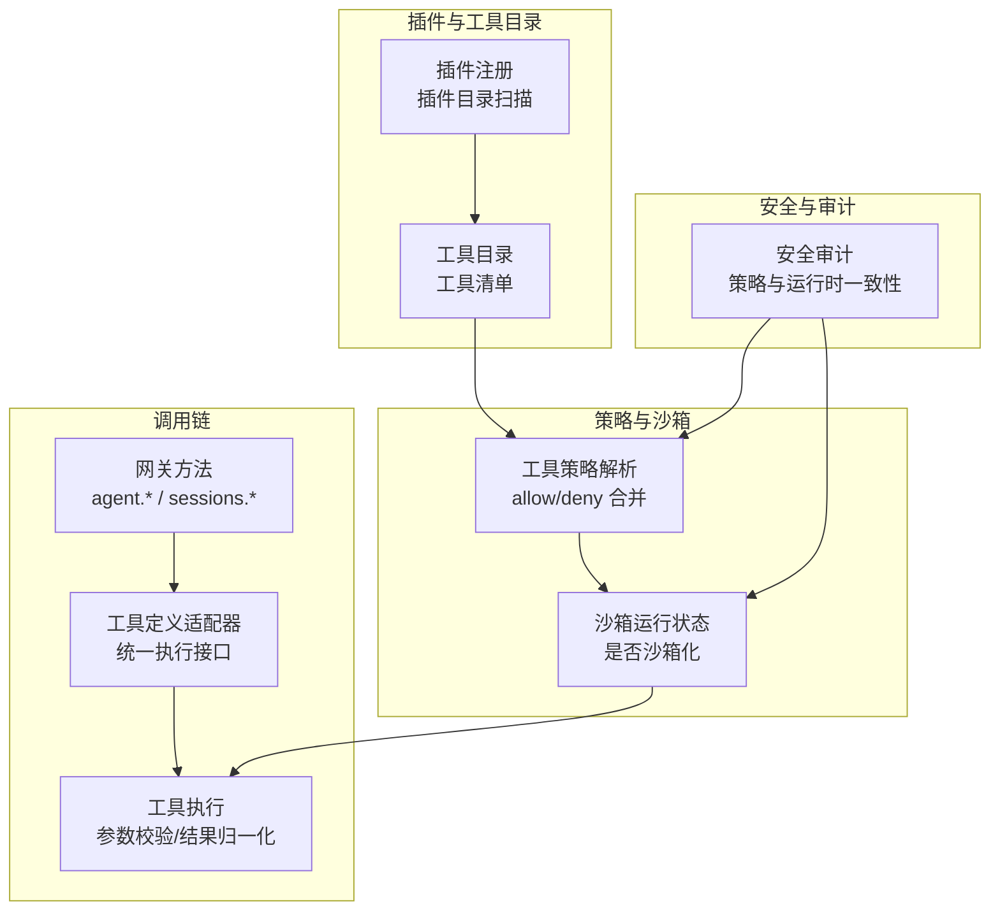
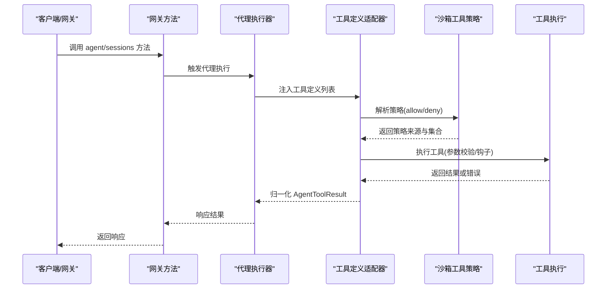
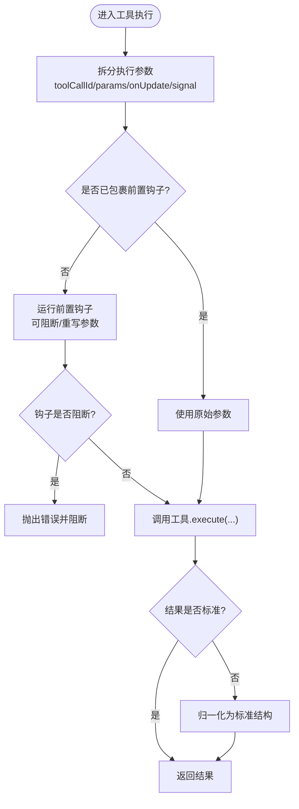
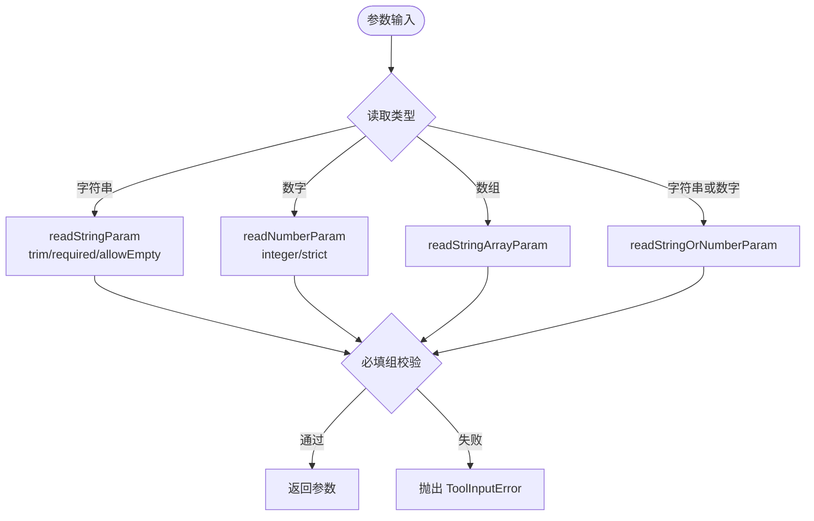
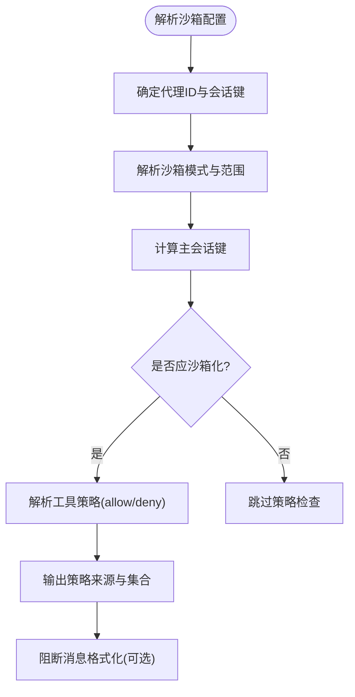
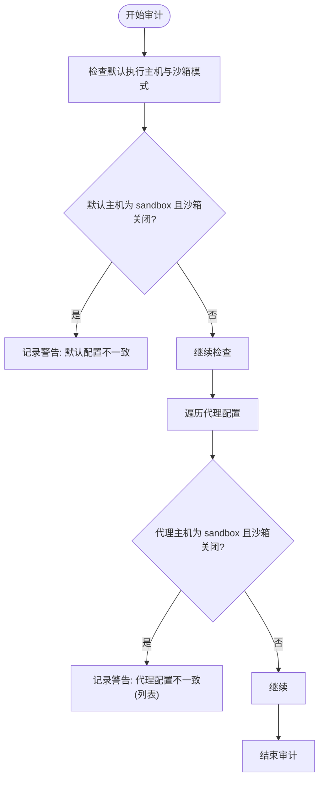
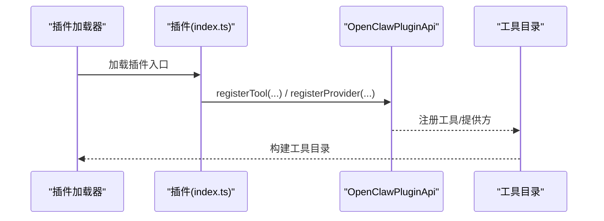
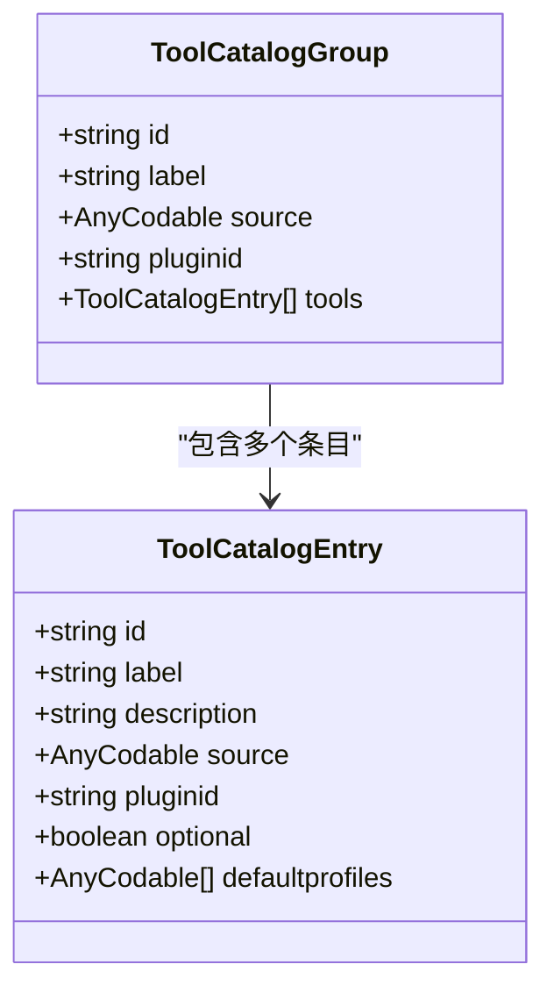
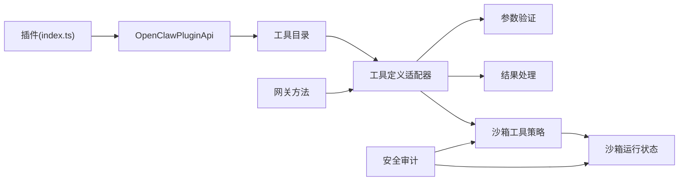

# 代理工具集成

<cite>
**本文引用的文件**
- [README.md](file://README.md)
- [src/agents/pi-tool-definition-adapter.ts](file://src/agents/pi-tool-definition-adapter.ts)
- [src/agents/tools/common.ts](file://src/agents/tools/common.ts)
- [src/agents/pi-tools.params.ts](file://src/agents/pi-tools.params.ts)
- [src/agents/sandbox-tool-policy.ts](file://src/agents/sandbox-tool-policy.ts)
- [src/agents/sandbox/runtime-status.ts](file://src/agents/sandbox/runtime-status.ts)
- [src/security/audit.ts](file://src/security/audit.ts)
- [src/gateway/server-methods/agent.ts](file://src/gateway/server-methods/agent.ts)
- [src/cli/plugin-registry.ts](file://src/cli/plugin-registry.ts)
- [extensions/anthropic/index.ts](file://extensions/anthropic/index.ts)
- [extensions/anthropic/openclaw.plugin.json](file://extensions/anthropic/openclaw.plugin.json)
- [apps/macos/Sources/OpenClawProtocol/GatewayModels.swift](file://apps/macos/Sources/OpenClawProtocol/GatewayModels.swift)
- [apps/shared/OpenClawKit/Sources/OpenClawProtocol/GatewayModels.swift](file://apps/shared/OpenClawKit/Sources/OpenClawProtocol/GatewayModels.swift)
- [src/agents/pi-embedded-runner/tool-split.ts](file://src/agents/pi-embedded-runner/tool-split.ts)
- [src/agents/pi-embedded-runner/run/payloads.ts](file://src/agents/pi-embedded-runner/run/payloads.ts)
- [src/agents/sandbox-explain.test.ts](file://src/agents/sandbox-explain.test.ts)
- [src/agents/bash-tools.exec.path.test.ts](file://src/agents/bash-tools.exec.path.test.ts)
- [src/agents/test-helpers/subagent-gateway.ts](file://src/agents/test-helpers/subagent-gateway.ts)
- [src/agents/pi-tool-definition-adapter.test.ts](file://src/agents/pi-tool-definition-adapter.test.ts)
- [src/auto-reply/reply/export-html/template.js](file://src/auto-reply/reply/export-html/template.js)
</cite>

## 目录
1. [简介](#简介)
2. [项目结构](#项目结构)
3. [核心组件](#核心组件)
4. [架构总览](#架构总览)
5. [详细组件分析](#详细组件分析)
6. [依赖关系分析](#依赖关系分析)
7. [性能考量](#性能考量)
8. [故障排查指南](#故障排查指南)
9. [结论](#结论)
10. [附录](#附录)

## 简介
本文件面向“代理工具集成”的目标，系统化梳理 OpenClaw 的工具目录管理、工具策略配置与工具调用协调机制，覆盖工具定义适配器、参数验证、结果处理、权限控制、沙箱策略与安全限制，并提供工具开发指南、自定义工具创建与测试方法，以及扩展现有工具集与集成第三方工具服务的实践路径。

## 项目结构
OpenClaw 将“工具”作为代理能力的核心扩展点，围绕以下层次组织：
- 工具注册与目录：通过插件系统加载工具，形成工具目录；工具目录在运行期被注入到代理执行环境。
- 工具策略与沙箱：基于会话与代理维度解析工具策略（允许/拒绝），并在沙箱模式下强制执行。
- 工具调用链：从网关方法到代理执行器，再到工具适配器与具体工具实现，贯穿参数校验、结果归一化与错误处理。
- 安全审计与权限：对工具执行主机、策略来源与会话沙箱状态进行审计与提示，确保策略与运行时一致。

图示来源
- [src/cli/plugin-registry.ts:56-103](file://src/cli/plugin-registry.ts#L56-L103)
- [src/agents/sandbox-tool-policy.ts:21-37](file://src/agents/sandbox-tool-policy.ts#L21-L37)
- [src/agents/sandbox/runtime-status.ts:45-97](file://src/agents/sandbox/runtime-status.ts#L45-L97)
- [src/agents/pi-tool-definition-adapter.ts:137-194](file://src/agents/pi-tool-definition-adapter.ts#L137-L194)
- [src/security/audit.ts:886-923](file://src/security/audit.ts#L886-L923)

章节来源
- [README.md:1-560](file://README.md#L1-L560)
- [src/cli/plugin-registry.ts:56-103](file://src/cli/plugin-registry.ts#L56-L103)

## 核心组件
- 工具定义适配器：将不同来源的工具包装为统一的 ToolDefinition，负责参数拆分、前置钩子、异常捕获与结果标准化。
- 参数验证与规范化：提供字符串/数字/数组等参数读取器，支持必填、去空格、类型转换与必填组校验。
- 结果处理：统一返回 AgentToolResult，保证内容结构与细节字段一致。
- 沙箱工具策略：按代理/全局/默认优先级解析 allow/deny 列表，支持 alsoAllow 的叠加语义。
- 沙箱运行状态：根据会话键与主会话键判断是否沙箱化，并输出策略来源与阻断消息格式化。
- 安全审计：检查工具执行主机与沙箱模式不一致、策略来源冲突等风险项。
- 插件与工具目录：插件注册 API 提供工具注册入口，插件目录扫描构建工具目录。

章节来源
- [src/agents/pi-tool-definition-adapter.ts:137-194](file://src/agents/pi-tool-definition-adapter.ts#L137-L194)
- [src/agents/tools/common.ts:61-142](file://src/agents/tools/common.ts#L61-L142)
- [src/agents/pi-tools.params.ts:168-204](file://src/agents/pi-tools.params.ts#L168-L204)
- [src/agents/sandbox-tool-policy.ts:21-37](file://src/agents/sandbox-tool-policy.ts#L21-L37)
- [src/agents/sandbox/runtime-status.ts:45-97](file://src/agents/sandbox/runtime-status.ts#L45-L97)
- [src/security/audit.ts:886-923](file://src/security/audit.ts#L886-L923)
- [src/cli/plugin-registry.ts:56-103](file://src/cli/plugin-registry.ts#L56-L103)

## 架构总览
工具集成的关键流程如下：
- 插件加载：根据配置与工作区扫描插件，构建工具目录。
- 策略解析：按代理覆盖 > 全局 > 默认的优先级合并 allow/deny。
- 调用协调：网关方法触发代理执行，代理将工具列表转为统一定义，执行前运行前置钩子，执行后归一化结果。
- 沙箱约束：若会话处于沙箱模式，严格按策略放行/阻断；若策略要求沙箱但运行时不可用，报错提示。
- 安全审计：对策略与运行时一致性进行告警，指导修复。

图示来源
- [src/gateway/server-methods/agent.ts:254-269](file://src/gateway/server-methods/agent.ts#L254-L269)
- [src/agents/pi-tool-definition-adapter.ts:137-194](file://src/agents/pi-tool-definition-adapter.ts#L137-L194)
- [src/agents/sandbox-tool-policy.ts:21-37](file://src/agents/sandbox-tool-policy.ts#L21-L37)
- [src/agents/sandbox/runtime-status.ts:45-97](file://src/agents/sandbox/runtime-status.ts#L45-L97)

## 详细组件分析

### 组件A：工具定义适配器与调用协调
- 功能要点
  - 将 AgentTool 包装为 ToolDefinition，统一 execute 接口，自动处理参数顺序兼容（新旧签名）。
  - 在执行前后运行前置钩子，支持参数调整与阻断。
  - 捕获异常并转化为标准 AgentToolResult，避免上游崩溃。
  - 对非标准结果进行归一化，确保 content[] 存在且包含文本描述。
- 关键流程
  - 参数拆分：区分新旧 execute 参数顺序，提取 toolCallId、params、onUpdate、signal。
  - 钩子执行：在未显式包裹钩子时自动运行 before-tool-call 钩子，支持阻断与参数重写。
  - 异常处理：AbortSignal 或 AbortError 直接透传；其他错误统一记录日志并返回 jsonResult(status="error")。
  - 结果归一化：将任意返回值转换为包含 content[] 的结构，便于下游渲染与审计。

图示来源
- [src/agents/pi-tool-definition-adapter.ts:113-194](file://src/agents/pi-tool-definition-adapter.ts#L113-L194)

章节来源
- [src/agents/pi-tool-definition-adapter.ts:1-237](file://src/agents/pi-tool-definition-adapter.ts#L1-L237)
- [src/agents/pi-embedded-runner/tool-split.ts:8-17](file://src/agents/pi-embedded-runner/tool-split.ts#L8-L17)
- [src/agents/pi-embedded-runner/run/payloads.ts:36-53](file://src/agents/pi-embedded-runner/run/payloads.ts#L36-L53)

### 组件B：参数验证与结果处理
- 参数读取器
  - 字符串/数字/数组/字符串或数字等多形态读取，支持 required、trim、allowEmpty、integer、strict 等选项。
  - 必填组校验：支持“至少满足一组键”的必填规则，提升工具参数健壮性。
- 结果处理
  - jsonResult：将任意负载序列化为 AgentToolResult，便于传输与渲染。
  - 图像结果封装：支持从文件读取并生成图像媒体内容，配合图片净化策略。
- 权限门控
  - ownerOnly 工具：当发送者非所有者时，拦截执行并返回特定错误信息。

图示来源
- [src/agents/tools/common.ts:61-142](file://src/agents/tools/common.ts#L61-L142)
- [src/agents/pi-tools.params.ts:168-204](file://src/agents/pi-tools.params.ts#L168-L204)

章节来源
- [src/agents/tools/common.ts:1-328](file://src/agents/tools/common.ts#L1-L328)
- [src/agents/pi-tools.params.ts:154-204](file://src/agents/pi-tools.params.ts#L154-L204)

### 组件C：沙箱策略与运行状态
- 策略解析
  - 优先级：代理覆盖 > 全局 > 默认；deny 优先于 allow；alsoAllow 叠加 allow。
  - 工具组展开：deny/allow 中的组名会被展开为具体工具名。
- 运行状态
  - 根据 sessionKey 与主会话键判断是否沙箱化；输出策略来源（来自代理/全局/默认）。
  - 当工具被阻断时，格式化可读的阻断消息，包含策略来源与建议。

图示来源
- [src/agents/sandbox/runtime-status.ts:45-97](file://src/agents/sandbox/runtime-status.ts#L45-L97)
- [src/agents/sandbox-tool-policy.ts:21-37](file://src/agents/sandbox-tool-policy.ts#L21-L37)
- [src/agents/sandbox-explain.test.ts:8-34](file://src/agents/sandbox-explain.test.ts#L8-L34)

章节来源
- [src/agents/sandbox-tool-policy.ts:1-38](file://src/agents/sandbox-tool-policy.ts#L1-L38)
- [src/agents/sandbox/runtime-status.ts:45-97](file://src/agents/sandbox/runtime-status.ts#L45-L97)
- [src/agents/sandbox-explain.test.ts:1-34](file://src/agents/sandbox-explain.test.ts#L1-L34)

### 组件D：安全审计与策略一致性
- 审计检查
  - 当 tools.exec.host 显式设置为 sandbox，而 agents.defaults.sandbox.mode=off 时发出警告。
  - 针对特定代理的 tools.exec.host=sandbox 且其沙箱模式关闭的情况，列出受影响代理并给出修复建议。
- 运行时约束
  - 若策略要求沙箱但运行时不可用，工具执行直接失败，提示“沙箱运行时不可用”。

图示来源
- [src/security/audit.ts:886-923](file://src/security/audit.ts#L886-L923)
- [src/agents/bash-tools.exec.path.test.ts:227-236](file://src/agents/bash-tools.exec.path.test.ts#L227-L236)

章节来源
- [src/security/audit.ts:466-527](file://src/security/audit.ts#L466-L527)
- [src/security/audit.ts:886-923](file://src/security/audit.ts#L886-L923)
- [src/agents/bash-tools.exec.path.test.ts:215-236](file://src/agents/bash-tools.exec.path.test.ts#L215-L236)

### 组件E：插件系统与工具目录
- 插件注册
  - 插件通过 registerTool/registerProvider 等 API 注册工具与提供方。
  - 支持动态模型解析、认证流程与使用量查询等扩展能力。
- 工具目录
  - 插件目录扫描构建工具清单；工具目录在运行期注入到代理执行环境。
  - 客户端托管工具（client tools）可被拦截并返回“待处理”结果，交由客户端执行。

图示来源
- [extensions/anthropic/index.ts:261-315](file://extensions/anthropic/index.ts#L261-L315)
- [extensions/anthropic/openclaw.plugin.json:1-13](file://extensions/anthropic/openclaw.plugin.json#L1-L13)
- [src/cli/plugin-registry.ts:56-103](file://src/cli/plugin-registry.ts#L56-L103)

章节来源
- [extensions/anthropic/index.ts:1-319](file://extensions/anthropic/index.ts#L1-L319)
- [extensions/anthropic/openclaw.plugin.json:1-13](file://extensions/anthropic/openclaw.plugin.json#L1-L13)
- [src/cli/plugin-registry.ts:56-103](file://src/cli/plugin-registry.ts#L56-L103)

### 组件F：工具目录数据模型（协议层）
- 工具目录条目与分组
  - ToolCatalogEntry：包含 id、label、description、source、pluginId、optional、defaultProfiles 等字段。
  - ToolCatalogGroup：包含 id、label、source、pluginId、tools 数组。
- 作用
  - 用于前端或跨平台组件展示可用工具与分组信息，便于用户选择与配置。

图示来源
- [apps/macos/Sources/OpenClawProtocol/GatewayModels.swift:2468-2525](file://apps/macos/Sources/OpenClawProtocol/GatewayModels.swift#L2468-L2525)
- [apps/shared/OpenClawKit/Sources/OpenClawProtocol/GatewayModels.swift:2468-2525](file://apps/shared/OpenClawKit/Sources/OpenClawProtocol/GatewayModels.swift#L2468-L2525)

章节来源
- [apps/macos/Sources/OpenClawProtocol/GatewayModels.swift:2468-2525](file://apps/macos/Sources/OpenClawProtocol/GatewayModels.swift#L2468-L2525)
- [apps/shared/OpenClawKit/Sources/OpenClawProtocol/GatewayModels.swift:2468-2525](file://apps/shared/OpenClawKit/Sources/OpenClawProtocol/GatewayModels.swift#L2468-L2525)

## 依赖关系分析
- 组件耦合
  - 工具定义适配器依赖参数验证与结果处理模块，同时与沙箱策略解耦，仅在运行时受策略影响。
  - 沙箱策略与运行状态相互依赖：策略解析依赖运行状态中的会话键与代理信息。
  - 插件系统为工具目录提供来源，工具目录再被注入到代理执行器。
- 外部依赖
  - 插件 SDK 提供注册 API；网关方法提供调用入口；安全审计模块提供策略一致性检查。

图示来源
- [extensions/anthropic/index.ts:261-315](file://extensions/anthropic/index.ts#L261-L315)
- [src/agents/pi-tool-definition-adapter.ts:137-194](file://src/agents/pi-tool-definition-adapter.ts#L137-L194)
- [src/agents/sandbox-tool-policy.ts:21-37](file://src/agents/sandbox-tool-policy.ts#L21-L37)
- [src/agents/sandbox/runtime-status.ts:45-97](file://src/agents/sandbox/runtime-status.ts#L45-L97)
- [src/security/audit.ts:886-923](file://src/security/audit.ts#L886-L923)

章节来源
- [src/agents/pi-tool-definition-adapter.ts:1-237](file://src/agents/pi-tool-definition-adapter.ts#L1-L237)
- [src/agents/sandbox-tool-policy.ts:1-38](file://src/agents/sandbox-tool-policy.ts#L1-L38)
- [src/agents/sandbox/runtime-status.ts:45-97](file://src/agents/sandbox/runtime-status.ts#L45-L97)
- [src/security/audit.ts:886-923](file://src/security/audit.ts#L886-L923)

## 性能考量
- 工具执行开销
  - 参数拆分与钩子执行为常数级开销；结果归一化与图片处理可能引入 I/O 与编码成本。
  - 建议：对大对象参数采用流式处理或延迟加载，减少不必要的序列化。
- 策略解析
  - allow/deny 合并与组展开为线性复杂度；建议在配置层面尽量精简策略，避免深层嵌套。
- 沙箱运行
  - 沙箱化会增加进程隔离与资源消耗；仅对非主会话启用沙箱，降低整体开销。
- 并发与超时
  - 工具执行支持 AbortSignal，建议在高并发场景中合理设置超时与取消策略，避免资源泄露。

## 故障排查指南
- 工具调用失败
  - 检查工具定义适配器的日志与错误返回，确认参数是否符合 schema，是否存在阻断钩子。
  - 参考测试用例定位问题：[src/agents/pi-tool-definition-adapter.test.ts:1-39](file://src/agents/pi-tool-definition-adapter.test.ts#L1-L39)
- 沙箱策略阻断
  - 使用运行状态辅助函数格式化阻断消息，核对策略来源与工具名称。
  - 参考测试用例：[src/agents/sandbox-explain.test.ts:1-34](file://src/agents/sandbox-explain.test.ts#L1-L34)
- 执行主机与沙箱模式不一致
  - 审计模块会提示“默认/代理配置不一致”，需调整 tools.exec.host 或 agents.defaults.sandbox.mode。
  - 参考审计实现：[src/security/audit.ts:886-923](file://src/security/audit.ts#L886-L923)
- 工具执行主机受限
  - 当 sandbox 主机被配置但沙箱运行时不可用时，工具执行会失败，提示“沙箱运行时不可用”。
  - 参考测试用例：[src/agents/bash-tools.exec.path.test.ts:227-236](file://src/agents/bash-tools.exec.path.test.ts#L227-L236)
- 网关方法参数校验
  - agentId 等参数需在已知代理列表内，否则返回无效请求错误。
  - 参考实现：[src/gateway/server-methods/agent.ts:254-269](file://src/gateway/server-methods/agent.ts#L254-L269)

章节来源
- [src/agents/pi-tool-definition-adapter.test.ts:1-39](file://src/agents/pi-tool-definition-adapter.test.ts#L1-L39)
- [src/agents/sandbox-explain.test.ts:1-34](file://src/agents/sandbox-explain.test.ts#L1-L34)
- [src/security/audit.ts:886-923](file://src/security/audit.ts#L886-L923)
- [src/agents/bash-tools.exec.path.test.ts:215-236](file://src/agents/bash-tools.exec.path.test.ts#L215-L236)
- [src/gateway/server-methods/agent.ts:254-269](file://src/gateway/server-methods/agent.ts#L254-L269)

## 结论
OpenClaw 的工具集成以“插件驱动 + 策略可控 + 沙箱安全”为核心设计，通过工具定义适配器统一执行接口，结合参数验证与结果归一化，确保工具在不同提供方与运行环境下的一致行为。沙箱策略与安全审计进一步强化了工具执行的安全边界，适合在多会话、多代理场景下稳定扩展工具集。开发者可基于插件 API 快速创建自定义工具，并通过测试与审计保障质量与安全。

## 附录

### 工具开发指南
- 创建工具
  - 使用插件 API 的 registerTool 注册工具，提供 name、label、description、parameters 与 execute。
  - 参考插件示例：[extensions/anthropic/index.ts:261-315](file://extensions/anthropic/index.ts#L261-L315)
- 参数 schema
  - 使用 TypeBox 或 JSON Schema 定义参数结构，必要时使用必填组校验。
  - 参考参数读取器：[src/agents/tools/common.ts:61-142](file://src/agents/tools/common.ts#L61-L142)、[src/agents/pi-tools.params.ts:168-204](file://src/agents/pi-tools.params.ts#L168-L204)
- 结果规范
  - 返回 AgentToolResult，确保 content[] 存在；必要时使用 jsonResult 或 imageResult。
  - 参考结果处理：[src/agents/tools/common.ts:217-289](file://src/agents/tools/common.ts#L217-L289)
- 前置钩子
  - 如需参数调整或阻断逻辑，可在工具外层包裹 before-tool-call 钩子。
  - 参考适配器：[src/agents/pi-tool-definition-adapter.ts:11-15](file://src/agents/pi-tool-definition-adapter.ts#L11-L15)

章节来源
- [extensions/anthropic/index.ts:261-315](file://extensions/anthropic/index.ts#L261-L315)
- [src/agents/tools/common.ts:61-142](file://src/agents/tools/common.ts#L61-L142)
- [src/agents/pi-tools.params.ts:168-204](file://src/agents/pi-tools.params.ts#L168-L204)
- [src/agents/tools/common.ts:217-289](file://src/agents/tools/common.ts#L217-L289)
- [src/agents/pi-tool-definition-adapter.ts:11-15](file://src/agents/pi-tool-definition-adapter.ts#L11-L15)

### 自定义工具创建与测试
- 创建工具工厂与测试夹具
  - 使用工具工厂测试夹具解析与注册工具，便于单元测试与集成测试。
  - 参考夹具：[extensions/feishu/src/tool-factory-test-harness.ts:37-76](file://extensions/feishu/src/tool-factory-test-harness.ts#L37-L76)
- 单元测试
  - 验证工具执行、错误捕获与结果归一化；参考适配器测试：[src/agents/pi-tool-definition-adapter.test.ts:1-39](file://src/agents/pi-tool-definition-adapter.test.ts#L1-L39)
- 集成测试
  - 使用子代理网关模拟器安装，验证工具在会话间协作的行为。
  - 参考模拟器：[src/agents/test-helpers/subagent-gateway.ts:1-9](file://src/agents/test-helpers/subagent-gateway.ts#L1-L9)

章节来源
- [extensions/feishu/src/tool-factory-test-harness.ts:37-76](file://extensions/feishu/src/tool-factory-test-harness.ts#L37-L76)
- [src/agents/pi-tool-definition-adapter.test.ts:1-39](file://src/agents/pi-tool-definition-adapter.test.ts#L1-L39)
- [src/agents/test-helpers/subagent-gateway.ts:1-9](file://src/agents/test-helpers/subagent-gateway.ts#L1-L9)

### 工具测试方法
- 参数校验测试
  - 使用必填组校验与参数读取器组合，覆盖空值、非法类型与缺失场景。
  - 参考：[src/agents/pi-tools.params.ts:168-204](file://src/agents/pi-tools.params.ts#L168-L204)
- 错误处理测试
  - 验证工具抛错被适配器捕获并转化为标准结果。
  - 参考：[src/agents/pi-tool-definition-adapter.test.ts:1-39](file://src/agents/pi-tool-definition-adapter.test.ts#L1-L39)
- 沙箱策略测试
  - 使用解释辅助函数验证策略来源与合并逻辑。
  - 参考：[src/agents/sandbox-explain.test.ts:1-34](file://src/agents/sandbox-explain.test.ts#L1-L34)

章节来源
- [src/agents/pi-tools.params.ts:168-204](file://src/agents/pi-tools.params.ts#L168-L204)
- [src/agents/pi-tool-definition-adapter.test.ts:1-39](file://src/agents/pi-tool-definition-adapter.test.ts#L1-L39)
- [src/agents/sandbox-explain.test.ts:1-34](file://src/agents/sandbox-explain.test.ts#L1-L34)

### 扩展现有工具集与集成第三方工具服务
- 插件化扩展
  - 通过 registerProvider 与 registerTool 扩展第三方服务（如 Anthropic、GitHub Copilot 等）。
  - 参考：[extensions/anthropic/index.ts:261-315](file://extensions/anthropic/index.ts#L261-L315)、[extensions/anthropic/openclaw.plugin.json:1-13](file://extensions/anthropic/openclaw.plugin.json#L1-L13)
- 工具目录展示
  - 使用工具目录数据模型在前端或跨平台组件中展示工具与分组。
  - 参考：[apps/macos/Sources/OpenClawProtocol/GatewayModels.swift:2468-2525](file://apps/macos/Sources/OpenClawProtocol/GatewayModels.swift#L2468-L2525)、[apps/shared/OpenClawKit/Sources/OpenClawProtocol/GatewayModels.swift:2468-2525](file://apps/shared/OpenClawKit/Sources/OpenClawProtocol/GatewayModels.swift#L2468-L2525)
- 工具 HTML 导出
  - 在自动回复导出模板中渲染可用工具列表与参数说明。
  - 参考：[src/auto-reply/reply/export-html/template.js:1586-1609](file://src/auto-reply/reply/export-html/template.js#L1586-L1609)

章节来源
- [extensions/anthropic/index.ts:261-315](file://extensions/anthropic/index.ts#L261-L315)
- [extensions/anthropic/openclaw.plugin.json:1-13](file://extensions/anthropic/openclaw.plugin.json#L1-L13)
- [apps/macos/Sources/OpenClawProtocol/GatewayModels.swift:2468-2525](file://apps/macos/Sources/OpenClawProtocol/GatewayModels.swift#L2468-L2525)
- [apps/shared/OpenClawKit/Sources/OpenClawProtocol/GatewayModels.swift:2468-2525](file://apps/shared/OpenClawKit/Sources/OpenClawProtocol/GatewayModels.swift#L2468-L2525)
- [src/auto-reply/reply/export-html/template.js:1586-1609](file://src/auto-reply/reply/export-html/template.js#L1586-L1609)