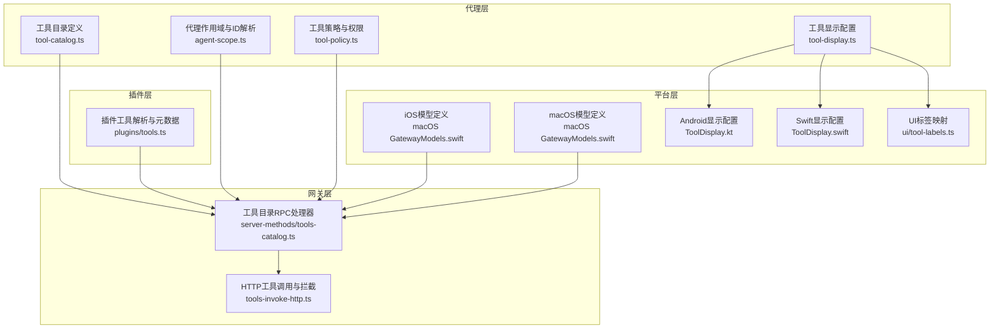
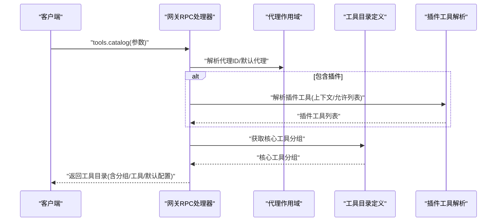
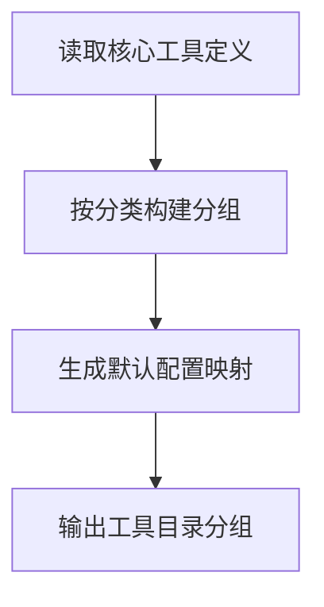
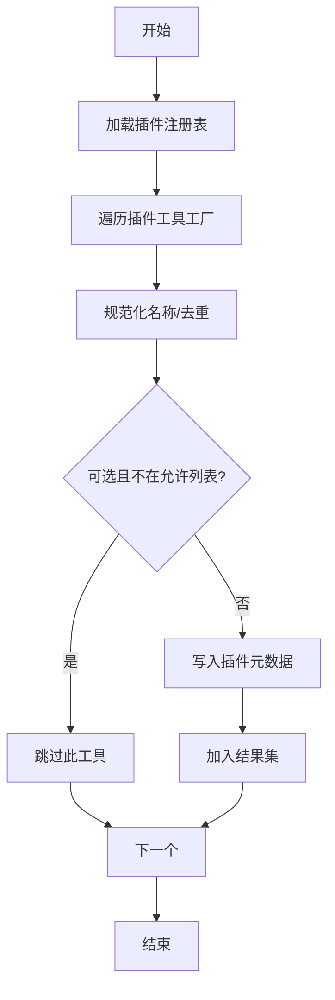
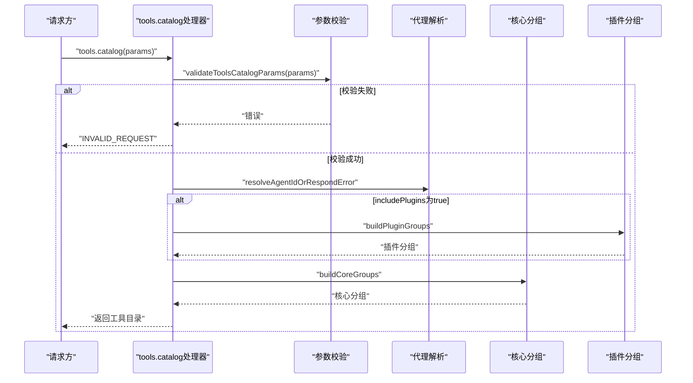
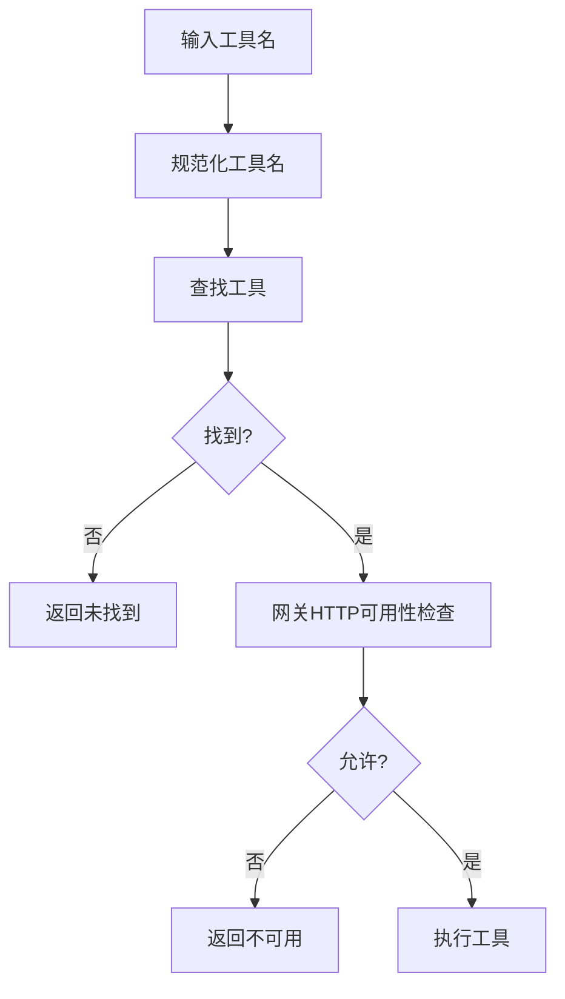
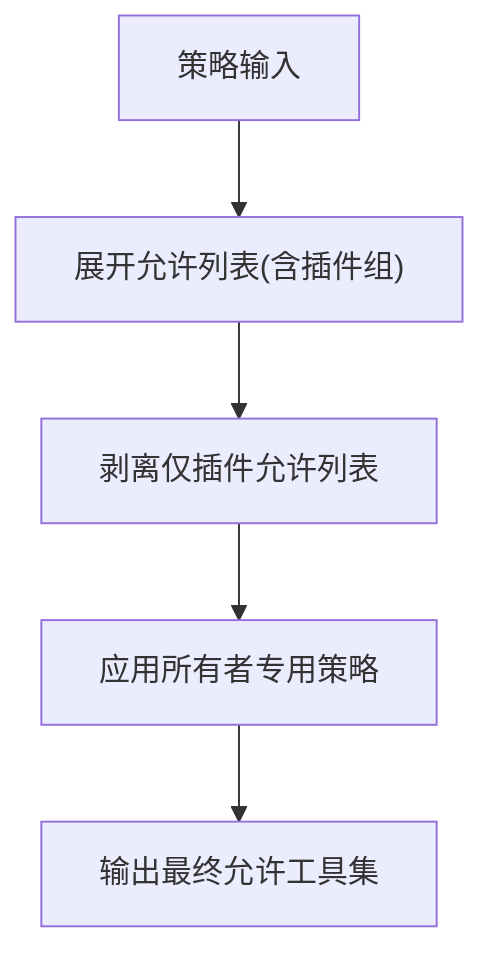
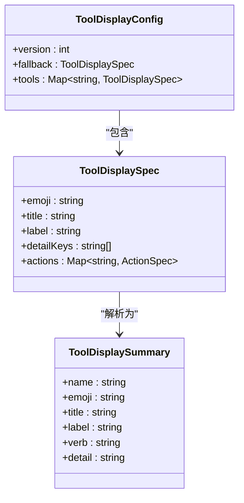
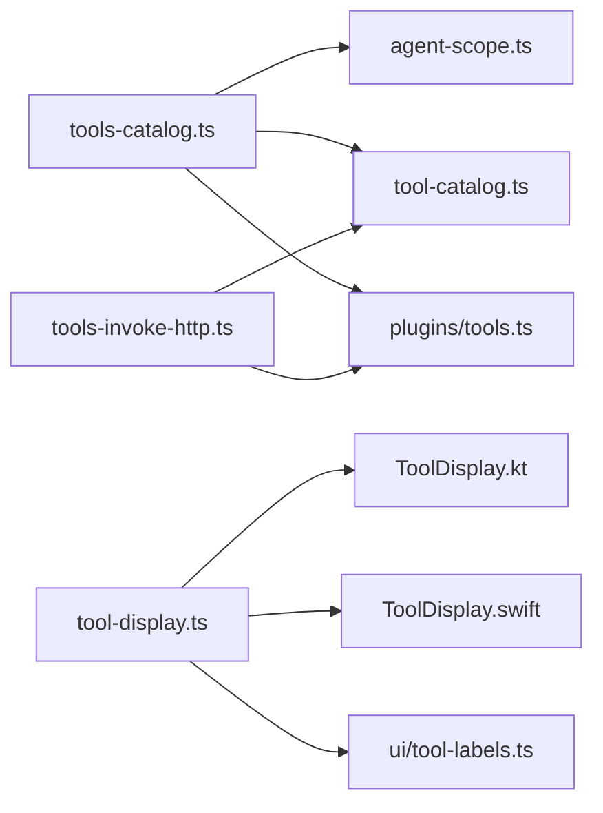

# 工具目录管理

<cite>
**本文档引用的文件**
- [src/agents/tool-catalog.ts](file://src/agents/tool-catalog.ts)
- [src/gateway/server-methods/tools-catalog.ts](file://src/gateway/server-methods/tools-catalog.ts)
- [src/plugins/tools.ts](file://src/plugins/tools.ts)
- [src/agents/agent-scope.ts](file://src/agents/agent-scope.ts)
- [src/agents/tool-policy.ts](file://src/agents/tool-policy.ts)
- [src/gateway/tools-invoke-http.ts](file://src/gateway/tools-invoke-http.ts)
- [apps/shared/OpenClawKit/Sources/OpenClawProtocol/GatewayModels.swift](file://apps/shared/OpenClawKit/Sources/OpenClawProtocol/GatewayModels.swift)
- [apps/macos/Sources/OpenClawProtocol/GatewayModels.swift](file://apps/macos/Sources/OpenClawProtocol/GatewayModels.swift)
- [src/agents/tool-display.ts](file://src/agents/tool-display.ts)
- [apps/shared/OpenClawKit/Sources/OpenClawKit/ToolDisplay.swift](file://apps/shared/OpenClawKit/Sources/OpenClawKit/ToolDisplay.swift)
- [apps/android/app/src/main/java/ai/openclaw/app/tools/ToolDisplay.kt](file://apps/android/app/src/main/java/ai/openclaw/app/tools/ToolDisplay.kt)
- [ui/src/ui/tool-labels.ts](file://ui/src/ui/tool-labels.ts)
- [src/commands/doctor-config-flow.ts](file://src/commands/doctor-config-flow.ts)
- [docs/gateway/configuration-reference.md](file://docs/gateway/configuration-reference.md)
</cite>

## 目录
1. [简介](#简介)
2. [项目结构](#项目结构)
3. [核心组件](#核心组件)
4. [架构总览](#架构总览)
5. [详细组件分析](#详细组件分析)
6. [依赖关系分析](#依赖关系分析)
7. [性能考量](#性能考量)
8. [故障排查指南](#故障排查指南)
9. [结论](#结论)
10. [附录](#附录)

## 简介
本文件系统化阐述 OpenClaw 的“工具目录管理”能力，覆盖核心工具定义、工具分组机制、工具配置系统、工具分类体系、工具 ID 解析与可用性检查、工具显示配置与描述管理、工具权限映射、工具目录扩展与自定义工具注册、工具配置验证以及工具目录在代理配置中的作用与工具发现机制。目标是帮助开发者与运维人员快速理解并正确使用工具目录功能。

## 项目结构
工具目录管理涉及多个子系统协同工作：
- 核心工具定义与分组：在代理层定义核心工具及其分类与默认配置
- 插件工具发现与元数据：在插件层动态加载工具并标注来源与可选性
- 网关工具目录服务：对外提供工具目录查询接口，支持按代理与插件过滤
- 权限策略与可用性检查：在调用链路中进行权限与可用性校验
- 显示配置与描述：为不同平台提供工具显示与标签映射
- 配置验证与迁移：对配置进行校验与兼容性处理

**图表来源**
- [src/agents/tool-catalog.ts:1-335](file://src/agents/tool-catalog.ts#L1-L335)
- [src/gateway/server-methods/tools-catalog.ts:1-167](file://src/gateway/server-methods/tools-catalog.ts#L1-L167)
- [src/plugins/tools.ts:1-143](file://src/plugins/tools.ts#L1-L143)
- [src/agents/agent-scope.ts:1-339](file://src/agents/agent-scope.ts#L1-L339)
- [src/agents/tool-policy.ts:1-211](file://src/agents/tool-policy.ts#L1-L211)
- [src/gateway/tools-invoke-http.ts:295-313](file://src/gateway/tools-invoke-http.ts#L295-L313)
- [apps/shared/OpenClawKit/Sources/OpenClawProtocol/GatewayModels.swift:2423-2525](file://apps/shared/OpenClawKit/Sources/OpenClawProtocol/GatewayModels.swift#L2423-L2525)
- [apps/macos/Sources/OpenClawProtocol/GatewayModels.swift:2423-2525](file://apps/macos/Sources/OpenClawProtocol/GatewayModels.swift#L2423-L2525)
- [src/agents/tool-display.ts:24-56](file://src/agents/tool-display.ts#L24-L56)
- [apps/android/app/src/main/java/ai/openclaw/app/tools/ToolDisplay.kt:1-142](file://apps/android/app/src/main/java/ai/openclaw/app/tools/ToolDisplay.kt#L1-L142)
- [apps/shared/OpenClawKit/Sources/OpenClawKit/ToolDisplay.swift:1-102](file://apps/shared/OpenClawKit/Sources/OpenClawKit/ToolDisplay.swift#L1-L102)
- [ui/src/ui/tool-labels.ts:1-39](file://ui/src/ui/tool-labels.ts#L1-L39)

**章节来源**
- [src/agents/tool-catalog.ts:1-335](file://src/agents/tool-catalog.ts#L1-L335)
- [src/gateway/server-methods/tools-catalog.ts:1-167](file://src/gateway/server-methods/tools-catalog.ts#L1-L167)
- [src/plugins/tools.ts:1-143](file://src/plugins/tools.ts#L1-L143)
- [src/agents/agent-scope.ts:1-339](file://src/agents/agent-scope.ts#L1-L339)
- [src/agents/tool-policy.ts:1-211](file://src/agents/tool-policy.ts#L1-L211)
- [src/gateway/tools-invoke-http.ts:295-313](file://src/gateway/tools-invoke-http.ts#L295-L313)
- [apps/shared/OpenClawKit/Sources/OpenClawProtocol/GatewayModels.swift:2423-2525](file://apps/shared/OpenClawKit/Sources/OpenClawProtocol/GatewayModels.swift#L2423-L2525)
- [apps/macos/Sources/OpenClawProtocol/GatewayModels.swift:2423-2525](file://apps/macos/Sources/OpenClawProtocol/GatewayModels.swift#L2423-L2525)
- [src/agents/tool-display.ts:24-56](file://src/agents/tool-display.ts#L24-L56)
- [apps/android/app/src/main/java/ai/openclaw/app/tools/ToolDisplay.kt:1-142](file://apps/android/app/src/main/java/ai/openclaw/app/tools/ToolDisplay.kt#L1-L142)
- [apps/shared/OpenClawKit/Sources/OpenClawKit/ToolDisplay.swift:1-102](file://apps/shared/OpenClawKit/Sources/OpenClawKit/ToolDisplay.swift#L1-L102)
- [ui/src/ui/tool-labels.ts:1-39](file://ui/src/ui/tool-labels.ts#L1-L39)

## 核心组件
- 工具目录定义与分组：集中定义核心工具、分组顺序、默认配置与概览信息
- 插件工具解析与元数据：动态加载插件工具，记录插件ID与可选性
- 网关工具目录服务：提供 RPC 接口返回工具目录，支持按代理与插件过滤
- 权限策略与可用性检查：在调用链路中进行权限与可用性校验
- 工具显示配置与描述：跨平台统一工具显示与标签映射
- 配置验证与迁移：对配置进行校验与兼容性处理

**章节来源**
- [src/agents/tool-catalog.ts:1-335](file://src/agents/tool-catalog.ts#L1-L335)
- [src/plugins/tools.ts:1-143](file://src/plugins/tools.ts#L1-L143)
- [src/gateway/server-methods/tools-catalog.ts:1-167](file://src/gateway/server-methods/tools-catalog.ts#L1-L167)
- [src/agents/tool-policy.ts:1-211](file://src/agents/tool-policy.ts#L1-L211)
- [src/agents/tool-display.ts:24-56](file://src/agents/tool-display.ts#L24-L56)

## 架构总览
工具目录管理的端到端流程如下：
- 客户端通过网关 RPC 请求工具目录
- 网关解析参数，选择代理与是否包含插件
- 组装核心工具分组与插件工具分组
- 返回工具目录给客户端

**图表来源**
- [src/gateway/server-methods/tools-catalog.ts:125-167](file://src/gateway/server-methods/tools-catalog.ts#L125-L167)
- [src/agents/agent-scope.ts:44-84](file://src/agents/agent-scope.ts#L44-L84)
- [src/agents/tool-catalog.ts:56-69](file://src/agents/tool-catalog.ts#L56-L69)
- [src/plugins/tools.ts:45-143](file://src/plugins/tools.ts#L45-L143)

## 详细组件分析

### 工具目录定义与分组
- 工具分类体系：文件系统(fs)、运行时(runtime)、Web(web)、内存(memory)、会话(sessions)、UI(ui)、消息(messaging)、自动化(automation)、节点(nodes)、代理(agents)、媒体(media)
- 默认配置：提供 minimal/coding/messaging/full 四种配置，映射到允许的工具集合
- 分组构建：按分类顺序生成分组，每个分组包含该类下的工具条目

**图表来源**
- [src/agents/tool-catalog.ts:27-39](file://src/agents/tool-catalog.ts#L27-L39)
- [src/agents/tool-catalog.ts:256-267](file://src/agents/tool-catalog.ts#L256-L267)
- [src/agents/tool-catalog.ts:312-322](file://src/agents/tool-catalog.ts#L312-L322)

**章节来源**
- [src/agents/tool-catalog.ts:1-335](file://src/agents/tool-catalog.ts#L1-L335)

### 插件工具解析与元数据
- 动态加载插件工具，记录插件ID与可选性
- 名称规范化与冲突检测，避免与核心工具或同插件重复
- 可选工具按允许列表放行，支持按插件ID或 group:plugins 放行

**图表来源**
- [src/plugins/tools.ts:45-143](file://src/plugins/tools.ts#L45-L143)
- [src/plugins/tools.ts:11-24](file://src/plugins/tools.ts#L11-L24)

**章节来源**
- [src/plugins/tools.ts:1-143](file://src/plugins/tools.ts#L1-L143)

### 网关工具目录服务
- 参数校验：校验 agentId/includePlugins 等参数
- 代理解析：支持显式代理ID或默认代理
- 分组组装：核心分组 + 插件分组（可选）
- 返回结构：包含 agentId、可用配置、分组与工具条目

**图表来源**
- [src/gateway/server-methods/tools-catalog.ts:125-167](file://src/gateway/server-methods/tools-catalog.ts#L125-L167)
- [src/gateway/server-methods/tools-catalog.ts:40-54](file://src/gateway/server-methods/tools-catalog.ts#L40-L54)
- [src/gateway/server-methods/tools-catalog.ts:56-69](file://src/gateway/server-methods/tools-catalog.ts#L56-L69)
- [src/gateway/server-methods/tools-catalog.ts:71-123](file://src/gateway/server-methods/tools-catalog.ts#L71-L123)

**章节来源**
- [src/gateway/server-methods/tools-catalog.ts:1-167](file://src/gateway/server-methods/tools-catalog.ts#L1-L167)

### 工具ID解析与可用性检查
- 工具ID解析：规范化工具名，支持别名与大小写不敏感
- 可用性检查：在 HTTP 调用路径上进行可用性与拦截检查
- 网关级拦截：HTTP 路径下存在默认拒绝列表，结合用户配置合并

**图表来源**
- [src/gateway/tools-invoke-http.ts:295-313](file://src/gateway/tools-invoke-http.ts#L295-L313)
- [src/plugins/tools.ts:22-43](file://src/plugins/tools.ts#L22-L43)

**章节来源**
- [src/gateway/tools-invoke-http.ts:295-313](file://src/gateway/tools-invoke-http.ts#L295-L313)
- [src/plugins/tools.ts:22-43](file://src/plugins/tools.ts#L22-L43)

### 工具权限映射与策略
- 策略层次：profile -> providerProfile -> global -> agent -> group
- 允许列表展开：支持 group:plugins 与按插件ID展开
- 插件仅允许列表剥离：当允许列表仅包含插件工具时，自动剥离以避免误禁用核心工具
- 所有者专用工具：ownerOnly 工具在非所有者发送时被限制或移除

**图表来源**
- [src/agents/tool-policy.ts:143-211](file://src/agents/tool-policy.ts#L143-L211)
- [src/agents/tool-policy.ts:18-57](file://src/agents/tool-policy.ts#L18-L57)

**章节来源**
- [src/agents/tool-policy.ts:1-211](file://src/agents/tool-policy.ts#L1-L211)

### 工具显示配置与描述管理
- 多平台显示配置：共享 JSON 配置 + 平台特定覆盖
- 显示字段：emoji、title、label、verb、detail
- UI 标签映射：将原始工具名映射为人类可读标签
- Android/iOS/Swift/前端：均提供对应的解析与回退逻辑

**图表来源**
- [src/agents/tool-display.ts:24-56](file://src/agents/tool-display.ts#L24-L56)
- [apps/shared/OpenClawKit/Sources/OpenClawKit/ToolDisplay.swift:1-102](file://apps/shared/OpenClawKit/Sources/OpenClawKit/ToolDisplay.swift#L1-L102)
- [apps/android/app/src/main/java/ai/openclaw/app/tools/ToolDisplay.kt:1-142](file://apps/android/app/src/main/java/ai/openclaw/app/tools/ToolDisplay.kt#L1-L142)
- [ui/src/ui/tool-labels.ts:1-39](file://ui/src/ui/tool-labels.ts#L1-L39)

**章节来源**
- [src/agents/tool-display.ts:24-56](file://src/agents/tool-display.ts#L24-L56)
- [apps/shared/OpenClawKit/Sources/OpenClawKit/ToolDisplay.swift:1-102](file://apps/shared/OpenClawKit/Sources/OpenClawKit/ToolDisplay.swift#L1-L102)
- [apps/android/app/src/main/java/ai/openclaw/app/tools/ToolDisplay.kt:1-142](file://apps/android/app/src/main/java/ai/openclaw/app/tools/ToolDisplay.kt#L1-L142)
- [ui/src/ui/tool-labels.ts:1-39](file://ui/src/ui/tool-labels.ts#L1-L39)

### 工具目录扩展与自定义工具注册
- 插件工具注册：通过插件工厂返回工具，支持函数式与静态定义
- 元数据写入：记录插件ID与可选性，用于目录与权限控制
- 冲突处理：检测与核心工具或同插件名称冲突，记录诊断信息

**章节来源**
- [src/plugins/tools.ts:94-143](file://src/plugins/tools.ts#L94-L143)

### 工具配置验证与迁移
- 参数校验：tools.catalog 请求参数的结构与类型校验
- 配置扫描：对旧版 toolsBySender 键进行扫描与迁移提示
- 文档参考：配置参考文档提供默认 profile 行为

**章节来源**
- [src/gateway/server-methods/tools-catalog.ts:127-137](file://src/gateway/server-methods/tools-catalog.ts#L127-L137)
- [src/commands/doctor-config-flow.ts:1523-1569](file://src/commands/doctor-config-flow.ts#L1523-L1569)
- [docs/gateway/configuration-reference.md:1774-1781](file://docs/gateway/configuration-reference.md#L1774-L1781)

## 依赖关系分析
- 工具目录服务依赖代理作用域解析代理ID、核心工具分组与插件工具解析
- 插件工具解析依赖插件加载器与配置状态
- 权限策略依赖工具分组与允许列表展开
- 显示配置跨平台共享，平台侧提供解析实现

**图表来源**
- [src/gateway/server-methods/tools-catalog.ts:1-20](file://src/gateway/server-methods/tools-catalog.ts#L1-L20)
- [src/plugins/tools.ts:1-7](file://src/plugins/tools.ts#L1-L7)
- [src/gateway/tools-invoke-http.ts:295-313](file://src/gateway/tools-invoke-http.ts#L295-L313)
- [src/agents/tool-display.ts:24-56](file://src/agents/tool-display.ts#L24-L56)

**章节来源**
- [src/gateway/server-methods/tools-catalog.ts:1-20](file://src/gateway/server-methods/tools-catalog.ts#L1-L20)
- [src/plugins/tools.ts:1-7](file://src/plugins/tools.ts#L1-L7)
- [src/gateway/tools-invoke-http.ts:295-313](file://src/gateway/tools-invoke-http.ts#L295-L313)
- [src/agents/tool-display.ts:24-56](file://src/agents/tool-display.ts#L24-L56)

## 性能考量
- 插件发现短路：当插件配置禁用时直接返回空，避免不必要的加载
- 名称规范化与去重：减少后续处理开销
- 分组排序与缓存：在目录组装阶段完成排序，避免重复计算
- HTTP 调用路径拦截：在入口处快速拒绝不可用工具，降低下游成本

[本节为通用指导，无需具体文件来源]

## 故障排查指南
- tools.catalog 参数无效：检查请求参数结构与类型
- 未知代理ID：确认代理列表与默认代理设置
- 工具未出现在目录：检查插件工具是否被允许列表放行或名称冲突
- 工具不可用（HTTP）：检查网关工具配置与默认拒绝列表
- 显示异常：检查平台显示配置与回退逻辑

**章节来源**
- [src/gateway/server-methods/tools-catalog.ts:40-54](file://src/gateway/server-methods/tools-catalog.ts#L40-L54)
- [src/gateway/server-methods/tools-catalog.ts:127-137](file://src/gateway/server-methods/tools-catalog.ts#L127-L137)
- [src/gateway/tools-invoke-http.ts:295-313](file://src/gateway/tools-invoke-http.ts#L295-L313)
- [src/plugins/tools.ts:74-92](file://src/plugins/tools.ts#L74-L92)

## 结论
工具目录管理通过“核心工具定义 + 插件工具解析 + 网关目录服务 + 权限策略 + 显示配置”的完整链路，实现了可扩展、可配置、跨平台一致的工具目录体验。开发者可通过插件注册自定义工具，运维人员可通过配置与策略精细化控制工具可用性，最终在 UI 与各平台获得一致的工具展示与交互。

[本节为总结，无需具体文件来源]

## 附录
- 工具分类体系：fs/runtime/web/memory/sessions/ui/messaging/automation/nodes/agents/media
- 默认配置：minimal/coding/messaging/full
- 网关模型：ToolsCatalogParams/ToolCatalogEntry/ToolCatalogGroup 等

**章节来源**
- [src/agents/tool-catalog.ts:27-39](file://src/agents/tool-catalog.ts#L27-L39)
- [src/agents/tool-catalog.ts:288-293](file://src/agents/tool-catalog.ts#L288-L293)
- [apps/shared/OpenClawKit/Sources/OpenClawProtocol/GatewayModels.swift:2423-2525](file://apps/shared/OpenClawKit/Sources/OpenClawProtocol/GatewayModels.swift#L2423-L2525)
- [apps/macos/Sources/OpenClawProtocol/GatewayModels.swift:2423-2525](file://apps/macos/Sources/OpenClawProtocol/GatewayModels.swift#L2423-L2525)