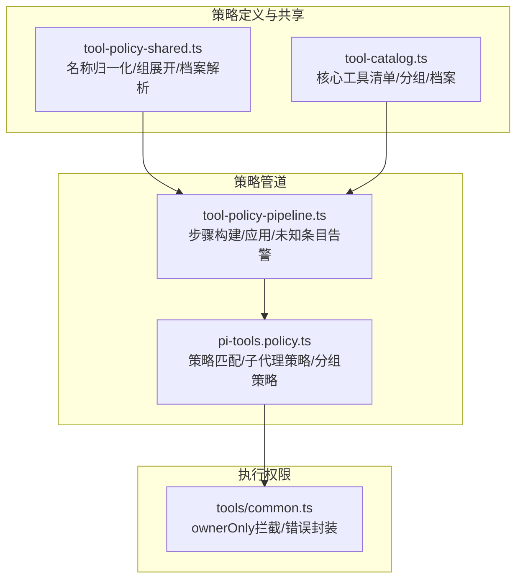
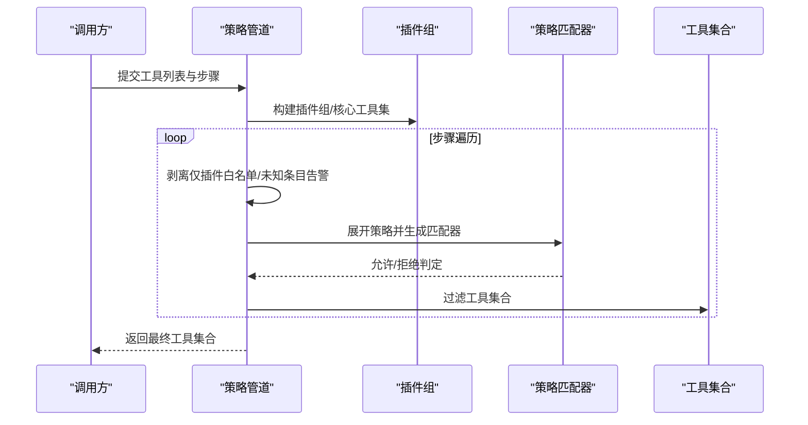
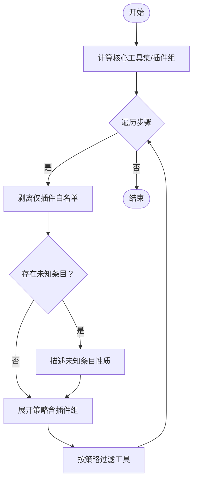
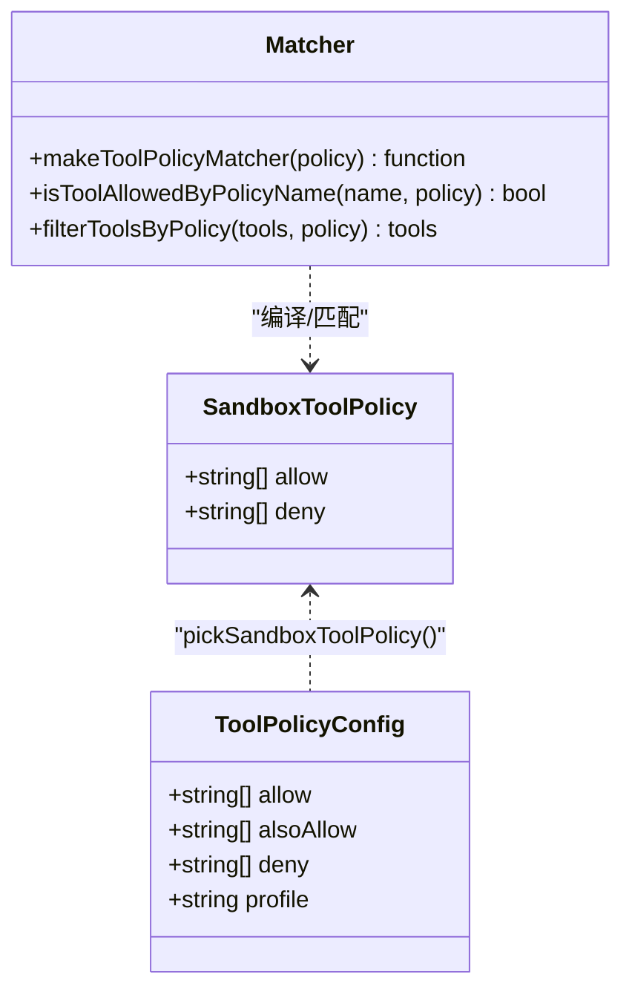
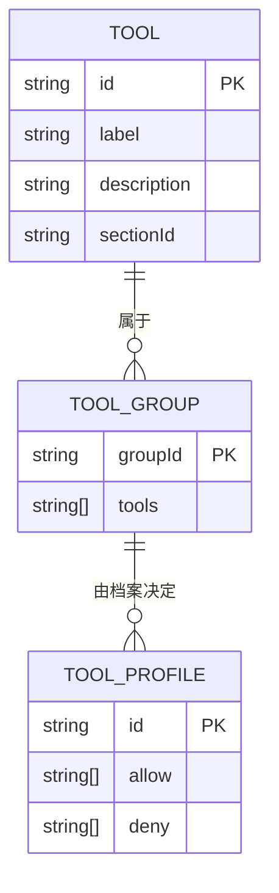
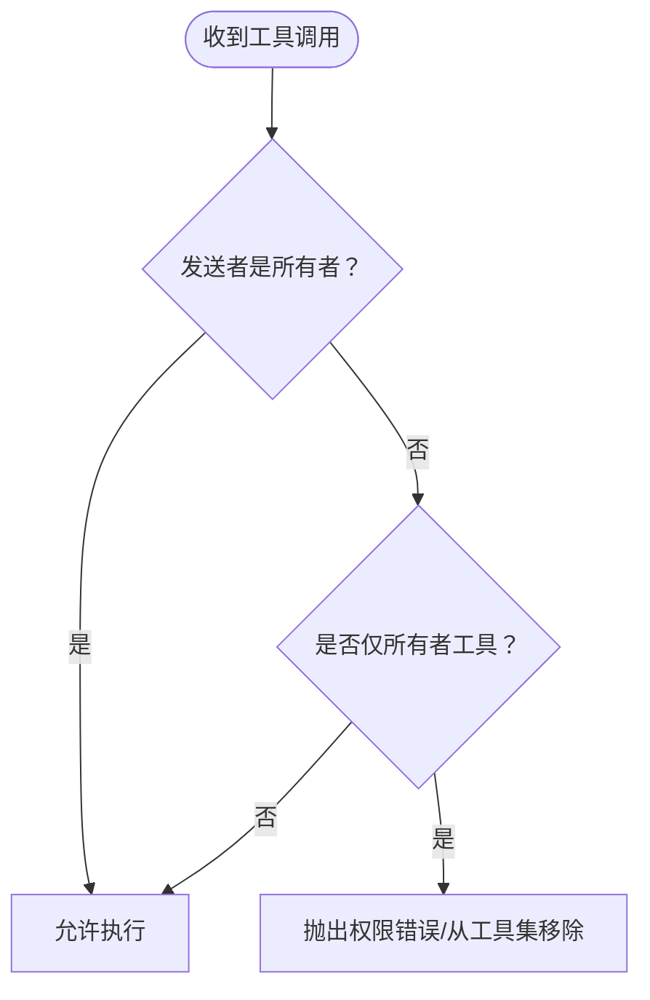
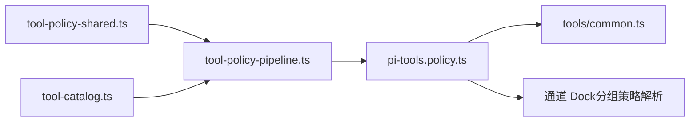

# 工具策略系统

<cite>
**本文档引用的文件**
- [src/agents/tool-policy.ts](file://src/agents/tool-policy.ts)
- [src/agents/tool-policy-pipeline.ts](file://src/agents/tool-policy-pipeline.ts)
- [src/agents/tool-policy-shared.ts](file://src/agents/tool-policy-shared.ts)
- [src/agents/pi-tools.policy.ts](file://src/agents/pi-tools.policy.ts)
- [src/agents/tool-catalog.ts](file://src/agents/tool-catalog.ts)
- [src/agents/tools/common.ts](file://src/agents/tools/common.ts)
- [src/agents/tool-policy-pipeline.test.ts](file://src/agents/tool-policy-pipeline.test.ts)
- [SECURITY.md](file://SECURITY.md)
- [docs/concepts/agent-workspace.md](file://docs/concepts/agent-workspace.md)
</cite>

## 目录
1. [简介](#简介)
2. [项目结构](#项目结构)
3. [核心组件](#核心组件)
4. [架构总览](#架构总览)
5. [详细组件分析](#详细组件分析)
6. [依赖关系分析](#依赖关系分析)
7. [性能考量](#性能考量)
8. [故障排查指南](#故障排查指南)
9. [结论](#结论)
10. [附录](#附录)

## 简介
本文件系统性阐述 OpenClaw 的工具策略系统，覆盖工具访问控制策略、工具执行权限与安全边界；解释工具策略管道的工作原理、策略评估流程与策略组合机制；并提供工具白名单/黑名单配置、工具调用限制与执行约束的实践指导。文档同时给出策略配置示例、测试方法与调试技巧，并展示在不同代理配置下的行为差异与安全考虑。

## 项目结构
工具策略系统主要由以下模块构成：
- 策略定义与共享：定义工具组、名称归一化、配置解析等基础能力
- 策略管道：按层级顺序应用多级策略，支持插件组展开与未知条目告警
- 策略组合：将全局、代理、分组、提供方等策略合并为最终可用策略
- 核心工具目录：内置工具清单、分组与配置档案
- 执行权限：基于“仅所有者”工具的运行时拦截
- 测试与合规快照：验证策略行为与导出常量的一致性

**图表来源**
- [src/agents/tool-policy-shared.ts:1-50](file://src/agents/tool-policy-shared.ts#L1-L50)
- [src/agents/tool-catalog.ts:1-335](file://src/agents/tool-catalog.ts#L1-L335)
- [src/agents/tool-policy-pipeline.ts:1-133](file://src/agents/tool-policy-pipeline.ts#L1-L133)
- [src/agents/pi-tools.policy.ts:1-390](file://src/agents/pi-tools.policy.ts#L1-L390)
- [src/agents/tools/common.ts:1-328](file://src/agents/tools/common.ts#L1-L328)

**章节来源**
- [src/agents/tool-policy-shared.ts:1-50](file://src/agents/tool-policy-shared.ts#L1-L50)
- [src/agents/tool-catalog.ts:1-335](file://src/agents/tool-catalog.ts#L1-L335)
- [src/agents/tool-policy-pipeline.ts:1-133](file://src/agents/tool-policy-pipeline.ts#L1-L133)
- [src/agents/pi-tools.policy.ts:1-390](file://src/agents/pi-tools.policy.ts#L1-L390)
- [src/agents/tools/common.ts:1-328](file://src/agents/tools/common.ts#L1-L328)

## 核心组件
- 工具策略类型与工具组
  - 定义允许/拒绝列表的策略对象
  - 提供工具组（如 group:openclaw、group:fs 等）与名称归一化
- 策略管道步骤
  - 按优先级顺序应用多层策略（档案、提供方档案、全局、提供方全局、代理、代理提供方、分组）
  - 支持“仅插件工具”的白名单剥离，避免误禁用核心工具
- 策略组合与匹配
  - 将 allow/deny 与通配模式编译为匹配器
  - 子代理工具策略按深度与角色自动收紧
- 执行权限控制
  - 对“仅所有者”工具在非所有者发送时进行拦截或过滤
- 合规与测试
  - 导出策略常量用于静态合规检查
  - 单元测试覆盖未知条目告警与核心工具保护

**章节来源**
- [src/agents/tool-policy.ts:59-211](file://src/agents/tool-policy.ts#L59-L211)
- [src/agents/tool-policy-pipeline.ts:12-133](file://src/agents/tool-policy-pipeline.ts#L12-L133)
- [src/agents/pi-tools.policy.ts:1-390](file://src/agents/pi-tools.policy.ts#L1-L390)
- [src/agents/tools/common.ts:19-57](file://src/agents/tools/common.ts#L19-L57)

## 架构总览
工具策略系统采用“分层+组合+匹配”的架构：
- 分层：从档案策略到提供方策略，再到全局/代理/分组策略
- 组合：通过 alsoAllow、显式 allow/deny 与通配模式合并
- 匹配：使用通配符编译后的匹配器对工具名进行判定

**图表来源**
- [src/agents/tool-policy-pipeline.ts:66-115](file://src/agents/tool-policy-pipeline.ts#L66-L115)
- [src/agents/pi-tools.policy.ts:20-45](file://src/agents/pi-tools.policy.ts#L20-L45)

**章节来源**
- [src/agents/tool-policy-pipeline.ts:18-115](file://src/agents/tool-policy-pipeline.ts#L18-L115)
- [src/agents/pi-tools.policy.ts:150-156](file://src/agents/pi-tools.policy.ts#L150-L156)

## 详细组件分析

### 工具策略管道（Tool Policy Pipeline）
- 步骤构建
  - 默认步骤顺序：档案策略 → 提供方档案策略 → 全局策略 → 提供方全局策略 → 代理策略 → 代理提供方策略 → 分组策略
  - 每步可选择是否剥离“仅插件工具”的 allowlist
- 应用流程
  - 计算核心工具集合与插件组
  - 对每步策略：若启用剥离，则检测未知条目并发出告警；随后展开策略并过滤工具集合
- 未知条目告警
  - 若存在核心工具但未在当前运行时可用，提示“核心工具不可用”
  - 若仅为插件工具，提示“除非启用插件否则不匹配任何工具”

**图表来源**
- [src/agents/tool-policy-pipeline.ts:66-133](file://src/agents/tool-policy-pipeline.ts#L66-L133)

**章节来源**
- [src/agents/tool-policy-pipeline.ts:18-133](file://src/agents/tool-policy-pipeline.ts#L18-L133)
- [src/agents/tool-policy-pipeline.test.ts:1-92](file://src/agents/tool-policy-pipeline.test.ts#L1-L92)

### 策略组合与匹配（Policy Combination and Matching）
- 策略匹配器
  - 将 allow/deny 列表展开为工具名集合，并编译为通配模式匹配器
  - 特殊规则：当 allow 包含 exec 时，apply_patch 自动允许
- 子代理策略
  - 按最大 spawn 深度区分“叶节点”与“编排者”，分别施加不同的禁止列表
  - alsoAllow 可用于在禁止列表中显式放行特定工具
- 分组策略
  - 依据会话上下文解析频道与群组，调用通道 Dock 或默认实现解析分组工具策略

**图表来源**
- [src/agents/pi-tools.policy.ts:150-156](file://src/agents/pi-tools.policy.ts#L150-L156)
- [src/agents/pi-tools.policy.ts:197-235](file://src/agents/pi-tools.policy.ts#L197-L235)

**章节来源**
- [src/agents/pi-tools.policy.ts:1-390](file://src/agents/pi-tools.policy.ts#L1-L390)

### 工具档案与组（Tool Catalog and Groups）
- 核心工具清单
  - 定义工具 ID、标签、描述、所属分组与适用档案
- 工具组
  - group:openclaw：包含所有纳入 OpenClaw 的工具
  - group:fs、group:runtime 等：按功能分组
- 档案策略
  - 提供 minimal/coding/messaging/full 四种档案，决定默认允许/拒绝集合

**图表来源**
- [src/agents/tool-catalog.ts:41-244](file://src/agents/tool-catalog.ts#L41-L244)
- [src/agents/tool-catalog.ts:269-286](file://src/agents/tool-catalog.ts#L269-L286)

**章节来源**
- [src/agents/tool-catalog.ts:1-335](file://src/agents/tool-catalog.ts#L1-L335)

### 执行权限与安全边界（Owner-Only Tools and Security Boundaries）
- 仅所有者工具
  - 对非所有者发送者，直接拦截执行或从工具集中移除
  - 额外的工具名回退列表（如 gateway、nodes 等）被识别为仅所有者
- 安全边界
  - 个人助理模型：单个受信任操作者，潜在多个代理
  - 多用户共享同一工具启用的代理时，均可在授权范围内操控
  - 会话/内存隔离减少上下文泄露，但不创建按用户的主机授权边界
  - 混合信任场景建议按 OS 用户/主机/网关隔离，并为每个边界使用独立凭据

**图表来源**
- [src/agents/tools/common.ts:229-242](file://src/agents/tools/common.ts#L229-L242)
- [src/agents/tool-policy.ts:42-57](file://src/agents/tool-policy.ts#L42-L57)

**章节来源**
- [src/agents/tools/common.ts:19-57](file://src/agents/tools/common.ts#L19-L57)
- [src/agents/tool-policy.ts:31-57](file://src/agents/tool-policy.ts#L31-L57)
- [SECURITY.md:147-157](file://SECURITY.md#L147-L157)

### 策略配置示例与最佳实践
- 档案策略
  - 使用 profile 指定 minimal/coding/messaging/full，自动获得允许/拒绝集合
  - 通过 alsoAllow 在档案阶段补充允许项，避免过早被过滤
- 提供方策略
  - 以 provider/model 作为键，支持精确或前缀匹配
  - 也可在代理级别设置 byProvider 覆盖
- 全局与代理策略
  - 全局 tools.allow/deny 控制默认范围
  - 代理 tools.allow/deny 仅影响该代理
- 分组策略
  - 依据会话上下文解析频道/群组，调用通道 Dock 的分组工具策略解析函数
- 插件组与通配
  - group:plugins 展开为所有插件工具；支持通配模式匹配
- 执行约束
  - 通过 alsoAllow 与显式 allow/deny 组合，确保核心工具不被意外禁用
  - 对仅所有者工具，严格区分发送者身份

**章节来源**
- [src/agents/pi-tools.policy.ts:268-323](file://src/agents/pi-tools.policy.ts#L268-L323)
- [src/agents/tool-policy-shared.ts:12-47](file://src/agents/tool-policy-shared.ts#L12-L47)
- [src/agents/tool-policy.ts:156-211](file://src/agents/tool-policy.ts#L156-L211)

### 策略测试方法与调试技巧
- 单元测试要点
  - 验证“仅插件白名单”会被剥离并保留核心工具
  - 验证未知条目告警内容与性质（核心工具不可用 vs 插件未启用）
  - 验证显式列出核心工具时仍能正确过滤
- 调试技巧
  - 在策略管道步骤中传入 warn 回调，捕获未知条目告警
  - 使用 TOOL_GROUPS 与合规快照比对，确保导出常量与实现一致
  - 对子代理场景，检查最大 spawn 深度与角色，确认禁止列表生效

**章节来源**
- [src/agents/tool-policy-pipeline.test.ts:1-92](file://src/agents/tool-policy-pipeline.test.ts#L1-L92)
- [src/agents/tool-policy.conformance.ts:1-18](file://src/agents/tool-policy.conformance.ts#L1-L18)

## 依赖关系分析
- 组件耦合
  - 策略管道依赖共享的工具组与名称归一化
  - 策略匹配器依赖通配模式编译与工具组展开
  - 执行权限控制依赖工具元数据（插件 ID）与工具名归一化
- 外部集成点
  - 通道 Dock 提供分组工具策略解析扩展点
  - 子代理能力存储用于根据角色动态收紧策略

**图表来源**
- [src/agents/tool-policy-shared.ts:1-50](file://src/agents/tool-policy-shared.ts#L1-L50)
- [src/agents/tool-policy-pipeline.ts:1-11](file://src/agents/tool-policy-pipeline.ts#L1-L11)
- [src/agents/pi-tools.policy.ts:1-18](file://src/agents/pi-tools.policy.ts#L1-L18)

**章节来源**
- [src/agents/tool-policy-pipeline.ts:1-11](file://src/agents/tool-policy-pipeline.ts#L1-L11)
- [src/agents/pi-tools.policy.ts:1-18](file://src/agents/pi-tools.policy.ts#L1-L18)

## 性能考量
- 匹配器编译
  - allow/deny 列表在策略解析阶段编译为通配模式匹配器，后续工具筛选为 O(n) 匹配
- 策略展开
  - group:plugins 与按插件 ID 的组展开为线性扫描，建议控制插件数量与工具总数
- 剥离与告警
  - 剥离仅插件白名单与未知条目告警为一次性处理，成本与工具数线性相关
- 子代理策略
  - 按深度与角色计算禁止列表为常量时间，对性能影响可忽略

[本节为通用性能讨论，无需具体文件来源]

## 故障排查指南
- 现象：工具被意外禁用
  - 检查是否存在“仅插件工具”的 allowlist，策略管道会剥离此类白名单
  - 确认是否显式列出核心工具（如 exec），或通过 alsoAllow 补充
- 现象：出现未知条目告警
  - 若告警指出核心工具不可用，检查当前运行时/模型/配置是否支持该工具
  - 若告警指出需启用插件，确认对应插件已安装并启用
- 现象：仅所有者工具无法执行
  - 确认发送者身份是否为所有者；非所有者将被拦截或从工具集中移除
- 现象：子代理行为异常
  - 检查最大 spawn 深度与角色，确认禁止列表是否按预期收紧

**章节来源**
- [src/agents/tool-policy-pipeline.ts:91-107](file://src/agents/tool-policy-pipeline.ts#L91-L107)
- [src/agents/tools/common.ts:229-242](file://src/agents/tools/common.ts#L229-L242)
- [src/agents/pi-tools.policy.ts:86-101](file://src/agents/pi-tools.policy.ts#L86-L101)

## 结论
OpenClaw 的工具策略系统通过“分层策略 + 插件组展开 + 通配匹配 + 执行权限控制”实现了灵活且安全的工具访问管理。策略管道确保核心工具不被误禁用，同时对未知条目提供明确告警；子代理策略与仅所有者工具进一步强化了安全边界。结合合规快照与单元测试，系统具备良好的可维护性与可审计性。

[本节为总结性内容，无需具体文件来源]

## 附录

### 策略在不同代理配置下的行为差异
- 仅所有者工具
  - 非所有者发送时，工具可能被拦截执行或从工具集中移除
- 子代理深度与角色
  - 叶节点子代理被额外禁止：gateway、agents_list、whatsapp_login、session_status、cron、memory_*、sessions_send 等
  - 编排者子代理可使用 sessions_spawn、subagents、sessions_list、sessions_history
- 分组策略
  - 不同频道/群组可拥有独立工具策略，依据会话上下文解析

**章节来源**
- [src/agents/tools/common.ts:229-242](file://src/agents/tools/common.ts#L229-L242)
- [src/agents/pi-tools.policy.ts:51-101](file://src/agents/pi-tools.policy.ts#L51-L101)
- [src/agents/pi-tools.policy.ts:325-382](file://src/agents/pi-tools.policy.ts#L325-L382)

### 安全考虑与最佳实践
- 个人助理模型
  - 仅受信任操作者，避免在混合信任环境中共享同一代理
- 会话与内存隔离
  - 减少上下文泄露，但不替代主机授权边界
- 工作区与沙箱
  - 工作区为默认工作目录，建议启用沙箱并限制工作区访问权限
  - 沙箱内工作区与宿主工作区分离

**章节来源**
- [SECURITY.md:147-157](file://SECURITY.md#L147-L157)
- [docs/concepts/agent-workspace.md:17-22](file://docs/concepts/agent-workspace.md#L17-L22)