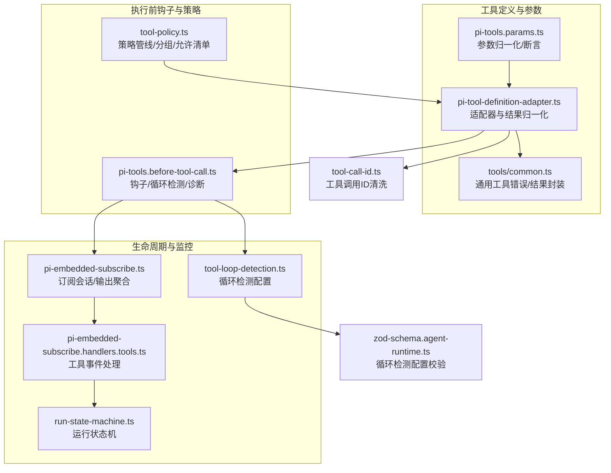
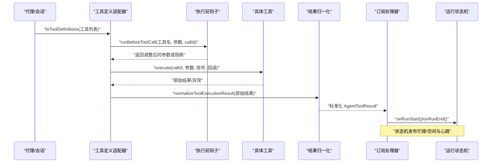
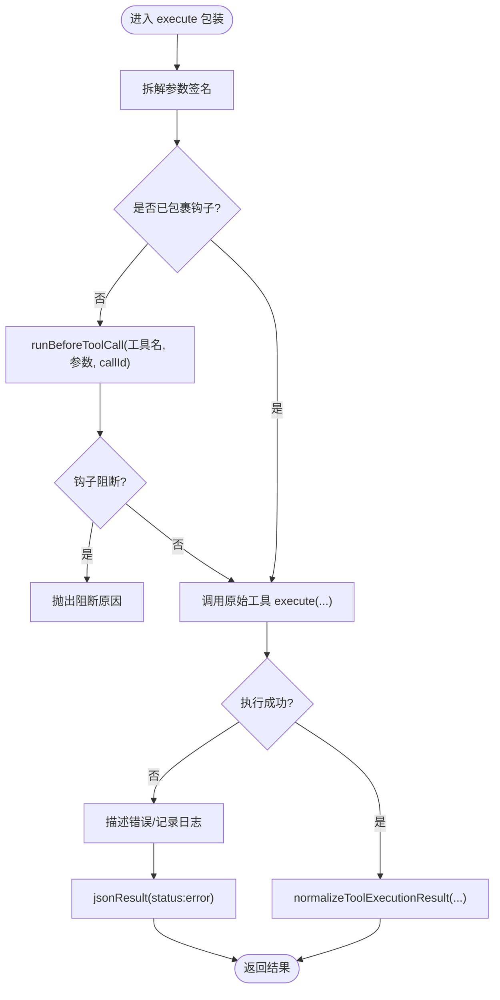
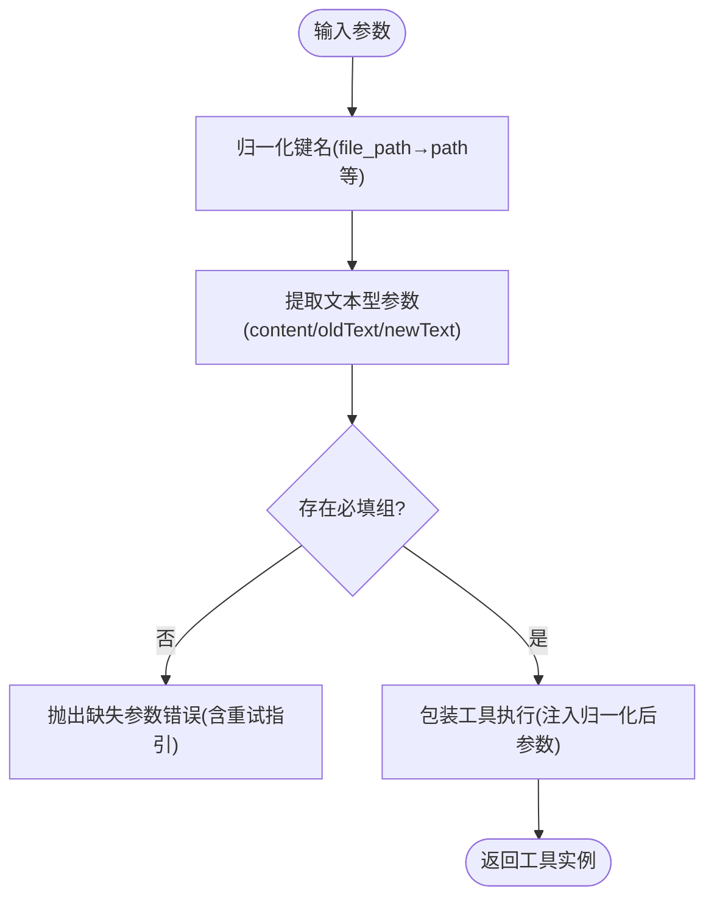
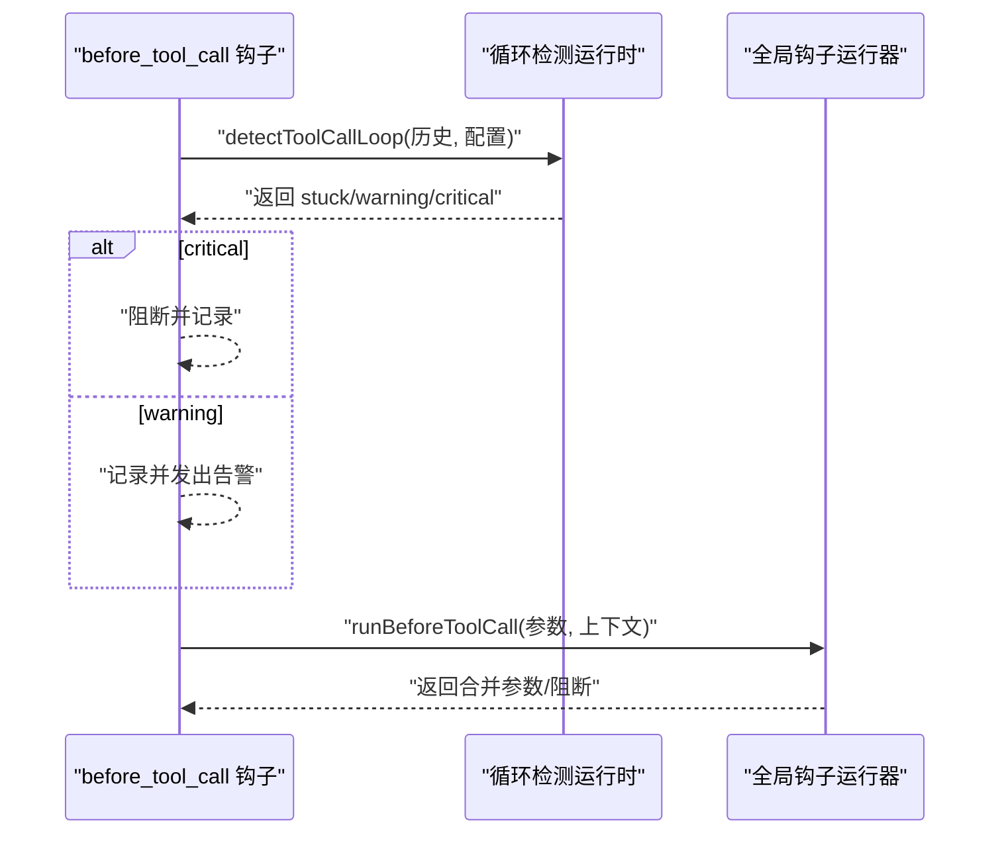
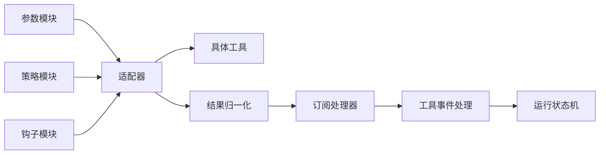

# 工具调用协调

<cite>
**本文引用的文件**
- [pi-tool-definition-adapter.ts](file://src/agents/pi-tool-definition-adapter.ts)
- [pi-tools.params.ts](file://src/agents/pi-tools.params.ts)
- [pi-tools.before-tool-call.ts](file://src/agents/pi-tools.before-tool-call.ts)
- [tools/common.ts](file://src/agents/tools/common.ts)
- [tool-policy.ts](file://src/agents/tool-policy.ts)
- [pi-embedded-subscribe.ts](file://src/agents/pi-embedded-subscribe.ts)
- [pi-embedded-subscribe.handlers.tools.ts](file://src/agents/pi-embedded-subscribe.handlers.tools.ts)
- [run-state-machine.ts](file://src/channels/run-state-machine.ts)
- [tool-call-id.ts](file://src/agents/tool-call-id.ts)
- [tool-loop-detection.ts](file://src/agents/tool-loop-detection.ts)
- [zod-schema.agent-runtime.ts](file://src/config/zod-schema.agent-runtime.ts)
</cite>

## 目录
1. [简介](#简介)
2. [项目结构](#项目结构)
3. [核心组件](#核心组件)
4. [架构总览](#架构总览)
5. [详细组件分析](#详细组件分析)
6. [依赖关系分析](#依赖关系分析)
7. [性能考量](#性能考量)
8. [故障排查指南](#故障排查指南)
9. [结论](#结论)
10. [附录](#附录)

## 简介
本文件系统性阐述 OpenClaw 的“工具调用协调机制”，覆盖从工具定义适配、参数验证与转换、到执行环境与生命周期管理、状态与错误处理、以及在代理决策过程中的作用与执行监控。目标是帮助开发者与使用者理解工具调用如何被标准化、规范化、并安全可控地执行。

## 项目结构
围绕工具调用协调的关键模块包括：
- 工具定义适配：将内部 AgentTool 包装为统一的 ToolDefinition，并注入钩子与结果归一化。
- 参数验证与转换：对 Claude 风格参数进行归一化，按需断言必填项，保证跨模型一致性。
- 执行前钩子：在工具执行前进行策略检查、循环检测、参数调整与诊断记录。
- 结果归一化与格式化：将任意工具返回值转换为标准 AgentToolResult，确保上层消费一致。
- 生命周期与状态：通过运行状态机与订阅处理器维护工具调用的开始/结束、错误保留与清理。
- 安全与策略：基于多级策略管线（配置/插件/全局/代理）控制工具可用性与权限。
- 监控与诊断：工具调用事件流、错误聚合、使用量统计、循环检测与告警。

图示来源
- [pi-tool-definition-adapter.ts:137-194](file://src/agents/pi-tool-definition-adapter.ts#L137-L194)
- [pi-tools.params.ts:88-115](file://src/agents/pi-tools.params.ts#L88-L115)
- [tools/common.ts:217-227](file://src/agents/tools/common.ts#L217-L227)
- [pi-tools.before-tool-call.ts:91-194](file://src/agents/pi-tools.before-tool-call.ts#L91-L194)
- [tool-policy.ts:66-88](file://src/agents/tool-policy.ts#L66-L88)
- [pi-embedded-subscribe.ts:34-120](file://src/agents/pi-embedded-subscribe.ts#L34-L120)
- [pi-embedded-subscribe.handlers.tools.ts:422-470](file://src/agents/pi-embedded-subscribe.handlers.tools.ts#L422-L470)
- [run-state-machine.ts:18-99](file://src/channels/run-state-machine.ts#L18-L99)
- [tool-loop-detection.ts:64-83](file://src/agents/tool-loop-detection.ts#L64-L83)
- [tool-call-id.ts:20-42](file://src/agents/tool-call-id.ts#L20-L42)
- [zod-schema.agent-runtime.ts:467-502](file://src/config/zod-schema.agent-runtime.ts#L467-L502)

章节来源
- [pi-tool-definition-adapter.ts:137-194](file://src/agents/pi-tool-definition-adapter.ts#L137-L194)
- [pi-tools.params.ts:88-115](file://src/agents/pi-tools.params.ts#L88-L115)
- [pi-tools.before-tool-call.ts:91-194](file://src/agents/pi-tools.before-tool-call.ts#L91-L194)
- [tools/common.ts:217-227](file://src/agents/tools/common.ts#L217-L227)
- [tool-policy.ts:66-88](file://src/agents/tool-policy.ts#L66-L88)
- [pi-embedded-subscribe.ts:34-120](file://src/agents/pi-embedded-subscribe.ts#L34-L120)
- [pi-embedded-subscribe.handlers.tools.ts:422-470](file://src/agents/pi-embedded-subscribe.handlers.tools.ts#L422-L470)
- [run-state-machine.ts:18-99](file://src/channels/run-state-machine.ts#L18-L99)
- [tool-loop-detection.ts:64-83](file://src/agents/tool-loop-detection.ts#L64-L83)
- [tool-call-id.ts:20-42](file://src/agents/tool-call-id.ts#L20-L42)
- [zod-schema.agent-runtime.ts:467-502](file://src/config/zod-schema.agent-runtime.ts#L467-L502)

## 核心组件
- 工具定义适配器：负责将 AgentTool 转换为统一的 ToolDefinition，注入 before_tool_call 钩子、参数拆解、AbortSignal 处理、异常转为标准结果。
- 参数归一化与断言：支持 Claude Code 兼容映射、文本型参数提取、必填参数组断言、通用包装器。
- 执行前钩子：循环检测、全局钩子、参数调整、诊断记录、阻断逻辑。
- 结果归一化：将任意返回值转换为包含 content[] 和 details 的标准 AgentToolResult。
- 生命周期与监控：订阅嵌入式会话、工具事件处理、错误保留与清理、运行状态机心跳。
- 策略与安全：多级策略管线、插件分组展开、允许清单剥离与合并、所有者工具限制。
- 工具调用ID清洗：严格模式与 Mistral 要求的长度/字符集清洗。
- 循环检测配置：阈值与探测器配置解析与校验。

章节来源
- [pi-tool-definition-adapter.ts:137-194](file://src/agents/pi-tool-definition-adapter.ts#L137-L194)
- [pi-tools.params.ts:88-115](file://src/agents/pi-tools.params.ts#L88-L115)
- [pi-tools.before-tool-call.ts:91-194](file://src/agents/pi-tools.before-tool-call.ts#L91-L194)
- [tools/common.ts:217-227](file://src/agents/tools/common.ts#L217-L227)
- [pi-embedded-subscribe.ts:34-120](file://src/agents/pi-embedded-subscribe.ts#L34-L120)
- [pi-embedded-subscribe.handlers.tools.ts:422-470](file://src/agents/pi-embedded-subscribe.handlers.tools.ts#L422-L470)
- [run-state-machine.ts:18-99](file://src/channels/run-state-machine.ts#L18-L99)
- [tool-policy.ts:66-88](file://src/agents/tool-policy.ts#L66-L88)
- [tool-call-id.ts:20-42](file://src/agents/tool-call-id.ts#L20-L42)
- [tool-loop-detection.ts:64-83](file://src/agents/tool-loop-detection.ts#L64-L83)
- [zod-schema.agent-runtime.ts:467-502](file://src/config/zod-schema.agent-runtime.ts#L467-L502)

## 架构总览
下图展示了工具调用从“定义适配”到“执行监控”的完整链路，强调参数转换、钩子拦截、结果归一化与事件驱动的状态更新。

图示来源
- [pi-tool-definition-adapter.ts:147-191](file://src/agents/pi-tool-definition-adapter.ts#L147-L191)
- [pi-tools.before-tool-call.ts:91-194](file://src/agents/pi-tools.before-tool-call.ts#L91-L194)
- [tools/common.ts:78-111](file://src/agents/tools/common.ts#L78-L111)
- [pi-embedded-subscribe.ts:644-644](file://src/agents/pi-embedded-subscribe.ts#L644-L644)
- [run-state-machine.ts:85-96](file://src/channels/run-state-machine.ts#L85-L96)

## 详细组件分析

### 组件A：工具定义适配器与执行环境
- 职责
  - 将 AgentTool 列表转换为 ToolDefinition，注入统一的 execute 包装。
  - 自动识别旧版/新版 execute 参数签名，拆解出 callId、params、onUpdate、AbortSignal。
  - 在执行前运行 before_tool_call 钩子；若未被钩子包裹则自动注入。
  - 捕获异常并转换为标准 AgentToolResult，避免上层崩溃。
  - 支持客户端托管工具（返回 pending），由前端执行。
- 关键点
  - 参数签名兼容：旧版（第三个参数为回调，第五个为信号）与新版（第四个为回调，第三个为信号）。
  - 异常处理：区分 AbortError 与普通错误；记录堆栈与消息；统一返回 status:error 的结果。
  - 结果归一化：确保 content[] 存在，details 可用，必要时将非标准对象转换为文本块。

图示来源
- [pi-tool-definition-adapter.ts:113-191](file://src/agents/pi-tool-definition-adapter.ts#L113-L191)
- [tools/common.ts:78-111](file://src/agents/tools/common.ts#L78-L111)

章节来源
- [pi-tool-definition-adapter.ts:137-194](file://src/agents/pi-tool-definition-adapter.ts#L137-L194)
- [tools/common.ts:78-111](file://src/agents/tools/common.ts#L78-L111)

### 组件B：参数验证与转换
- 职责
  - 归一化 Claude Code 参数键：file_path→path、old_string→oldText、new_string→newText。
  - 文本型参数提取：从结构化内容中抽取文本，保证写/编辑等操作的确定性。
  - 必填参数组断言：支持“或”关系的必填组，允许空字符串或不允许空字符串两种模式。
  - 通用包装器：对任意工具注入参数归一化与必填断言。
- 关键点
  - patchToolSchemaForClaudeCompatibility：为工具 schema 增加别名字段，保持 required 清晰。
  - normalizeToolParams：在执行前将参数标准化，减少模型训练偏差导致的循环。

图示来源
- [pi-tools.params.ts:88-115](file://src/agents/pi-tools.params.ts#L88-L115)
- [pi-tools.params.ts:168-204](file://src/agents/pi-tools.params.ts#L168-L204)
- [pi-tools.params.ts:207-225](file://src/agents/pi-tools.params.ts#L207-L225)

章节来源
- [pi-tools.params.ts:88-115](file://src/agents/pi-tools.params.ts#L88-L115)
- [pi-tools.params.ts:168-204](file://src/agents/pi-tools.params.ts#L168-L204)
- [pi-tools.params.ts:207-225](file://src/agents/pi-tools.params.ts#L207-L225)

### 组件C：执行前钩子与循环检测
- 职责
  - 运行 before_tool_call 钩子，支持参数合并与阻断。
  - 记录工具调用历史，检测循环（重复、无进展轮询、Ping-Pong、全局熔断）。
  - 将调用结果/错误写入诊断会话状态，支持警告桶与周期性告警。
- 关键点
  - 仅在存在 sessionKey 时启用循环检测与诊断记录。
  - 严重循环直接阻断，一般循环发出警告并记录。
  - 支持全局钩子运行器，动态扩展拦截与参数调整能力。

图示来源
- [pi-tools.before-tool-call.ts:91-194](file://src/agents/pi-tools.before-tool-call.ts#L91-L194)
- [tool-loop-detection.ts:64-83](file://src/agents/tool-loop-detection.ts#L64-L83)

章节来源
- [pi-tools.before-tool-call.ts:91-194](file://src/agents/pi-tools.before-tool-call.ts#L91-L194)
- [tool-loop-detection.ts:64-83](file://src/agents/tool-loop-detection.ts#L64-L83)

### 组件D：结果归一化与格式化
- 职责
  - 将工具返回值转换为标准 AgentToolResult，确保 content[] 存在。
  - 对非标准对象尝试提取 details 或回退为 {status: "ok", tool: name}。
  - 提供 jsonResult 辅助函数，统一 text 内容与 details 映射。
- 关键点
  - 字符串化 payload，避免不可序列化对象导致的异常。
  - 与订阅处理器配合，将工具输出以 Markdown/纯文本形式聚合。

章节来源
- [tools/common.ts:78-111](file://src/agents/tools/common.ts#L78-L111)
- [tools/common.ts:217-227](file://src/agents/tools/common.ts#L217-L227)

### 组件E：生命周期与工具状态管理
- 职责
  - 订阅嵌入式会话，聚合助手文本、工具元数据、媒体链接与使用量。
  - 处理工具执行开始/结束事件，保留最后一次工具错误，支持同动作成功后清除。
  - 提供运行状态机，发布 busy/空闲与心跳，支持取消与资源回收。
- 关键点
  - 工具执行开始事件用于记录元信息与承诺计数（如 cron.add 成功计数）。
  - 错误保留策略：保留未解决的变更类失败，直到相同动作成功为止。
  - 订阅取消时拒绝等待的压缩重试，避免悬挂状态。

```mermaid
stateDiagram-v2
[*] --> Idle
Idle --> Running : "onRunStart()"
Running --> Busy : "activeRuns>0"
Busy --> Idle : "onRunEnd(); activeRuns==0"
Busy --> Heartbeat : "定时心跳"
Heartbeat --> Busy : "继续心跳"
```

图示来源
- [run-state-machine.ts:85-96](file://src/channels/run-state-machine.ts#L85-L96)

章节来源
- [pi-embedded-subscribe.ts:34-120](file://src/agents/pi-embedded-subscribe.ts#L34-L120)
- [pi-embedded-subscribe.handlers.tools.ts:422-470](file://src/agents/pi-embedded-subscribe.handlers.tools.ts#L422-L470)
- [run-state-machine.ts:18-99](file://src/channels/run-state-machine.ts#L18-L99)

### 组件F：工具调用生命周期与错误处理
- 生命周期
  - 工具执行开始：记录元信息、动作指纹、承诺计数。
  - 工具执行结束：归一化结果、更新工具元数据、错误提取与保留。
  - 订阅取消：拒绝等待的压缩重试，中止正在进行的压缩。
- 错误处理
  - 保留最后一次工具错误，支持变更动作的“未解决”状态。
  - 对只读成功不冲掉未解决的变更失败，确保问题可见性。
  - 适配器层捕获异常并转换为标准错误结果，避免上层崩溃。

章节来源
- [pi-embedded-subscribe.handlers.tools.ts:422-470](file://src/agents/pi-embedded-subscribe.handlers.tools.ts#L422-L470)
- [pi-tool-definition-adapter.ts:168-191](file://src/agents/pi-tool-definition-adapter.ts#L168-L191)

### 组件G：工具调用示例与最佳实践
- 示例场景
  - 文件读写：使用 wrapToolParamNormalization 注入参数归一化与必填断言，确保 path/content 存在。
  - 客户端托管工具：返回 pending 结果，由前端执行，适配器负责触发钩子与通知。
  - 循环检测：当检测到严重循环时阻断工具调用，记录检测器与计数。
- 最佳实践
  - 在工具定义阶段即注入参数归一化与必填断言，降低下游复杂度。
  - 使用 before_tool_call 钩子进行策略与参数调整，避免在工具内部分散逻辑。
  - 对可能失败的工具调用保留错误上下文，便于用户与诊断系统定位问题。

章节来源
- [pi-tools.params.ts:207-225](file://src/agents/pi-tools.params.ts#L207-L225)
- [pi-tool-definition-adapter.ts:196-236](file://src/agents/pi-tool-definition-adapter.ts#L196-L236)
- [pi-tools.before-tool-call.ts:91-194](file://src/agents/pi-tools.before-tool-call.ts#L91-L194)

## 依赖关系分析
- 低耦合高内聚
  - 适配器仅依赖钩子与通用工具函数，不直接依赖具体工具实现。
  - 参数模块独立于执行，通过包装器注入，便于复用。
  - 订阅处理器与运行状态机通过事件与回调解耦。
- 关键依赖链
  - 工具定义适配器 → 执行前钩子 → 具体工具 → 结果归一化。
  - 订阅处理器 → 工具事件处理 → 运行状态机。
  - 策略管线 → 工具过滤与允许清单 → 适配器。

图示来源
- [pi-tool-definition-adapter.ts:137-194](file://src/agents/pi-tool-definition-adapter.ts#L137-L194)
- [pi-tools.params.ts:207-225](file://src/agents/pi-tools.params.ts#L207-L225)
- [tool-policy.ts:66-88](file://src/agents/tool-policy.ts#L66-L88)
- [pi-embedded-subscribe.handlers.tools.ts:422-470](file://src/agents/pi-embedded-subscribe.handlers.tools.ts#L422-L470)
- [run-state-machine.ts:85-96](file://src/channels/run-state-machine.ts#L85-L96)

章节来源
- [pi-tool-definition-adapter.ts:137-194](file://src/agents/pi-tool-definition-adapter.ts#L137-L194)
- [pi-tools.params.ts:207-225](file://src/agents/pi-tools.params.ts#L207-L225)
- [tool-policy.ts:66-88](file://src/agents/tool-policy.ts#L66-L88)
- [pi-embedded-subscribe.handlers.tools.ts:422-470](file://src/agents/pi-embedded-subscribe.handlers.tools.ts#L422-L470)
- [run-state-machine.ts:85-96](file://src/channels/run-state-machine.ts#L85-L96)

## 性能考量
- 参数归一化与断言开销极小，建议在工具定义阶段集中完成，避免在工具内部重复处理。
- 钩子与循环检测仅在存在 sessionKey 时启用，避免不必要的运行时成本。
- 结果归一化采用惰性字符串化，仅在必要时进行 JSON 序列化，减少内存压力。
- 运行状态机的心跳频率可配置，默认 60 秒一次，可根据部署规模调整。

## 故障排查指南
- 工具返回非标准结果
  - 现象：content[] 缺失或为空。
  - 处理：确认使用 normalizeToolExecutionResult 或 jsonResult，确保 details 可用。
- 参数缺失或格式错误
  - 现象：抛出“缺少必需参数”并提示“请先修正参数再重试”。
  - 处理：检查必填组与参数键名，确保使用归一化包装器。
- 工具循环卡住
  - 现象：反复调用同一工具且无进展。
  - 处理：查看循环检测告警与诊断会话状态，必要时提高 critical 阈值或禁用特定探测器。
- 客户端托管工具未执行
  - 现象：返回 pending，但前端未响应。
  - 处理：确认 onClientToolCall 回调已注册，适配器已运行钩子并返回 pending。

章节来源
- [tools/common.ts:78-111](file://src/agents/tools/common.ts#L78-L111)
- [pi-tools.params.ts:168-204](file://src/agents/pi-tools.params.ts#L168-L204)
- [pi-tools.before-tool-call.ts:110-145](file://src/agents/pi-tools.before-tool-call.ts#L110-L145)
- [pi-tool-definition-adapter.ts:196-236](file://src/agents/pi-tool-definition-adapter.ts#L196-L236)

## 结论
OpenClaw 的工具调用协调机制通过“定义适配 + 参数归一化 + 执行前钩子 + 结果归一化 + 生命周期监控”的闭环，实现了跨模型、跨平台的一致性与安全性。借助策略管线与循环检测，系统在保障功能正确性的同时，提供了可观测与可调试的能力。建议在工具定义阶段集中完成参数与策略处理，利用订阅处理器与运行状态机进行统一的生命周期与状态管理。

## 附录
- 工具调用ID清洗
  - 支持 strict（仅字母数字）与 strict9（长度 9）模式，避免供应商对 ID 的限制。
- 循环检测配置
  - 通过 Zod Schema 校验 warning/critical/globalCircuitBreaker 的相对大小关系，防止配置错误导致的行为异常。

章节来源
- [tool-call-id.ts:20-42](file://src/agents/tool-call-id.ts#L20-L42)
- [zod-schema.agent-runtime.ts:467-502](file://src/config/zod-schema.agent-runtime.ts#L467-L502)