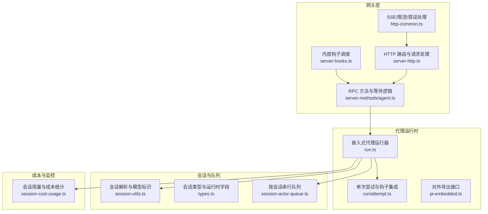
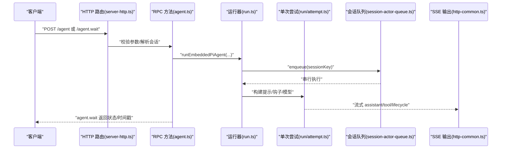
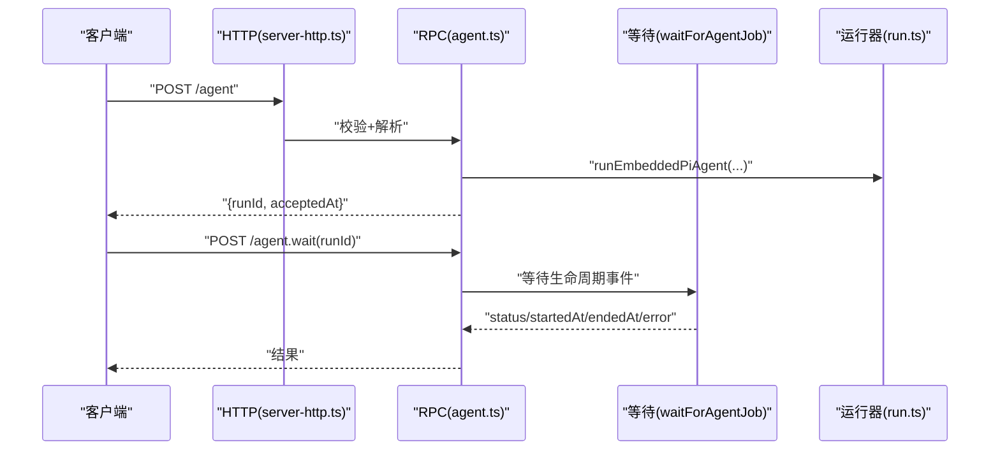
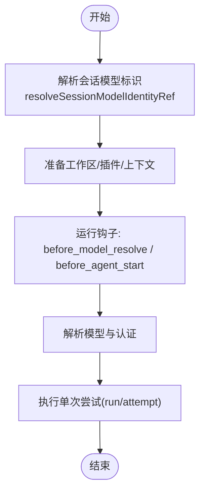
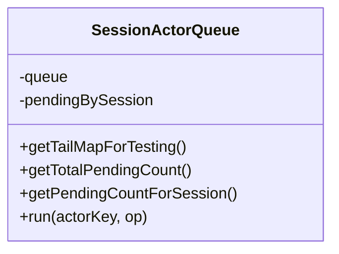
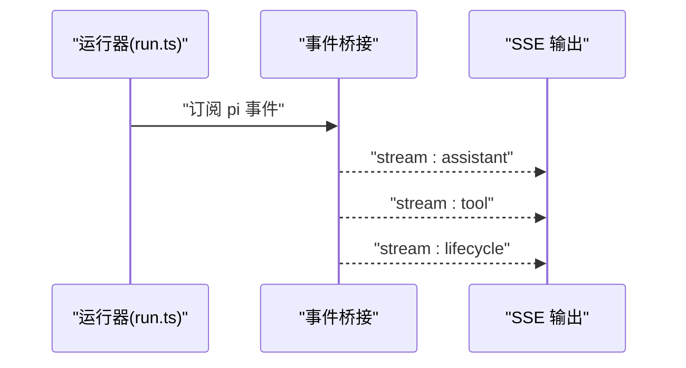
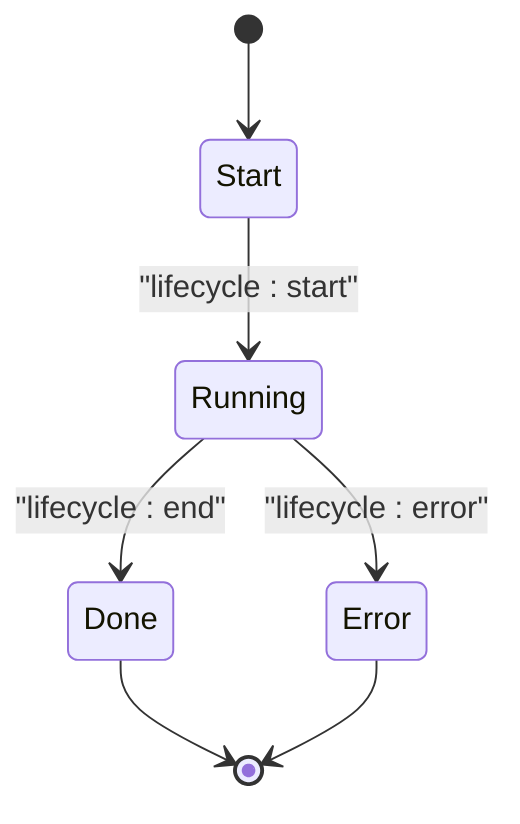
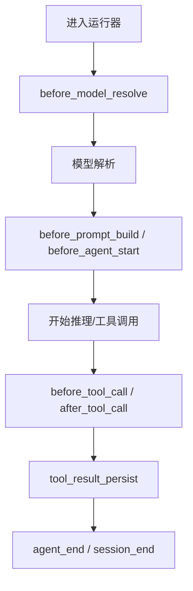
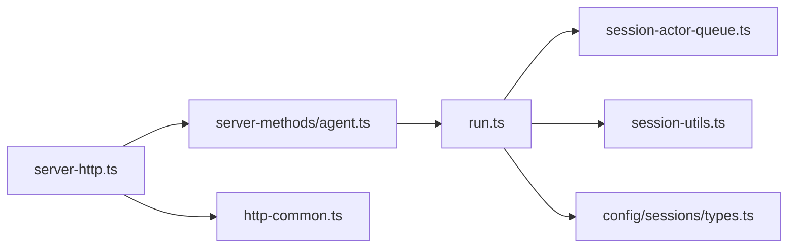

# 代理循环生命周期

<cite>
**本文引用的文件**
- [agent-loop.md](file://docs/concepts/agent-loop.md)
- [session.md](file://docs/concepts/session.md)
- [hooks.md](file://docs/automation/hooks.md)
- [run.ts](file://src/agents/pi-embedded-runner/run.ts)
- [run/attempt.ts](file://src/agents/pi-embedded-runner/run/attempt.ts)
- [pi-embedded.ts](file://src/agents/pi-embedded.ts)
- [server-methods/agent.ts](file://src/gateway/server-methods/agent.ts)
- [server-http.ts](file://src/gateway/server-http.ts)
- [http-common.ts](file://src/gateway/http-common.ts)
- [session-actor-queue.ts](file://src/acp/control-plane/session-actor-queue.ts)
- [session-utils.ts](file://src/gateway/session-utils.ts)
- [types.ts](file://src/config/sessions/types.ts)
- [session-cost-usage.ts](file://src/infra/session-cost-usage.ts)
- [server.sessions-send.test.ts](file://src/gateway/server.sessions-send.test.ts)
- [session-preview.test-helpers.ts](file://src/gateway/session-preview.test-helpers.ts)
- [read-response-with-limit.test.ts](file://src/media/read-response-with-limit.test.ts)
- [http-body.ts](file://src/infra/http-body.ts)
- [server-hooks.ts](file://src/gateway/server-hooks.ts)
- [server-http.test-harness.ts](file://src/gateway/server-http.test-harness.ts)
- [subagent-registry.ts](file://src/agents/subagent-registry.ts)
</cite>

## 目录
1. [简介](#简介)
2. [项目结构](#项目结构)
3. [核心组件](#核心组件)
4. [架构总览](#架构总览)
5. [详细组件分析](#详细组件分析)
6. [依赖关系分析](#依赖关系分析)
7. [性能考量](#性能考量)
8. [故障排查指南](#故障排查指南)
9. [结论](#结论)
10. [附录](#附录)

## 简介
本文件系统化阐述 OpenClaw 代理循环（Agent Loop）的生命周期：从消息接收、入口点验证、会话解析与准备、模型推理、工具执行、流式回复到最终持久化与结束事件。文档还覆盖队列管理、并发控制、会话隔离、生命周期事件、流式响应与错误处理策略，并给出调试方法、性能监控指标与常见问题解决方案，最后展示如何通过钩子系统拦截与定制代理行为。

## 项目结构
OpenClaw 的代理循环横跨“网关层（Gateway）”、“运行时（Agent Runner）”、“通道与会话（Channels & Sessions）”、“钩子系统（Hooks）”等多个模块。概念性文档提供了端到端的生命周期视图，具体实现分布在运行器、网关方法、HTTP 流与队列等文件中。

**图表来源**
- [server-http.ts:550-584](file://src/gateway/server-http.ts#L550-L584)
- [server-methods/agent.ts:742-771](file://src/gateway/server-methods/agent.ts#L742-L771)
- [run.ts:265-282](file://src/agents/pi-embedded-runner/run.ts#L265-L282)
- [run/attempt.ts:1172-1212](file://src/agents/pi-embedded-runner/run/attempt.ts#L1172-L1212)
- [pi-embedded.ts:1-16](file://src/agents/pi-embedded.ts#L1-L16)
- [session-utils.ts:813-844](file://src/gateway/session-utils.ts#L813-L844)
- [types.ts:176-233](file://src/config/sessions/types.ts#L176-L233)
- [session-actor-queue.ts:3-38](file://src/acp/control-plane/session-actor-queue.ts#L3-L38)
- [session-cost-usage.ts:139-184](file://src/infra/session-cost-usage.ts#L139-L184)

**章节来源**
- [agent-loop.md:1-149](file://docs/concepts/agent-loop.md#L1-L149)
- [session.md:1-311](file://docs/concepts/session.md#L1-L311)

## 核心组件
- 入口点与等待语义
  - 网关 RPC 提供 agent 与 agent.wait；前者立即返回 runId，后者等待生命周期结束或错误。
- 会话解析与准备
  - 解析 sessionKey/sessionId，加载工作区与技能快照，构建系统提示词，获取会话写锁并打开 SessionManager。
- 模型推理与认证
  - 钩子可提前决定 provider/model；随后解析模型、上下文窗口、认证配置，支持多认证档位与运行时凭据刷新。
- 工具执行与流式输出
  - 订阅 pi 事件，桥接 tool 与 assistant delta 到 OpenClaw 流；支持块级回复与推理流。
- 生命周期事件与结束条件
  - 发出 lifecycle/start/end/error 事件；agent.wait 基于生命周期事件聚合状态。
- 队列与并发控制
  - 按会话键串行化运行，必要时叠加全局队列，避免会话历史不一致与工具竞态。
- 钩子系统
  - 内部钩子（命令/生命周期事件）与插件钩子（before_model_resolve/before_prompt_build/…/tool_result_persist/session_start/session_end 等）贯穿代理循环关键节点。

**章节来源**
- [agent-loop.md:18-149](file://docs/concepts/agent-loop.md#L18-L149)
- [run.ts:265-371](file://src/agents/pi-embedded-runner/run.ts#L265-L371)
- [run/attempt.ts:1172-1212](file://src/agents/pi-embedded-runner/run/attempt.ts#L1172-L1212)
- [session-actor-queue.ts:3-38](file://src/acp/control-plane/session-actor-queue.ts#L3-L38)

## 架构总览
下图展示一次典型代理循环的端到端调用链：客户端通过网关 HTTP 路由提交消息，网关校验后分派到运行器；运行器在会话队列中串行执行，期间触发工具调用与流式输出，最终以生命周期事件收尾。

**图表来源**
- [server-http.ts:550-584](file://src/gateway/server-http.ts#L550-L584)
- [server-methods/agent.ts:742-771](file://src/gateway/server-methods/agent.ts#L742-L771)
- [run.ts:265-282](file://src/agents/pi-embedded-runner/run.ts#L265-L282)
- [run/attempt.ts:1172-1212](file://src/agents/pi-embedded-runner/run/attempt.ts#L1172-L1212)
- [session-actor-queue.ts:23-37](file://src/acp/control-plane/session-actor-queue.ts#L23-L37)
- [http-common.ts:73-108](file://src/gateway/http-common.ts#L73-L108)

## 详细组件分析

### 组件A：入口点与等待语义
- agent RPC
  - 校验参数，解析 sessionKey/sessionId，持久化会话元数据，立即返回 runId 与 acceptedAt。
- agent.wait
  - 基于 waitForAgentJob 等待生命周期 end/error；若收到 aborted=true 的 end，则映射为 timeout。
- 请求体限制与超时
  - readJsonBodyOrError 对 payload 大小与读取超时进行统一处理；installRequestBodyLimitGuard 提供可配置的请求体大小与超时保护。

**图表来源**
- [server-http.ts:550-584](file://src/gateway/server-http.ts#L550-L584)
- [server-methods/agent.ts:742-771](file://src/gateway/server-methods/agent.ts#L742-L771)
- [http-common.ts:73-96](file://src/gateway/http-common.ts#L73-L96)
- [http-body.ts:272-315](file://src/infra/http-body.ts#L272-L315)

**章节来源**
- [agent-loop.md:18-44](file://docs/concepts/agent-loop.md#L18-L44)
- [server-methods/agent.ts:742-771](file://src/gateway/server-methods/agent.ts#L742-L771)
- [http-common.ts:73-108](file://src/gateway/http-common.ts#L73-L108)
- [http-body.ts:272-315](file://src/infra/http-body.ts#L272-L315)

### 组件B：会话解析、模型解析与运行准备
- 会话解析
  - 通过 resolveSessionModelIdentityRef 将会话条目中的 model/provider 与运行时覆盖合并，形成最终 provider/model 引用。
- 运行准备
  - runEmbeddedPiAgent 在会话与全局队列上串行执行；解析上下文窗口、评估阻断/警告阈值；加载运行时插件与工作区。
- 钩子集成
  - before_model_resolve 与 before_agent_start（兼容）在 resolveModel 之前决定 provider/model 覆盖；before_prompt_build 注入系统提示上下文。

**图表来源**
- [session-utils.ts:813-844](file://src/gateway/session-utils.ts#L813-L844)
- [run.ts:265-371](file://src/agents/pi-embedded-runner/run.ts#L265-L371)
- [run/attempt.ts:1172-1212](file://src/agents/pi-embedded-runner/run/attempt.ts#L1172-L1212)

**章节来源**
- [session-utils.ts:813-844](file://src/gateway/session-utils.ts#L813-L844)
- [run.ts:265-371](file://src/agents/pi-embedded-runner/run.ts#L265-L371)
- [run/attempt.ts:1172-1212](file://src/agents/pi-embedded-runner/run/attempt.ts#L1172-L1212)

### 组件C：队列管理、并发控制与会话隔离
- 会话队列
  - SessionActorQueue 使用 KeyedAsyncQueue，按 sessionKey 串行化任务；维护 pending 计数，便于可观测与测试。
- 并发控制
  - runEmbeddedPiAgent 在会话 lane 与全局 lane 上分别排队，确保同一 session 的连续性与跨会话有序。
- 会话隔离
  - 通过 sessionKey/sessionId 映射到唯一 lane，避免不同会话间工具/上下文竞争。

**图表来源**
- [session-actor-queue.ts:3-38](file://src/acp/control-plane/session-actor-queue.ts#L3-L38)

**章节来源**
- [session-actor-queue.ts:3-38](file://src/acp/control-plane/session-actor-queue.ts#L3-L38)
- [run.ts:265-282](file://src/agents/pi-embedded-runner/run.ts#L265-L282)

### 组件D：模型推理、工具执行与流式回复
- 推理与流式
  - subscribeEmbeddedPiSession 将 pi 事件桥接为 tool/assistant/lifecycle 流；assistant delta 可作为块回复或推理流。
- 工具执行
  - tool 事件流用于跟踪工具调用开始/更新/结束；工具结果在持久化前可被 tool_result_persist 同步转换。
- 回复生成
  - 最终 payload 由助手文本、内联工具摘要与错误文本组成；NO_REPLY 会被过滤；重复发送的消息工具去重。

**图表来源**
- [agent-loop.md:97-132](file://docs/concepts/agent-loop.md#L97-L132)
- [http-common.ts:98-108](file://src/gateway/http-common.ts#L98-L108)

**章节来源**
- [agent-loop.md:97-132](file://docs/concepts/agent-loop.md#L97-L132)
- [http-common.ts:98-108](file://src/gateway/http-common.ts#L98-L108)

### 组件E：生命周期事件与结束条件
- 生命周期事件
  - lifecycle/start、lifecycle/end、lifecycle/error 由运行器发出；agent.wait 基于 end/error 聚合状态。
- 结束场景
  - 超时（agent.runtime 超时）、AbortSignal（取消）、网关断开/RPC 超时、agent.wait 超时（仅等待，不终止运行）。

**图表来源**
- [agent-loop.md:138-149](file://docs/concepts/agent-loop.md#L138-L149)
- [server-methods/agent.ts:742-771](file://src/gateway/server-methods/agent.ts#L742-L771)

**章节来源**
- [agent-loop.md:138-149](file://docs/concepts/agent-loop.md#L138-L149)
- [server-methods/agent.ts:742-771](file://src/gateway/server-methods/agent.ts#L742-L771)

### 组件F：钩子系统（拦截与定制）
- 内部钩子（Gateway）
  - 事件驱动脚本，如 command:new/reset/stop、agent:bootstrap、message:* 等；可通过 CLI 管理启用/禁用。
- 插件钩子（Agent/Gateway）
  - before_model_resolve、before_prompt_build、before_agent_start、agent_end、before_compaction/after_compaction、before_tool_call/after_tool_call、tool_result_persist、message_received/message_sending/message_sent、session_start/session_end、gateway_start/gateway_stop。
- 钩子执行顺序
  - before_model_resolve 优先于模型解析；before_prompt_build 与 legacy before_agent_start 可同时存在，新钩子优先。

**图表来源**
- [run.ts:318-371](file://src/agents/pi-embedded-runner/run.ts#L318-L371)
- [run/attempt.ts:1172-1212](file://src/agents/pi-embedded-runner/run/attempt.ts#L1172-L1212)
- [hooks.md:361-381](file://docs/automation/hooks.md#L361-L381)

**章节来源**
- [run.ts:318-371](file://src/agents/pi-embedded-runner/run.ts#L318-L371)
- [run/attempt.ts:1172-1212](file://src/agents/pi-embedded-runner/run/attempt.ts#L1172-L1212)
- [hooks.md:361-381](file://docs/automation/hooks.md#L361-L381)

## 依赖关系分析
- 运行器对队列与会话的依赖
  - runEmbeddedPiAgent 通过 resolveSessionLane/resolveGlobalLane 获取 lane，并使用 enqueueCommandInLane 将任务入队。
- 会话模型解析
  - session-utils.resolveSessionModelIdentityRef 与 config.sessions.types 中的运行时字段规范化共同保证 provider/model 的一致性。
- 网关与运行器的交互
  - server-http 负责路由与参数校验；server-methods/agent.ts 负责等待与结果聚合；http-common.ts 提供 SSE 与错误响应。

**图表来源**
- [server-http.ts:550-584](file://src/gateway/server-http.ts#L550-L584)
- [server-methods/agent.ts:742-771](file://src/gateway/server-methods/agent.ts#L742-L771)
- [run.ts:265-282](file://src/agents/pi-embedded-runner/run.ts#L265-L282)
- [session-actor-queue.ts:3-38](file://src/acp/control-plane/session-actor-queue.ts#L3-L38)
- [session-utils.ts:813-844](file://src/gateway/session-utils.ts#L813-L844)
- [types.ts:176-233](file://src/config/sessions/types.ts#L176-L233)
- [http-common.ts:73-108](file://src/gateway/http-common.ts#L73-L108)

**章节来源**
- [server-http.ts:550-584](file://src/gateway/server-http.ts#L550-L584)
- [server-methods/agent.ts:742-771](file://src/gateway/server-methods/agent.ts#L742-L771)
- [run.ts:265-282](file://src/agents/pi-embedded-runner/run.ts#L265-L282)
- [session-actor-queue.ts:3-38](file://src/acp/control-plane/session-actor-queue.ts#L3-L38)
- [session-utils.ts:813-844](file://src/gateway/session-utils.ts#L813-L844)
- [types.ts:176-233](file://src/config/sessions/types.ts#L176-L233)
- [http-common.ts:73-108](file://src/gateway/http-common.ts#L73-L108)

## 性能考量
- 队列与并发
  - 会话串行化避免上下文竞争，但可能引入排队延迟；建议合理设置会话隔离策略与队列容量。
- 上下文窗口与压缩
  - 通过 evaluateContextWindowGuard 与自动压缩（compaction）降低上下文膨胀风险；注意 cache 字段的累计与最近一次调用的差异处理。
- 流式输出与带宽
  - SSE 流式输出需考虑客户端连接稳定性与网络抖动；适当增大请求体上限与超时有助于提升鲁棒性。
- 成本与用量
  - session-cost-usage 提供按日统计的延迟与成本指标，可用于优化模型选择与调用策略。

**章节来源**
- [run.ts:189-215](file://src/agents/pi-embedded-runner/run.ts#L189-L215)
- [session-cost-usage.ts:139-184](file://src/infra/session-cost-usage.ts#L139-L184)
- [http-body.ts:272-315](file://src/infra/http-body.ts#L272-L315)

## 故障排查指南
- 请求体过大/超时
  - readJsonBodyOrError 与 installRequestBodyLimitGuard 提供统一的错误码与响应格式；检查 maxBytes 与 timeoutMs 设置。
- 流式读取异常
  - readResponseWithLimit 对流式响应进行字节限制，超限抛错；确认上游服务的响应大小与客户端消费速率。
- 生命周期等待异常
  - agent.wait 在收到 aborted=true 的 end 时视为 timeout；检查运行器是否提前中止或网关断连。
- 钩子执行失败
  - 钩子失败不应阻断主流程；查看 hooks 日志与 CLI 检查结果，定位具体钩子与事件。
- 子代理生命周期
  - subagent-registry 对挂起的生命周期错误进行延时清理，避免孤儿运行；关注 pendingLifecycleErrorByRunId 的定时器与清理逻辑。

**章节来源**
- [http-common.ts:73-108](file://src/gateway/http-common.ts#L73-L108)
- [read-response-with-limit.test.ts:28-40](file://src/media/read-response-with-limit.test.ts#L28-L40)
- [http-body.ts:272-315](file://src/infra/http-body.ts#L272-L315)
- [server-methods/agent.ts:742-771](file://src/gateway/server-methods/agent.ts#L742-L771)
- [hooks.md:778-800](file://docs/automation/hooks.md#L778-L800)
- [subagent-registry.ts:279-313](file://src/agents/subagent-registry.ts#L279-L313)

## 结论
OpenClaw 的代理循环以“串行化会话 + 全局有序”的队列模型为核心，结合钩子系统与流式事件，实现了从消息到动作再到回复的完整闭环。通过合理的会话隔离、并发控制与生命周期事件管理，系统在复杂场景下仍能保持一致性与可观测性。配合成本统计与错误处理策略，可进一步优化性能与稳定性。

## 附录
- 会话键映射与重置策略
  - session.md 提供了 DM/群组/频道等场景下的键规则与每日/空闲重置策略，便于理解会话边界与生命周期。
- 内部钩子参考
  - hooks.md 提供事件类型、处理器结构与最佳实践，便于扩展自动化能力。

**章节来源**
- [session.md:189-217](file://docs/concepts/session.md#L189-L217)
- [hooks.md:240-381](file://docs/automation/hooks.md#L240-L381)