# 会话与工作区准备

<cite>
**本文引用的文件**
- [src/agents/session-write-lock.ts](file://src/agents/session-write-lock.ts)
- [src/config/sessions/store.ts](file://src/config/sessions/store.ts)
- [src/agents/agent-scope.ts](file://src/agents/agent-scope.ts)
- [src/agents/workspace.ts](file://src/agents/workspace.ts)
- [src/agents/sandbox/workspace.ts](file://src/agents/sandbox/workspace.ts)
- [src/agents/sandbox/shared.ts](file://src/agents/sandbox/shared.ts)
- [src/agents/path-policy.ts](file://src/agents/path-policy.ts)
- [src/agents/system-prompt.ts](file://src/agents/system-prompt.ts)
- [src/agents/pi-embedded-runner/system-prompt.ts](file://src/agents/pi-embedded-runner/system-prompt.ts)
- [src/agents/system-prompt-report.ts](file://src/agents/system-prompt-report.ts)
- [src/auto-reply/reply/commands-context-report.ts](file://src/auto-reply/reply/commands-context-report.ts)
- [src/config/env-substitution.ts](file://src/config/env-substitution.ts)
- [src/config/env-preserve.ts](file://src/config/env-preserve.ts)
</cite>

## 目录
1. [简介](#简介)
2. [项目结构](#项目结构)
3. [核心组件](#核心组件)
4. [架构总览](#架构总览)
5. [详细组件分析](#详细组件分析)
6. [依赖关系分析](#依赖关系分析)
7. [性能考量](#性能考量)
8. [故障排查指南](#故障排查指南)
9. [结论](#结论)
10. [附录](#附录)

## 简介
本文件聚焦“会话与工作区准备”的完整流程，覆盖以下主题：
- 工作区解析与创建：默认工作区、代理工作区、模板填充、边界安全读取与缓存
- 沙箱运行时工作区根目录重定向：沙箱工作区目录生成、作用域键、容器内路径映射
- 技能快照加载与注入：引导文件（bootstrap）与上下文文件的收集与注入
- 引导文件解析与系统提示词报告构建：系统提示词组装、工具清单、技能摘要、沙箱信息等
- 会话写锁获取与释放：互斥写入、重入支持、过期清理、看门狗回收
- SessionManager 初始化流程：会话存储锁队列、并发控制、维护策略
- 权限管理、路径解析规则与环境变量注入最佳实践：边界检查、相对路径归一化、环境变量替换与保留

## 项目结构
围绕会话与工作区准备的关键模块如下：
- 会话写锁与并发控制：确保对会话文件与会话存储的互斥访问
- 会话存储与维护：会话条目的持久化、修剪、限额与磁盘预算
- 工作区解析与创建：默认工作区、代理工作区、模板与引导文件
- 沙箱工作区：沙箱根目录重定向、作用域键、容器内路径映射
- 路径策略与权限：相对路径归一化、边界检查、跨平台兼容
- 系统提示词与报告：系统提示词构建、工具与技能摘要、沙箱信息、上下文文件
- 环境变量：变量替换与保留策略，保证配置回写一致性

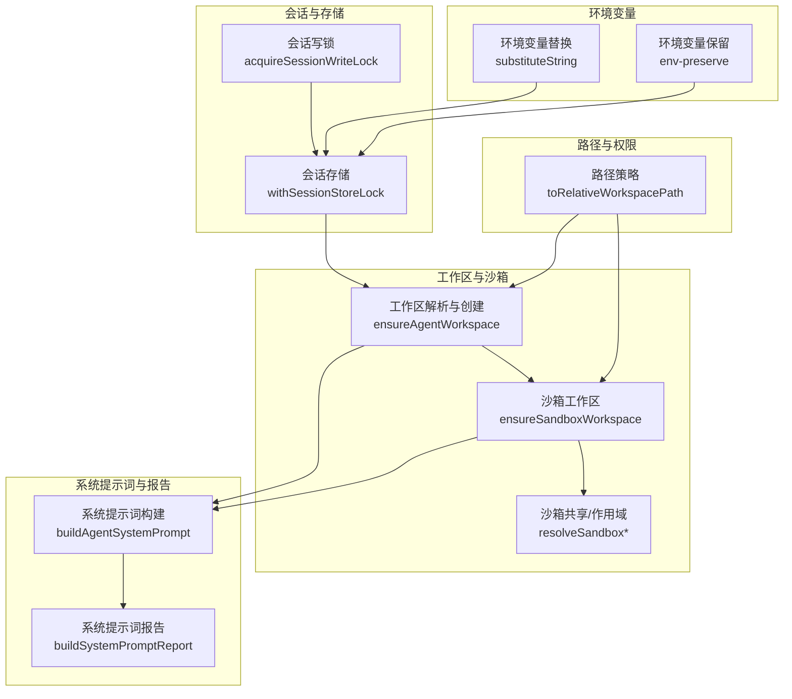

图示来源
- [src/agents/session-write-lock.ts:444-553](file://src/agents/session-write-lock.ts#L444-L553)
- [src/config/sessions/store.ts:695-727](file://src/config/sessions/store.ts#L695-L727)
- [src/agents/workspace.ts:327-465](file://src/agents/workspace.ts#L327-L465)
- [src/agents/sandbox/workspace.ts:17-65](file://src/agents/sandbox/workspace.ts#L17-L65)
- [src/agents/sandbox/shared.ts:18-46](file://src/agents/sandbox/shared.ts#L18-L46)
- [src/agents/path-policy.ts:105-130](file://src/agents/path-policy.ts#L105-L130)
- [src/agents/system-prompt.ts:57-87](file://src/agents/system-prompt.ts#L57-L87)
- [src/agents/system-prompt-report.ts:80-109](file://src/agents/system-prompt-report.ts#L80-L109)
- [src/config/env-substitution.ts:88-105](file://src/config/env-substitution.ts#L88-L105)
- [src/config/env-preserve.ts:1-78](file://src/config/env-preserve.ts#L1-L78)

章节来源
- [src/agents/session-write-lock.ts:444-553](file://src/agents/session-write-lock.ts#L444-L553)
- [src/config/sessions/store.ts:695-727](file://src/config/sessions/store.ts#L695-L727)
- [src/agents/workspace.ts:327-465](file://src/agents/workspace.ts#L327-L465)
- [src/agents/sandbox/workspace.ts:17-65](file://src/agents/sandbox/workspace.ts#L17-L65)
- [src/agents/sandbox/shared.ts:18-46](file://src/agents/sandbox/shared.ts#L18-L46)
- [src/agents/path-policy.ts:105-130](file://src/agents/path-policy.ts#L105-L130)
- [src/agents/system-prompt.ts:57-87](file://src/agents/system-prompt.ts#L57-L87)
- [src/agents/system-prompt-report.ts:80-109](file://src/agents/system-prompt-report.ts#L80-L109)
- [src/config/env-substitution.ts:88-105](file://src/config/env-substitution.ts#L88-L105)
- [src/config/env-preserve.ts:1-78](file://src/config/env-preserve.ts#L1-L78)

## 核心组件
- 会话写锁：提供可重入的会话文件写入互斥，支持超时、过期检测与看门狗回收
- 会话存储：封装原子写入、缓存、维护（修剪、限额、轮转）、磁盘预算执行
- 工作区解析与创建：默认工作区、代理工作区、模板填充、边界安全读取、Git 初始化
- 沙箱工作区：基于会话键生成沙箱目录、作用域键（session/agent/shared）、容器内路径映射
- 路径策略：跨平台相对路径归一化、边界检查、错误信息增强
- 系统提示词与报告：工具与技能摘要、沙箱信息、上下文文件、截断警告等
- 环境变量：字符串替换、缺失变量处理、保留原始占位符以避免丢失环境语义

章节来源
- [src/agents/session-write-lock.ts:1-561](file://src/agents/session-write-lock.ts#L1-L561)
- [src/config/sessions/store.ts:1-800](file://src/config/sessions/store.ts#L1-L800)
- [src/agents/workspace.ts:1-648](file://src/agents/workspace.ts#L1-L648)
- [src/agents/sandbox/workspace.ts:17-65](file://src/agents/sandbox/workspace.ts#L17-L65)
- [src/agents/sandbox/shared.ts:1-46](file://src/agents/sandbox/shared.ts#L1-L46)
- [src/agents/path-policy.ts:1-135](file://src/agents/path-policy.ts#L1-L135)
- [src/agents/system-prompt.ts:1-109](file://src/agents/system-prompt.ts#L1-L109)
- [src/agents/system-prompt-report.ts:1-109](file://src/agents/system-prompt-report.ts#L1-L109)
- [src/config/env-substitution.ts:1-105](file://src/config/env-substitution.ts#L1-L105)
- [src/config/env-preserve.ts:1-78](file://src/config/env-preserve.ts#L1-L78)

## 架构总览
下图展示从会话写锁到会话存储、再到工作区与沙箱准备的整体调用链路。

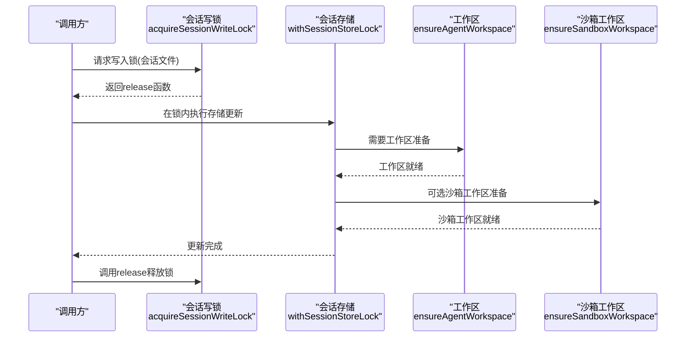

图示来源
- [src/agents/session-write-lock.ts:444-553](file://src/agents/session-write-lock.ts#L444-L553)
- [src/config/sessions/store.ts:695-727](file://src/config/sessions/store.ts#L695-L727)
- [src/agents/workspace.ts:327-465](file://src/agents/workspace.ts#L327-L465)
- [src/agents/sandbox/workspace.ts:17-65](file://src/agents/sandbox/workspace.ts#L17-L65)

## 详细组件分析

### 会话写锁与并发控制
- 获取与释放
  - 支持可重入计数，允许同进程多次持有同一会话锁
  - 超时与过期检测：通过时间戳与进程启动时间判断死锁或PID回收
  - 看门狗：定时扫描超长占用锁并强制释放
  - 清理：进程退出与信号处理时同步清理所有已持锁
- 锁文件内容：包含进程ID、创建时间、进程启动时间（用于PID回收检测）
- 并发队列：同一会话存储路径的任务排队执行，避免争用

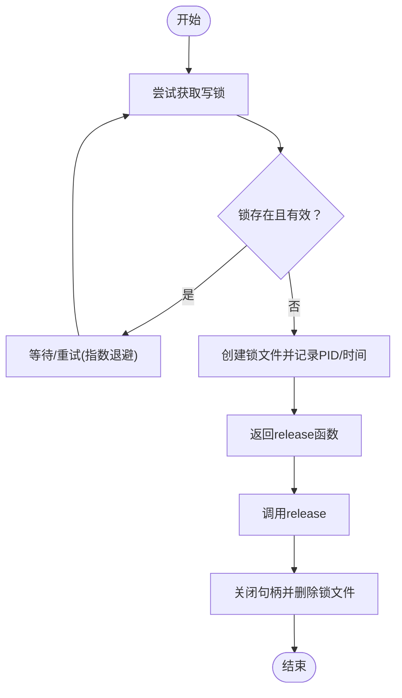

图示来源
- [src/agents/session-write-lock.ts:444-553](file://src/agents/session-write-lock.ts#L444-L553)

章节来源
- [src/agents/session-write-lock.ts:1-561](file://src/agents/session-write-lock.ts#L1-L561)

### 会话存储与维护
- 原子写入：使用临时文件+重命名，避免部分写入
- 缓存：基于文件状态快照的TTL缓存，减少重复解析
- 维护策略：修剪过期、限制数量、轮转大文件、磁盘预算清理
- 并发：通过会话写锁与队列保证同一路径的串行化操作

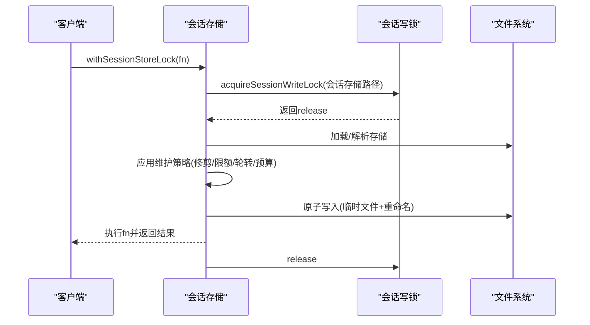

图示来源
- [src/config/sessions/store.ts:695-727](file://src/config/sessions/store.ts#L695-L727)
- [src/agents/session-write-lock.ts:444-553](file://src/agents/session-write-lock.ts#L444-L553)

章节来源
- [src/config/sessions/store.ts:1-800](file://src/config/sessions/store.ts#L1-L800)

### 工作区解析与创建
- 默认工作区：根据用户主目录与配置生成
- 代理工作区：按代理ID生成独立工作区目录
- 模板填充：首次创建时写入标准引导文件（如 AGENTS、SOUL、TOOLS、IDENTITY、USER、HEARTBEAT、BOOTSTRAP），并记录状态
- 边界安全读取：通过边界文件打开，限制读取范围与大小，按inode/dev/size/mtime缓存避免误读
- Git 初始化：新工作区自动初始化Git仓库（若可用）

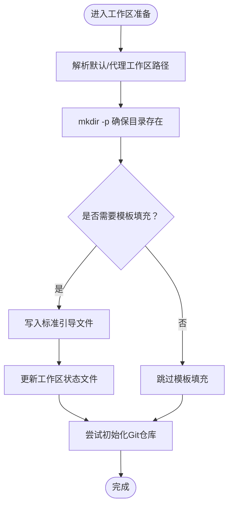

图示来源
- [src/agents/workspace.ts:327-465](file://src/agents/workspace.ts#L327-L465)

章节来源
- [src/agents/workspace.ts:1-648](file://src/agents/workspace.ts#L1-L648)

### 沙箱工作区与根目录重定向
- 目录生成：基于会话键生成稳定短标识，拼接为沙箱根下的工作区目录
- 作用域键：支持 session、agent、shared 三种作用域，用于隔离与共享
- 容器内路径映射：将宿主路径转换为容器内的 /workspace 相对路径，便于沙箱内访问

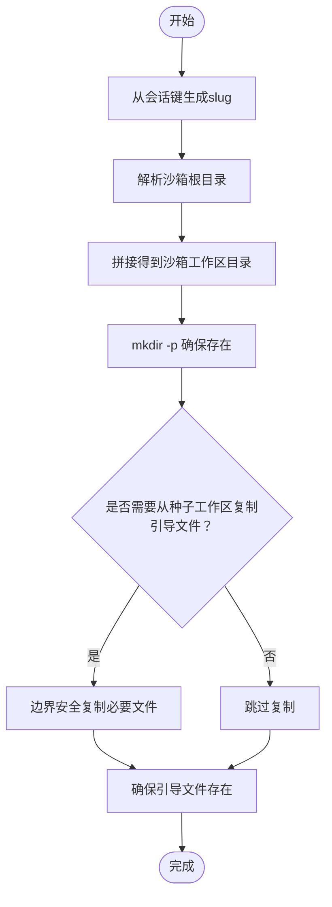

图示来源
- [src/agents/sandbox/shared.ts:18-46](file://src/agents/sandbox/shared.ts#L18-L46)
- [src/agents/sandbox/workspace.ts:17-65](file://src/agents/sandbox/workspace.ts#L17-L65)

章节来源
- [src/agents/sandbox/shared.ts:1-46](file://src/agents/sandbox/shared.ts#L1-L46)
- [src/agents/sandbox/workspace.ts:17-65](file://src/agents/sandbox/workspace.ts#L17-L65)

### 路径策略与权限管理
- 相对路径归一化：在Windows与非Windows平台分别进行大小写与分隔符处理
- 边界检查：拒绝越界路径（..、绝对路径），支持允许根路径与自定义边界标签
- 错误信息增强：包含根路径与候选路径，便于定位问题

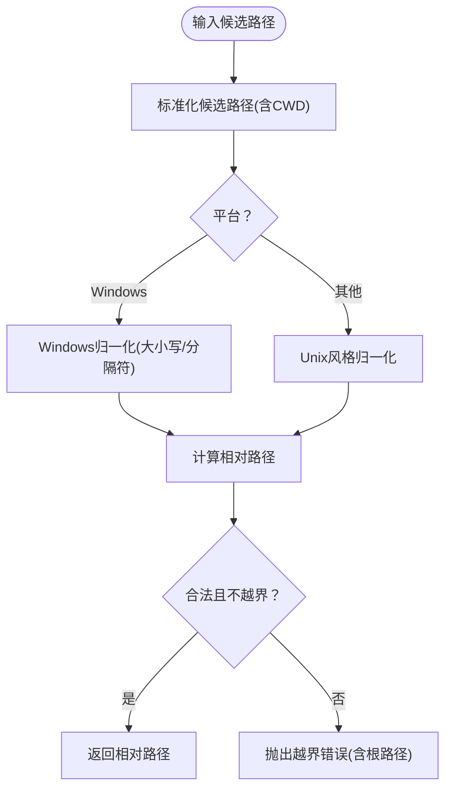

图示来源
- [src/agents/path-policy.ts:105-130](file://src/agents/path-policy.ts#L105-L130)

章节来源
- [src/agents/path-policy.ts:1-135](file://src/agents/path-policy.ts#L1-L135)

### 技能快照加载与注入、引导文件解析
- 引导文件加载：标准引导文件集合与可选内存文件优先级处理
- 额外引导文件：支持通配符匹配，仅接受受支持的引导文件名，返回诊断信息
- 注入时机：在系统提示词构建前完成，作为上下文文件的一部分

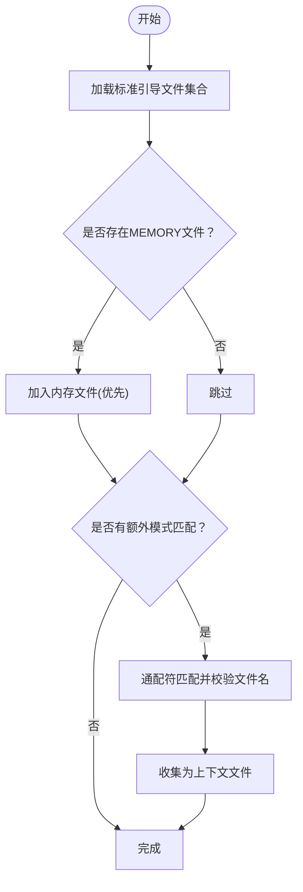

图示来源
- [src/agents/workspace.ts:487-547](file://src/agents/workspace.ts#L487-L547)
- [src/agents/workspace.ts:567-647](file://src/agents/workspace.ts#L567-L647)

章节来源
- [src/agents/workspace.ts:487-547](file://src/agents/workspace.ts#L487-L547)
- [src/agents/workspace.ts:567-647](file://src/agents/workspace.ts#L567-L647)

### 系统提示词构建与报告
- 系统提示词：整合工具名称与摘要、模型别名、沙箱信息、上下文文件、心跳提示、技能提示等
- 报告构建：统计工具描述长度、参数schema长度、技能块解析、提取项目上下文与工具列表文本

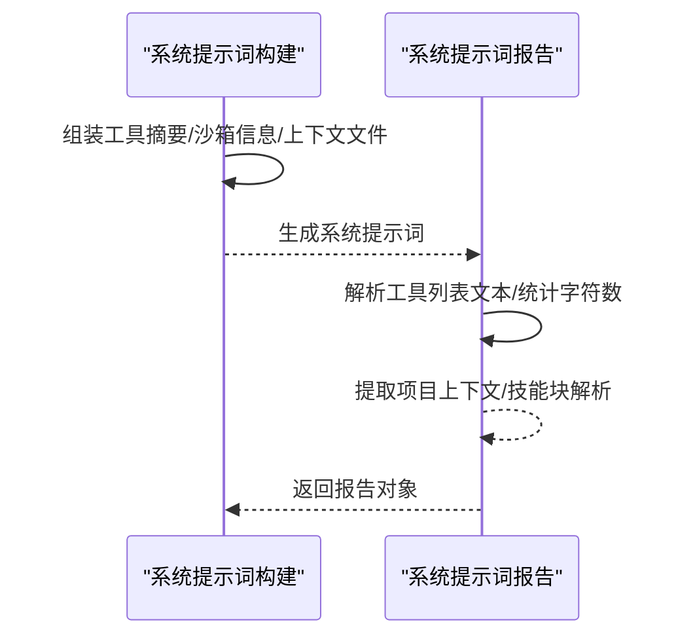

图示来源
- [src/agents/system-prompt.ts:57-87](file://src/agents/system-prompt.ts#L57-L87)
- [src/agents/system-prompt-report.ts:80-109](file://src/agents/system-prompt-report.ts#L80-L109)

章节来源
- [src/agents/system-prompt.ts:1-109](file://src/agents/system-prompt.ts#L1-L109)
- [src/agents/system-prompt-report.ts:1-109](file://src/agents/system-prompt-report.ts#L1-L109)

### 环境变量注入与保留
- 替换策略：支持 ${VAR} 占位符替换，支持转义 $${VAR} 表示字面量
- 缺失处理：可配置缺失变量回调，避免直接抛错
- 保留策略：在配置回写时，若值与当前环境变量替换后一致，则恢复原占位符，避免丢失环境语义

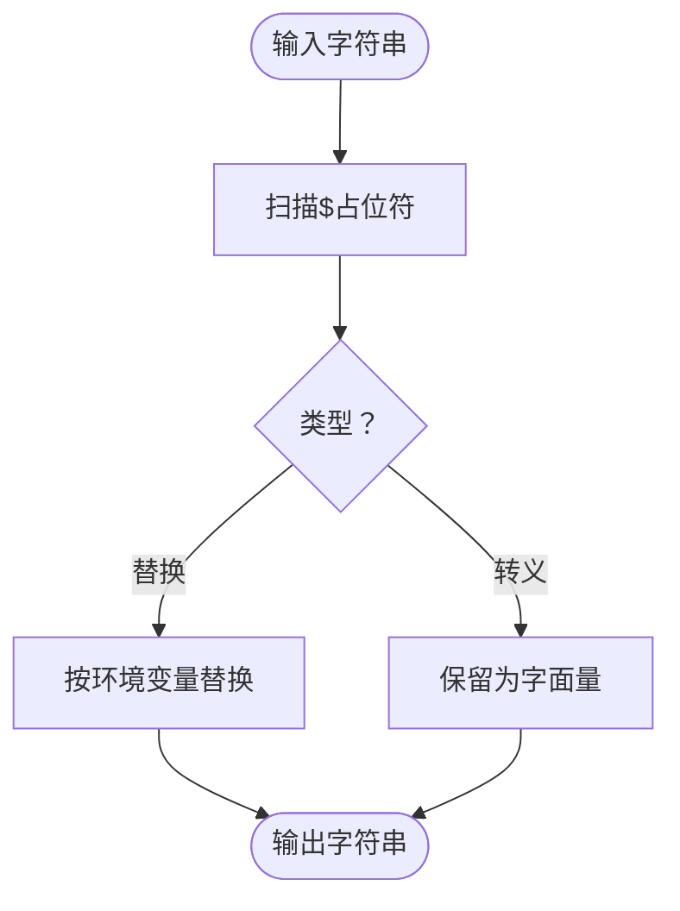

图示来源
- [src/config/env-substitution.ts:88-105](file://src/config/env-substitution.ts#L88-L105)
- [src/config/env-preserve.ts:1-78](file://src/config/env-preserve.ts#L1-L78)

章节来源
- [src/config/env-substitution.ts:1-105](file://src/config/env-substitution.ts#L1-L105)
- [src/config/env-preserve.ts:1-78](file://src/config/env-preserve.ts#L1-L78)

## 依赖关系分析
- 会话写锁被会话存储使用，保障原子性与并发安全
- 工作区与沙箱准备在系统提示词构建之前完成，确保上下文文件可用
- 路径策略贯穿工作区与沙箱的边界检查与相对路径归一化
- 环境变量替换与保留贯穿配置读取与回写，保证一致性

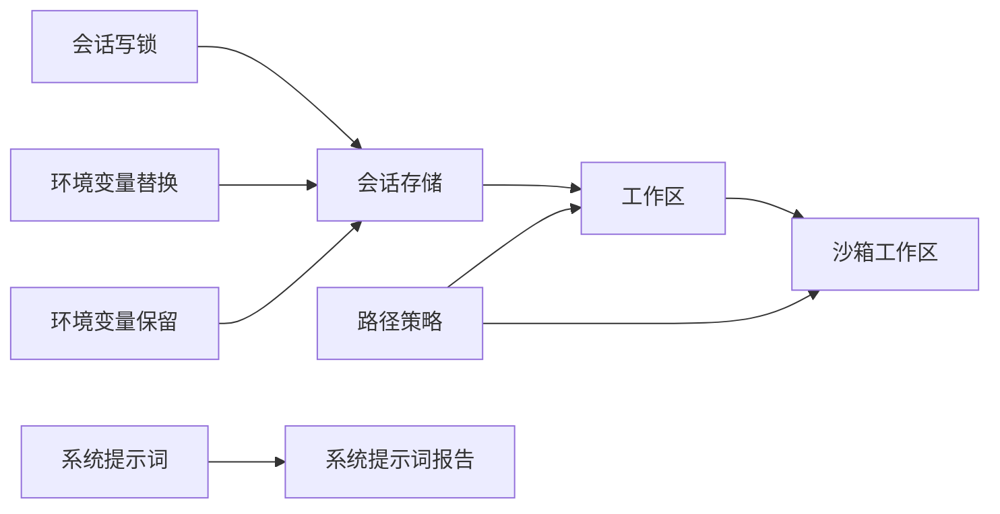

图示来源
- [src/agents/session-write-lock.ts:444-553](file://src/agents/session-write-lock.ts#L444-L553)
- [src/config/sessions/store.ts:695-727](file://src/config/sessions/store.ts#L695-L727)
- [src/agents/workspace.ts:327-465](file://src/agents/workspace.ts#L327-L465)
- [src/agents/sandbox/workspace.ts:17-65](file://src/agents/sandbox/workspace.ts#L17-L65)
- [src/agents/path-policy.ts:105-130](file://src/agents/path-policy.ts#L105-L130)
- [src/config/env-substitution.ts:88-105](file://src/config/env-substitution.ts#L88-L105)
- [src/config/env-preserve.ts:1-78](file://src/config/env-preserve.ts#L1-L78)
- [src/agents/system-prompt.ts:57-87](file://src/agents/system-prompt.ts#L57-L87)
- [src/agents/system-prompt-report.ts:80-109](file://src/agents/system-prompt-report.ts#L80-L109)

章节来源
- [src/agents/session-write-lock.ts:1-561](file://src/agents/session-write-lock.ts#L1-L561)
- [src/config/sessions/store.ts:1-800](file://src/config/sessions/store.ts#L1-L800)
- [src/agents/workspace.ts:1-648](file://src/agents/workspace.ts#L1-L648)
- [src/agents/sandbox/workspace.ts:1-65](file://src/agents/sandbox/workspace.ts#L1-L65)
- [src/agents/path-policy.ts:1-135](file://src/agents/path-policy.ts#L1-L135)
- [src/config/env-substitution.ts:1-105](file://src/config/env-substitution.ts#L1-L105)
- [src/config/env-preserve.ts:1-78](file://src/config/env-preserve.ts#L1-L78)
- [src/agents/system-prompt.ts:1-109](file://src/agents/system-prompt.ts#L1-L109)
- [src/agents/system-prompt-report.ts:1-109](file://src/agents/system-prompt-report.ts#L1-L109)

## 性能考量
- 写锁与会话存储：通过队列串行化避免频繁竞争；超时与退避降低忙等
- 工作区模板：模板内容缓存与一次性写入，减少IO与重复解析
- 文件读取：边界安全读取结合inode/dev/size/mtime身份缓存，避免重复读取与误判
- 磁盘预算：定期清理与轮转，防止存储膨胀影响I/O

## 故障排查指南
- 会话写锁超时
  - 现象：长时间无法获取锁
  - 排查：检查锁文件是否存在、进程是否存活、是否发生PID回收
  - 处置：启用看门狗或手动清理过期锁文件
- 会话存储损坏或空文件
  - 现象：读取为空或解析失败
  - 排查：Windows平台可能处于临时写入阶段；检查缓存与重试逻辑
  - 处置：等待短暂重试或禁用缓存后重试
- 工作区文件越界
  - 现象：路径解析报错“越出工作区根”
  - 排查：确认候选路径是否包含 .. 或绝对路径
  - 处置：使用相对路径或调整边界策略
- 沙箱容器内路径异常
  - 现象：容器内找不到对应文件
  - 排查：确认宿主路径映射与容器内相对路径计算
  - 处置：检查宿主路径与沙箱根目录映射关系

章节来源
- [src/agents/session-write-lock.ts:387-442](file://src/agents/session-write-lock.ts#L387-L442)
- [src/config/sessions/store.ts:213-270](file://src/config/sessions/store.ts#L213-L270)
- [src/agents/path-policy.ts:12-20](file://src/agents/path-policy.ts#L12-L20)
- [src/agents/sandbox/shared.ts:79-99](file://src/agents/sandbox/shared.ts#L79-L99)

## 结论
本文档系统梳理了会话与工作区准备的全链路实现，包括：
- 会话写锁与并发控制确保数据一致性
- 会话存储的维护与原子写入保障可靠性
- 工作区与沙箱的边界安全与路径策略
- 系统提示词与报告的构建与注入
- 环境变量替换与保留的最佳实践

建议在生产环境中：
- 合理设置写锁超时与看门狗间隔
- 使用模板缓存与边界安全读取
- 明确沙箱作用域与容器内路径映射
- 严格遵循路径策略与权限边界
- 利用环境变量替换与保留策略保持配置一致性

## 附录
- 最佳实践清单
  - 工作区权限：仅授予必要目录，使用边界安全读取与缓存
  - 路径解析：统一使用相对路径与归一化策略，避免硬编码绝对路径
  - 环境变量：在配置回写时保留占位符，避免丢失环境语义
  - 沙箱：明确作用域键与容器内路径映射，避免跨作用域访问
  - 会话存储：启用维护策略与磁盘预算，定期轮转与清理