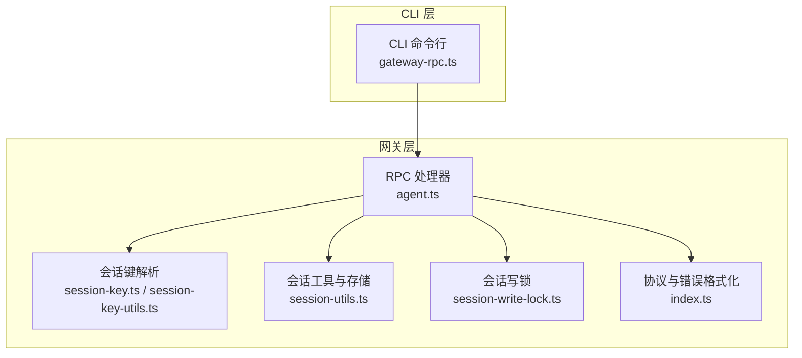
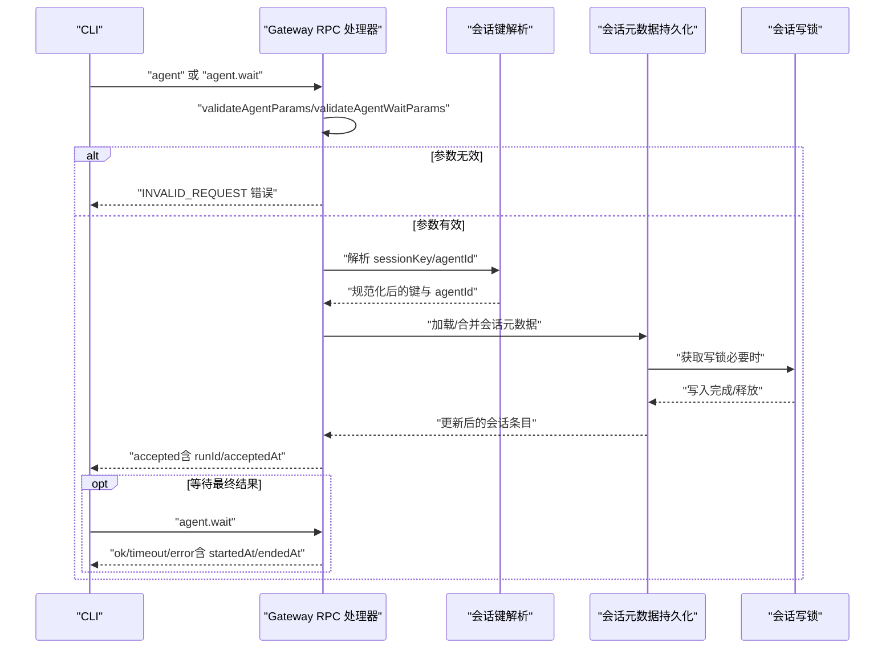
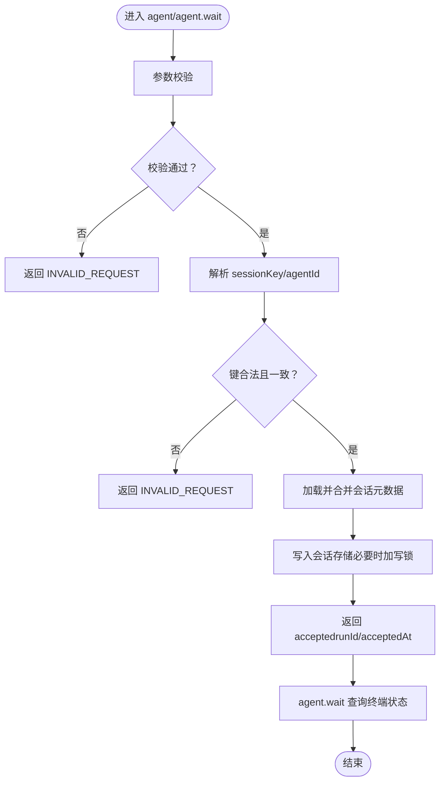
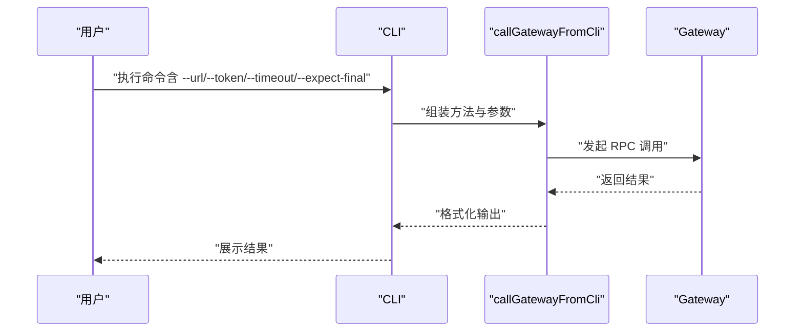
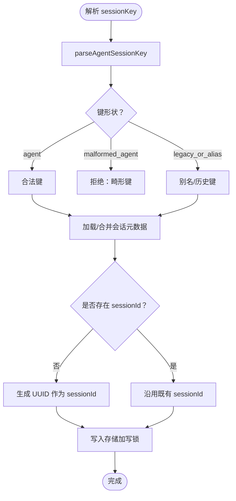
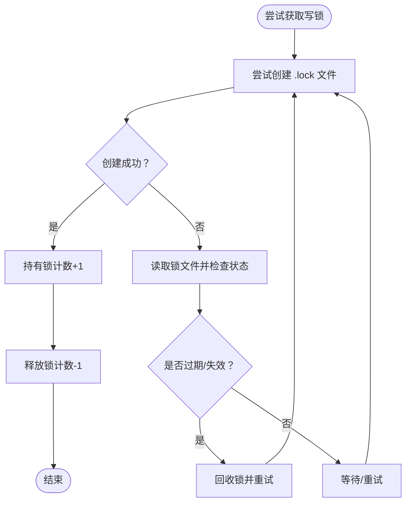
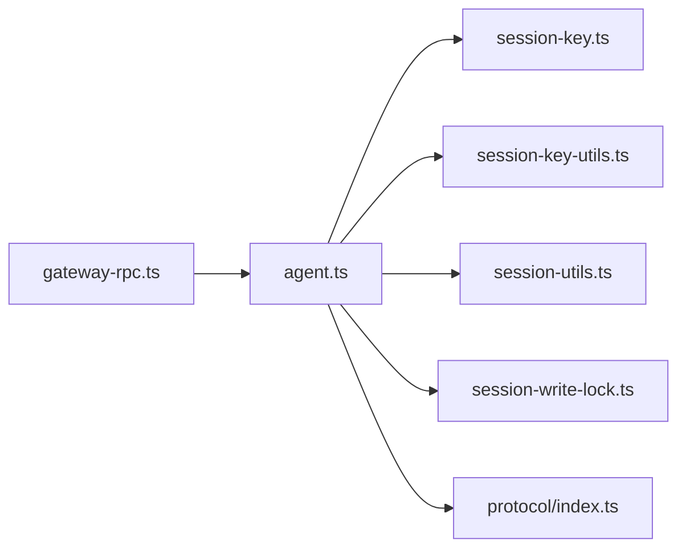

# 入口点与参数验证

<cite>
**本文引用的文件**
- [agent.ts](file://src/gateway/server-methods/agent.ts)
- [session-key.ts](file://src/routing/session-key.ts)
- [session-key-utils.ts](file://src/sessions/session-key-utils.ts)
- [agent-scope.ts](file://src/agents/agent-scope.ts)
- [session-utils.ts](file://src/gateway/session-utils.ts)
- [gateway-rpc.ts](file://src/cli/gateway-rpc.ts)
- [session-write-lock.ts](file://src/agents/session-write-lock.ts)
- [index.ts](file://src/gateway/protocol/index.ts)
- [agent.ts](file://src/gateway/server.agent.gateway-server-agent-a.test.ts)
- [agent.ts](file://src/gateway/server.agent.gateway-server-agent-b.test.ts)
- [agent.ts](file://src/gateway/server.chat.gateway-server-chat.test.ts)
- [openclaw-tools.sessions.test.ts](file://src/agents/openclaw-tools.sessions.test.ts)
</cite>

## 目录
1. [简介](#简介)
2. [项目结构](#项目结构)
3. [核心组件](#核心组件)
4. [架构总览](#架构总览)
5. [详细组件分析](#详细组件分析)
6. [依赖关系分析](#依赖关系分析)
7. [性能考量](#性能考量)
8. [故障排查指南](#故障排查指南)
9. [结论](#结论)
10. [附录](#附录)

## 简介
本文件聚焦于代理入口点与参数验证，系统性阐述以下主题：
- Gateway RPC 的 agent 与 agent.wait 方法的调用流程与语义
- CLI 命令行接口（CLI）中与 Gateway 的交互方式
- 参数验证与错误处理机制
- 会话解析：sessionKey 与 sessionId 的解析与生成规则
- 会话元数据持久化流程
- runId 与 acceptedAt 的生成与使用
- 并发访问控制与会话写锁策略
- 完整的 API 调用示例与错误码说明

## 项目结构
围绕“入口点与参数验证”的关键模块分布如下：
- 网关侧 RPC 处理器：负责接收 agent/agent.wait 请求、参数校验、会话解析与持久化、并发控制等
- 会话键解析与规范化：提供 sessionKey 解析、agentId 推断、主会话别名解析等能力
- CLI 与网关交互：封装 CLI 对 Gateway 的 RPC 调用，统一超时与期望响应行为
- 会话写锁：提供基于文件锁的并发写入保护与看门狗清理机制
- 协议与错误格式化：统一参数校验与错误返回格式

图表来源
- [gateway-rpc.ts:1-48](file://src/cli/gateway-rpc.ts#L1-L48)
- [agent.ts:148-772](file://src/gateway/server-methods/agent.ts#L148-L772)
- [session-key.ts:1-254](file://src/routing/session-key.ts#L1-L254)
- [session-key-utils.ts:1-133](file://src/sessions/session-key-utils.ts#L1-L133)
- [session-utils.ts:1-800](file://src/gateway/session-utils.ts#L1-L800)
- [session-write-lock.ts:1-561](file://src/agents/session-write-lock.ts#L1-L561)
- [index.ts:424-458](file://src/gateway/protocol/index.ts#L424-L458)

章节来源
- [gateway-rpc.ts:1-48](file://src/cli/gateway-rpc.ts#L1-L48)
- [agent.ts:148-772](file://src/gateway/server-methods/agent.ts#L148-L772)
- [session-key.ts:1-254](file://src/routing/session-key.ts#L1-L254)
- [session-key-utils.ts:1-133](file://src/sessions/session-key-utils.ts#L1-L133)
- [session-utils.ts:1-800](file://src/gateway/session-utils.ts#L1-L800)
- [session-write-lock.ts:1-561](file://src/agents/session-write-lock.ts#L1-L561)
- [index.ts:424-458](file://src/gateway/protocol/index.ts#L424-L458)

## 核心组件
- 网关 RPC 处理器（agent/agent.wait）
  - 负责参数校验、会话键解析、会话元数据持久化、并发控制、运行结果回传
- 会话键解析与规范化
  - 提供 sessionKey 解析、agentId 推断、主会话别名解析、形状分类等
- CLI 与网关交互
  - 统一封装 CLI 对 Gateway 的 RPC 调用，支持超时、期望最终响应等选项
- 会话写锁
  - 基于文件锁的并发写入保护，带看门狗自动清理与进程信号处理
- 协议与错误格式化
  - 统一参数校验错误格式化输出

章节来源
- [agent.ts:148-772](file://src/gateway/server-methods/agent.ts#L148-L772)
- [session-key.ts:1-254](file://src/routing/session-key.ts#L1-L254)
- [session-key-utils.ts:1-133](file://src/sessions/session-key-utils.ts#L1-L133)
- [gateway-rpc.ts:1-48](file://src/cli/gateway-rpc.ts#L1-L48)
- [session-write-lock.ts:1-561](file://src/agents/session-write-lock.ts#L1-L561)
- [index.ts:424-458](file://src/gateway/protocol/index.ts#L424-L458)

## 架构总览
下图展示从 CLI 到网关 RPC 的端到端调用路径，以及参数验证与会话解析的关键节点。

图表来源
- [gateway-rpc.ts:22-47](file://src/cli/gateway-rpc.ts#L22-L47)
- [agent.ts:148-772](file://src/gateway/server-methods/agent.ts#L148-L772)
- [session-key.ts:78-107](file://src/routing/session-key.ts#L78-L107)
- [session-utils.ts:180-192](file://src/gateway/session-utils.ts#L180-L192)
- [session-write-lock.ts:444-553](file://src/agents/session-write-lock.ts#L444-L553)

## 详细组件分析

### 网关 RPC：agent 与 agent.wait
- 参数验证
  - 使用专用校验函数对请求参数进行结构化校验；若失败，返回 INVALID_REQUEST，并附带格式化的错误信息
- 会话键解析与一致性检查
  - 支持显式 sessionKey 与隐式主会话键；对“agent:”前缀但格式不合法的键直接拒绝
  - 当显式 agentId 与 sessionKey 中的 agentId 不一致时拒绝请求
- 会话元数据解析与持久化
  - 加载现有会话条目，合并新字段（如 sessionId、标签、通道、群组信息等），并写入会话存储
  - 主会话或全局会话默认开启“尽力投递”
- 运行与回传
  - 生成 runId（与 idempotencyKey 同值），返回 accepted（含 acceptedAt）
  - 后续通过去重表与生命周期事件回传最终结果
- agent.wait
  - 校验参数后，等待生命周期或去重表中的终端快照；支持超时；返回状态与时间戳

图表来源
- [agent.ts:148-772](file://src/gateway/server-methods/agent.ts#L148-L772)
- [index.ts:424-458](file://src/gateway/protocol/index.ts#L424-L458)

章节来源
- [agent.ts:148-772](file://src/gateway/server-methods/agent.ts#L148-L772)
- [index.ts:424-458](file://src/gateway/protocol/index.ts#L424-L458)

### CLI 命令行接口（Gateway RPC）
- CLI 封装了 callGatewayFromCli，统一处理：
  - URL、令牌、超时、是否等待最终响应等选项
  - 显示进度与 JSON 输出模式
- 适用于 agent 与 agent.wait 的调用场景

图表来源
- [gateway-rpc.ts:22-47](file://src/cli/gateway-rpc.ts#L22-L47)

章节来源
- [gateway-rpc.ts:1-48](file://src/cli/gateway-rpc.ts#L1-L48)

### 会话键解析与会话元数据持久化
- sessionKey 解析
  - 支持“agent:agentId:...”形式；对非法“agent:”前缀键判定为“畸形”
  - 主会话别名解析：将“main”等别名规范化为主会话键
- sessionId 生成规则
  - 若会话条目不存在 sessionId，则在首次使用时生成 UUID
  - 已存在条目保留原 sessionId，避免跨会话变更
- 元数据持久化
  - 加载目标会话存储，迁移与修剪旧键，合并补丁，写回
  - 写入采用 Promise 链串行化，避免竞态与数据丢失

图表来源
- [session-key-utils.ts:12-32](file://src/sessions/session-key-utils.ts#L12-L32)
- [session-key.ts:78-87](file://src/routing/session-key.ts#L78-L87)
- [session-key.ts:40-87](file://src/routing/session-key.ts#L40-L87)
- [session-utils.ts:180-192](file://src/gateway/session-utils.ts#L180-L192)
- [session-utils.ts:426-437](file://src/gateway/session-utils.ts#L426-L437)

章节来源
- [session-key-utils.ts:1-133](file://src/sessions/session-key-utils.ts#L1-L133)
- [session-key.ts:1-254](file://src/routing/session-key.ts#L1-L254)
- [session-utils.ts:1-800](file://src/gateway/session-utils.ts#L1-L800)

### runId 与 acceptedAt 的生成规则
- runId
  - 与请求中的 idempotencyKey 同值，用于幂等与去重
- acceptedAt
  - 在返回 accepted 时记录当前时间戳
- agent.wait 返回
  - 返回 startedAt/endedAt（来自生命周期或去重表）

章节来源
- [agent.ts:564-579](file://src/gateway/server-methods/agent.ts#L564-L579)
- [agent.ts:683-770](file://src/gateway/server-methods/agent.ts#L683-L770)

### 并发访问控制与会话写锁
- 写锁策略
  - 基于文件锁（.lock 文件）实现互斥；支持可重入计数
  - 超时时间内轮询尝试获取；超时则抛出“被占用”错误
  - 看门狗定时扫描并强制释放超时持有的锁
- 清理与回收
  - 进程退出与终止信号触发同步清理
  - 支持孤儿自锁识别与回收
- 并发保证
  - 会话存储更新采用 Promise 链串行化，避免竞态

图表来源
- [session-write-lock.ts:444-553](file://src/agents/session-write-lock.ts#L444-L553)
- [session-write-lock.ts:193-212](file://src/agents/session-write-lock.ts#L193-L212)
- [session-write-lock.ts:247-272](file://src/agents/session-write-lock.ts#L247-L272)

章节来源
- [session-write-lock.ts:1-561](file://src/agents/session-write-lock.ts#L1-L561)

### 参数校验失败的错误处理
- 统一错误格式化
  - 将校验错误转换为人类可读字符串，包含字段路径与具体原因
- 错误码
  - INVALID_REQUEST：参数结构或业务规则不满足要求
  - UNAVAILABLE：运行时不可用（例如内部错误）

章节来源
- [index.ts:424-458](file://src/gateway/protocol/index.ts#L424-L458)
- [agent.ts:151-161](file://src/gateway/server-methods/agent.ts#L151-L161)
- [agent.ts:684-694](file://src/gateway/server-methods/agent.ts#L684-L694)

## 依赖关系分析
- agent 处理器依赖
  - 会话键解析：用于 sessionKey 归一化与 agentId 推断
  - 会话工具：加载/合并会话条目、存储路径解析
  - 写锁：确保并发安全
  - 协议：参数校验与错误格式化
- CLI 依赖
  - callGatewayFromCli 封装 RPC 调用，统一超时与输出

图表来源
- [agent.ts:1-66](file://src/gateway/server-methods/agent.ts#L1-L66)
- [session-key.ts:1-17](file://src/routing/session-key.ts#L1-L17)
- [session-key-utils.ts:1-12](file://src/sessions/session-key-utils.ts#L1-L12)
- [session-utils.ts:1-49](file://src/gateway/session-utils.ts#L1-L49)
- [session-write-lock.ts:1-6](file://src/agents/session-write-lock.ts#L1-L6)
- [index.ts:424-458](file://src/gateway/protocol/index.ts#L424-L458)
- [gateway-rpc.ts:1-4](file://src/cli/gateway-rpc.ts#L1-L4)

章节来源
- [agent.ts:1-66](file://src/gateway/server-methods/agent.ts#L1-L66)
- [gateway-rpc.ts:1-4](file://src/cli/gateway-rpc.ts#L1-L4)

## 性能考量
- 参数校验与会话解析均为轻量操作，主要开销在 I/O 与锁竞争
- 写锁超时与看门狗可防止死锁与资源泄漏
- 会话存储更新采用串行化，避免频繁并发写导致的数据竞争

## 故障排查指南
- 常见错误与定位
  - INVALID_REQUEST：检查参数结构、未知通道、畸形 sessionKey、agentId 与 sessionKey 不匹配
  - UNAVAILABLE：查看内部错误详情与日志
- 会话键问题
  - 确认 sessionKey 是否以“agent:”开头且包含 agentId 与 rest 部分
  - 主会话别名需正确解析为主会话键
- 并发问题
  - 若出现“session file locked”，检查是否有长时间持有锁的任务或进程崩溃未清理
  - 查看看门狗日志与清理动作
- CLI 调用
  - 使用 --timeout 控制超时；--expect-final 控制是否等待最终响应
  - JSON 模式下仅输出结构化结果

章节来源
- [agent.ts:271-308](file://src/gateway/server-methods/agent.ts#L271-L308)
- [agent.ts:683-770](file://src/gateway/server-methods/agent.ts#L683-L770)
- [session-write-lock.ts:193-212](file://src/agents/session-write-lock.ts#L193-L212)
- [gateway-rpc.ts:14-20](file://src/cli/gateway-rpc.ts#L14-L20)

## 结论
本文档系统梳理了代理入口点与参数验证的关键流程，覆盖从 CLI 到网关 RPC 的完整链路、参数校验、会话键解析与持久化、并发控制与错误处理。遵循本文规范可确保：
- 请求参数严格校验，错误信息清晰
- 会话键解析与主会话别名解析准确无误
- 会话元数据持久化安全可靠
- 并发写入受控，避免竞态与死锁

## 附录

### API 调用示例与错误码说明
- agent
  - 请求：包含 message、sessionKey、agentId、idempotencyKey 等
  - 成功：返回 accepted（runId、acceptedAt）
  - 失败：INVALID_REQUEST 或 UNAVAILABLE
- agent.wait
  - 请求：runId、timeoutMs
  - 返回：ok/timeout/error（含 startedAt/endedAt）
- 错误码
  - INVALID_REQUEST：参数校验失败或业务规则不满足
  - UNAVAILABLE：运行时错误或服务不可用

章节来源
- [agent.ts:148-772](file://src/gateway/server-methods/agent.ts#L148-L772)
- [agent.ts:271-309](file://src/gateway/server.agent.gateway-server-agent-a.test.ts#L271-L309)
- [agent.ts:346-388](file://src/gateway/server.agent.gateway-server-agent-b.test.ts#L346-L388)
- [agent.ts:669-848](file://src/gateway/server.chat.gateway-server-chat.test.ts#L669-L848)
- [openclaw-tools.sessions.test.ts:512-610](file://src/agents/openclaw-tools.sessions.test.ts#L512-L610)