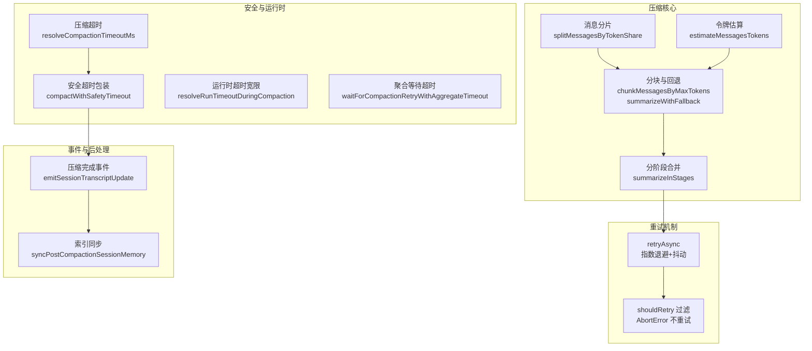
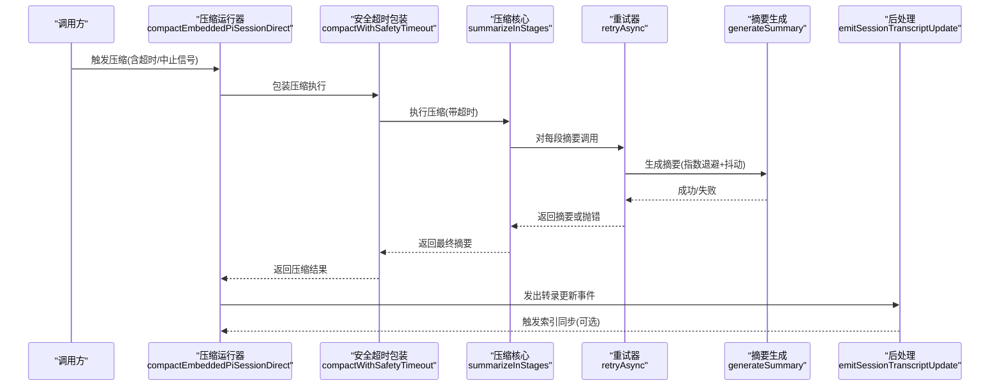
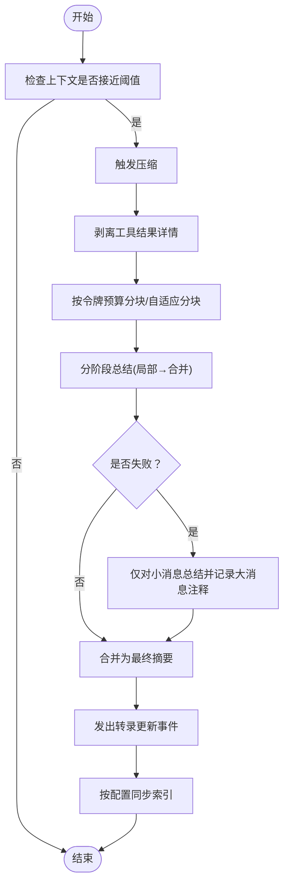
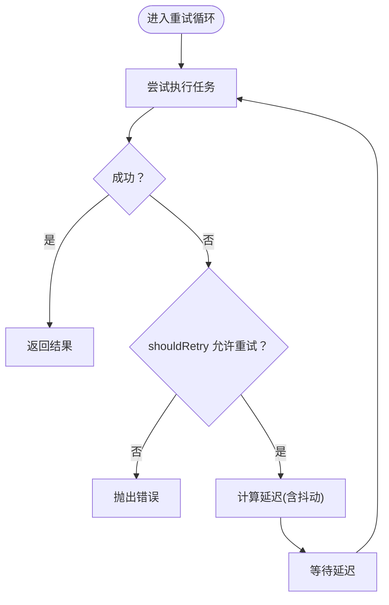
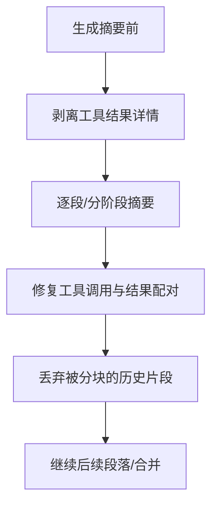
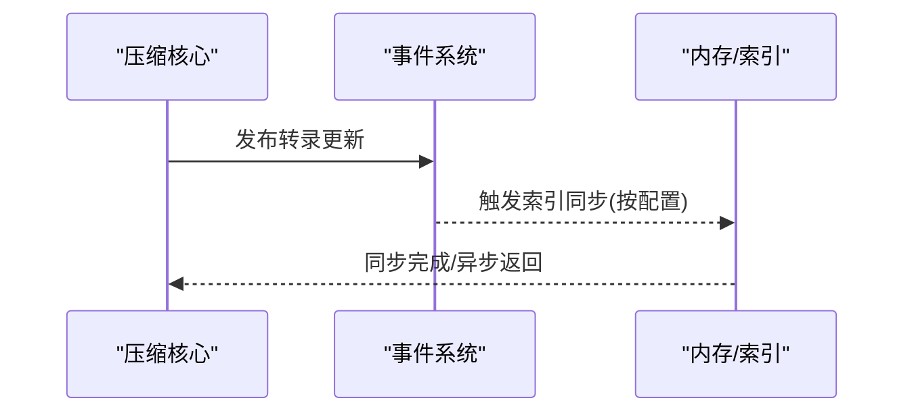
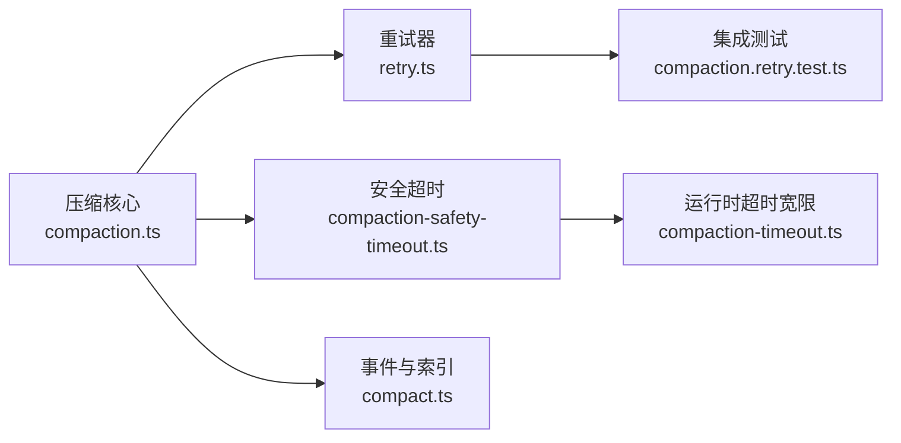

# 压缩与重试机制

<cite>
**本文引用的文件**
- [src/agents/compaction.ts](file://src/agents/compaction.ts)
- [src/infra/retry.ts](file://src/infra/retry.ts)
- [src/agents/pi-embedded-runner/compact.ts](file://src/agents/pi-embedded-runner/compact.ts)
- [src/agents/pi-embedded-runner/compaction-safety-timeout.ts](file://src/agents/pi-embedded-runner/compaction-safety-timeout.ts)
- [src/agents/pi-embedded-runner/run/compaction-timeout.ts](file://src/agents/pi-embedded-runner/run/compaction-timeout.ts)
- [src/agents/pi-embedded-runner/run/compaction-retry-aggregate-timeout.ts](file://src/agents/pi-embedded-runner/run/compaction-retry-aggregate-timeout.ts)
- [src/agents/compaction.retry.test.ts](file://src/agents/compaction.retry.test.ts)
- [docs/concepts/compaction.md](file://docs/concepts/compaction.md)
- [docs/concepts/retry.md](file://docs/concepts/retry.md)
- [src/auto-reply/reply/memory-flush.ts](file://src/auto-reply/reply/memory-flush.ts)
</cite>

## 目录
1. [简介](#简介)
2. [项目结构](#项目结构)
3. [核心组件](#核心组件)
4. [架构总览](#架构总览)
5. [详细组件分析](#详细组件分析)
6. [依赖关系分析](#依赖关系分析)
7. [性能考量](#性能考量)
8. [故障排查指南](#故障排查指南)
9. [结论](#结论)
10. [附录](#附录)

## 简介
本文件系统性阐述 OpenClaw 的“压缩（Compaction）与重试（Retry）”机制，覆盖以下主题：
- 自动压缩的触发条件与执行流程
- 压缩事件流与后处理（索引同步、侧效应）
- 重试循环中的错误分类、指数退避与抖动策略
- 内存缓冲区重置与工具摘要清理，避免重复输出的保护措施
- 压缩策略选择标准、重试次数限制与失败处理流程
- 压缩性能监控指标与重试策略调优建议

## 项目结构
围绕压缩与重试的关键模块分布如下：
- 压缩核心逻辑：消息分片、令牌估算、分阶段总结、回退策略
- 重试基础设施：统一的 retryAsync 实现，支持退避、抖动、可选的 retry-after
- 安全超时与运行时控制：压缩安全超时、运行时超时与宽限、聚合等待超时
- 事件与后处理：压缩完成后触发会话转录更新、索引同步等
- 配置与文档：压缩配置项、重试策略配置与行为说明

**图表来源**
- [src/agents/compaction.ts:89-175](file://src/agents/compaction.ts#L89-L175)
- [src/agents/compaction.ts:211-258](file://src/agents/compaction.ts#L211-L258)
- [src/agents/compaction.ts:264-331](file://src/agents/compaction.ts#L264-L331)
- [src/agents/compaction.ts:333-396](file://src/agents/compaction.ts#L333-L396)
- [src/infra/retry.ts:70-136](file://src/infra/retry.ts#L70-L136)
- [src/agents/pi-embedded-runner/compaction-safety-timeout.ts:18-24](file://src/agents/pi-embedded-runner/compaction-safety-timeout.ts#L18-L24)
- [src/agents/pi-embedded-runner/compaction-safety-timeout.ts:26-93](file://src/agents/pi-embedded-runner/compaction-safety-timeout.ts#L26-L93)
- [src/agents/pi-embedded-runner/run/compaction-timeout.ts:16-32](file://src/agents/pi-embedded-runner/run/compaction-timeout.ts#L16-L32)
- [src/agents/pi-embedded-runner/run/compaction-retry-aggregate-timeout.ts:5-51](file://src/agents/pi-embedded-runner/run/compaction-retry-aggregate-timeout.ts#L5-L51)
- [src/agents/pi-embedded-runner/compact.ts:350-366](file://src/agents/pi-embedded-runner/compact.ts#L350-L366)

**章节来源**
- [src/agents/compaction.ts:1-465](file://src/agents/compaction.ts#L1-L465)
- [src/infra/retry.ts:1-137](file://src/infra/retry.ts#L1-L137)
- [src/agents/pi-embedded-runner/compaction-safety-timeout.ts:1-94](file://src/agents/pi-embedded-runner/compaction-safety-timeout.ts#L1-L94)
- [src/agents/pi-embedded-runner/run/compaction-timeout.ts:1-73](file://src/agents/pi-embedded-runner/run/compaction-timeout.ts#L1-L73)
- [src/agents/pi-embedded-runner/run/compaction-retry-aggregate-timeout.ts:1-52](file://src/agents/pi-embedded-runner/run/compaction-retry-aggregate-timeout.ts#L1-L52)
- [src/agents/pi-embedded-runner/compact.ts:350-366](file://src/agents/pi-embedded-runner/compact.ts#L350-L366)

## 核心组件
- 压缩算法与策略
  - 消息分片与令牌预算：按目标令牌数切分，应用安全系数补偿估算误差；支持自适应分块比例以适配大消息场景。
  - 分阶段总结：多段消息先局部总结，再合并总结，确保长历史可控。
  - 回退策略：当整体或部分总结失败时，采用“仅小消息总结+大消息注释”或“直接说明不可总结”的最终回退。
  - 工具结果细节剥离：在生成摘要前移除工具结果详情，避免泄露敏感或冗余内容。
- 重试机制
  - 统一重试器：指数退避、抖动、最大延迟上限、可选 retry-after；支持自定义 shouldRetry 过滤器。
  - 默认策略：尝试次数、最小/最大延迟、抖动比例；针对不同提供商可覆盖默认值。
- 安全与运行时控制
  - 压缩超时解析：从配置解析压缩超时，否则使用内置默认值。
  - 安全超时包装：对压缩过程进行竞态超时与外部中止信号处理，保证不会无限阻塞。
  - 运行时超时宽限：在压缩进行时延长运行超时，避免误判中断。
  - 聚合等待超时：等待压缩重试完成，防止长时间占用会话通道。

**章节来源**
- [src/agents/compaction.ts:89-175](file://src/agents/compaction.ts#L89-L175)
- [src/agents/compaction.ts:211-331](file://src/agents/compaction.ts#L211-L331)
- [src/infra/retry.ts:45-136](file://src/infra/retry.ts#L45-L136)
- [src/agents/pi-embedded-runner/compaction-safety-timeout.ts:18-93](file://src/agents/pi-embedded-runner/compaction-safety-timeout.ts#L18-L93)
- [src/agents/pi-embedded-runner/run/compaction-timeout.ts:16-32](file://src/agents/pi-embedded-runner/run/compaction-timeout.ts#L16-L32)
- [src/agents/pi-embedded-runner/run/compaction-retry-aggregate-timeout.ts:5-51](file://src/agents/pi-embedded-runner/run/compaction-retry-aggregate-timeout.ts#L5-L51)

## 架构总览
下图展示压缩与重试在运行时的整体交互：压缩入口负责加载模型与工具、打开会话、执行压缩；重试用于摘要生成；安全超时与运行时宽限保障稳定性；完成后触发事件与索引同步。

**图表来源**
- [src/agents/pi-embedded-runner/compact.ts:372-800](file://src/agents/pi-embedded-runner/compact.ts#L372-L800)
- [src/agents/pi-embedded-runner/compaction-safety-timeout.ts:26-93](file://src/agents/pi-embedded-runner/compaction-safety-timeout.ts#L26-L93)
- [src/agents/compaction.ts:211-258](file://src/agents/compaction.ts#L211-L258)
- [src/infra/retry.ts:70-136](file://src/infra/retry.ts#L70-L136)
- [src/agents/pi-embedded-runner/compact.ts:350-366](file://src/agents/pi-embedded-runner/compact.ts#L350-L366)

## 详细组件分析

### 压缩策略与触发条件
- 触发条件
  - 上游请求在计算上下文时发现接近或超过模型上下文窗口阈值，自动触发压缩。
  - 可通过命令强制触发压缩，或在会话转录过大时进行预压缩内存冲刷。
- 策略要点
  - 使用安全系数降低令牌估算误差导致的越界风险。
  - 大消息识别与回退：若单条消息过大则跳过其摘要并记录注释。
  - 分阶段合并：先局部总结再合并，兼顾准确性与成本。
  - 工具结果细节剥离：避免将冗长或敏感的工具结果详情送入摘要生成。
- 事件流
  - 压缩完成后发出会话转录更新事件，并根据配置决定是否同步索引。

**图表来源**
- [src/agents/compaction.ts:135-175](file://src/agents/compaction.ts#L135-L175)
- [src/agents/compaction.ts:181-200](file://src/agents/compaction.ts#L181-L200)
- [src/agents/compaction.ts:264-331](file://src/agents/compaction.ts#L264-L331)
- [src/agents/compaction.ts:333-396](file://src/agents/compaction.ts#L333-L396)
- [src/agents/pi-embedded-runner/compact.ts:350-366](file://src/agents/pi-embedded-runner/compact.ts#L350-L366)

**章节来源**
- [src/agents/compaction.ts:1-465](file://src/agents/compaction.ts#L1-L465)
- [docs/concepts/compaction.md:57-68](file://docs/concepts/compaction.md#L57-L68)
- [src/auto-reply/reply/memory-flush.ts:92-103](file://src/auto-reply/reply/memory-flush.ts#L92-L103)

### 重试循环与错误处理
- 重试器特性
  - 指数退避：每次重试延迟翻倍，上限受最大延迟限制。
  - 抖动：引入随机抖动，避免多个请求同时重试造成级联。
  - retry-after：优先使用服务端返回的 retry-after 延迟。
  - 过滤器：可通过 shouldRetry 自定义重试条件，默认不重试用户主动取消（AbortError）。
- 压缩中的重试
  - 摘要生成在每一段上执行重试，失败时记录警告并继续后续段落。
  - 最终回退：若所有尝试失败，返回可理解的说明文本，避免空摘要。
- 测试验证
  - 单测覆盖成功、瞬时失败重试成功、AbortError 不重试、达到最大尝试次数失败、指数退避时序等场景。

**图表来源**
- [src/infra/retry.ts:70-136](file://src/infra/retry.ts#L70-L136)
- [src/agents/compaction.ts:235-254](file://src/agents/compaction.ts#L235-L254)
- [src/agents/compaction.retry.test.ts:19-159](file://src/agents/compaction.retry.test.ts#L19-L159)

**章节来源**
- [src/infra/retry.ts:1-137](file://src/infra/retry.ts#L1-L137)
- [src/agents/compaction.ts:235-254](file://src/agents/compaction.ts#L235-L254)
- [src/agents/compaction.retry.test.ts:1-160](file://src/agents/compaction.retry.test.ts#L1-L160)
- [docs/concepts/retry.md:11-25](file://docs/concepts/retry.md#L11-L25)

### 内存缓冲区重置与工具摘要清理
- 工具摘要清理
  - 在生成摘要前，剥离工具结果详情，避免将冗长或敏感内容参与摘要生成，减少令牌消耗与泄露风险。
- 内存缓冲区重置
  - 压缩过程中，对会话历史进行修复与分块丢弃，确保剩余消息保持工具调用与结果的正确配对，防止后续请求出现“意外的工具调用 ID”等错误。
- 重复输出保护
  - 通过“仅小消息总结+大消息注释”的回退策略，避免因单条超大消息导致的摘要缺失引发重复或不一致输出。

**图表来源**
- [src/agents/compaction.ts:226-228](file://src/agents/compaction.ts#L226-L228)
- [src/agents/compaction.ts:430-449](file://src/agents/compaction.ts#L430-L449)
- [src/agents/compaction.ts:293-331](file://src/agents/compaction.ts#L293-L331)

**章节来源**
- [src/agents/compaction.ts:226-228](file://src/agents/compaction.ts#L226-L228)
- [src/agents/compaction.ts:430-449](file://src/agents/compaction.ts#L430-L449)
- [src/agents/compaction.ts:293-331](file://src/agents/compaction.ts#L293-L331)

### 压缩事件流与后处理
- 事件发布
  - 压缩完成后，向系统发布会话转录更新事件，通知监听者刷新视图或缓存。
- 索引同步
  - 根据配置决定是否异步或等待同步索引，确保压缩后的会话数据可被检索。
- 运行时超时宽限
  - 若压缩进行中，运行时超时会被延长，避免误判中断正在进行的压缩。

**图表来源**
- [src/agents/pi-embedded-runner/compact.ts:350-366](file://src/agents/pi-embedded-runner/compact.ts#L350-L366)
- [src/agents/pi-embedded-runner/compact.ts:287-348](file://src/agents/pi-embedded-runner/compact.ts#L287-L348)
- [src/agents/pi-embedded-runner/run/compaction-timeout.ts:16-32](file://src/agents/pi-embedded-runner/run/compaction-timeout.ts#L16-L32)

**章节来源**
- [src/agents/pi-embedded-runner/compact.ts:350-366](file://src/agents/pi-embedded-runner/compact.ts#L350-L366)
- [src/agents/pi-embedded-runner/compact.ts:287-348](file://src/agents/pi-embedded-runner/compact.ts#L287-L348)
- [src/agents/pi-embedded-runner/run/compaction-timeout.ts:16-32](file://src/agents/pi-embedded-runner/run/compaction-timeout.ts#L16-L32)

### 重试次数限制与失败处理
- 重试次数
  - 摘要生成默认最多尝试若干次（具体数值见压缩实现），超过则抛出最后一次错误。
- 失败处理
  - 用户主动取消（AbortError）不重试，立即终止。
  - 服务端返回 retry-after 时优先使用该值作为延迟。
  - 最终回退策略：若摘要不可得，返回可理解的说明文本，避免空摘要导致后续流程异常。

**章节来源**
- [src/agents/compaction.ts:246-254](file://src/agents/compaction.ts#L246-L254)
- [src/infra/retry.ts:115-131](file://src/infra/retry.ts#L115-L131)
- [src/agents/compaction.retry.test.ts:95-128](file://src/agents/compaction.retry.test.ts#L95-L128)

## 依赖关系分析
- 压缩核心依赖
  - 令牌估算与摘要生成：依赖外部编码代理库提供的估计与生成函数。
  - 重试器：在摘要生成环节使用统一重试机制。
- 运行时安全
  - 安全超时包装与运行时超时宽限共同作用，避免压缩阻塞或误判。
  - 聚合等待超时用于防止压缩重试挂起导致的通道占用。
- 事件与索引
  - 压缩完成后触发事件，索引同步由配置驱动。

**图表来源**
- [src/agents/compaction.ts:235-258](file://src/agents/compaction.ts#L235-L258)
- [src/infra/retry.ts:70-136](file://src/infra/retry.ts#L70-L136)
- [src/agents/pi-embedded-runner/compaction-safety-timeout.ts:26-93](file://src/agents/pi-embedded-runner/compaction-safety-timeout.ts#L26-L93)
- [src/agents/pi-embedded-runner/run/compaction-timeout.ts:16-32](file://src/agents/pi-embedded-runner/run/compaction-timeout.ts#L16-L32)
- [src/agents/pi-embedded-runner/compact.ts:350-366](file://src/agents/pi-embedded-runner/compact.ts#L350-L366)
- [src/agents/compaction.retry.test.ts:19-159](file://src/agents/compaction.retry.test.ts#L19-L159)

**章节来源**
- [src/agents/compaction.ts:1-465](file://src/agents/compaction.ts#L1-L465)
- [src/infra/retry.ts:1-137](file://src/infra/retry.ts#L1-L137)
- [src/agents/pi-embedded-runner/compaction-safety-timeout.ts:1-94](file://src/agents/pi-embedded-runner/compaction-safety-timeout.ts#L1-L94)
- [src/agents/pi-embedded-runner/run/compaction-timeout.ts:1-73](file://src/agents/pi-embedded-runner/run/compaction-timeout.ts#L1-L73)
- [src/agents/pi-embedded-runner/compact.ts:350-366](file://src/agents/pi-embedded-runner/compact.ts#L350-L366)
- [src/agents/compaction.retry.test.ts:1-160](file://src/agents/compaction.retry.test.ts#L1-L160)

## 性能考量
- 令牌估算误差补偿
  - 通过安全系数降低估算不足带来的越界风险，减少不必要的回退与重试。
- 分块与自适应比例
  - 针对大消息场景动态调整分块比例，平衡吞吐与安全性。
- 重试抖动与上限
  - 抖动避免并发重试风暴；最大延迟上限防止雪崩。
- 索引同步模式
  - 根据负载与一致性需求选择“异步/等待/关闭”，避免阻塞主流程。

[本节为通用指导，无需特定文件引用]

## 故障排查指南
- 常见问题与定位
  - 摘要生成失败：查看重试日志与最终回退说明；确认是否为单条超大消息导致。
  - 用户取消：AbortError 不重试，检查调用方中止信号来源。
  - 超时：确认压缩超时配置与运行时宽限设置；必要时延长超时或优化分块策略。
  - 重复输出：确认工具结果详情已被剥离；检查分块丢弃与配对修复是否生效。
- 关键检查点
  - 令牌估算与分块：核对消息长度与令牌预算，确保安全系数合理。
  - 重试策略：确认 attempts、minDelayMs、maxDelayMs、jitter 设置；必要时启用 retry-after。
  - 事件与索引：确认压缩完成后事件已发布且索引同步按预期执行。

**章节来源**
- [src/agents/compaction.ts:286-331](file://src/agents/compaction.ts#L286-L331)
- [src/infra/retry.ts:115-131](file://src/infra/retry.ts#L115-L131)
- [src/agents/pi-embedded-runner/compaction-safety-timeout.ts:18-24](file://src/agents/pi-embedded-runner/compaction-safety-timeout.ts#L18-L24)
- [src/agents/pi-embedded-runner/compact.ts:350-366](file://src/agents/pi-embedded-runner/compact.ts#L350-L366)

## 结论
OpenClaw 的压缩与重试机制通过“安全估算+分阶段总结+回退策略+统一重试器+安全超时与运行时宽限”形成闭环，既保证长会话的上下文控制，又在失败与异常情况下提供稳健的恢复路径。结合事件与索引同步，系统在可用性与一致性之间取得平衡。建议在生产环境中根据模型规模与负载特征调优分块策略、重试参数与超时配置，并持续监控压缩与重试指标以优化体验。

[本节为总结性内容，无需特定文件引用]

## 附录
- 压缩配置参考
  - 支持指定压缩模型、摘要指令策略（严格/关闭/自定义）、摘要后索引同步模式等。
- 重试策略参考
  - 提供默认尝试次数、最小/最大延迟与抖动；可按提供商覆盖默认值。

**章节来源**
- [docs/concepts/compaction.md:22-56](file://docs/concepts/compaction.md#L22-L56)
- [docs/concepts/retry.md:17-64](file://docs/concepts/retry.md#L17-L64)