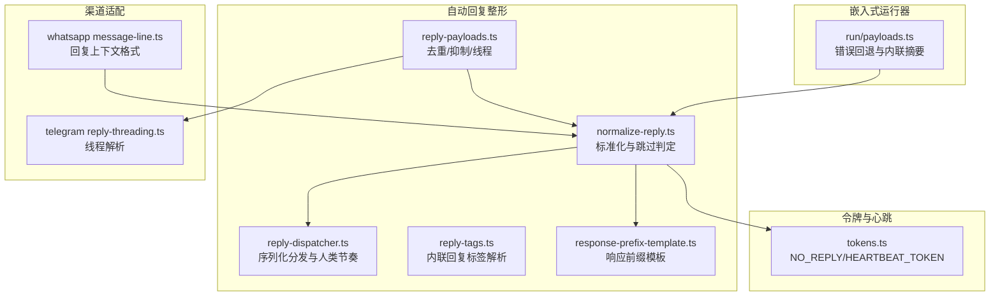
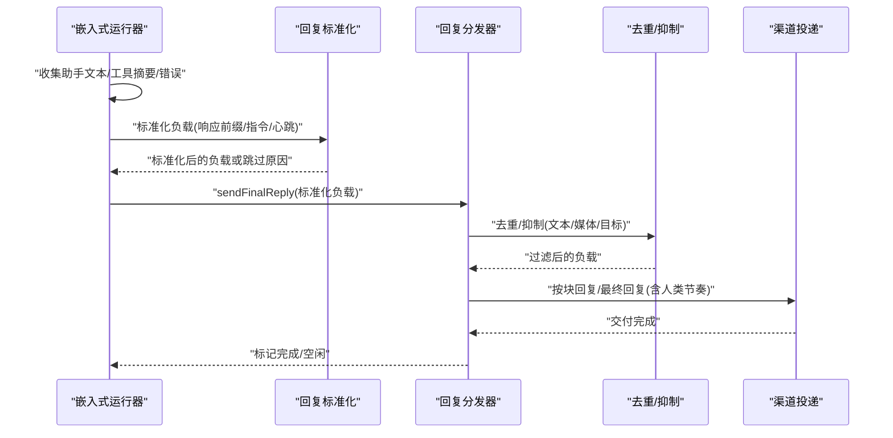
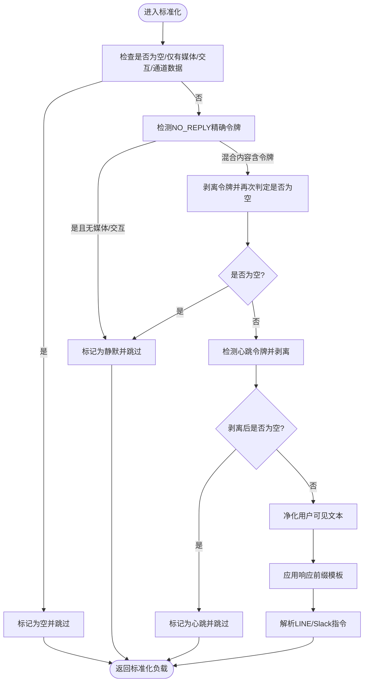
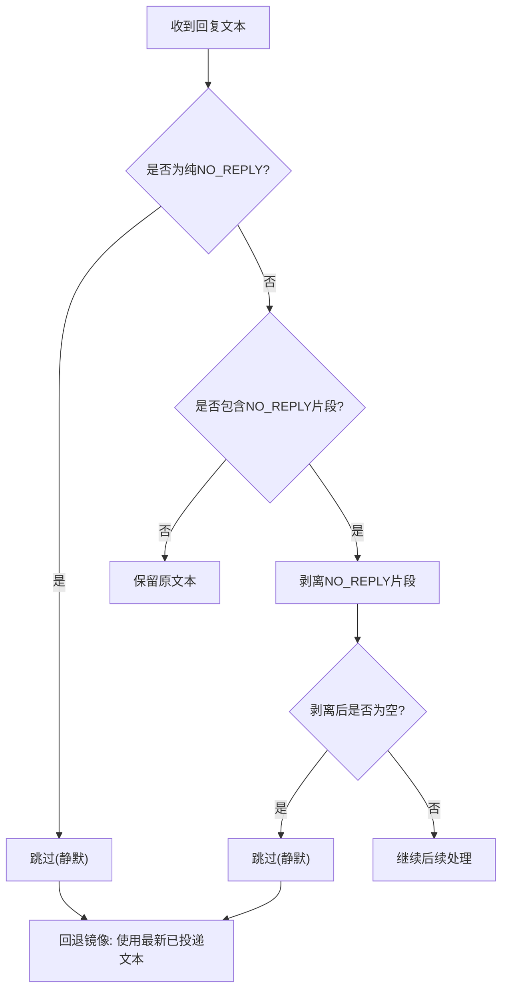
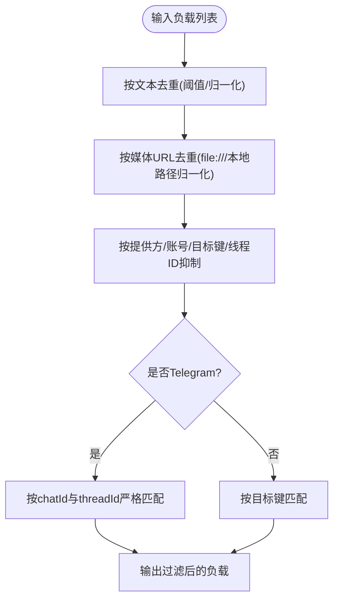
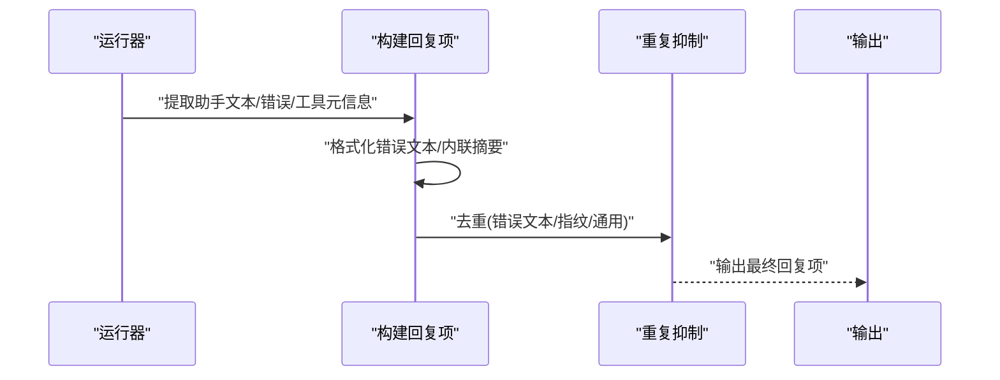
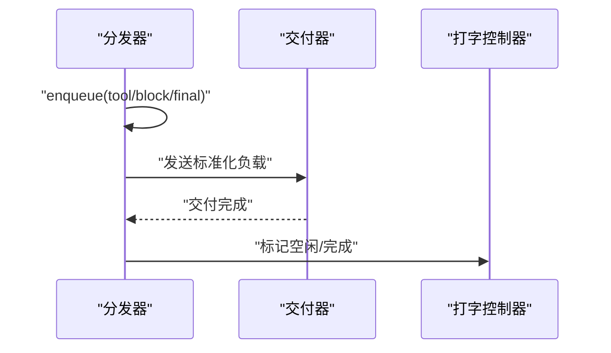
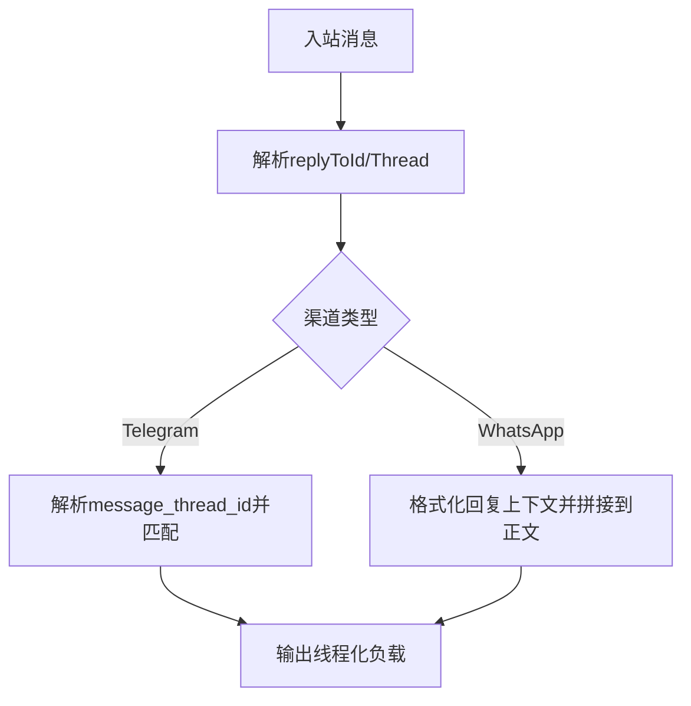
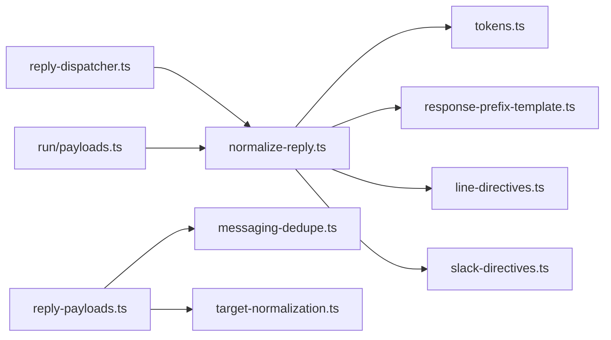

# 回复整形与抑制

<cite>
**本文引用的文件**
- [normalize-reply.ts](file://src/auto-reply/reply/normalize-reply.ts)
- [tokens.ts](file://src/auto-reply/tokens.ts)
- [reply-dispatcher.ts](file://src/auto-reply/reply/reply-dispatcher.ts)
- [reply-payloads.ts](file://src/auto-reply/reply/reply-payloads.ts)
- [messaging-dedupe.ts](file://src/agents/pi-embedded-helpers/messaging-dedupe.ts)
- [payloads.ts（嵌入式运行器）](file://src/agents/pi-embedded-runner/run/payloads.ts)
- [response-prefix-template.ts](file://src/auto-reply/reply/response-prefix-template.ts)
- [reply-tags.ts](file://src/auto-reply/reply/reply-tags.ts)
- [reply-threading.ts（Telegram）](file://extensions/telegram/src/bot/reply-threading.ts)
- [message-line.ts（WhatsApp 自动回复）](file://extensions/whatsapp/src/auto-reply/monitor/message-line.ts)
- [pi-embedded-subscribe.handlers.messages.test.ts](file://src/agents/pi-embedded-subscribe.handlers.messages.test.ts)
</cite>

## 目录
1. [引言](#引言)
2. [项目结构](#项目结构)
3. [核心组件](#核心组件)
4. [架构总览](#架构总览)
5. [详细组件分析](#详细组件分析)
6. [依赖关系分析](#依赖关系分析)
7. [性能考量](#性能考量)
8. [故障排查指南](#故障排查指南)
9. [结论](#结论)
10. [附录](#附录)

## 引言
本文件系统性阐述“回复整形与抑制”的设计与实现，覆盖以下关键主题：
- 最终回复包的组装流程：助手文本、内联工具摘要、助手错误文本的组合规则
- NO_REPLY 静默标记的处理机制：静默判定、混合内容剥离、回退策略
- 消息工具重复项的移除策略：文本去重、媒体去重、目标匹配抑制
- 工具错误的回退回复生成：错误文本规范化、重复错误抑制、通用错误兜底
- 回复策略的配置选项：响应前缀模板、人类节奏延迟、交互指令解析
- 输出过滤与质量控制：心跳令牌剥离、用户可见文本净化、空/静默/心跳跳过
- 调试方法与自定义策略实现指南

## 项目结构
围绕回复整形与抑制的关键模块分布于如下位置：
- 自动回复整形与分发：src/auto-reply/reply/*
- 静默令牌与心跳令牌：src/auto-reply/tokens.ts
- 响应前缀模板：src/auto-reply/reply/response-prefix-template.ts
- 去重与抑制：src/auto-reply/reply/reply-payloads.ts、src/agents/pi-embedded-helpers/messaging-dedupe.ts
- 嵌入式运行器的回复构建与错误回退：src/agents/pi-embedded-runner/run/payloads.ts
- 渠道特定线程与上下文：extensions/telegram/src/bot/reply-threading.ts、extensions/whatsapp/src/auto-reply/monitor/message-line.ts

**图表来源**
- [normalize-reply.ts:1-118](file://src/auto-reply/reply/normalize-reply.ts#L1-L118)
- [reply-dispatcher.ts:1-254](file://src/auto-reply/reply/reply-dispatcher.ts#L1-L254)
- [reply-payloads.ts:1-279](file://src/auto-reply/reply/reply-payloads.ts#L1-L279)
- [tokens.ts:1-89](file://src/auto-reply/tokens.ts#L1-L89)
- [payloads.ts（嵌入式运行器）:128-244](file://src/agents/pi-embedded-runner/run/payloads.ts#L128-L244)
- [response-prefix-template.ts:1-102](file://src/auto-reply/reply/response-prefix-template.ts#L1-L102)
- [reply-tags.ts:1-23](file://src/auto-reply/reply/reply-tags.ts#L1-L23)
- [reply-threading.ts（Telegram）:1-33](file://extensions/telegram/src/bot/reply-threading.ts#L1-L33)
- [message-line.ts（WhatsApp）:1-33](file://extensions/whatsapp/src/auto-reply/monitor/message-line.ts#L1-L33)

**章节来源**
- [normalize-reply.ts:1-118](file://src/auto-reply/reply/normalize-reply.ts#L1-L118)
- [reply-dispatcher.ts:1-254](file://src/auto-reply/reply/reply-dispatcher.ts#L1-L254)
- [reply-payloads.ts:1-279](file://src/auto-reply/reply/reply-payloads.ts#L1-L279)
- [tokens.ts:1-89](file://src/auto-reply/tokens.ts#L1-L89)
- [payloads.ts（嵌入式运行器）:128-244](file://src/agents/pi-embedded-runner/run/payloads.ts#L128-L244)
- [response-prefix-template.ts:1-102](file://src/auto-reply/reply/response-prefix-template.ts#L1-L102)
- [reply-tags.ts:1-23](file://src/auto-reply/reply/reply-tags.ts#L1-L23)
- [reply-threading.ts（Telegram）:1-33](file://extensions/telegram/src/bot/reply-threading.ts#L1-L33)
- [message-line.ts（WhatsApp）:1-33](file://extensions/whatsapp/src/auto-reply/monitor/message-line.ts#L1-L33)

## 核心组件
- 回复标准化与跳过判定：负责去除静默令牌、剥离心跳令牌、应用响应前缀、解析行内/Slack指令、空/静默/心跳跳过
- 回复分发器：串行化发送工具结果、块状回复与最终回复，支持人类节奏延迟与打字状态联动
- 去重与抑制：按文本与媒体去重，按目标与线程抑制重复消息，避免跨渠道/账号重复投递
- 令牌与心跳：严格匹配 NO_REPLY 精确令牌，安全剥离混合内容中的静默令牌；心跳令牌剥离后可决定跳过
- 响应前缀模板：基于上下文变量动态插入模型、提供商、思考级别等信息
- 嵌入式运行器：在工具错误时生成错误文本与内联摘要，并进行重复抑制与通用兜底

**章节来源**
- [normalize-reply.ts:1-118](file://src/auto-reply/reply/normalize-reply.ts#L1-L118)
- [reply-dispatcher.ts:1-254](file://src/auto-reply/reply/reply-dispatcher.ts#L1-L254)
- [reply-payloads.ts:1-279](file://src/auto-reply/reply/reply-payloads.ts#L1-L279)
- [tokens.ts:1-89](file://src/auto-reply/tokens.ts#L1-L89)
- [response-prefix-template.ts:1-102](file://src/auto-reply/reply/response-prefix-template.ts#L1-L102)
- [payloads.ts（嵌入式运行器）:128-244](file://src/agents/pi-embedded-runner/run/payloads.ts#L128-L244)

## 架构总览
下图展示从“运行器生成回复”到“渠道投递”的关键路径，包括静默令牌处理、去重与抑制、人类节奏延迟与线程解析。

**图表来源**
- [payloads.ts（嵌入式运行器）:128-244](file://src/agents/pi-embedded-runner/run/payloads.ts#L128-L244)
- [normalize-reply.ts:1-118](file://src/auto-reply/reply/normalize-reply.ts#L1-L118)
- [reply-dispatcher.ts:1-254](file://src/auto-reply/reply/reply-dispatcher.ts#L1-L254)
- [reply-payloads.ts:1-279](file://src/auto-reply/reply/reply-payloads.ts#L1-L279)

## 详细组件分析

### 组件A：回复标准化与静默令牌处理
- 精确静默判定：仅当文本为纯 NO_REPLY（可带空白）时才视为静默，否则剥离混合内容中的令牌
- 心跳令牌剥离：剥离 HEARTBEAT_OK 后若仍为空则跳过
- 用户可见净化：对错误类文本进行净化，避免泄露内部细节
- 响应前缀注入：根据上下文模板变量动态拼接前缀
- 指令解析：解析 LINE/Slack 内联指令，增强交互能力

**图表来源**
- [normalize-reply.ts:1-118](file://src/auto-reply/reply/normalize-reply.ts#L1-L118)
- [tokens.ts:1-89](file://src/auto-reply/tokens.ts#L1-L89)
- [response-prefix-template.ts:1-102](file://src/auto-reply/reply/response-prefix-template.ts#L1-L102)

**章节来源**
- [normalize-reply.ts:1-118](file://src/auto-reply/reply/normalize-reply.ts#L1-L118)
- [tokens.ts:1-89](file://src/auto-reply/tokens.ts#L1-L89)
- [response-prefix-template.ts:1-102](file://src/auto-reply/reply/response-prefix-template.ts#L1-L102)

### 组件B：NO_REPLY 静默标记与回退策略
- 纯令牌静默：仅当文本为 NO_REPLY 时跳过
- 混合内容静默：剥离 NO_REPLY 后若为空则跳过
- 回退镜像策略：当回复为 NO_REPLY 且存在已投递的消息文本时，使用最新一条消息作为回退内容
- 渠道侧保护：部分渠道在 API 调用前对 NO_REPLY 进行显式抑制

**图表来源**
- [tokens.ts:1-89](file://src/auto-reply/tokens.ts#L1-L89)
- [pi-embedded-subscribe.handlers.messages.test.ts:1-31](file://src/agents/pi-embedded-subscribe.handlers.messages.test.ts#L1-L31)

**章节来源**
- [tokens.ts:1-89](file://src/auto-reply/tokens.ts#L1-L89)
- [pi-embedded-subscribe.handlers.messages.test.ts:1-31](file://src/agents/pi-embedded-subscribe.handlers.messages.test.ts#L1-L31)

### 组件C：消息工具重复项与目标抑制
- 文本去重：对发送过的文本集合进行归一化比较，忽略长度小于阈值的内容
- 媒体去重：对 file:// 与本地路径进行等价归一化，剔除完全匹配的媒体
- 目标与线程抑制：按提供方/账号/目标键/线程ID进行匹配，避免重复投递
- Telegram 特例：按 chatId 与 message_thread_id 进行严格匹配

**图表来源**
- [reply-payloads.ts:1-279](file://src/auto-reply/reply/reply-payloads.ts#L1-L279)
- [messaging-dedupe.ts:1-47](file://src/agents/pi-embedded-helpers/messaging-dedupe.ts#L1-L47)

**章节来源**
- [reply-payloads.ts:1-279](file://src/auto-reply/reply/reply-payloads.ts#L1-L279)
- [messaging-dedupe.ts:1-47](file://src/agents/pi-embedded-helpers/messaging-dedupe.ts#L1-L47)

### 组件D：工具错误回退与内联摘要
- 错误文本生成：根据最后助手消息的错误信息生成用户友好文本
- 重复错误抑制：对与已有错误文本/指纹一致的内容进行抑制
- 内联工具摘要：在允许的情况下聚合工具元信息，解析回复指令
- 通用错误兜底：当无法解析具体错误时，使用通用提示

**图表来源**
- [payloads.ts（嵌入式运行器）:128-244](file://src/agents/pi-embedded-runner/run/payloads.ts#L128-L244)

**章节来源**
- [payloads.ts（嵌入式运行器）:128-244](file://src/agents/pi-embedded-runner/run/payloads.ts#L128-L244)

### 组件E：回复分发与人类节奏
- 序列化发送：保证工具结果、块状回复、最终回复的顺序一致性
- 人类节奏延迟：在首次块回复之后，按配置范围随机延时，模拟自然节奏
- 打字状态联动：与打字控制器协作，在 NO_REPLY 或结束时清理资源

**图表来源**
- [reply-dispatcher.ts:1-254](file://src/auto-reply/reply/reply-dispatcher.ts#L1-L254)

**章节来源**
- [reply-dispatcher.ts:1-254](file://src/auto-reply/reply/reply-dispatcher.ts#L1-L254)

### 组件F：线程与上下文（渠道适配）
- Telegram 线程：解析隐式/显式回复目标，支持 message_thread_id 匹配
- WhatsApp 上下文：在入站消息中追加“回复到...”上下文，便于自动回复路由

**图表来源**
- [reply-threading.ts（Telegram）:1-33](file://extensions/telegram/src/bot/reply-threading.ts#L1-L33)
- [message-line.ts（WhatsApp）:1-33](file://extensions/whatsapp/src/auto-reply/monitor/message-line.ts#L1-L33)

**章节来源**
- [reply-threading.ts（Telegram）:1-33](file://extensions/telegram/src/bot/reply-threading.ts#L1-L33)
- [message-line.ts（WhatsApp）:1-33](file://extensions/whatsapp/src/auto-reply/monitor/message-line.ts#L1-L33)

## 依赖关系分析
- normalize-reply.ts 依赖 tokens.ts（令牌判定）、response-prefix-template.ts（前缀模板）、line-directives.ts（行内指令）、slack-directives.ts（Slack指令）
- reply-dispatcher.ts 依赖 normalize-reply.ts（标准化）、typing 控制器（打字联动）
- reply-payloads.ts 依赖 messaging-dedupe.ts（文本去重）、target-normalization.ts（目标归一化）、channel-id 归一化
- payloads.ts（嵌入式运行器）依赖 normalize-text（错误文本归一化）、parseReplyDirectives（内联指令解析）

**图表来源**
- [normalize-reply.ts:1-118](file://src/auto-reply/reply/normalize-reply.ts#L1-L118)
- [tokens.ts:1-89](file://src/auto-reply/tokens.ts#L1-L89)
- [response-prefix-template.ts:1-102](file://src/auto-reply/reply/response-prefix-template.ts#L1-L102)
- [reply-dispatcher.ts:1-254](file://src/auto-reply/reply/reply-dispatcher.ts#L1-L254)
- [reply-payloads.ts:1-279](file://src/auto-reply/reply/reply-payloads.ts#L1-L279)
- [messaging-dedupe.ts:1-47](file://src/agents/pi-embedded-helpers/messaging-dedupe.ts#L1-L47)
- [payloads.ts（嵌入式运行器）:128-244](file://src/agents/pi-embedded-runner/run/payloads.ts#L128-L244)

**章节来源**
- [normalize-reply.ts:1-118](file://src/auto-reply/reply/normalize-reply.ts#L1-L118)
- [tokens.ts:1-89](file://src/auto-reply/tokens.ts#L1-L89)
- [response-prefix-template.ts:1-102](file://src/auto-reply/reply/response-prefix-template.ts#L1-L102)
- [reply-dispatcher.ts:1-254](file://src/auto-reply/reply/reply-dispatcher.ts#L1-L254)
- [reply-payloads.ts:1-279](file://src/auto-reply/reply/reply-payloads.ts#L1-L279)
- [messaging-dedupe.ts:1-47](file://src/agents/pi-embedded-helpers/messaging-dedupe.ts#L1-L47)
- [payloads.ts（嵌入式运行器）:128-244](file://src/agents/pi-embedded-runner/run/payloads.ts#L128-L244)

## 性能考量
- 串行化与节流：分发器通过链式 Promise 串行发送，避免并发冲突；人类节奏延迟以随机范围降低突发性
- 去重成本：文本去重采用归一化与阈值过滤，媒体去重对 file:// 与本地路径做一次 URL 解析与路径解码，整体复杂度可控
- 跳过判定：在早期阶段快速跳过空/静默/心跳内容，减少下游开销
- 模板渲染：响应前缀模板按需解析，未使用变量时直接短路

[本节为通用性能讨论，不直接分析具体文件]

## 故障排查指南
- NO_REPLY 未生效
  - 检查文本是否为纯令牌（仅空白与 NO_REPLY），或是否被剥离后变为空
  - 确认渠道侧是否对 NO_REPLY 进行了显式抑制
  - 参考测试用例验证行为
- 重复消息
  - 核对 sentTexts/sentMediaUrls 是否正确传入去重逻辑
  - 对比目标键与线程 ID 是否匹配（Telegram 需要 message_thread_id）
- 心跳令牌残留
  - 确认是否启用了心跳剥离，以及剥离后是否为空
- 响应前缀未生效
  - 检查上下文变量是否提供，模板变量是否正确
- 人类节奏异常
  - 检查 humanDelay 配置范围，确认仅在第二次块回复后生效

**章节来源**
- [normalize-reply.ts:1-118](file://src/auto-reply/reply/normalize-reply.ts#L1-L118)
- [tokens.ts:1-89](file://src/auto-reply/tokens.ts#L1-L89)
- [reply-dispatcher.ts:1-254](file://src/auto-reply/reply/reply-dispatcher.ts#L1-L254)
- [reply-payloads.ts:1-279](file://src/auto-reply/reply/reply-payloads.ts#L1-L279)
- [pi-embedded-subscribe.handlers.messages.test.ts:1-31](file://src/agents/pi-embedded-subscribe.handlers.messages.test.ts#L1-L31)

## 结论
本体系通过“标准化—去重—分发—抑制”的闭环，确保最终回复既符合用户期望又避免重复与噪音。NO_REPLY 的严格判定与回退镜像策略提升了静默场景的可控性；工具错误的回退与内联摘要增强了可观测性与可用性；响应前缀模板与人类节奏进一步提升了体验一致性。建议在生产中结合渠道特性启用相应抑制与去重策略，并通过测试用例持续验证行为。

[本节为总结性内容，不直接分析具体文件]

## 附录

### 配置与策略清单
- 响应前缀模板
  - 变量：模型名、完整模型、提供商、思考级别、身份名称
  - 行为：大小写无关、未识别变量原样保留
- 人类节奏延迟
  - 默认模式：固定范围；自定义模式：可配置最小/最大毫秒数
- 交互指令
  - LINE/Slack 指令解析：在文本中识别并转换为交互块
- 去重与抑制
  - 文本去重：最小长度阈值、归一化（大小写/空白/表情）
  - 媒体去重：file:// 与本地路径等价归一化
  - 目标抑制：提供方/账号/目标键/线程 ID 匹配（Telegram 严格匹配）

**章节来源**
- [response-prefix-template.ts:1-102](file://src/auto-reply/reply/response-prefix-template.ts#L1-L102)
- [reply-dispatcher.ts:1-254](file://src/auto-reply/reply/reply-dispatcher.ts#L1-L254)
- [reply-payloads.ts:1-279](file://src/auto-reply/reply/reply-payloads.ts#L1-L279)
- [messaging-dedupe.ts:1-47](file://src/agents/pi-embedded-helpers/messaging-dedupe.ts#L1-L47)