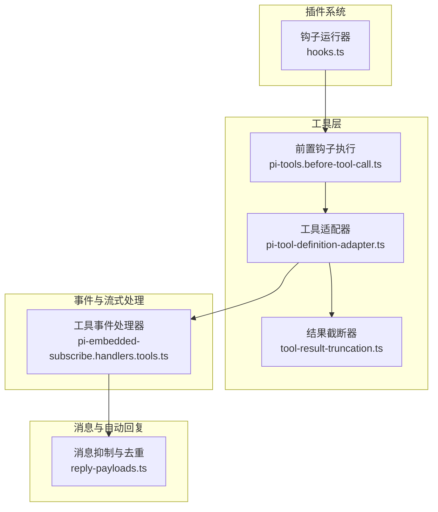
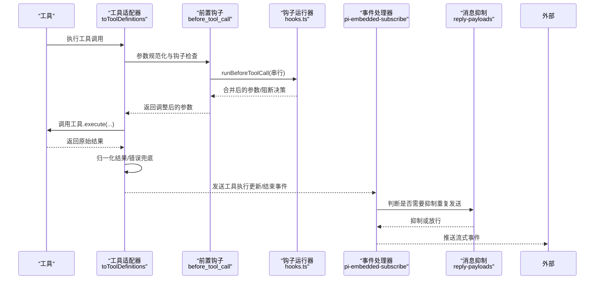
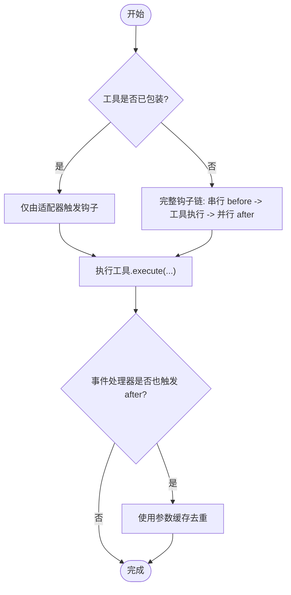
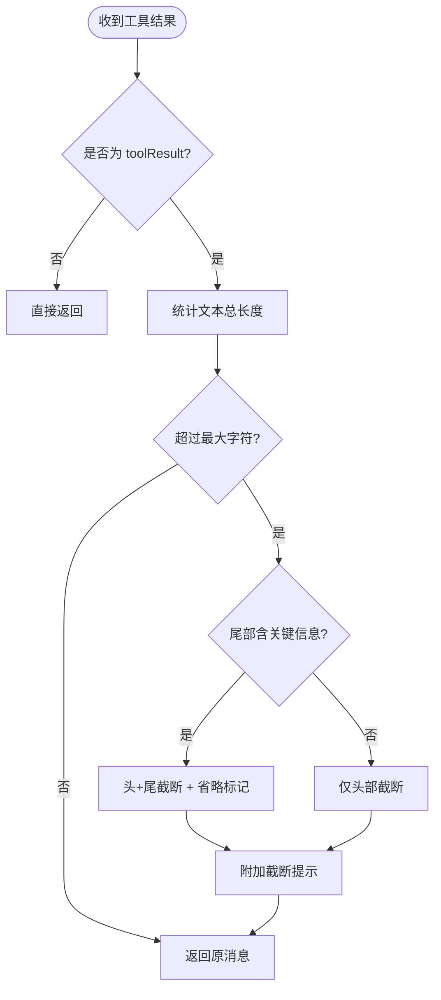
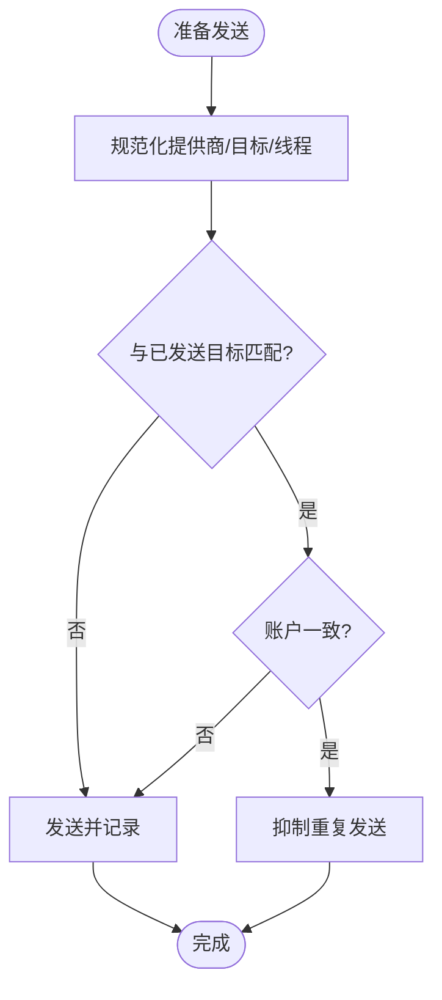
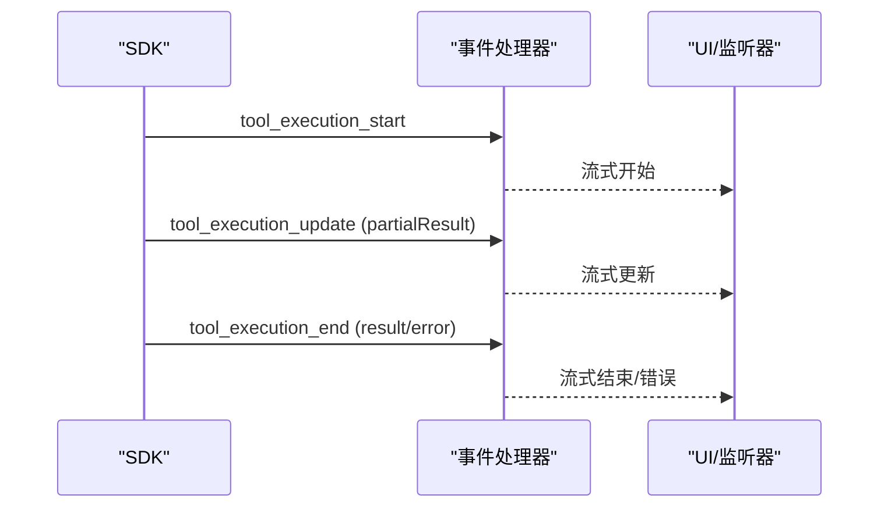
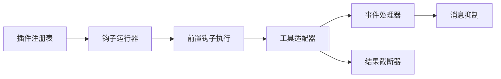

# 工具执行与消息传递

<cite>
**本文引用的文件**
- [hooks.ts](file://src/plugins/hooks.ts)
- [pi-tools.before-tool-call.ts](file://src/agents/pi-tools.before-tool-call.ts)
- [pi-tool-definition-adapter.ts](file://src/agents/pi-tool-definition-adapter.ts)
- [tool-result-truncation.ts](file://src/agents/pi-embedded-runner/tool-result-truncation.ts)
- [reply-payloads.ts](file://src/auto-reply/reply/reply-payloads.ts)
- [pi-tool-definition-adapter.after-tool-call.fires-once.test.ts](file://src/agents/pi-tool-definition-adapter.after-tool-call.fires-once.test.ts)
- [pi-tools.before-tool-call.integration.e2e.test.ts](file://src/agents/pi-tools.before-tool-call.integration.e2e.test.ts)
- [pi-embedded-subscribe.handlers.tools.ts](file://src/agents/pi-embedded-subscribe.handlers.tools.ts)
- [tool-loop-detection.ts](file://src/agents/tool-loop-detection.ts)
</cite>

## 目录
1. [简介](#简介)
2. [项目结构](#项目结构)
3. [核心组件](#核心组件)
4. [架构总览](#架构总览)
5. [详细组件分析](#详细组件分析)
6. [依赖关系分析](#依赖关系分析)
7. [性能考量](#性能考量)
8. [故障排查指南](#故障排查指南)
9. [结论](#结论)
10. [附录](#附录)

## 简介
本文件系统性阐述 OpenClaw 中“工具执行与消息传递”的实现与最佳实践，重点覆盖以下主题：
- 工具调用生命周期：before_tool_call 与 after_tool_call 钩子的执行时机与去重策略
- 工具结果的清理与大小限制处理：文本截断、会话内持久化与预发送截断
- 消息工具的发送跟踪与重复确认抑制机制
- 工具执行的流式事件处理、错误传播与状态同步
- 工具开发的最佳实践与性能优化建议

## 项目结构
围绕工具执行与消息传递的关键模块如下：
- 插件钩子运行器：统一管理 before_tool_call、after_tool_call 等钩子的注册、顺序与并行执行
- 工具适配器：将工具封装为标准化定义，注入参数校验、结果归一化与错误兜底
- 结果截断器：按上下文窗口计算最大字符数，对工具结果进行安全截断
- 自动回复与消息抑制：对消息工具发送进行重复抑制与目标匹配
- 流式事件处理器：在嵌入式运行中推送工具执行更新与最终结果
- 循环检测：防止工具循环导致的资源浪费与死循环

图表来源
- [hooks.ts:630-660](file://src/plugins/hooks.ts#L630-L660)
- [pi-tools.before-tool-call.ts:91-194](file://src/agents/pi-tools.before-tool-call.ts#L91-L194)
- [pi-tool-definition-adapter.ts:137-194](file://src/agents/pi-tool-definition-adapter.ts#L137-L194)
- [tool-result-truncation.ts:206-331](file://src/agents/pi-embedded-runner/tool-result-truncation.ts#L206-L331)
- [reply-payloads.ts:236-278](file://src/auto-reply/reply/reply-payloads.ts#L236-L278)
- [pi-embedded-subscribe.handlers.tools.ts:390-420](file://src/agents/pi-embedded-subscribe.handlers.tools.ts#L390-L420)

章节来源
- [hooks.ts:630-660](file://src/plugins/hooks.ts#L630-L660)
- [pi-tools.before-tool-call.ts:91-194](file://src/agents/pi-tools.before-tool-call.ts#L91-L194)
- [pi-tool-definition-adapter.ts:137-194](file://src/agents/pi-tool-definition-adapter.ts#L137-L194)
- [tool-result-truncation.ts:206-331](file://src/agents/pi-embedded-runner/tool-result-truncation.ts#L206-L331)
- [reply-payloads.ts:236-278](file://src/auto-reply/reply/reply-payloads.ts#L236-L278)
- [pi-embedded-subscribe.handlers.tools.ts:390-420](file://src/agents/pi-embedded-subscribe.handlers.tools.ts#L390-L420)

## 核心组件
- 钩子运行器（before_tool_call / after_tool_call）
  - 前置钩子串行执行，支持参数修改与阻断；后置钩子并行触发，用于观测与副作用
  - 提供错误捕获与日志记录，避免钩子异常影响主流程
- 工具适配器
  - 将工具封装为标准化定义，负责参数规范化、结果归一化、错误兜底与流式更新
  - 在工具被包装时仅触发一次前置钩子，避免重复执行
- 结果截断器
  - 基于上下文窗口估算最大字符数，对工具结果进行头尾截断或头部截断
  - 支持会话内持久化前的预截断与运行期的实时截断
- 消息抑制与重复确认
  - 对消息工具的发送目标、账号与线程进行匹配，避免重复发送
  - 支持跨通道别名映射与线程 ID 规范化
- 流式事件处理
  - 在工具执行过程中推送 update 事件，最终推送 end 事件，确保 UI 与外部监听器及时感知

章节来源
- [hooks.ts:242-303](file://src/plugins/hooks.ts#L242-L303)
- [pi-tool-definition-adapter.ts:137-194](file://src/agents/pi-tool-definition-adapter.ts#L137-L194)
- [tool-result-truncation.ts:71-127](file://src/agents/pi-embedded-runner/tool-result-truncation.ts#L71-L127)
- [reply-payloads.ts:236-278](file://src/auto-reply/reply/reply-payloads.ts#L236-L278)
- [pi-embedded-subscribe.handlers.tools.ts:390-420](file://src/agents/pi-embedded-subscribe.handlers.tools.ts#L390-L420)

## 架构总览
下图展示从工具调用到消息传递的端到端路径，包括钩子、适配器、截断与事件处理：

图表来源
- [pi-tool-definition-adapter.ts:137-194](file://src/agents/pi-tool-definition-adapter.ts#L137-L194)
- [pi-tools.before-tool-call.ts:91-194](file://src/agents/pi-tools.before-tool-call.ts#L91-L194)
- [hooks.ts:630-660](file://src/plugins/hooks.ts#L630-L660)
- [pi-embedded-subscribe.handlers.tools.ts:390-420](file://src/agents/pi-embedded-subscribe.handlers.tools.ts#L390-L420)
- [reply-payloads.ts:236-278](file://src/auto-reply/reply/reply-payloads.ts#L236-L278)

## 详细组件分析

### 组件A：工具调用生命周期与钩子去重
- before_tool_call 钩子
  - 串行执行，按优先级合并参数与阻断决策
  - 支持非对象参数的规范化，保证钩子契约一致
  - 异常被捕获并记录，不影响工具执行
- after_tool_call 钩子
  - 并行触发（fire-and-forget），用于观测与副作用
  - 在适配器与事件处理器场景中，确保只触发一次，避免重复
- 去重策略
  - 工具被包装后，适配器不再重复触发钩子
  - 通过工具调用 ID 与运行 ID 的组合键隔离不同运行中的参数调整

图表来源
- [pi-tools.before-tool-call.ts:196-255](file://src/agents/pi-tools.before-tool-call.ts#L196-L255)
- [pi-tool-definition-adapter.ts:137-194](file://src/agents/pi-tool-definition-adapter.ts#L137-L194)
- [pi-tool-definition-adapter.after-tool-call.fires-once.test.ts:166-217](file://src/agents/pi-tool-definition-adapter.after-tool-call.fires-once.test.ts#L166-L217)

章节来源
- [hooks.ts:630-660](file://src/plugins/hooks.ts#L630-L660)
- [pi-tools.before-tool-call.ts:91-194](file://src/agents/pi-tools.before-tool-call.ts#L91-L194)
- [pi-tools.before-tool-call.integration.e2e.test.ts:199-244](file://src/agents/pi-tools.before-tool-call.integration.e2e.test.ts#L199-L244)
- [pi-tool-definition-adapter.after-tool-call.fires-once.test.ts:166-217](file://src/agents/pi-tool-definition-adapter.after-tool-call.fires-once.test.ts#L166-L217)

### 组件B：工具结果的清理与大小限制处理
- 截断策略
  - 头+尾策略：若尾部包含错误/JSON/摘要等关键信息，则保留头与尾，并插入省略标记
  - 默认策略：仅保留开头，尽量在换行处截断，确保可读性
- 上下文窗口与硬上限
  - 最大占用上下文窗口的 30%，并以每 token 约 4 字符保守估算
  - 单条工具结果硬上限为 40 万字符，避免极端情况
- 会话内持久化与预发送截断
  - 运行前对消息数组进行截断，避免上下文溢出
  - 会话文件扫描并分支重写，确保历史一致性

图表来源
- [tool-result-truncation.ts:71-127](file://src/agents/pi-embedded-runner/tool-result-truncation.ts#L71-L127)
- [tool-result-truncation.ts:156-193](file://src/agents/pi-embedded-runner/tool-result-truncation.ts#L156-L193)
- [tool-result-truncation.ts:206-331](file://src/agents/pi-embedded-runner/tool-result-truncation.ts#L206-L331)

章节来源
- [tool-result-truncation.ts:71-127](file://src/agents/pi-embedded-runner/tool-result-truncation.ts#L71-L127)
- [tool-result-truncation.ts:156-193](file://src/agents/pi-embedded-runner/tool-result-truncation.ts#L156-L193)
- [tool-result-truncation.ts:206-331](file://src/agents/pi-embedded-runner/tool-result-truncation.ts#L206-L331)

### 组件C：消息工具的发送跟踪与重复确认抑制
- 发送跟踪
  - 记录消息工具的发送目标、提供商、账号与线程 ID
  - 支持跨通道别名映射（如 lark → feishu）与线程 ID 规范化
- 重复抑制
  - 文本与媒体 URL 去重，避免同一内容在多目标重复发送
  - Telegram 场景下基于 chatId 与线程 ID 的精确匹配
- 账户隔离
  - 不同账户间即使目标相同也不视为重复

图表来源
- [reply-payloads.ts:163-178](file://src/auto-reply/reply/reply-payloads.ts#L163-L178)
- [reply-payloads.ts:202-234](file://src/auto-reply/reply/reply-payloads.ts#L202-L234)
- [reply-payloads.ts:236-278](file://src/auto-reply/reply/reply-payloads.ts#L236-L278)

章节来源
- [reply-payloads.ts:163-178](file://src/auto-reply/reply/reply-payloads.ts#L163-L178)
- [reply-payloads.ts:202-234](file://src/auto-reply/reply/reply-payloads.ts#L202-L234)
- [reply-payloads.ts:236-278](file://src/auto-reply/reply/reply-payloads.ts#L236-L278)

### 组件D：流式事件处理、错误传播与状态同步
- 流式更新
  - 工具执行过程中的 partialResult 通过工具事件处理器推送 update 事件
  - 最终结果通过 end 事件同步给 UI 与外部监听器
- 错误传播
  - 工具执行异常会被适配器捕获并转换为标准错误结果，同时保留堆栈信息
  - 流式场景下，错误状态通过事件状态字段同步
- 状态同步
  - 通过 runId 与工具调用 ID 关联，确保 UI 与后台状态一致

图表来源
- [pi-embedded-subscribe.handlers.tools.ts:390-420](file://src/agents/pi-embedded-subscribe.handlers.tools.ts#L390-L420)

章节来源
- [pi-embedded-subscribe.handlers.tools.ts:390-420](file://src/agents/pi-embedded-subscribe.handlers.tools.ts#L390-L420)

### 组件E：工具循环检测与防护
- 循环检测
  - 基于工具名称、参数与结果/错误的稳定哈希，检测潜在循环
  - 支持警告与阻断两种级别，阻断严重循环
- 诊断与记录
  - 记录循环检测动作、计数与配对工具，便于问题定位

章节来源
- [tool-loop-detection.ts:172-196](file://src/agents/tool-loop-detection.ts#L172-L196)
- [pi-tools.before-tool-call.ts:61-89](file://src/agents/pi-tools.before-tool-call.ts#L61-L89)

## 依赖关系分析
- 钩子运行器依赖插件注册表，按钩子类型选择执行策略（串行/并行/首个获胜）
- 工具适配器依赖前置钩子执行器与工具包装器，确保钩子仅触发一次
- 结果截断器独立于钩子系统，但与工具适配器协作，在发送前进行预截断
- 消息抑制依赖已发送目标列表与目标规范化规则
- 事件处理器依赖工具适配器与钩子运行器，确保 after_tool_call 的正确触发

图表来源
- [hooks.ts:139-154](file://src/plugins/hooks.ts#L139-L154)
- [pi-tools.before-tool-call.ts:150-194](file://src/agents/pi-tools.before-tool-call.ts#L150-L194)
- [pi-tool-definition-adapter.ts:137-194](file://src/agents/pi-tool-definition-adapter.ts#L137-L194)
- [tool-result-truncation.ts:206-331](file://src/agents/pi-embedded-runner/tool-result-truncation.ts#L206-L331)
- [reply-payloads.ts:236-278](file://src/auto-reply/reply/reply-payloads.ts#L236-L278)

章节来源
- [hooks.ts:139-154](file://src/plugins/hooks.ts#L139-L154)
- [pi-tools.before-tool-call.ts:150-194](file://src/agents/pi-tools.before-tool-call.ts#L150-L194)
- [pi-tool-definition-adapter.ts:137-194](file://src/agents/pi-tool-definition-adapter.ts#L137-L194)
- [tool-result-truncation.ts:206-331](file://src/agents/pi-embedded-runner/tool-result-truncation.ts#L206-L331)
- [reply-payloads.ts:236-278](file://src/auto-reply/reply/reply-payloads.ts#L236-L278)

## 性能考量
- 钩子执行策略
  - 前置钩子串行，避免竞争条件；后置钩子并行，提升可观测性与副作用响应速度
- 工具包装与去重
  - 工具被包装后，适配器不再重复触发钩子，减少不必要的钩子调用
- 结果截断
  - 预截断与会话内重写降低上下文溢出风险，减少模型调用失败与重试成本
- 流式事件
  - 使用增量更新与最终结果，降低一次性传输数据量，改善 UI 响应时间

## 故障排查指南
- 钩子异常不中断执行
  - 前置钩子异常被捕获并记录，工具仍会继续执行
  - 后置钩子并行执行，单个失败不影响其他钩子
- 工具执行错误兜底
  - 适配器将错误转换为标准结果，保留堆栈信息以便调试
- 重复发送问题
  - 检查消息抑制逻辑中的提供商别名映射与线程 ID 规范化
  - 确认发送目标与账号是否一致
- 截断后信息丢失
  - 若尾部关键信息被截断，考虑增大上下文窗口或分块读取
  - 对于 JSON/错误输出，优先采用头+尾策略

章节来源
- [hooks.ts:217-230](file://src/plugins/hooks.ts#L217-L230)
- [pi-tool-definition-adapter.ts:167-190](file://src/agents/pi-tool-definition-adapter.ts#L167-L190)
- [reply-payloads.ts:236-278](file://src/auto-reply/reply/reply-payloads.ts#L236-L278)
- [tool-result-truncation.ts:71-127](file://src/agents/pi-embedded-runner/tool-result-truncation.ts#L71-L127)

## 结论
OpenClaw 在工具执行与消息传递方面形成了“钩子驱动 + 适配器封装 + 截断保障 + 事件驱动”的闭环体系。通过严格的钩子执行策略、结果截断与消息抑制机制，以及完善的流式事件与错误兜底，系统在安全性、稳定性与可观测性上达到较高水准。遵循本文最佳实践与性能建议，可进一步提升工具开发效率与用户体验。

## 附录
- 工具开发最佳实践
  - 明确工具参数类型与默认值，便于钩子与适配器处理
  - 实现可中断的工具执行，配合 AbortSignal 提升交互体验
  - 输出结构化结果，便于截断器与 UI 渲染
  - 使用工具名称与调用 ID 唯一定位工具调用，便于事件追踪
- 性能优化建议
  - 减少工具输出体积，优先返回必要字段而非全量数据
  - 分块读取大文件或长文本，结合 offset/limit 参数
  - 合理设置上下文窗口，平衡精度与性能
  - 使用并行钩子处理非阻断型观测与副作用