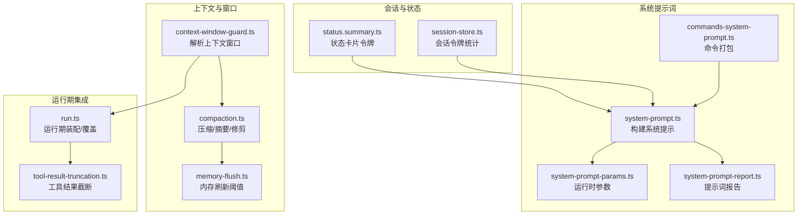
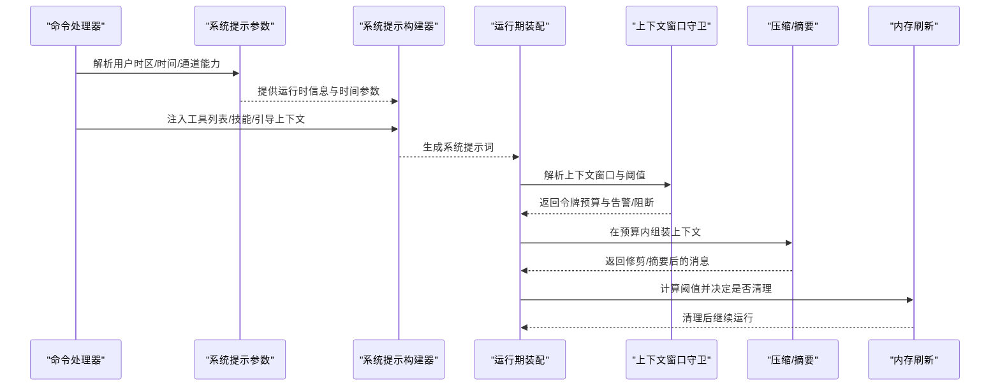
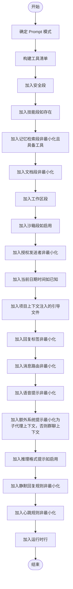
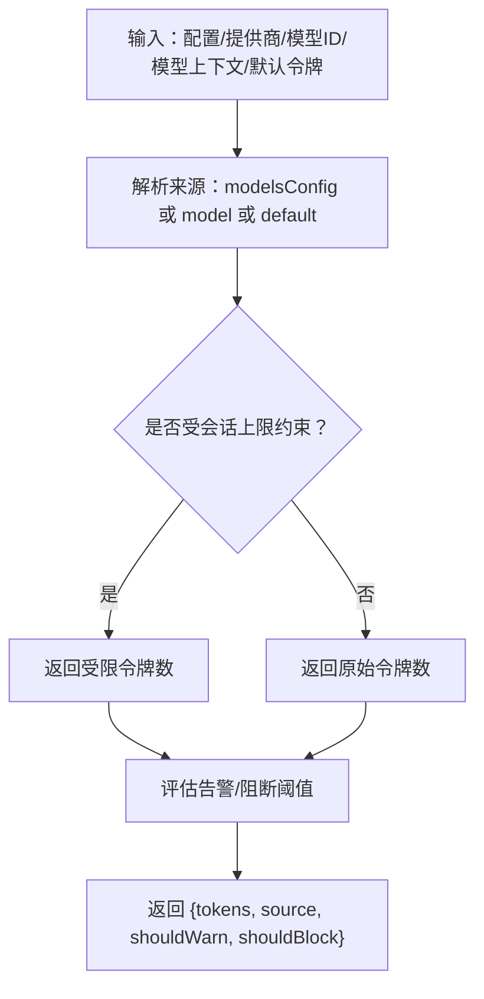
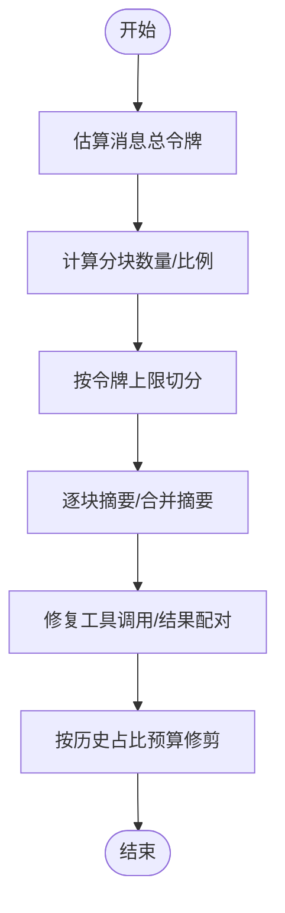
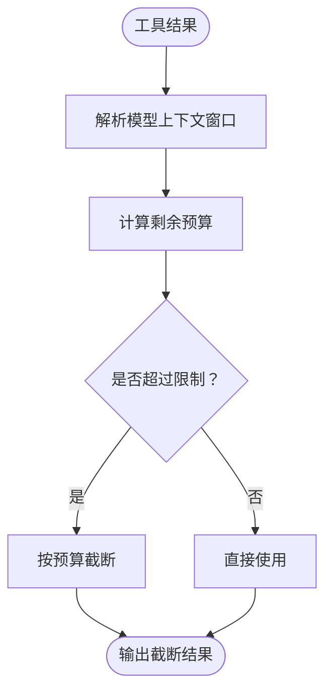
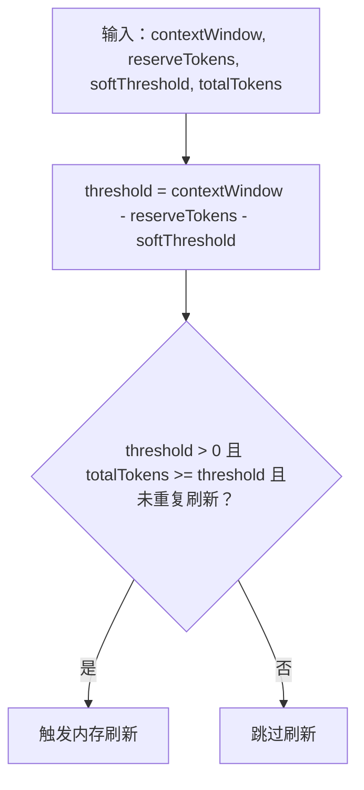
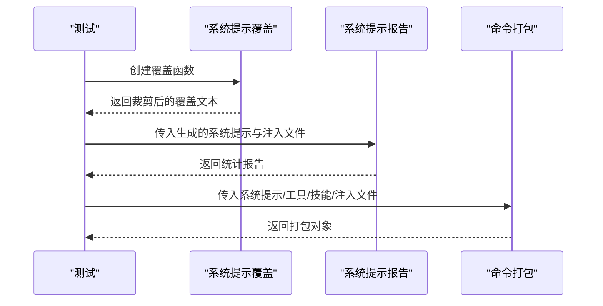
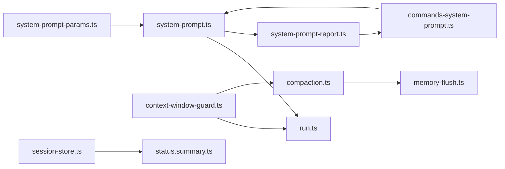

# 提示词组装与系统提示

<cite>
**本文引用的文件**
- [system-prompt.md](file://docs/concepts/system-prompt.md)
- [system-prompt.ts](file://src/agents/system-prompt.ts)
- [system-prompt-params.ts](file://src/agents/system-prompt-params.ts)
- [system-prompt-report.ts](file://src/agents/system-prompt-report.ts)
- [commands-system-prompt.ts](file://src/auto-reply/reply/commands-system-prompt.ts)
- [context-window-guard.ts](file://src/agents/context-window-guard.ts)
- [compaction.ts](file://src/agents/compaction.ts)
- [run.ts](file://src/agents/pi-embedded-runner/run.ts)
- [tool-result-truncation.ts](file://src/agents/pi-embedded-runner/tool-result-truncation.ts)
- [pi-embedded-runner.createsystempromptoverride.test.ts](file://src/agents/pi-embedded-runner.createsystempromptoverride.test.ts)
- [session-store.ts](file://src/commands/agent/session-store.ts)
- [status.summary.ts](file://src/commands/status.summary.ts)
- [memory-flush.ts](file://src/auto-reply/reply/memory-flush.ts)
- [types.ts](file://src/context-engine/types.ts)
</cite>

## 目录
1. [引言](#引言)
2. [项目结构](#项目结构)
3. [核心组件](#核心组件)
4. [架构总览](#架构总览)
5. [详细组件分析](#详细组件分析)
6. [依赖关系分析](#依赖关系分析)
7. [性能考量](#性能考量)
8. [故障排查指南](#故障排查指南)
9. [结论](#结论)
10. [附录](#附录)

## 引言
本文件聚焦于 OpenClaw 的“系统提示词（System Prompt）”组装与运行期管理，系统性阐述以下主题：
- 系统提示的构建过程：基础提示、技能提示、引导上下文与运行时覆盖的组合机制
- 模型特定限制与压缩预留令牌的处理方式
- 提示优化策略、上下文窗口管理与令牌计数计算
- 调试方法与性能优化技巧

目标是帮助开发者与运营人员在不同模型、渠道与会话场景下，稳定地生成高质量且可控的系统提示，避免越界与性能退化。

## 项目结构
围绕系统提示词的关键代码分布在以下模块：
- 系统提示词生成与参数准备：agents/system-prompt.*、agents/system-prompt-params.*
- 上下文窗口与压缩：agents/context-window-guard.ts、agents/compaction.ts
- 运行期注入与覆盖：agents/pi-embedded-runner/run.ts、agents/pi-embedded-runner/tool-result-truncation.ts
- 调试与报告：agents/system-prompt-report.ts、auto-reply/reply/commands-system-prompt.ts
- 会话状态与令牌统计：commands/agent/session-store.ts、commands/status.summary.ts
- 内存刷新与阈值：auto-reply/reply/memory-flush.ts
- 上下文引擎契约：context-engine/types.ts

**图表来源**
- [system-prompt.ts:189-729](file://src/agents/system-prompt.ts#L189-L729)
- [system-prompt-params.ts:35-60](file://src/agents/system-prompt-params.ts#L35-L60)
- [system-prompt-report.ts:80-142](file://src/agents/system-prompt-report.ts#L80-L142)
- [commands-system-prompt.ts:27-136](file://src/auto-reply/reply/commands-system-prompt.ts#L27-L136)
- [context-window-guard.ts:21-74](file://src/agents/context-window-guard.ts#L21-L74)
- [compaction.ts:1-465](file://src/agents/compaction.ts#L1-L465)
- [memory-flush.ts:195-228](file://src/auto-reply/reply/memory-flush.ts#L195-L228)
- [run.ts:407-415](file://src/agents/pi-embedded-runner/run.ts#L407-L415)
- [tool-result-truncation.ts:14-116](file://src/agents/pi-embedded-runner/tool-result-truncation.ts#L14-L116)
- [session-store.ts:44-56](file://src/commands/agent/session-store.ts#L44-L56)
- [status.summary.ts:147-180](file://src/commands/status.summary.ts#L147-L180)

**章节来源**
- [system-prompt.ts:189-729](file://src/agents/system-prompt.ts#L189-L729)
- [system-prompt-params.ts:35-60](file://src/agents/system-prompt-params.ts#L35-L60)
- [system-prompt-report.ts:80-142](file://src/agents/system-prompt-report.ts#L80-L142)
- [commands-system-prompt.ts:27-136](file://src/auto-reply/reply/commands-system-prompt.ts#L27-L136)
- [context-window-guard.ts:21-74](file://src/agents/context-window-guard.ts#L21-L74)
- [compaction.ts:1-465](file://src/agents/compaction.ts#L1-L465)
- [memory-flush.ts:195-228](file://src/auto-reply/reply/memory-flush.ts#L195-L228)
- [run.ts:407-415](file://src/agents/pi-embedded-runner/run.ts#L407-L415)
- [tool-result-truncation.ts:14-116](file://src/agents/pi-embedded-runner/tool-result-truncation.ts#L14-L116)
- [session-store.ts:44-56](file://src/commands/agent/session-store.ts#L44-L56)
- [status.summary.ts:147-180](file://src/commands/status.summary.ts#L147-L180)

## 核心组件
- 系统提示词构建器：负责按模式拼装固定段落，注入工具列表、技能、工作区、文档、沙箱、时间、静默回复、心跳、运行时信息等；支持最小化模式用于子代理。
- 运行时参数准备：解析用户时区、时间格式与时点，推导仓库根路径，形成运行时行。
- 上下文窗口解析与守卫：从配置、模型声明与默认值中解析上下文窗口，应用“软上限/硬下限”策略并给出告警/阻断建议。
- 压缩与摘要：基于令牌预算进行分块、修剪、摘要生成，保障会话在窗口内稳定运行。
- 工具结果截断：根据模型上下文窗口对单次工具输出进行安全截断，避免越界。
- 内存刷新阈值：结合上下文窗口、保留令牌与软阈值，判断是否需要触发内存清理以降低令牌占用。
- 会话令牌统计：从使用量与提示词估算中恢复会话总令牌，用于状态展示与诊断。
- 系统提示词报告：解析并统计系统提示词各部分字符与注入文件情况，辅助优化与审计。

**章节来源**
- [system-prompt.ts:189-729](file://src/agents/system-prompt.ts#L189-L729)
- [system-prompt-params.ts:35-60](file://src/agents/system-prompt-params.ts#L35-L60)
- [context-window-guard.ts:21-74](file://src/agents/context-window-guard.ts#L21-L74)
- [compaction.ts:1-465](file://src/agents/compaction.ts#L1-L465)
- [tool-result-truncation.ts:14-116](file://src/agents/pi-embedded-runner/tool-result-truncation.ts#L14-L116)
- [memory-flush.ts:195-228](file://src/auto-reply/reply/memory-flush.ts#L195-L228)
- [session-store.ts:44-56](file://src/commands/agent/session-store.ts#L44-L56)
- [system-prompt-report.ts:80-142](file://src/agents/system-prompt-report.ts#L80-L142)

## 架构总览
系统提示词的生命周期从“命令/会话入口”开始，经由“参数准备与上下文注入”，到“系统提示组装”，再到“运行期覆盖与工具结果截断”，最终进入“压缩与内存刷新”的闭环。

**图表来源**
- [commands-system-prompt.ts:27-136](file://src/auto-reply/reply/commands-system-prompt.ts#L27-L136)
- [system-prompt-params.ts:35-60](file://src/agents/system-prompt-params.ts#L35-L60)
- [system-prompt.ts:189-729](file://src/agents/system-prompt.ts#L189-L729)
- [run.ts:407-415](file://src/agents/pi-embedded-runner/run.ts#L407-L415)
- [context-window-guard.ts:21-74](file://src/agents/context-window-guard.ts#L21-L74)
- [compaction.ts:1-465](file://src/agents/compaction.ts#L1-L465)
- [memory-flush.ts:195-228](file://src/auto-reply/reply/memory-flush.ts#L195-L228)

## 详细组件分析

### 组件A：系统提示词构建器
- 功能要点
  - Prompt 模式控制：full/minimal/none，分别启用完整段落、子代理精简段落或仅身份行。
  - 固定段落：工具清单、安全、技能、自更新、工作区、文档、沙箱、授权发送者、当前日期时间、静默回复、心跳、运行时信息、项目上下文（注入的引导文件）、回复标签、消息路由、语音提示、反应指导、推理格式等。
  - 工具排序与去重：保证工具顺序与名称大小写一致性，外部工具追加至末尾。
  - 沙箱与 ACP：根据沙箱状态与 ACP 开关调整可用段落与说明。
  - 项目上下文注入：将引导文件内容作为“项目上下文”插入，受最大字符与总量限制，可注入截断警告。
  - 最小化模式下的“子代理上下文”头，区分于群聊的“群聊上下文”。

- 关键流程图（提示组装）

**图表来源**
- [system-prompt.ts:189-729](file://src/agents/system-prompt.ts#L189-L729)

**章节来源**
- [system-prompt.ts:189-729](file://src/agents/system-prompt.ts#L189-L729)

### 组件B：上下文窗口解析与守卫
- 上下文窗口来源优先级：模型配置(models.providers.*) > 模型声明 > 默认值；随后受“会话上下文令牌上限”约束。
- 守卫策略：低于“警告阈值”发出告警；低于“硬下限”直接阻断。
- 评估结果包含 shouldWarn/shouldBlock，便于运行期决策。

**图表来源**
- [context-window-guard.ts:21-74](file://src/agents/context-window-guard.ts#L21-L74)

**章节来源**
- [context-window-guard.ts:21-74](file://src/agents/context-window-guard.ts#L21-L74)

### 组件C：压缩与摘要（上下文缩减）
- 令牌估算：对消息进行安全化（剥离工具结果细节）后累加估算。
- 分块策略：按令牌份额切分，或按最大令牌数切分，并应用安全系数补偿估算误差。
- 自适应分块比例：根据平均消息大小动态降低分块比例，避免单条消息过大导致摘要失败。
- 摘要生成：支持多阶段摘要与合并指令，针对超大消息采用降级策略。
- 历史修剪：按历史占比预算进行分块丢弃，修复孤儿工具调用/结果配对，统计丢弃消息与令牌。

**图表来源**
- [compaction.ts:72-465](file://src/agents/compaction.ts#L72-L465)

**章节来源**
- [compaction.ts:1-465](file://src/agents/compaction.ts#L1-L465)

### 组件D：工具结果截断（模型特定限制）
- 截断依据：模型上下文窗口令牌数，确保单次工具结果不超过剩余预算。
- 安全兜底：即使最大上下文窗口也限制单条工具结果大小，避免极端越界。
- 与压缩协同：在摘要与修剪后仍需对工具结果做最后一道防线。

**图表来源**
- [tool-result-truncation.ts:14-116](file://src/agents/pi-embedded-runner/tool-result-truncation.ts#L14-L116)

**章节来源**
- [tool-result-truncation.ts:14-116](file://src/agents/pi-embedded-runner/tool-result-truncation.ts#L14-L116)

### 组件E：内存刷新阈值（压缩预留令牌）
- 阈值计算：threshold = contextWindow − reserveTokens − softThreshold
- 触发条件：当前总令牌 ≥ threshold 且未在同一压缩周期重复刷新
- 目的：在压缩前/中主动释放内存，避免越界与抖动。

**图表来源**
- [memory-flush.ts:195-228](file://src/auto-reply/reply/memory-flush.ts#L195-L228)

**章节来源**
- [memory-flush.ts:195-228](file://src/auto-reply/reply/memory-flush.ts#L195-L228)

### 组件F：运行期覆盖与调试
- 运行期覆盖：支持通过运行期钩子覆盖系统提示，测试覆盖空字符串与空白处理。
- 调试报告：解析系统提示词的项目上下文、工具列表、技能块等，统计字符与注入文件情况。
- 命令打包：将系统提示、工具、技能与注入文件打包，供命令处理器使用。

**图表来源**
- [pi-embedded-runner.createsystempromptoverride.test.ts:1-14](file://src/agents/pi-embedded-runner.createsystempromptoverride.test.ts#L1-L14)
- [system-prompt-report.ts:80-142](file://src/agents/system-prompt-report.ts#L80-L142)
- [commands-system-prompt.ts:27-136](file://src/auto-reply/reply/commands-system-prompt.ts#L27-L136)

**章节来源**
- [pi-embedded-runner.createsystempromptoverride.test.ts:1-14](file://src/agents/pi-embedded-runner.createsystempromptoverride.test.ts#L1-L14)
- [system-prompt-report.ts:80-142](file://src/agents/system-prompt-report.ts#L80-L142)
- [commands-system-prompt.ts:27-136](file://src/auto-reply/reply/commands-system-prompt.ts#L27-L136)

## 依赖关系分析
- 系统提示构建器依赖：
  - 工具与技能：来自命令打包与技能快照
  - 运行时参数：来自系统提示参数准备
  - 沙箱状态：来自沙箱运行时解析
  - 项目上下文：来自引导文件注入
- 上下文窗口守卫被运行期装配与压缩模块共同消费
- 压缩模块依赖令牌估算与工具结果细节剥离
- 内存刷新阈值依赖上下文窗口与保留令牌
- 会话令牌统计与状态卡片依赖系统提示与使用量

**图表来源**
- [system-prompt-params.ts:35-60](file://src/agents/system-prompt-params.ts#L35-L60)
- [system-prompt.ts:189-729](file://src/agents/system-prompt.ts#L189-L729)
- [commands-system-prompt.ts:27-136](file://src/auto-reply/reply/commands-system-prompt.ts#L27-L136)
- [run.ts:407-415](file://src/agents/pi-embedded-runner/run.ts#L407-L415)
- [context-window-guard.ts:21-74](file://src/agents/context-window-guard.ts#L21-L74)
- [compaction.ts:1-465](file://src/agents/compaction.ts#L1-L465)
- [memory-flush.ts:195-228](file://src/auto-reply/reply/memory-flush.ts#L195-L228)
- [system-prompt-report.ts:80-142](file://src/agents/system-prompt-report.ts#L80-L142)
- [session-store.ts:44-56](file://src/commands/agent/session-store.ts#L44-L56)
- [status.summary.ts:147-180](file://src/commands/status.summary.ts#L147-L180)

**章节来源**
- [system-prompt.ts:189-729](file://src/agents/system-prompt.ts#L189-L729)
- [system-prompt-params.ts:35-60](file://src/agents/system-prompt-params.ts#L35-L60)
- [commands-system-prompt.ts:27-136](file://src/auto-reply/reply/commands-system-prompt.ts#L27-L136)
- [context-window-guard.ts:21-74](file://src/agents/context-window-guard.ts#L21-L74)
- [compaction.ts:1-465](file://src/agents/compaction.ts#L1-L465)
- [memory-flush.ts:195-228](file://src/auto-reply/reply/memory-flush.ts#L195-L228)
- [system-prompt-report.ts:80-142](file://src/agents/system-prompt-report.ts#L80-L142)
- [session-store.ts:44-56](file://src/commands/agent/session-store.ts#L44-L56)
- [status.summary.ts:147-180](file://src/commands/status.summary.ts#L147-L180)

## 性能考量
- 令牌估算与安全系数：压缩模块对估算误差施加安全系数，避免因字符/特殊令牌/代码令牌导致的低估。
- 自适应分块比例：当平均消息较大时降低分块比例，减少单条消息越界风险。
- 工具结果截断：在摘要/修剪后仍对单次工具结果做截断，防止极端越界。
- 保留令牌与软阈值：通过保留令牌与软阈值控制刷新时机，避免频繁压缩。
- 会话令牌统计：优先使用显式提示词令牌，其次使用使用量推导，避免错误钳制总令牌。

**章节来源**
- [compaction.ts:14-145](file://src/agents/compaction.ts#L14-L145)
- [compaction.ts:181-200](file://src/agents/compaction.ts#L181-L200)
- [tool-result-truncation.ts:14-116](file://src/agents/pi-embedded-runner/tool-result-truncation.ts#L14-L116)
- [memory-flush.ts:195-228](file://src/auto-reply/reply/memory-flush.ts#L195-L228)
- [session-store.ts:44-56](file://src/commands/agent/session-store.ts#L44-L56)

## 故障排查指南
- 上下文窗口过小告警/阻断
  - 现象：运行期日志提示低上下文窗口或阻断模型
  - 排查：检查模型配置、会话上下文令牌上限、默认令牌设置
  - 参考
    - [run.ts:407-415](file://src/agents/pi-embedded-runner/run.ts#L407-L415)
    - [context-window-guard.ts:57-74](file://src/agents/context-window-guard.ts#L57-L74)
- 提示词过大导致压缩频繁
  - 现象：频繁摘要/修剪、历史被大量丢弃
  - 排查：查看系统提示报告，定位工具列表/技能/注入文件字符占比
  - 参考
    - [system-prompt-report.ts:80-142](file://src/agents/system-prompt-report.ts#L80-L142)
    - [compaction.ts:398-465](file://src/agents/compaction.ts#L398-L465)
- 工具结果越界
  - 现象：单次工具输出过大导致请求失败
  - 排查：确认模型上下文窗口与剩余预算，检查截断逻辑
  - 参考
    - [tool-result-truncation.ts:14-116](file://src/agents/pi-embedded-runner/tool-result-truncation.ts#L14-L116)
- 内存刷新不生效
  - 现象：总令牌持续升高，未触发清理
  - 排查：确认阈值计算、保留令牌与软阈值、是否已在当前压缩周期刷新过
  - 参考
    - [memory-flush.ts:195-228](file://src/auto-reply/reply/memory-flush.ts#L195-L228)
- 会话令牌统计异常
  - 现象：状态卡片显示的总令牌与预期不符
  - 排查：确认是否使用了显式提示词令牌覆盖、使用量推导是否合理
  - 参考
    - [session-store.ts:44-56](file://src/commands/agent/session-store.ts#L44-L56)
    - [status.summary.ts:147-180](file://src/commands/status.summary.ts#L147-L180)

**章节来源**
- [run.ts:407-415](file://src/agents/pi-embedded-runner/run.ts#L407-L415)
- [context-window-guard.ts:57-74](file://src/agents/context-window-guard.ts#L57-L74)
- [system-prompt-report.ts:80-142](file://src/agents/system-prompt-report.ts#L80-L142)
- [compaction.ts:398-465](file://src/agents/compaction.ts#L398-L465)
- [tool-result-truncation.ts:14-116](file://src/agents/pi-embedded-runner/tool-result-truncation.ts#L14-L116)
- [memory-flush.ts:195-228](file://src/auto-reply/reply/memory-flush.ts#L195-L228)
- [session-store.ts:44-56](file://src/commands/agent/session-store.ts#L44-L56)
- [status.summary.ts:147-180](file://src/commands/status.summary.ts#L147-L180)

## 结论
OpenClaw 的系统提示词组装遵循“固定段落 + 注入上下文 + 运行期覆盖”的设计，配合上下文窗口守卫、压缩/摘要与工具结果截断，形成闭环的稳定性保障。通过系统提示报告与会话令牌统计，可以实现可观测、可优化的提示词工程实践。建议在不同模型与渠道上：
- 明确上下文窗口来源与上限
- 控制工具列表与技能规模
- 合理设置保留令牌与软阈值
- 使用最小化模式隔离子代理上下文
- 定期审查系统提示报告，优化注入文件与提示词结构

## 附录
- 系统提示结构参考：见概念文档
  - [system-prompt.md:15-133](file://docs/concepts/system-prompt.md#L15-L133)

**章节来源**
- [system-prompt.md:15-133](file://docs/concepts/system-prompt.md#L15-L133)