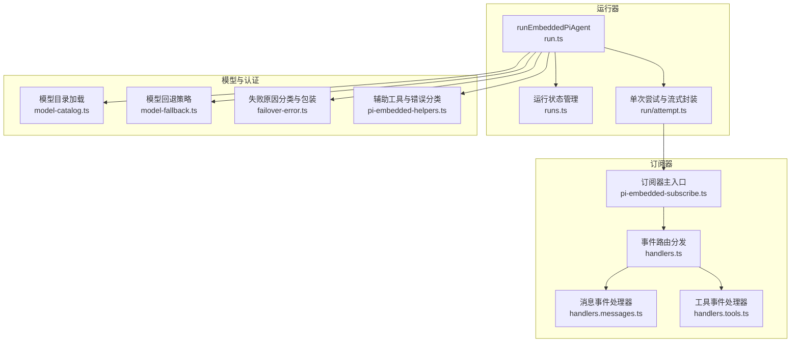
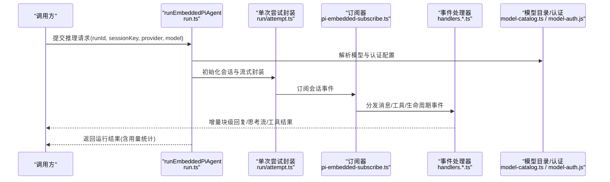
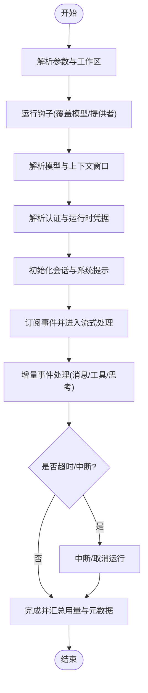
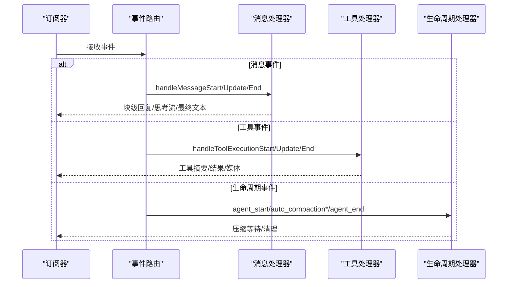
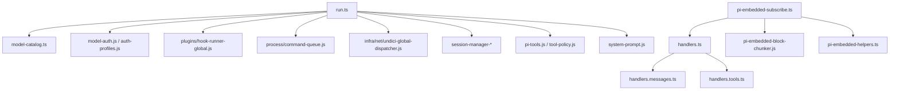

# 模型推理与执行

<cite>
**本文引用的文件**
- [pi-embedded-runner.ts](file://src/agents/pi-embedded-runner.ts)
- [pi-embedded-runner/run.ts](file://src/agents/pi-embedded-runner/run.ts)
- [pi-embedded-runner/runs.ts](file://src/agents/pi-embedded-runner/runs.ts)
- [pi-embedded-runner/run/attempt.ts](file://src/agents/pi-embedded-runner/run/attempt.ts)
- [pi-embedded-subscribe.ts](file://src/agents/pi-embedded-subscribe.ts)
- [pi-embedded-subscribe.handlers.ts](file://src/agents/pi-embedded-subscribe.handlers.ts)
- [pi-embedded-subscribe.handlers.messages.ts](file://src/agents/pi-embedded-subscribe.handlers.messages.ts)
- [pi-embedded-subscribe.handlers.tools.ts](file://src/agents/pi-embedded-subscribe.handlers.tools.ts)
- [pi-embedded-subscribe.types.ts](file://src/agents/pi-embedded-subscribe.types.ts)
- [pi-embedded-subscribe.handlers.types.ts](file://src/agents/pi-embedded-subscribe.handlers.types.ts)
- [pi-embedded-helpers.ts](file://src/agents/pi-embedded-helpers.ts)
- [model-catalog.ts](file://src/agents/model-catalog.ts)
- [model-fallback.ts](file://src/agents/model-fallback.ts)
- [failover-error.ts](file://src/agents/failover-error.ts)
- [pi-embedded.ts](file://src/agents/pi-embedded.ts)
- [pi-embedded-runner/types.js](file://src/agents/pi-embedded-runner/types.js)
- [pi-embedded-runner/run/payloads.js](file://src/agents/pi-embedded-runner/run/payloads.js)
- [pi-embedded-runner/tool-split.js](file://src/agents/pi-embedded-runner/tool-split.js)
- [pi-embedded-runner/extra-params.js](file://src/agents/pi-embedded-runner/extra-params.js)
- [pi-embedded-runner/history.js](file://src/agents/pi-embedded-runner/history.js)
- [pi-embedded-runner/lanes.js](file://src/agents/pi-embedded-runner/lanes.js)
- [pi-embedded-runner/sandbox-info.js](file://src/agents/pi-embedded-runner/sandbox-info.js)
- [pi-embedded-runner/system-prompt.js](file://src/agents/pi-embedded-runner/system-prompt.js)
- [pi-embedded-runner/compact.js](file://src/agents/pi-embedded-runner/compact.js)
- [pi-embedded-runner/abort.js](file://src/agents/pi-embedded-runner/abort.js)
- [pi-embedded-runner/cache-ttl.js](file://src/agents/pi-embedded-runner/cache-ttl.js)
- [pi-embedded-runner/session-manager-init.js](file://src/agents/pi-embedded-runner/session-manager-init.js)
- [pi-embedded-runner/session-manager-cache.js](file://src/agents/pi-embedded-runner/session-manager-cache.js)
- [pi-embedded-runner/wait-for-idle-before-flush.js](file://src/agents/pi-embedded-runner/wait-for-idle-before-flush.js)
- [pi-embedded-runner/run/compaction-timeout.js](file://src/agents/pi-embedded-runner/run/compaction-timeout.js)
- [pi-embedded-runner/run/compaction-retry-aggregate-timeout.js](file://src/agents/pi-embedded-runner/run/compaction-retry-aggregate-timeout.js)
- [pi-embedded-runner/run/images.js](file://src/agents/pi-embedded-runner/run/images.js)
- [pi-embedded-runner/run/history-image-prune.js](file://src/agents/pi-embedded-runner/run/history-image-prune.js)
- [pi-embedded-runner/logger.js](file://src/agents/pi-embedded-runner/logger.js)
- [pi-embedded-runner/utils.js](file://src/agents/pi-embedded-runner/utils.js)
- [pi-embedded-runner/model.js](file://src/agents/pi-embedded-runner/model.js)
- [pi-embedded-runner/tool-result-truncation.js](file://src/agents/pi-embedded-runner/tool-result-truncation.js)
- [pi-embedded-runner/tool-result-context-guard.js](file://src/agents/pi-embedded-runner/tool-result-context-guard.js)
- [pi-embedded-runner/tool-name-allowlist.js](file://src/agents/pi-embedded-runner/tool-name-allowlist.js)
- [pi-embedded-runner/tool-fs-policy.js](file://src/agents/pi-embedded-runner/tool-fs-policy.js)
- [pi-embedded-runner/tool-policy.js](file://src/agents/pi-embedded-runner/tool-policy.js)
- [pi-embedded-runner/transcript-policy.js](file://src/agents/pi-embedded-runner/transcript-policy.js)
- [pi-embedded-runner/skills-runtime.js](file://src/agents/pi-embedded-runner/skills-runtime.js)
- [pi-embedded-runner/pi-tools.before-tool-call.js](file://src/agents/pi-embedded-runner/pi-tools.before-tool-call.js)
- [pi-embedded-runner/tool-mutation.js](file://src/agents/pi-embedded-runner/tool-mutation.js)
- [pi-embedded-runner/pi-tools.js](file://src/agents/pi-embedded-runner/pi-tools.js)
- [pi-embedded-runner/pi-tool-definition-adapter.js](file://src/agents/pi-embedded-runner/pi-tool-definition-adapter.js)
- [pi-embedded-runner/pi-settings.js](file://src/agents/pi-embedded-runner/pi-settings.js)
- [pi-embedded-runner/pi-project-settings.js](file://src/agents/pi-embedded-runner/pi-project-settings.js)
- [pi-embedded-runner/session-tool-result-guard-wrapper.js](file://src/agents/pi-embedded-runner/session-tool-result-guard-wrapper.js)
- [pi-embedded-runner/session-file-repair.js](file://src/agents/pi-embedded-runner/session-file-repair.js)
- [pi-embedded-runner/session-transcript-repair.js](file://src/agents/pi-embedded-runner/session-transcript-repair.js)
- [pi-embedded-runner/sandbox.js](file://src/agents/pi-embedded-runner/sandbox.js)
- [pi-embedded-runner/sandbox/runtime-status.js](file://src/agents/pi-embedded-runner/sandbox/runtime-status.js)
- [pi-embedded-runner/cache-trace.js](file://src/agents/pi-embedded-runner/cache-trace.js)
- [pi-embedded-runner/custom-api-registry.js](file://src/agents/pi-embedded-runner/custom-api-registry.js)
- [pi-embedded-runner/bootstrap-budget.js](file://src/agents/pi-embedded-runner/bootstrap-budget.js)
- [pi-embedded-runner/bootstrap-files.js](file://src/agents/pi-embedded-runner/bootstrap-files.js)
- [pi-embedded-runner/docs-path.js](file://src/agents/pi-embedded-runner/docs-path.js)
- [pi-embedded-runner/workspace-run.js](file://src/agents/pi-embedded-runner/workspace-run.js)
- [pi-embedded-runner/agent-paths.js](file://src/agents/pi-embedded-runner/agent-paths.js)
- [pi-embedded-runner/models-config.js](file://src/agents/pi-embedded-runner/models-config.js)
- [pi-embedded-runner/usage.js](file://src/agents/pi-embedded-runner/usage.js)
- [pi-embedded-runner/defaults.js](file://src/agents/pi-embedded-runner/defaults.js)
- [pi-embedded-runner/context-window-guard.js](file://src/agents/pi-embedded-runner/context-window-guard.js)
- [pi-embedded-runner/model-selection.js](file://src/agents/pi-embedded-runner/model-selection.js)
- [pi-embedded-runner/model-auth.js](file://src/agents/pi-embedded-runner/model-auth.js)
- [pi-embedded-runner/auth-profiles.js](file://src/agents/pi-embedded-runner/auth-profiles.js)
- [pi-embedded-runner/agent-scope.js](file://src/agents/pi-embedded-runner/agent-scope.js)
- [pi-embedded-runner/routing/session-key.js](file://src/agents/pi-embedded-runner/routing/session-key.js)
- [pi-embedded-runner/utils/message-channel.js](file://src/agents/pi-embedded-runner/utils/message-channel.js)
- [pi-embedded-runner/plugins/hook-runner-global.js](file://src/agents/pi-embedded-runner/plugins/hook-runner-global.js)
- [pi-embedded-runner/process/command-queue.js](file://src/agents/pi-embedded-runner/process/command-queue.js)
- [pi-embedded-runner/infra/backoff.js](file://src/agents/pi-embedded-runner/infra/backoff.js)
- [pi-embedded-runner/infra/net/undici-global-dispatcher.js](file://src/agents/pi-embedded-runner/infra/net/undici-global-dispatcher.js)
- [pi-embedded-runner/infra/secure-random.js](file://src/agents/pi-embedded-runner/infra/secure-random.js)
- [pi-embedded-runner/infra/machine-name.js](file://src/agents/pi-embedded-runner/infra/machine-name.js)
- [pi-embedded-runner/infra/agent-events.js](file://src/agents/pi-embedded-runner/infra/agent-events.js)
- [pi-embedded-runner/logging/diagnostic.js](file://src/agents/pi-embedded-runner/logging/diagnostic.js)
- [pi-embedded-runner/shared/global-singleton.js](file://src/agents/pi-embedded-runner/shared/global-singleton.js)
- [pi-embedded-runner/shared/text/join-segments.js](file://src/agents/pi-embedded-runner/shared/text/join-segments.js)
- [pi-embedded-runner/media/constants.js](file://src/agents/pi-embedded-runner/media/constants.js)
- [pi-embedded-runner/utils.js](file://src/agents/pi-embedded-runner/utils.js)
- [pi-embedded-runner/utils/provider-utils.js](file://src/agents/pi-embedded-runner/utils/provider-utils.js)
- [pi-embedded-runner/utils/message-channel.js](file://src/agents/pi-embedded-runner/utils/message-channel.js)
- [pi-embedded-runner/config/config.js](file://src/agents/pi-embedded-runner/config/config.js)
- [pi-embedded-runner/config/channel-capabilities.js](file://src/agents/pi-embedded-runner/config/channel-capabilities.js)
- [pi-embedded-runner/config/types.openclaw.js](file://src/agents/pi-embedded-runner/config/types.openclaw.js)
- [pi-embedded-runner/plugins/types.js](file://src/agents/pi-embedded-runner/plugins/types.js)
- [pi-embedded-runner/plugins/hook-runner-global.js](file://src/agents/pi-embedded-runner/plugins/hook-runner-global.js)
- [pi-embedded-runner/plugins/provider-runtime.js](file://src/agents/pi-embedded-runner/plugins/provider-runtime.js)
- [pi-embedded-runner/plugins/provider-runtime.runtime.js](file://src/agents/pi-embedded-runner/plugins/provider-runtime.runtime.js)
- [pi-embedded-runner/plugins/model-suppression.runtime.js](file://src/agents/pi-embedded-runner/plugins/model-suppression.runtime.js)
- [pi-embedded-runner/plugins/model-fallback.runtime.js](file://src/agents/pi-embedded-runner/plugins/model-fallback.runtime.js)
- [pi-embedded-runner/plugins/model-fallback.types.js](file://src/agents/pi-embedded-runner/plugins/model-fallback.types.js)
- [pi-embedded-runner/plugins/model-fallback-observation.js](file://src/agents/pi-embedded-runner/plugins/model-fallback-observation.js)
- [pi-embedded-runner/plugins/model-fallback-error-observation.js](file://src/agents/pi-embedded-runner/plugins/model-fallback-error-observation.js)
- [pi-embedded-runner/plugins/model-fallback-error-observation.types.js](file://src/agents/pi-embedded-runner/plugins/model-fallback-error-observation.types.js)
- [pi-embedded-runner/plugins/model-fallback-error-observation.utils.js](file://src/agents/pi-embedded-runner/plugins/model-fallback-error-observation.utils.js)
- [pi-embedded-runner/plugins/model-fallback-error-observation.helpers.js](file://src/agents/pi-embedded-runner/plugins/model-fallback-error-observation.helpers.js)
- [pi-embedded-runner/plugins/model-fallback-error-observation.constants.js](file://src/agents/pi-embedded-runner/plugins/model-fallback-error-observation.constants.js)
- [pi-embedded-runner/plugins/model-fallback-error-observation.errors.js](file://src/agents/pi-embedded-runner/plugins/model-fallback-error-observation.errors.js)
- [pi-embedded-runner/plugins/model-fallback-error-observation.reasons.js](file://src/agents/pi-embedded-runner/plugins/model-fallback-error-observation.reasons.js)
- [pi-embedded-runner/plugins/model-fallback-error-observation.utils.js](file://src/agents/pi-embedded-runner/plugins/model-fallback-error-observation.utils.js)
- [pi-embedded-runner/plugins/model-fallback-error-observation.helpers.js](file://src/agents/pi-embedded-runner/plugins/model-fallback-error-observation.helpers.js)
- [pi-embedded-runner/plugins/model-fallback-error-observation.constants.js](file://src/agents/pi-embedded-runner/plugins/model-fallback-error-observation.constants.js)
- [pi-embedded-runner/plugins/model-fallback-error-observation.errors.js](file://src/agents/pi-embedded-runner/plugins/model-fallback-error-observation.errors.js)
- [pi-embedded-runner/plugins/model-fallback-error-observation.reasons.js](file://src/agents/pi-embedded-runner/plugins/model-fallback-error-observation.reasons.js)
- [pi-embedded-runner/plugins/model-fallback-error-observation.utils.js](file://src/agents/pi-embedded-runner/plugins/model-fallback-error-observation.utils.js)
- [pi-embedded-runner/plugins/model-fallback-error-observation.helpers.js](file://src/agents/pi-embedded-runner/plugins/model-fallback-error-observation.helpers.js)
- [pi-embedded-runner/plugins/model-fallback-error-observation.constants.js](file://src/agents/pi-embedded-runner/plugins/model-fallback-error-observation.constants.js)
- [pi-embedded-runner/plugins/model-fallback-error-observation.errors.js](file://src/agents/pi-embedded-runner/plugins/model-fallback-error-observation.errors.js)
- [pi-embedded-runner/plugins/model-fallback-error-observation.reasons.js](file://src/agents/pi-embedded-runner/plugins/model-fallback-error-observation.reasons.js)
- [pi-embedded-runner/plugins/model-fallback-error-observation.utils.js](file://src/agents/pi-embedded-runner/plugins/model-fallback-error-observation.utils.js)
- [pi-embedded-runner/plugins/model-fallback-error-observation.helpers.js](file://src/agents/pi-embedded-runner/plugins/model-fallback-error-observation.helpers.js)
- [pi-embedded-runner/plugins/model-fallback-error-observation.constants.js](file://src/agents/pi-embedded-runner/plugins/model-fallback-error-observation.constants.js)
- [pi-embedded-runner/plugins/model-fallback-error-observation.errors.js](file://src/agents/pi-embedded-runner/plugins/model-fallback-error-observation.errors.js)
- [pi-embedded-runner/plugins/model-fallback-error-observation.reasons.js](file://src/agents/pi-embedded-runner/plugins/model-fallback-error-observation.reasons.js)
- [pi-embedded-runner/plugins/model-fallback-error-observation.utils.js](file://src/agents/pi-embedded-runner/plugins/model-fallback-error-observation.utils.js)
- [pi-embedded-runner/plugins/model-fallback-error-observation.helpers.js](file://src/agents/pi-embedded-runner/plugins/model-fallback-error-observation.helpers.js)
- [pi-embedded-runner/plugins/model-fallback-error-observation.constants.js](file://src/agents/pi-embedded-runner/plugins/model-fallback-error-observation.constants.js)
- [pi-embedded-runner/plugins/model-fallback-error-observation.errors.js](file://src/agents/pi-embedded-runner/plugins/model-fallback-error-observation.errors.js)
- [pi-embedded-runner/plugins/model-fallback-error-observation.reasons.js](file://src/agents/pi-embedded-runner/plugins/model-fallback-error-observation.reasons.js)
- [pi-embedded-runner/plugins/model-fallback-error-observation.utils.js](file://src/agents/pi-embedded-runner/plugins/model-fallback-error-observation.utils.js)
- [pi-embedded-runner/plugins/model-fallback-error-observation.helpers.js](file://src/agents/pi-embedded-runner/plugins/model-fallback-error-observation.helpers.js)
- [pi-embedded-runner/plugins/model-fallback-error-observation.constants.js](file://src/agents/pi-embedded-runner/plugins/model-fallback-error-observation.constants.js)
- [pi-embedded-runner/plugins/model-fallback-error-observation.errors.js](file://src/agents/pi-embedded-runner/plugins/model-fallback-error-observation.errors.js)
- [pi-embedded-runner/plugins/model-fallback-error-observation.reasons.js](file://src/agents/pi-embedded-runner/plugins/model-fallback-error-observation.reasons.js)
- [pi-embedded-runner/plugins/model-fallback-error-observation.utils.js](file://src/agents/pi-embedded-runner/plugins/model-fallback-error-observation.utils.js)
- [pi-embedded-runner/plugins/model-fallback-error-......](file://src/agents/pi-embedded-runner/plugins/model-fallback-error-observation.utils.js)
</cite>

## 目录
1. [简介](#简介)
2. [项目结构](#项目结构)
3. [核心组件](#核心组件)
4. [架构总览](#架构总览)
5. [详细组件分析](#详细组件分析)
6. [依赖关系分析](#依赖关系分析)
7. [性能考量](#性能考量)
8. [故障排除指南](#故障排除指南)
9. [结论](#结论)
10. [附录](#附录)

## 简介
本文件聚焦于“嵌入式 Pi 代理”的模型推理与执行流程，围绕 runEmbeddedPiAgent 的完整生命周期展开，涵盖以下关键主题：
- 模型解析与认证配置：从配置与插件钩子中解析模型与认证信息，动态准备运行时凭据与会话上下文。
- Pi 会话构建与事件订阅：通过订阅器将流式事件转换为块级回复、工具调用结果与思考流。
- 增量流式传输：消息与工具执行的增量更新、思考块的提取与最终文本合并。
- 超时中断与运行时异常处理：会话压缩超时、中断信号、运行时异常与回退策略。
- 模型回退策略与错误恢复：基于失败原因分类与回退决策，结合上下文压缩与重试聚合。
- 性能监控指标：令牌用量、缓存命中/写入、吞吐与错误率等。

## 项目结构
本节概览与推理执行相关的核心模块组织方式，重点文件如下：
- 运行器入口与会话管理：runEmbeddedPiAgent、队列与活跃运行状态管理。
- 订阅器与事件分发：按消息/工具/生命周期三类处理器分发事件并生成块级回复。
- 模型解析与目录：模型目录加载、模型选择与认证配置。
- 回退与错误分类：失败原因分类、回退错误包装与观察日志。
- 工具与系统提示：工具拆分、系统提示覆盖、历史限制与上下文窗口保护。

图表来源
- [pi-embedded-runner/run.ts:265-800](file://src/agents/pi-embedded-runner/run.ts#L265-L800)
- [pi-embedded-runner/runs.ts:1-290](file://src/agents/pi-embedded-runner/runs.ts#L1-L290)
- [pi-embedded-runner/run/attempt.ts:1-800](file://src/agents/pi-embedded-runner/run/attempt.ts#L1-L800)
- [pi-embedded-subscribe.ts:34-727](file://src/agents/pi-embedded-subscribe.ts#L34-L727)
- [pi-embedded-subscribe.handlers.ts:22-66](file://src/agents/pi-embedded-subscribe.handlers.ts#L22-L66)
- [pi-embedded-subscribe.handlers.messages.ts:59-441](file://src/agents/pi-embedded-subscribe.handlers.messages.ts#L59-L441)
- [pi-embedded-subscribe.handlers.tools.ts:298-577](file://src/agents/pi-embedded-subscribe.handlers.tools.ts#L298-L577)
- [model-catalog.ts:145-259](file://src/agents/model-catalog.ts#L145-L259)
- [model-fallback.ts:156-718](file://src/agents/model-fallback.ts#L156-L718)
- [failover-error.ts:11-40](file://src/agents/failover-error.ts#L11-L40)

章节来源
- [pi-embedded-runner.ts:1-29](file://src/agents/pi-embedded-runner.ts#L1-L29)
- [pi-embedded-subscribe.ts:34-727](file://src/agents/pi-embedded-subscribe.ts#L34-L727)

## 核心组件
- 运行器 runEmbeddedPiAgent：负责模型解析、认证配置、会话初始化、事件订阅与运行状态管理；支持队列与并发控制、运行时凭据刷新、上下文窗口保护与回退策略集成。
- 订阅器 subscribeEmbeddedPiSession：将 pi-agent-core 的事件流转换为块级回复、工具结果与思考流，支持重复内容抑制、最终标签强制与媒体/指令解析。
- 模型目录与回退：动态加载模型目录、合并插件补充项，按失败原因进行回退与重试，并对上下文溢出等特殊错误进行保护。
- 错误与回退：统一的失败原因分类与 FailoverError 包装，便于上层策略决策与可观测性记录。

章节来源
- [pi-embedded-runner/run.ts:265-800](file://src/agents/pi-embedded-runner/run.ts#L265-L800)
- [pi-embedded-subscribe.ts:34-727](file://src/agents/pi-embedded-subscribe.ts#L34-L727)
- [model-catalog.ts:145-259](file://src/agents/model-catalog.ts#L145-L259)
- [model-fallback.ts:156-718](file://src/agents/model-fallback.ts#L156-L718)
- [failover-error.ts:11-40](file://src/agents/failover-error.ts#L11-L40)

## 架构总览
下图展示 runEmbeddedPiAgent 的端到端执行路径，包括模型解析、认证与会话构建、事件订阅与增量流式传输、超时与中断处理、回退与错误恢复。

图表来源
- [pi-embedded-runner/run.ts:265-800](file://src/agents/pi-embedded-runner/run.ts#L265-L800)
- [pi-embedded-runner/run/attempt.ts:1-800](file://src/agents/pi-embedded-runner/run/attempt.ts#L1-L800)
- [pi-embedded-subscribe.ts:34-727](file://src/agents/pi-embedded-subscribe.ts#L34-L727)
- [pi-embedded-subscribe.handlers.ts:22-66](file://src/agents/pi-embedded-subscribe.handlers.ts#L22-L66)
- [model-catalog.ts:145-259](file://src/agents/model-catalog.ts#L145-L259)

## 详细组件分析

### runEmbeddedPiAgent 执行流程
- 入口与参数解析：确定会话与全局队列、工作区目录、通道能力与工具结果格式。
- 钩子与模型覆盖：优先运行 before_model_resolve 与 before_agent_start 钩子以允许插件覆盖 provider/model。
- 模型解析与上下文窗口：resolveModelAsync 获取模型定义，评估上下文窗口并应用保护阈值。
- 认证与运行时凭据：解析认证配置，准备运行时凭据（支持刷新与过期时间），并注册到认证存储。
- 会话初始化与事件订阅：创建会话、构建系统提示与工具集、订阅事件并进入增量流式处理。
- 运行状态与等待：维护活跃运行计数、快照与结束等待，支持取消与超时中断。
- 结果汇总：收集用量统计、上下文大小修正与错误元数据，返回运行结果。

图表来源
- [pi-embedded-runner/run.ts:265-800](file://src/agents/pi-embedded-runner/run.ts#L265-L800)
- [pi-embedded-runner/runs.ts:1-290](file://src/agents/pi-embedded-runner/runs.ts#L1-L290)
- [pi-embedded-runner/run/attempt.ts:1-800](file://src/agents/pi-embedded-runner/run/attempt.ts#L1-L800)

章节来源
- [pi-embedded-runner/run.ts:265-800](file://src/agents/pi-embedded-runner/run.ts#L265-L800)
- [pi-embedded-runner/runs.ts:1-290](file://src/agents/pi-embedded-runner/runs.ts#L1-L290)

### 订阅器与事件订阅机制
- 订阅器入口：subscribeEmbeddedPiSession 创建上下文状态、块级缓冲与思考流开关，绑定会话订阅。
- 事件路由：createEmbeddedPiSessionEventHandler 将事件分派至消息、工具与生命周期处理器。
- 消息事件：handleMessageStart/Update/End 处理 text_delta/start/end，维护增量缓冲、思考块与最终文本合并。
- 工具事件：handleToolExecutionStart/Update/End 记录工具摘要、提交消息工具发送、触发后置钩子与输出。
- 生命周期事件：处理 agent_start/auto_compaction_* 与 agent_end，维护压缩等待与清理。

图表来源
- [pi-embedded-subscribe.ts:34-727](file://src/agents/pi-embedded-subscribe.ts#L34-L727)
- [pi-embedded-subscribe.handlers.ts:22-66](file://src/agents/pi-embedded-subscribe.handlers.ts#L22-L66)
- [pi-embedded-subscribe.handlers.messages.ts:59-441](file://src/agents/pi-embedded-subscribe.handlers.messages.ts#L59-L441)
- [pi-embedded-subscribe.handlers.tools.ts:298-577](file://src/agents/pi-embedded-subscribe.handlers.tools.ts#L298-L577)

章节来源
- [pi-embedded-subscribe.ts:34-727](file://src/agents/pi-embedded-subscribe.ts#L34-L727)
- [pi-embedded-subscribe.handlers.ts:22-66](file://src/agents/pi-embedded-subscribe.handlers.ts#L22-L66)
- [pi-embedded-subscribe.handlers.messages.ts:59-441](file://src/agents/pi-embedded-subscribe.handlers.messages.ts#L59-L441)
- [pi-embedded-subscribe.handlers.tools.ts:298-577](file://src/agents/pi-embedded-subscribe.handlers.tools.ts#L298-L577)

### 助手与工具增量的流式传输
- 消息增量：根据 text_delta/start/end 维护 deltaBuffer/blockBuffer，按块边界或消息边界生成块级回复，过滤重复与最终标签外文本。
- 思考流：在 reasoningMode/stream 模式下，实时广播 thinking 事件，支持前缀差分 delta。
- 工具增量：工具执行 start/update/result 事件分别记录摘要、中间结果与最终结果，支持媒体 URL 与批准提示的特殊处理。

章节来源
- [pi-embedded-subscribe.handlers.messages.ts:59-441](file://src/agents/pi-embedded-subscribe.handlers.messages.ts#L59-L441)
- [pi-embedded-subscribe.handlers.tools.ts:298-577](file://src/agents/pi-embedded-subscribe.handlers.tools.ts#L298-L577)

### 超时中断与运行时异常处理
- 会话压缩超时：在压缩阶段设置超时，必要时触发中断与清理，避免长时间阻塞。
- 中断信号：支持 sessions_yield 中断类型，注入隐藏消息并移除合成中断与中止响应。
- 运行时异常：统一包装为 FailoverError，区分速率限制、过载、鉴权、计费与超时等失败原因，驱动回退策略。

章节来源
- [pi-embedded-runner/run/attempt.ts:155-333](file://src/agents/pi-embedded-runner/run/attempt.ts#L155-L333)
- [pi-embedded-runner/run/compaction-timeout.js](file://src/agents/pi-embedded-runner/run/compaction-timeout.js)
- [pi-embedded-runner/run/compaction-retry-aggregate-timeout.js](file://src/agents/pi-embedded-runner/run/compaction-retry-aggregate-timeout.js)
- [failover-error.ts:11-40](file://src/agents/failover-error.ts#L11-L40)

### 模型回退策略与错误恢复
- 失败原因分类：基于错误文本/HTTP 状态码/符号化错误码识别速率限制、过载、鉴权、计费与超时等。
- 回退决策：对可回退错误尝试不同模型/提供者，对上下文溢出错误优先触发压缩而非切换模型。
- 观察与日志：记录错误指纹、HTTP 码、请求标识等，便于诊断与告警。

章节来源
- [model-fallback.ts:156-718](file://src/agents/model-fallback.ts#L156-L718)
- [failover-error.ts:11-40](file://src/agents/failover-error.ts#L11-L40)
- [pi-embedded-helpers.ts:1-74](file://src/agents/pi-embedded-helpers.ts#L1-L74)

### 性能监控指标
- 令牌用量：输入/输出/缓存读写/总计，支持最后 API 调用缓存字段以更准确反映上下文大小。
- 缓存命中率：缓存读取/(输入+缓存读取)，用于评估缓存效率。
- 吞吐与成本：消息总数、平均令牌/消息、每分钟令牌/成本、错误率等。
- 会话诊断：活跃运行计数、快照、等待结束与压缩等待聚合。

章节来源
- [pi-embedded-runner/usage.js](file://src/agents/pi-embedded-runner/usage.js)
- [pi-embedded-runner/runs.ts:1-290](file://src/agents/pi-embedded-runner/runs.ts#L1-L290)
- [pi-embedded-runner/run/compaction-retry-aggregate-timeout.js](file://src/agents/pi-embedded-runner/run/compaction-retry-aggregate-timeout.js)

## 依赖关系分析
- 运行器依赖：模型目录、认证配置、钩子运行器、命令队列、网络超时与代理、会话管理器缓存、工具策略与系统提示。
- 订阅器依赖：事件路由、消息/工具处理器、块级分块器、媒体/指令解析、重复抑制与最终标签处理。
- 辅助模块：错误分类与包装、上下文窗口保护、历史限制、工具拆分与名称规范化、沙箱与缓存追踪。

图表来源
- [pi-embedded-runner/run.ts:1-800](file://src/agents/pi-embedded-runner/run.ts#L1-L800)
- [pi-embedded-subscribe.ts:34-727](file://src/agents/pi-embedded-subscribe.ts#L34-L727)
- [pi-embedded-runner/plugins/hook-runner-global.js](file://src/agents/pi-embedded-runner/plugins/hook-runner-global.js)
- [pi-embedded-runner/process/command-queue.js](file://src/agents/pi-embedded-runner/process/command-queue.js)
- [pi-embedded-runner/infra/net/undici-global-dispatcher.js](file://src/agents/pi-embedded-runner/infra/net/undici-global-dispatcher.js)
- [pi-embedded-runner/session-manager-init.js](file://src/agents/pi-embedded-runner/session-manager-init.js)
- [pi-embedded-runner/session-manager-cache.js](file://src/agents/pi-embedded-runner/session-manager-cache.js)
- [pi-embedded-runner/pi-tools.js](file://src/agents/pi-embedded-runner/pi-tools.js)
- [pi-embedded-runner/tool-policy.js](file://src/agents/pi-embedded-runner/tool-policy.js)
- [pi-embedded-runner/pi-embedded-block-chunker.js](file://src/agents/pi-embedded-runner/pi-embedded-block-chunker.js)
- [pi-embedded-helpers.ts:1-74](file://src/agents/pi-embedded-helpers.ts#L1-L74)

章节来源
- [pi-embedded-runner/run.ts:1-800](file://src/agents/pi-embedded-runner/run.ts#L1-L800)
- [pi-embedded-subscribe.ts:34-727](file://src/agents/pi-embedded-subscribe.ts#L34-L727)

## 性能考量
- 上下文窗口保护：在模型解析阶段评估有效上下文窗口，避免过小窗口导致阻断。
- 缓存优化：使用最后 API 调用的缓存字段计算上下文大小，减少多轮工具调用导致的膨胀。
- 压缩与重试：在压缩阶段设置超时与重试聚合，平衡稳定性与响应速度。
- 流式传输：按块边界与消息边界生成回复，减少重复内容与最终标签泄漏，提升用户体验。

章节来源
- [pi-embedded-runner/run.ts:388-420](file://src/agents/pi-embedded-runner/run.ts#L388-L420)
- [pi-embedded-runner/run/attempt.ts:1-800](file://src/agents/pi-embedded-runner/run/attempt.ts#L1-L800)
- [pi-embedded-runner/run/compaction-timeout.js](file://src/agents/pi-embedded-runner/run/compaction-timeout.js)
- [pi-embedded-runner/run/compaction-retry-aggregate-timeout.js](file://src/agents/pi-embedded-runner/run/compaction-retry-aggregate-timeout.js)

## 故障排除指南
- 鉴权失败：检查认证配置与运行时凭据刷新，确认 profile 可用性与过期时间。
- 速率限制/过载：启用回退策略，降低并发或切换模型/提供者；关注超时与重试日志。
- 计费错误：核对计费状态与配额，必要时调整模型或提供者。
- 上下文溢出：触发自动压缩与回退，避免切换模型导致更小窗口；检查历史长度与图像裁剪。
- 会话卡死：检查压缩等待与活跃运行计数，必要时中断运行并清理快照。
- 工具调用异常：查看工具摘要与错误信息，确认工具名称规范化与权限策略。

章节来源
- [failover-error.ts:11-40](file://src/agents/failover-error.ts#L11-L40)
- [pi-embedded-helpers.ts:1-74](file://src/agents/pi-embedded-helpers.ts#L1-L74)
- [pi-embedded-runner/runs.ts:1-290](file://src/agents/pi-embedded-runner/runs.ts#L1-L290)
- [pi-embedded-runner/run/attempt.ts:1-800](file://src/agents/pi-embedded-runner/run/attempt.ts#L1-L800)

## 结论
本文件系统梳理了 runEmbeddedPiAgent 的执行全链路，从模型解析、认证配置到会话构建与事件订阅，再到增量流式传输、超时中断与回退策略，提供了面向工程实践的参考路径。通过订阅器的模块化设计与统一的错误分类包装，系统在稳定性与可观测性方面具备良好基础。建议在生产环境中结合缓存策略、压缩超时与回退策略，持续优化吞吐与成本表现。

## 附录
- 关键类型与导出
  - 运行器类型：EmbeddedPiRunResult、EmbeddedPiRunMeta、EmbeddedPiAgentMeta。
  - 订阅器参数：SubscribeEmbeddedPiSessionParams、BlockReplyChunking。
  - 认证与模型：ResolvedProviderAuth、ModelCatalogEntry、FailoverReason。

章节来源
- [pi-embedded-runner/types.js](file://src/agents/pi-embedded-runner/types.js)
- [pi-embedded-subscribe.types.ts:11-42](file://src/agents/pi-embedded-subscribe.types.ts#L11-L42)
- [pi-embedded-runner/model-auth.js](file://src/agents/pi-embedded-runner/model-auth.js)
- [model-catalog.ts:10-29](file://src/agents/model-catalog.ts#L10-L29)
- [pi-embedded-helpers.ts](file://src/agents/pi-embedded-helpers.ts#L70)