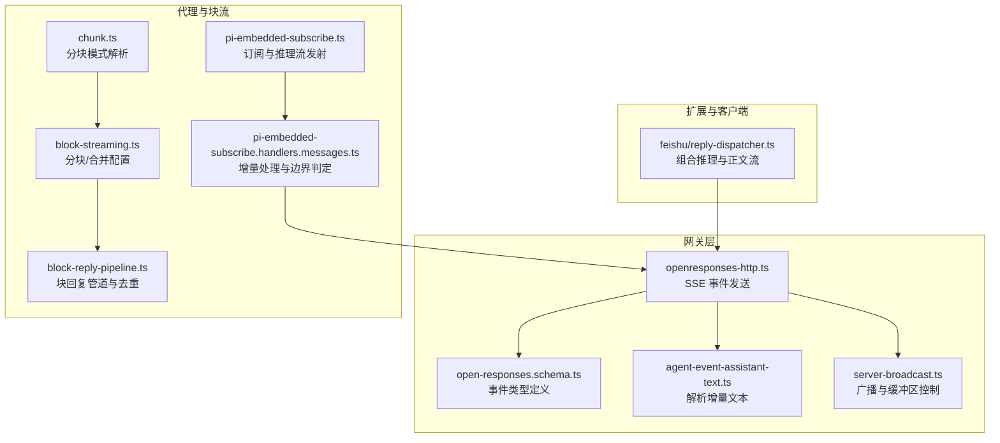
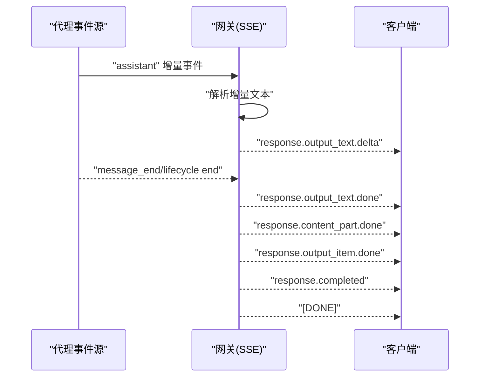
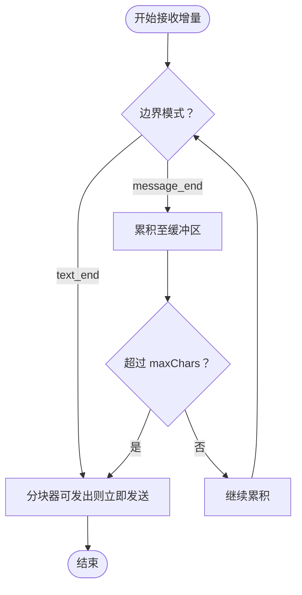
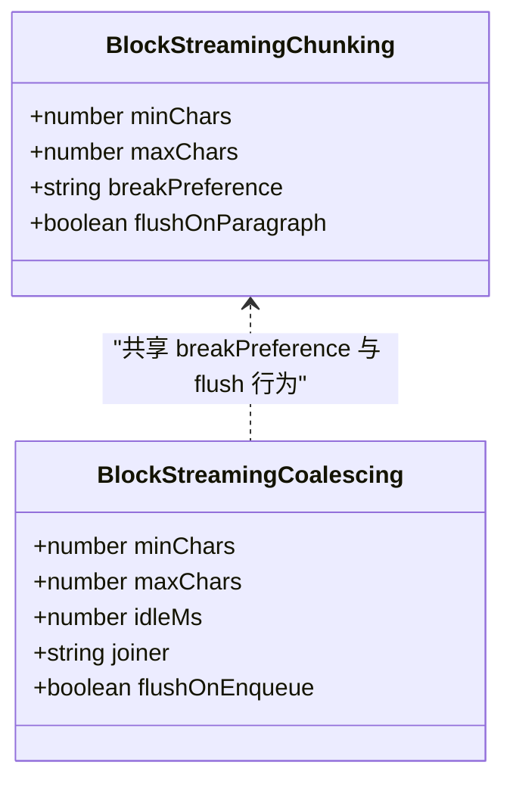
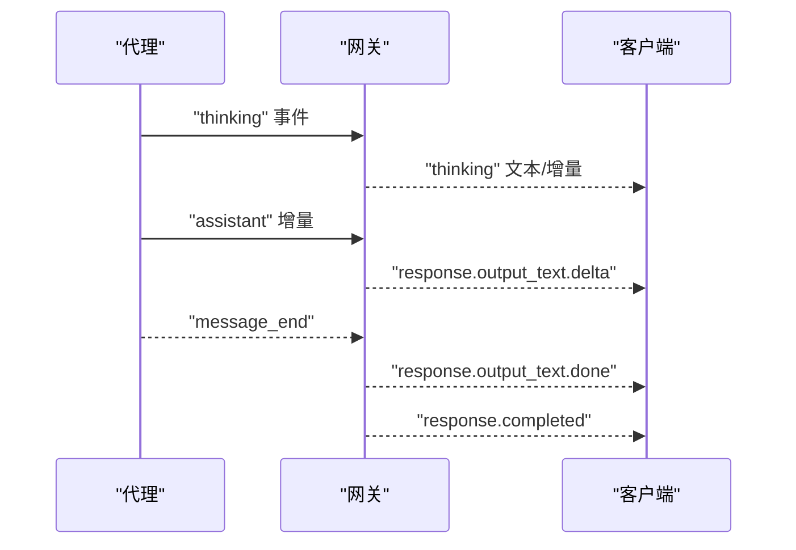
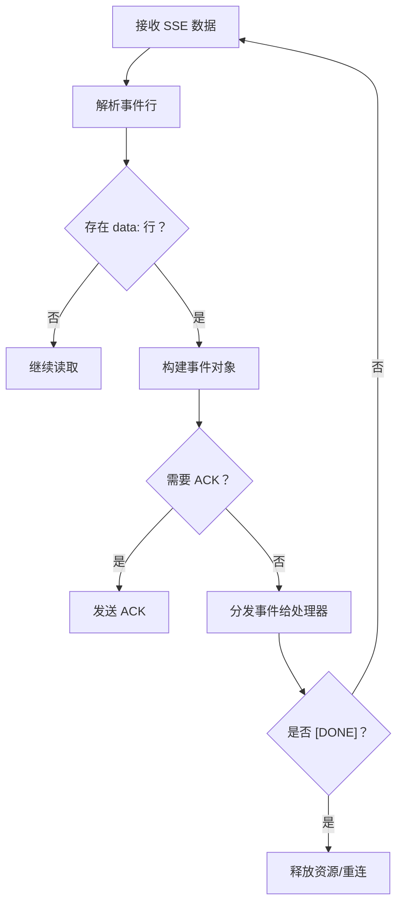
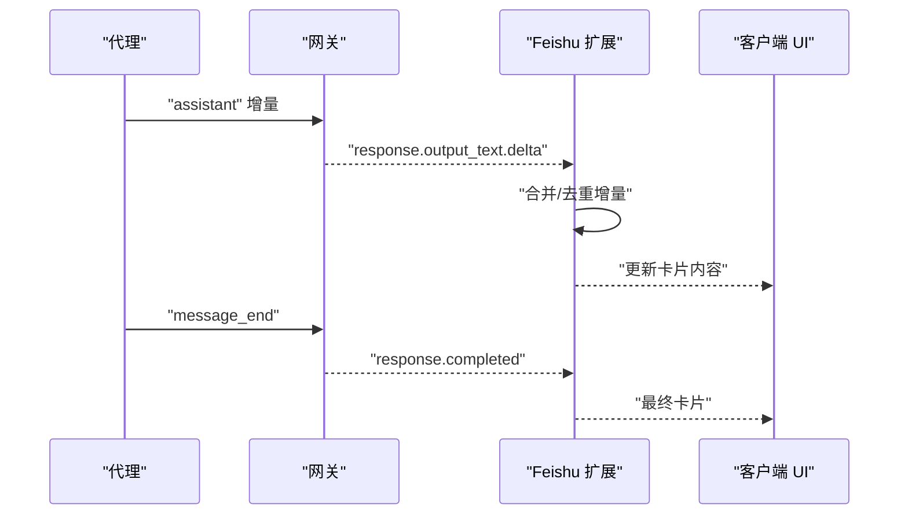
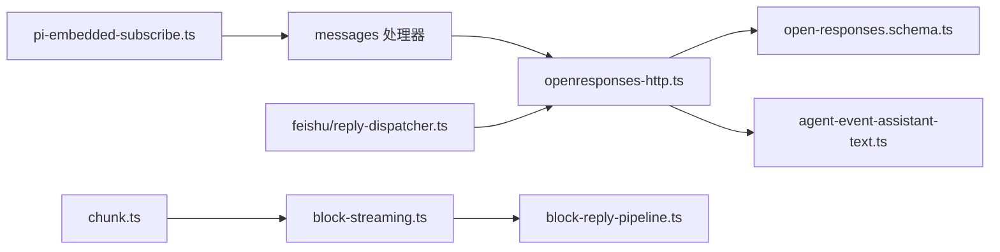

# 流式响应与部分回复

<cite>
**本文引用的文件**
- [docs/concepts/streaming.md](file://docs/concepts/streaming.md)
- [src/gateway/openresponses-http.ts](file://src/gateway/openresponses-http.ts)
- [src/gateway/open-responses.schema.ts](file://src/gateway/open-responses.schema.ts)
- [src/gateway/agent-event-assistant-text.ts](file://src/gateway/agent-event-assistant-text.ts)
- [src/agents/pi-embedded-subscribe.ts](file://src/agents/pi-embedded-subscribe.ts)
- [src/agents/pi-embedded-subscribe.handlers.messages.ts](file://src/agents/pi-embedded-subscribe.handlers.messages.ts)
- [src/auto-reply/reply/block-streaming.ts](file://src/auto-reply/reply/block-streaming.ts)
- [src/auto-reply/reply/block-reply-pipeline.ts](file://src/auto-reply/reply/block-reply-pipeline.ts)
- [src/auto-reply/chunk.ts](file://src/auto-reply/chunk.ts)
- [src/gateway/server-broadcast.ts](file://src/gateway/server-broadcast.ts)
- [extensions/feishu/src/reply-dispatcher.ts](file://extensions/feishu/src/reply-dispatcher.ts)
- [extensions/nostr/src/metrics.ts](file://extensions/nostr/src/metrics.ts)
- [ui/src/ui/views/usage-metrics.ts](file://ui/src/ui/views/usage-metrics.ts)
</cite>

## 目录
1. [简介](#简介)
2. [项目结构](#项目结构)
3. [核心组件](#核心组件)
4. [架构总览](#架构总览)
5. [详细组件分析](#详细组件分析)
6. [依赖关系分析](#依赖关系分析)
7. [性能考量](#性能考量)
8. [故障排查指南](#故障排查指南)
9. [结论](#结论)
10. [附录](#附录)

## 简介
本文件系统性阐述 OpenClaw 的“流式响应与部分回复”机制，重点覆盖以下方面：
- 助手增量的流式传输：文本增量、推理流（thinking）与最终输出的边界判定。
- 触发条件：文本结束（text_end）与消息结束（message_end）两类边界。
- 推理流的独立传输与“块回复”的混合模式：如何在不同通道中组合使用“预览流”和“块流”。
- 块流式分块策略与软块偏好（段落/换行/句子）处理。
- 客户端 SSE 事件处理模式、缓冲区管理与网络传输优化。
- 调试工具与性能监控方法。

## 项目结构
围绕流式响应与部分回复的关键目录与文件：
- 文档与概念：docs/concepts/streaming.md
- 网关与 SSE：src/gateway/openresponses-http.ts、src/gateway/open-responses.schema.ts、src/gateway/agent-event-assistant-text.ts
- 推理与块流配置：src/agents/pi-embedded-subscribe.ts、src/auto-reply/reply/block-streaming.ts、src/auto-reply/reply/block-reply-pipeline.ts、src/auto-reply/chunk.ts
- 客户端示例：extensions/feishu/src/reply-dispatcher.ts
- 性能与指标：extensions/nostr/src/metrics.ts、ui/src/ui/views/usage-metrics.ts

**图表来源**
- [src/gateway/openresponses-http.ts:1-200](file://src/gateway/openresponses-http.ts#L1-L200)
- [src/gateway/open-responses.schema.ts:319-361](file://src/gateway/open-responses.schema.ts#L319-L361)
- [src/gateway/agent-event-assistant-text.ts:1-7](file://src/gateway/agent-event-assistant-text.ts#L1-L7)
- [src/agents/pi-embedded-subscribe.ts:540-727](file://src/agents/pi-embedded-subscribe.ts#L540-L727)
- [src/agents/pi-embedded-subscribe.handlers.messages.ts:179-213](file://src/agents/pi-embedded-subscribe.handlers.messages.ts#L179-L213)
- [src/auto-reply/reply/block-streaming.ts:1-248](file://src/auto-reply/reply/block-streaming.ts#L1-L248)
- [src/auto-reply/reply/block-reply-pipeline.ts:170-211](file://src/auto-reply/reply/block-reply-pipeline.ts#L170-L211)
- [src/auto-reply/chunk.ts:76-107](file://src/auto-reply/chunk.ts#L76-L107)
- [extensions/feishu/src/reply-dispatcher.ts:198-243](file://extensions/feishu/src/reply-dispatcher.ts#L198-L243)

**章节来源**
- [docs/concepts/streaming.md:1-156](file://docs/concepts/streaming.md#L1-L156)
- [src/gateway/openresponses-http.ts:547-846](file://src/gateway/openresponses-http.ts#L547-L846)
- [src/gateway/open-responses.schema.ts:319-361](file://src/gateway/open-responses.schema.ts#L319-L361)
- [src/gateway/agent-event-assistant-text.ts:1-7](file://src/gateway/agent-event-assistant-text.ts#L1-L7)
- [src/agents/pi-embedded-subscribe.ts:540-727](file://src/agents/pi-embedded-subscribe.ts#L540-L727)
- [src/agents/pi-embedded-subscribe.handlers.messages.ts:179-213](file://src/agents/pi-embedded-subscribe.handlers.messages.ts#L179-L213)
- [src/auto-reply/reply/block-streaming.ts:1-248](file://src/auto-reply/reply/block-streaming.ts#L1-L248)
- [src/auto-reply/reply/block-reply-pipeline.ts:170-211](file://src/auto-reply/reply/block-reply-pipeline.ts#L170-L211)
- [src/auto-reply/chunk.ts:76-107](file://src/auto-reply/chunk.ts#L76-L107)
- [extensions/feishu/src/reply-dispatcher.ts:198-243](file://extensions/feishu/src/reply-dispatcher.ts#L198-L243)

## 核心组件
- 网关与 SSE 发送器：负责将代理事件转换为 OpenResponses 兼容的 SSE 事件序列，并在消息结束时完成收尾。
- 代理订阅与推理流：订阅代理事件，格式化推理文本并通过 WebSocket 广播，同时处理块回复缓冲与边界。
- 块流配置与合并：解析分块策略（最小/最大字符、断句偏好、段落/换行/句子），以及合并策略（空闲时间、连接符、段落优先刷新）。
- 客户端事件处理：解析 SSE 事件、拼接增量、去重与组合（如 Feishu 将推理与正文合并展示）。
- 缓冲区与广播控制：基于 socket 缓冲字节数进行慢消费者丢弃或关闭，保障服务稳定性。
- 指标与监控：扩展与 UI 层提供指标采集与聚合，辅助性能诊断。

**章节来源**
- [src/gateway/openresponses-http.ts:547-846](file://src/gateway/openresponses-http.ts#L547-L846)
- [src/agents/pi-embedded-subscribe.ts:540-727](file://src/agents/pi-embedded-subscribe.ts#L540-L727)
- [src/auto-reply/reply/block-streaming.ts:161-247](file://src/auto-reply/reply/block-streaming.ts#L161-L247)
- [src/gateway/server-broadcast.ts:60-118](file://src/gateway/server-broadcast.ts#L60-L118)
- [extensions/nostr/src/metrics.ts:44-237](file://extensions/nostr/src/metrics.ts#L44-L237)
- [ui/src/ui/views/usage-metrics.ts:407-431](file://ui/src/ui/views/usage-metrics.ts#L407-L431)

## 架构总览
下图展示了从代理到客户端的完整流式路径：代理产生增量事件 → 网关解析并写入 SSE → 客户端消费事件并渲染。

**图表来源**
- [src/gateway/openresponses-http.ts:657-842](file://src/gateway/openresponses-http.ts#L657-L842)
- [src/gateway/open-responses.schema.ts:319-361](file://src/gateway/open-responses.schema.ts#L319-L361)
- [src/gateway/agent-event-assistant-text.ts:1-7](file://src/gateway/agent-event-assistant-text.ts#L1-L7)

## 详细组件分析

### 流式传输与边界判定
- 文本结束（text_end）：当分块器可发出新块时即刻发送，适合“边生成边看”的场景。
- 消息结束（message_end）：等待整条助手消息完成后再一次性发送所有已累积的块，保证最终输出完整性。
- 推理流（thinking）：通过独立的“thinking”流事件与“assistant”流事件分离，支持在预览消息或专用区域展示推理过程而不污染最终文本。

**图表来源**
- [docs/concepts/streaming.md:50-56](file://docs/concepts/streaming.md#L50-L56)
- [src/auto-reply/reply/block-streaming.ts:161-189](file://src/auto-reply/reply/block-streaming.ts#L161-L189)

**章节来源**
- [docs/concepts/streaming.md:10-107](file://docs/concepts/streaming.md#L10-L107)
- [src/auto-reply/reply/block-streaming.ts:161-189](file://src/auto-reply/reply/block-streaming.ts#L161-L189)

### 块流式分块策略与软块偏好
- 分块参数：minChars、maxChars、breakPreference（段落/换行/句子）、flushOnParagraph。
- 合并参数：minChars、maxChars、idleMs、joiner、flushOnEnqueue。
- 优先级策略：按偏好顺序尝试在更自然的位置断句；遇到代码围栏时不拆分；必要时强制硬切并在边界闭合/重开围栏以保持 Markdown 有效。
- 通道限制：maxChars 不得超过通道 textChunkLimit；默认上下限与软偏好可通过配置覆盖。

**图表来源**
- [src/auto-reply/reply/block-streaming.ts:78-83](file://src/auto-reply/reply/block-streaming.ts#L78-L83)
- [src/auto-reply/reply/block-streaming.ts:69-76](file://src/auto-reply/reply/block-streaming.ts#L69-L76)

**章节来源**
- [src/auto-reply/reply/block-streaming.ts:1-248](file://src/auto-reply/reply/block-streaming.ts#L1-L248)
- [src/auto-reply/chunk.ts:76-107](file://src/auto-reply/chunk.ts#L76-L107)

### 推理流的独立传输与混合模式
- 推理流通过“thinking”事件独立广播，客户端可选择将其显示在预览消息或专用区域，避免与最终文本混淆。
- 混合模式：在 Telegram/Discord/Slack 等通道，可同时启用“预览流”（临时消息逐步更新）与“块流”（完整消息块发送）。两者互不冲突，但需注意避免重复展示。

**图表来源**
- [src/agents/pi-embedded-subscribe.ts:556-586](file://src/agents/pi-embedded-subscribe.ts#L556-L586)
- [src/gateway/openresponses-http.ts:657-842](file://src/gateway/openresponses-http.ts#L657-L842)

**章节来源**
- [src/agents/pi-embedded-subscribe.ts:540-727](file://src/agents/pi-embedded-subscribe.ts#L540-L727)
- [docs/concepts/streaming.md:108-156](file://docs/concepts/streaming.md#L108-L156)

### 客户端处理模式、缓冲区管理与网络传输优化
- SSE 事件类型：response.created、response.output_item.added、response.content_part.added、response.output_text.delta、response.output_text.done、response.content_part.done、response.output_item.done、response.completed、[DONE]。
- 客户端解析：逐行读取事件数据，解析 JSON，维护事件 ID 序列，必要时发送 ACK；在流结束时自动重连。
- 缓冲区管理：服务端根据 socket.bufferedAmount 判断慢消费者，超过阈值时丢弃或关闭连接，防止内存膨胀。
- 传输优化：合理设置分块大小与合并空闲时间，减少小包数量；在长文本场景下优先使用段落/换行断句，提升可读性。

**图表来源**
- [src/gateway/openresponses-http.ts:61-64](file://src/gateway/openresponses-http.ts#L61-L64)
- [src/gateway/open-responses.schema.ts:319-361](file://src/gateway/open-responses.schema.ts#L319-L361)
- [extensions/tlon/src/urbit/sse-client.ts:205-302](file://extensions/tlon/src/urbit/sse-client.ts#L205-L302)
- [src/gateway/server-broadcast.ts:60-118](file://src/gateway/server-broadcast.ts#L60-L118)

**章节来源**
- [src/gateway/open-responses.schema.ts:319-361](file://src/gateway/open-responses.schema.ts#L319-L361)
- [extensions/tlon/src/urbit/sse-client.ts:205-302](file://extensions/tlon/src/urbit/sse-client.ts#L205-L302)
- [src/gateway/server-broadcast.ts:60-118](file://src/gateway/server-broadcast.ts#L60-L118)

### 增量处理与最终文本去重
- 增量文本提取：从代理事件中解析 delta 或 text 字段，作为 SSE 的增量内容。
- 去重与拼接：客户端可选择“快照合并”或“增量拼接”，并可开启与上一次局部文本的去重，避免重复渲染。
- 组合展示：在 Feishu 中，推理与正文可合并为卡片内容，中间插入分隔线，实现“推理在上、正文在下”的清晰布局。

**图表来源**
- [src/gateway/agent-event-assistant-text.ts:1-7](file://src/gateway/agent-event-assistant-text.ts#L1-L7)
- [extensions/feishu/src/reply-dispatcher.ts:198-243](file://extensions/feishu/src/reply-dispatcher.ts#L198-L243)

**章节来源**
- [src/gateway/agent-event-assistant-text.ts:1-7](file://src/gateway/agent-event-assistant-text.ts#L1-L7)
- [extensions/feishu/src/reply-dispatcher.ts:198-243](file://extensions/feishu/src/reply-dispatcher.ts#L198-L243)

## 依赖关系分析
- 网关层依赖代理事件解析器与 SSE 事件定义，负责将代理增量转换为标准事件序列。
- 代理层负责订阅与格式化推理文本，同时协调块回复缓冲与边界判定。
- 块流配置模块为块回复管道提供统一的分块与合并策略，确保跨通道一致性。
- 客户端扩展（如 Feishu）在收到事件后执行本地合并与去重逻辑，提升用户体验。

**图表来源**
- [src/agents/pi-embedded-subscribe.ts:612-642](file://src/agents/pi-embedded-subscribe.ts#L612-L642)
- [src/agents/pi-embedded-subscribe.handlers.messages.ts:179-213](file://src/agents/pi-embedded-subscribe.handlers.messages.ts#L179-L213)
- [src/gateway/openresponses-http.ts:547-846](file://src/gateway/openresponses-http.ts#L547-L846)
- [src/auto-reply/reply/block-streaming.ts:161-247](file://src/auto-reply/reply/block-streaming.ts#L161-L247)
- [src/auto-reply/reply/block-reply-pipeline.ts:170-211](file://src/auto-reply/reply/block-reply-pipeline.ts#L170-L211)
- [src/auto-reply/chunk.ts:76-107](file://src/auto-reply/chunk.ts#L76-L107)
- [src/gateway/open-responses.schema.ts:319-361](file://src/gateway/open-responses.schema.ts#L319-L361)
- [src/gateway/agent-event-assistant-text.ts:1-7](file://src/gateway/agent-event-assistant-text.ts#L1-L7)
- [extensions/feishu/src/reply-dispatcher.ts:198-243](file://extensions/feishu/src/reply-dispatcher.ts#L198-L243)

**章节来源**
- [src/agents/pi-embedded-subscribe.ts:612-642](file://src/agents/pi-embedded-subscribe.ts#L612-L642)
- [src/auto-reply/reply/block-streaming.ts:161-247](file://src/auto-reply/reply/block-streaming.ts#L161-L247)
- [src/gateway/openresponses-http.ts:547-846](file://src/gateway/openresponses-http.ts#L547-L846)

## 性能考量
- 分块与合并：合理设置 minChars/maxChars 与 idleMs，避免过多小块与过长延迟；段落/换行偏好有助于提升可读性。
- 缓冲区控制：服务端应监控 socket 缓冲字节数，对慢消费者及时丢弃或关闭，防止内存压力。
- 指标采集：通过扩展与 UI 层收集使用量、延迟与错误计数，结合会话维度聚合，定位性能瓶颈。
- 配置上限：maxChars 受通道 textChunkLimit 限制，超出将被裁剪，需在配置中明确上限。

**章节来源**
- [src/gateway/server-broadcast.ts:60-118](file://src/gateway/server-broadcast.ts#L60-L118)
- [extensions/nostr/src/metrics.ts:44-237](file://extensions/nostr/src/metrics.ts#L44-L237)
- [ui/src/ui/views/usage-metrics.ts:407-431](file://ui/src/ui/views/usage-metrics.ts#L407-L431)
- [src/auto-reply/reply/block-streaming.ts:116-127](file://src/auto-reply/reply/block-streaming.ts#L116-L127)

## 故障排查指南
- SSE 事件缺失：确认网关是否正确写入 response.created、response.output_item.added、response.content_part.added、response.output_text.delta、response.output_text.done、response.content_part.done、response.output_item.done、response.completed 与 [DONE]。
- 客户端解析异常：检查事件行格式（event/data/id），确保按行解析并处理 ACK；关注最后一条 [DONE] 是否到达。
- 慢消费者断开：若客户端频繁断开，检查其处理速度与缓冲区占用；服务端会基于阈值主动关闭。
- 推理与正文混杂：确认推理流（thinking）与正文（assistant）事件分离；在 Feishu 中检查组合逻辑是否正确插入分隔。
- 块流重复/过早发送：核对 blockStreamingBreak 与分块策略；确保 flushOnParagraph 与 breakPreference 设置符合预期。

**章节来源**
- [src/gateway/openresponses-http.ts:624-846](file://src/gateway/openresponses-http.ts#L624-L846)
- [src/gateway/open-responses.schema.ts:319-361](file://src/gateway/open-responses.schema.ts#L319-L361)
- [extensions/tlon/src/urbit/sse-client.ts:205-302](file://extensions/tlon/src/urbit/sse-client.ts#L205-L302)
- [src/gateway/server-broadcast.ts:60-118](file://src/gateway/server-broadcast.ts#L60-L118)
- [extensions/feishu/src/reply-dispatcher.ts:198-243](file://extensions/feishu/src/reply-dispatcher.ts#L198-L243)

## 结论
OpenClaw 的流式响应体系通过“文本增量 + 推理流 + 块流”三者协同，实现了高可读性与低延迟的交互体验。借助可配置的分块与合并策略、严格的边界判定与稳健的 SSE 传输，系统在多通道环境下保持一致的行为与性能表现。配合完善的客户端处理与监控指标，开发者可以快速定位问题并持续优化。

## 附录
- 配置要点速查
  - agents.defaults.blockStreamingDefault：是否启用块流
  - agents.defaults.blockStreamingBreak：text_end 或 message_end
  - agents.defaults.blockStreamingChunk：minChars/maxChars/breakPreference
  - agents.defaults.blockStreamingCoalesce：minChars/maxChars/idleMs/joiner
  - *.blockStreaming：通道级开关
  - *.textChunkLimit：通道文本上限
  - *.chunkMode：length 或 newline
  - channels.<channel>.streaming：预览流模式（off/partial/block/progress）

**章节来源**
- [docs/concepts/streaming.md:39-107](file://docs/concepts/streaming.md#L39-L107)