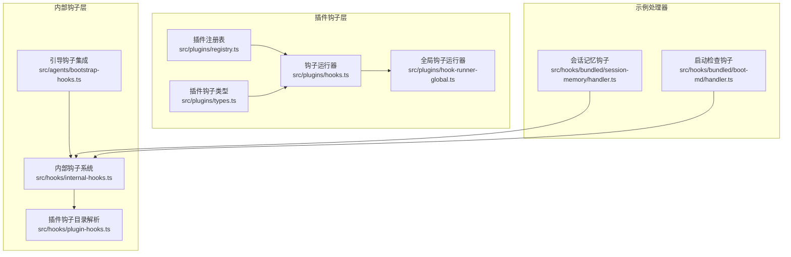
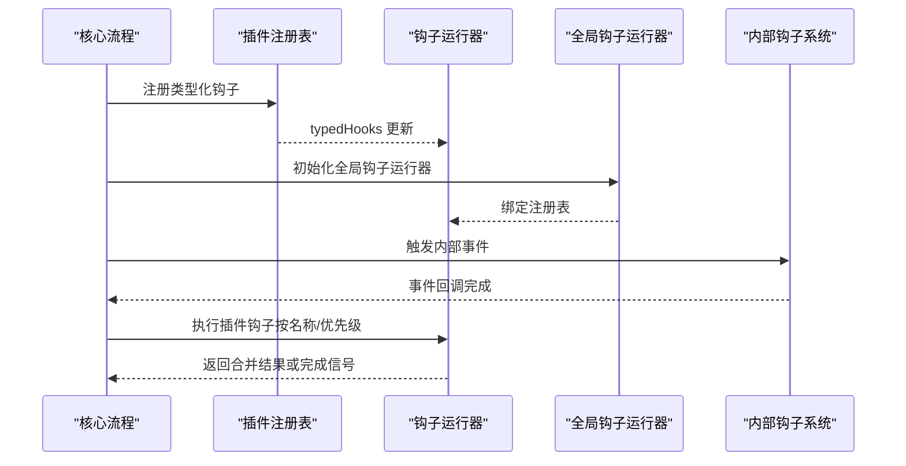
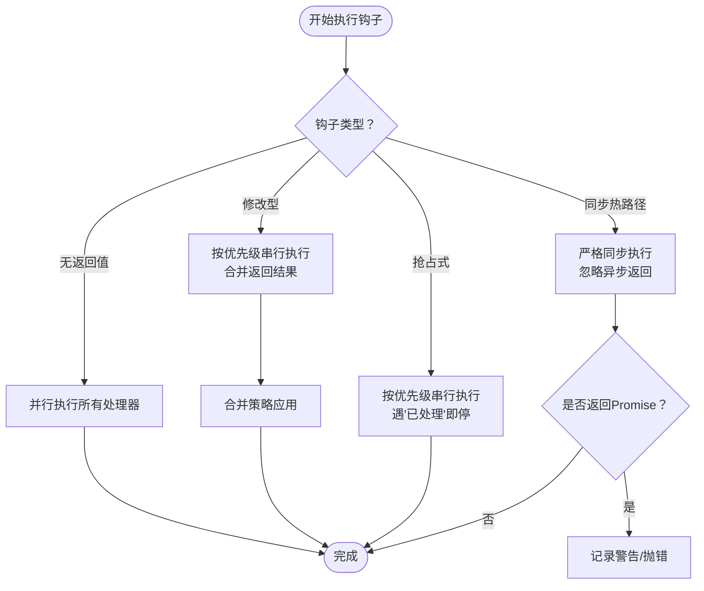
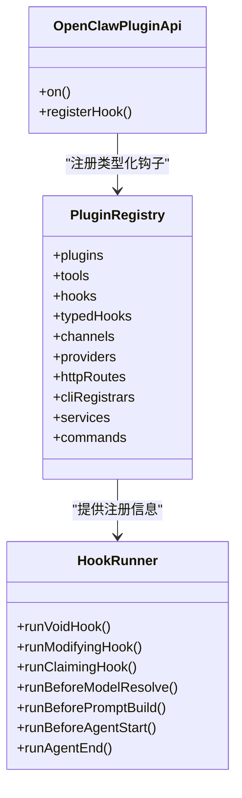
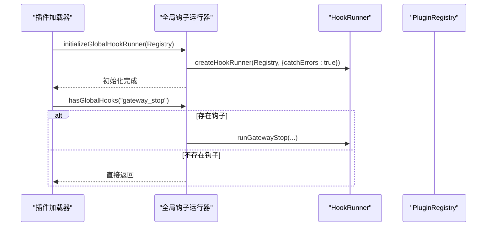
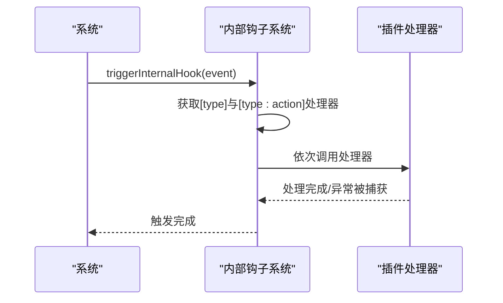
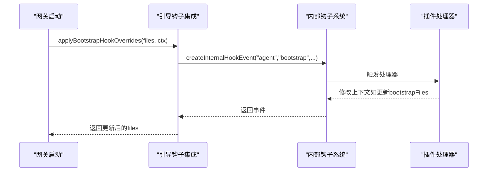
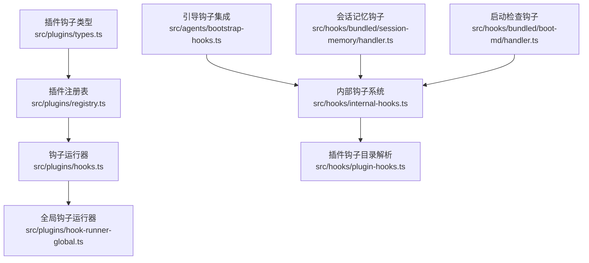

# 钩子点与拦截机制

<cite>
**本文档引用的文件**
- [src/plugins/hooks.ts](file://src/plugins/hooks.ts)
- [src/plugins/registry.ts](file://src/plugins/registry.ts)
- [src/plugins/hook-runner-global.ts](file://src/plugins/hook-runner-global.ts)
- [src/plugins/types.ts](file://src/plugins/types.ts)
- [src/hooks/internal-hooks.ts](file://src/hooks/internal-hooks.ts)
- [src/hooks/plugin-hooks.ts](file://src/hooks/plugin-hooks.ts)
- [src/agents/bootstrap-hooks.ts](file://src/agents/bootstrap-hooks.ts)
- [src/hooks/bundled/session-memory/handler.ts](file://src/hooks/bundled/session-memory/handler.ts)
- [src/hooks/bundled/boot-md/handler.ts](file://src/hooks/bundled/boot-md/handler.ts)
</cite>

## 目录
1. [简介](#简介)
2. [项目结构](#项目结构)
3. [核心组件](#核心组件)
4. [架构总览](#架构总览)
5. [详细组件分析](#详细组件分析)
6. [依赖关系分析](#依赖关系分析)
7. [性能考量](#性能考量)
8. [故障排查指南](#故障排查指南)
9. [结论](#结论)
10. [附录](#附录)

## 简介
本文件系统性阐述 OpenClaw 的钩子点与拦截机制，覆盖两类钩子体系：
- 插件钩子（Plugin Hooks）：面向插件生命周期与运行时事件的强类型拦截点，支持优先级、合并策略与错误隔离。
- 内部钩子（Internal Hooks）：面向系统内部事件（如命令、会话、网关启动等）的弱类型事件总线，支持按事件类型或具体事件动作监听。

重点涵盖以下关键钩子点的注册、执行时机、参数传递、返回值处理与异常传播：
- agent:bootstrap（内部钩子）
- before_model_resolve（插件钩子）
- before_prompt_build（插件钩子）
- before_agent_start（插件钩子，兼容路径）
- agent_end（插件钩子）
- 其他常用钩子：before_tool_call、after_tool_call、message_sending、message_sent 等

## 项目结构
钩子相关代码主要分布在以下模块：
- 插件钩子运行与注册：src/plugins/hooks.ts、src/plugins/registry.ts、src/plugins/hook-runner-global.ts、src/plugins/types.ts
- 内部钩子系统：src/hooks/internal-hooks.ts、src/hooks/plugin-hooks.ts、src/agents/bootstrap-hooks.ts
- 示例钩子处理器：src/hooks/bundled/session-memory/handler.ts、src/hooks/bundled/boot-md/handler.ts

**图表来源**
- [src/plugins/registry.ts:171-186](file://src/plugins/registry.ts#L171-L186)
- [src/plugins/hooks.ts:159-525](file://src/plugins/hooks.ts#L159-L525)
- [src/plugins/hook-runner-global.ts:36-52](file://src/plugins/hook-runner-global.ts#L36-L52)
- [src/plugins/types.ts:1166-1200](file://src/plugins/types.ts#L1166-L1200)
- [src/hooks/internal-hooks.ts:186-288](file://src/hooks/internal-hooks.ts#L186-L288)
- [src/hooks/plugin-hooks.ts:20-95](file://src/hooks/plugin-hooks.ts#L20-L95)
- [src/agents/bootstrap-hooks.ts:7-31](file://src/agents/bootstrap-hooks.ts#L7-L31)
- [src/hooks/bundled/session-memory/handler.ts:199-372](file://src/hooks/bundled/session-memory/handler.ts#L199-L372)
- [src/hooks/bundled/boot-md/handler.ts:10-45](file://src/hooks/bundled/boot-md/handler.ts#L10-L45)

**章节来源**
- [src/plugins/hooks.ts:159-525](file://src/plugins/hooks.ts#L159-L525)
- [src/plugins/registry.ts:171-186](file://src/plugins/registry.ts#L171-L186)
- [src/plugins/hook-runner-global.ts:36-52](file://src/plugins/hook-runner-global.ts#L36-L52)
- [src/plugins/types.ts:1166-1200](file://src/plugins/types.ts#L1166-L1200)
- [src/hooks/internal-hooks.ts:186-288](file://src/hooks/internal-hooks.ts#L186-L288)
- [src/hooks/plugin-hooks.ts:20-95](file://src/hooks/plugin-hooks.ts#L20-L95)
- [src/agents/bootstrap-hooks.ts:7-31](file://src/agents/bootstrap-hooks.ts#L7-L31)
- [src/hooks/bundled/session-memory/handler.ts:199-372](file://src/hooks/bundled/session-memory/handler.ts#L199-L372)
- [src/hooks/bundled/boot-md/handler.ts:10-45](file://src/hooks/bundled/boot-md/handler.ts#L10-L45)

## 核心组件
- 钩子运行器（HookRunner）：负责按钩子名称检索、排序（按优先级）、并发/串行执行，并对异常进行捕获或抛出控制。
- 插件注册表（PluginRegistry）：维护插件工具、HTTP 路由、通道、提供者、服务、命令以及钩子注册信息；支持类型化钩子注册与策略约束。
- 全局钩子运行器（Global Hook Runner）：在插件加载完成后初始化，提供跨模块安全调用能力。
- 内部钩子系统（Internal Hooks）：事件驱动的弱类型钩子，支持按事件类型或具体事件动作监听，处理器按注册顺序执行，异常被记录但不中断其他处理器。

**章节来源**
- [src/plugins/hooks.ts:159-525](file://src/plugins/hooks.ts#L159-L525)
- [src/plugins/registry.ts:171-186](file://src/plugins/registry.ts#L171-L186)
- [src/plugins/hook-runner-global.ts:36-52](file://src/plugins/hook-runner-global.ts#L36-L52)
- [src/hooks/internal-hooks.ts:186-288](file://src/hooks/internal-hooks.ts#L186-L288)

## 架构总览
插件钩子与内部钩子通过统一的注册与执行框架协同工作：
- 插件通过 OpenClawPluginApi.on 注册类型化钩子，注册表将钩子存入 typedHooks 并可选地同步注册到内部钩子系统。
- 钩子运行器从注册表中按名称提取钩子，按优先级排序后执行；修改型钩子采用串行合并策略，无返回值钩子并行执行。
- 全局钩子运行器在插件加载阶段初始化，提供安全的跨模块调用入口。
- 内部钩子事件由系统触发，插件可选择监听特定事件或事件动作，处理器异步执行且互不影响。

**图表来源**
- [src/plugins/registry.ts:706-753](file://src/plugins/registry.ts#L706-L753)
- [src/plugins/hooks.ts:159-525](file://src/plugins/hooks.ts#L159-L525)
- [src/plugins/hook-runner-global.ts:36-52](file://src/plugins/hook-runner-global.ts#L36-L52)
- [src/hooks/internal-hooks.ts:270-288](file://src/hooks/internal-hooks.ts#L270-L288)

## 详细组件分析

### 插件钩子运行器（HookRunner）
- 钩子分类与执行策略
  - 无返回值钩子（fire-and-forget）：并行执行，适合日志、观测类钩子（如 agent_end、llm_input、llm_output、message_sent 等）。
  - 修改型钩子（sequential merge）：按优先级串行执行，逐个合并返回结果（如 before_model_resolve、before_prompt_build、message_sending 等）。
  - 抢占式钩子（first-claim wins）：按优先级串行执行，遇到第一个声明“已处理”的结果即停止（如 inbound_claim）。
  - 同步钩子（hot path）：严格限制为同步执行，避免异步副作用（如 tool_result_persist、before_message_write）。
- 错误处理
  - 可配置 catchErrors：默认捕获并记录错误，不中断其他钩子执行；若关闭则抛出聚合错误。
  - 对同步钩子的异步返回进行显式警告或抛错，确保热路径稳定性。
- 结果合并策略
  - before_model_resolve：保留首个非空覆盖项（provider/model）。
  - before_prompt_build：拼接上下文文本段，允许覆盖系统提示词。
  - message_sending：允许取消发送或覆盖内容。
  - tool_result_persist/before_message_write：链式处理，支持阻断或消息替换。

**图表来源**
- [src/plugins/hooks.ts:242-303](file://src/plugins/hooks.ts#L242-L303)
- [src/plugins/hooks.ts:308-334](file://src/plugins/hooks.ts#L308-L334)
- [src/plugins/hooks.ts:672-719](file://src/plugins/hooks.ts#L672-L719)
- [src/plugins/hooks.ts:737-796](file://src/plugins/hooks.ts#L737-L796)

**章节来源**
- [src/plugins/hooks.ts:242-303](file://src/plugins/hooks.ts#L242-L303)
- [src/plugins/hooks.ts:308-334](file://src/plugins/hooks.ts#L308-L334)
- [src/plugins/hooks.ts:672-719](file://src/plugins/hooks.ts#L672-L719)
- [src/plugins/hooks.ts:737-796](file://src/plugins/hooks.ts#L737-L796)

### 插件注册表与类型化钩子
- 类型化钩子注册
  - 支持按钩子名注册处理器，并设置优先级；注册时进行有效性校验与冲突检测。
  - 对某些钩子（如 before_agent_start）可启用策略约束，阻止或规范化提示注入行为。
- 内部钩子桥接
  - 当插件通过 OpenClawPluginApi.registerHook 注册事件钩子时，可选择自动注册到内部钩子系统，实现与内部事件的联动。

**图表来源**
- [src/plugins/registry.ts:171-186](file://src/plugins/registry.ts#L171-L186)
- [src/plugins/hooks.ts:159-525](file://src/plugins/hooks.ts#L159-L525)
- [src/plugins/types.ts:1142-1147](file://src/plugins/types.ts#L1142-L1147)

**章节来源**
- [src/plugins/registry.ts:706-753](file://src/plugins/registry.ts#L706-L753)
- [src/plugins/types.ts:1142-1147](file://src/plugins/types.ts#L1142-L1147)

### 全局钩子运行器
- 初始化与状态管理
  - 在插件加载完成后初始化，绑定当前注册表，记录钩子数量并输出日志。
  - 提供获取全局运行器与注册表的接口，便于跨模块调用。
- 安全调用
  - 提供 runGlobalGatewayStopSafely 包装器，当存在 gateway_stop 钩子时安全执行，异常可回调或记录。

**图表来源**
- [src/plugins/hook-runner-global.ts:36-52](file://src/plugins/hook-runner-global.ts#L36-L52)
- [src/plugins/hook-runner-global.ts:77-95](file://src/plugins/hook-runner-global.ts#L77-L95)

**章节来源**
- [src/plugins/hook-runner-global.ts:36-52](file://src/plugins/hook-runner-global.ts#L36-L52)
- [src/plugins/hook-runner-global.ts:77-95](file://src/plugins/hook-runner-global.ts#L77-L95)

### 内部钩子系统
- 事件模型
  - 事件包含 type、action、sessionKey、context、timestamp 和 messages 字段。
  - 支持按通用事件类型（如 "command"）或具体事件动作（如 "command:new"）注册处理器。
- 触发与执行
  - 触发时先执行通用类型处理器，再执行具体动作处理器，保证覆盖范围。
  - 异常被捕获并记录，不影响后续处理器执行。
- 与插件钩子的集成
  - 插件可通过 OpenClawPluginApi.registerHook 将内部钩子事件映射为插件钩子，实现统一的拦截与扩展。

**图表来源**
- [src/hooks/internal-hooks.ts:270-288](file://src/hooks/internal-hooks.ts#L270-L288)
- [src/hooks/plugin-hooks.ts:20-95](file://src/hooks/plugin-hooks.ts#L20-L95)

**章节来源**
- [src/hooks/internal-hooks.ts:186-288](file://src/hooks/internal-hooks.ts#L186-L288)
- [src/hooks/plugin-hooks.ts:20-95](file://src/hooks/plugin-hooks.ts#L20-L95)

### 关键钩子点与执行时机

#### agent:bootstrap（内部钩子）
- 触发时机：网关启动时，针对每个代理的工作空间进行引导。
- 参数传递：包含 workspaceDir、bootstrapFiles、cfg、sessionKey、sessionId、agentId 等上下文。
- 执行方式：通过内部钩子系统触发，插件可监听 "agent:bootstrap" 事件并修改 bootstrapFiles。
- 实现参考：引导钩子集成模块负责创建事件并触发内部钩子，最终返回更新后的文件列表。

**图表来源**
- [src/agents/bootstrap-hooks.ts:7-31](file://src/agents/bootstrap-hooks.ts#L7-L31)
- [src/hooks/internal-hooks.ts:298-312](file://src/hooks/internal-hooks.ts#L298-L312)

**章节来源**
- [src/agents/bootstrap-hooks.ts:7-31](file://src/agents/bootstrap-hooks.ts#L7-L31)
- [src/hooks/internal-hooks.ts:298-312](file://src/hooks/internal-hooks.ts#L298-L312)

#### before_model_resolve（插件钩子）
- 触发时机：模型解析前，用于决定最终使用的 provider 与 model。
- 参数传递：prompt（用户输入），上下文包含 agentId、sessionKey、sessionId、workspaceDir 等。
- 返回值：可覆盖 provider 或 model；按优先级取首个非空覆盖项。
- 典型用途：根据用户身份、会话状态或外部条件动态切换模型。

**章节来源**
- [src/plugins/hooks.ts:430-440](file://src/plugins/hooks.ts#L430-L440)
- [src/plugins/types.ts:1256-1267](file://src/plugins/types.ts#L1256-L1267)

#### before_prompt_build（插件钩子）
- 触发时机：构建提示词前，接收当前会话消息与用户输入。
- 参数传递：prompt、messages（会话历史），上下文同上。
- 返回值：可覆盖 systemPrompt，并拼接 prepend/append 上下文；多处理器按优先级合并。
- 典型用途：注入系统指令、会话摘要、角色设定等。

**章节来源**
- [src/plugins/hooks.ts:446-456](file://src/plugins/hooks.ts#L446-L456)
- [src/plugins/types.ts:1269-1274](file://src/plugins/types.ts#L1269-L1274)

#### before_agent_start（插件钩子，兼容路径）
- 触发时机：兼容旧版 before_agent_start 钩子，同时合并 before_model_resolve 与 before_prompt_build 的结果。
- 行为：作为遗留路径存在，建议迁移至新的分阶段钩子以获得更清晰的控制流。

**章节来源**
- [src/plugins/hooks.ts:462-475](file://src/plugins/hooks.ts#L462-L475)

#### agent_end（插件钩子）
- 触发时机：一次对话结束后，用于统计、归档或清理。
- 执行方式：并行 fire-and-forget，适合日志与观测类任务。
- 典型用途：发送统计报告、清理临时资源、触发外部通知。

**章节来源**
- [src/plugins/hooks.ts:482-487](file://src/plugins/hooks.ts#L482-L487)

#### 其他常用钩子
- before_tool_call / after_tool_call：在工具调用前后拦截，支持阻断与参数修改、观测输出。
- message_sending / message_sent：在消息发送前后拦截，支持取消与内容修改、观测发送结果。
- tool_result_persist / before_message_write：同步热路径钩子，支持消息替换与阻断。

**章节来源**
- [src/plugins/hooks.ts:635-660](file://src/plugins/hooks.ts#L635-L660)
- [src/plugins/hooks.ts:672-719](file://src/plugins/hooks.ts#L672-L719)
- [src/plugins/hooks.ts:737-796](file://src/plugins/hooks.ts#L737-L796)

### 示例钩子处理器

#### 会话记忆钩子（保存会话摘要）
- 触发条件：命令事件（/new 或 /reset）。
- 功能：读取最近会话内容，生成描述性标题，写入内存目录。
- 与内部钩子联动：监听 command:new/reset 事件，基于上下文与会话文件生成摘要并持久化。

**章节来源**
- [src/hooks/bundled/session-memory/handler.ts:199-372](file://src/hooks/bundled/session-memory/handler.ts#L199-L372)

#### 启动检查钩子（网关启动时的引导清单）
- 触发条件：网关启动事件。
- 功能：遍历代理工作空间，执行一次性引导流程，记录失败或跳过原因。

**章节来源**
- [src/hooks/bundled/boot-md/handler.ts:10-45](file://src/hooks/bundled/boot-md/handler.ts#L10-L45)

## 依赖关系分析

**图表来源**
- [src/plugins/types.ts:1166-1200](file://src/plugins/types.ts#L1166-L1200)
- [src/plugins/registry.ts:171-186](file://src/plugins/registry.ts#L171-L186)
- [src/plugins/hooks.ts:159-525](file://src/plugins/hooks.ts#L159-L525)
- [src/plugins/hook-runner-global.ts:36-52](file://src/plugins/hook-runner-global.ts#L36-L52)
- [src/hooks/internal-hooks.ts:186-288](file://src/hooks/internal-hooks.ts#L186-L288)
- [src/hooks/plugin-hooks.ts:20-95](file://src/hooks/plugin-hooks.ts#L20-L95)
- [src/agents/bootstrap-hooks.ts:7-31](file://src/agents/bootstrap-hooks.ts#L7-L31)
- [src/hooks/bundled/session-memory/handler.ts:199-372](file://src/hooks/bundled/session-memory/handler.ts#L199-L372)
- [src/hooks/bundled/boot-md/handler.ts:10-45](file://src/hooks/bundled/boot-md/handler.ts#L10-L45)

**章节来源**
- [src/plugins/types.ts:1166-1200](file://src/plugins/types.ts#L1166-L1200)
- [src/plugins/registry.ts:171-186](file://src/plugins/registry.ts#L171-L186)
- [src/plugins/hooks.ts:159-525](file://src/plugins/hooks.ts#L159-L525)
- [src/plugins/hook-runner-global.ts:36-52](file://src/plugins/hook-runner-global.ts#L36-L52)
- [src/hooks/internal-hooks.ts:186-288](file://src/hooks/internal-hooks.ts#L186-L288)
- [src/hooks/plugin-hooks.ts:20-95](file://src/hooks/plugin-hooks.ts#L20-L95)
- [src/agents/bootstrap-hooks.ts:7-31](file://src/agents/bootstrap-hooks.ts#L7-L31)
- [src/hooks/bundled/session-memory/handler.ts:199-372](file://src/hooks/bundled/session-memory/handler.ts#L199-L372)
- [src/hooks/bundled/boot-md/handler.ts:10-45](file://src/hooks/bundled/boot-md/handler.ts#L10-L45)

## 性能考量
- 并行执行优化：无返回值钩子采用 Promise.all 并行执行，显著降低延迟。
- 串行合并策略：修改型钩子按优先级串行，避免竞态；建议插件合理设置优先级，减少不必要的复杂度。
- 同步热路径保护：tool_result_persist 与 before_message_write 明确为同步钩子，防止异步副作用影响会话写入性能。
- 错误隔离：默认 catchErrors=true，避免单个钩子异常影响整体流程；必要时可通过选项关闭以暴露问题。

[本节为通用指导，无需列出具体文件来源]

## 故障排查指南
- 钩子未生效
  - 检查钩子名称是否正确（区分大小写与拼写）。
  - 确认插件已启用且注册成功；查看注册表中的 typedHooks 列表。
  - 对于内部钩子，确认事件类型与动作匹配（如 "command:new" vs "command"）。
- 异常处理
  - 若 catchErrors=true，错误会被记录但不会中断其他钩子；可在日志中定位具体插件与钩子名。
  - 同步钩子返回 Promise 会被视为错误并记录或抛错，需修正为同步返回。
- 性能问题
  - 并行钩子过多可能导致资源争用；适当拆分或降级为串行钩子。
  - 修改型钩子合并逻辑复杂时，建议简化合并策略或减少处理器数量。

**章节来源**
- [src/plugins/hooks.ts:217-230](file://src/plugins/hooks.ts#L217-L230)
- [src/plugins/hooks.ts:692-702](file://src/plugins/hooks.ts#L692-L702)
- [src/plugins/hooks.ts:757-767](file://src/plugins/hooks.ts#L757-L767)

## 结论
OpenClaw 的钩子体系通过“插件钩子 + 内部钩子”的双轨设计，实现了对代理生命周期与系统事件的全面拦截与扩展。插件钩子提供强类型的、可合并的拦截点，内部钩子提供灵活的事件总线能力。配合全局钩子运行器与严格的错误隔离策略，既保证了扩展性，也确保了系统的稳定性与可观测性。

[本节为总结性内容，无需列出具体文件来源]

## 附录

### 钩子开发 API 规范与最佳实践
- 注册类型化钩子
  - 使用 OpenClawPluginApi.on 注册，指定钩子名与处理器，可设置优先级。
  - 对敏感钩子（如 before_agent_start）可配置策略，避免意外的提示注入。
- 参数与上下文
  - 钩子处理器接收 event 与 ctx 两个参数；event 为钩子专用数据结构，ctx 为共享上下文（agentId、sessionKey、sessionId、workspaceDir 等）。
- 返回值与合并
  - 修改型钩子应返回明确的数据结构，遵循对应钩子的合并策略；避免返回未定义或无效值。
- 错误处理
  - 建议保持幂等与可重试；对可能失败的操作使用超时与重试策略。
- 性能与可靠性
  - 将耗时操作移至后台或异步任务；热路径钩子必须保持同步与轻量。
  - 对外部依赖（网络、文件系统）添加超时与降级逻辑。

**章节来源**
- [src/plugins/types.ts:1142-1147](file://src/plugins/types.ts#L1142-L1147)
- [src/plugins/registry.ts:706-753](file://src/plugins/registry.ts#L706-L753)
- [src/plugins/hooks.ts:163-205](file://src/plugins/hooks.ts#L163-L205)