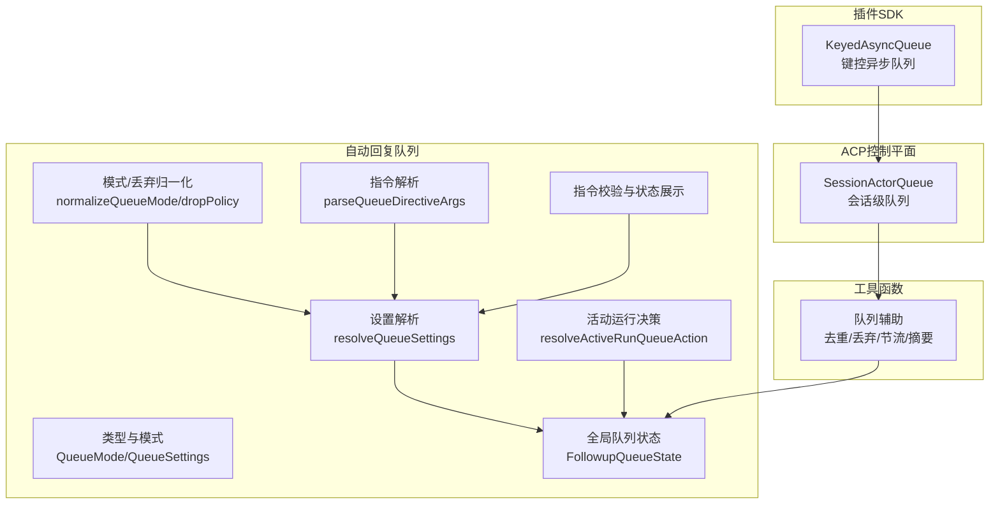
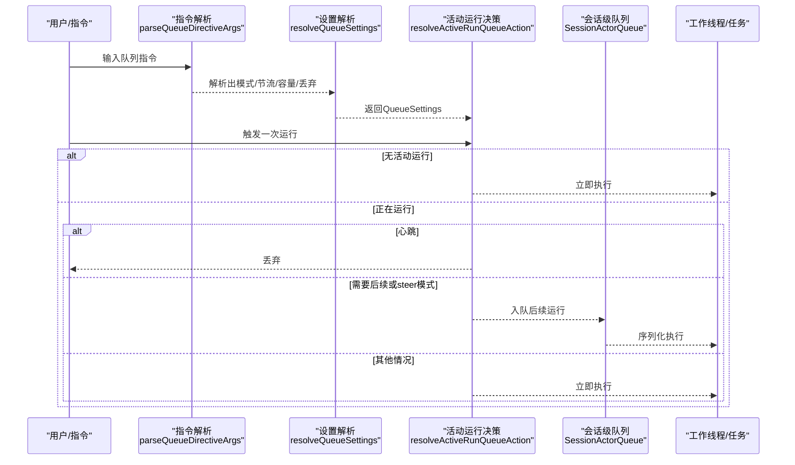
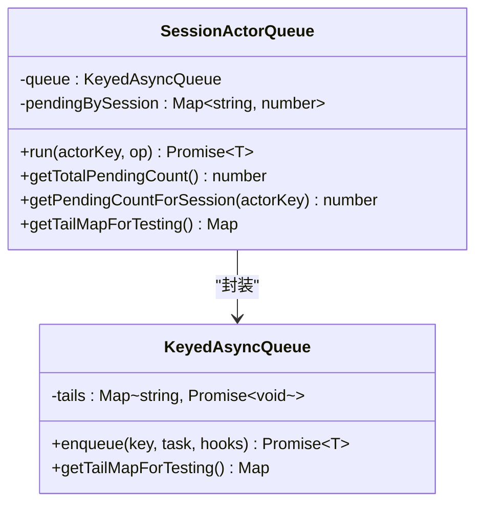
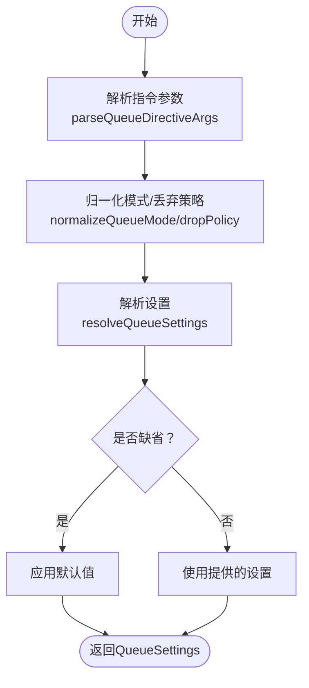
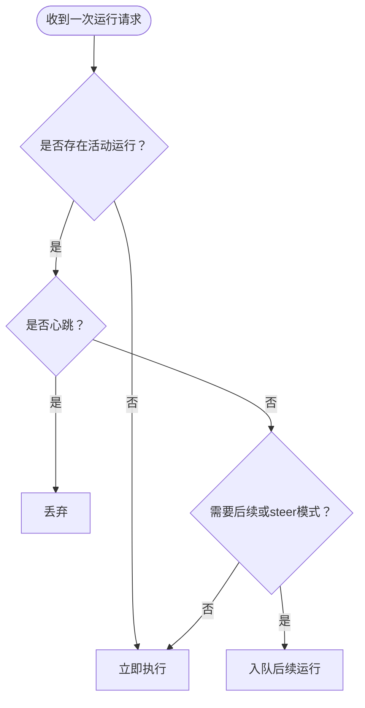
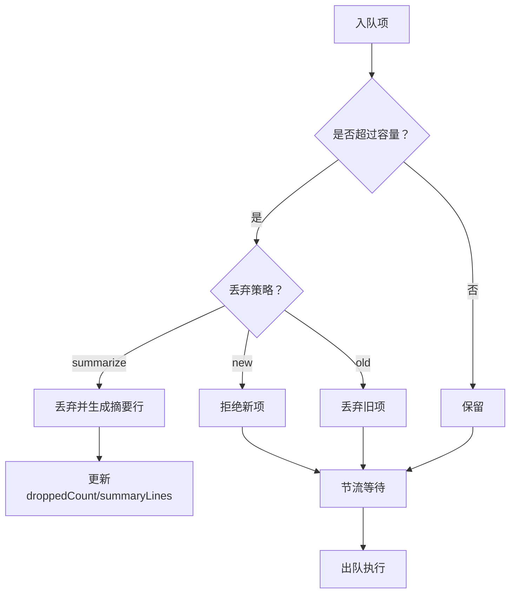
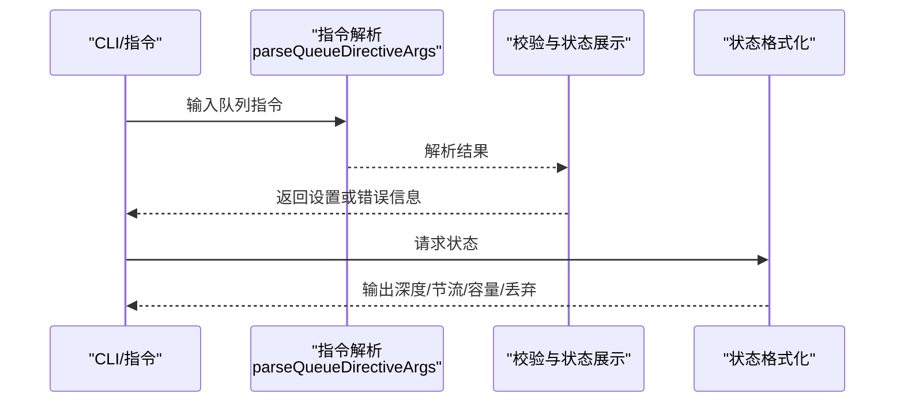
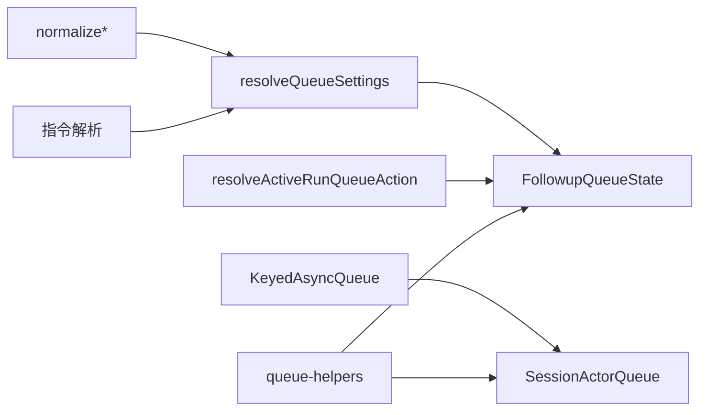

# 队列管理与并发控制

<cite>
**本文引用的文件**
- [src/plugin-sdk/keyed-async-queue.ts](file://src/plugin-sdk/keyed-async-queue.ts)
- [src/acp/control-plane/session-actor-queue.ts](file://src/acp/control-plane/session-actor-queue.ts)
- [src/auto-reply/reply/queue/types.ts](file://src/auto-reply/reply/queue/types.ts)
- [src/auto-reply/reply/queue/settings.ts](file://src/auto-reply/reply/queue/settings.ts)
- [src/auto-reply/reply/queue/normalize.ts](file://src/auto-reply/reply/queue/normalize.ts)
- [src/auto-reply/reply/queue/state.ts](file://src/auto-reply/reply/queue/state.ts)
- [src/auto-reply/reply/queue-policy.ts](file://src/auto-reply/reply/queue-policy.ts)
- [src/auto-reply/reply/queue/directive.ts](file://src/auto-reply/reply/queue/directive.ts)
- [src/auto-reply/reply/directive-handling.queue-validation.ts](file://src/auto-reply/reply/directive-handling.queue-validation.ts)
- [src/auto-reply/status.ts](file://src/auto-reply/status.ts)
- [src/utils/queue-helpers.ts](file://src/utils/queue-helpers.ts)
- [src/process/command-queue.test.ts](file://src/process/command-queue.test.ts)
</cite>

## 目录
1. [引言](#引言)
2. [项目结构](#项目结构)
3. [核心组件](#核心组件)
4. [架构总览](#架构总览)
5. [详细组件分析](#详细组件分析)
6. [依赖关系分析](#依赖关系分析)
7. [性能考量](#性能考量)
8. [故障排查指南](#故障排查指南)
9. [结论](#结论)
10. [附录](#附录)

## 引言
本文件系统性阐述 OpenClaw 的代理队列管理与并发控制机制，重点覆盖：
- 会话级别的序列化执行（基于键控异步队列）
- 全局队列与会话“车道”（按会话键隔离）的调度算法
- collect/steer/followup 等队列模式的工作原理与选择策略
- 消息通道如何根据上下文选择合适的队列模式
- 并发控制策略、死锁预防、超时与资源竞争的解决方案
- 队列性能监控指标与调优建议

## 项目结构
围绕队列与并发控制的关键模块分布如下：
- 插件 SDK 提供通用键控异步队列基础设施
- ACP 控制平面提供会话级队列封装
- 自动回复子系统定义队列模式、设置解析、指令解析与状态持久化
- 工具函数提供去重、丢弃策略、节流与溢出摘要等能力
- 进程命令队列测试验证并发与排空行为

**图表来源**
- [src/plugin-sdk/keyed-async-queue.ts:1-49](file://src/plugin-sdk/keyed-async-queue.ts#L1-L49)
- [src/acp/control-plane/session-actor-queue.ts:1-38](file://src/acp/control-plane/session-actor-queue.ts#L1-L38)
- [src/auto-reply/reply/queue/types.ts:1-94](file://src/auto-reply/reply/queue/types.ts#L1-L94)
- [src/auto-reply/reply/queue/settings.ts:1-69](file://src/auto-reply/reply/queue/settings.ts#L1-L69)
- [src/auto-reply/reply/queue/normalize.ts:1-45](file://src/auto-reply/reply/queue/normalize.ts#L1-L45)
- [src/auto-reply/reply/queue/state.ts:1-88](file://src/auto-reply/reply/queue/state.ts#L1-L88)
- [src/auto-reply/reply/queue-policy.ts:1-22](file://src/auto-reply/reply/queue-policy.ts#L1-L22)
- [src/auto-reply/reply/queue/directive.ts:1-122](file://src/auto-reply/reply/queue/directive.ts#L1-L122)
- [src/auto-reply/reply/directive-handling.queue-validation.ts:1-50](file://src/auto-reply/reply/directive-handling.queue-validation.ts#L1-L50)
- [src/utils/queue-helpers.ts:1-260](file://src/utils/queue-helpers.ts#L1-L260)

**章节来源**
- [src/plugin-sdk/keyed-async-queue.ts:1-49](file://src/plugin-sdk/keyed-async-queue.ts#L1-L49)
- [src/acp/control-plane/session-actor-queue.ts:1-38](file://src/acp/control-plane/session-actor-queue.ts#L1-L38)
- [src/auto-reply/reply/queue/types.ts:1-94](file://src/auto-reply/reply/queue/types.ts#L1-L94)
- [src/auto-reply/reply/queue/settings.ts:1-69](file://src/auto-reply/reply/queue/settings.ts#L1-L69)
- [src/auto-reply/reply/queue/normalize.ts:1-45](file://src/auto-reply/reply/queue/normalize.ts#L1-L45)
- [src/auto-reply/reply/queue/state.ts:1-88](file://src/auto-reply/reply/queue/state.ts#L1-L88)
- [src/auto-reply/reply/queue-policy.ts:1-22](file://src/auto-reply/reply/queue-policy.ts#L1-L22)
- [src/auto-reply/reply/queue/directive.ts:1-122](file://src/auto-reply/reply/queue/directive.ts#L1-L122)
- [src/auto-reply/reply/directive-handling.queue-validation.ts:1-50](file://src/auto-reply/reply/directive-handling.queue-validation.ts#L1-L50)
- [src/utils/queue-helpers.ts:1-260](file://src/utils/queue-helpers.ts#L1-L260)

## 核心组件
- 键控异步队列（KeyedAsyncQueue）：以键为单位串行化任务，保证同一键的任务顺序执行，并提供钩子统计排队数
- 会话级队列（SessionActorQueue）：在键控队列之上，按会话键进行封装，暴露排队计数查询接口
- 队列设置与模式（QueueSettings/QueueMode）：定义模式（steer/followup/collect/steer-backlog/interrupt）、容量、丢弃策略、节流时间
- 全局队列状态（FollowupQueueState）：跨批处理共享的队列注册表，支持运行时设置更新与溢出摘要
- 活动运行决策（resolveActiveRunQueueAction）：根据是否正在运行、心跳、是否需要后续运行、队列模式决定立即执行、入队或丢弃
- 指令解析与校验：从用户指令解析队列模式、节流、容量、丢弃策略，并提供当前设置查询与错误提示
- 队列辅助工具：去重、丢弃策略（保留新/旧/摘要）、节流等待、溢出摘要构建、集合式收集与跨通道处理

**章节来源**
- [src/plugin-sdk/keyed-async-queue.ts:1-49](file://src/plugin-sdk/keyed-async-queue.ts#L1-L49)
- [src/acp/control-plane/session-actor-queue.ts:1-38](file://src/acp/control-plane/session-actor-queue.ts#L1-L38)
- [src/auto-reply/reply/queue/types.ts:1-94](file://src/auto-reply/reply/queue/types.ts#L1-L94)
- [src/auto-reply/reply/queue/state.ts:1-88](file://src/auto-reply/reply/queue/state.ts#L1-L88)
- [src/auto-reply/reply/queue-policy.ts:1-22](file://src/auto-reply/reply/queue-policy.ts#L1-L22)
- [src/auto-reply/reply/queue/directive.ts:1-122](file://src/auto-reply/reply/queue/directive.ts#L1-L122)
- [src/auto-reply/reply/directive-handling.queue-validation.ts:1-50](file://src/auto-reply/reply/directive-handling.queue-validation.ts#L1-L50)
- [src/utils/queue-helpers.ts:1-260](file://src/utils/queue-helpers.ts#L1-L260)

## 架构总览
下图展示了从“消息通道/指令输入”到“队列模式选择与执行”的端到端流程。

**图表来源**
- [src/auto-reply/reply/queue/directive.ts:1-122](file://src/auto-reply/reply/queue/directive.ts#L1-L122)
- [src/auto-reply/reply/queue/settings.ts:1-69](file://src/auto-reply/reply/queue/settings.ts#L1-L69)
- [src/auto-reply/reply/queue-policy.ts:1-22](file://src/auto-reply/reply/queue-policy.ts#L1-L22)
- [src/acp/control-plane/session-actor-queue.ts:1-38](file://src/acp/control-plane/session-actor-queue.ts#L1-L38)

## 详细组件分析

### 组件A：键控异步队列与会话级队列
- 键控队列通过 Map 记录每个键的尾部 Promise，新任务以“前一个尾部完成”为前置条件串行化执行
- 会话级队列在键控队列之上，维护每个会话键的排队计数，便于外部观察与限流

**图表来源**
- [src/plugin-sdk/keyed-async-queue.ts:1-49](file://src/plugin-sdk/keyed-async-queue.ts#L1-L49)
- [src/acp/control-plane/session-actor-queue.ts:1-38](file://src/acp/control-plane/session-actor-queue.ts#L1-L38)

**章节来源**
- [src/plugin-sdk/keyed-async-queue.ts:1-49](file://src/plugin-sdk/keyed-async-queue.ts#L1-L49)
- [src/acp/control-plane/session-actor-queue.ts:1-38](file://src/acp/control-plane/session-actor-queue.ts#L1-L38)

### 组件B：队列模式与设置解析
- 支持的模式：steer（引导）、followup（后续）、collect（聚合）、steer-backlog（引导+回压）、interrupt（中断）
- 设置来源优先级：内联选项 > 会话条目 > 渠道插件默认 > 全局配置 > 默认值
- 归一化函数将多种别名映射为标准模式/丢弃策略
- 全局队列状态以进程级 Map 存储，支持运行时更新节流、容量、丢弃策略

**图表来源**
- [src/auto-reply/reply/queue/directive.ts:1-122](file://src/auto-reply/reply/queue/directive.ts#L1-L122)
- [src/auto-reply/reply/queue/normalize.ts:1-45](file://src/auto-reply/reply/queue/normalize.ts#L1-L45)
- [src/auto-reply/reply/queue/settings.ts:1-69](file://src/auto-reply/reply/queue/settings.ts#L1-L69)
- [src/auto-reply/reply/queue/state.ts:1-88](file://src/auto-reply/reply/queue/state.ts#L1-L88)

**章节来源**
- [src/auto-reply/reply/queue/types.ts:1-94](file://src/auto-reply/reply/queue/types.ts#L1-L94)
- [src/auto-reply/reply/queue/settings.ts:1-69](file://src/auto-reply/reply/queue/settings.ts#L1-L69)
- [src/auto-reply/reply/queue/normalize.ts:1-45](file://src/auto-reply/reply/queue/normalize.ts#L1-L45)
- [src/auto-reply/reply/queue/state.ts:1-88](file://src/auto-reply/reply/queue/state.ts#L1-L88)

### 组件C：活动运行决策与队列模式
- 当存在活动运行时，心跳请求直接丢弃；非心跳且需要后续或 steer 模式则入队后续运行；否则可立即执行
- 该决策逻辑贯穿自动回复与会话处理，确保不会并发执行同一会话的主流程

**图表来源**
- [src/auto-reply/reply/queue-policy.ts:1-22](file://src/auto-reply/reply/queue-policy.ts#L1-L22)

**章节来源**
- [src/auto-reply/reply/queue-policy.ts:1-22](file://src/auto-reply/reply/queue-policy.ts#L1-L22)

### 组件D：全局队列与溢出摘要
- 全局队列状态包含 items、draining、lastEnqueuedAt、mode、debounceMs、cap、dropPolicy、droppedCount、summaryLines、lastRun
- 运行时可更新节流、容量、丢弃策略；当超出容量时按策略丢弃并生成摘要
- 节流等待基于自上次入队以来的时间差进行轮询检查

**图表来源**
- [src/auto-reply/reply/queue/state.ts:1-88](file://src/auto-reply/reply/queue/state.ts#L1-L88)
- [src/utils/queue-helpers.ts:84-133](file://src/utils/queue-helpers.ts#L84-L133)

**章节来源**
- [src/auto-reply/reply/queue/state.ts:1-88](file://src/auto-reply/reply/queue/state.ts#L1-L88)
- [src/utils/queue-helpers.ts:84-133](file://src/utils/queue-helpers.ts#L84-L133)

### 组件E：消息通道与队列模式选择
- 指令解析支持从用户输入中提取队列模式、节流、容量、丢弃策略
- 指令校验模块在无显式指令时返回当前生效的队列设置，帮助用户诊断
- 状态格式化模块将队列深度、节流、容量、丢弃策略以可读形式输出

**图表来源**
- [src/auto-reply/reply/queue/directive.ts:1-122](file://src/auto-reply/reply/queue/directive.ts#L1-L122)
- [src/auto-reply/reply/directive-handling.queue-validation.ts:1-50](file://src/auto-reply/reply/directive-handling.queue-validation.ts#L1-L50)
- [src/auto-reply/status.ts:184-209](file://src/auto-reply/status.ts#L184-L209)

**章节来源**
- [src/auto-reply/reply/queue/directive.ts:1-122](file://src/auto-reply/reply/queue/directive.ts#L1-L122)
- [src/auto-reply/reply/directive-handling.queue-validation.ts:1-50](file://src/auto-reply/reply/directive-handling.queue-validation.ts#L1-L50)
- [src/auto-reply/status.ts:184-209](file://src/auto-reply/status.ts#L184-L209)

## 依赖关系分析
- SessionActorQueue 依赖 KeyedAsyncQueue 实现键控串行化
- 自动回复队列设置解析依赖渠道插件默认值与全局配置
- 全局队列状态通过进程级 Map 共享，避免多实例重复构造
- 队列辅助工具被多个模块复用，统一去重、丢弃、节流与摘要逻辑

**图表来源**
- [src/plugin-sdk/keyed-async-queue.ts:1-49](file://src/plugin-sdk/keyed-async-queue.ts#L1-L49)
- [src/acp/control-plane/session-actor-queue.ts:1-38](file://src/acp/control-plane/session-actor-queue.ts#L1-L38)
- [src/auto-reply/reply/queue/settings.ts:1-69](file://src/auto-reply/reply/queue/settings.ts#L1-L69)
- [src/auto-reply/reply/queue/normalize.ts:1-45](file://src/auto-reply/reply/queue/normalize.ts#L1-L45)
- [src/auto-reply/reply/queue/state.ts:1-88](file://src/auto-reply/reply/queue/state.ts#L1-L88)
- [src/auto-reply/reply/queue-policy.ts:1-22](file://src/auto-reply/reply/queue-policy.ts#L1-L22)
- [src/utils/queue-helpers.ts:1-260](file://src/utils/queue-helpers.ts#L1-L260)

**章节来源**
- [src/plugin-sdk/keyed-async-queue.ts:1-49](file://src/plugin-sdk/keyed-async-queue.ts#L1-L49)
- [src/acp/control-plane/session-actor-queue.ts:1-38](file://src/acp/control-plane/session-actor-queue.ts#L1-L38)
- [src/auto-reply/reply/queue/settings.ts:1-69](file://src/auto-reply/reply/queue/settings.ts#L1-L69)
- [src/auto-reply/reply/queue/normalize.ts:1-45](file://src/auto-reply/reply/queue/normalize.ts#L1-L45)
- [src/auto-reply/reply/queue/state.ts:1-88](file://src/auto-reply/reply/queue/state.ts#L1-L88)
- [src/auto-reply/reply/queue-policy.ts:1-22](file://src/auto-reply/reply/queue-policy.ts#L1-L22)
- [src/utils/queue-helpers.ts:1-260](file://src/utils/queue-helpers.ts#L1-L260)

## 性能考量
- 串行化与键控：通过键控队列避免同一会话的并发执行，降低资源竞争与状态竞态
- 容量与丢弃：合理设置 cap 与 dropPolicy（old/new/summarize），在高负载下保持吞吐与可观测性
- 节流（debounceMs）：对高频入队场景进行时间窗口合并，减少无效抖动
- 去重与跨通道：在 collect 模式下识别跨通道项，必要时强制逐项处理，避免路由错误
- 运行时调整：通过运行时设置更新（applyQueueRuntimeSettings）动态适配突发流量
- 监控指标建议：
  - 深度（队列长度）、节流等待时间、丢弃数量、摘要行数、平均排队时长、会话排队计数
  - 可视化：折线图（深度/丢弃/摘要行数）、柱状图（各模式占比）、热力图（会话排队计数）

[本节为通用指导，无需具体文件来源]

## 故障排查指南
- 心跳风暴导致丢弃：若发现大量心跳被丢弃，检查队列模式是否为 steer 或 followup，确认是否需要后续运行
- 节流过长导致延迟：通过状态输出查看 debounceMs，必要时缩短或关闭
- 容量不足引发溢出：增大 cap 或切换丢弃策略为 new 以保留最新项
- 跨通道路由异常：collect 模式下若出现跨通道项，系统会强制逐项处理；检查 originatingChannel/destination 配置
- 排队堆积：使用会话级排队计数接口（getTotalPendingCount/getPendingCountForSession）定位热点会话
- 网关排空：进程命令队列测试覆盖了“标记网关排空后拒绝新入队”的行为，确保优雅停机不丢失数据

**章节来源**
- [src/auto-reply/reply/queue-policy.ts:1-22](file://src/auto-reply/reply/queue-policy.ts#L1-L22)
- [src/auto-reply/status.ts:184-209](file://src/auto-reply/status.ts#L184-L209)
- [src/utils/queue-helpers.ts:111-133](file://src/utils/queue-helpers.ts#L111-L133)
- [src/process/command-queue.test.ts:291-331](file://src/process/command-queue.test.ts#L291-L331)

## 结论
OpenClaw 的队列体系以键控异步队列为基石，结合会话级封装、全局队列状态与运行时设置，实现了：
- 会话级别的严格序列化执行
- 多模式（steer/followup/collect/steer-backlog/interrupt）灵活调度
- 可观测的容量控制、丢弃策略与溢出摘要
- 通过指令解析与校验实现用户可控的队列行为
配合节流与跨通道处理，整体具备良好的并发控制、死锁预防与资源竞争缓解能力。

[本节为总结，无需具体文件来源]

## 附录
- 指令解析要点：支持 debounce/cap/drop 等选项，以及模式别名归一化
- 设置解析要点：多源合并与默认值回退，确保在不同上下文下稳定生效
- 状态展示要点：深度、节流、容量、丢弃策略的可读输出，便于运维诊断

**章节来源**
- [src/auto-reply/reply/queue/directive.ts:1-122](file://src/auto-reply/reply/queue/directive.ts#L1-L122)
- [src/auto-reply/reply/queue/settings.ts:1-69](file://src/auto-reply/reply/queue/settings.ts#L1-L69)
- [src/auto-reply/status.ts:184-209](file://src/auto-reply/status.ts#L184-L209)