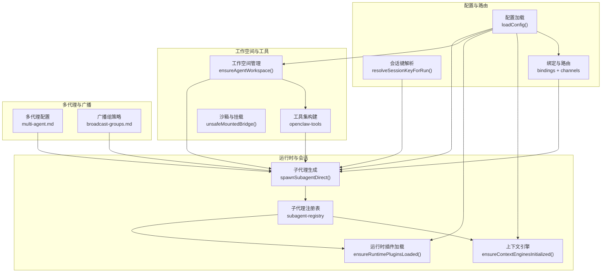
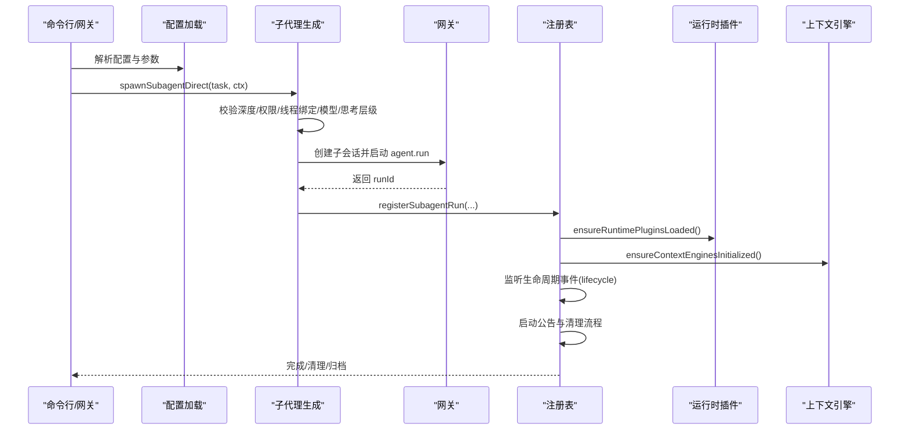
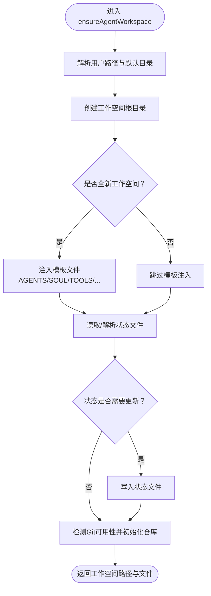
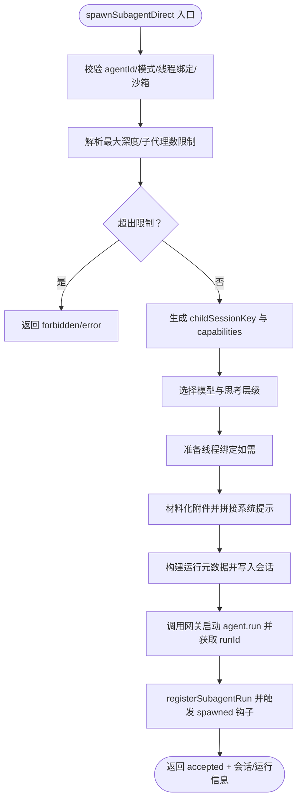
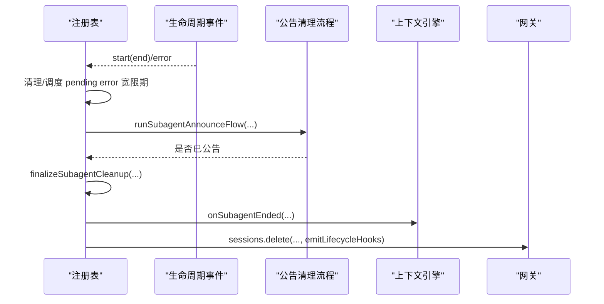
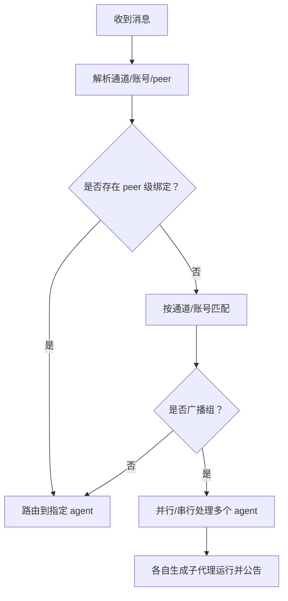
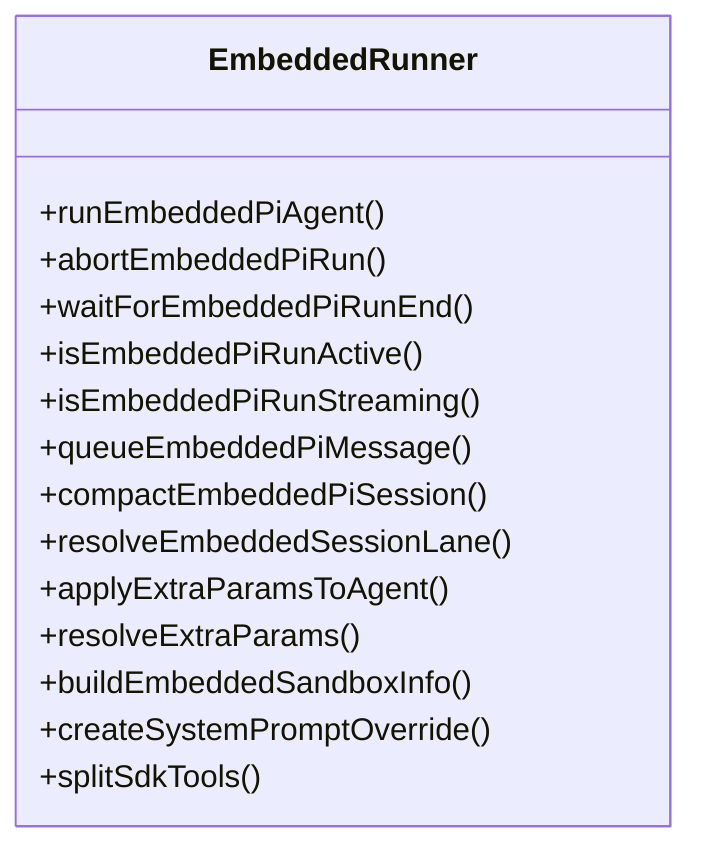
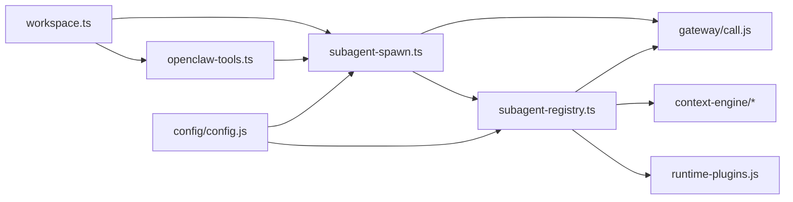

# 代理系统

<cite>
**本文引用的文件**
- [src/agents/workspace.ts](file://src/agents/workspace.ts)
- [src/agents/subagent-spawn.ts](file://src/agents/subagent-spawn.ts)
- [src/agents/subagent-registry.ts](file://src/agents/subagent-registry.ts)
- [src/agents/subagent-capabilities.ts](file://src/agents/subagent-capabilities.ts)
- [src/agents/pi-embedded.ts](file://src/agents/pi-embedded.ts)
- [src/agents/openclaw-tools.ts](file://src/agents/openclaw-tools.ts)
- [src/commands/agent.ts](file://src/commands/agent.ts)
- [src/commands/cleanup-utils.ts](file://src/commands/cleanup-utils.ts)
- [src/gateway/server-session-key.test.ts](file://src/gateway/server-session-key.test.ts)
- [docs/concepts/multi-agent.md](file://docs/concepts/multi-agent.md)
- [docs/channels/broadcast-groups.md](file://docs/channels/broadcast-groups.md)
- [src/agents/test-helpers/unsafe-mounted-sandbox.ts](file://src/agents/test-helpers/unsafe-mounted-sandbox.ts)
</cite>

## 目录
1. [引言](#引言)
2. [项目结构](#项目结构)
3. [核心组件](#核心组件)
4. [架构总览](#架构总览)
5. [详细组件分析](#详细组件分析)
6. [依赖关系分析](#依赖关系分析)
7. [性能考量](#性能考量)
8. [故障排查指南](#故障排查指南)
9. [结论](#结论)
10. [附录](#附录)

## 引言
本文件系统性阐述 OpenClaw 的代理系统架构与工作机制，重点覆盖以下主题：
- Pi Agent 运行时与嵌入式运行器（Embedded Runner）的设计与职责边界
- 代理循环（Agent Loop）与会话生命周期的管理策略
- 工作空间（Workspace）的初始化、隔离与持久化
- 多代理路由策略、跨代理通信与协作模式
- 子代理（Subagent）的生成、能力判定、控制范围与清理回收
- 生命周期管理、状态持久化与故障恢复
- 代理配置项、工具调用协调与会话隔离策略
- 性能监控、调试技巧与最佳实践

## 项目结构
OpenClaw 的代理系统由“配置与路由层”“运行时与会话层”“工作空间与工具层”“多代理与广播层”四部分协同构成。下图给出与本文相关的关键模块与交互关系。

**图表来源**
- [src/agents/subagent-spawn.ts:257-789](file://src/agents/subagent-spawn.ts#L257-L789)
- [src/agents/subagent-registry.ts:1-820](file://src/agents/subagent-registry.ts#L1-L820)
- [src/agents/workspace.ts:327-465](file://src/agents/workspace.ts#L327-L465)
- [src/agents/openclaw-tools.ts:60-88](file://src/agents/openclaw-tools.ts#L60-L88)
- [src/gateway/server-session-key.test.ts:34-72](file://src/gateway/server-session-key.test.ts#L34-L72)
- [docs/concepts/multi-agent.md:119-445](file://docs/concepts/multi-agent.md#L119-L445)
- [docs/channels/broadcast-groups.md:414-443](file://docs/channels/broadcast-groups.md#L414-L443)
- [src/agents/test-helpers/unsafe-mounted-sandbox.ts:1-29](file://src/agents/test-helpers/unsafe-mounted-sandbox.ts#L1-L29)

**章节来源**
- [src/agents/workspace.ts:1-648](file://src/agents/workspace.ts#L1-L648)
- [src/agents/subagent-spawn.ts:1-789](file://src/agents/subagent-spawn.ts#L1-L789)
- [src/agents/subagent-registry.ts:1-820](file://src/agents/subagent-registry.ts#L1-L820)
- [src/agents/openclaw-tools.ts:60-88](file://src/agents/openclaw-tools.ts#L60-L88)
- [src/gateway/server-session-key.test.ts:34-72](file://src/gateway/server-session-key.test.ts#L34-L72)
- [docs/concepts/multi-agent.md:119-445](file://docs/concepts/multi-agent.md#L119-L445)
- [docs/channels/broadcast-groups.md:414-443](file://docs/channels/broadcast-groups.md#L414-L443)
- [src/agents/test-helpers/unsafe-mounted-sandbox.ts:1-29](file://src/agents/test-helpers/unsafe-mounted-sandbox.ts#L1-L29)

## 核心组件
- 工作空间（Workspace）
  - 负责默认工作空间目录解析、模板文件注入、状态文件写入与 Git 初始化；提供边界安全读取与缓存以避免越界访问与缓存不一致。
  - 关键职责：初始化与校验、模板注入、状态追踪、Git 可用性检测与仓库初始化。
- 子代理生成（Subagent Spawn）
  - 提供统一入口 spawnSubagentDirect，完成任务参数校验、线程绑定准备、模型与思考层级选择、附件材料化、系统提示拼装、运行元数据继承与注册。
  - 关键职责：深度与权限控制、线程绑定、附件处理、运行元数据、生命周期事件钩子。
- 子代理注册表（Subagent Registry）
  - 维护子代理运行记录、生命周期事件监听、公告与清理流程、孤儿运行修复、归档与清理、冻结结果捕获与截断。
  - 关键职责：运行记录、重试与过期策略、公告清理、错误宽限期、归档回收。
- 工具集与会话上下文（OpenClaw Tools）
  - 构建工具列表时支持显式消息目标、禁用消息工具、请求者身份、会话 ID、工作空间继承等上下文参数，确保工具调用与会话隔离。
  - 关键职责：工具上下文、会话隔离、消息目标约束。
- 配置与会话键解析（CLI 与网关）
  - CLI 命令解析超时、思考层级与详细级别；网关侧会话键到运行键的组合存储解析与缓存。
  - 关键职责：命令行参数规范化、运行键解析与缓存。

**章节来源**
- [src/agents/workspace.ts:327-465](file://src/agents/workspace.ts#L327-L465)
- [src/agents/subagent-spawn.ts:257-789](file://src/agents/subagent-spawn.ts#L257-L789)
- [src/agents/subagent-registry.ts:1-820](file://src/agents/subagent-registry.ts#L1-L820)
- [src/agents/openclaw-tools.ts:60-88](file://src/agents/openclaw-tools.ts#L60-L88)
- [src/commands/agent.ts:571-610](file://src/commands/agent.ts#L571-L610)
- [src/gateway/server-session-key.test.ts:34-72](file://src/gateway/server-session-key.test.ts#L34-L72)

## 架构总览
下图展示从“命令行或网关入口”到“子代理运行与公告清理”的端到端流程，以及工作空间与工具在其中的角色。

**图表来源**
- [src/agents/subagent-spawn.ts:257-789](file://src/agents/subagent-spawn.ts#L257-L789)
- [src/agents/subagent-registry.ts:765-820](file://src/agents/subagent-registry.ts#L765-L820)
- [src/agents/workspace.ts:327-465](file://src/agents/workspace.ts#L327-L465)
- [src/agents/openclaw-tools.ts:60-88](file://src/agents/openclaw-tools.ts#L60-L88)

## 详细组件分析

### 工作空间管理（Workspace）
- 默认工作空间路径解析与环境变量、配置文件名映射
- 模板文件注入与缺失文件创建，保障首次运行体验
- 状态文件（workspace-state.json）版本化与迁移逻辑
- 边界安全读取与内容缓存，防止越界与缓存不一致
- Git 初始化与可用性检测，为后续审计与回溯提供基础

**图表来源**
- [src/agents/workspace.ts:327-465](file://src/agents/workspace.ts#L327-L465)

**章节来源**
- [src/agents/workspace.ts:1-648](file://src/agents/workspace.ts#L1-L648)

### 子代理生成与运行（Subagent Spawn）
- 参数校验与规范化：任务、标签、agentId、模型、思考层级、线程绑定、沙箱模式、附件等
- 深度与权限控制：最大生成深度、每会话最大子代理数量、允许跨代理生成的白名单
- 线程绑定：通过全局钩子准备线程绑定，保证会话持久化与后续跟进
- 附件材料化：将传入附件落盘、计算摘要、生成系统提示后缀
- 运行元数据继承：工作空间路径、分组信息、群组通道与空间等
- 生命周期钩子：spawned/ended 等钩子在成功启动后触发，失败时进行清理

**图表来源**
- [src/agents/subagent-spawn.ts:257-789](file://src/agents/subagent-spawn.ts#L257-L789)

**章节来源**
- [src/agents/subagent-spawn.ts:1-789](file://src/agents/subagent-spawn.ts#L1-L789)

### 子代理注册表与生命周期（Subagent Registry）
- 生命周期事件监听：对“start/end/error”事件进行响应，区分即时完成与延迟清理
- 错误宽限期：对嵌入式运行的瞬时 error 事件延迟清理，等待后续 start/end 决定最终状态
- 公告与清理：自动公告子代理完成结果至请求者，支持等待后代 settle 或硬性过期
- 归档与回收：按配置归档时间到期后删除运行记录与附件，并删除子会话
- 冻结结果：在完成时捕获并截断结果文本，避免超大输出影响性能

**图表来源**
- [src/agents/subagent-registry.ts:765-820](file://src/agents/subagent-registry.ts#L765-L820)

**章节来源**
- [src/agents/subagent-registry.ts:1-820](file://src/agents/subagent-registry.ts#L1-L820)

### 多代理路由与协作（Multi-Agent）
- 多代理即多人格、多账号、多会话隔离，支持按通道账号与直接/群组对等匹配
- 绑定规则优先级：按最具体匹配优先，peer 绑定优先于通道级规则
- 广播组策略：支持并行/串行两种处理策略，注意共享上下文与消息顺序、速率限制等限制
- 跨代理消息：默认关闭，需显式允许并在白名单内

**图表来源**
- [docs/concepts/multi-agent.md:119-445](file://docs/concepts/multi-agent.md#L119-L445)
- [docs/channels/broadcast-groups.md:414-443](file://docs/channels/broadcast-groups.md#L414-L443)

**章节来源**
- [docs/concepts/multi-agent.md:119-445](file://docs/concepts/multi-agent.md#L119-L445)
- [docs/channels/broadcast-groups.md:414-443](file://docs/channels/broadcast-groups.md#L414-L443)

### Pi Agent 运行时与嵌入式运行器（Embedded Runner）
- 导出接口：运行、中止、等待结束、历史限制、车道选择、沙箱信息、系统提示覆盖、工具拆分等
- 与注册表配合：通过 runId 与生命周期事件联动，完成公告与清理
- 与上下文引擎集成：在子代理结束时回调 onSubagentEnded，确保运行时插件重新加载与上下文引擎初始化

**图表来源**
- [src/agents/pi-embedded.ts:1-16](file://src/agents/pi-embedded.ts#L1-L16)

**章节来源**
- [src/agents/pi-embedded.ts:1-16](file://src/agents/pi-embedded.ts#L1-L16)
- [src/agents/subagent-registry.ts:315-335](file://src/agents/subagent-registry.ts#L315-L335)

### 工具调用协调与会话隔离（OpenClaw Tools）
- 支持显式消息目标、禁用消息工具、请求者身份与所有者标记、会话 ID、工作空间继承等
- 在子代理场景中，通过 spawnWorkspaceDir 将真实工作空间传递给子代理，避免只继承只读/空沙箱副本
- 与会话键解析配合，确保工具调用与会话隔离

**章节来源**
- [src/agents/openclaw-tools.ts:60-88](file://src/agents/openclaw-tools.ts#L60-L88)

### 会话键解析与运行键缓存（Gateway）
- 将运行键（runId）解析为会话键（sessionKey），并缓存以减少重复查询
- 对缺失键进行短暂缓存以避免频繁刷新

**章节来源**
- [src/gateway/server-session-key.test.ts:34-72](file://src/gateway/server-session-key.test.ts#L34-L72)

### 沙箱与挂载（Sandbox）
- 提供不安全挂载桥接示例，演示如何将 /agent 路径映射到宿主路径，便于外部配置的绑定挂载
- 用于测试与演示目的，生产使用需谨慎评估安全边界

**章节来源**
- [src/agents/test-helpers/unsafe-mounted-sandbox.ts:1-29](file://src/agents/test-helpers/unsafe-mounted-sandbox.ts#L1-L29)

## 依赖关系分析
- 组件耦合
  - 子代理生成依赖配置、会话键解析、线程绑定钩子、运行时状态与沙箱状态
  - 注册表依赖生命周期事件、公告清理流程、上下文引擎与运行时插件
  - 工具集依赖工作空间与会话上下文，确保工具调用隔离
- 外部依赖
  - 网关（Gateway）：会话创建、删除、补丁与运行启动
  - 上下文引擎：子代理结束回调与运行时插件加载
  - 文件系统：工作空间读写、附件落盘与状态文件

**图表来源**
- [src/agents/subagent-spawn.ts:1-789](file://src/agents/subagent-spawn.ts#L1-L789)
- [src/agents/subagent-registry.ts:1-820](file://src/agents/subagent-registry.ts#L1-L820)
- [src/agents/workspace.ts:1-648](file://src/agents/workspace.ts#L1-L648)
- [src/agents/openclaw-tools.ts:60-88](file://src/agents/openclaw-tools.ts#L60-L88)

**章节来源**
- [src/agents/subagent-spawn.ts:1-789](file://src/agents/subagent-spawn.ts#L1-L789)
- [src/agents/subagent-registry.ts:1-820](file://src/agents/subagent-registry.ts#L1-L820)
- [src/agents/workspace.ts:1-648](file://src/agents/workspace.ts#L1-L648)
- [src/agents/openclaw-tools.ts:60-88](file://src/agents/openclaw-tools.ts#L60-L88)

## 性能考量
- 缓存与重试
  - 注册表对公告重试采用指数退避与上限次数，避免无限重试导致资源浪费
  - 会话键解析对缺失键进行短期缓存，降低重复查询成本
- 结果截断
  - 冻结结果文本设置最大字节阈值并截断，防止超大输出影响性能
- 归档与清理
  - 按配置归档时间定期清理运行记录与附件，释放磁盘与内存压力
- I/O 优化
  - 工作空间文件读取采用边界安全打开与内容身份缓存，减少重复 IO 与越界风险

[本节为通用指导，无需列出具体文件来源]

## 故障排查指南
- 子代理无法启动
  - 检查深度与子代理数量限制、线程绑定钩子是否可用、沙箱模式是否匹配
  - 查看注册表对生命周期 error 的宽限期处理，确认最终清理是否触发
- 公告未送达或延迟
  - 关注公告重试计数与过期时间，检查后代 settle 等待条件
- 会话键解析异常
  - 确认组合会话存储是否正确加载，检查缓存命中情况
- 工作空间异常
  - 校验边界安全读取与模板注入是否成功，确认状态文件版本与迁移逻辑
- 清理与回收
  - 使用清理工具批量移除工作空间目录，结合会话目录枚举定位问题

**章节来源**
- [src/agents/subagent-registry.ts:117-133](file://src/agents/subagent-registry.ts#L117-L133)
- [src/gateway/server-session-key.test.ts:59-72](file://src/gateway/server-session-key.test.ts#L59-L72)
- [src/commands/cleanup-utils.ts:130-153](file://src/commands/cleanup-utils.ts#L130-L153)

## 结论
OpenClaw 的代理系统通过“工作空间—子代理生成—注册表—上下文引擎—网关”的分层设计，实现了可扩展、可隔离、可观测的多代理运行框架。其关键特性包括：
- 明确的子代理生成与能力判定机制，保障安全与可控
- 健壮的生命周期与公告清理流程，兼顾可靠性与性能
- 多代理路由与广播策略，满足多样化协作需求
- 工具调用与会话隔离策略，确保执行一致性与安全性

## 附录

### 代理配置要点（节选）
- 子代理最大生成深度与每会话最大子代理数
- 子代理运行超时默认值与覆盖方式
- 工具调用显式目标、禁用消息工具、请求者身份与会话 ID
- 工作空间继承与挂载策略

**章节来源**
- [src/agents/subagent-spawn.ts:305-316](file://src/agents/subagent-spawn.ts#L305-L316)
- [src/agents/openclaw-tools.ts:60-88](file://src/agents/openclaw-tools.ts#L60-L88)
- [src/commands/agent.ts:571-610](file://src/commands/agent.ts#L571-L610)